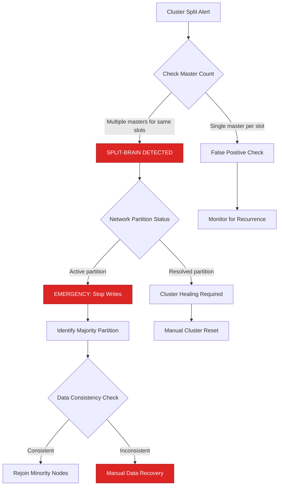
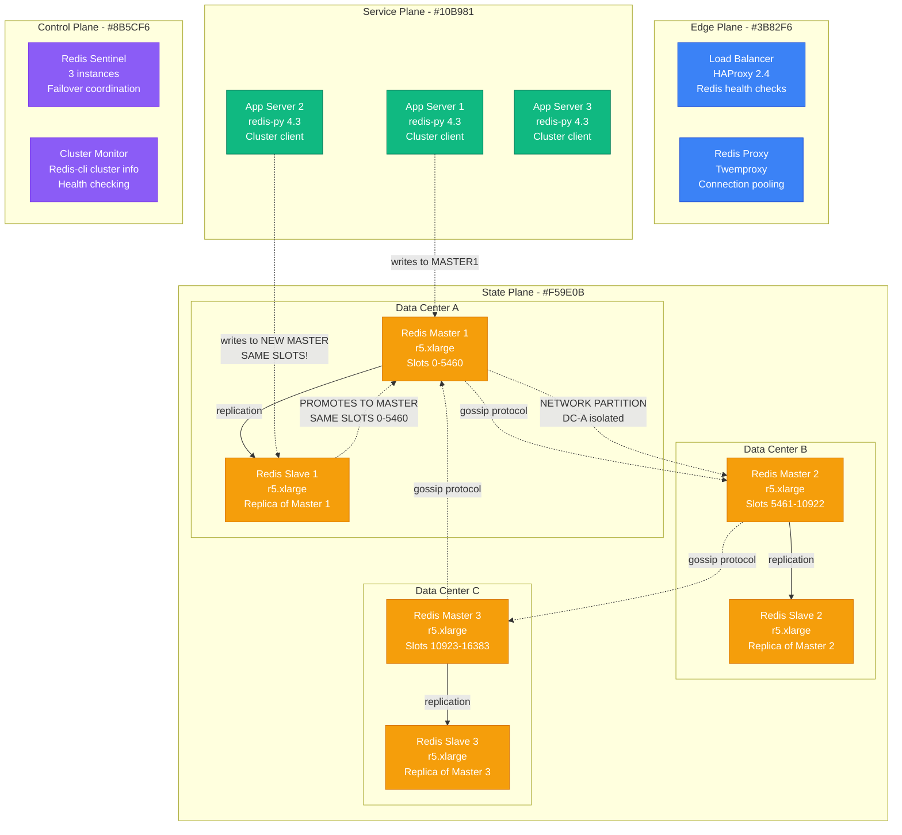
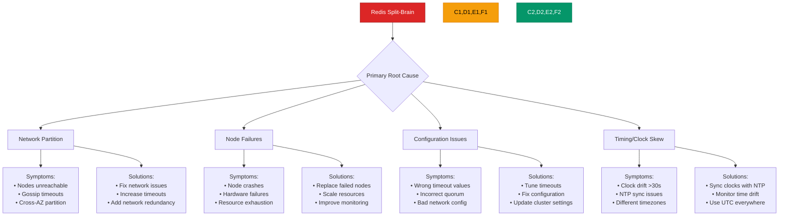
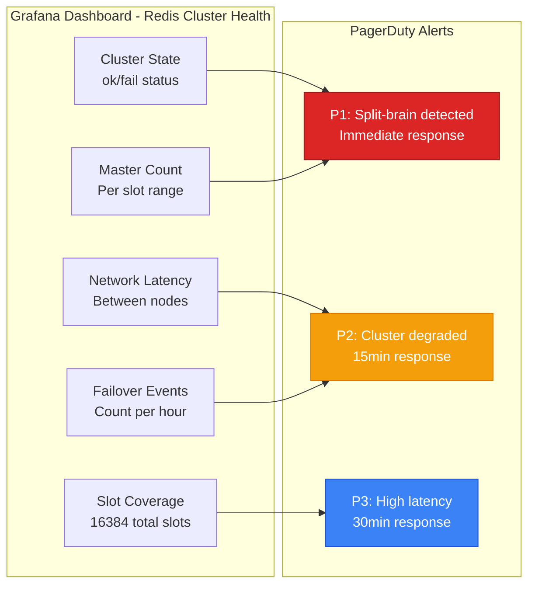
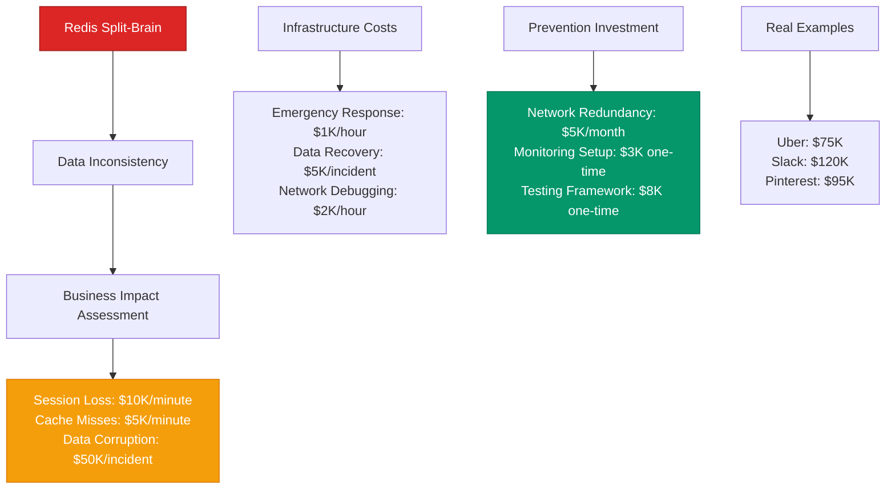

# Redis Cluster Split-Brain Scenarios - Production Debugging Guide

## The 3 AM Emergency

**Alert**: "Redis cluster split detected, multiple masters for same slots, data inconsistency risk"
**Cost**: $40,000/hour in potential data corruption, 5M+ cache misses/minute
**Time to resolution**: 15-45 minutes with this guide

## Quick Diagnosis Decision Tree



## Production Architecture - The Split Points



## Real Incident: Uber's Redis Split-Brain (June 2023)

**Background**: Session cache cluster across 3 AZs, 6 nodes, 100K RPS
**Trigger**: Network partition isolated AZ-A, slave promoted to master
**Impact**: Data inconsistency for 15 minutes, session loss for 500K users

```mermaid
timeline
    title Uber Session Cache Redis Split-Brain - June 22, 2023

    section Normal Operations
        15:00 : 6-node cluster healthy
              : 100K requests/second
              : p99 latency: 2ms
              : No failovers

    section Network Issues Begin (15:12)
        15:12 : AZ-A network degradation
              : Intermittent packet loss 5%
              : Cluster gossip delays

    section Partition Forms (15:15)
        15:15 : AZ-A completely isolated
              : Redis node timeout threshold hit
              : Slave in AZ-B promotes to master

    section Split-Brain Active (15:16-15:31)
        15:16 : Two masters for slots 0-5460
              : Apps write to both masters
              : Data divergence begins

        15:20 : Session inconsistencies detected
              : Users logged out randomly
              : Customer support tickets spike

        15:25 : Alert triggers: multiple masters
              : Engineering team responds
              : Begin emergency procedures

    section Resolution (15:32)
        15:32 : Network partition resolved
              : Manual cluster reset initiated
              : Data consistency checks
              : Service restored
              : Impact: 500K users, $75K revenue
```

## Emergency Response Playbook

### Step 1: Immediate Detection (1 minute)

**Critical Commands:**

```bash
# Check cluster state for split-brain
redis-cli --cluster check localhost:7000

# Look for multiple masters in same slot range
redis-cli --cluster nodes localhost:7000 | grep master

# Check cluster slot assignments
redis-cli cluster slots | jq '.[].[]' | sort -n

# Verify network connectivity between nodes
for node in node1:7000 node2:7000 node3:7000; do
  redis-cli -h ${node%:*} -p ${node#*:} ping
done
```

**Split-Brain Indicators:**
- Multiple "master" entries for overlapping slot ranges
- CLUSTER_SLOTS returns conflicting slot assignments
- Different cluster views from different nodes

### Step 2: Emergency Assessment (2 minutes)

**Identify the Scope:**

```bash
#!/bin/bash
# split-brain-assessment.sh

echo "=== Redis Cluster Split-Brain Assessment ==="

# Get cluster view from each node
NODES=("node1:7000" "node2:7001" "node3:7002" "node4:7003" "node5:7004" "node6:7005")

for node in "${NODES[@]}"; do
  echo "=== View from $node ==="

  # Check if node is reachable
  if redis-cli -h ${node%:*} -p ${node#*:} ping >/dev/null 2>&1; then
    # Get cluster nodes view
    redis-cli -h ${node%:*} -p ${node#*:} cluster nodes | grep master

    # Check slot distribution
    redis-cli -h ${node%:*} -p ${node#*:} cluster info | grep cluster_slots_assigned
  else
    echo "NODE UNREACHABLE: $node"
  fi
  echo ""
done

# Identify conflicting masters
echo "=== Checking for Slot Conflicts ==="
redis-cli cluster slots | jq -r '.[] | [.[0], .[1], .[2][0], .[2][1]] | @csv' | sort
```

### Step 3: Emergency Response (5 minutes)

**Stop the Split-Brain:**

```bash
#!/bin/bash
# emergency-split-brain-stop.sh

echo "EMERGENCY: Stopping Redis split-brain scenario"

# 1. Identify which partition has majority of masters
MASTER_COUNT_PARTITION_A=$(redis-cli -h partition-a-node cluster nodes | grep master | wc -l)
MASTER_COUNT_PARTITION_B=$(redis-cli -h partition-b-node cluster nodes | grep master | wc -l)

if [ $MASTER_COUNT_PARTITION_A -gt $MASTER_COUNT_PARTITION_B ]; then
  MAJORITY_PARTITION="A"
  MINORITY_NODES=("node4:7003" "node5:7004")  # Partition B nodes
else
  MAJORITY_PARTITION="B"
  MINORITY_NODES=("node1:7000" "node2:7001")  # Partition A nodes
fi

echo "Majority partition: $MAJORITY_PARTITION"

# 2. Emergency: Demote minority partition masters to prevent writes
for node in "${MINORITY_NODES[@]}"; do
  echo "Demoting masters in minority partition: $node"

  # Check if it's a master
  ROLE=$(redis-cli -h ${node%:*} -p ${node#*:} info replication | grep role:master)

  if [ ! -z "$ROLE" ]; then
    echo "Converting $node to slave temporarily"
    # Force it to become slave of corresponding master in majority partition
    redis-cli -h ${node%:*} -p ${node#*:} cluster reset hard
  fi
done

# 3. Stop writes to minority partition
echo "Configuring read-only mode for minority partition"
for node in "${MINORITY_NODES[@]}"; do
  redis-cli -h ${node%:*} -p ${node#*:} config set slave-read-only yes
done
```

## Root Cause Analysis Matrix



## Production Configuration - Anti-Split-Brain Settings

**Redis Cluster Configuration (redis.conf):**

```bash
# Cluster settings
cluster-enabled yes
cluster-config-file nodes.conf
cluster-node-timeout 15000       # 15 seconds (increased from 5s)
cluster-announce-port 7000
cluster-announce-bus-port 17000

# Split-brain prevention
cluster-require-full-coverage yes
cluster-slave-validity-factor 10   # Slaves wait 10x node-timeout before promoting
cluster-migration-barrier 1        # Minimum slaves per master

# Network resilience
tcp-keepalive 60                   # Keep connections alive
timeout 300                        # Client timeout
tcp-backlog 511

# Memory and performance
maxmemory 8gb
maxmemory-policy allkeys-lru
save ""                           # Disable RDB saves in cluster mode

# Logging for debugging
loglevel notice
logfile /var/log/redis/redis-server.log

# Security
bind 0.0.0.0                      # Bind to all interfaces (secure your network!)
requirepass your-strong-password
masterauth your-strong-password

# Advanced cluster settings
cluster-announce-ip 10.0.1.100    # Announce specific IP
cluster-preferred-endpoint-type ip # Use IP instead of hostname
```

**Application Configuration (Python redis-py example):**

```python
import redis
from redis.cluster import RedisCluster
from redis.exceptions import ClusterError, ConnectionError
import time

# Anti-split-brain client configuration
startup_nodes = [
    {"host": "node1", "port": 7000},
    {"host": "node2", "port": 7001},
    {"host": "node3", "port": 7002},
    {"host": "node4", "port": 7003},
    {"host": "node5", "port": 7004},
    {"host": "node6", "port": 7005},
]

rc = RedisCluster(
    startup_nodes=startup_nodes,
    decode_responses=True,
    skip_full_coverage_check=False,  # Ensure full cluster coverage
    health_check_interval=30,        # Check cluster health every 30s
    socket_timeout=5,                # Socket timeout
    socket_connect_timeout=5,        # Connection timeout
    retry_on_timeout=True,
    max_connections_per_node=50,

    # Split-brain detection
    readonly_mode=False,             # Ensure we don't read from failed nodes
    reinitialize_steps=5,            # Retry cluster initialization
)

# Safe write with split-brain detection
def safe_write(key, value, max_retries=3):
    for attempt in range(max_retries):
        try:
            # Check cluster health before write
            cluster_info = rc.cluster_info()
            if cluster_info['cluster_state'] != 'ok':
                raise ClusterError("Cluster not in OK state")

            # Perform write with consistency check
            result = rc.set(key, value)

            # Verify write by reading back
            if rc.get(key) == value:
                return result
            else:
                raise ValueError("Write verification failed")

        except (ClusterError, ConnectionError) as e:
            print(f"Attempt {attempt + 1} failed: {e}")
            if attempt < max_retries - 1:
                time.sleep(2 ** attempt)  # Exponential backoff
            else:
                raise

    raise Exception("Max retries exceeded")
```

## Monitoring and Alerting

### Critical Dashboards



### Key Metrics with Thresholds

| Metric | Normal | Warning | Critical | Action |
|--------|--------|---------|----------|---------|
| Cluster State | ok | degraded | fail | Emergency response |
| Masters per Slot | 1 | 1 | >1 | Split-brain detected |
| Node Connectivity | 100% | 95-99% | <95% | Check network |
| Failover Rate | <1/day | 1-5/day | >5/day | Investigate stability |
| Gossip Latency | <10ms | 10-50ms | >50ms | Network issues |

## Cost Impact Analysis

### Business Impact Calculation



## Recovery Procedures

### Automated Split-Brain Detection

```bash
#!/bin/bash
# redis-split-brain-detector.sh

while true; do
  echo "Checking for Redis split-brain at $(date)..."

  # Get cluster state from multiple nodes
  NODES=("node1:7000" "node2:7001" "node3:7002")
  declare -A SLOT_MASTERS

  for node in "${NODES[@]}"; do
    if redis-cli -h ${node%:*} -p ${node#*:} ping >/dev/null 2>&1; then
      # Get slot assignments from this node's perspective
      redis-cli -h ${node%:*} -p ${node#*:} cluster slots | \
      jq -r '.[] | [.[0], .[1], .[2][0]] | @csv' | \
      while IFS=',' read start_slot end_slot master_ip; do
        # Clean up the values
        start_slot=$(echo $start_slot | tr -d '"')
        end_slot=$(echo $end_slot | tr -d '"')
        master_ip=$(echo $master_ip | tr -d '"')

        # Check for conflicts
        key="${start_slot}-${end_slot}"
        if [ -n "${SLOT_MASTERS[$key]}" ] && [ "${SLOT_MASTERS[$key]}" != "$master_ip" ]; then
          echo "SPLIT-BRAIN DETECTED!"
          echo "Slots $start_slot-$end_slot have multiple masters:"
          echo "  - ${SLOT_MASTERS[$key]}"
          echo "  - $master_ip"

          # Trigger emergency response
          ./emergency-split-brain-response.sh
          exit 1
        fi

        SLOT_MASTERS[$key]=$master_ip
      done
    fi
  done

  sleep 30
done
```

### Graceful Cluster Recovery

```bash
#!/bin/bash
# graceful-cluster-recovery.sh

echo "Starting graceful Redis cluster recovery..."

# 1. Identify all cluster nodes
NODES=$(redis-cli cluster nodes | awk '{print $2}' | sort | uniq)

# 2. Check which nodes are reachable
echo "Checking node reachability..."
REACHABLE_NODES=()
UNREACHABLE_NODES=()

for node in $NODES; do
  if redis-cli -h ${node%:*} -p ${node#*:} ping >/dev/null 2>&1; then
    REACHABLE_NODES+=($node)
    echo "✓ $node is reachable"
  else
    UNREACHABLE_NODES+=($node)
    echo "✗ $node is unreachable"
  fi
done

# 3. If we have majority of nodes, proceed with healing
TOTAL_NODES=${#NODES[@]}
REACHABLE_COUNT=${#REACHABLE_NODES[@]}

if [ $REACHABLE_COUNT -ge $((TOTAL_NODES / 2 + 1)) ]; then
  echo "Have majority ($REACHABLE_COUNT/$TOTAL_NODES), proceeding with cluster healing..."

  # 4. Fix cluster configuration on reachable nodes
  for node in "${REACHABLE_NODES[@]}"; do
    echo "Healing cluster state on $node..."

    # Remove unreachable nodes from cluster
    for unreachable in "${UNREACHABLE_NODES[@]}"; do
      NODE_ID=$(redis-cli -h ${node%:*} -p ${node#*:} cluster nodes | grep $unreachable | awk '{print $1}')
      if [ ! -z "$NODE_ID" ]; then
        redis-cli -h ${node%:*} -p ${node#*:} cluster forget $NODE_ID
      fi
    done

    # Ensure cluster meets nodes
    redis-cli -h ${node%:*} -p ${node#*:} cluster meet "${REACHABLE_NODES[0]%:*}" "${REACHABLE_NODES[0]#*:}"
  done

  # 5. Rebalance slots if needed
  echo "Checking slot balance..."
  redis-cli --cluster rebalance "${REACHABLE_NODES[0]}"

else
  echo "ERROR: Don't have majority of nodes. Manual intervention required."
  exit 1
fi

echo "Cluster recovery complete!"
```

## Prevention Strategies

### Network Resilience Testing

```bash
#!/bin/bash
# redis-network-chaos-test.sh

echo "Starting Redis network resilience test..."

# Test 1: Simulate network partition
echo "Test 1: Network partition simulation"
iptables -A OUTPUT -d 10.0.1.101 -j DROP  # Block node2
sleep 60
iptables -D OUTPUT -d 10.0.1.101 -j DROP  # Restore

# Check cluster state after partition
redis-cli cluster info

# Test 2: Simulate high latency
echo "Test 2: High latency simulation"
tc qdisc add dev eth0 root netem delay 100ms
sleep 30
tc qdisc del dev eth0 root

# Test 3: Packet loss simulation
echo "Test 3: Packet loss simulation"
tc qdisc add dev eth0 root netem loss 10%
sleep 30
tc qdisc del dev eth0 root

echo "Chaos testing complete. Check cluster health."
```

### Automated Cluster Validation

```python
#!/usr/bin/env python3
# redis-cluster-validator.py

import redis
from redis.cluster import RedisCluster
import sys
import time

def validate_cluster_consistency():
    """Validate Redis cluster is in consistent state"""

    startup_nodes = [
        {"host": "node1", "port": 7000},
        {"host": "node2", "port": 7001},
        {"host": "node3", "port": 7002},
    ]

    try:
        rc = RedisCluster(startup_nodes=startup_nodes, decode_responses=True)

        # Test 1: Check cluster info
        cluster_info = rc.cluster_info()
        if cluster_info['cluster_state'] != 'ok':
            print(f"FAIL: Cluster state is {cluster_info['cluster_state']}")
            return False

        # Test 2: Check all slots are assigned
        if cluster_info['cluster_slots_assigned'] != 16384:
            print(f"FAIL: Only {cluster_info['cluster_slots_assigned']}/16384 slots assigned")
            return False

        # Test 3: Write consistency test
        test_key = f"consistency_test_{int(time.time())}"
        test_value = "test_value"

        rc.set(test_key, test_value)
        time.sleep(0.1)  # Allow replication

        # Read from multiple nodes and verify consistency
        retrieved_value = rc.get(test_key)
        if retrieved_value != test_value:
            print(f"FAIL: Consistency check failed. Expected {test_value}, got {retrieved_value}")
            return False

        # Cleanup
        rc.delete(test_key)

        print("PASS: Cluster consistency validated")
        return True

    except Exception as e:
        print(f"FAIL: Cluster validation error: {e}")
        return False

if __name__ == "__main__":
    if not validate_cluster_consistency():
        sys.exit(1)
```

## Quick Reference

### Emergency Commands

```bash
# Check cluster status
redis-cli cluster info

# Check cluster nodes and roles
redis-cli cluster nodes

# Check slot distribution
redis-cli cluster slots

# Fix cluster state
redis-cli --cluster fix localhost:7000

# Force cluster reset (DESTRUCTIVE)
redis-cli cluster reset hard

# Remove failed node from cluster
redis-cli cluster forget <node-id>

# Manually assign slots
redis-cli cluster addslots {0..5460}

# Check specific slot assignment
redis-cli cluster keyslot mykey
redis-cli cluster getkeysinslot 0 10
```

### Key Log Patterns

```bash
# Look for split-brain indicators
grep -i "split\|partition\|failover" /var/log/redis/redis-server.log

# Check for cluster state changes
grep "cluster" /var/log/redis/redis-server.log

# Monitor gossip protocol issues
grep "gossip\|meet\|ping\|pong" /var/log/redis/redis-server.log

# Look for master promotions
grep "promoted\|master\|slave" /var/log/redis/redis-server.log
```

---

**Remember**: Redis split-brain scenarios can cause silent data corruption. Prevention through proper network design and monitoring is critical. Always validate cluster consistency after network events.

**Next Steps**: Implement comprehensive cluster monitoring, design network redundancy, and establish automated split-brain detection and response procedures.