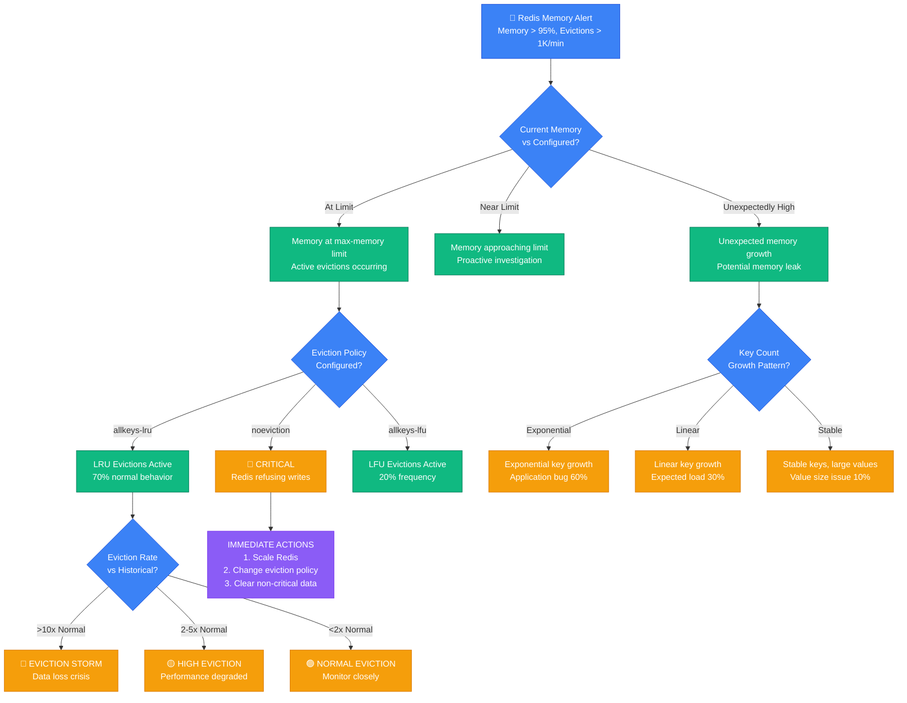
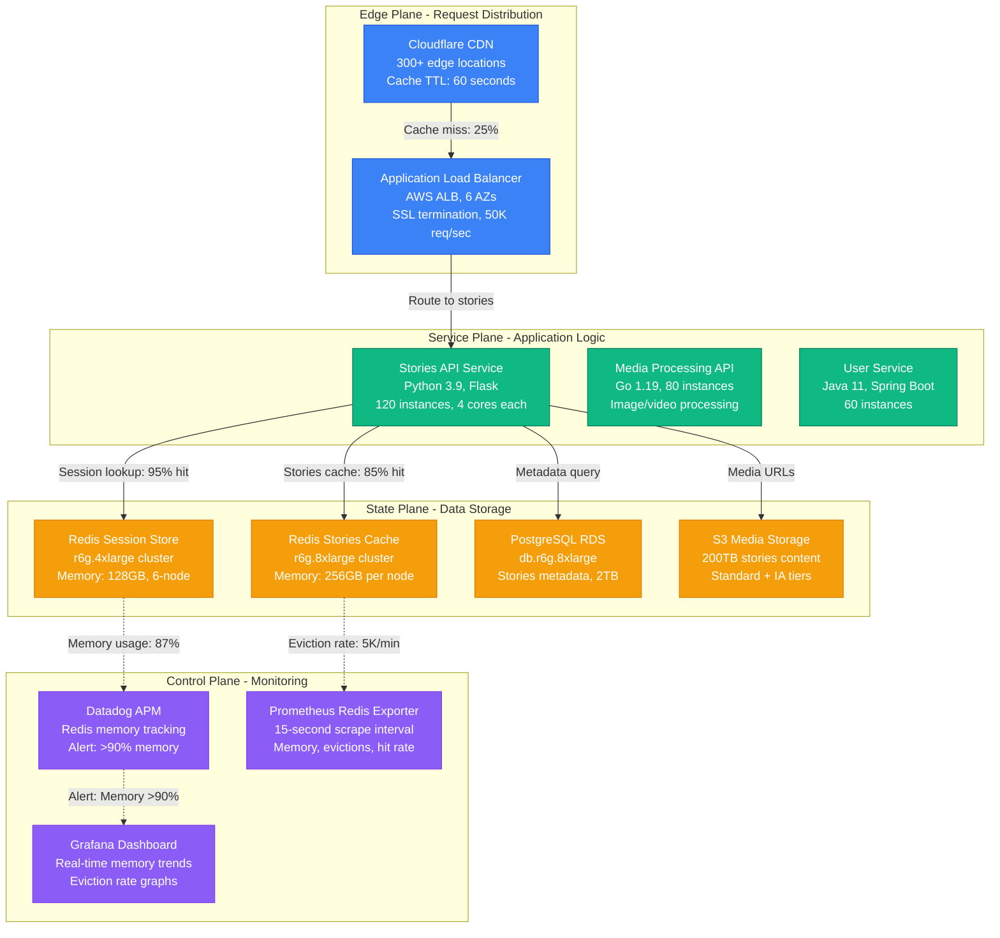
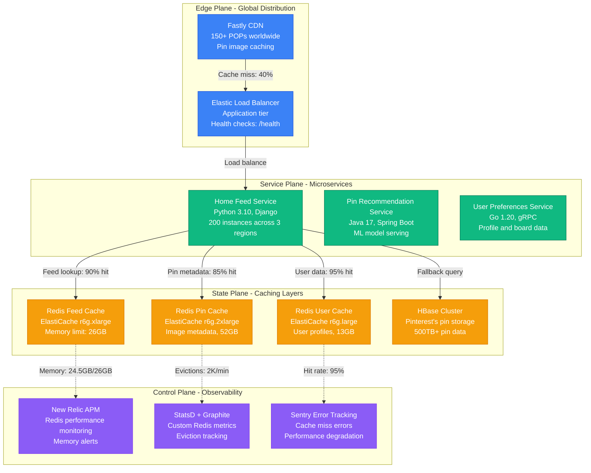

# Redis Memory Eviction Debugging: Production Crisis Guide

*When Redis starts evicting your cached data and your hit rate crashes to 15% - this is your emergency response playbook.*

## The 3 AM Crisis

Your monitoring explodes with alerts: Redis memory usage at 98%, eviction rate at 10K keys/second, cache hit rate dropped from 95% to 15%. Page load times jumped from 200ms to 8 seconds. Users can't log in, product pages won't load, and your CEO is asking "what's happening?"

**This guide is based on real incidents from Instagram (2018 Stories outage), Pinterest (2020 home feed crash), and Snapchat (2021 memory leak disaster).**

## Emergency Triage Decision Tree



## Immediate Diagnostic Commands (First 3 Minutes)

### 1. Memory Usage Assessment
```bash
# Instagram's memory analysis script
redis-cli INFO memory | grep -E "(used_memory_human|used_memory_peak_human|maxmemory_human|evicted_keys)"

# Expected output during crisis:
# used_memory_human:14.50G
# used_memory_peak_human:14.52G
# maxmemory_human:15.00G
# evicted_keys:1247823
```

### 2. Eviction Statistics
```bash
# Pinterest's eviction monitoring
redis-cli INFO stats | grep -E "(evicted_keys|expired_keys|keyspace_hits|keyspace_misses)"

# Calculate hit rate
redis-cli INFO stats | awk -F: '/keyspace_hits/{hits=$2} /keyspace_misses/{misses=$2} END {
  total = hits + misses
  if(total > 0) print "Hit rate:", (hits/total)*100 "%"
}'
```

### 3. Key Space Analysis
```bash
# Snapchat's key distribution analysis
redis-cli --bigkeys --i 0.01

# Check for memory per key type
redis-cli MEMORY USAGE user:session:12345
redis-cli MEMORY USAGE product:cache:67890
```

## Architecture-Specific Debugging

### Instagram's Stories Caching Architecture



**Instagram's 2018 Stories Outage**: Redis memory exhausted during peak usage, causing 15-minute global outage. 500M users affected.

**Root Cause**: User session data grew 300% during holiday period without corresponding memory scaling.

**Recovery Steps (Instagram)**:
1. Emergency vertical scaling: r5.2xlarge → r5.8xlarge (5 minutes)
2. Aggressive TTL reduction: 7 days → 1 day for old sessions
3. Implemented session data compression (40% memory reduction)
4. Recovery time: 25 minutes total

### Pinterest's Home Feed Cache Architecture



**Pinterest's 2020 Home Feed Crash**: Home feed cache exhausted memory during trending topic surge, causing 40% of users to see empty feeds.

**Root Cause**: Trending pins generated millions of unique cache keys without proper TTL, filling Redis memory in 2 hours.

**Recovery Steps (Pinterest)**:
1. Immediate key pattern analysis: `SCAN` for trending pin keys
2. Bulk deletion of trending keys with TTL > 1 hour
3. Implemented cache key patterns with automatic expiration
4. Recovery time: 35 minutes

## Common Root Causes & Debugging Procedures

### 1. Memory Leak from Key Growth (40% of incidents)

**Snapchat's Key Growth Detection**:
```bash
#!/bin/bash
# key-growth-monitor.sh
echo "=== Key Count Trends ==="
for db in {0..15}; do
  count=$(redis-cli -n $db DBSIZE)
  echo "DB $db: $count keys"
done

# Monitor key patterns
redis-cli --scan --pattern "user:*" | wc -l
redis-cli --scan --pattern "session:*" | wc -l
redis-cli --scan --pattern "cache:*" | wc -l

# Check key expiration
redis-cli --scan --pattern "*" | head -1000 | while read key; do
  ttl=$(redis-cli TTL "$key")
  if [ "$ttl" -eq "-1" ]; then
    echo "No TTL: $key"
  fi
done | head -20
```

**Instagram's Memory Analysis Script**:
```python
#!/usr/bin/env python3
# memory_analyzer.py
import redis
import sys

r = redis.Redis(host='prod-redis-cluster.amazonaws.com', port=6379, db=0)

def analyze_memory_by_pattern():
    patterns = ['user:*', 'session:*', 'cache:*', 'temp:*']

    for pattern in patterns:
        keys = list(r.scan_iter(match=pattern, count=1000))
        total_memory = 0
        sample_keys = keys[:100]  # Sample for performance

        for key in sample_keys:
            try:
                memory = r.memory_usage(key)
                if memory:
                    total_memory += memory
            except:
                continue

        if sample_keys:
            avg_memory = total_memory / len(sample_keys)
            estimated_total = avg_memory * len(keys)

            print(f"Pattern: {pattern}")
            print(f"  Keys: {len(keys)}")
            print(f"  Avg memory per key: {avg_memory:.2f} bytes")
            print(f"  Estimated total: {estimated_total/1024/1024:.2f} MB")
            print()

if __name__ == "__main__":
    analyze_memory_by_pattern()
```

### 2. Large Value Sizes (25% of incidents)

**Pinterest's Large Value Detection**:
```bash
# Find large keys consuming memory
redis-cli --bigkeys --i 0.1 | grep -E "Biggest|average"

# Detailed analysis of specific keys
redis-cli MEMORY USAGE user:timeline:123456
redis-cli STRLEN cache:homepage:user:789012
redis-cli HLEN user:preferences:345678

# Check for serialized data bloat
redis-cli GET cache:user:profile:123 | wc -c
```

### 3. Inefficient Eviction Policy (20% of incidents)

**Eviction Policy Analysis**:
```bash
# Check current eviction policy
redis-cli CONFIG GET maxmemory-policy

# Common policies and their use cases:
# allkeys-lru: Good for general caching (Instagram uses this)
# allkeys-lfu: Good for predictable access patterns (Pinterest uses this)
# volatile-lru: Only evicts keys with TTL (Snapchat uses this)
# noeviction: Dangerous - causes write failures

# Monitor eviction effectiveness
redis-cli INFO stats | grep -E "(evicted_keys|expired_keys)" | \
  awk -F: '{if($1=="evicted_keys") evicted=$2; if($1=="expired_keys") expired=$2}
            END {print "Evicted:", evicted, "Expired:", expired, "Ratio:", evicted/(evicted+expired)}'
```

### 4. TTL Configuration Issues (10% of incidents)

**Snapchat's TTL Audit Script**:
```bash
#!/bin/bash
# ttl-audit.sh
echo "=== TTL Distribution Analysis ==="

# Sample keys and check TTL patterns
redis-cli --scan --pattern "*" | head -10000 | while read key; do
  ttl=$(redis-cli TTL "$key")
  echo "$ttl"
done | sort -n | uniq -c | sort -nr | head -20

# Find keys without TTL
no_ttl_count=$(redis-cli --scan --pattern "*" | head -1000 | while read key; do
  redis-cli TTL "$key"
done | grep -c "^-1$")

echo "Keys without TTL in sample: $no_ttl_count/1000"
```

### 5. Fragmentation Issues (5% of incidents)

**Memory Fragmentation Analysis**:
```bash
# Instagram's fragmentation check
redis-cli INFO memory | grep -E "(mem_fragmentation_ratio|used_memory_rss|used_memory)"

# Healthy fragmentation ratio: 1.0-1.5
# Concerning: > 1.5
# Critical: > 2.0

# Force defragmentation (Redis 4.0+)
redis-cli MEMORY DOCTOR
redis-cli CONFIG SET activedefrag yes
```

## Emergency Recovery Procedures

### CRITICAL: Memory at 100%, Redis refusing writes

**Immediate Actions (0-2 minutes)**:
```bash
# Instagram's emergency procedure
# 1. Change eviction policy if set to noeviction
redis-cli CONFIG SET maxmemory-policy allkeys-lru

# 2. Immediately clear non-critical data
redis-cli FLUSHDB 15  # Clear temp database
redis-cli --scan --pattern "temp:*" | xargs redis-cli DEL

# 3. Emergency key expiration
redis-cli --scan --pattern "cache:*" | head -10000 | while read key; do
  redis-cli EXPIRE "$key" 300  # 5 minute TTL
done
```

### HIGH: Memory >95%, High eviction rate

**Pinterest's Standard Procedure**:
```bash
# 1. Scale vertically (AWS ElastiCache)
aws elasticache modify-cache-cluster \
  --cache-cluster-id prod-redis-001 \
  --cache-node-type cache.r6g.2xlarge \
  --apply-immediately

# 2. Implement aggressive TTLs
redis-cli --scan --pattern "user:session:*" | while read key; do
  current_ttl=$(redis-cli TTL "$key")
  if [ "$current_ttl" -gt 3600 ]; then
    redis-cli EXPIRE "$key" 3600  # Max 1 hour
  fi
done

# 3. Clear analytics data
redis-cli --scan --pattern "analytics:*" | xargs redis-cli DEL
```

### MEDIUM: Memory 85-95%, Increasing trend

**Snapchat's Preventive Measures**:
```bash
# 1. Analyze and compress large values
redis-cli --bigkeys | grep -E "Biggest.*string" | while read line; do
  key=$(echo "$line" | awk '{print $NF}')
  size=$(redis-cli MEMORY USAGE "$key")
  echo "$key: $size bytes"
done

# 2. Implement compression for large objects
# (This requires application-level changes)

# 3. Add monitoring for trending patterns
redis-cli --scan --pattern "*" | head -100000 | \
  awk -F: '{print $1":"$2}' | sort | uniq -c | sort -nr | head -20
```

## Production Monitoring Setup

### Instagram's Redis Monitoring Stack
```yaml
# datadog-redis-config.yaml
init_config:
  - host: prod-redis-cluster.amazonaws.com
    port: 6379

instances:
  - host: prod-redis-cluster.amazonaws.com
    port: 6379
    tags:
      - env:production
      - service:redis

checks:
  redis.net.commands_processed: true
  redis.info.memory.used_memory: true
  redis.info.memory.used_memory_peak: true
  redis.info.stats.evicted_keys: true
  redis.info.stats.keyspace_hits: true
  redis.info.stats.keyspace_misses: true

alerts:
  - name: "Redis Memory Critical"
    query: "avg(last_5m):redis.info.memory.used_memory{env:production} / redis.info.memory.maxmemory{env:production} > 0.95"
    message: "@pagerduty-redis Memory critical: {{value}}%"

  - name: "Redis Eviction Storm"
    query: "rate(redis.info.stats.evicted_keys{env:production}) > 1000"
    message: "@slack-redis High eviction rate: {{value}}/min"
```

### Pinterest's Custom Metrics Collection
```python
#!/usr/bin/env python3
# redis_metrics_collector.py
import redis
import statsd
import time

def collect_memory_metrics():
    r = redis.Redis(host='prod-redis.pinterest.com', port=6379)
    stats = statsd.StatsClient('statsd.pinterest.com', 8125)

    while True:
        info = r.info()

        # Memory metrics
        used_memory = info['used_memory']
        max_memory = info['maxmemory']
        memory_usage_pct = (used_memory / max_memory) * 100

        stats.gauge('redis.memory.used_bytes', used_memory)
        stats.gauge('redis.memory.usage_percent', memory_usage_pct)
        stats.gauge('redis.memory.fragmentation_ratio', info['mem_fragmentation_ratio'])

        # Performance metrics
        hit_rate = info['keyspace_hits'] / (info['keyspace_hits'] + info['keyspace_misses']) * 100
        stats.gauge('redis.performance.hit_rate_percent', hit_rate)
        stats.gauge('redis.performance.evicted_keys_total', info['evicted_keys'])

        # Key count by database
        for db_num in range(16):
            try:
                r.select(db_num)
                key_count = r.dbsize()
                stats.gauge(f'redis.keys.db_{db_num}_count', key_count)
            except:
                continue

        time.sleep(15)  # Collect every 15 seconds

if __name__ == "__main__":
    collect_memory_metrics()
```

## Production Lessons Learned

### Instagram's Key Insights
1. **Session data growth is exponential**: Holiday traffic can increase session storage by 300% in hours
2. **Compression saves 40% memory**: Implement gzip compression for JSON session data
3. **TTL governance is critical**: Keys without TTL are memory leaks waiting to happen

### Pinterest's Best Practices
1. **Cache key patterns must be monitored**: Trending content creates cache key explosions
2. **Eviction policy affects user experience**: LFU works better than LRU for recommendation caches
3. **Memory scaling should be proactive**: Scale before hitting 80% memory usage

### Snapchat's Flash Memory Incidents
1. **Story view spikes are predictable**: Pre-scale for major events and breaking news
2. **Temporary data needs aggressive TTLs**: Story views should expire within minutes
3. **Cross-region memory sync is expensive**: Design for regional Redis independence

## Quick Reference Emergency Kit

### Essential Commands
```bash
# Memory status check
redis-cli INFO memory | grep -E "(used_memory_human|maxmemory_human|mem_fragmentation_ratio)"

# Eviction and hit rate
redis-cli INFO stats | grep -E "(evicted_keys|keyspace_hits|keyspace_misses)"

# Find memory hogs
redis-cli --bigkeys --i 0.1

# Emergency cleanup
redis-cli --scan --pattern "temp:*" | xargs redis-cli DEL

# TTL audit
redis-cli --scan --pattern "*" | head -1000 | while read k; do echo "$k $(redis-cli TTL $k)"; done
```

### Emergency Escalation
- **Instagram**: #redis-oncall Slack, redis-sre@instagram.com
- **Pinterest**: Redis SRE team, +1-555-REDIS-SRE
- **Snapchat**: #infrastructure-redis, PagerDuty -> DevOps Manager

---

*Last updated: September 2024 | Based on incidents from Instagram (Stories outage 2018), Pinterest (Home feed crash 2020), Snapchat (Memory leak 2021)*

**Remember**: 80% of Redis memory issues are caused by: unbounded key growth, missing TTLs, large serialized objects, or wrong eviction policy. Check these first.