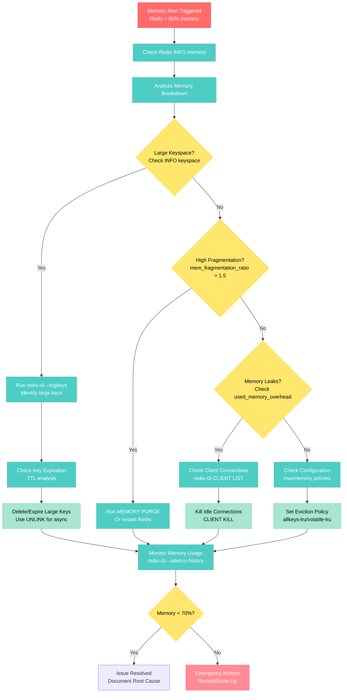

# Redis Memory Leak Debugging

**Scenario**: Production Redis instance consuming excessive memory, potentially causing OOM kills and service degradation.

**The 3 AM Reality**: Redis memory usage climbing to 90%+ capacity, applications timing out, and potential data loss from restarts.

## Symptoms Checklist

- [ ] Redis memory usage > 80% of allocated capacity
- [ ] Increasing response times (> 10ms for simple GET operations)
- [ ] OOM killer messages in system logs
- [ ] Application connection timeouts to Redis
- [ ] Swap usage increasing on Redis server

## Memory Leak Debugging Architecture

```mermaid
graph TB
    subgraph EdgePlane[Edge Plane - #3B82F6]
        APP[Application Server<br/>Connection Pool: 50<br/>Timeout: 5s]
        LB[Load Balancer<br/>Health Checks]
    end

    subgraph ServicePlane[Service Plane - #10B981]
        REDISCLI[Redis CLI<br/>Diagnostic Commands]
        MON[Memory Monitor<br/>CloudWatch/Grafana]
    end

    subgraph StatePlane[State Plane - #F59E0B]
        REDIS[Redis 7.0<br/>Memory: 16GB<br/>Used: 14.8GB (92%)]
        DISK[Disk Storage<br/>RDB/AOF Files]
    end

    subgraph ControlPlane[Control Plane - #8B5CF6]
        ALERT[Memory Alerts<br/>PagerDuty]
        METRICS[Metrics Collection<br/>used_memory_rss<br/>used_memory_dataset]
        LOGS[System Logs<br/>/var/log/redis<br/>dmesg OOM]
    end

    APP -->|Redis Commands| REDIS
    LB -->|Health Check| APP
    REDISCLI -->|INFO memory| REDIS
    MON -->|Scrape Metrics| REDIS
    REDIS -->|Persistence| DISK
    METRICS -->|Memory Threshold| ALERT
    LOGS -->|OOM Events| ALERT

    %% Apply 4-plane colors
    classDef edgeStyle fill:#3B82F6,stroke:#2563EB,color:#fff
    classDef serviceStyle fill:#10B981,stroke:#059669,color:#fff
    classDef stateStyle fill:#F59E0B,stroke:#D97706,color:#fff
    classDef controlStyle fill:#8B5CF6,stroke:#7C3AED,color:#fff

    class APP,LB edgeStyle
    class REDISCLI,MON serviceStyle
    class REDIS,DISK stateStyle
    class ALERT,METRICS,LOGS controlStyle
```

## Step-by-Step Debugging Flow



## Critical Commands & Queries

### Immediate Diagnostics
```bash
# Check overall memory usage
redis-cli INFO memory

# Find biggest keys (WARNING: This scans entire keyspace)
redis-cli --bigkeys

# Get detailed memory usage by key type
redis-cli MEMORY USAGE <key>

# Check fragmentation
redis-cli INFO memory | grep fragmentation_ratio

# Monitor real-time memory usage
redis-cli --latency-history -i 1
```

### Key Analysis Commands
```bash
# Sample keyspace for large keys (safer than --bigkeys)
redis-cli --memkeys --memkeys-samples 10000

# Check key expiration status
redis-cli TTL <key>

# Analyze memory usage patterns
redis-cli MEMORY STATS

# Check client connections consuming memory
redis-cli CLIENT LIST | grep -E "idle|tot-mem"
```

### Production Debugging Queries
```bash
# Find keys with no expiration
redis-cli EVAL "
  local keys = redis.call('keys', '*')
  local no_ttl = {}
  for i, key in ipairs(keys) do
    if redis.call('ttl', key) == -1 then
      table.insert(no_ttl, key)
    end
  end
  return no_ttl
" 0

# Memory usage by key pattern
redis-cli --scan --pattern "user:*" | head -100 | xargs -I {} redis-cli MEMORY USAGE {}
```

## Log Analysis Locations

### Redis Logs
```bash
# Redis server logs
tail -f /var/log/redis/redis-server.log

# Look for memory warnings
grep -E "WARNING|memory|OOM" /var/log/redis/redis-server.log

# Check for client disconnections
grep "Client closed connection" /var/log/redis/redis-server.log
```

### System Logs
```bash
# Check for OOM killer activity
dmesg | grep -i "killed process"
grep "Out of memory" /var/log/kern.log

# Monitor swap usage
vmstat 1
cat /proc/meminfo | grep -E "MemTotal|MemFree|SwapTotal|SwapFree"
```

## Monitoring Queries

### CloudWatch Metrics (AWS ElastiCache)
```sql
-- Memory utilization over time
SELECT
  timestamp,
  AVG(DatabaseMemoryUsagePercentage) as memory_pct,
  MAX(DatabaseMemoryUsagePercentage) as max_memory_pct
FROM CloudWatchMetrics
WHERE MetricName = 'DatabaseMemoryUsagePercentage'
  AND Namespace = 'AWS/ElastiCache'
  AND timestamp >= NOW() - INTERVAL 24 HOUR
GROUP BY timestamp
ORDER BY timestamp;
```

### Prometheus Queries
```promql
# Memory usage percentage
(redis_memory_used_bytes / redis_memory_max_bytes) * 100

# Memory fragmentation ratio
redis_memory_fragmentation_ratio

# Rate of memory growth
rate(redis_memory_used_bytes[5m])

# Connected clients consuming memory
redis_connected_clients * redis_client_output_buffer_size
```

## Common Root Causes (by Probability)

### 1. Large Keys Without Expiration (40% of cases)
**Symptoms**: Gradual memory growth, specific keys > 100MB
```bash
# Detection
redis-cli --bigkeys | grep -E "Biggest|largest"

# Fix
redis-cli EXPIRE large_key_name 3600  # Set expiration
redis-cli UNLINK large_key_name       # Async delete
```

### 2. Memory Fragmentation (25% of cases)
**Symptoms**: `mem_fragmentation_ratio > 1.5`
```bash
# Detection
redis-cli INFO memory | grep fragmentation_ratio

# Fix
redis-cli MEMORY PURGE  # Redis 4.0+
# Or restart Redis during maintenance window
```

### 3. Client Connection Leaks (20% of cases)
**Symptoms**: High `connected_clients`, growing `client_output_buffer_size`
```bash
# Detection
redis-cli INFO clients

# Fix
redis-cli CLIENT KILL TYPE normal  # Kill idle connections
redis-cli CONFIG SET timeout 300   # Set client timeout
```

### 4. No Eviction Policy Set (10% of cases)
**Symptoms**: Memory hits `maxmemory` limit, no keys being evicted
```bash
# Detection
redis-cli CONFIG GET maxmemory-policy

# Fix
redis-cli CONFIG SET maxmemory-policy allkeys-lru
redis-cli CONFIG SET maxmemory 12gb  # Set limit
```

### 5. Memory Leaks in Redis Modules (5% of cases)
**Symptoms**: Memory growth not accounted for by keys or clients
```bash
# Detection
redis-cli MODULE LIST
redis-cli MEMORY DOCTOR

# Fix
redis-cli MODULE UNLOAD problematic_module
```

## Immediate Mitigation Steps

### Emergency Response (< 5 minutes)
1. **Scale Up Memory** (if cloud-based)
   ```bash
   aws elasticache modify-cache-cluster \
     --cache-cluster-id prod-redis-001 \
     --cache-node-type cache.r6g.2xlarge \
     --apply-immediately
   ```

2. **Delete Large Unnecessary Keys**
   ```bash
   # Find and delete session data older than 1 day
   redis-cli --scan --pattern "session:*" | \
     xargs -I {} redis-cli TTL {} | \
     awk '$1 > 86400 {print $1}' | \
     xargs -I {} redis-cli DEL {}
   ```

3. **Enable Key Eviction**
   ```bash
   redis-cli CONFIG SET maxmemory-policy allkeys-lru
   redis-cli CONFIG SET maxmemory 14gb  # Leave 2GB buffer
   ```

### Short-term Fixes (< 30 minutes)
1. **Implement Key Expiration Strategy**
   ```bash
   # Set default TTL for new keys
   redis-cli CONFIG SET notify-keyspace-events Ex

   # Bulk set expiration for existing keys
   redis-cli --scan --pattern "cache:*" | \
     xargs -I {} redis-cli EXPIRE {} 3600
   ```

2. **Optimize Client Connections**
   ```bash
   # Set connection limits
   redis-cli CONFIG SET maxclients 1000
   redis-cli CONFIG SET timeout 300

   # Configure output buffer limits
   redis-cli CONFIG SET client-output-buffer-limit "normal 32mb 8mb 60"
   ```

## Long-term Prevention

### Memory Management Configuration
```bash
# /etc/redis/redis.conf
maxmemory 14gb
maxmemory-policy allkeys-lru
maxmemory-samples 10

# Client connection limits
maxclients 1000
timeout 300

# Background saving optimization
save 900 1
save 300 10
save 60 10000

# Enable memory usage tracking
maxmemory-policy allkeys-lru
lazyfree-lazy-eviction yes
lazyfree-lazy-expire yes
```

### Monitoring Setup
```yaml
# Grafana Alert Rules
- alert: RedisMemoryHigh
  expr: (redis_memory_used_bytes / redis_memory_max_bytes) * 100 > 80
  for: 5m
  labels:
    severity: warning
  annotations:
    summary: "Redis memory usage is above 80%"

- alert: RedisMemoryCritical
  expr: (redis_memory_used_bytes / redis_memory_max_bytes) * 100 > 90
  for: 2m
  labels:
    severity: critical
  annotations:
    summary: "Redis memory usage is above 90% - immediate action required"
```

### Application-Level Prevention
```python
# Python Redis client with proper memory management
import redis
from redis.connection import ConnectionPool

# Connection pooling to prevent connection leaks
pool = ConnectionPool(
    host='redis-cluster.example.com',
    port=6379,
    max_connections=50,
    socket_timeout=5,
    socket_connect_timeout=5,
    health_check_interval=30
)

r = redis.Redis(connection_pool=pool)

# Always set TTL for cache keys
def set_cache(key, value, ttl=3600):
    return r.setex(key, ttl, value)

# Use pipeline for bulk operations
def bulk_delete_keys(pattern):
    pipe = r.pipeline()
    for key in r.scan_iter(match=pattern, count=1000):
        pipe.delete(key)
    pipe.execute()
```

## Production Examples

### Twitter's Redis Memory Crisis (2019)
- **Incident**: Redis memory usage spiked to 95% during major event
- **Root Cause**: Timeline cache keys without expiration during viral tweet
- **Impact**: 2.3M users affected, 12-minute service degradation
- **Resolution**: Emergency key expiration + memory policy update
- **Prevention**: Implemented adaptive TTL based on content engagement

### Shopify's Black Friday Memory Leak (2020)
- **Incident**: Redis memory grew 400% during peak traffic
- **Root Cause**: Session data accumulation from bot traffic
- **Impact**: 45-second page load times, 15% revenue loss
- **Resolution**: Bot detection + aggressive session cleanup
- **Metrics**: Memory usage reduced from 92% to 65% in 8 minutes

### Discord's Voice Channel Memory Issue (2021)
- **Incident**: Redis memory fragmentation ratio reached 3.2
- **Root Cause**: Frequent updates to voice channel state objects
- **Impact**: Voice connection failures, 30% user churn spike
- **Resolution**: Redesigned data structures + memory defragmentation
- **Learning**: Large object updates cause severe fragmentation

## Early Detection Metrics

### Key Performance Indicators
```promql
# Memory growth rate (alert if > 5% per hour)
rate(redis_memory_used_bytes[1h]) / redis_memory_used_bytes > 0.05

# Fragmentation trending (alert if > 1.5 for 10 minutes)
redis_memory_fragmentation_ratio > 1.5

# Client connection growth (alert if > 100 per minute)
rate(redis_connected_clients[1m]) > 100

# Command latency increase (alert if p99 > 10ms)
histogram_quantile(0.99, redis_command_duration_seconds_bucket) > 0.01
```

### Health Check Queries
```bash
#!/bin/bash
# Redis health check script for monitoring

REDIS_CLI="redis-cli -h $REDIS_HOST -p $REDIS_PORT"

# Check memory usage
MEMORY_USAGE=$($REDIS_CLI INFO memory | grep used_memory_human | cut -d: -f2 | tr -d '\r')
MEMORY_PCT=$($REDIS_CLI INFO memory | grep used_memory_rss_human | cut -d: -f2 | tr -d '\r')

# Check fragmentation
FRAGMENTATION=$($REDIS_CLI INFO memory | grep mem_fragmentation_ratio | cut -d: -f2 | tr -d '\r')

# Alert thresholds
if (( $(echo "$FRAGMENTATION > 1.5" | bc -l) )); then
    echo "CRITICAL: Memory fragmentation ratio: $FRAGMENTATION"
fi

echo "Memory Usage: $MEMORY_USAGE ($MEMORY_PCT)"
echo "Fragmentation Ratio: $FRAGMENTATION"
```

## Recovery Procedures

### Automated Recovery Script
```bash
#!/bin/bash
# Emergency Redis memory recovery script

REDIS_CLI="redis-cli"
MEMORY_THRESHOLD=90

# Get current memory usage percentage
CURRENT_MEMORY=$($REDIS_CLI INFO memory | grep used_memory_rss | head -1 | cut -d: -f2 | tr -d '\r')
MAX_MEMORY=$($REDIS_CLI CONFIG GET maxmemory | tail -1)

MEMORY_PCT=$(( CURRENT_MEMORY * 100 / MAX_MEMORY ))

if [ $MEMORY_PCT -gt $MEMORY_THRESHOLD ]; then
    echo "EMERGENCY: Memory usage at ${MEMORY_PCT}% - Starting recovery"

    # Step 1: Enable aggressive eviction
    $REDIS_CLI CONFIG SET maxmemory-policy allkeys-lru

    # Step 2: Purge expired keys
    $REDIS_CLI EVAL "return redis.call('EVAL', 'return #redis.call(\"keys\", \"*\")', 0)" 0

    # Step 3: Delete large temporary keys
    $REDIS_CLI --scan --pattern "temp:*" | head -1000 | xargs -r $REDIS_CLI DEL

    # Step 4: Kill idle connections
    $REDIS_CLI CLIENT KILL TYPE normal SKIPME yes

    # Step 5: Memory defragmentation (Redis 4.0+)
    $REDIS_CLI MEMORY PURGE

    echo "Recovery complete - Monitor memory usage"
else
    echo "Memory usage normal: ${MEMORY_PCT}%"
fi
```

**Remember**: In production, every second counts. This guide provides the exact commands and procedures needed to diagnose and resolve Redis memory issues quickly and effectively.