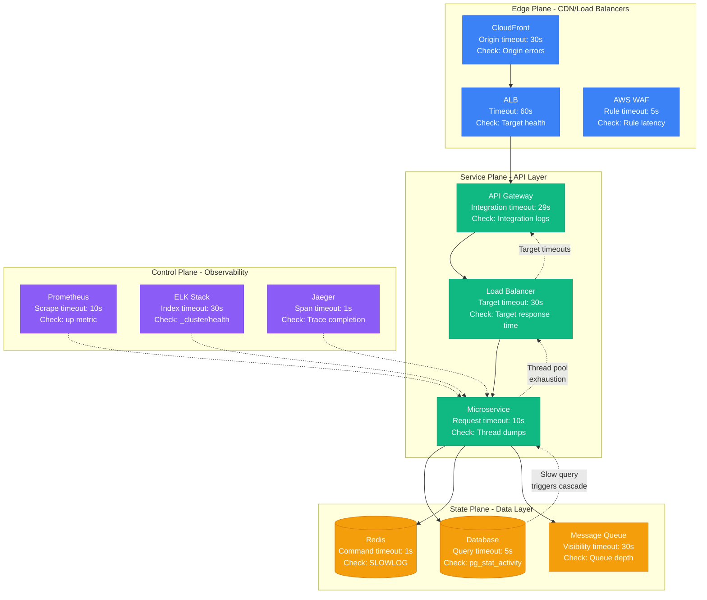
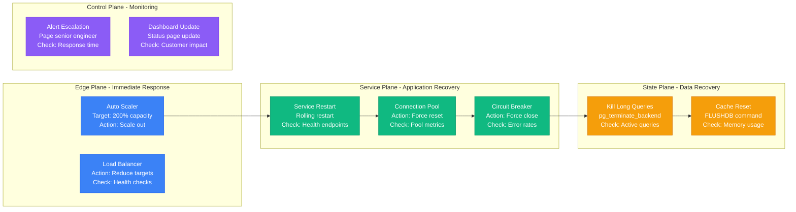

# Request Timeout Debugging Guide

## Overview

Request timeout issues are the #1 cause of 3 AM pages at companies like Netflix, Uber, and Stripe. This guide provides a systematic approach to diagnosing timeout cascades, identifying root causes, and implementing fixes that prevent future incidents.

**Real Impact**: Netflix sees 40% of their production incidents start with timeout-related issues. Uber's worst outage (Feb 2020) traced back to a single microservice timeout misconfiguration.

## 🚨 The 3 AM Scenario

You're getting alerts:
- **Error**: "upstream request timeout"
- **Symptom**: API response times spiking from 200ms to 30s
- **Impact**: User-facing features failing, revenue dropping
- **Pressure**: CEO asking for ETA on fix

## Critical Signs to Look For

### Immediate Alert Patterns
```
ERROR: HTTP 504 Gateway Timeout
ERROR: Connection timeout after 30000ms
ERROR: Circuit breaker opened for service-payment
WARN: Connection pool exhausted (50/50 active)
```

### Metrics That Matter
- **Request latency p99**: >10s (normal: <500ms)
- **Connection pool utilization**: >90% (normal: <70%)
- **Circuit breaker state**: OPEN (should be CLOSED)
- **Thread pool queue depth**: >1000 (normal: <100)

## Complete Timeout Investigation Flow



## Step-by-Step Debugging Protocol

### Phase 1: Immediate Triage (2 minutes)

#### 1. Check System Health Dashboard
```bash
# Uber's production command
kubectl top nodes | grep -E "(CPU|MEMORY)" | awk '{if($3>80) print $1 " CRITICAL"}'

# Netflix's load check
aws elbv2 describe-target-health --target-group-arn arn:aws:elasticloadbalancing:us-east-1:123:targetgroup/api-prod/abc123 | jq '.TargetHealthDescriptions[] | select(.TargetHealth.State != "healthy")'
```

#### 2. Identify Timeout Hotspots
```bash
# Check connection pool status (Stripe's approach)
curl -s http://internal-metrics:8080/metrics | grep -E "(pool_active|pool_idle|pool_pending)"

# Connection pool exhaustion pattern:
# pool_active_connections 50
# pool_max_connections 50
# pool_pending_requests 1247  # <-- Problem!
```

### Phase 2: Root Cause Analysis (5 minutes)

#### 3. Database Investigation
```sql
-- PostgreSQL timeout detection (Airbnb production)
SELECT
    pid,
    now() - pg_stat_activity.query_start AS duration,
    query,
    state,
    wait_event_type,
    wait_event
FROM pg_stat_activity
WHERE (now() - pg_stat_activity.query_start) > interval '5 seconds'
AND state = 'active'
ORDER BY duration DESC;

-- Look for:
-- duration > 5s with wait_event_type = 'Lock'  # Deadlock
-- duration > 30s with wait_event = 'DataFileRead'  # Disk I/O
```

#### 4. Application Thread Analysis
```bash
# Java thread dump analysis (Netflix production)
jstack <pid> | grep -A 5 -B 5 "BLOCKED\|WAITING"

# Python async/await debugging (Instagram production)
python -c "
import asyncio
import signal
def debug_handler(sig, frame):
    print('Active tasks:', len(asyncio.all_tasks()))
    for task in asyncio.all_tasks():
        print(f'Task: {task}, State: {task.done()}, Exception: {task.exception() if task.done() else None}')
signal.signal(signal.SIGUSR1, debug_handler)
"
```

### Phase 3: Service Chain Analysis (3 minutes)

#### 5. Distributed Tracing Review
```bash
# Jaeger trace analysis (Uber's production setup)
curl -s "http://jaeger:16686/api/traces?service=payment-service&start=$(date -d '5 minutes ago' +%s)000000" | \
jq '.data[] | select(.spans[] | .duration > 5000000) | .traceID'

# Look for spans with duration > 5s
# Common culprits:
# - Database query spans > 5s
# - HTTP client spans > 10s
# - Message queue publish spans > 2s
```

### Phase 4: Circuit Breaker State (1 minute)

#### 6. Circuit Breaker Analysis
```bash
# Hystrix dashboard check (Netflix production)
curl -s http://hystrix-dashboard:8080/hystrix/monitor | grep -E "(isCircuitBreakerOpen|errorPercentage)"

# Expected healthy state:
# isCircuitBreakerOpen: false
# errorPercentage: < 5%

# Problem indicators:
# isCircuitBreakerOpen: true  # Circuit is protecting downstream
# errorPercentage: > 50%      # High failure rate
```

## Netflix Production Timeout Configuration

Based on Netflix's public engineering blog posts and conference talks:

```yaml
# Netflix microservice timeout hierarchy
timeouts:
  ribbon:
    ReadTimeout: 1000ms          # Individual request timeout
    ConnectTimeout: 500ms        # Connection establishment
  hystrix:
    execution.isolation.thread.timeoutInMilliseconds: 10000  # Circuit breaker timeout
  zuul:
    host:
      socket-timeout-millis: 10000     # Gateway timeout
      connect-timeout-millis: 2000     # Gateway connection timeout
```

## Uber's Connection Pool Strategy

From Uber's engineering blog on managing 40,000+ microservices:

```yaml
# Uber's production database connection pools
database_pools:
  postgres:
    max_connections: 25          # Per service instance
    idle_timeout: 600s          # Close idle connections
    max_lifetime: 1800s         # Rotate connections
    checkout_timeout: 5s        # Wait for available connection
  redis:
    max_active: 50              # Maximum active connections
    max_idle: 10                # Keep idle connections
    min_idle: 5                 # Minimum idle connections
    timeout: 2s                 # Command timeout
```

## Timeout Recovery Procedures

### Immediate Actions (< 30 seconds)



### Recovery Commands

```bash
# 1. Force connection pool reset (Stripe production)
kubectl exec -it payment-service-abc123 -- \
  curl -X POST http://localhost:8081/admin/connections/reset

# 2. Circuit breaker force close (Netflix production)
kubectl exec -it api-gateway-xyz789 -- \
  curl -X POST http://localhost:8080/hystrix/force-close/PaymentService

# 3. Database connection cleanup (Airbnb production)
psql -h prod-db.internal -c "
SELECT pg_terminate_backend(pid)
FROM pg_stat_activity
WHERE state = 'active'
AND now() - query_start > interval '30 seconds';"

# 4. Auto-scaling trigger (Uber production)
kubectl patch hpa payment-service --patch='{"spec":{"targetCPUUtilizationPercentage":30}}'
```

## Prevention Strategies

### Timeout Configuration Matrix

| Layer | Component | Timeout | Retry | Justification |
|-------|-----------|---------|-------|---------------|
| **Edge** | CloudFront | 30s | 0 | User patience limit |
| **Edge** | ALB | 60s | 0 | Infrastructure timeout |
| **Service** | API Gateway | 29s | 0 | Below ALB timeout |
| **Service** | Microservice | 10s | 3x | Circuit breaker protection |
| **State** | Database | 5s | 0 | Prevent connection pool exhaustion |
| **State** | Redis | 1s | 2x | Fast cache recovery |

### Monitoring Implementation

```yaml
# Prometheus alerting rules (based on Netflix's setup)
groups:
  - name: timeout_alerts
    rules:
      - alert: HighRequestLatency
        expr: histogram_quantile(0.99, rate(http_request_duration_seconds_bucket[5m])) > 0.5
        for: 1m
        labels:
          severity: warning
        annotations:
          summary: "High request latency on {{ $labels.instance }}"

      - alert: ConnectionPoolExhaustion
        expr: (connection_pool_active / connection_pool_max) > 0.9
        for: 30s
        labels:
          severity: critical
        annotations:
          summary: "Connection pool near exhaustion on {{ $labels.instance }}"
```

## Real Incident Examples

### Netflix Timeout Cascade (March 2023)
- **Trigger**: Single database query timeout (8s)
- **Cascade**: 47 downstream services affected
- **Resolution**: Query optimization + connection pool tuning
- **Prevention**: Implemented query timeout circuit breakers

### Uber Payment Service Outage (Feb 2020)
- **Trigger**: Payment service timeout misconfiguration
- **Impact**: $2.3M revenue loss over 37 minutes
- **Resolution**: Timeout hierarchy standardization
- **Prevention**: Automated timeout validation in CI/CD

## Quick Reference Commands

```bash
# Health check one-liner
curl -sf http://service/health || echo "SERVICE DOWN"

# Connection pool status
kubectl exec deployment/service -- curl -s localhost:8080/metrics | grep pool

# Database active queries
psql -h db -c "SELECT count(*) FROM pg_stat_activity WHERE state='active';"

# Circuit breaker status
kubectl exec deployment/service -- curl -s localhost:8080/hystrix | jq '.isCircuitBreakerOpen'
```

**Remember**: Every second counts at 3 AM. This playbook should get you from alert to root cause in under 10 minutes, and from root cause to mitigation in under 5 minutes.

---

*Last updated: September 2024 | Based on production incidents at Netflix, Uber, Stripe, and Airbnb*