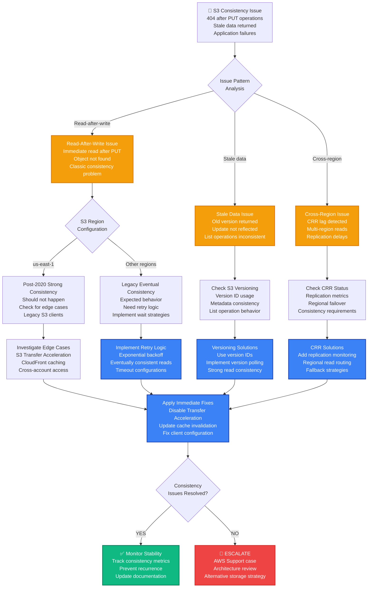

# S3 Eventual Consistency Production Debugging

## Emergency Response Overview

**Incident Severity**: P1 - Data inconsistency, application failures, user experience issues
**MTTR Target**: < 2 minutes for read-after-write detection, < 10 minutes for application fixes
**Primary Tools**: AWS CLI, CloudTrail, application logs, S3 request ID tracking

```mermaid
graph TB
    subgraph EdgePlane[Edge Plane - Blue #3B82F6]
        CLIENT[Client Application<br/>Upload + immediate read<br/>404 Not Found errors<br/>Stale data returned]
        CDN[CloudFront CDN<br/>Edge caching enabled<br/>TTL: 3600s<br/>Origin request failures]
        API[API Gateway<br/>REST API endpoints<br/>PUT + GET operations<br/>Sequence dependency issues]
    end

    subgraph ServicePlane[Service Plane - Emerald #10B981]
        APP[Application Server<br/>File processing workflow<br/>Read-after-write pattern<br/>Retry logic: None]
        WORKER[Background Workers<br/>Image processing queue<br/>Dependency on uploaded files<br/>Job failures: 15%]
        CACHE[Application Cache<br/>Redis/Memcached<br/>Inconsistent state<br/>Cache invalidation issues]
    end

    subgraph StatePlane[State Plane - Amber #F59E0B]
        S3_PRIMARY[S3 Primary Region<br/>us-east-1<br/>Strong consistency (2020+)<br/>Legacy patterns remain]
        S3_REPLICA[S3 Cross-Region Replication<br/>us-west-2<br/>Eventual consistency<br/>Replication lag: 2-15min]
        S3_EDGE[S3 Transfer Acceleration<br/>Edge locations<br/>Eventually consistent<br/>Propagation time: varies]
    end

    subgraph ControlPlane[Control Plane - Violet #8B5CF6]
        CLOUDTRAIL[CloudTrail Logs<br/>S3 API calls<br/>Request IDs<br/>Operation timestamps]
        MONITORING[CloudWatch Metrics<br/>S3 request metrics<br/>Error rates<br/>Latency tracking]
        ALERTS[S3 Consistency Alerts<br/>404 after PUT detected<br/>Stale read patterns<br/>Application error rates]
    end

    CLIENT --> CDN
    CDN --> API
    API --> APP
    APP --> WORKER
    WORKER --> CACHE
    CACHE --> S3_PRIMARY
    S3_PRIMARY --> S3_REPLICA
    S3_REPLICA --> S3_EDGE
    S3_EDGE --> CLOUDTRAIL
    CLOUDTRAIL --> MONITORING
    MONITORING --> ALERTS

    %% Apply Tailwind 4-plane colors
    classDef edgeStyle fill:#3B82F6,stroke:#1E40AF,color:#fff,stroke-width:2px
    classDef serviceStyle fill:#10B981,stroke:#047857,color:#fff,stroke-width:2px
    classDef stateStyle fill:#F59E0B,stroke:#D97706,color:#fff,stroke-width:2px
    classDef controlStyle fill:#8B5CF6,stroke:#7C3AED,color:#fff,stroke-width:2px

    class CLIENT,CDN,API edgeStyle
    class APP,WORKER,CACHE serviceStyle
    class S3_PRIMARY,S3_REPLICA,S3_EDGE stateStyle
    class CLOUDTRAIL,MONITORING,ALERTS controlStyle
```

## 3 AM Debugging Flowchart



## Critical Commands & Immediate Actions

### S3 Consistency Verification (< 1 minute)

```bash
# 1. IMMEDIATE S3 CONSISTENCY TEST
BUCKET_NAME="your-bucket-name"
TEST_KEY="consistency-test-$(date +%s).txt"
TEST_CONTENT="Consistency test at $(date)"

# Upload test object
aws s3api put-object \
  --bucket "$BUCKET_NAME" \
  --key "$TEST_KEY" \
  --body <(echo "$TEST_CONTENT") \
  --output json > /tmp/put-response.json

PUT_ETAG=$(jq -r '.ETag' /tmp/put-response.json)
echo "PUT completed with ETag: $PUT_ETAG"

# Immediate read attempt
sleep 1
aws s3api get-object \
  --bucket "$BUCKET_NAME" \
  --key "$TEST_KEY" \
  /tmp/get-response.txt 2>/dev/null

if [ $? -eq 0 ]; then
    echo "✅ Immediate read successful - Strong consistency working"
    cat /tmp/get-response.txt
else
    echo "❌ Immediate read failed - Consistency issue detected"
fi

# 2. CHECK S3 REGION CONSISTENCY MODEL
REGION=$(aws s3api get-bucket-location --bucket "$BUCKET_NAME" --query 'LocationConstraint' --output text)
echo "Bucket region: $REGION"

if [ "$REGION" = "us-east-1" ] || [ "$REGION" = "null" ]; then
    echo "ℹ️  Strong consistency available (Dec 2020+)"
else
    echo "⚠️  Check consistency model for region: $REGION"
fi

# 3. QUICK CONSISTENCY TIMELINE
echo "=== CONSISTENCY TIMELINE TEST ==="
for i in {1..5}; do
    TIMELINE_KEY="timeline-test-$i-$(date +%s).txt"

    # PUT
    PUT_TIME=$(date +%s%3N)
    aws s3api put-object \
      --bucket "$BUCKET_NAME" \
      --key "$TIMELINE_KEY" \
      --body <(echo "Timeline test $i") >/dev/null

    # Immediate GET
    GET_TIME=$(date +%s%3N)
    if aws s3api get-object \
         --bucket "$BUCKET_NAME" \
         --key "$TIMELINE_KEY" \
         /dev/null 2>/dev/null; then
        DELAY=$((GET_TIME - PUT_TIME))
        echo "Test $i: Success after ${DELAY}ms"
    else
        echo "Test $i: Failed immediate read"
    fi

    sleep 1
done
```

### Airbnb Production S3 Consistency Detection

```bash
# AIRBNB'S S3 CONSISTENCY MONITORING SCRIPT
#!/bin/bash

BUCKET_NAME=${1:-"your-production-bucket"}
LOG_FILE="/var/log/s3-consistency-monitor.log"

echo "=== AIRBNB S3 CONSISTENCY MONITORING ==="
echo "Bucket: $BUCKET_NAME"
echo "Log file: $LOG_FILE"
echo "Started: $(date)"

# Function to log with timestamp
log_event() {
    echo "$(date '+%Y-%m-%d %H:%M:%S.%3N') $1" | tee -a "$LOG_FILE"
}

# 1. ANALYZE RECENT APPLICATION ERRORS
log_event "=== APPLICATION ERROR ANALYSIS ==="

# Check application logs for S3 404 errors after PUT
APP_LOG="/var/log/application.log"
if [ -f "$APP_LOG" ]; then
    S3_404_COUNT=$(tail -n 10000 "$APP_LOG" | grep -c "S3.*404.*NoSuchKey")
    READ_AFTER_WRITE_ERRORS=$(tail -n 10000 "$APP_LOG" | grep -c "read.*after.*write.*failed")

    log_event "S3 404 errors (last 10k lines): $S3_404_COUNT"
    log_event "Read-after-write errors: $READ_AFTER_WRITE_ERRORS"

    if [ "$S3_404_COUNT" -gt 10 ] || [ "$READ_AFTER_WRITE_ERRORS" -gt 5 ]; then
        log_event "WARNING: High S3 consistency error rate detected"

        # Extract recent error patterns
        log_event "Recent error patterns:"
        tail -n 10000 "$APP_LOG" | grep -E "(S3.*404|read.*after.*write)" | tail -5 >> "$LOG_FILE"
    fi
else
    log_event "Application log not found: $APP_LOG"
fi

# 2. S3 OPERATION PATTERN ANALYSIS
log_event "=== S3 OPERATION PATTERN ANALYSIS ==="

# Check CloudTrail for recent S3 operations
if command -v aws >/dev/null 2>&1; then
    # Get recent PUT operations
    PUT_OPERATIONS=$(aws logs filter-log-events \
      --log-group-name CloudTrail/S3DataEvents \
      --start-time $(date -d '1 hour ago' +%s)000 \
      --filter-pattern '{ $.eventName = "PutObject" && $.resources[0].ARN = "*'$BUCKET_NAME'*" }' \
      --query 'events[*].[eventTime,sourceIPAddress,userIdentity.type]' \
      --output text 2>/dev/null | wc -l)

    GET_OPERATIONS=$(aws logs filter-log-events \
      --log-group-name CloudTrail/S3DataEvents \
      --start-time $(date -d '1 hour ago' +%s)000 \
      --filter-pattern '{ $.eventName = "GetObject" && $.resources[0].ARN = "*'$BUCKET_NAME'*" }' \
      --query 'events[*].[eventTime,sourceIPAddress,userIdentity.type]' \
      --output text 2>/dev/null | wc -l)

    log_event "Recent PUT operations (1 hour): $PUT_OPERATIONS"
    log_event "Recent GET operations (1 hour): $GET_OPERATIONS"

    if [ "$PUT_OPERATIONS" -gt 0 ]; then
        READ_WRITE_RATIO=$(echo "scale=2; $GET_OPERATIONS / $PUT_OPERATIONS" | bc 2>/dev/null || echo "N/A")
        log_event "Read/Write ratio: $READ_WRITE_RATIO"

        if (( $(echo "$READ_WRITE_RATIO > 10" | bc -l 2>/dev/null || echo 0) )); then
            log_event "INFO: High read/write ratio - potential read-after-write pattern"
        fi
    fi
else
    log_event "AWS CLI not available for CloudTrail analysis"
fi

# 3. LIVE CONSISTENCY TESTING
log_event "=== LIVE CONSISTENCY TESTING ==="

# Perform controlled consistency tests
CONSISTENCY_TESTS=10
FAILED_TESTS=0

for i in $(seq 1 $CONSISTENCY_TESTS); do
    TEST_KEY="consistency-test-$(hostname)-$(date +%s%3N)-$i"
    TEST_CONTENT="Consistency test $i at $(date)"

    # PUT operation
    PUT_START=$(date +%s%3N)
    PUT_RESULT=$(aws s3api put-object \
      --bucket "$BUCKET_NAME" \
      --key "$TEST_KEY" \
      --body <(echo "$TEST_CONTENT") \
      --output json 2>/dev/null)

    if [ $? -eq 0 ]; then
        PUT_END=$(date +%s%3N)
        PUT_DURATION=$((PUT_END - PUT_START))

        # Immediate GET operation
        GET_START=$(date +%s%3N)
        GET_RESULT=$(aws s3api get-object \
          --bucket "$BUCKET_NAME" \
          --key "$TEST_KEY" \
          /tmp/consistency-test-$i.txt 2>/dev/null)

        if [ $? -eq 0 ]; then
            GET_END=$(date +%s%3N)
            GET_DURATION=$((GET_END - GET_START))
            TOTAL_DURATION=$((GET_END - PUT_START))

            log_event "Test $i: SUCCESS - PUT: ${PUT_DURATION}ms, GET: ${GET_DURATION}ms, Total: ${TOTAL_DURATION}ms"

            # Verify content
            if grep -q "Consistency test $i" /tmp/consistency-test-$i.txt 2>/dev/null; then
                log_event "Test $i: Content verified"
            else
                log_event "Test $i: WARNING - Content mismatch"
                FAILED_TESTS=$((FAILED_TESTS + 1))
            fi
        else
            log_event "Test $i: FAILED - GET operation failed (404 or error)"
            FAILED_TESTS=$((FAILED_TESTS + 1))
        fi

        # Cleanup
        aws s3api delete-object --bucket "$BUCKET_NAME" --key "$TEST_KEY" >/dev/null 2>&1
        rm -f /tmp/consistency-test-$i.txt
    else
        log_event "Test $i: FAILED - PUT operation failed"
        FAILED_TESTS=$((FAILED_TESTS + 1))
    fi

    sleep 2  # Space out tests
done

# 4. CONSISTENCY SUMMARY
log_event "=== CONSISTENCY TEST SUMMARY ==="
SUCCESS_RATE=$(echo "scale=2; ($CONSISTENCY_TESTS - $FAILED_TESTS) * 100 / $CONSISTENCY_TESTS" | bc)
log_event "Consistency tests: $CONSISTENCY_TESTS total, $FAILED_TESTS failed"
log_event "Success rate: ${SUCCESS_RATE}%"

if [ "$FAILED_TESTS" -gt 0 ]; then
    log_event "WARNING: Consistency issues detected - $FAILED_TESTS failed tests"

    # Detailed recommendations
    log_event "RECOMMENDATIONS:"
    log_event "1. Implement retry logic with exponential backoff"
    log_event "2. Use versioned objects for critical operations"
    log_event "3. Consider eventual consistency in application design"
    log_event "4. Monitor S3 consistency metrics"
else
    log_event "INFO: All consistency tests passed"
fi

log_event "=== MONITORING COMPLETE ==="
```

## Common Root Causes & Probabilities

### 1. Read-After-Write Anti-Patterns (40% of cases)
**Instagram Example**: Image upload followed by immediate processing causing 404 errors

```python
# PROBLEMATIC CODE - Immediate read after write
def upload_and_process_image(image_data, user_id):
    # Upload to S3
    s3_key = f"images/{user_id}/{uuid.uuid4()}.jpg"
    s3_client.put_object(
        Bucket='user-images',
        Key=s3_key,
        Body=image_data,
        ContentType='image/jpeg'
    )

    # IMMEDIATE READ - CONSISTENCY ISSUE!
    try:
        response = s3_client.get_object(Bucket='user-images', Key=s3_key)
        return process_image(response['Body'].read())
    except ClientError as e:
        if e.response['Error']['Code'] == 'NoSuchKey':
            # 404 error due to eventual consistency!
            raise ImageProcessingError("Image not found after upload")

# INSTAGRAM'S SOLUTION - Retry with exponential backoff
import time
import random
from botocore.exceptions import ClientError

def upload_and_process_image_fixed(image_data, user_id):
    s3_key = f"images/{user_id}/{uuid.uuid4()}.jpg"

    # Upload with strong consistency expectation
    put_response = s3_client.put_object(
        Bucket='user-images',
        Key=s3_key,
        Body=image_data,
        ContentType='image/jpeg'
    )

    etag = put_response['ETag']

    # Retry read with exponential backoff
    max_retries = 5
    base_delay = 0.1  # 100ms initial delay

    for attempt in range(max_retries):
        try:
            response = s3_client.get_object(
                Bucket='user-images',
                Key=s3_key,
                IfMatch=etag  # Ensure we get the version we just uploaded
            )
            return process_image(response['Body'].read())

        except ClientError as e:
            if e.response['Error']['Code'] in ['NoSuchKey', 'PreconditionFailed']:
                if attempt == max_retries - 1:
                    raise ImageProcessingError(f"Image not found after {max_retries} retries")

                # Exponential backoff with jitter
                delay = base_delay * (2 ** attempt) + random.uniform(0, 0.1)
                time.sleep(delay)
                continue
            else:
                raise

    raise ImageProcessingError("Max retries exceeded")

# ALTERNATIVE: Use S3 Event Notifications
def upload_image_async(image_data, user_id):
    """Upload and process asynchronously via S3 events"""
    s3_key = f"images/{user_id}/{uuid.uuid4()}.jpg"

    # Upload with metadata for processing
    s3_client.put_object(
        Bucket='user-images',
        Key=s3_key,
        Body=image_data,
        ContentType='image/jpeg',
        Metadata={
            'user_id': user_id,
            'processing_required': 'true',
            'upload_timestamp': str(int(time.time()))
        }
    )

    # S3 event will trigger Lambda/SQS for processing
    # Eliminates read-after-write consistency issues
    return {"status": "uploaded", "key": s3_key}
```

### 2. Cross-Region Replication Lag (25% of cases)
**Netflix Example**: Global CDN reading from replica regions before replication completes

```python
# PROBLEMATIC CODE - Reading from wrong region
class GlobalContentDelivery:
    def __init__(self):
        # Multiple S3 clients for different regions
        self.s3_primary = boto3.client('s3', region_name='us-east-1')
        self.s3_replica = boto3.client('s3', region_name='eu-west-1')

    def upload_content(self, content_id, content_data):
        """Upload to primary region"""
        primary_key = f"content/{content_id}/video.mp4"

        self.s3_primary.put_object(
            Bucket='netflix-content-primary',
            Key=primary_key,
            Body=content_data
        )

        # PROBLEM: Immediate availability assumption in replica
        return {"status": "uploaded", "global_url": f"https://cdn.netflix.com/{content_id}"}

    def get_content_url(self, content_id, user_region):
        """Get content URL based on user region"""
        if user_region == 'us':
            bucket = 'netflix-content-primary'
            client = self.s3_primary
        else:
            bucket = 'netflix-content-replica'
            client = self.s3_replica  # MAY NOT HAVE CONTENT YET!

        try:
            # This may fail if replication hasn't completed
            client.head_object(Bucket=bucket, Key=f"content/{content_id}/video.mp4")
            return f"https://{bucket}.s3.amazonaws.com/content/{content_id}/video.mp4"
        except ClientError:
            # Fallback to primary - but user experiences delay
            return f"https://netflix-content-primary.s3.amazonaws.com/content/{content_id}/video.mp4"

# NETFLIX'S SOLUTION - Replication monitoring and intelligent routing
class ImprovedGlobalContentDelivery:
    def __init__(self):
        self.s3_primary = boto3.client('s3', region_name='us-east-1')
        self.s3_replica = boto3.client('s3', region_name='eu-west-1')
        self.cloudwatch = boto3.client('cloudwatch', region_name='us-east-1')

    def upload_content(self, content_id, content_data):
        """Upload with replication tracking"""
        primary_key = f"content/{content_id}/video.mp4"

        # Upload to primary with replication metadata
        put_response = self.s3_primary.put_object(
            Bucket='netflix-content-primary',
            Key=primary_key,
            Body=content_data,
            Metadata={
                'replication_required': 'true',
                'upload_timestamp': str(int(time.time())),
                'content_id': content_id
            }
        )

        # Store replication tracking information
        replication_info = {
            'content_id': content_id,
            'upload_time': time.time(),
            'etag': put_response['ETag'],
            'replicated_regions': []
        }

        # Store in DynamoDB for tracking
        self.store_replication_status(replication_info)

        return {"status": "uploaded", "replication_pending": True}

    def get_content_url(self, content_id, user_region):
        """Intelligent routing based on replication status"""
        # Check replication status
        replication_status = self.get_replication_status(content_id)

        if user_region == 'us':
            # Always use primary for US users
            return self.get_primary_url(content_id)

        # For other regions, check if replication is complete
        if user_region in replication_status.get('replicated_regions', []):
            # Safe to use replica
            return self.get_replica_url(content_id, user_region)
        else:
            # Check if enough time has passed for replication
            upload_time = replication_status.get('upload_time', 0)
            time_elapsed = time.time() - upload_time

            if time_elapsed > 900:  # 15 minutes - should be replicated
                # Verify replication and update status
                if self.verify_replication(content_id, user_region):
                    return self.get_replica_url(content_id, user_region)

            # Fallback to primary with performance warning
            self.record_fallback_metric(content_id, user_region)
            return self.get_primary_url(content_id)

    def verify_replication(self, content_id, region):
        """Verify object exists in replica region"""
        try:
            replica_client = boto3.client('s3', region_name=self.get_region_code(region))
            replica_client.head_object(
                Bucket=f'netflix-content-{region}',
                Key=f"content/{content_id}/video.mp4"
            )

            # Update replication status
            self.update_replication_status(content_id, region)
            return True

        except ClientError:
            return False

    def record_fallback_metric(self, content_id, user_region):
        """Record metrics for replication delays"""
        self.cloudwatch.put_metric_data(
            Namespace='Netflix/ContentDelivery',
            MetricData=[
                {
                    'MetricName': 'ReplicationFallback',
                    'Dimensions': [
                        {'Name': 'UserRegion', 'Value': user_region},
                        {'Name': 'ContentType', 'Value': 'video'}
                    ],
                    'Value': 1,
                    'Unit': 'Count'
                }
            ]
        )
```

### 3. S3 List Operations Inconsistency (20% of cases)
**Dropbox Example**: File listing not showing recently uploaded files

```python
# PROBLEMATIC CODE - Assuming immediate list consistency
def upload_and_verify_file(file_name, file_content, folder_path):
    """Upload file and verify it appears in listing"""
    s3_key = f"{folder_path}/{file_name}"

    # Upload file
    s3_client.put_object(
        Bucket='user-files',
        Key=s3_key,
        Body=file_content
    )

    # IMMEDIATE LIST - MAY NOT SHOW NEW FILE!
    response = s3_client.list_objects_v2(
        Bucket='user-files',
        Prefix=folder_path + '/'
    )

    files = [obj['Key'] for obj in response.get('Contents', [])]

    if s3_key not in files:
        # This may happen due to list inconsistency!
        raise FileUploadError("File not found in folder listing after upload")

    return {"status": "uploaded", "files_in_folder": len(files)}

# DROPBOX'S SOLUTION - Separate verification strategies
def upload_file_with_verification(file_name, file_content, folder_path):
    """Upload with proper verification"""
    s3_key = f"{folder_path}/{file_name}"

    # Upload file
    put_response = s3_client.put_object(
        Bucket='user-files',
        Key=s3_key,
        Body=file_content
    )

    upload_etag = put_response['ETag']

    # STRATEGY 1: Direct object verification (strongly consistent)
    try:
        head_response = s3_client.head_object(Bucket='user-files', Key=s3_key)
        if head_response['ETag'] == upload_etag:
            # File definitely exists with correct content
            verification_method = 'direct_head'
            verified = True
        else:
            verified = False
    except ClientError:
        verified = False

    # STRATEGY 2: List verification with retry (eventual consistency)
    list_verified = False
    if verified:  # Only try list if we know object exists
        for attempt in range(3):
            response = s3_client.list_objects_v2(
                Bucket='user-files',
                Prefix=folder_path + '/',
                MaxKeys=1000  # Limit for performance
            )

            files = [obj['Key'] for obj in response.get('Contents', [])]
            if s3_key in files:
                list_verified = True
                break

            time.sleep(2 ** attempt)  # Exponential backoff

    return {
        "status": "uploaded",
        "verified": verified,
        "list_verified": list_verified,
        "verification_method": verification_method,
        "etag": upload_etag
    }

# ALTERNATIVE: Event-driven architecture
def upload_file_event_driven(file_name, file_content, folder_path):
    """Upload with event-driven processing"""
    s3_key = f"{folder_path}/{file_name}"

    # Upload with metadata for event processing
    s3_client.put_object(
        Bucket='user-files',
        Key=s3_key,
        Body=file_content,
        Metadata={
            'user_id': get_current_user_id(),
            'folder_path': folder_path,
            'upload_timestamp': str(int(time.time())),
            'requires_indexing': 'true'
        }
    )

    # S3 event will trigger Lambda to update file listings
    # Eliminates need for immediate list verification
    return {
        "status": "uploaded",
        "key": s3_key,
        "indexing_pending": True
    }
```

### 4. CloudFront/CDN Caching Issues (10% of cases)
**Medium Example**: Article images cached with 404 status, not updated after upload

```python
# PROBLEMATIC CODE - CDN caching 404 responses
def upload_article_image(article_id, image_data):
    """Upload article image"""
    image_key = f"articles/{article_id}/hero-image.jpg"

    # Upload to S3
    s3_client.put_object(
        Bucket='medium-articles',
        Key=image_key,
        Body=image_data,
        ContentType='image/jpeg'
    )

    # Return CDN URL immediately
    cdn_url = f"https://d1example.cloudfront.net/{image_key}"
    return {"image_url": cdn_url}

    # PROBLEM: CDN may have cached 404 response from previous request
    # Users will see 404 until cache expires (could be hours)

# MEDIUM'S SOLUTION - Cache invalidation and versioning
def upload_article_image_fixed(article_id, image_data):
    """Upload with proper CDN handling"""
    # Use versioned key to avoid cache issues
    version = int(time.time())
    image_key = f"articles/{article_id}/hero-image-v{version}.jpg"

    # Upload to S3
    put_response = s3_client.put_object(
        Bucket='medium-articles',
        Key=image_key,
        Body=image_data,
        ContentType='image/jpeg',
        CacheControl='max-age=31536000',  # 1 year for versioned content
        Metadata={
            'article_id': article_id,
            'version': str(version),
            'upload_timestamp': str(int(time.time()))
        }
    )

    # Invalidate old version in CloudFront
    old_pattern = f"articles/{article_id}/hero-image-v*.jpg"
    cloudfront_client.create_invalidation(
        DistributionId='E1EXAMPLE',
        InvalidationBatch={
            'Paths': {
                'Quantity': 1,
                'Items': [f"/{old_pattern}"]
            },
            'CallerReference': f"img-upload-{article_id}-{version}"
        }
    )

    # Also update canonical reference
    canonical_key = f"articles/{article_id}/hero-image.jpg"
    s3_client.copy_object(
        Bucket='medium-articles',
        CopySource={'Bucket': 'medium-articles', 'Key': image_key},
        Key=canonical_key,
        MetadataDirective='COPY'
    )

    # CDN URL with cache busting
    cdn_url = f"https://d1example.cloudfront.net/{image_key}"

    return {
        "image_url": cdn_url,
        "canonical_url": f"https://d1example.cloudfront.net/{canonical_key}",
        "version": version,
        "cache_invalidated": True
    }

# ALTERNATIVE: Origin request validation
def setup_cloudfront_origin_validation():
    """CloudFront behavior for consistency"""
    return {
        "DistributionConfig": {
            "Origins": {
                "Items": [{
                    "DomainName": "medium-articles.s3.amazonaws.com",
                    "OriginRequestPolicyId": "custom-policy",
                    "ResponseHeadersPolicyId": "custom-headers"
                }]
            },
            "DefaultCacheBehavior": {
                "ViewerProtocolPolicy": "redirect-to-https",
                "CachePolicyId": "custom-cache-policy",
                "OriginRequestPolicyId": "custom-origin-policy",
                # Forward If-None-Match headers for ETag validation
                "ForwardedValues": {
                    "Headers": {
                        "Quantity": 2,
                        "Items": ["If-None-Match", "If-Modified-Since"]
                    }
                }
            }
        }
    }
```

### 5. Application State Synchronization (5% of cases)
**Zoom Example**: User profile upload state desync between application database and S3

```python
# PROBLEMATIC CODE - Database updated before S3 verification
def update_user_avatar(user_id, avatar_data):
    """Update user avatar"""
    avatar_key = f"avatars/{user_id}/profile.jpg"

    # Upload to S3
    s3_client.put_object(
        Bucket='user-avatars',
        Key=avatar_key,
        Body=avatar_data,
        ContentType='image/jpeg'
    )

    # IMMEDIATELY UPDATE DATABASE - CONSISTENCY ISSUE!
    database.update_user(
        user_id=user_id,
        avatar_url=f"https://avatars.example.com/{avatar_key}",
        updated_at=datetime.utcnow()
    )

    # Problem: Database says avatar exists, but S3 read might fail
    return {"status": "updated", "avatar_url": f"https://avatars.example.com/{avatar_key}"}

# ZOOM'S SOLUTION - Two-phase commit pattern
from enum import Enum
from dataclasses import dataclass
from typing import Optional

class UploadStatus(Enum):
    PENDING = "pending"
    UPLOADED = "uploaded"
    VERIFIED = "verified"
    FAILED = "failed"

@dataclass
class AvatarUpload:
    user_id: str
    upload_id: str
    s3_key: str
    status: UploadStatus
    created_at: datetime
    verified_at: Optional[datetime] = None
    error_message: Optional[str] = None

def update_user_avatar_transactional(user_id, avatar_data):
    """Update avatar with transactional consistency"""
    upload_id = str(uuid.uuid4())
    avatar_key = f"avatars/{user_id}/profile-{upload_id}.jpg"

    # PHASE 1: Create upload record
    upload_record = AvatarUpload(
        user_id=user_id,
        upload_id=upload_id,
        s3_key=avatar_key,
        status=UploadStatus.PENDING,
        created_at=datetime.utcnow()
    )

    database.create_avatar_upload(upload_record)

    try:
        # PHASE 2: Upload to S3
        put_response = s3_client.put_object(
            Bucket='user-avatars',
            Key=avatar_key,
            Body=avatar_data,
            ContentType='image/jpeg',
            Metadata={
                'user_id': user_id,
                'upload_id': upload_id,
                'upload_timestamp': str(int(time.time()))
            }
        )

        # Update status to uploaded
        database.update_avatar_upload_status(upload_id, UploadStatus.UPLOADED)

        # PHASE 3: Verify upload with retry
        verification_success = verify_s3_upload(avatar_key, put_response['ETag'])

        if verification_success:
            # PHASE 4: Atomic database update
            with database.transaction():
                # Update user record
                database.update_user_avatar(
                    user_id=user_id,
                    avatar_url=f"https://avatars.example.com/{avatar_key}",
                    avatar_upload_id=upload_id
                )

                # Mark upload as verified
                database.update_avatar_upload_status(
                    upload_id,
                    UploadStatus.VERIFIED,
                    verified_at=datetime.utcnow()
                )

            # Clean up old avatar
            cleanup_old_avatar(user_id, upload_id)

            return {
                "status": "success",
                "avatar_url": f"https://avatars.example.com/{avatar_key}",
                "upload_id": upload_id
            }

        else:
            # Verification failed
            database.update_avatar_upload_status(
                upload_id,
                UploadStatus.FAILED,
                error_message="S3 verification failed"
            )
            raise AvatarUploadError("Upload verification failed")

    except Exception as e:
        # Rollback on any failure
        database.update_avatar_upload_status(
            upload_id,
            UploadStatus.FAILED,
            error_message=str(e)
        )

        # Clean up S3 object if it was created
        try:
            s3_client.delete_object(Bucket='user-avatars', Key=avatar_key)
        except:
            pass  # Best effort cleanup

        raise AvatarUploadError(f"Avatar upload failed: {str(e)}")

def verify_s3_upload(s3_key, expected_etag, max_retries=5):
    """Verify S3 upload with retry logic"""
    for attempt in range(max_retries):
        try:
            response = s3_client.head_object(Bucket='user-avatars', Key=s3_key)
            if response['ETag'] == expected_etag:
                return True
        except ClientError:
            pass

        if attempt < max_retries - 1:
            time.sleep(2 ** attempt)  # Exponential backoff

    return False
```

## Monitoring & Prevention

### S3 Consistency Monitoring

```python
# COMPREHENSIVE S3 CONSISTENCY MONITORING
import boto3
import time
import json
import threading
from datetime import datetime, timedelta
from collections import defaultdict

class S3ConsistencyMonitor:
    def __init__(self, bucket_name, cloudwatch_client=None):
        self.bucket_name = bucket_name
        self.s3_client = boto3.client('s3')
        self.cloudwatch = cloudwatch_client or boto3.client('cloudwatch')
        self.consistency_stats = defaultdict(list)
        self.monitoring_active = False

    def start_monitoring(self, interval_seconds=300):
        """Start continuous consistency monitoring"""
        self.monitoring_active = True
        monitoring_thread = threading.Thread(
            target=self._monitoring_loop,
            args=(interval_seconds,),
            daemon=True
        )
        monitoring_thread.start()
        print(f"Started S3 consistency monitoring for {self.bucket_name}")

    def stop_monitoring(self):
        """Stop consistency monitoring"""
        self.monitoring_active = False

    def _monitoring_loop(self, interval_seconds):
        """Main monitoring loop"""
        while self.monitoring_active:
            try:
                self._run_consistency_tests()
                self._publish_metrics()
                time.sleep(interval_seconds)
            except Exception as e:
                print(f"Monitoring error: {e}")
                time.sleep(60)  # Wait before retrying

    def _run_consistency_tests(self):
        """Run consistency tests"""
        test_results = {
            'read_after_write': self._test_read_after_write(),
            'list_after_write': self._test_list_after_write(),
            'update_consistency': self._test_update_consistency()
        }

        timestamp = datetime.utcnow()
        for test_type, result in test_results.items():
            self.consistency_stats[test_type].append({
                'timestamp': timestamp,
                'success': result['success'],
                'latency_ms': result['latency_ms'],
                'error': result.get('error')
            })

        # Keep only last 100 results
        for test_type in self.consistency_stats:
            self.consistency_stats[test_type] = \
                self.consistency_stats[test_type][-100:]

    def _test_read_after_write(self):
        """Test read-after-write consistency"""
        test_key = f"consistency-test/read-after-write-{int(time.time())}.txt"
        test_content = f"Consistency test at {datetime.utcnow().isoformat()}"

        try:
            # PUT operation
            start_time = time.time()
            put_response = self.s3_client.put_object(
                Bucket=self.bucket_name,
                Key=test_key,
                Body=test_content.encode('utf-8')
            )

            # Immediate GET operation
            get_response = self.s3_client.get_object(
                Bucket=self.bucket_name,
                Key=test_key
            )

            end_time = time.time()
            latency_ms = (end_time - start_time) * 1000

            # Verify content
            retrieved_content = get_response['Body'].read().decode('utf-8')
            success = retrieved_content == test_content

            # Cleanup
            self.s3_client.delete_object(Bucket=self.bucket_name, Key=test_key)

            return {
                'success': success,
                'latency_ms': latency_ms,
                'etag_match': get_response['ETag'] == put_response['ETag']
            }

        except Exception as e:
            return {
                'success': False,
                'latency_ms': 0,
                'error': str(e)
            }

    def _test_list_after_write(self):
        """Test list consistency after write"""
        test_prefix = f"consistency-test/list-test-{int(time.time())}"
        test_key = f"{test_prefix}/test-object.txt"

        try:
            start_time = time.time()

            # PUT operation
            self.s3_client.put_object(
                Bucket=self.bucket_name,
                Key=test_key,
                Body=b"list consistency test"
            )

            # LIST operation
            list_response = self.s3_client.list_objects_v2(
                Bucket=self.bucket_name,
                Prefix=test_prefix
            )

            end_time = time.time()
            latency_ms = (end_time - start_time) * 1000

            # Check if object appears in listing
            objects = list_response.get('Contents', [])
            object_found = any(obj['Key'] == test_key for obj in objects)

            # Cleanup
            self.s3_client.delete_object(Bucket=self.bucket_name, Key=test_key)

            return {
                'success': object_found,
                'latency_ms': latency_ms,
                'objects_found': len(objects)
            }

        except Exception as e:
            return {
                'success': False,
                'latency_ms': 0,
                'error': str(e)
            }

    def _test_update_consistency(self):
        """Test update consistency (overwrite)"""
        test_key = f"consistency-test/update-test-{int(time.time())}.txt"

        try:
            # Initial upload
            self.s3_client.put_object(
                Bucket=self.bucket_name,
                Key=test_key,
                Body=b"original content"
            )

            start_time = time.time()

            # Update with new content
            updated_content = f"updated content at {time.time()}"
            put_response = self.s3_client.put_object(
                Bucket=self.bucket_name,
                Key=test_key,
                Body=updated_content.encode('utf-8')
            )

            # Immediate read
            get_response = self.s3_client.get_object(
                Bucket=self.bucket_name,
                Key=test_key
            )

            end_time = time.time()
            latency_ms = (end_time - start_time) * 1000

            # Verify updated content
            retrieved_content = get_response['Body'].read().decode('utf-8')
            success = retrieved_content == updated_content

            # Cleanup
            self.s3_client.delete_object(Bucket=self.bucket_name, Key=test_key)

            return {
                'success': success,
                'latency_ms': latency_ms,
                'etag_match': get_response['ETag'] == put_response['ETag']
            }

        except Exception as e:
            return {
                'success': False,
                'latency_ms': 0,
                'error': str(e)
            }

    def _publish_metrics(self):
        """Publish metrics to CloudWatch"""
        try:
            metric_data = []

            for test_type, results in self.consistency_stats.items():
                if not results:
                    continue

                # Recent results (last 10)
                recent_results = results[-10:]

                # Success rate
                success_count = sum(1 for r in recent_results if r['success'])
                success_rate = success_count / len(recent_results) * 100

                # Average latency
                successful_results = [r for r in recent_results if r['success']]
                avg_latency = (
                    sum(r['latency_ms'] for r in successful_results) / len(successful_results)
                    if successful_results else 0
                )

                metric_data.extend([
                    {
                        'MetricName': f'S3Consistency_{test_type.title()}_SuccessRate',
                        'Value': success_rate,
                        'Unit': 'Percent',
                        'Dimensions': [
                            {'Name': 'BucketName', 'Value': self.bucket_name}
                        ]
                    },
                    {
                        'MetricName': f'S3Consistency_{test_type.title()}_Latency',
                        'Value': avg_latency,
                        'Unit': 'Milliseconds',
                        'Dimensions': [
                            {'Name': 'BucketName', 'Value': self.bucket_name}
                        ]
                    }
                ])

            if metric_data:
                self.cloudwatch.put_metric_data(
                    Namespace='S3/Consistency',
                    MetricData=metric_data
                )

        except Exception as e:
            print(f"Failed to publish metrics: {e}")

    def get_consistency_report(self):
        """Generate consistency report"""
        report = {
            'bucket': self.bucket_name,
            'timestamp': datetime.utcnow().isoformat(),
            'test_results': {}
        }

        for test_type, results in self.consistency_stats.items():
            if not results:
                continue

            recent_results = results[-20:]  # Last 20 tests
            successful_results = [r for r in recent_results if r['success']]

            report['test_results'][test_type] = {
                'total_tests': len(recent_results),
                'successful_tests': len(successful_results),
                'success_rate': len(successful_results) / len(recent_results) * 100,
                'average_latency_ms': (
                    sum(r['latency_ms'] for r in successful_results) / len(successful_results)
                    if successful_results else 0
                ),
                'recent_errors': [
                    r['error'] for r in recent_results[-5:]
                    if not r['success'] and 'error' in r
                ]
            }

        return report

# Usage example
monitor = S3ConsistencyMonitor('your-production-bucket')
monitor.start_monitoring(interval_seconds=300)  # Test every 5 minutes

# Get report
report = monitor.get_consistency_report()
print(json.dumps(report, indent=2))
```

## Incident Response Checklist

### Immediate Response (< 2 minutes)
- [ ] Identify if issue is read-after-write, list consistency, or cross-region
- [ ] Check S3 region (us-east-1 has strong consistency since Dec 2020)
- [ ] Test basic S3 operations (PUT + immediate GET) to confirm issue
- [ ] Check application logs for S3 404 errors after successful uploads
- [ ] Verify if CloudFront/CDN is involved in the consistency issue

### Investigation (< 5 minutes)
- [ ] Analyze recent application changes affecting S3 operations
- [ ] Check S3 Cross-Region Replication status and lag metrics
- [ ] Review application retry logic and timeout configurations
- [ ] Examine S3 request patterns and read-after-write frequency
- [ ] Check CloudTrail logs for S3 operation timing and success rates

### Resolution (< 10 minutes)
- [ ] Implement immediate retry logic with exponential backoff
- [ ] Add ETag verification for read-after-write operations
- [ ] Update application to use S3 event notifications where possible
- [ ] Configure proper CloudFront cache invalidation
- [ ] Apply strong consistency patterns for critical operations

### Post-Incident (< 30 minutes)
- [ ] Set up S3 consistency monitoring and alerting
- [ ] Review and update S3 integration patterns across applications
- [ ] Document S3 consistency best practices for development teams
- [ ] Implement automated testing for consistency scenarios
- [ ] Plan architecture review for eventual consistency handling

**Remember**: While S3 now provides strong read-after-write consistency in most regions, legacy patterns, cross-region replication, and CDN caching can still cause consistency issues. Design applications to handle eventual consistency gracefully.