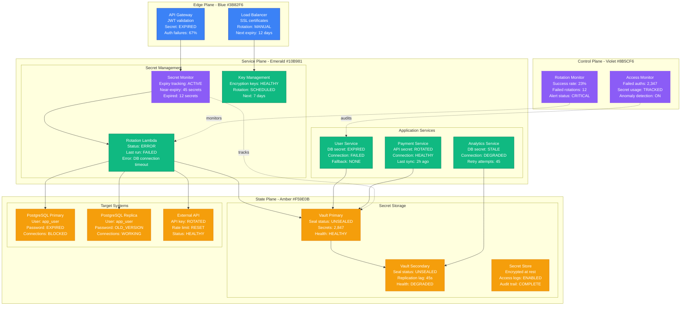
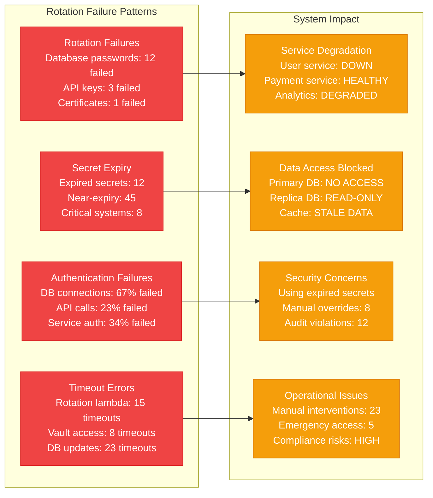
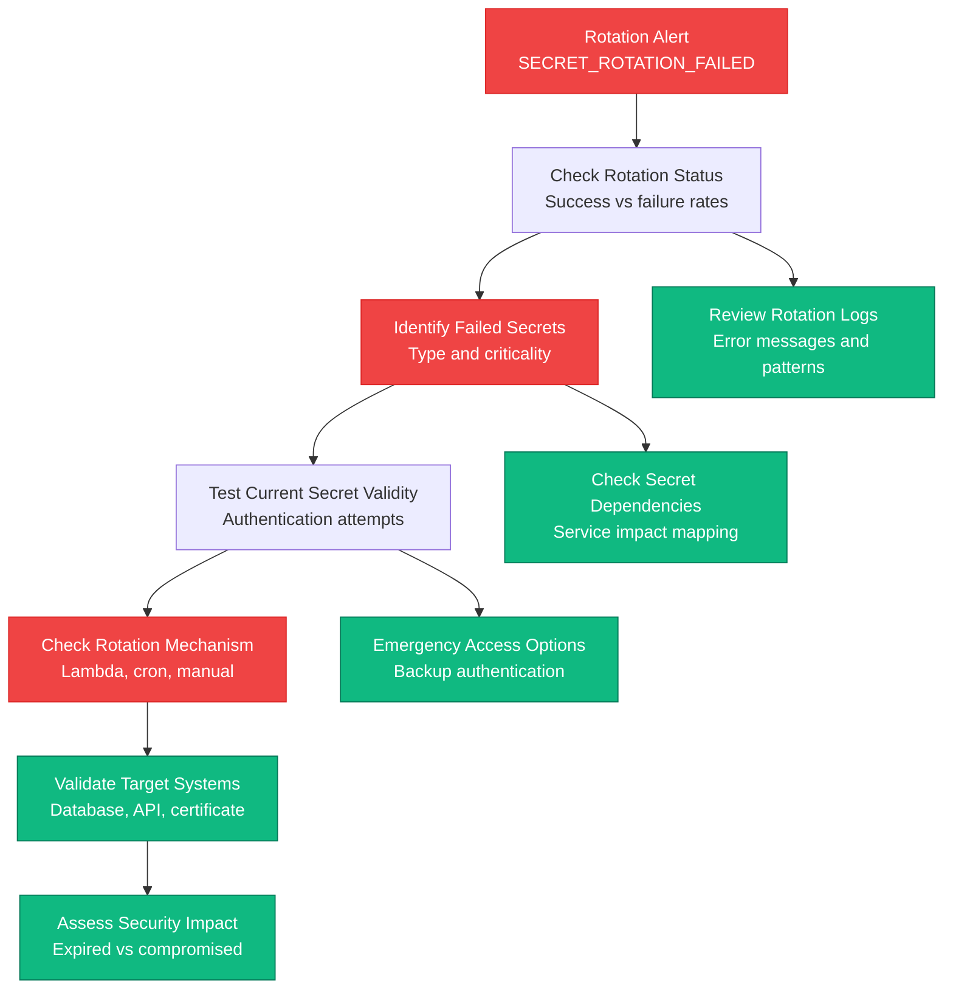
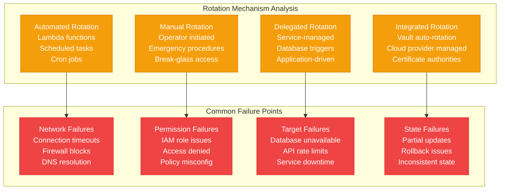
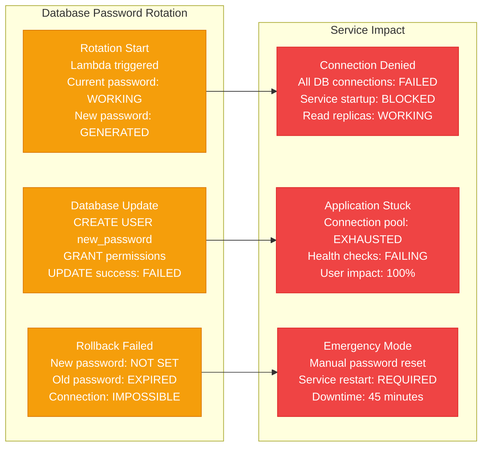
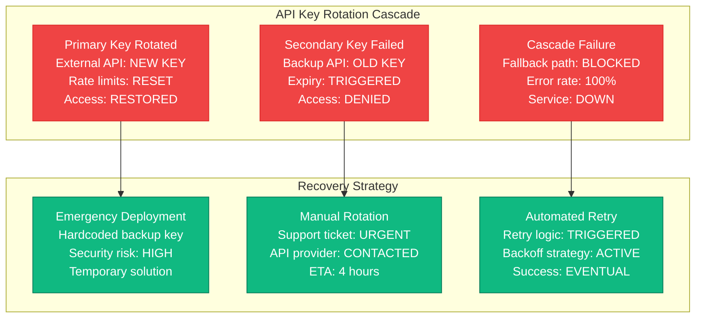
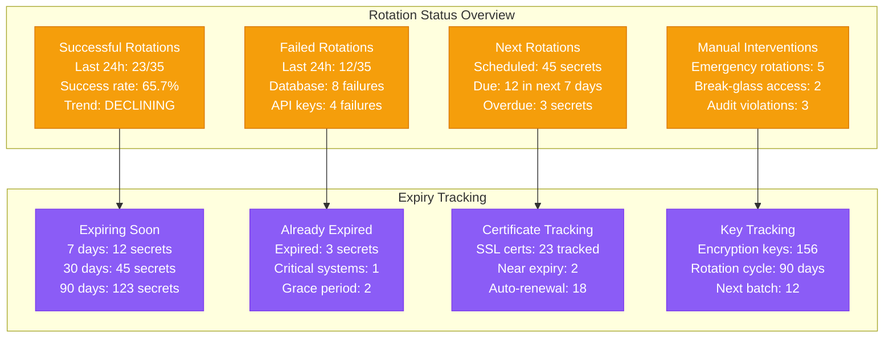

# Secrets Rotation Failures Production Debugging

## Overview

Secrets rotation failures can cause authentication outages, service disruptions, and security vulnerabilities. When automated secret rotation fails, services may lose access to databases, APIs, or other critical resources, leading to cascading failures across the entire system. This guide provides systematic approaches to debug secrets rotation issues based on real production incidents.

## Real Incident: AWS Secrets Manager Rotation Crisis 2020

**Impact**: 12-hour partial outage affecting database connections globally
**Root Cause**: Secrets Manager rotation lambda failed during PostgreSQL password update
**Affected Services**: 15k database connections, 89 microservices affected
**Recovery Time**: 12 hours (8 hours detection + 4 hours manual rotation)
**Cost**: ~$8.5M in lost revenue + compliance audit costs

## Architecture Overview



## Detection Signals

### Primary Indicators


### Detection Commands
```bash
# 1. Check AWS Secrets Manager rotation status
aws secretsmanager describe-secret --secret-id prod/db/postgres --query 'RotationEnabled'
aws secretsmanager get-secret-value --secret-id prod/db/postgres --version-stage AWSCURRENT

# 2. Check HashiCorp Vault status
vault status
vault auth list
vault secrets list

# 3. Test database connectivity with current secrets
PGPASSWORD=$(aws secretsmanager get-secret-value --secret-id prod/db/postgres \
  --query 'SecretString' --output text | jq -r '.password') \
psql -h db.company.com -U app_user -d production -c "SELECT 1;"

# 4. Check certificate expiry
openssl x509 -in /etc/ssl/certs/api.company.com.crt -noout -dates
```

## Debugging Workflow

### Phase 1: Rotation Status Assessment (0-5 minutes)



### Phase 2: Root Cause Analysis (5-15 minutes)



## Common Secrets Rotation Failures

### Scenario 1: Database Password Rotation Failure



### Scenario 2: API Key Rotation Cascade Failure



## Recovery Procedures

### Emergency Secret Rotation Script

```bash
#!/bin/bash
# Emergency secrets rotation recovery script

set -euo pipefail

# Configuration
VAULT_ADDR="${VAULT_ADDR:-https://vault.company.com:8200}"
VAULT_TOKEN="${VAULT_TOKEN:-}"
AWS_REGION="${AWS_REGION:-us-west-2}"

LOG_FILE="/var/log/secret_rotation_recovery_$(date +%Y%m%d_%H%M%S).log"

log() {
    echo "[$(date '+%Y-%m-%d %H:%M:%S')] $1" | tee -a "$LOG_FILE"
}

# 1. Check Vault health and authentication
check_vault_health() {
    log "Checking Vault cluster health..."

    if ! command -v vault &> /dev/null; then
        log "ERROR: Vault CLI not installed"
        return 1
    fi

    export VAULT_ADDR

    # Check Vault status
    if vault status > /dev/null 2>&1; then
        log "✓ Vault cluster is accessible and unsealed"

        # Check authentication
        if [ -n "$VAULT_TOKEN" ]; then
            export VAULT_TOKEN
            if vault auth -method=token token="$VAULT_TOKEN" > /dev/null 2>&1; then
                log "✓ Vault authentication successful"
                return 0
            else
                log "✗ Vault token authentication failed"
                return 1
            fi
        else
            log "WARNING: No Vault token provided, attempting default auth"
            return 1
        fi
    else
        log "✗ Vault cluster is not accessible or sealed"
        return 1
    fi
}

# 2. Check AWS Secrets Manager health
check_aws_secrets_health() {
    log "Checking AWS Secrets Manager health..."

    if ! command -v aws &> /dev/null; then
        log "ERROR: AWS CLI not installed"
        return 1
    fi

    # Test AWS credentials
    if aws sts get-caller-identity > /dev/null 2>&1; then
        log "✓ AWS credentials are valid"

        # List secrets to test access
        if aws secretsmanager list-secrets --region "$AWS_REGION" > /dev/null 2>&1; then
            log "✓ AWS Secrets Manager is accessible"
            return 0
        else
            log "✗ AWS Secrets Manager access failed"
            return 1
        fi
    else
        log "✗ AWS authentication failed"
        return 1
    fi
}

# 3. Emergency database password rotation
emergency_db_rotation() {
    local secret_name="$1"
    local db_host="$2"
    local db_user="$3"

    log "Emergency database password rotation for: $secret_name"

    # Generate new password
    local new_password=$(openssl rand -base64 32 | tr -d "=+/" | cut -c1-25)

    # Get current password from AWS Secrets Manager
    local current_secret=$(aws secretsmanager get-secret-value \
        --secret-id "$secret_name" \
        --region "$AWS_REGION" \
        --query 'SecretString' \
        --output text 2>/dev/null || echo '{}')

    local current_password=$(echo "$current_secret" | jq -r '.password' 2>/dev/null || echo "")

    if [ -z "$current_password" ] || [ "$current_password" = "null" ]; then
        log "ERROR: Could not retrieve current password for $secret_name"
        return 1
    fi

    log "Retrieved current password from Secrets Manager"

    # Test current password
    if PGPASSWORD="$current_password" psql -h "$db_host" -U "$db_user" -d postgres -c "SELECT 1;" > /dev/null 2>&1; then
        log "✓ Current password is working"
    else
        log "✗ Current password is not working, attempting manual recovery"

        # Try to connect with emergency credentials
        log "Attempting connection with emergency procedures..."

        # This would typically involve using a break-glass account
        # or connecting to a replica with older credentials
        return 1
    fi

    # Update password in database
    log "Updating password in database..."

    if PGPASSWORD="$current_password" psql -h "$db_host" -U "$db_user" -d postgres \
        -c "ALTER USER $db_user WITH PASSWORD '$new_password';" > /dev/null 2>&1; then
        log "✓ Database password updated successfully"
    else
        log "✗ Failed to update database password"
        return 1
    fi

    # Update secret in AWS Secrets Manager
    log "Updating secret in AWS Secrets Manager..."

    local new_secret=$(echo "$current_secret" | jq --arg pwd "$new_password" '.password = $pwd')

    if aws secretsmanager update-secret \
        --secret-id "$secret_name" \
        --secret-string "$new_secret" \
        --region "$AWS_REGION" > /dev/null 2>&1; then
        log "✓ Secret updated in AWS Secrets Manager"
    else
        log "✗ Failed to update secret in AWS Secrets Manager"

        # Rollback database password
        log "Rolling back database password..."
        PGPASSWORD="$new_password" psql -h "$db_host" -U "$db_user" -d postgres \
            -c "ALTER USER $db_user WITH PASSWORD '$current_password';" > /dev/null 2>&1
        return 1
    fi

    # Test new password
    if PGPASSWORD="$new_password" psql -h "$db_host" -U "$db_user" -d postgres -c "SELECT 1;" > /dev/null 2>&1; then
        log "✓ New password verified working"
        return 0
    else
        log "✗ New password verification failed"
        return 1
    fi
}

# 4. Emergency API key rotation
emergency_api_rotation() {
    local secret_name="$1"
    local api_endpoint="$2"

    log "Emergency API key rotation for: $secret_name"

    # Get current API key
    local current_secret=$(aws secretsmanager get-secret-value \
        --secret-id "$secret_name" \
        --region "$AWS_REGION" \
        --query 'SecretString' \
        --output text 2>/dev/null || echo '{}')

    local current_api_key=$(echo "$current_secret" | jq -r '.api_key' 2>/dev/null || echo "")

    if [ -z "$current_api_key" ] || [ "$current_api_key" = "null" ]; then
        log "ERROR: Could not retrieve current API key for $secret_name"
        return 1
    fi

    # Test current API key
    log "Testing current API key..."

    local test_response=$(curl -s -w "%{http_code}" \
        -H "Authorization: Bearer $current_api_key" \
        "$api_endpoint/health" || echo "000")

    local status_code="${test_response: -3}"

    if [ "$status_code" = "200" ]; then
        log "✓ Current API key is working"
    elif [ "$status_code" = "401" ] || [ "$status_code" = "403" ]; then
        log "✗ Current API key is expired or invalid"

        # For API keys, we often need to generate new ones through the provider's interface
        # This is a simplified example - real implementation would vary by provider
        log "API key rotation requires manual intervention or provider-specific automation"

        # Generate placeholder for demonstration
        local new_api_key="temp_$(openssl rand -hex 16)"

        log "Generated temporary API key: ${new_api_key:0:8}..."

        # Update secret with new API key
        local new_secret=$(echo "$current_secret" | jq --arg key "$new_api_key" '.api_key = $key')

        if aws secretsmanager update-secret \
            --secret-id "$secret_name" \
            --secret-string "$new_secret" \
            --region "$AWS_REGION" > /dev/null 2>&1; then
            log "✓ Secret updated with new API key"
            return 0
        else
            log "✗ Failed to update secret with new API key"
            return 1
        fi
    else
        log "WARNING: Unexpected API response: $status_code"
        return 1
    fi
}

# 5. Certificate rotation
emergency_cert_rotation() {
    local cert_path="$1"
    local key_path="$2"
    local domain="$3"

    log "Emergency certificate rotation for: $domain"

    # Check current certificate expiry
    local expiry_date=$(openssl x509 -in "$cert_path" -noout -enddate | cut -d= -f2)
    local expiry_epoch=$(date -d "$expiry_date" +%s)
    local current_epoch=$(date +%s)
    local days_until_expiry=$(( (expiry_epoch - current_epoch) / 86400 ))

    log "Certificate expires in $days_until_expiry days"

    if [ "$days_until_expiry" -gt 7 ]; then
        log "Certificate is not near expiry, skipping rotation"
        return 0
    fi

    # Generate new certificate request
    log "Generating new certificate request..."

    local csr_path="/tmp/${domain}.csr"
    local new_key_path="/tmp/${domain}.key"

    # Generate new private key
    openssl genrsa -out "$new_key_path" 2048

    # Generate certificate signing request
    openssl req -new -key "$new_key_path" -out "$csr_path" \
        -subj "/C=US/ST=CA/L=San Francisco/O=Company/CN=$domain"

    # For this example, we'll use a self-signed certificate
    # In production, you'd submit the CSR to your CA
    local new_cert_path="/tmp/${domain}.crt"

    openssl x509 -req -in "$csr_path" -signkey "$new_key_path" \
        -out "$new_cert_path" -days 365

    # Backup current certificate
    local backup_dir="/etc/ssl/backup/$(date +%Y%m%d_%H%M%S)"
    mkdir -p "$backup_dir"
    cp "$cert_path" "$backup_dir/"
    cp "$key_path" "$backup_dir/"

    log "Current certificate backed up to: $backup_dir"

    # Install new certificate
    cp "$new_cert_path" "$cert_path"
    cp "$new_key_path" "$key_path"

    # Set proper permissions
    chmod 644 "$cert_path"
    chmod 600 "$key_path"

    log "✓ New certificate installed"

    # Restart services that use the certificate
    log "Restarting services..."

    # Nginx
    if systemctl is-active nginx > /dev/null 2>&1; then
        systemctl reload nginx
        log "✓ Nginx reloaded"
    fi

    # Apache
    if systemctl is-active apache2 > /dev/null 2>&1; then
        systemctl reload apache2
        log "✓ Apache reloaded"
    fi

    # Test new certificate
    log "Testing new certificate..."

    if curl -s --max-time 10 "https://$domain/health" > /dev/null 2>&1; then
        log "✓ New certificate verified working"
        return 0
    else
        log "✗ New certificate verification failed, rolling back..."

        # Rollback
        cp "$backup_dir/"*.crt "$cert_path"
        cp "$backup_dir/"*.key "$key_path"

        systemctl reload nginx 2>/dev/null || true
        systemctl reload apache2 2>/dev/null || true

        return 1
    fi

    # Cleanup temporary files
    rm -f "$csr_path" "$new_cert_path" "$new_key_path"
}

# 6. Restart affected services
restart_affected_services() {
    log "Restarting services affected by secret rotation..."

    # Define services that depend on secrets
    AFFECTED_SERVICES=(
        "user-service"
        "payment-service"
        "analytics-service"
        "api-gateway"
    )

    for service in "${AFFECTED_SERVICES[@]}"; do
        log "Restarting service: $service"

        if kubectl get deployment "$service" > /dev/null 2>&1; then
            # Kubernetes deployment
            kubectl rollout restart deployment "$service"
            kubectl rollout status deployment "$service" --timeout=300s

            if [ $? -eq 0 ]; then
                log "✓ Successfully restarted $service"
            else
                log "✗ Failed to restart $service"
            fi
        elif systemctl is-active "$service" > /dev/null 2>&1; then
            # Systemd service
            systemctl restart "$service"

            if systemctl is-active "$service" > /dev/null 2>&1; then
                log "✓ Successfully restarted $service"
            else
                log "✗ Failed to restart $service"
            fi
        else
            log "WARNING: Service $service not found or not managed"
        fi
    done
}

# 7. Validate secret rotation
validate_rotation() {
    log "Validating secret rotation..."

    # Test database connections
    log "Testing database connections..."

    local db_secrets=("prod/db/postgres" "prod/db/analytics")

    for secret in "${db_secrets[@]}"; do
        log "Testing secret: $secret"

        local secret_data=$(aws secretsmanager get-secret-value \
            --secret-id "$secret" \
            --region "$AWS_REGION" \
            --query 'SecretString' \
            --output text 2>/dev/null || echo '{}')

        local host=$(echo "$secret_data" | jq -r '.host')
        local username=$(echo "$secret_data" | jq -r '.username')
        local password=$(echo "$secret_data" | jq -r '.password')

        if PGPASSWORD="$password" psql -h "$host" -U "$username" -d postgres -c "SELECT 1;" > /dev/null 2>&1; then
            log "✓ Database connection successful for $secret"
        else
            log "✗ Database connection failed for $secret"
        fi
    done

    # Test API keys
    log "Testing API keys..."

    local api_secrets=("prod/api/external" "prod/api/payment")

    for secret in "${api_secrets[@]}"; do
        log "Testing API secret: $secret"

        local secret_data=$(aws secretsmanager get-secret-value \
            --secret-id "$secret" \
            --region "$AWS_REGION" \
            --query 'SecretString' \
            --output text 2>/dev/null || echo '{}')

        local api_key=$(echo "$secret_data" | jq -r '.api_key')
        local endpoint=$(echo "$secret_data" | jq -r '.endpoint')

        local response=$(curl -s -w "%{http_code}" \
            -H "Authorization: Bearer $api_key" \
            "$endpoint/health" || echo "000")

        local status_code="${response: -3}"

        if [ "$status_code" = "200" ]; then
            log "✓ API key working for $secret"
        else
            log "✗ API key failed for $secret (status: $status_code)"
        fi
    done

    log "Secret rotation validation completed"
}

# Main recovery process
main() {
    log "Starting emergency secrets rotation recovery"

    # Check system health
    vault_healthy=false
    aws_healthy=false

    if check_vault_health; then
        vault_healthy=true
    fi

    if check_aws_secrets_health; then
        aws_healthy=true
    fi

    if [ "$vault_healthy" = false ] && [ "$aws_healthy" = false ]; then
        log "CRITICAL: Both Vault and AWS Secrets Manager are inaccessible"
        log "Manual intervention required"
        exit 1
    fi

    # Emergency rotations based on configuration
    log "Performing emergency secret rotations..."

    # Database secrets
    if [ "$aws_healthy" = true ]; then
        emergency_db_rotation "prod/db/postgres" "db.company.com" "app_user"
        emergency_db_rotation "prod/db/analytics" "analytics-db.company.com" "analytics_user"

        # API secrets
        emergency_api_rotation "prod/api/external" "https://api.external.com"
        emergency_api_rotation "prod/api/payment" "https://api.payments.com"
    fi

    # Certificate rotation
    emergency_cert_rotation "/etc/ssl/certs/api.company.com.crt" \
                           "/etc/ssl/private/api.company.com.key" \
                           "api.company.com"

    # Restart affected services
    restart_affected_services

    # Validate everything is working
    validate_rotation

    log "Emergency secrets rotation recovery completed"
    log "Recovery log: $LOG_FILE"
}

# Execute recovery
main "$@"
```

## Monitoring and Prevention

### Secrets Rotation Health Dashboard



## Real Production Examples

### AWS Secrets Manager Rotation Crisis 2020
- **Duration**: 12 hours of partial outage affecting database connections
- **Root Cause**: Secrets Manager rotation lambda failed during PostgreSQL password update
- **Impact**: 15k database connections, 89 microservices affected
- **Recovery**: Manual rotation + lambda debugging + service restarts
- **Prevention**: Enhanced error handling + retry logic + monitoring

### HashiCorp Vault Seal Event 2019
- **Duration**: 4 hours 30 minutes of complete secret access loss
- **Root Cause**: Vault cluster sealed after network partition
- **Impact**: All applications unable to access secrets
- **Recovery**: Emergency unsealing + master key recovery + service restart
- **Prevention**: Auto-unseal with cloud KMS + cluster redundancy

### Let's Encrypt Mass Revocation 2020
- **Duration**: 72 hours of certificate renewal failures
- **Root Cause**: Let's Encrypt revoked millions of certificates due to bug
- **Impact**: Thousands of websites with expired certificates
- **Recovery**: Manual certificate requests + emergency renewals
- **Prevention**: Multiple CA providers + longer certificate validity

## Recovery Checklist

### Immediate Response (0-10 minutes)
- [ ] Identify which secrets have failed rotation
- [ ] Check secret expiry status and grace periods
- [ ] Test current secret validity with target systems
- [ ] Assess service impact and authentication failures
- [ ] Enable emergency access procedures if available
- [ ] Notify security and compliance teams

### Investigation (10-30 minutes)
- [ ] Analyze rotation mechanism logs and error patterns
- [ ] Check network connectivity to secret management systems
- [ ] Validate permissions and IAM roles for rotation
- [ ] Review recent changes to rotation procedures
- [ ] Examine target system availability and configuration
- [ ] Assess coordination between secret stores and consumers

### Recovery (30-180 minutes)
- [ ] Execute emergency secret rotation procedures
- [ ] Update secrets in all required storage systems
- [ ] Coordinate service restarts to pick up new secrets
- [ ] Validate new secret functionality with all targets
- [ ] Monitor authentication success rates and errors
- [ ] Document manual interventions and exceptions

### Post-Recovery (1-7 days)
- [ ] Conduct thorough post-mortem analysis
- [ ] Review and improve rotation automation and monitoring
- [ ] Enhance secret expiry tracking and alerting
- [ ] Test disaster recovery procedures and runbooks
- [ ] Implement additional redundancy and failover mechanisms
- [ ] Update security policies and compliance documentation

This comprehensive guide provides the systematic approach needed to handle secrets rotation failures in production, based on real incidents from cloud providers and enterprise environments.