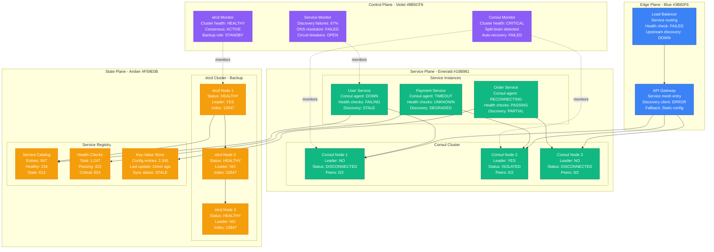
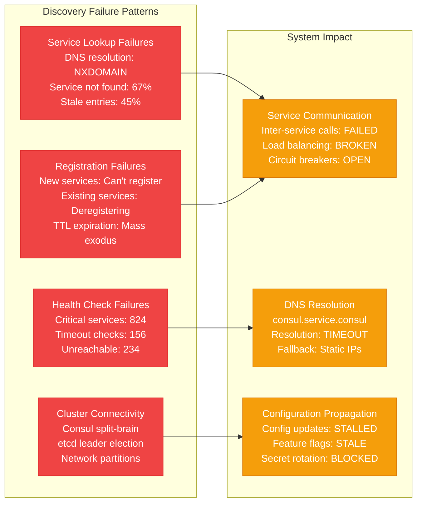
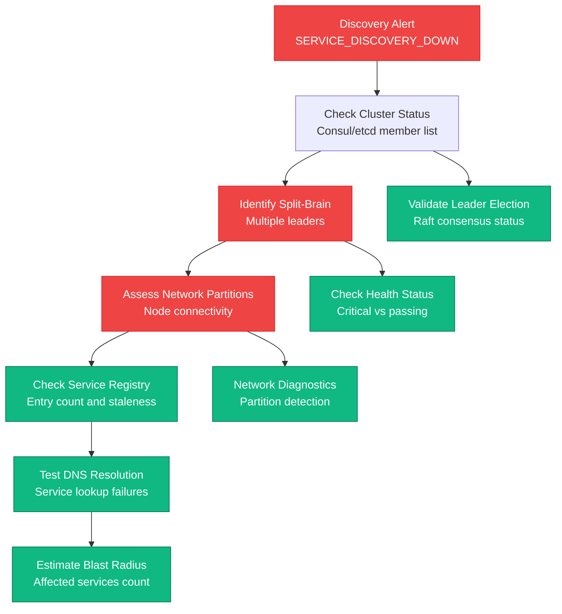
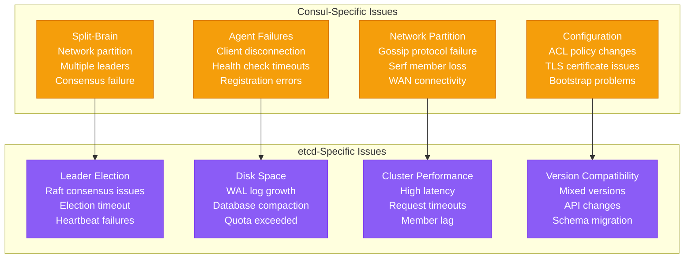
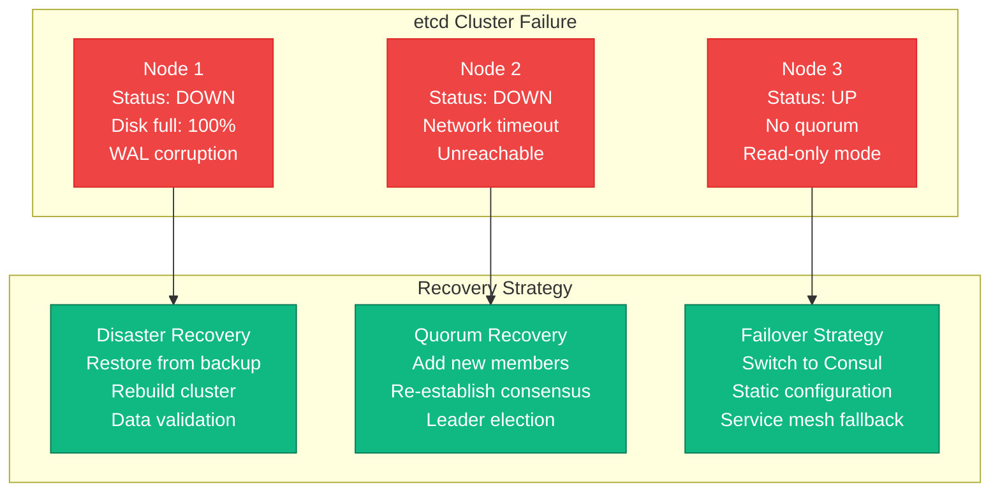
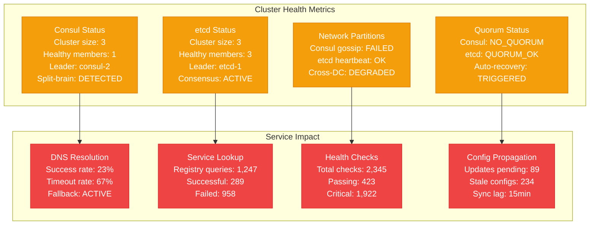

# Service Discovery Failures (Consul/etcd) Production Debugging

## Overview

Service discovery failures can completely isolate services, causing cascading outages and split-brain scenarios. When Consul or etcd clusters fail, services lose the ability to find each other, leading to complete system breakdown. This guide provides systematic approaches to debug service discovery issues based on real production incidents.

## Real Incident: Cloudflare's 2020 Consul Cluster Meltdown

**Impact**: 27-minute global outage affecting all Cloudflare services
**Root Cause**: Consul cluster split-brain during routine maintenance
**Services Affected**: DNS, CDN, security services - all Cloudflare products
**Recovery Time**: 27 minutes to restore service discovery + 2 hours full recovery
**Cost**: ~$6M in SLA credits + reputation damage

## Architecture Overview



## Detection Signals

### Primary Indicators


### Detection Commands
```bash
# 1. Check Consul cluster status
consul members
consul operator raft list-peers
consul info | grep -E "(leader|cluster)"

# 2. Check etcd cluster health
etcdctl member list
etcdctl endpoint health --cluster
etcdctl endpoint status --cluster

# 3. Service discovery test
dig @127.0.0.1 -p 8600 user-service.service.consul
consul catalog services
consul health checks user-service

# 4. Network connectivity
telnet consul-1.company.com 8301
nc -zv etcd-1.company.com 2379 2380
```

## Debugging Workflow

### Phase 1: Cluster State Assessment (0-5 minutes)



### Phase 2: Root Cause Analysis (5-15 minutes)



## Common Service Discovery Failures

### Scenario 1: Consul Split-Brain

```mermaid
graph LR
    subgraph SplitBrainScenario[Consul Split-Brain]
        P1[Partition 1<br/>Consul-1 (Leader)<br/>Consul-2 (Follower)<br/>Services: 400]

        P2[Partition 2<br/>Consul-3 (Leader)<br/>Isolated node<br/>Services: 447]

        NW[Network Issue<br/>Switch failure<br/>Firewall rules<br/>Packet loss: 60%]
    end

    subgraph Impact[Split-Brain Impact]
        DS[Divergent State<br/>Different service views<br/>Stale health checks<br/>Configuration drift]

        SC[Service Confusion<br/>Load balancer chaos<br/>Failed service calls<br/>Timeout cascades]

        DR[Data Recovery<br/>Manual intervention<br/>Cluster rebuild<br/>State reconciliation]
    end

    P1 --> DS
    P2 --> SC
    NW --> DR

    classDef splitStyle fill:#EF4444,stroke:#DC2626,color:#fff
    classDef impactStyle fill:#F59E0B,stroke:#D97706,color:#fff

    class P1,P2,NW splitStyle
    class DS,SC,DR impactStyle
```

### Scenario 2: etcd Cluster Failure



## Recovery Procedures

### Consul Split-Brain Recovery

```bash
#!/bin/bash
# Consul split-brain recovery script

set -euo pipefail

LOG_FILE="/var/log/consul_recovery_$(date +%Y%m%d_%H%M%S).log"

log() {
    echo "[$(date '+%Y-%m-%d %H:%M:%S')] $1" | tee -a "$LOG_FILE"
}

# 1. Identify the split-brain situation
check_split_brain() {
    log "Checking for Consul split-brain..."

    # Get all Consul nodes
    CONSUL_NODES=("consul-1.company.com" "consul-2.company.com" "consul-3.company.com")

    declare -A leaders

    for node in "${CONSUL_NODES[@]}"; do
        leader=$(consul info -http-addr="http://${node}:8500" 2>/dev/null | \
                grep "leader_addr" | cut -d'"' -f4 || echo "unreachable")
        leaders[$node]=$leader
        log "Node $node reports leader: ${leaders[$node]}"
    done

    # Check for multiple leaders
    unique_leaders=$(printf '%s\n' "${leaders[@]}" | sort -u | wc -l)

    if [ "$unique_leaders" -gt 1 ]; then
        log "SPLIT-BRAIN DETECTED: $unique_leaders different leaders reported"
        return 0
    else
        log "No split-brain detected"
        return 1
    fi
}

# 2. Stop all Consul agents
stop_consul_cluster() {
    log "Stopping all Consul agents..."

    for node in "${CONSUL_NODES[@]}"; do
        log "Stopping Consul on $node"
        ssh "$node" "sudo systemctl stop consul" || log "Failed to stop Consul on $node"
    done

    # Wait for graceful shutdown
    sleep 10
}

# 3. Choose the authoritative node (usually the one with most recent data)
choose_authoritative_node() {
    log "Choosing authoritative node..."

    declare -A last_indexes

    for node in "${CONSUL_NODES[@]}"; do
        # Check the last index in the data directory
        last_index=$(ssh "$node" "sudo ls -la /opt/consul/data/raft/ | grep -o 'raft.db' | wc -l" 2>/dev/null || echo "0")
        last_indexes[$node]=$last_index
        log "Node $node last index: $last_index"
    done

    # Find node with highest index
    auth_node=""
    max_index=0

    for node in "${!last_indexes[@]}"; do
        if [ "${last_indexes[$node]}" -gt "$max_index" ]; then
            max_index=${last_indexes[$node]}
            auth_node=$node
        fi
    done

    log "Selected authoritative node: $auth_node (index: $max_index)"
    echo "$auth_node"
}

# 4. Clean and rebuild cluster
rebuild_cluster() {
    local auth_node="$1"

    log "Rebuilding Consul cluster with $auth_node as authoritative..."

    # Clean data on non-authoritative nodes
    for node in "${CONSUL_NODES[@]}"; do
        if [ "$node" != "$auth_node" ]; then
            log "Cleaning data on $node"
            ssh "$node" "sudo rm -rf /opt/consul/data/raft/*"
            ssh "$node" "sudo rm -rf /opt/consul/data/serf/*"
        fi
    done

    # Start authoritative node first (bootstrap mode)
    log "Starting authoritative node $auth_node in bootstrap mode"
    ssh "$auth_node" "sudo consul agent -config-dir=/etc/consul.d -bootstrap-expect=1 -data-dir=/opt/consul/data" &

    sleep 15

    # Start other nodes and join cluster
    for node in "${CONSUL_NODES[@]}"; do
        if [ "$node" != "$auth_node" ]; then
            log "Starting and joining $node to cluster"
            ssh "$node" "sudo systemctl start consul"
            sleep 5
            ssh "$node" "sudo consul join $auth_node"
        fi
    done

    # Verify cluster formation
    sleep 10
    consul members
    consul info | grep cluster_addr
}

# 5. Validate recovery
validate_recovery() {
    log "Validating Consul cluster recovery..."

    # Check cluster membership
    member_count=$(consul members | grep -c "alive" || echo "0")
    expected_members=${#CONSUL_NODES[@]}

    if [ "$member_count" -eq "$expected_members" ]; then
        log "✓ All $expected_members members are alive"
    else
        log "✗ Only $member_count of $expected_members members are alive"
        return 1
    fi

    # Check leader election
    leader=$(consul info | grep "leader_addr" | cut -d'"' -f4)
    if [ -n "$leader" ]; then
        log "✓ Leader elected: $leader"
    else
        log "✗ No leader elected"
        return 1
    fi

    # Test service discovery
    if consul catalog services > /dev/null 2>&1; then
        log "✓ Service catalog accessible"
    else
        log "✗ Service catalog inaccessible"
        return 1
    fi

    log "Consul cluster recovery validated successfully"
    return 0
}

# Main recovery process
main() {
    log "Starting Consul split-brain recovery process"

    if check_split_brain; then
        log "Split-brain confirmed, proceeding with recovery"

        # Emergency backup
        log "Creating emergency backup..."
        for node in "${CONSUL_NODES[@]}"; do
            ssh "$node" "sudo tar -czf /tmp/consul_backup_$(date +%Y%m%d_%H%M%S).tar.gz /opt/consul/data/" &
        done
        wait

        stop_consul_cluster
        auth_node=$(choose_authoritative_node)
        rebuild_cluster "$auth_node"

        if validate_recovery; then
            log "Consul split-brain recovery completed successfully"
        else
            log "Consul split-brain recovery validation failed"
            exit 1
        fi
    else
        log "No split-brain detected, exiting"
    fi

    log "Recovery process completed. Log: $LOG_FILE"
}

# Run recovery
main "$@"
```

### etcd Cluster Recovery

```bash
#!/bin/bash
# etcd cluster disaster recovery script

set -euo pipefail

ETCD_DATA_DIR="/var/lib/etcd"
BACKUP_DIR="/opt/etcd-backups"
CLUSTER_TOKEN="etcd-cluster-1"

log() {
    echo "[$(date '+%Y-%m-%d %H:%M:%S')] $1"
}

# 1. Check cluster health
check_etcd_health() {
    log "Checking etcd cluster health..."

    # Check if any members are responding
    if etcdctl endpoint health --cluster 2>/dev/null; then
        log "Some etcd members are healthy"
        return 0
    else
        log "No etcd members responding - cluster failure detected"
        return 1
    fi
}

# 2. Create emergency backup from healthy member
create_emergency_backup() {
    log "Creating emergency backup..."

    # Find a healthy member
    for endpoint in $(etcdctl member list --endpoints=$ETCD_ENDPOINTS -w simple | cut -d',' -f5); do
        if etcdctl endpoint health --endpoints="$endpoint" 2>/dev/null; then
            log "Creating backup from healthy endpoint: $endpoint"

            BACKUP_FILE="$BACKUP_DIR/emergency_backup_$(date +%Y%m%d_%H%M%S).db"
            etcdctl snapshot save "$BACKUP_FILE" --endpoints="$endpoint"

            if [ $? -eq 0 ]; then
                log "Emergency backup created: $BACKUP_FILE"
                echo "$BACKUP_FILE"
                return 0
            fi
        fi
    done

    log "No healthy members found for backup"
    return 1
}

# 3. Stop all etcd instances
stop_etcd_cluster() {
    log "Stopping all etcd instances..."

    ETCD_NODES=("etcd-1" "etcd-2" "etcd-3")

    for node in "${ETCD_NODES[@]}"; do
        log "Stopping etcd on $node"
        ssh "$node" "sudo systemctl stop etcd" || log "Failed to stop etcd on $node"
    done

    sleep 5
}

# 4. Restore from backup
restore_from_backup() {
    local backup_file="$1"

    log "Restoring etcd cluster from backup: $backup_file"

    # Restore on each node with unique member names
    ETCD_NODES=("etcd-1" "etcd-2" "etcd-3")
    INITIAL_CLUSTER=""

    # Build initial cluster string
    for i in "${!ETCD_NODES[@]}"; do
        node="${ETCD_NODES[$i]}"
        if [ $i -eq 0 ]; then
            INITIAL_CLUSTER="${node}=http://${node}.company.com:2380"
        else
            INITIAL_CLUSTER="${INITIAL_CLUSTER},${node}=http://${node}.company.com:2380"
        fi
    done

    for node in "${ETCD_NODES[@]}"; do
        log "Restoring data on $node"

        # Clean existing data
        ssh "$node" "sudo rm -rf $ETCD_DATA_DIR/*"

        # Restore from snapshot
        ssh "$node" "sudo etcdctl snapshot restore $backup_file \
            --name=$node \
            --initial-cluster=$INITIAL_CLUSTER \
            --initial-cluster-token=$CLUSTER_TOKEN \
            --initial-advertise-peer-urls=http://$node.company.com:2380 \
            --data-dir=$ETCD_DATA_DIR"

        if [ $? -eq 0 ]; then
            log "✓ Data restored on $node"
        else
            log "✗ Failed to restore data on $node"
            return 1
        fi
    done
}

# 5. Start etcd cluster
start_etcd_cluster() {
    log "Starting etcd cluster..."

    for node in "${ETCD_NODES[@]}"; do
        log "Starting etcd on $node"
        ssh "$node" "sudo systemctl start etcd"

        # Wait for startup
        sleep 10

        # Check if started successfully
        if ssh "$node" "sudo systemctl is-active etcd" | grep -q "active"; then
            log "✓ etcd started successfully on $node"
        else
            log "✗ Failed to start etcd on $node"
        fi
    done
}

# 6. Validate cluster recovery
validate_etcd_recovery() {
    log "Validating etcd cluster recovery..."

    # Wait for cluster to stabilize
    sleep 30

    # Check member list
    if etcdctl member list; then
        log "✓ Member list accessible"
    else
        log "✗ Cannot access member list"
        return 1
    fi

    # Check cluster health
    if etcdctl endpoint health --cluster; then
        log "✓ Cluster health check passed"
    else
        log "✗ Cluster health check failed"
        return 1
    fi

    # Test basic operations
    if etcdctl put test-key test-value && etcdctl get test-key; then
        log "✓ Basic operations working"
        etcdctl del test-key
    else
        log "✗ Basic operations failed"
        return 1
    fi

    log "etcd cluster recovery validated successfully"
    return 0
}

# Main recovery process
main() {
    log "Starting etcd cluster disaster recovery"

    # Use latest backup if cluster is completely down
    if ! check_etcd_health; then
        log "Cluster is down, using latest backup for recovery"

        # Find latest backup
        LATEST_BACKUP=$(ls -t $BACKUP_DIR/*.db 2>/dev/null | head -1)

        if [ -z "$LATEST_BACKUP" ]; then
            log "No backup found, cannot recover"
            exit 1
        fi

        log "Using backup: $LATEST_BACKUP"
        BACKUP_FILE="$LATEST_BACKUP"
    else
        # Create emergency backup from healthy member
        BACKUP_FILE=$(create_emergency_backup)
        if [ $? -ne 0 ]; then
            log "Failed to create emergency backup"
            exit 1
        fi
    fi

    # Perform recovery
    stop_etcd_cluster
    restore_from_backup "$BACKUP_FILE"
    start_etcd_cluster

    if validate_etcd_recovery; then
        log "etcd cluster recovery completed successfully"
    else
        log "etcd cluster recovery validation failed"
        exit 1
    fi
}

# Set etcd endpoints
export ETCDCTL_API=3
export ETCD_ENDPOINTS="etcd-1.company.com:2379,etcd-2.company.com:2379,etcd-3.company.com:2379"

# Run recovery
main "$@"
```

## Service Discovery Failover Strategies

### DNS-Based Failover

```yaml
# CoreDNS configuration for service discovery failover
apiVersion: v1
kind: ConfigMap
metadata:
  name: coredns-custom
data:
  Corefile: |
    .:53 {
        errors
        health {
            lameduck 5s
        }
        ready

        # Primary: Consul DNS
        consul company.service.consul:8600 {
            fallthrough in-addr.arpa ip6.arpa
        }

        # Fallback: etcd-based DNS
        etcd company.service.etcd:2379 {
            path /skydns
            fallthrough in-addr.arpa ip6.arpa
        }

        # Final fallback: Static DNS
        file /etc/coredns/db.company.com company.com {
            reload 15s
        }

        prometheus :9153
        forward . /etc/resolv.conf {
            max_concurrent 1000
        }
        cache 30
        loop
        reload
        loadbalance
    }
```

### Service Mesh Fallback

```yaml
# Istio service discovery configuration with fallback
apiVersion: networking.istio.io/v1beta1
kind: ServiceEntry
metadata:
  name: user-service-fallback
spec:
  hosts:
  - user-service.company.com
  ports:
  - number: 80
    name: http
    protocol: HTTP
  resolution: DNS

  # Primary endpoints from Consul
  endpoints:
  - address: user-service.service.consul
    ports:
      http: 80

  # Fallback static endpoints
  - address: 10.0.1.100
    ports:
      http: 80
  - address: 10.0.1.101
    ports:
      http: 80

---
apiVersion: networking.istio.io/v1beta1
kind: DestinationRule
metadata:
  name: user-service-circuit-breaker
spec:
  host: user-service.company.com
  trafficPolicy:
    outlierDetection:
      consecutiveGatewayErrors: 3
      interval: 30s
      baseEjectionTime: 30s
      maxEjectionPercent: 50
    connectionPool:
      tcp:
        maxConnections: 100
        connectTimeout: 10s
      http:
        http1MaxPendingRequests: 50
        maxRequestsPerConnection: 10
```

## Monitoring and Prevention

### Service Discovery Health Dashboard



## Real Production Examples

### Cloudflare's 2020 Consul Cluster Meltdown
- **Duration**: 27 minutes global outage + 2 hours full recovery
- **Root Cause**: Consul cluster split-brain during routine maintenance
- **Impact**: All Cloudflare services (DNS, CDN, security) unavailable
- **Recovery**: Emergency cluster rebuild + traffic engineering
- **Prevention**: Enhanced cluster monitoring + automated split-brain detection

### Kubernetes etcd Disaster 2019
- **Duration**: 4 hours 30 minutes
- **Root Cause**: etcd cluster complete failure due to disk corruption
- **Impact**: Kubernetes control plane down, no pod scheduling
- **Recovery**: Disaster recovery from backup + cluster rebuild
- **Prevention**: Regular backup validation + disk monitoring

### Netflix's Service Discovery Outage 2018
- **Duration**: 2 hours 15 minutes
- **Root Cause**: Eureka cluster overload during traffic spike
- **Impact**: Microservices unable to discover each other
- **Recovery**: Cluster scaling + caching layer addition
- **Prevention**: Load testing + capacity planning improvements

## Recovery Checklist

### Immediate Response (0-10 minutes)
- [ ] Identify cluster state (split-brain, quorum loss, complete failure)
- [ ] Check network connectivity between cluster nodes
- [ ] Assess service impact and affected applications
- [ ] Enable DNS/service discovery fallback mechanisms
- [ ] Create emergency backup from any healthy members
- [ ] Notify stakeholders and escalate if needed

### Investigation (10-30 minutes)
- [ ] Analyze cluster logs for root cause identification
- [ ] Check network partition and connectivity issues
- [ ] Validate cluster configuration and membership
- [ ] Review recent changes or maintenance activities
- [ ] Assess data consistency and potential corruption
- [ ] Determine recovery strategy based on failure type

### Recovery (30-180 minutes)
- [ ] Execute appropriate recovery procedure (rebuild vs restore)
- [ ] Validate cluster consensus and leader election
- [ ] Test service registration and discovery functionality
- [ ] Verify health check propagation and DNS resolution
- [ ] Gradually restore service traffic and monitoring
- [ ] Document recovery steps and timeline

### Post-Recovery (1-7 days)
- [ ] Conduct thorough post-mortem analysis
- [ ] Review and improve cluster monitoring and alerting
- [ ] Enhance network partition detection and recovery
- [ ] Test and validate backup/restore procedures
- [ ] Implement additional redundancy and failover mechanisms
- [ ] Train team on service discovery troubleshooting

This comprehensive guide provides the systematic approach needed to handle service discovery failures in production, based on real incidents from companies like Cloudflare and other major cloud providers.