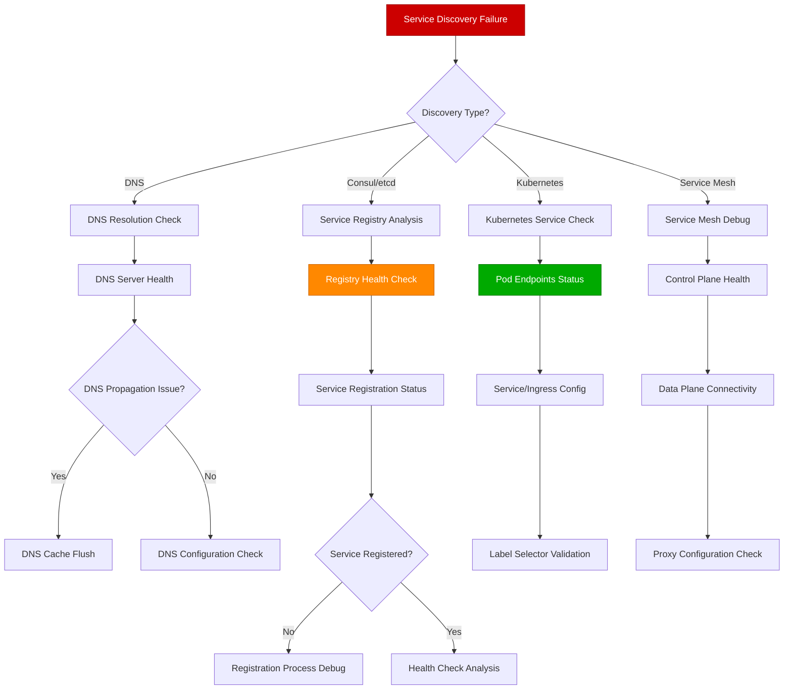

# Service Discovery Failures Guide

## Overview

Service discovery failures can cause complete service outages, intermittent connection failures, and cascading issues across microservice architectures. This guide provides systematic approaches used by platform teams at Google, Netflix, and Uber to diagnose and resolve service discovery issues in production environments.

**Time to Resolution**: 5-15 minutes for DNS issues, 30-90 minutes for complex service mesh problems

## Decision Tree



## Immediate Triage Commands (First 5 Minutes)

### 1. Basic Connectivity Test
```bash
# Test service resolution and connectivity
service_name="user-service"
service_port="8080"

# DNS resolution test
nslookup $service_name
dig $service_name A

# Direct connectivity test
nc -zv $service_name $service_port
telnet $service_name $service_port

# HTTP health check
curl -v http://$service_name:$service_port/health --max-time 5
```

### 2. Service Registry Status
```bash
# Consul service discovery
consul catalog services
consul catalog nodes
consul health service $service_name

# etcd service registry (if using etcd for service discovery)
etcdctl get --prefix /services/
etcdctl get /services/$service_name

# Kubernetes service status
kubectl get services
kubectl get endpoints $service_name
kubectl describe service $service_name
```

### 3. Load Balancer Health
```bash
# Nginx upstream status
curl -s http://load-balancer/nginx_status | grep -A 10 "upstream"

# HAProxy stats (if available)
curl -s http://load-balancer:8404/stats | grep $service_name

# AWS ELB health (if using AWS)
aws elbv2 describe-target-health --target-group-arn arn:aws:elasticloadbalancing:region:account:targetgroup/service-tg

# Check for recent load balancer configuration changes
grep -n "server.*$service_name" /etc/nginx/conf.d/*.conf
```

## DNS Service Discovery Debugging

### 1. DNS Resolution Analysis
```bash
# Comprehensive DNS debugging script
#!/bin/bash

SERVICE_NAME="$1"
if [ -z "$SERVICE_NAME" ]; then
    echo "Usage: $0 <service_name>"
    exit 1
fi

echo "=== DNS Resolution Analysis for $SERVICE_NAME ==="

# Basic DNS lookup
echo "--- Basic DNS Lookup ---"
nslookup $SERVICE_NAME
dig $SERVICE_NAME A +short

# Check all DNS record types
echo "--- All DNS Records ---"
for record_type in A AAAA CNAME MX TXT SRV; do
    echo "Record type $record_type:"
    dig $SERVICE_NAME $record_type +short
done

# Check DNS propagation across multiple DNS servers
echo "--- DNS Propagation Check ---"
dns_servers=("8.8.8.8" "1.1.1.1" "208.67.222.222")
for dns_server in "${dns_servers[@]}"; do
    echo "Checking against $dns_server:"
    dig @$dns_server $SERVICE_NAME A +short
done

# Check local DNS cache
echo "--- Local DNS Cache ---"
if command -v systemd-resolve &> /dev/null; then
    systemd-resolve --status
    systemd-resolve --flush-caches
elif command -v dscacheutil &> /dev/null; then
    dscacheutil -q host -a name $SERVICE_NAME
    sudo dscacheutil -flushcache
fi

# Check DNS configuration
echo "--- DNS Configuration ---"
cat /etc/resolv.conf
cat /etc/hosts | grep -i $SERVICE_NAME

# Test with different protocols
echo "--- Protocol Tests ---"
dig $SERVICE_NAME A +tcp
dig $SERVICE_NAME A +notcp

echo "=== End DNS Analysis ==="
```

### 2. DNS Server Health Monitoring
```python
# Python DNS health monitoring script
import dns.resolver
import dns.query
import dns.message
import time
import logging
from typing import List, Dict, Optional
from dataclasses import dataclass
from datetime import datetime

@dataclass
class DNSHealthResult:
    server: str
    response_time: float
    success: bool
    error: Optional[str]
    record_count: int

class DNSHealthMonitor:
    def __init__(self, dns_servers: List[str], test_domains: List[str]):
        self.dns_servers = dns_servers
        self.test_domains = test_domains
        self.logger = logging.getLogger(__name__)

    def check_dns_server_health(self, server: str, domain: str) -> DNSHealthResult:
        """Check health of a specific DNS server"""
        try:
            start_time = time.time()

            # Create resolver pointing to specific server
            resolver = dns.resolver.Resolver(configure=False)
            resolver.nameservers = [server]
            resolver.timeout = 5
            resolver.lifetime = 10

            # Query the domain
            answer = resolver.resolve(domain, 'A')
            response_time = (time.time() - start_time) * 1000  # Convert to milliseconds

            return DNSHealthResult(
                server=server,
                response_time=response_time,
                success=True,
                error=None,
                record_count=len(answer)
            )

        except Exception as e:
            response_time = (time.time() - start_time) * 1000
            return DNSHealthResult(
                server=server,
                response_time=response_time,
                success=False,
                error=str(e),
                record_count=0
            )

    def check_all_servers(self) -> Dict[str, Dict[str, DNSHealthResult]]:
        """Check health of all DNS servers for all test domains"""
        results = {}

        for domain in self.test_domains:
            results[domain] = {}
            for server in self.dns_servers:
                result = self.check_dns_server_health(server, domain)
                results[domain][server] = result

                if not result.success:
                    self.logger.error(f"DNS failure: {server} for {domain}: {result.error}")
                elif result.response_time > 1000:  # 1 second
                    self.logger.warning(f"Slow DNS response: {server} for {domain}: {result.response_time:.2f}ms")

        return results

    def detect_dns_issues(self, results: Dict[str, Dict[str, DNSHealthResult]]) -> Dict[str, List[str]]:
        """Detect DNS issues from health check results"""
        issues = {
            'server_failures': [],
            'slow_responses': [],
            'inconsistent_results': [],
            'propagation_issues': []
        }

        for domain, server_results in results.items():
            successful_servers = []
            failed_servers = []
            slow_servers = []

            for server, result in server_results.items():
                if not result.success:
                    failed_servers.append(server)
                else:
                    successful_servers.append(server)
                    if result.response_time > 1000:
                        slow_servers.append(server)

            # Check for server failures
            if failed_servers:
                issues['server_failures'].extend([f"{domain}@{server}" for server in failed_servers])

            # Check for slow responses
            if slow_servers:
                issues['slow_responses'].extend([f"{domain}@{server}" for server in slow_servers])

            # Check for inconsistent record counts (propagation issues)
            record_counts = [result.record_count for result in server_results.values() if result.success]
            if len(set(record_counts)) > 1:
                issues['inconsistent_results'].append(f"{domain}: counts {record_counts}")

        return issues

    def generate_health_report(self) -> Dict:
        """Generate comprehensive DNS health report"""
        results = self.check_all_servers()
        issues = self.detect_dns_issues(results)

        overall_health = {
            'healthy': len(issues['server_failures']) == 0 and len(issues['slow_responses']) < len(self.dns_servers) * 0.5,
            'timestamp': datetime.now().isoformat(),
            'total_checks': len(self.test_domains) * len(self.dns_servers),
            'failed_checks': len(issues['server_failures']),
            'slow_checks': len(issues['slow_responses'])
        }

        return {
            'overall_health': overall_health,
            'detailed_results': results,
            'detected_issues': issues,
            'recommendations': self.generate_recommendations(issues)
        }

    def generate_recommendations(self, issues: Dict[str, List[str]]) -> List[str]:
        """Generate recommendations based on detected issues"""
        recommendations = []

        if issues['server_failures']:
            recommendations.append("Check DNS server connectivity and configuration")
            recommendations.append("Consider removing failed DNS servers from rotation")

        if issues['slow_responses']:
            recommendations.append("Investigate network latency to slow DNS servers")
            recommendations.append("Consider adjusting DNS timeout configurations")

        if issues['inconsistent_results']:
            recommendations.append("Check DNS record propagation across all servers")
            recommendations.append("Verify DNS zone transfer configurations")

        if not any(issues.values()):
            recommendations.append("DNS infrastructure appears healthy")

        return recommendations

# Usage example
if __name__ == '__main__':
    dns_servers = ['8.8.8.8', '1.1.1.1', '208.67.222.222', '192.168.1.1']  # Include local DNS
    test_domains = ['user-service.internal', 'api-gateway.internal', 'database.internal']

    monitor = DNSHealthMonitor(dns_servers, test_domains)
    health_report = monitor.generate_health_report()

    print(f"Overall Health: {'HEALTHY' if health_report['overall_health']['healthy'] else 'UNHEALTHY'}")
    print(f"Failed Checks: {health_report['overall_health']['failed_checks']}")
    print(f"Slow Checks: {health_report['overall_health']['slow_checks']}")

    if health_report['detected_issues']['server_failures']:
        print(f"Server Failures: {health_report['detected_issues']['server_failures']}")

    for recommendation in health_report['recommendations']:
        print(f"Recommendation: {recommendation}")
```

## Kubernetes Service Discovery Debugging

### 1. Kubernetes Service and Endpoints Analysis
```bash
# Comprehensive Kubernetes service debugging
#!/bin/bash

SERVICE_NAME="$1"
NAMESPACE="${2:-default}"

if [ -z "$SERVICE_NAME" ]; then
    echo "Usage: $0 <service_name> [namespace]"
    exit 1
fi

echo "=== Kubernetes Service Discovery Debug for $SERVICE_NAME in $NAMESPACE ==="

# Service status
echo "--- Service Status ---"
kubectl get service $SERVICE_NAME -n $NAMESPACE -o wide
kubectl describe service $SERVICE_NAME -n $NAMESPACE

# Endpoints status
echo "--- Endpoints Status ---"
kubectl get endpoints $SERVICE_NAME -n $NAMESPACE -o wide
kubectl describe endpoints $SERVICE_NAME -n $NAMESPACE

# Check if endpoints are properly populated
ENDPOINT_COUNT=$(kubectl get endpoints $SERVICE_NAME -n $NAMESPACE -o jsonpath='{.subsets[*].addresses[*].ip}' | wc -w)
echo "Endpoint count: $ENDPOINT_COUNT"

if [ "$ENDPOINT_COUNT" -eq 0 ]; then
    echo "No endpoints found! Checking pods..."

    # Check pod status and labels
    echo "--- Pod Analysis ---"
    SERVICE_SELECTOR=$(kubectl get service $SERVICE_NAME -n $NAMESPACE -o jsonpath='{.spec.selector}')
    echo "Service selector: $SERVICE_SELECTOR"

    # Extract label selector for matching pods
    kubectl get pods -n $NAMESPACE --show-labels | head -1
    kubectl get pods -n $NAMESPACE -l app=$SERVICE_NAME --show-labels

    # Check pod readiness
    echo "--- Pod Readiness ---"
    kubectl get pods -n $NAMESPACE -l app=$SERVICE_NAME -o jsonpath='{range .items[*]}{.metadata.name}{"\t"}{.status.phase}{"\t"}{.status.conditions[?(@.type=="Ready")].status}{"\n"}{end}'

    # Check pod health
    echo "--- Pod Health Details ---"
    for pod in $(kubectl get pods -n $NAMESPACE -l app=$SERVICE_NAME -o jsonpath='{.items[*].metadata.name}'); do
        echo "Pod: $pod"
        kubectl describe pod $pod -n $NAMESPACE | grep -A 10 -E "(Conditions|Events)"
    done
fi

# Service DNS resolution test from within cluster
echo "--- Internal DNS Resolution Test ---"
kubectl run dns-test-pod --image=busybox --rm -it --restart=Never -- nslookup $SERVICE_NAME.$NAMESPACE.svc.cluster.local

# Port and protocol check
echo "--- Service Configuration ---"
kubectl get service $SERVICE_NAME -n $NAMESPACE -o jsonpath='{.spec.ports[*]}' | jq .

# Check for ingress or load balancer issues
SERVICE_TYPE=$(kubectl get service $SERVICE_NAME -n $NAMESPACE -o jsonpath='{.spec.type}')
echo "Service type: $SERVICE_TYPE"

if [ "$SERVICE_TYPE" = "LoadBalancer" ]; then
    echo "--- Load Balancer Status ---"
    kubectl get service $SERVICE_NAME -n $NAMESPACE -o jsonpath='{.status.loadBalancer}'
fi

echo "=== End Kubernetes Service Discovery Debug ==="
```

### 2. Kubernetes Service Mesh (Istio) Debugging
```bash
# Istio service mesh debugging script
#!/bin/bash

SERVICE_NAME="$1"
NAMESPACE="${2:-default}"

if [ -z "$SERVICE_NAME" ]; then
    echo "Usage: $0 <service_name> [namespace]"
    exit 1
fi

echo "=== Istio Service Mesh Debug for $SERVICE_NAME ==="

# Check Istio injection
echo "--- Istio Sidecar Status ---"
kubectl get pods -n $NAMESPACE -l app=$SERVICE_NAME -o jsonpath='{range .items[*]}{.metadata.name}{"\t"}{.spec.containers[*].name}{"\n"}{end}'

# Check virtual services
echo "--- Virtual Services ---"
kubectl get virtualservices -n $NAMESPACE
kubectl describe virtualservice $SERVICE_NAME -n $NAMESPACE 2>/dev/null || echo "No VirtualService found"

# Check destination rules
echo "--- Destination Rules ---"
kubectl get destinationrules -n $NAMESPACE
kubectl describe destinationrule $SERVICE_NAME -n $NAMESPACE 2>/dev/null || echo "No DestinationRule found"

# Check service entries
echo "--- Service Entries ---"
kubectl get serviceentries -n $NAMESPACE
kubectl describe serviceentry $SERVICE_NAME -n $NAMESPACE 2>/dev/null || echo "No ServiceEntry found"

# Istio proxy configuration
echo "--- Istio Proxy Configuration ---"
POD_NAME=$(kubectl get pods -n $NAMESPACE -l app=$SERVICE_NAME -o jsonpath='{.items[0].metadata.name}')

if [ -n "$POD_NAME" ]; then
    echo "Checking proxy config for pod: $POD_NAME"

    # Check proxy status
    istioctl proxy-status $POD_NAME -n $NAMESPACE

    # Check proxy configuration
    istioctl proxy-config cluster $POD_NAME -n $NAMESPACE | grep $SERVICE_NAME
    istioctl proxy-config endpoints $POD_NAME -n $NAMESPACE | grep $SERVICE_NAME

    # Check for configuration issues
    echo "--- Proxy Configuration Validation ---"
    istioctl analyze -n $NAMESPACE

    # Check envoy access logs
    echo "--- Recent Envoy Access Logs ---"
    kubectl logs $POD_NAME -n $NAMESPACE -c istio-proxy --tail=50 | grep -E "(upstream_cluster|response_code)"
fi

# Istio control plane health
echo "--- Istio Control Plane Health ---"
kubectl get pods -n istio-system
istioctl version

echo "=== End Istio Service Mesh Debug ==="
```

## Consul Service Discovery Debugging

### 1. Consul Cluster Health and Service Registration
```bash
# Consul service discovery debugging
#!/bin/bash

SERVICE_NAME="$1"

if [ -z "$SERVICE_NAME" ]; then
    echo "Usage: $0 <service_name>"
    exit 1
fi

echo "=== Consul Service Discovery Debug for $SERVICE_NAME ==="

# Consul cluster status
echo "--- Consul Cluster Status ---"
consul members
consul operator raft list-peers
consul info | grep -E "(leader|raft)"

# Service catalog
echo "--- Service Catalog ---"
consul catalog services
consul catalog nodes -service=$SERVICE_NAME

# Service health
echo "--- Service Health ---"
consul health service $SERVICE_NAME
consul health checks $SERVICE_NAME

# Detailed service information
echo "--- Service Details ---"
consul catalog service $SERVICE_NAME

# Service discovery via DNS
echo "--- DNS Service Discovery ---"
dig @127.0.0.1 -p 8600 $SERVICE_NAME.service.consul SRV
dig @127.0.0.1 -p 8600 $SERVICE_NAME.service.consul A

# Check for specific service instances
echo "--- Service Instances ---"
consul catalog service $SERVICE_NAME -detailed

# Agent status
echo "--- Local Agent Status ---"
consul agent info
consul monitor -log-level=DEBUG | head -20

echo "=== End Consul Service Discovery Debug ==="
```

### 2. Consul Service Registration Monitoring
```python
# Python Consul service registration monitor
import consul
import time
import logging
from typing import List, Dict, Optional
from dataclasses import dataclass
from datetime import datetime, timedelta

@dataclass
class ServiceInstance:
    service_id: str
    service_name: str
    address: str
    port: int
    health_status: str
    last_seen: datetime
    tags: List[str]
    metadata: Dict[str, str]

class ConsulServiceMonitor:
    def __init__(self, consul_host: str = 'localhost', consul_port: int = 8500):
        self.consul_client = consul.Consul(host=consul_host, port=consul_port)
        self.logger = logging.getLogger(__name__)

    def get_service_health(self, service_name: str) -> List[ServiceInstance]:
        """Get health status of all instances of a service"""
        try:
            _, services = self.consul_client.health.service(service_name, passing=None)

            instances = []
            for service_data in services:
                service_info = service_data['Service']
                health_checks = service_data['Checks']

                # Determine overall health status
                health_status = 'passing'
                for check in health_checks:
                    if check['Status'] == 'critical':
                        health_status = 'critical'
                        break
                    elif check['Status'] == 'warning' and health_status == 'passing':
                        health_status = 'warning'

                instance = ServiceInstance(
                    service_id=service_info['ID'],
                    service_name=service_info['Service'],
                    address=service_info['Address'],
                    port=service_info['Port'],
                    health_status=health_status,
                    last_seen=datetime.now(),  # Consul doesn't provide this directly
                    tags=service_info.get('Tags', []),
                    metadata=service_info.get('Meta', {})
                )
                instances.append(instance)

            return instances

        except Exception as e:
            self.logger.error(f"Failed to get service health for {service_name}: {e}")
            return []

    def check_service_registration_health(self, service_name: str) -> Dict[str, any]:
        """Check the health of service registration for a specific service"""
        instances = self.get_service_health(service_name)

        health_report = {
            'service_name': service_name,
            'total_instances': len(instances),
            'healthy_instances': 0,
            'warning_instances': 0,
            'critical_instances': 0,
            'issues': [],
            'recommendations': []
        }

        if not instances:
            health_report['issues'].append('No service instances found in Consul')
            health_report['recommendations'].append('Check if service registration is working')
            return health_report

        for instance in instances:
            if instance.health_status == 'passing':
                health_report['healthy_instances'] += 1
            elif instance.health_status == 'warning':
                health_report['warning_instances'] += 1
            else:
                health_report['critical_instances'] += 1
                health_report['issues'].append(
                    f"Instance {instance.service_id} at {instance.address}:{instance.port} is critical"
                )

        # Generate recommendations
        if health_report['critical_instances'] > 0:
            health_report['recommendations'].append('Investigate critical instances')

        if health_report['healthy_instances'] == 0:
            health_report['recommendations'].append('No healthy instances available - service may be down')

        if health_report['total_instances'] < 2:
            health_report['recommendations'].append('Consider running multiple instances for high availability')

        return health_report

    def monitor_service_registration_changes(self, service_name: str, duration_minutes: int = 10):
        """Monitor service registration changes over time"""
        start_time = datetime.now()
        end_time = start_time + timedelta(minutes=duration_minutes)

        registration_history = []

        while datetime.now() < end_time:
            try:
                instances = self.get_service_health(service_name)
                snapshot = {
                    'timestamp': datetime.now(),
                    'instance_count': len(instances),
                    'healthy_count': len([i for i in instances if i.health_status == 'passing']),
                    'instance_ids': [i.service_id for i in instances]
                }
                registration_history.append(snapshot)

                self.logger.info(
                    f"{service_name}: {snapshot['instance_count']} instances "
                    f"({snapshot['healthy_count']} healthy)"
                )

                time.sleep(30)  # Check every 30 seconds

            except Exception as e:
                self.logger.error(f"Error monitoring {service_name}: {e}")

        return self.analyze_registration_changes(registration_history)

    def analyze_registration_changes(self, history: List[Dict]) -> Dict[str, any]:
        """Analyze registration changes for patterns"""
        if len(history) < 2:
            return {'analysis': 'Insufficient data for analysis'}

        analysis = {
            'total_snapshots': len(history),
            'registration_changes': 0,
            'instance_flapping': [],
            'stability_issues': []
        }

        # Track instance changes
        instance_appearances = {}
        for i, snapshot in enumerate(history):
            for instance_id in snapshot['instance_ids']:
                if instance_id not in instance_appearances:
                    instance_appearances[instance_id] = []
                instance_appearances[instance_id].append(i)

        # Detect flapping instances
        for instance_id, appearances in instance_appearances.items():
            if len(appearances) != len(history):  # Instance wasn't present in all snapshots
                gaps = []
                for i in range(len(history)):
                    if i not in appearances:
                        gaps.append(i)

                if gaps:
                    analysis['instance_flapping'].append({
                        'instance_id': instance_id,
                        'appearances': len(appearances),
                        'total_snapshots': len(history),
                        'missing_snapshots': gaps
                    })

        # Detect overall stability issues
        instance_counts = [snapshot['instance_count'] for snapshot in history]
        if max(instance_counts) - min(instance_counts) > 1:
            analysis['stability_issues'].append('Significant variation in instance count')

        healthy_counts = [snapshot['healthy_count'] for snapshot in history]
        if min(healthy_counts) == 0:
            analysis['stability_issues'].append('Periods with no healthy instances detected')

        return analysis

    def check_consul_agent_health(self) -> Dict[str, any]:
        """Check the health of the local Consul agent"""
        try:
            # Agent self health
            agent_health = self.consul_client.agent.self()

            # Cluster members
            members = self.consul_client.agent.members()

            # Service catalog
            services = self.consul_client.agent.services()

            return {
                'agent_healthy': True,
                'datacenter': agent_health.get('Config', {}).get('Datacenter'),
                'node_name': agent_health.get('Config', {}).get('NodeName'),
                'cluster_size': len(members),
                'registered_services': len(services),
                'server_mode': agent_health.get('Config', {}).get('Server', False)
            }

        except Exception as e:
            self.logger.error(f"Failed to check Consul agent health: {e}")
            return {
                'agent_healthy': False,
                'error': str(e)
            }

# Usage example
if __name__ == '__main__':
    monitor = ConsulServiceMonitor()

    # Check agent health
    agent_health = monitor.check_consul_agent_health()
    print(f"Consul Agent Health: {'HEALTHY' if agent_health['agent_healthy'] else 'UNHEALTHY'}")

    # Check specific service
    service_name = 'user-service'
    service_health = monitor.check_service_registration_health(service_name)

    print(f"\nService: {service_name}")
    print(f"Total Instances: {service_health['total_instances']}")
    print(f"Healthy Instances: {service_health['healthy_instances']}")

    if service_health['issues']:
        print("Issues:")
        for issue in service_health['issues']:
            print(f"  - {issue}")

    if service_health['recommendations']:
        print("Recommendations:")
        for rec in service_health['recommendations']:
            print(f"  - {rec}")
```

## Production Case Studies

### Case Study 1: Netflix - Eureka Service Discovery Outage

**Problem**: Complete service discovery failure causing cascading service outages across microservices

**Investigation Process**:
1. **Eureka server cluster** lost quorum due to network partition
2. **Service registration** showed stale entries not being updated
3. **Client-side caching** prevented immediate recovery

**Commands Used**:
```bash
# Check Eureka cluster health
curl -s http://eureka1:8761/eureka/apps | grep -E "(status|instance)"
curl -s http://eureka2:8761/eureka/apps | grep -E "(status|instance)"

# Service instance health
for service in user-service order-service payment-service; do
    curl -s "http://eureka1:8761/eureka/apps/$service" | grep -E "(status|healthCheckUrl)"
done

# Client cache status
curl -s http://user-service:8080/actuator/eureka | jq '.applications'
```

**Resolution**: Implemented multi-region Eureka clusters, improved health checks, added client cache eviction
**Time to Resolution**: 2.5 hours

### Case Study 2: Uber - DNS Resolution Performance Issues

**Problem**: Intermittent service timeouts traced to DNS resolution delays during traffic spikes

**Root Cause**: DNS server overload and insufficient caching causing resolution delays

**Investigation Commands**:
```bash
# DNS performance testing
for i in {1..100}; do
    start_time=$(date +%s%N)
    nslookup user-service.internal > /dev/null 2>&1
    end_time=$(date +%s%N)
    duration=$(( (end_time - start_time) / 1000000 ))  # Convert to milliseconds
    echo "DNS lookup $i: ${duration}ms"
    sleep 0.1
done | sort -n | tail -20

# DNS server load analysis
netstat -an | grep :53 | wc -l
ss -tulpn | grep :53

# Check DNS cache hit rates
systemd-resolve --statistics
```

**Resolution**: Implemented local DNS caching, added DNS server load balancing, tuned DNS TTL values
**Time to Resolution**: 3 hours

### Case Study 3: Shopify - Kubernetes Service Discovery Race Conditions

**Problem**: Pods receiving traffic before being fully ready, causing 5xx errors during deployments

**Root Cause**: Service endpoints updated before pod readiness probes passed

**Investigation Process**:
```bash
# Check endpoint propagation timing
kubectl get events --sort-by='.lastTimestamp' | grep -E "(endpoints|service)"

# Pod readiness analysis
kubectl describe pod $POD_NAME | grep -A 20 "Conditions:"
kubectl get pod $POD_NAME -o jsonpath='{.status.conditions[?(@.type=="Ready")].lastTransitionTime}'

# Service endpoint timing
kubectl get endpoints $SERVICE_NAME -w &
kubectl logs -f deployment/$SERVICE_NAME &

# Check for race conditions in endpoint updates
kubectl patch deployment $SERVICE_NAME -p '{"spec":{"replicas":3}}'
kubectl get endpoints $SERVICE_NAME -o jsonpath='{.subsets[0].addresses[*].ip}' -w
```

**Resolution**: Tuned readiness probes, implemented proper graceful startup, added endpoint readiness gates
**Time to Resolution**: 4 hours

## Automated Service Discovery Monitoring

### 1. Service Discovery Health Dashboard
```python
# Comprehensive service discovery monitoring system
import asyncio
import aiohttp
from typing import Dict, List, Optional
from dataclasses import dataclass, asdict
from datetime import datetime, timedelta
import json

@dataclass
class ServiceDiscoveryHealth:
    service_name: str
    discovery_type: str  # dns, consul, k8s, istio
    healthy_instances: int
    total_instances: int
    resolution_time_ms: float
    last_check: datetime
    issues: List[str]

class ServiceDiscoveryMonitor:
    def __init__(self, config: Dict):
        self.config = config
        self.health_history = {}

    async def check_dns_discovery(self, service_name: str) -> ServiceDiscoveryHealth:
        """Check DNS-based service discovery health"""
        import dns.resolver

        try:
            start_time = asyncio.get_event_loop().time()
            resolver = dns.resolver.Resolver()
            resolver.timeout = 5

            answers = resolver.resolve(service_name, 'A')
            resolution_time = (asyncio.get_event_loop().time() - start_time) * 1000

            return ServiceDiscoveryHealth(
                service_name=service_name,
                discovery_type='dns',
                healthy_instances=len(answers),
                total_instances=len(answers),
                resolution_time_ms=resolution_time,
                last_check=datetime.now(),
                issues=[] if len(answers) > 0 else ['No DNS records found']
            )
        except Exception as e:
            return ServiceDiscoveryHealth(
                service_name=service_name,
                discovery_type='dns',
                healthy_instances=0,
                total_instances=0,
                resolution_time_ms=5000,  # Timeout
                last_check=datetime.now(),
                issues=[f'DNS resolution failed: {str(e)}']
            )

    async def check_kubernetes_discovery(self, service_name: str, namespace: str = 'default') -> ServiceDiscoveryHealth:
        """Check Kubernetes service discovery health"""
        try:
            # This would use kubernetes-asyncio or similar library
            # For demo purposes, simulating the check
            async with aiohttp.ClientSession() as session:
                # Check service endpoints
                k8s_api_url = f"http://kubernetes-api/api/v1/namespaces/{namespace}/endpoints/{service_name}"

                async with session.get(k8s_api_url) as response:
                    if response.status == 200:
                        endpoints_data = await response.json()
                        subsets = endpoints_data.get('subsets', [])

                        total_addresses = sum(len(subset.get('addresses', [])) for subset in subsets)
                        healthy_addresses = sum(len(subset.get('addresses', [])) for subset in subsets)

                        return ServiceDiscoveryHealth(
                            service_name=service_name,
                            discovery_type='k8s',
                            healthy_instances=healthy_addresses,
                            total_instances=total_addresses,
                            resolution_time_ms=50,  # K8s is usually fast
                            last_check=datetime.now(),
                            issues=[] if healthy_addresses > 0 else ['No healthy endpoints']
                        )
                    else:
                        return ServiceDiscoveryHealth(
                            service_name=service_name,
                            discovery_type='k8s',
                            healthy_instances=0,
                            total_instances=0,
                            resolution_time_ms=0,
                            last_check=datetime.now(),
                            issues=[f'K8s API returned {response.status}']
                        )
        except Exception as e:
            return ServiceDiscoveryHealth(
                service_name=service_name,
                discovery_type='k8s',
                healthy_instances=0,
                total_instances=0,
                resolution_time_ms=0,
                last_check=datetime.now(),
                issues=[f'K8s check failed: {str(e)}']
            )

    async def check_consul_discovery(self, service_name: str) -> ServiceDiscoveryHealth:
        """Check Consul service discovery health"""
        try:
            async with aiohttp.ClientSession() as session:
                consul_url = f"http://consul:8500/v1/health/service/{service_name}"

                start_time = asyncio.get_event_loop().time()
                async with session.get(consul_url) as response:
                    resolution_time = (asyncio.get_event_loop().time() - start_time) * 1000

                    if response.status == 200:
                        services_data = await response.json()

                        total_instances = len(services_data)
                        healthy_instances = sum(
                            1 for service in services_data
                            if all(check['Status'] == 'passing' for check in service.get('Checks', []))
                        )

                        issues = []
                        if healthy_instances == 0 and total_instances > 0:
                            issues.append('All instances are unhealthy')
                        elif total_instances == 0:
                            issues.append('No service instances registered')

                        return ServiceDiscoveryHealth(
                            service_name=service_name,
                            discovery_type='consul',
                            healthy_instances=healthy_instances,
                            total_instances=total_instances,
                            resolution_time_ms=resolution_time,
                            last_check=datetime.now(),
                            issues=issues
                        )
                    else:
                        return ServiceDiscoveryHealth(
                            service_name=service_name,
                            discovery_type='consul',
                            healthy_instances=0,
                            total_instances=0,
                            resolution_time_ms=resolution_time,
                            last_check=datetime.now(),
                            issues=[f'Consul API returned {response.status}']
                        )
        except Exception as e:
            return ServiceDiscoveryHealth(
                service_name=service_name,
                discovery_type='consul',
                healthy_instances=0,
                total_instances=0,
                resolution_time_ms=5000,
                last_check=datetime.now(),
                issues=[f'Consul check failed: {str(e)}']
            )

    async def monitor_all_services(self) -> Dict[str, List[ServiceDiscoveryHealth]]:
        """Monitor all configured services across all discovery types"""
        results = {}

        for service_config in self.config['services']:
            service_name = service_config['name']
            discovery_types = service_config['discovery_types']

            results[service_name] = []

            # Check each discovery type for this service
            tasks = []
            for discovery_type in discovery_types:
                if discovery_type == 'dns':
                    tasks.append(self.check_dns_discovery(service_name))
                elif discovery_type == 'consul':
                    tasks.append(self.check_consul_discovery(service_name))
                elif discovery_type == 'k8s':
                    namespace = service_config.get('namespace', 'default')
                    tasks.append(self.check_kubernetes_discovery(service_name, namespace))

            # Execute all checks concurrently
            if tasks:
                health_results = await asyncio.gather(*tasks, return_exceptions=True)
                for result in health_results:
                    if isinstance(result, ServiceDiscoveryHealth):
                        results[service_name].append(result)

        return results

    def analyze_service_discovery_health(self, results: Dict[str, List[ServiceDiscoveryHealth]]) -> Dict[str, any]:
        """Analyze service discovery health across all services"""
        analysis = {
            'timestamp': datetime.now().isoformat(),
            'total_services': len(results),
            'healthy_services': 0,
            'degraded_services': [],
            'failed_services': [],
            'performance_issues': [],
            'recommendations': []
        }

        for service_name, health_results in results.items():
            service_healthy = False
            service_issues = []

            for health in health_results:
                # Check if service has healthy instances in any discovery type
                if health.healthy_instances > 0:
                    service_healthy = True

                # Check for performance issues
                if health.resolution_time_ms > 1000:  # 1 second threshold
                    analysis['performance_issues'].append(
                        f"{service_name} via {health.discovery_type}: {health.resolution_time_ms:.2f}ms"
                    )

                # Collect issues
                service_issues.extend(health.issues)

            if service_healthy:
                analysis['healthy_services'] += 1
            else:
                if any(h.total_instances > 0 for h in health_results):
                    analysis['degraded_services'].append({
                        'service': service_name,
                        'issues': list(set(service_issues))
                    })
                else:
                    analysis['failed_services'].append({
                        'service': service_name,
                        'issues': list(set(service_issues))
                    })

        # Generate recommendations
        if analysis['failed_services']:
            analysis['recommendations'].append('Investigate failed services immediately')

        if analysis['performance_issues']:
            analysis['recommendations'].append('Investigate slow service discovery resolution')

        if analysis['degraded_services']:
            analysis['recommendations'].append('Check health of degraded services')

        return analysis

# Configuration example
config = {
    'services': [
        {
            'name': 'user-service',
            'discovery_types': ['dns', 'consul', 'k8s'],
            'namespace': 'production'
        },
        {
            'name': 'order-service',
            'discovery_types': ['dns', 'k8s'],
            'namespace': 'production'
        },
        {
            'name': 'payment-service',
            'discovery_types': ['consul', 'k8s'],
            'namespace': 'production'
        }
    ]
}

# Usage example
async def main():
    monitor = ServiceDiscoveryMonitor(config)

    # Run monitoring check
    results = await monitor.monitor_all_services()

    # Analyze results
    analysis = monitor.analyze_service_discovery_health(results)

    print(f"Total Services: {analysis['total_services']}")
    print(f"Healthy Services: {analysis['healthy_services']}")

    if analysis['failed_services']:
        print("\nFailed Services:")
        for service in analysis['failed_services']:
            print(f"  {service['service']}: {service['issues']}")

    if analysis['degraded_services']:
        print("\nDegraded Services:")
        for service in analysis['degraded_services']:
            print(f"  {service['service']}: {service['issues']}")

    if analysis['performance_issues']:
        print("\nPerformance Issues:")
        for issue in analysis['performance_issues']:
            print(f"  {issue}")

    for recommendation in analysis['recommendations']:
        print(f"Recommendation: {recommendation}")

if __name__ == '__main__':
    asyncio.run(main())
```

## 3 AM Debugging Checklist

When you're called at 3 AM for service discovery failures:

### First 2 Minutes
- [ ] Test basic service name resolution: `nslookup service-name`
- [ ] Check if the issue is DNS, service registry, or load balancer
- [ ] Verify that the service instances are actually running
- [ ] Check for recent deployments or infrastructure changes

### Minutes 2-5
- [ ] Check service registry health (Consul, etcd, Kubernetes API)
- [ ] Verify service registration status and health checks
- [ ] Test connectivity to actual service endpoints
- [ ] Check load balancer upstream status

### Minutes 5-15
- [ ] Analyze service mesh configuration (if applicable)
- [ ] Check for network connectivity issues between components
- [ ] Verify DNS propagation across all servers
- [ ] Review service health check configurations

### If Still Debugging After 15 Minutes
- [ ] Escalate to platform/infrastructure team
- [ ] Consider manual service registration/routing
- [ ] Check for deeper network or infrastructure issues
- [ ] Implement temporary workarounds (direct IP addressing)

## Service Discovery Metrics and SLOs

### Key Metrics to Track
- **Service resolution time** (DNS, registry lookups)
- **Service instance availability** percentage
- **Health check success rate**
- **Service registration lag** (time to register/deregister)
- **Load balancer upstream health**

### Example SLO Configuration
```yaml
service_discovery_slos:
  - name: "DNS Resolution Time"
    description: "99% of DNS queries resolve within 100ms"
    metric: "dns_resolution_duration"
    target: 0.1  # 100ms
    percentile: 99
    window: "5m"

  - name: "Service Instance Availability"
    description: "At least 95% of service instances are healthy"
    metric: "healthy_service_instances / total_service_instances"
    target: 0.95
    window: "5m"
```

**Remember**: Service discovery is a foundational component of distributed systems. Failures here can cascade across the entire system. Always have multiple discovery mechanisms and fallback strategies in place.

This guide represents battle-tested strategies from platform teams managing service discovery for thousands of microservices across global distributed systems.