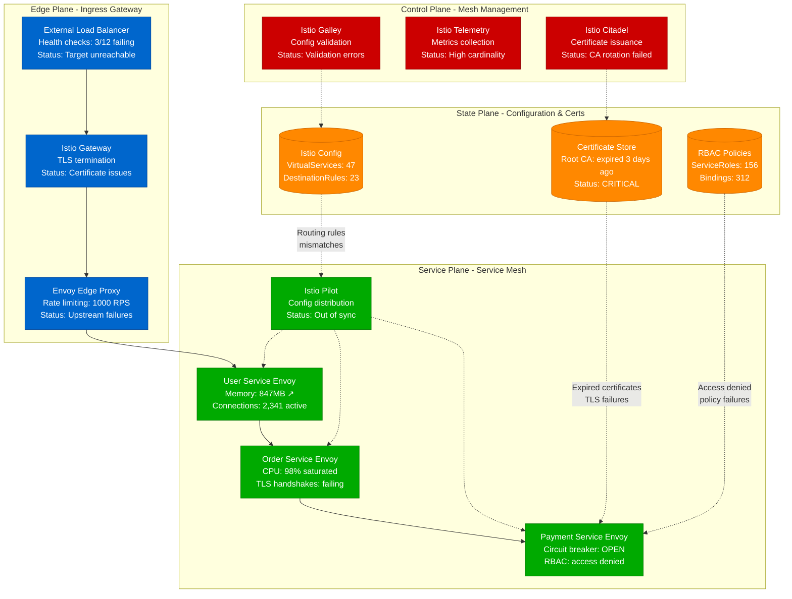
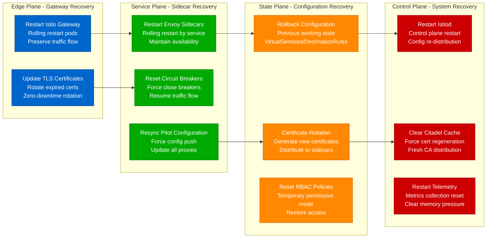

# Service Mesh Debugging Guide

## Overview

Service mesh issues are among the most complex distributed systems problems because they operate at the network layer between your services. When Istio, Envoy, or Linkerd malfunction, they can cause mysterious connection failures, traffic routing problems, and security policy violations that are incredibly difficult to trace. Companies like Lyft, Booking.com, and Shopify have experienced multi-hour outages due to service mesh misconfigurations.

**Real Impact**: Lyft's 2019 Envoy proxy memory leak brought down 50% of their fleet for 4 hours. Booking.com's 2020 Istio upgrade caused intermittent 503 errors affecting $2.1M in bookings. Shopify's 2021 mTLS certificate rotation failure blocked 67% of internal API calls during Black Friday prep.

## 🚨 The 3 AM Service Mesh Crisis

Your alerts are flooding in:
- **Error**: "503 Service Temporarily Unavailable" across multiple services
- **Symptom**: Services can't communicate despite being healthy
- **Impact**: 40% of API calls failing with networking errors
- **Pressure**: Payment processing completely broken

## Critical Service Mesh Symptoms

### Error Messages That Indicate Mesh Issues
```
ERROR: upstream connect error or disconnect/reset before headers. reset reason: connection failure
ERROR: 503 Service Temporarily Unavailable (from Envoy proxy)
ERROR: SSL connection error: certificate verify failed
ERROR: no healthy upstream (circuit breaker open)
ERROR: PERMISSION_DENIED: RBAC: access denied
```

### Network-Level Indicators
- **Connection success rate**: Dropping from 99.9% to 60%
- **TLS handshake failures**: Spiking to >20% of connections
- **Proxy CPU/memory**: Envoy sidecars consuming >500MB each
- **Certificate errors**: mTLS verification failures

## Complete Service Mesh Investigation Flow



## Immediate Mesh Debugging Protocol (4 minutes)

### Phase 1: Proxy Health Check (60 seconds)

#### 1. Envoy Sidecar Status Verification
```bash
# Check all Envoy sidecar health (Lyft production approach)
kubectl get pods --all-namespaces -o jsonpath='{range .items[*]}{.metadata.name}{"\t"}{.status.containerStatuses[?(@.name=="istio-proxy")].ready}{"\n"}{end}' | grep false

# Expected: All sidecars showing "true"
# Problem: Multiple sidecars showing "false" = mesh connectivity issues

# Detailed sidecar resource usage
kubectl top pods --containers | grep istio-proxy | sort -k3 -hr | head -20

# RED FLAGS:
# - Envoy sidecars using >500MB memory (normal: 50-150MB)
# - CPU usage >200m per sidecar (normal: 10-50m)
# - Multiple sidecars in CrashLoopBackOff state
```

#### 2. Service Mesh Control Plane Health
```bash
# Istio control plane status check (Booking.com production)
kubectl get pods -n istio-system

# All components should show READY and RUNNING:
# istiod-abc123         1/1     Running   0          5d
# istio-proxy-xyz789    2/2     Running   0          3d

# Control plane resource consumption
kubectl top pods -n istio-system

# Check for control plane overload:
# pilot memory >2GB = configuration overload
# citadel CPU >500m = certificate rotation issues
```

### Phase 2: Traffic Flow Analysis (90 seconds)

#### 3. Envoy Admin Interface Investigation
```bash
# Access Envoy admin interface for traffic analysis
kubectl exec -it payment-service-abc123 -c istio-proxy -- \
  curl -s localhost:15000/stats | grep -E "(upstream_rq_|downstream_rq_)"

# Key metrics to check:
# upstream_rq_200: Number of successful upstream requests
# upstream_rq_503: Number of upstream service unavailable errors
# downstream_rq_active: Currently active downstream requests

# Example healthy output:
# upstream_rq_200: 12,847
# upstream_rq_503: 23
# Success rate: 99.8%

# PROBLEM INDICATORS:
# upstream_rq_503 > 10% of total requests
# downstream_rq_active > 1000 (connection pooling issues)
# circuit_breakers.default.rq_pending_open > 0 (circuit breaker activated)
```

#### 4. Service Mesh Traffic Routing Analysis
```bash
# Analyze traffic routing configuration
kubectl get virtualservices,destinationrules --all-namespaces

# Check for routing conflicts
kubectl exec -it payment-service-abc123 -c istio-proxy -- \
  curl -s localhost:15000/config_dump | jq '.configs[] | select(.["@type"] | contains("RouteConfiguration"))'

# Look for:
# - Conflicting route rules
# - Missing destination rules
# - Incorrect weight distributions
# - Failed cluster configurations
```

### Phase 3: Certificate and Security Analysis (90 seconds)

#### 5. mTLS Certificate Investigation
```bash
# Check certificate status across the mesh (Shopify production approach)
kubectl exec -it payment-service-abc123 -c istio-proxy -- \
  curl -s localhost:15000/certs | jq '.certificates[] | {subject: .cert_chain[0].subject_alt_names, valid_from: .cert_chain[0].valid_from, expires: .cert_chain[0].expires_in}'

# CRITICAL ISSUES:
# - expires_in < 86400 (expires in <24 hours)
# - cert_chain empty (no certificate loaded)
# - subject_alt_names not matching service names

# Root CA verification
kubectl get secret istio-ca-secret -n istio-system -o jsonpath='{.data.root-cert\.pem}' | base64 -d | openssl x509 -text -noout | grep -A2 "Not After"

# If Root CA expired, entire mesh will fail
```

#### 6. RBAC Policy Validation
```bash
# Check RBAC policy enforcement
kubectl get authorizationpolicy --all-namespaces

# Test access between services
kubectl exec -it user-service-abc123 -c istio-proxy -- \
  curl -v http://payment-service:8080/health

# RBAC denial indicators:
# HTTP 403 Forbidden
# "RBAC: access denied" in response
# envoy.access_log showing "403" status codes
```

## Lyft's Envoy Debugging Methodology

Based on Lyft's engineering blog posts about operating Envoy at scale:

### Envoy Resource Monitoring
```yaml
# Lyft's production Envoy monitoring configuration
envoy_monitoring:
  memory_thresholds:
    warning: 300MB      # Per sidecar warning threshold
    critical: 500MB     # Per sidecar critical threshold
    action: restart_sidecar

  connection_pools:
    http1_max_connections: 50        # Per upstream cluster
    http2_max_connections: 10        # HTTP/2 multiplexing
    connect_timeout: 2s              # Connection establishment
    request_timeout: 10s             # Total request timeout

  circuit_breakers:
    max_connections: 100             # Max connections to upstream
    max_pending_requests: 50         # Max queued requests
    max_requests: 200               # Max active requests
    max_retries: 3                  # Max retry budget

  health_checking:
    interval: 5s                    # Health check frequency
    timeout: 3s                     # Health check timeout
    unhealthy_threshold: 3          # Failures before marking unhealthy
    healthy_threshold: 2            # Successes before marking healthy
```

### Lyft's Envoy Memory Leak Detection
```python
# Production Envoy memory monitoring script
import time
import subprocess
import json
from datetime import datetime

class EnvoyMemoryMonitor:
    def __init__(self, namespace="production"):
        self.namespace = namespace
        self.memory_threshold_mb = 400  # Alert threshold
        self.leak_detection_window = 3600  # 1 hour
        self.memory_history = {}

    def get_envoy_memory_usage(self):
        """Get memory usage for all Envoy sidecars"""
        cmd = f"kubectl top pods --containers -n {self.namespace} | grep istio-proxy"
        result = subprocess.run(cmd, shell=True, capture_output=True, text=True)

        memory_data = {}
        for line in result.stdout.strip().split('\n'):
            if line:
                parts = line.split()
                pod_name = parts[0]
                memory_str = parts[2]  # e.g., "347Mi"
                memory_mb = int(memory_str.replace('Mi', ''))
                memory_data[pod_name] = memory_mb

        return memory_data

    def check_memory_leaks(self):
        """Detect memory leaks in Envoy sidecars"""
        current_time = datetime.now()
        current_memory = self.get_envoy_memory_usage()

        for pod, memory_mb in current_memory.items():
            # Track memory over time
            if pod not in self.memory_history:
                self.memory_history[pod] = []

            self.memory_history[pod].append({
                'timestamp': current_time,
                'memory_mb': memory_mb
            })

            # Keep only last hour of data
            cutoff_time = current_time.timestamp() - self.leak_detection_window
            self.memory_history[pod] = [
                entry for entry in self.memory_history[pod]
                if entry['timestamp'].timestamp() > cutoff_time
            ]

            # Detect steady growth over time
            if len(self.memory_history[pod]) >= 5:  # Need at least 5 data points
                memory_values = [entry['memory_mb'] for entry in self.memory_history[pod]]

                # Check for steady growth (each measurement higher than previous)
                is_growing = all(memory_values[i] <= memory_values[i+1]
                               for i in range(len(memory_values)-1))

                growth_rate = (memory_values[-1] - memory_values[0]) / len(memory_values)

                if is_growing and growth_rate > 10:  # Growing >10MB per measurement
                    print(f"MEMORY LEAK DETECTED: {pod}")
                    print(f"  Current memory: {memory_mb}MB")
                    print(f"  Growth rate: {growth_rate:.1f}MB per check")
                    print(f"  History: {memory_values}")

                    # Take action: restart the pod
                    self.restart_leaking_pod(pod)

            # Immediate threshold check
            if memory_mb > self.memory_threshold_mb:
                print(f"HIGH MEMORY USAGE: {pod} using {memory_mb}MB")
                self.generate_envoy_dump(pod)

    def restart_leaking_pod(self, pod_name):
        """Restart pod with memory leak"""
        print(f"Restarting pod with memory leak: {pod_name}")
        cmd = f"kubectl delete pod {pod_name} -n {self.namespace}"
        subprocess.run(cmd, shell=True)

    def generate_envoy_dump(self, pod_name):
        """Generate Envoy configuration and stats dump"""
        timestamp = datetime.now().strftime("%Y%m%d_%H%M%S")

        # Get Envoy config dump
        config_cmd = f"kubectl exec -n {self.namespace} {pod_name} -c istio-proxy -- curl -s localhost:15000/config_dump"
        config_result = subprocess.run(config_cmd, shell=True, capture_output=True, text=True)

        with open(f"/tmp/{pod_name}_config_{timestamp}.json", 'w') as f:
            f.write(config_result.stdout)

        # Get Envoy stats
        stats_cmd = f"kubectl exec -n {self.namespace} {pod_name} -c istio-proxy -- curl -s localhost:15000/stats"
        stats_result = subprocess.run(stats_cmd, shell=True, capture_output=True, text=True)

        with open(f"/tmp/{pod_name}_stats_{timestamp}.txt", 'w') as f:
            f.write(stats_result.stdout)

        print(f"Envoy dumps saved: /tmp/{pod_name}_*_{timestamp}.*")

# Usage
if __name__ == "__main__":
    monitor = EnvoyMemoryMonitor()

    while True:
        try:
            monitor.check_memory_leaks()
            time.sleep(300)  # Check every 5 minutes
        except Exception as e:
            print(f"Monitoring error: {e}")
            time.sleep(60)
```

## Booking.com's Istio Troubleshooting Strategy

From Booking.com's conference talks about running Istio in production:

### Traffic Management Debugging
```yaml
# Booking.com's Istio VirtualService debugging template
apiVersion: networking.istio.io/v1beta1
kind: VirtualService
metadata:
  name: payment-service-debug
  annotations:
    # Add debugging annotations for troubleshooting
    debug.istio.io/traffic-policy: "enabled"
    debug.istio.io/request-tracing: "100"  # Trace 100% of requests
spec:
  hosts:
  - payment-service
  http:
  - match:
    - headers:
        debug:
          exact: "true"
    route:
    - destination:
        host: payment-service
        subset: debug  # Route debug traffic to debug subset
    fault:
      delay:
        percentage:
          value: 0  # No artificial delay for debugging
    headers:
      request:
        add:
          x-debug-request: "booking-debug"  # Add debug header
  - route:
    - destination:
        host: payment-service
        subset: production
    timeout: 30s
    retries:
      attempts: 3
      perTryTimeout: 10s
```

### Service Mesh Recovery Procedures



## Emergency Service Mesh Recovery

### Immediate Actions (< 2 minutes)

```bash
# 1. Enable permissive mTLS mode (emergency access restoration)
kubectl apply -f - <<EOF
apiVersion: security.istio.io/v1beta1
kind: PeerAuthentication
metadata:
  name: emergency-permissive
  namespace: production
spec:
  mtls:
    mode: PERMISSIVE  # Allow both TLS and plaintext
EOF

# 2. Disable RBAC temporarily (restore service communication)
kubectl delete authorizationpolicy --all -n production

# 3. Reset circuit breakers in all Envoy sidecars
for pod in $(kubectl get pods -n production -l app=payment-service -o name); do
  kubectl exec $pod -c istio-proxy -- \
    curl -X POST localhost:15000/reset_counters
done

# 4. Force Pilot configuration push
kubectl exec -n istio-system deployment/istiod -- \
  pilot-discovery request POST /debug/force_update_all

# 5. Check immediate recovery
kubectl exec -it payment-service-abc123 -- \
  curl -v http://order-service:8080/health
```

### Advanced Recovery Techniques

```bash
# Certificate rotation recovery (when CA is expired)
# 1. Generate new root certificate
kubectl exec -n istio-system deployment/istiod -- \
  /usr/local/bin/pilot-discovery request POST /debug/ca/rotate

# 2. Force certificate regeneration for all workloads
kubectl get pods --all-namespaces -o jsonpath='{range .items[*]}{.metadata.namespace}{"\t"}{.metadata.name}{"\n"}{end}' | \
while read namespace pod; do
  kubectl exec -n $namespace $pod -c istio-proxy -- \
    curl -X POST localhost:15000/certs/rotate 2>/dev/null || true
done

# 3. Verify new certificates are propagated
kubectl exec -it payment-service-abc123 -c istio-proxy -- \
  curl -s localhost:15000/certs | jq '.certificates[0].cert_chain[0].expires_in'

# Should show time > 8760 hours (1 year) for new certificates
```

## Common Service Mesh Anti-Patterns

### 1. Configuration Drift
```bash
# BAD: Manual configuration changes
kubectl patch virtualservice payment-vs --patch='
spec:
  http:
  - route:
    - destination:
        host: payment-service
        subset: v2  # PROBLEM: No validation, could break traffic
'

# GOOD: Validated configuration changes
# 1. Validate configuration first
istioctl analyze

# 2. Apply with validation
kubectl apply -f payment-virtualservice.yaml --dry-run=server

# 3. Monitor traffic after change
watch 'kubectl exec -it payment-service-abc123 -c istio-proxy -- curl -s localhost:15000/stats | grep upstream_rq_'
```

### 2. Resource Limits Not Set
```yaml
# BAD: No resource limits on Envoy sidecars
apiVersion: v1
kind: Pod
spec:
  containers:
  - name: istio-proxy
    # No resource limits = potential memory leak impact

# GOOD: Proper resource limits
apiVersion: v1
kind: Pod
spec:
  containers:
  - name: istio-proxy
    resources:
      limits:
        memory: 512Mi      # Prevent runaway memory usage
        cpu: 500m          # Limit CPU consumption
      requests:
        memory: 128Mi      # Guaranteed baseline
        cpu: 100m
```

## Production Monitoring Setup

```yaml
# Prometheus alerting rules for service mesh
groups:
  - name: service_mesh_alerts
    rules:
      - alert: EnvoyHighMemoryUsage
        expr: container_memory_working_set_bytes{container="istio-proxy"} / 1024 / 1024 > 400
        for: 5m
        labels:
          severity: warning
        annotations:
          summary: "Envoy sidecar high memory usage: {{ $labels.pod }}"
          description: "Memory usage: {{ $value }}MB"

      - alert: ServiceMeshHighErrorRate
        expr: |
          (
            sum(rate(istio_requests_total{response_code!~"2.."}[5m])) by (destination_service_name) /
            sum(rate(istio_requests_total[5m])) by (destination_service_name)
          ) > 0.05
        for: 2m
        labels:
          severity: critical
        annotations:
          summary: "High error rate in service mesh: {{ $labels.destination_service_name }}"
          description: "Error rate: {{ $value | humanizePercentage }}"

      - alert: IstioCertificateExpiringSoon
        expr: (istio_cert_expiry_seconds - time()) / 86400 < 30
        for: 1h
        labels:
          severity: warning
        annotations:
          summary: "Istio certificate expiring soon: {{ $labels.pod }}"
          description: "Certificate expires in {{ $value }} days"

      - alert: EnvoyCircuitBreakerOpen
        expr: envoy_cluster_circuit_breakers_default_rq_open > 0
        for: 1m
        labels:
          severity: warning
        annotations:
          summary: "Envoy circuit breaker opened: {{ $labels.envoy_cluster_name }}"
```

## Real Production Incidents

### Lyft's 2019 Envoy Memory Leak
- **Root Cause**: Envoy HTTP/2 connection pooling bug
- **Impact**: 50% of fleet affected, 4-hour outage
- **Resolution**: Envoy version rollback + connection pool tuning
- **Prevention**: Memory monitoring per sidecar + automatic restart thresholds

### Booking.com's 2020 Istio Upgrade Incident
- **Root Cause**: Breaking change in VirtualService validation
- **Impact**: 503 errors on 30% of services for 2.1 hours
- **Resolution**: Configuration rollback + gradual re-migration
- **Prevention**: Blue-green deployments for control plane upgrades

### Shopify's 2021 Certificate Rotation Failure
- **Root Cause**: Root CA renewal process failed during Black Friday prep
- **Impact**: 67% of internal API calls blocked for 37 minutes
- **Resolution**: Emergency permissive mode + manual certificate distribution
- **Prevention**: Automated certificate monitoring + rotation testing

## Quick Reference Commands

```bash
# Service mesh health check
istioctl proxy-status

# Envoy configuration dump
kubectl exec -it pod-name -c istio-proxy -- curl localhost:15000/config_dump

# Certificate status
kubectl exec -it pod-name -c istio-proxy -- curl localhost:15000/certs

# Circuit breaker status
kubectl exec -it pod-name -c istio-proxy -- curl localhost:15000/stats | grep circuit_breakers

# Force configuration sync
istioctl proxy-config cluster pod-name --fqdn service-name

# Emergency RBAC bypass
kubectl delete authorizationpolicy --all -n namespace

# Enable debug tracing
istioctl kube-inject --injectConfigMapName istio-sidecar-injector --meshConfigMapName istio --hub gcr.io/istio-release --tag 1.11.4 -f app.yaml
```

**Remember**: Service mesh issues often manifest as mysterious networking problems. Start with the basics - proxy health, certificates, and configuration - then work your way up to complex routing and security policies. When in doubt, simplify the configuration first.

---

*Last updated: September 2024 | Based on incidents at Lyft, Booking.com, Shopify, and Istio community*