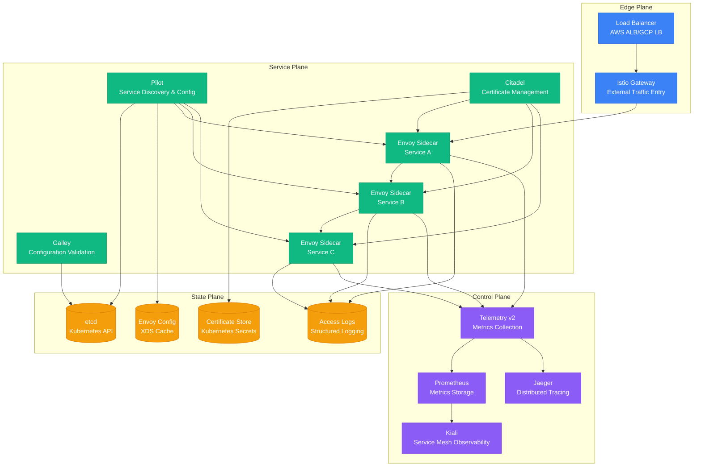
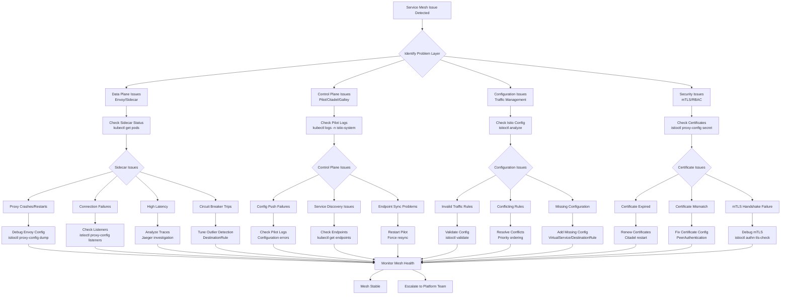

# Service Mesh Issues - Istio/Envoy Debugging Guide

## Overview

This guide provides comprehensive debugging strategies for service mesh issues in production, focusing on Istio and Envoy proxy problems. Based on real incidents from Lyft's Envoy deployments, Google's Istio adoption, and Airbnb's service mesh migration.

## Architecture Context



## Service Mesh Debugging Flowchart



## Envoy/Data Plane Debugging

### Envoy Configuration Analysis

#### Basic Envoy Status Check
```bash
# Check sidecar injection status
kubectl get pods -o jsonpath='{.items[*].spec.containers[*].name}' | grep istio-proxy

# Check Envoy proxy status
istioctl proxy-status

# Get detailed proxy configuration
istioctl proxy-config dump <pod-name>.<namespace>

# Check specific configuration sections
istioctl proxy-config listeners <pod-name>.<namespace>
istioctl proxy-config routes <pod-name>.<namespace>
istioctl proxy-config clusters <pod-name>.<namespace>
istioctl proxy-config endpoints <pod-name>.<namespace>
```

#### Envoy Access Log Analysis
```bash
# Enable access logs for debugging
kubectl patch configmap istio -n istio-system --type merge -p '{
  "data": {
    "mesh": "accessLogFile: /dev/stdout\ndefaultConfig:\n  discoveryRefreshDelay: 10s\n  proxyStatsMatcher:\n    inclusionRegexps:\n    - \".*outlier_detection.*\"\n    - \".*circuit_breakers.*\"\n    - \".*upstream_rq_retry.*\"\n    - \".*upstream_rq_pending.*\"\n    - \".*_cx_.*\""
  }
}'

# Restart pods to pick up new configuration
kubectl rollout restart deployment/<deployment-name>

# Analyze access logs for errors
kubectl logs <pod-name> -c istio-proxy | grep -E "(5[0-9]{2}|4[0-9]{2})"

# Parse access log for specific patterns
kubectl logs <pod-name> -c istio-proxy | \
  awk '{print $7, $9, $10, $11}' | \
  sort | uniq -c | sort -nr
```

### Circuit Breaker and Load Balancing Issues

#### Outlier Detection Analysis
```yaml
# Debug outlier detection configuration
apiVersion: networking.istio.io/v1beta1
kind: DestinationRule
metadata:
  name: debug-outlier-detection
spec:
  host: problematic-service
  trafficPolicy:
    outlierDetection:
      consecutive5xxErrors: 3      # Reduced for testing
      interval: 10s               # Check every 10 seconds
      baseEjectionTime: 30s       # Eject for 30 seconds minimum
      maxEjectionPercent: 50      # Max 50% of instances ejected
      minHealthPercent: 30        # Keep at least 30% healthy
```

#### Circuit Breaker Configuration
```yaml
# Debug circuit breaker settings
apiVersion: networking.istio.io/v1beta1
kind: DestinationRule
metadata:
  name: debug-circuit-breaker
spec:
  host: backend-service
  trafficPolicy:
    connectionPool:
      tcp:
        maxConnections: 100       # Increased for debugging
        connectTimeout: 30s       # Longer timeout
        tcpKeepalive:
          time: 7200s
          interval: 75s
      http:
        http1MaxPendingRequests: 64    # Increased queue size
        http2MaxRequests: 1000         # More concurrent requests
        maxRequestsPerConnection: 10   # Reduced for debugging
        maxRetries: 5                  # Increased retries
        consecutiveGatewayErrors: 5    # Higher threshold
        interval: 30s
```

### Connection Pool Debugging

#### Check Connection Pool Stats
```bash
# Get connection pool statistics
istioctl proxy-config clusters <pod-name>.<namespace> --fqdn <service-fqdn> -o json | \
  jq '.[] | select(.name | contains("<service-name>")) | .circuit_breakers'

# Monitor connection pool metrics via Envoy admin
kubectl port-forward <pod-name> 15000:15000
curl localhost:15000/stats | grep -E "(circuit_breakers|outlier_detection|upstream_rq)"

# Example output analysis:
# cluster.outbound|80||service.namespace.svc.cluster.local.circuit_breakers.default.cx_open: 0
# cluster.outbound|80||service.namespace.svc.cluster.local.circuit_breakers.default.rq_open: 0
# cluster.outbound|80||service.namespace.svc.cluster.local.outlier_detection.ejections_active: 2
```

#### Advanced Envoy Debug Commands
```bash
# Get Envoy admin interface access
kubectl port-forward <pod-name> 15000:15000 &

# Check cluster configuration
curl -s localhost:15000/config_dump | jq '.configs[2].dynamic_active_clusters'

# Check listener configuration
curl -s localhost:15000/config_dump | jq '.configs[1].dynamic_active_listeners'

# Get runtime configuration
curl -s localhost:15000/runtime

# Check server info
curl -s localhost:15000/server_info

# Get cluster stats
curl -s localhost:15000/clusters

# Memory usage
curl -s localhost:15000/memory

# Hot restart statistics
curl -s localhost:15000/hot_restart_version
```

## Control Plane Debugging

### Pilot (Istiod) Issues

#### Pilot Configuration Push Debugging
```bash
# Check Pilot logs for configuration errors
kubectl logs -n istio-system deployment/istiod | grep -E "(error|Error|ERROR)"

# Check configuration distribution
istioctl proxy-status

# Validate Istio configuration
istioctl analyze

# Check specific service configuration
istioctl proxy-config listeners <pod-name>.<namespace> --port 80 -o json

# Debug configuration push timing
kubectl logs -n istio-system deployment/istiod | grep "Push debounce stable"
```

#### Service Discovery Issues
```bash
# Check service registry
istioctl proxy-config endpoints <pod-name>.<namespace>

# Check Kubernetes endpoints
kubectl get endpoints -A

# Verify service discovery
kubectl logs -n istio-system deployment/istiod | grep "Service registry"

# Check endpoint sync status
istioctl proxy-status | grep -E "(SYNCED|NOT SENT|STALE)"
```

### Certificate Management Issues

#### mTLS Certificate Debugging
```bash
# Check certificate status
istioctl proxy-config secret <pod-name>.<namespace>

# Verify mTLS configuration
istioctl authn tls-check <pod-name>.<namespace> <service-name>.<namespace>.svc.cluster.local

# Check certificate expiry
istioctl proxy-config secret <pod-name>.<namespace> -o json | \
  jq '.dynamicActiveSecrets[] | select(.name | contains("default")) | .secret.tlsCertificate.certificateChain.inlineBytes' | \
  base64 -d | openssl x509 -text -noout | grep -A 2 "Validity"

# Debug certificate root cause
kubectl logs -n istio-system deployment/istiod | grep -E "(certificate|cert|tls)"
```

#### PeerAuthentication Debugging
```yaml
# Debug mTLS policy application
apiVersion: security.istio.io/v1beta1
kind: PeerAuthentication
metadata:
  name: debug-mtls
  namespace: production
spec:
  selector:
    matchLabels:
      app: problematic-service
  mtls:
    mode: STRICT   # or PERMISSIVE for gradual migration

---
# Check for conflicting policies
kubectl get peerauthentication -A
kubectl describe peerauthentication <policy-name> -n <namespace>
```

## Traffic Management Debugging

### VirtualService Issues

#### Traffic Routing Debugging
```yaml
# Debug traffic routing with weighted distribution
apiVersion: networking.istio.io/v1beta1
kind: VirtualService
metadata:
  name: debug-routing
spec:
  hosts:
  - reviews
  http:
  - match:
    - headers:
        debug:
          exact: "true"
    route:
    - destination:
        host: reviews
        subset: v2
  - route:
    - destination:
        host: reviews
        subset: v1
      weight: 90
    - destination:
        host: reviews
        subset: v2
      weight: 10
    fault:
      delay:
        percentage:
          value: 0.1
        fixedDelay: 5s
```

#### Route Matching Analysis
```bash
# Check route configuration
istioctl proxy-config routes <pod-name>.<namespace> --name <route-name> -o json

# Verify route matching logic
istioctl proxy-config routes <pod-name>.<namespace> | grep -A 10 -B 5 <service-name>

# Test route with specific headers
curl -H "debug: true" http://<service-url>/test

# Check route priority and conflicts
kubectl get virtualservice -A -o yaml | grep -A 20 -B 5 "match:"
```

### DestinationRule Issues

#### Load Balancing and Health Check Debugging
```yaml
# Debug destination rule configuration
apiVersion: networking.istio.io/v1beta1
kind: DestinationRule
metadata:
  name: debug-destination
spec:
  host: api-service
  trafficPolicy:
    loadBalancer:
      simple: LEAST_CONN   # Changed from ROUND_ROBIN for debugging
    connectionPool:
      tcp:
        maxConnections: 50
        connectTimeout: 10s
      http:
        http1MaxPendingRequests: 32
        maxRequestsPerConnection: 2
    healthCheck:
      path: /health
      interval: 10s
      timeout: 3s
      unhealthyThreshold: 3
      healthyThreshold: 2
  subsets:
  - name: v1
    labels:
      version: v1
  - name: v2
    labels:
      version: v2
    trafficPolicy:
      outlierDetection:
        consecutive5xxErrors: 2
        interval: 30s
        baseEjectionTime: 30s
```

## Production Examples

### Lyft: Envoy Memory Leak Investigation

#### Problem: Envoy Sidecar Memory Growth
```bash
# Monitoring script for Envoy memory usage
#!/bin/bash
NAMESPACE="production"
SERVICE="ride-matching"

while true; do
    # Get all pods for the service
    PODS=$(kubectl get pods -n $NAMESPACE -l app=$SERVICE -o jsonpath='{.items[*].metadata.name}')

    for POD in $PODS; do
        # Get memory usage for istio-proxy container
        MEMORY=$(kubectl top pod $POD -n $NAMESPACE --containers | grep istio-proxy | awk '{print $3}')

        # Get connection count
        kubectl port-forward $POD 15000:15000 >/dev/null 2>&1 &
        PF_PID=$!
        sleep 2

        CONNECTIONS=$(curl -s localhost:15000/stats 2>/dev/null | grep "downstream_cx_active" | cut -d':' -f2 | tr -d ' ')
        UPSTREAM_CONNECTIONS=$(curl -s localhost:15000/stats 2>/dev/null | grep "upstream_cx_active" | cut -d':' -f2 | tr -d ' ')

        kill $PF_PID 2>/dev/null

        echo "$(date): Pod $POD - Memory: $MEMORY, Downstream: $CONNECTIONS, Upstream: $UPSTREAM_CONNECTIONS"

        # Alert if memory usage is high
        MEMORY_NUM=$(echo $MEMORY | sed 's/Mi//')
        if [ "$MEMORY_NUM" -gt 500 ]; then
            echo "ALERT: High memory usage in $POD: ${MEMORY}"

            # Dump Envoy configuration for analysis
            kubectl exec $POD -c istio-proxy -- curl -s localhost:15000/config_dump > /tmp/${POD}_config_dump.json

            # Get detailed stats
            kubectl exec $POD -c istio-proxy -- curl -s localhost:15000/stats > /tmp/${POD}_stats.txt
        fi
    done

    sleep 60
done
```

#### Solution: Connection Pool Tuning
```yaml
# Fixed configuration to prevent connection buildup
apiVersion: networking.istio.io/v1beta1
kind: DestinationRule
metadata:
  name: ride-matching-connection-pool
  namespace: production
spec:
  host: ride-matching
  trafficPolicy:
    connectionPool:
      tcp:
        maxConnections: 50          # Limited connection pool
        connectTimeout: 5s
        tcpKeepalive:
          time: 300s               # Shorter keepalive
          interval: 60s
          probes: 3
      http:
        http1MaxPendingRequests: 10  # Reduced pending queue
        http2MaxRequests: 100
        maxRequestsPerConnection: 100 # Rotate connections
        h2UpgradePolicy: UPGRADE    # Use HTTP/2 when possible
        idleTimeout: 60s            # Close idle connections
```

### Google: Istio Configuration Conflicts

#### Problem: Conflicting VirtualService Rules
```yaml
# Problematic configuration - conflicting routes
apiVersion: networking.istio.io/v1beta1
kind: VirtualService
metadata:
  name: payments-canary
  namespace: payments
spec:
  hosts:
  - payments
  http:
  - match:
    - headers:
        canary:
          exact: "true"
    route:
    - destination:
        host: payments
        subset: v2

---
apiVersion: networking.istio.io/v1beta1
kind: VirtualService
metadata:
  name: payments-main     # CONFLICT: Same host, no priority
  namespace: payments
spec:
  hosts:
  - payments
  http:
  - route:
    - destination:
        host: payments
        subset: v1
```

#### Solution: Consolidated Configuration
```yaml
# Fixed configuration - single VirtualService with proper ordering
apiVersion: networking.istio.io/v1beta1
kind: VirtualService
metadata:
  name: payments-routing
  namespace: payments
spec:
  hosts:
  - payments
  http:
  # Canary rule first (most specific)
  - match:
    - headers:
        canary:
          exact: "true"
    route:
    - destination:
        host: payments
        subset: v2
    fault:
      delay:
        percentage:
          value: 0.1
        fixedDelay: 100ms
  # Employee testing
  - match:
    - headers:
        user-type:
          exact: "employee"
    route:
    - destination:
        host: payments
        subset: v1
      weight: 50
    - destination:
        host: payments
        subset: v2
      weight: 50
  # Default traffic
  - route:
    - destination:
        host: payments
        subset: v1
      weight: 95
    - destination:
        host: payments
        subset: v2
      weight: 5
```

### Airbnb: mTLS Migration Issues

#### Problem: Gradual mTLS Rollout
```yaml
# Problematic approach - immediate STRICT mode
apiVersion: security.istio.io/v1beta1
kind: PeerAuthentication
metadata:
  name: booking-mtls
  namespace: booking
spec:
  mtls:
    mode: STRICT  # Broke legacy clients immediately
```

#### Solution: Gradual Migration Strategy
```yaml
# Phase 1: Enable PERMISSIVE mode
apiVersion: security.istio.io/v1beta1
kind: PeerAuthentication
metadata:
  name: booking-mtls-phase1
  namespace: booking
spec:
  mtls:
    mode: PERMISSIVE

---
# Phase 2: Apply STRICT to specific services
apiVersion: security.istio.io/v1beta1
kind: PeerAuthentication
metadata:
  name: booking-api-mtls
  namespace: booking
spec:
  selector:
    matchLabels:
      app: booking-api
      version: v2
  mtls:
    mode: STRICT

---
# Phase 3: Monitor and expand gradually
apiVersion: security.istio.io/v1beta1
kind: PeerAuthentication
metadata:
  name: booking-mtls-final
  namespace: booking
spec:
  mtls:
    mode: STRICT
  # Only applied after monitoring shows no legacy clients
```

## Monitoring & Alerting

### Envoy Metrics Collection
```yaml
# Prometheus scrape configuration for Envoy
apiVersion: v1
kind: ConfigMap
metadata:
  name: envoy-stats-config
  namespace: istio-system
data:
  custom_bootstrap.json: |
    {
      "stats_config": {
        "stats_tags": [
          {
            "tag_name": "cluster_name",
            "regex": "^cluster\\.((.+?)\\.).*"
          },
          {
            "tag_name": "virtual_host_name",
            "regex": "^vhost\\.((.+?)\\.)"
          }
        ],
        "stats_matches": [
          {
            "name": "circuit_breakers",
            "actions": [
              {
                "name": "circuit_breakers",
                "action": "REJECT",
                "match": {
                  "regex": ".*circuit_breakers.*"
                }
              }
            ]
          }
        ]
      }
    }
```

### Service Mesh Health Alerts
```yaml
groups:
- name: istio_alerts
  rules:
  - alert: EnvoyHighMemoryUsage
    expr: |
      (
        container_memory_usage_bytes{container="istio-proxy"} /
        container_spec_memory_limit_bytes{container="istio-proxy"}
      ) * 100 > 80
    for: 5m
    labels:
      severity: warning
    annotations:
      summary: "Envoy sidecar high memory usage"
      description: "Envoy memory usage is {{ $value }}% of limit"

  - alert: ServiceMeshConfigurationError
    expr: increase(pilot_total_xds_rejects[5m]) > 0
    for: 1m
    labels:
      severity: critical
    annotations:
      summary: "Istio configuration rejected"
      description: "Pilot rejected {{ $value }} configuration updates"

  - alert: HighServiceMeshLatency
    expr: |
      histogram_quantile(0.99,
        rate(istio_request_duration_milliseconds_bucket[5m])
      ) > 1000
    for: 2m
    labels:
      severity: warning
    annotations:
      summary: "High service mesh latency"
      description: "P99 latency is {{ $value }}ms"

  - alert: CircuitBreakerTripped
    expr: increase(envoy_cluster_circuit_breakers_rq_open[5m]) > 0
    for: 1m
    labels:
      severity: warning
    annotations:
      summary: "Circuit breaker activated"
      description: "Circuit breaker opened {{ $value }} times"
```

### Kiali Dashboard Setup
```yaml
apiVersion: v1
kind: ConfigMap
metadata:
  name: kiali
  namespace: istio-system
data:
  config.yaml: |
    istio_namespace: istio-system
    auth:
      strategy: anonymous
    deployment:
      accessible_namespaces:
      - "**"
    external_services:
      prometheus:
        url: "http://prometheus:9090"
      tracing:
        in_cluster_url: "http://jaeger-query:16686"
        url: "http://jaeger-query:16686"
      grafana:
        in_cluster_url: "http://grafana:3000"
        url: "http://grafana:3000"
```

## Debugging Scripts

### Comprehensive Mesh Health Check
```bash
#!/bin/bash
# comprehensive-mesh-check.sh

echo "=== Istio Service Mesh Health Check ==="

# Check control plane status
echo "1. Control Plane Status:"
kubectl get pods -n istio-system
kubectl get svc -n istio-system

# Check proxy status
echo -e "\n2. Proxy Status:"
istioctl proxy-status

# Analyze configuration
echo -e "\n3. Configuration Analysis:"
istioctl analyze

# Check certificates
echo -e "\n4. Certificate Status:"
istioctl proxy-config secret -n production

# Check for conflicting configurations
echo -e "\n5. Configuration Conflicts:"
kubectl get virtualservice -A --no-headers | awk '{print $2, $1}' | sort | uniq -d
kubectl get destinationrule -A --no-headers | awk '{print $2, $1}' | sort | uniq -d

# Check Envoy health across all sidecars
echo -e "\n6. Envoy Health Check:"
for ns in $(kubectl get ns -o jsonpath='{.items[*].metadata.name}'); do
    echo "Namespace: $ns"
    for pod in $(kubectl get pods -n $ns -o jsonpath='{.items[?(@.spec.containers[*].name=="istio-proxy")].metadata.name}'); do
        echo -n "  $pod: "
        kubectl exec $pod -n $ns -c istio-proxy -- curl -s localhost:15000/ready >/dev/null 2>&1 && echo "Ready" || echo "Not Ready"
    done
done

# Check for common issues
echo -e "\n7. Common Issues Check:"
echo "Checking for high connection counts..."
kubectl get pods -A -o jsonpath='{range .items[*]}{.metadata.namespace}{" "}{.metadata.name}{"\n"}{end}' | \
while read ns pod; do
    if kubectl get pod $pod -n $ns -o jsonpath='{.spec.containers[*].name}' | grep -q istio-proxy; then
        count=$(kubectl exec $pod -n $ns -c istio-proxy -- curl -s localhost:15000/stats 2>/dev/null | grep "downstream_cx_active" | cut -d':' -f2 | tr -d ' ')
        if [ "$count" -gt 100 ] 2>/dev/null; then
            echo "High connection count in $ns/$pod: $count"
        fi
    fi
done

echo -e "\n=== Health Check Complete ==="
```

## Success Metrics

- **Sidecar Injection Rate**: 100% for production namespaces
- **Configuration Push Success Rate**: > 99.9%
- **mTLS Success Rate**: > 99.5%
- **Envoy Memory Usage**: < 200MB per sidecar under normal load
- **Configuration Propagation Time**: < 30 seconds
- **Circuit Breaker False Positive Rate**: < 0.1%

## The 3 AM Test

**Scenario**: Your microservices are experiencing 503 errors and high latency. Half of your service-to-service calls are failing with "upstream connect error or disconnect/reset before headers."

**This guide provides**:
1. **Immediate triage**: Envoy proxy status and configuration checks
2. **Traffic flow analysis**: Route configuration and load balancing verification
3. **Certificate debugging**: mTLS handshake and certificate expiry checks
4. **Performance analysis**: Connection pool stats and circuit breaker tuning
5. **Control plane health**: Pilot logs and configuration push validation

**Expected outcome**: Service mesh traffic restored within 20 minutes, root cause identified within 1 hour, configuration optimized to prevent recurrence.