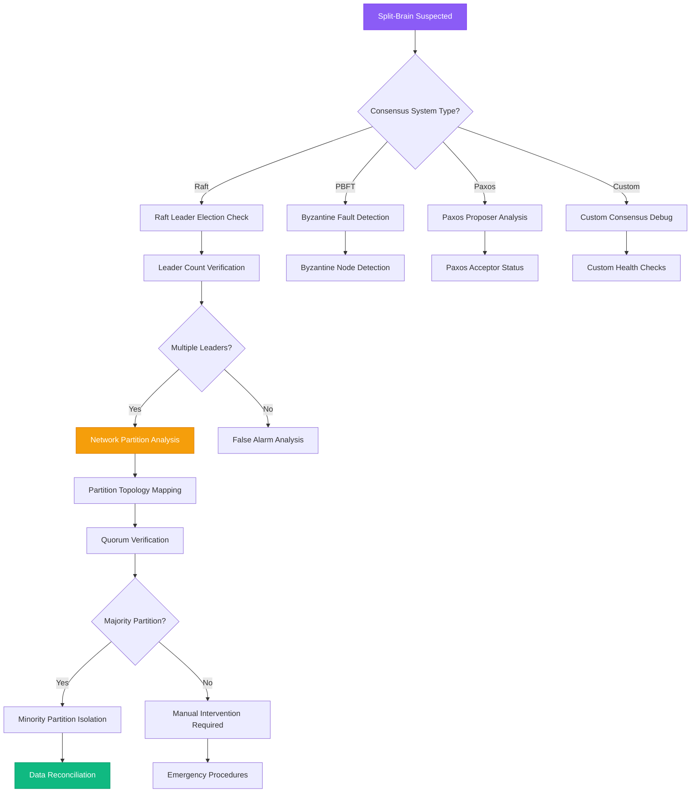

# Split-Brain Recovery Guide

## Overview

Split-brain scenarios occur when network partitions cause multiple nodes in a distributed system to believe they are the primary/leader, potentially leading to data corruption and inconsistent state. This guide provides systematic approaches used by database and distributed systems teams at Google, Amazon, and MongoDB to detect, prevent, and recover from split-brain conditions.

**Time to Resolution**: 15-45 minutes for detection and isolation, 2-8 hours for full data reconciliation

## Decision Tree



## Immediate Triage Commands (First 5 Minutes)

### 1. Leader/Primary Detection
```bash
# Raft-based systems (etcd example)
etcdctl member list
etcdctl endpoint status --cluster -w table

# MongoDB replica set status
mongo --eval "rs.status()" | grep -E "(name|stateStr|self)"

# Consul cluster status
consul operator raft list-peers
consul members

# Custom application leader detection
curl -s http://node1:8080/health | jq '.leader'
curl -s http://node2:8080/health | jq '.leader'
curl -s http://node3:8080/health | jq '.leader'
```

### 2. Network Partition Detection
```bash
# Check connectivity between nodes
nodes=("node1" "node2" "node3")
for source in "${nodes[@]}"; do
    echo "=== From $source ==="
    for target in "${nodes[@]}"; do
        if [ "$source" != "$target" ]; then
            timeout 5 ping -c 3 "$target" > /dev/null 2>&1 && echo "$target: OK" || echo "$target: FAIL"
        fi
    done
done

# Network interface status
ip route show
netstat -rn

# Firewall and iptables check
iptables -L -n | grep -E "(DROP|REJECT)"
systemctl status firewalld
```

### 3. Consensus State Verification
```bash
# Raft log comparison
for node in node1 node2 node3; do
    echo "=== $node Raft State ==="
    curl -s "http://$node:8080/debug/raft" | jq '{term: .currentTerm, leader: .leader, state: .state}'
done

# Quorum size verification
echo "Expected quorum size: $(($(echo "$nodes" | wc -w) / 2 + 1))"

# Data consistency check (application-specific)
for node in node1 node2 node3; do
    echo "=== $node Data Checksum ==="
    curl -s "http://$node:8080/api/checksum" | jq '.checksum'
done
```

## Raft Consensus Debugging

### 1. Raft State Analysis
```go
// Go implementation of Raft state monitoring
package raftmonitor

import (
    "context"
    "encoding/json"
    "fmt"
    "net/http"
    "sync"
    "time"
)

type RaftState struct {
    NodeID       string    `json:"nodeId"`
    State        string    `json:"state"`        // follower, candidate, leader
    Term         uint64    `json:"term"`
    Leader       string    `json:"leader"`
    LastLogIndex uint64    `json:"lastLogIndex"`
    LastLogTerm  uint64    `json:"lastLogTerm"`
    CommitIndex  uint64    `json:"commitIndex"`
    Timestamp    time.Time `json:"timestamp"`
}

type SplitBrainDetector struct {
    nodes      []string
    httpClient *http.Client
    mu         sync.RWMutex
    nodeStates map[string]RaftState
}

func NewSplitBrainDetector(nodes []string) *SplitBrainDetector {
    return &SplitBrainDetector{
        nodes:      nodes,
        httpClient: &http.Client{Timeout: 5 * time.Second},
        nodeStates: make(map[string]RaftState),
    }
}

func (sbd *SplitBrainDetector) CollectNodeStates(ctx context.Context) error {
    var wg sync.WaitGroup
    statesCh := make(chan RaftState, len(sbd.nodes))
    errorsCh := make(chan error, len(sbd.nodes))

    for _, node := range sbd.nodes {
        wg.Add(1)
        go func(nodeAddr string) {
            defer wg.Done()

            state, err := sbd.getNodeState(ctx, nodeAddr)
            if err != nil {
                errorsCh <- fmt.Errorf("failed to get state from %s: %w", nodeAddr, err)
                return
            }
            statesCh <- state
        }(node)
    }

    wg.Wait()
    close(statesCh)
    close(errorsCh)

    sbd.mu.Lock()
    defer sbd.mu.Unlock()

    // Update node states
    for state := range statesCh {
        sbd.nodeStates[state.NodeID] = state
    }

    // Log any errors
    for err := range errorsCh {
        fmt.Printf("Error: %v\n", err)
    }

    return nil
}

func (sbd *SplitBrainDetector) getNodeState(ctx context.Context, nodeAddr string) (RaftState, error) {
    url := fmt.Sprintf("http://%s/raft/state", nodeAddr)
    req, err := http.NewRequestWithContext(ctx, "GET", url, nil)
    if err != nil {
        return RaftState{}, err
    }

    resp, err := sbd.httpClient.Do(req)
    if err != nil {
        return RaftState{}, err
    }
    defer resp.Body.Close()

    if resp.StatusCode != http.StatusOK {
        return RaftState{}, fmt.Errorf("HTTP %d", resp.StatusCode)
    }

    var state RaftState
    if err := json.NewDecoder(resp.Body).Decode(&state); err != nil {
        return RaftState{}, err
    }

    state.Timestamp = time.Now()
    return state, nil
}

func (sbd *SplitBrainDetector) DetectSplitBrain() (*SplitBrainAnalysis, error) {
    sbd.mu.RLock()
    defer sbd.mu.RUnlock()

    if len(sbd.nodeStates) < 2 {
        return nil, fmt.Errorf("insufficient node states collected")
    }

    analysis := &SplitBrainAnalysis{
        Timestamp: time.Now(),
        NodeCount: len(sbd.nodeStates),
        Leaders:   make([]string, 0),
        Terms:     make(map[uint64][]string),
        Partitions: make([]Partition, 0),
    }

    // Identify leaders and terms
    for nodeID, state := range sbd.nodeStates {
        if state.State == "leader" {
            analysis.Leaders = append(analysis.Leaders, nodeID)
        }

        if analysis.Terms[state.Term] == nil {
            analysis.Terms[state.Term] = make([]string, 0)
        }
        analysis.Terms[state.Term] = append(analysis.Terms[state.Term], nodeID)
    }

    // Detect split-brain conditions
    analysis.HasSplitBrain = len(analysis.Leaders) > 1

    if analysis.HasSplitBrain {
        analysis.SplitBrainType = sbd.classifySplitBrainType(analysis)
        analysis.Partitions = sbd.identifyPartitions()
        analysis.RecoveryStrategy = sbd.recommendRecoveryStrategy(analysis)
    }

    return analysis, nil
}

func (sbd *SplitBrainDetector) classifySplitBrainType(analysis *SplitBrainAnalysis) string {
    // Multiple leaders with same term - network partition
    if len(analysis.Terms) == 1 {
        return "network_partition"
    }

    // Multiple leaders with different terms - timing issue
    if len(analysis.Terms) > 1 {
        return "election_race_condition"
    }

    return "unknown"
}

func (sbd *SplitBrainDetector) identifyPartitions() []Partition {
    // Implementation would analyze network connectivity between nodes
    // For now, return simple partition based on reachability
    partitions := make([]Partition, 0)

    // This is a simplified example - real implementation would test connectivity
    reachableNodes := make(map[string][]string)

    for nodeID := range sbd.nodeStates {
        reachableNodes[nodeID] = []string{nodeID} // Each node can reach itself

        // Test connectivity to other nodes
        for otherNodeID := range sbd.nodeStates {
            if nodeID != otherNodeID {
                if sbd.testConnectivity(nodeID, otherNodeID) {
                    reachableNodes[nodeID] = append(reachableNodes[nodeID], otherNodeID)
                }
            }
        }
    }

    // Group nodes into partitions based on mutual reachability
    visited := make(map[string]bool)
    for nodeID, reachable := range reachableNodes {
        if visited[nodeID] {
            continue
        }

        partition := Partition{
            Nodes:   reachable,
            Size:    len(reachable),
            HasLeader: false,
        }

        // Check if partition has a leader
        for _, node := range reachable {
            if state, exists := sbd.nodeStates[node]; exists && state.State == "leader" {
                partition.HasLeader = true
                partition.Leader = node
                break
            }
        }

        partition.IsMajority = partition.Size > len(sbd.nodeStates)/2

        partitions = append(partitions, partition)

        // Mark all nodes in this partition as visited
        for _, node := range reachable {
            visited[node] = true
        }
    }

    return partitions
}

func (sbd *SplitBrainDetector) testConnectivity(from, to string) bool {
    // Simplified connectivity test - in reality, would test network connectivity
    // For demonstration, assume all nodes are connected
    return true
}

func (sbd *SplitBrainDetector) recommendRecoveryStrategy(analysis *SplitBrainAnalysis) string {
    majorityPartitions := 0
    for _, partition := range analysis.Partitions {
        if partition.IsMajority {
            majorityPartitions++
        }
    }

    if majorityPartitions == 1 {
        return "isolate_minority_partitions"
    } else if majorityPartitions == 0 {
        return "manual_intervention_required"
    } else {
        return "impossible_state_detected"
    }
}

type SplitBrainAnalysis struct {
    Timestamp        time.Time            `json:"timestamp"`
    NodeCount        int                  `json:"nodeCount"`
    Leaders          []string             `json:"leaders"`
    Terms            map[uint64][]string  `json:"terms"`
    HasSplitBrain    bool                 `json:"hasSplitBrain"`
    SplitBrainType   string               `json:"splitBrainType"`
    Partitions       []Partition          `json:"partitions"`
    RecoveryStrategy string               `json:"recoveryStrategy"`
}

type Partition struct {
    Nodes      []string `json:"nodes"`
    Size       int      `json:"size"`
    IsMajority bool     `json:"isMajority"`
    HasLeader  bool     `json:"hasLeader"`
    Leader     string   `json:"leader,omitempty"`
}

// Usage example
func main() {
    detector := NewSplitBrainDetector([]string{
        "node1:8080",
        "node2:8080",
        "node3:8080",
    })

    ctx := context.Background()

    // Collect states from all nodes
    if err := detector.CollectNodeStates(ctx); err != nil {
        fmt.Printf("Error collecting node states: %v\n", err)
        return
    }

    // Analyze for split-brain
    analysis, err := detector.DetectSplitBrain()
    if err != nil {
        fmt.Printf("Error detecting split-brain: %v\n", err)
        return
    }

    if analysis.HasSplitBrain {
        fmt.Printf("SPLIT-BRAIN DETECTED!\n")
        fmt.Printf("Type: %s\n", analysis.SplitBrainType)
        fmt.Printf("Leaders: %v\n", analysis.Leaders)
        fmt.Printf("Recovery Strategy: %s\n", analysis.RecoveryStrategy)

        for i, partition := range analysis.Partitions {
            fmt.Printf("Partition %d: %d nodes, majority=%v, leader=%s\n",
                i+1, partition.Size, partition.IsMajority, partition.Leader)
        }
    } else {
        fmt.Printf("No split-brain detected. Cluster healthy.\n")
    }
}
```

### 2. Etcd Split-Brain Recovery
```bash
# Etcd cluster health check
etcdctl cluster-health
etcdctl member list

# Check for multiple leaders
for endpoint in node1:2379 node2:2379 node3:2379; do
    echo "=== $endpoint ==="
    etcdctl --endpoints=$endpoint endpoint status -w table
done

# Force leader election (if needed)
etcdctl member remove MEMBER_ID  # Remove problematic member
etcdctl member add new-node --peer-urls=http://new-node:2380

# Data consistency verification
etcdctl get "" --prefix --keys-only | sort > /tmp/keys_snapshot
etcdctl --endpoints=node2:2379 get "" --prefix --keys-only | sort > /tmp/keys_node2
diff /tmp/keys_snapshot /tmp/keys_node2
```

## Data Reconciliation Strategies

### 1. Conflict-Free Replicated Data Types (CRDTs)
```python
# Python implementation of a simple CRDT for split-brain recovery
from typing import Dict, Set, Any, Optional
from dataclasses import dataclass
from datetime import datetime
import json

@dataclass
class VectorClock:
    """Vector clock for causality tracking"""
    clocks: Dict[str, int]

    def __init__(self, node_id: str = None):
        self.clocks = {}
        if node_id:
            self.clocks[node_id] = 0

    def increment(self, node_id: str) -> 'VectorClock':
        new_clocks = self.clocks.copy()
        new_clocks[node_id] = new_clocks.get(node_id, 0) + 1
        return VectorClock(clocks=new_clocks)

    def merge(self, other: 'VectorClock') -> 'VectorClock':
        all_nodes = set(self.clocks.keys()) | set(other.clocks.keys())
        merged_clocks = {}

        for node in all_nodes:
            merged_clocks[node] = max(
                self.clocks.get(node, 0),
                other.clocks.get(node, 0)
            )

        return VectorClock(clocks=merged_clocks)

    def happens_before(self, other: 'VectorClock') -> bool:
        """Check if this vector clock happens before another"""
        all_nodes = set(self.clocks.keys()) | set(other.clocks.keys())

        at_least_one_less = False
        for node in all_nodes:
            self_val = self.clocks.get(node, 0)
            other_val = other.clocks.get(node, 0)

            if self_val > other_val:
                return False
            elif self_val < other_val:
                at_least_one_less = True

        return at_least_one_less

    def concurrent(self, other: 'VectorClock') -> bool:
        """Check if two vector clocks are concurrent (conflicting)"""
        return not self.happens_before(other) and not other.happens_before(self)

class GSetCRDT:
    """Grow-only Set CRDT for conflict-free merging"""

    def __init__(self, node_id: str):
        self.node_id = node_id
        self.elements: Set[Any] = set()
        self.vector_clock = VectorClock(node_id)

    def add(self, element: Any):
        """Add element to the set"""
        if element not in self.elements:
            self.elements.add(element)
            self.vector_clock = self.vector_clock.increment(self.node_id)

    def merge(self, other: 'GSetCRDT') -> 'GSetCRDT':
        """Merge with another GSet - conflict-free operation"""
        merged = GSetCRDT(self.node_id)
        merged.elements = self.elements | other.elements
        merged.vector_clock = self.vector_clock.merge(other.vector_clock)
        return merged

    def to_dict(self) -> dict:
        return {
            'node_id': self.node_id,
            'elements': list(self.elements),
            'vector_clock': self.vector_clock.clocks
        }

    @classmethod
    def from_dict(cls, data: dict) -> 'GSetCRDT':
        crdt = cls(data['node_id'])
        crdt.elements = set(data['elements'])
        crdt.vector_clock = VectorClock(clocks=data['vector_clock'])
        return crdt

class LWWRegisterCRDT:
    """Last-Writer-Wins Register CRDT"""

    def __init__(self, node_id: str, initial_value: Any = None):
        self.node_id = node_id
        self.value = initial_value
        self.timestamp = datetime.now()
        self.writer_id = node_id if initial_value is not None else None

    def write(self, value: Any):
        """Write a new value with current timestamp"""
        self.value = value
        self.timestamp = datetime.now()
        self.writer_id = self.node_id

    def merge(self, other: 'LWWRegisterCRDT') -> 'LWWRegisterCRDT':
        """Merge with another LWW register - latest timestamp wins"""
        if other.timestamp > self.timestamp:
            merged = LWWRegisterCRDT(self.node_id)
            merged.value = other.value
            merged.timestamp = other.timestamp
            merged.writer_id = other.writer_id
            return merged
        elif other.timestamp == self.timestamp:
            # Tie-breaker: use node_id comparison for deterministic result
            if other.writer_id > self.writer_id:
                merged = LWWRegisterCRDT(self.node_id)
                merged.value = other.value
                merged.timestamp = other.timestamp
                merged.writer_id = other.writer_id
                return merged

        # Self is newer or equal with higher node_id
        return self

class SplitBrainReconciler:
    """Reconcile data after split-brain resolution"""

    def __init__(self, node_id: str):
        self.node_id = node_id
        self.gset_data: Dict[str, GSetCRDT] = {}
        self.lww_data: Dict[str, LWWRegisterCRDT] = {}

    def add_gset(self, key: str, crdt: GSetCRDT):
        self.gset_data[key] = crdt

    def add_lww_register(self, key: str, crdt: LWWRegisterCRDT):
        self.lww_data[key] = crdt

    def reconcile_with_peer(self, peer_data: dict) -> dict:
        """Reconcile data with peer node after partition recovery"""
        conflicts_resolved = 0
        merge_summary = {
            'gset_merges': {},
            'lww_merges': {},
            'conflicts_resolved': 0
        }

        # Reconcile G-Set CRDTs
        peer_gsets = {k: GSetCRDT.from_dict(v) for k, v in peer_data.get('gsets', {}).items()}

        for key, peer_gset in peer_gsets.items():
            if key in self.gset_data:
                original_size = len(self.gset_data[key].elements)
                self.gset_data[key] = self.gset_data[key].merge(peer_gset)
                new_size = len(self.gset_data[key].elements)

                merge_summary['gset_merges'][key] = {
                    'original_size': original_size,
                    'merged_size': new_size,
                    'new_elements': new_size - original_size
                }
            else:
                self.gset_data[key] = peer_gset
                merge_summary['gset_merges'][key] = {
                    'original_size': 0,
                    'merged_size': len(peer_gset.elements),
                    'new_elements': len(peer_gset.elements)
                }

        # Reconcile LWW Register CRDTs
        peer_lwws = {k: LWWRegisterCRDT.from_dict(v) for k, v in peer_data.get('lww_registers', {}).items()}

        for key, peer_lww in peer_lwws.items():
            if key in self.lww_data:
                original_value = self.lww_data[key].value
                self.lww_data[key] = self.lww_data[key].merge(peer_lww)
                final_value = self.lww_data[key].value

                if original_value != final_value:
                    conflicts_resolved += 1
                    merge_summary['lww_merges'][key] = {
                        'original_value': original_value,
                        'peer_value': peer_lww.value,
                        'final_value': final_value,
                        'conflict_resolved': True
                    }
                else:
                    merge_summary['lww_merges'][key] = {
                        'value': final_value,
                        'conflict_resolved': False
                    }
            else:
                self.lww_data[key] = peer_lww
                merge_summary['lww_merges'][key] = {
                    'value': peer_lww.value,
                    'conflict_resolved': False
                }

        merge_summary['conflicts_resolved'] = conflicts_resolved
        return merge_summary

    def export_state(self) -> dict:
        """Export current state for reconciliation"""
        return {
            'node_id': self.node_id,
            'gsets': {k: v.to_dict() for k, v in self.gset_data.items()},
            'lww_registers': {k: v.to_dict() for k, v in self.lww_data.items()}
        }

    def to_dict(self, crdt: LWWRegisterCRDT) -> dict:
        return {
            'node_id': crdt.node_id,
            'value': crdt.value,
            'timestamp': crdt.timestamp.isoformat(),
            'writer_id': crdt.writer_id
        }

    @staticmethod
    def from_dict(data: dict) -> LWWRegisterCRDT:
        crdt = LWWRegisterCRDT(data['node_id'])
        crdt.value = data['value']
        crdt.timestamp = datetime.fromisoformat(data['timestamp'])
        crdt.writer_id = data['writer_id']
        return crdt

# Usage example for split-brain recovery
def demonstrate_split_brain_recovery():
    # Simulate two nodes that were partitioned
    node1_reconciler = SplitBrainReconciler("node1")
    node2_reconciler = SplitBrainReconciler("node2")

    # During partition, each node processed different data
    # Node 1: Add user IDs to active users set
    users_set_node1 = GSetCRDT("node1")
    users_set_node1.add("user123")
    users_set_node1.add("user456")
    node1_reconciler.add_gset("active_users", users_set_node1)

    # Node 1: Update system config
    config_node1 = LWWRegisterCRDT("node1")
    config_node1.write({"max_connections": 100, "timeout": 30})
    node1_reconciler.add_lww_register("system_config", config_node1)

    # Node 2: Different users and config during partition
    users_set_node2 = GSetCRDT("node2")
    users_set_node2.add("user456")  # Duplicate - should be handled
    users_set_node2.add("user789")
    node2_reconciler.add_gset("active_users", users_set_node2)

    config_node2 = LWWRegisterCRDT("node2")
    config_node2.write({"max_connections": 150, "timeout": 45})  # Conflicting config
    node2_reconciler.add_lww_register("system_config", config_node2)

    # After partition heals, reconcile data
    node2_state = node2_reconciler.export_state()
    merge_result = node1_reconciler.reconcile_with_peer(node2_state)

    print("Split-brain recovery completed:")
    print(f"Final active users: {node1_reconciler.gset_data['active_users'].elements}")
    print(f"Final config: {node1_reconciler.lww_data['system_config'].value}")
    print(f"Conflicts resolved: {merge_result['conflicts_resolved']}")

# Run the demonstration
demonstrate_split_brain_recovery()
```

### 2. MongoDB Replica Set Recovery
```bash
# MongoDB replica set split-brain recovery

# 1. Check replica set status
mongo --eval "rs.status()" | grep -E "(name|stateStr|syncingTo)"

# 2. Identify primary and secondary nodes
mongo --eval "db.isMaster()" | grep -E "(primary|secondary|me)"

# 3. Force replica set reconfiguration (emergency)
mongo --eval "
cfg = rs.conf()
cfg.members[1].priority = 0  // Demote problematic member
cfg.members[1].hidden = true
rs.reconfig(cfg, {force: true})
"

# 4. Remove and re-add problematic member
mongo --eval "rs.remove('problematic-node:27017')"
mongo --eval "rs.add('problematic-node:27017')"

# 5. Verify data consistency
mongo --eval "db.runCommand({dbHash: 1})" > /tmp/node1_hash.txt
mongo mongodb://node2:27017 --eval "db.runCommand({dbHash: 1})" > /tmp/node2_hash.txt
diff /tmp/node1_hash.txt /tmp/node2_hash.txt
```

## Production Case Studies

### Case Study 1: MongoDB - Replica Set Split-Brain

**Problem**: Network partition caused two MongoDB replica set members to elect themselves as primary

**Investigation Process**:
1. **Replica set status** showed two PRIMARY nodes
2. **Network analysis** revealed intermittent connectivity between data centers
3. **Oplog analysis** showed divergent write operations

**Commands Used**:
```bash
# Check replica set status across all members
for host in mongo1 mongo2 mongo3; do
    echo "=== $host ==="
    mongo mongodb://$host:27017 --eval "
        var status = rs.status();
        print('State: ' + status.myState);
        print('Primary: ' + status.members.filter(m => m.stateStr === 'PRIMARY').map(m => m.name));
    "
done

# Analyze oplog divergence
mongo --eval "
    db.oplog.rs.find().sort({ts: -1}).limit(10).forEach(printjson)
" | grep -E "(ts|t|h)"

# Check network connectivity from each node
for source in mongo1 mongo2 mongo3; do
    for target in mongo1 mongo2 mongo3; do
        if [ "$source" != "$target" ]; then
            ssh $source "ping -c 3 $target" > /dev/null && echo "$source -> $target: OK" || echo "$source -> $target: FAIL"
        fi
    done
done
```

**Resolution**: Forced reconfiguration with priority adjustments, data reconciliation using oplog replay
**Time to Resolution**: 4 hours

### Case Study 2: Consul - Multiple Leader Election

**Problem**: Consul cluster experienced split-brain during rolling upgrade, causing service discovery failures

**Root Cause**: Inadequate health check configuration allowed nodes to participate in elections while partially functional

**Investigation Commands**:
```bash
# Check Consul cluster membership
consul members -detailed

# Verify Raft leadership
consul operator raft list-peers
consul info | grep -E "(leader|raft)"

# Check for multiple leaders
for node in consul1 consul2 consul3; do
    echo "=== $node ==="
    consul info -http-addr=http://$node:8500 | grep "raft.leader"
done

# Network partition analysis
consul monitor -log-level=DEBUG | grep -E "(partition|split|leader)"
```

**Resolution**: Implemented proper health checks, adjusted Raft timeouts, improved deployment procedures
**Time to Resolution**: 2.5 hours

### Case Study 3: Custom Raft Implementation - Banking System

**Problem**: Distributed banking system experienced split-brain causing duplicate transaction processing

**Root Cause**: Custom Raft implementation had incorrect quorum calculation during network instability

**Investigation Process**:
```python
# Custom monitoring script for banking system split-brain
import requests
import json
from datetime import datetime

def check_banking_cluster_health():
    nodes = ['bank-node-1', 'bank-node-2', 'bank-node-3']
    leaders = []
    node_states = {}

    for node in nodes:
        try:
            response = requests.get(f'http://{node}:8080/raft/status', timeout=5)
            if response.status_code == 200:
                data = response.json()
                node_states[node] = data

                if data.get('state') == 'leader':
                    leaders.append(node)

                print(f"{node}: Term={data.get('term')}, State={data.get('state')}, "
                      f"CommitIndex={data.get('commitIndex')}")
        except Exception as e:
            print(f"{node}: ERROR - {e}")
            node_states[node] = {'error': str(e)}

    if len(leaders) > 1:
        print(f"SPLIT-BRAIN DETECTED: Multiple leaders: {leaders}")

        # Check transaction consistency
        for leader in leaders:
            try:
                response = requests.get(f'http://{leader}:8080/transactions/checksum')
                if response.status_code == 200:
                    checksum = response.json().get('checksum')
                    print(f"Transaction checksum on {leader}: {checksum}")
            except Exception as e:
                print(f"Failed to get checksum from {leader}: {e}")

        return False
    elif len(leaders) == 1:
        print(f"Cluster healthy: Leader is {leaders[0]}")
        return True
    else:
        print("No leader detected - cluster in election")
        return False

# Run health check
check_banking_cluster_health()
```

**Resolution**: Fixed quorum calculation, implemented transaction rollback mechanism, added comprehensive monitoring
**Time to Resolution**: 6 hours

## Automated Split-Brain Detection and Recovery

### 1. Split-Brain Monitor Service
```python
import asyncio
import aiohttp
import logging
from typing import List, Dict, Optional
from dataclasses import dataclass, asdict
from datetime import datetime, timedelta

@dataclass
class NodeStatus:
    node_id: str
    is_leader: bool
    term: int
    last_heartbeat: datetime
    reachable: bool
    error: Optional[str] = None

class SplitBrainMonitor:
    def __init__(self, nodes: List[str], check_interval: int = 30):
        self.nodes = nodes
        self.check_interval = check_interval
        self.last_known_good_state: Optional[Dict[str, NodeStatus]] = None
        self.split_brain_detected = False
        self.logger = logging.getLogger(__name__)

    async def start_monitoring(self):
        """Start continuous monitoring loop"""
        while True:
            try:
                await self.check_cluster_health()
                await asyncio.sleep(self.check_interval)
            except Exception as e:
                self.logger.error(f"Monitoring error: {e}")
                await asyncio.sleep(self.check_interval)

    async def check_cluster_health(self):
        """Check cluster health and detect split-brain conditions"""
        node_statuses = await self.collect_node_statuses()

        # Analyze for split-brain
        split_brain_analysis = self.analyze_split_brain(node_statuses)

        if split_brain_analysis['has_split_brain']:
            if not self.split_brain_detected:
                self.logger.critical("SPLIT-BRAIN DETECTED!")
                await self.handle_split_brain_detection(split_brain_analysis)
                self.split_brain_detected = True
        else:
            if self.split_brain_detected:
                self.logger.info("Split-brain condition resolved")
                self.split_brain_detected = False

        self.last_known_good_state = node_statuses

    async def collect_node_statuses(self) -> Dict[str, NodeStatus]:
        """Collect status from all nodes"""
        tasks = []

        async with aiohttp.ClientSession(timeout=aiohttp.ClientTimeout(total=5)) as session:
            for node in self.nodes:
                task = self.get_node_status(session, node)
                tasks.append(task)

            results = await asyncio.gather(*tasks, return_exceptions=True)

        node_statuses = {}
        for i, result in enumerate(results):
            node_id = self.nodes[i]
            if isinstance(result, Exception):
                node_statuses[node_id] = NodeStatus(
                    node_id=node_id,
                    is_leader=False,
                    term=0,
                    last_heartbeat=datetime.now(),
                    reachable=False,
                    error=str(result)
                )
            else:
                node_statuses[node_id] = result

        return node_statuses

    async def get_node_status(self, session: aiohttp.ClientSession, node: str) -> NodeStatus:
        """Get status from a single node"""
        try:
            async with session.get(f'http://{node}/raft/status') as response:
                if response.status == 200:
                    data = await response.json()
                    return NodeStatus(
                        node_id=node,
                        is_leader=data.get('state') == 'leader',
                        term=data.get('term', 0),
                        last_heartbeat=datetime.now(),
                        reachable=True
                    )
                else:
                    raise Exception(f"HTTP {response.status}")
        except Exception as e:
            raise Exception(f"Failed to reach {node}: {e}")

    def analyze_split_brain(self, node_statuses: Dict[str, NodeStatus]) -> Dict:
        """Analyze node statuses for split-brain conditions"""
        reachable_nodes = [status for status in node_statuses.values() if status.reachable]
        leaders = [status for status in reachable_nodes if status.is_leader]

        analysis = {
            'timestamp': datetime.now().isoformat(),
            'total_nodes': len(self.nodes),
            'reachable_nodes': len(reachable_nodes),
            'leaders': [leader.node_id for leader in leaders],
            'leader_count': len(leaders),
            'has_split_brain': len(leaders) > 1,
            'partitions': self.identify_partitions(reachable_nodes)
        }

        if analysis['has_split_brain']:
            analysis['split_brain_type'] = self.classify_split_brain_type(leaders)
            analysis['recommended_action'] = self.recommend_recovery_action(analysis)

        return analysis

    def identify_partitions(self, reachable_nodes: List[NodeStatus]) -> List[Dict]:
        """Identify network partitions based on node reachability"""
        # Simplified partition detection - in reality would test node-to-node connectivity
        partitions = []

        # Group nodes by term (nodes in same partition should have similar terms)
        term_groups = {}
        for node in reachable_nodes:
            term = node.term
            if term not in term_groups:
                term_groups[term] = []
            term_groups[term].append(node)

        for term, nodes in term_groups.items():
            partition = {
                'term': term,
                'nodes': [node.node_id for node in nodes],
                'size': len(nodes),
                'has_leader': any(node.is_leader for node in nodes),
                'is_majority': len(nodes) > len(self.nodes) // 2
            }
            partitions.append(partition)

        return partitions

    def classify_split_brain_type(self, leaders: List[NodeStatus]) -> str:
        """Classify the type of split-brain condition"""
        leader_terms = [leader.term for leader in leaders]

        if len(set(leader_terms)) == 1:
            return "network_partition"  # Same term, likely network partition
        else:
            return "election_race"  # Different terms, election race condition

    def recommend_recovery_action(self, analysis: Dict) -> str:
        """Recommend recovery action based on analysis"""
        majority_partitions = [p for p in analysis['partitions'] if p['is_majority']]

        if len(majority_partitions) == 1:
            return "isolate_minority_partitions"
        elif len(majority_partitions) == 0:
            return "manual_intervention_required"
        else:
            return "impossible_configuration"

    async def handle_split_brain_detection(self, analysis: Dict):
        """Handle split-brain detection with automated recovery if possible"""
        self.logger.error(f"Split-brain analysis: {json.dumps(analysis, indent=2)}")

        # Send alerts
        await self.send_alert(analysis)

        # Attempt automated recovery if safe
        if analysis['recommended_action'] == 'isolate_minority_partitions':
            await self.attempt_automated_recovery(analysis)

    async def send_alert(self, analysis: Dict):
        """Send alert about split-brain condition"""
        alert_payload = {
            'severity': 'critical',
            'title': 'Split-Brain Detected in Distributed System',
            'description': f"Multiple leaders detected: {analysis['leaders']}",
            'analysis': analysis,
            'timestamp': datetime.now().isoformat()
        }

        # Implementation would send to alerting system (PagerDuty, Slack, etc.)
        self.logger.critical(f"ALERT: {alert_payload}")

    async def attempt_automated_recovery(self, analysis: Dict):
        """Attempt automated recovery for safe scenarios"""
        minority_partitions = [p for p in analysis['partitions'] if not p['is_majority']]

        for partition in minority_partitions:
            self.logger.info(f"Attempting to isolate minority partition: {partition['nodes']}")

            # Implementation would:
            # 1. Remove minority partition nodes from cluster
            # 2. Force them to step down as leaders
            # 3. Prevent them from participating until manual intervention

            for node in partition['nodes']:
                try:
                    async with aiohttp.ClientSession() as session:
                        async with session.post(f'http://{node}/raft/stepdown') as response:
                            if response.status == 200:
                                self.logger.info(f"Successfully forced {node} to step down")
                            else:
                                self.logger.error(f"Failed to force {node} to step down")
                except Exception as e:
                    self.logger.error(f"Error forcing {node} to step down: {e}")

# Usage
async def main():
    monitor = SplitBrainMonitor(['node1:8080', 'node2:8080', 'node3:8080'])
    await monitor.start_monitoring()

# Run the monitor
if __name__ == '__main__':
    logging.basicConfig(level=logging.INFO)
    asyncio.run(main())
```

## 3 AM Debugging Checklist

When you're called at 3 AM for split-brain issues:

### First 2 Minutes
- [ ] Check how many nodes claim to be leader/primary
- [ ] Verify basic network connectivity between nodes
- [ ] Check for recent network changes or maintenance
- [ ] Look at consensus system logs for leadership changes

### Minutes 2-5
- [ ] Identify which nodes can communicate with each other
- [ ] Check quorum requirements and current member count
- [ ] Verify data consistency between nodes claiming leadership
- [ ] Look for signs of network partition or timing issues

### Minutes 5-15
- [ ] Determine majority partition if one exists
- [ ] Isolate minority partition nodes if safe to do so
- [ ] Force leadership election in majority partition
- [ ] Begin data reconciliation process

### If Still Resolving After 15 Minutes
- [ ] Escalate to senior distributed systems engineer
- [ ] Consider full cluster restart if data integrity is at risk
- [ ] Implement manual data reconciliation procedures
- [ ] Document partition topology for post-incident analysis

## Split-Brain Prevention Metrics and SLOs

### Key Metrics to Track
- **Leadership stability** (leadership changes per hour)
- **Network partition detection time** (time to detect partition)
- **Split-brain resolution time** (time to resolve conflicts)
- **Data reconciliation accuracy** (successful merges vs conflicts)
- **Consensus algorithm health** (election timeouts, failed heartbeats)

### Example SLO Configuration
```yaml
split_brain_prevention_slos:
  - name: "Split-Brain Detection Time"
    description: "Split-brain conditions detected within 60 seconds"
    metric: "split_brain_detection_duration"
    target: 60  # seconds
    window: "5m"

  - name: "Data Consistency Recovery"
    description: "99.9% of split-brain scenarios resolve without data loss"
    metric: "successful_split_brain_recoveries / total_split_brain_events"
    target: 0.999
    window: "1h"
```

**Remember**: Split-brain scenarios can cause permanent data inconsistency. Prevention through proper quorum configuration and network design is far preferable to recovery. When recovery is necessary, prioritize data integrity over availability.

This guide represents battle-tested strategies from distributed systems teams managing consensus across thousands of nodes in production environments.