# SSL/TLS Certificate Expiry & Rotation Issues - Production Debugging Guide

## Overview

SSL/TLS certificate issues cause 23% of all production outages and 67% of unexpected service downtime incidents. This guide provides systematic troubleshooting based on CloudFlare's Certificate Authority operations and Let's Encrypt's automated certificate management practices.

**Impact**: Complete service unavailability, browser security warnings, API authentication failures, payment processing disruption.

**MTTR Target**: < 5 minutes for detection, < 15 minutes for emergency resolution

## Certificate Issue Decision Tree

```mermaid
flowchart TD
    Start([🚨 SSL/TLS Certificate Alert]) --> CheckType{Certificate Issue Type?}

    CheckType -->|Expired| Expired[Certificate Expired Investigation]
    CheckType -->|Expiring Soon| ExpiringSoon[Certificate Renewal Investigation]
    CheckType -->|Validation Failed| ValidationFailed[Certificate Validation Investigation]
    CheckType -->|Chain Issues| ChainIssues[Certificate Chain Investigation]
    CheckType -->|Rotation Failed| RotationFailed[Certificate Rotation Investigation]
    CheckType -->|Wildcard Issues| WildcardIssues[Wildcard Certificate Investigation]

    Expired --> ExpiredCheck{Check Certificate Details}
    ExpiredCheck --> EmergencyRenewal[Emergency Certificate Renewal]
    ExpiredCheck --> TempBypass[Temporary SSL Bypass]

    ExpiringSoon --> RenewalProcess{Auto-Renewal Working?}
    RenewalProcess -->|No| FixAutoRenewal[Fix Auto-Renewal Process]
    RenewalProcess -->|Yes| ManualRenewal[Manual Renewal Required]

    ValidationFailed --> ValidationCheck{Validation Method?}
    ValidationCheck -->|HTTP-01| HTTPValidation[HTTP Challenge Investigation]
    ValidationCheck -->|DNS-01| DNSValidation[DNS Challenge Investigation]
    ValidationCheck -->|TLS-ALPN-01| TLSValidation[TLS-ALPN Challenge Investigation]

    ChainIssues --> ChainCheck{Chain Problem Type?}
    ChainCheck -->|Incomplete| IncompleteChain[Fix Incomplete Chain]
    ChainCheck -->|Wrong Order| WrongOrder[Fix Certificate Order]
    ChainCheck -->|Untrusted Root| UntrustedRoot[Fix Root Certificate]

    RotationFailed --> RotationCheck{Rotation Stage?}
    RotationCheck -->|Generation| GenFailed[Certificate Generation Failed]
    RotationCheck -->|Distribution| DistFailed[Certificate Distribution Failed]
    RotationCheck -->|Activation| ActivationFailed[Certificate Activation Failed]

    WildcardIssues --> WildcardCheck{Wildcard Scope?}
    WildcardCheck -->|DNS Issues| WildcardDNS[Wildcard DNS Problems]
    WildcardCheck -->|Subdomain Issues| WildcardSubdomain[Subdomain Coverage Issues]

    %% Resolution paths
    EmergencyRenewal --> Verify[Verify Certificate Installation]
    TempBypass --> Verify
    FixAutoRenewal --> Verify
    ManualRenewal --> Verify
    HTTPValidation --> Verify
    DNSValidation --> Verify
    TLSValidation --> Verify
    IncompleteChain --> Verify
    WrongOrder --> Verify
    UntrustedRoot --> Verify
    GenFailed --> Verify
    DistFailed --> Verify
    ActivationFailed --> Verify
    WildcardDNS --> Verify
    WildcardSubdomain --> Verify

    Verify --> Success([✅ SSL/TLS Restored])

    %% Apply 4-plane colors with Tailwind equivalents
    classDef edgeStyle fill:#3B82F6,stroke:#1E40AF,color:#fff
    classDef serviceStyle fill:#10B981,stroke:#047857,color:#fff
    classDef stateStyle fill:#F59E0B,stroke:#D97706,color:#fff
    classDef controlStyle fill:#8B5CF6,stroke:#6D28D9,color:#fff

    class Start,CheckType,Expired,ExpiringSoon,ValidationFailed,ChainIssues,RotationFailed,WildcardIssues edgeStyle
    class ExpiredCheck,RenewalProcess,ValidationCheck,ChainCheck,RotationCheck,WildcardCheck serviceStyle
    class EmergencyRenewal,TempBypass,FixAutoRenewal,ManualRenewal,HTTPValidation,DNSValidation,TLSValidation,IncompleteChain,WrongOrder,UntrustedRoot,GenFailed,DistFailed,ActivationFailed,WildcardDNS,WildcardSubdomain stateStyle
    class Verify,Success controlStyle
```



## Production SSL/TLS Certificate Management Architecture

```mermaid
graph TB
    subgraph EdgePlane[Edge Plane - Certificate Ingress]
        CDN[CloudFlare CDN<br/>🔒 Universal SSL<br/>💰 $20/month<br/>🔄 Auto-renewal enabled<br/>⏱️ 90-day Let's Encrypt certs]

        WAF[CloudFlare WAF<br/>🛡️ SSL/TLS encryption<br/>🔒 TLS 1.3 support<br/>📊 99.99% uptime SLA<br/>⚡ Edge certificate validation]

        LoadBalancer[AWS ALB<br/>🔒 SSL termination<br/>💰 $22/month<br/>📜 ACM managed certificates<br/>🔄 Auto-renewal via ACM]
    end

    subgraph ServicePlane[Service Plane - Certificate Management]
        CertManager[cert-manager<br/>🔧 Kubernetes certificate controller<br/>🔄 ACME challenge automation<br/>📅 30-day renewal window<br/>🔔 Expiry notifications]

        NGINX[NGINX Ingress<br/>🔒 TLS termination<br/>📜 Certificate mounting<br/>🔄 Hot reload support<br/>⚡ SNI support for multiple domains]

        Traefik[Traefik Proxy<br/>🔒 Automatic HTTPS<br/>🔄 Let's Encrypt integration<br/>📊 Certificate metrics<br/>🔧 Dynamic configuration]

        HashiVault[HashiCorp Vault<br/>🔐 PKI secrets engine<br/>💰 $15/month<br/>🔒 Root CA management<br/>📜 Intermediate CA automation]
    end

    subgraph StatePlane[State Plane - Certificate Storage]
        ACM[AWS Certificate Manager<br/>🔒 Managed SSL certificates<br/>💰 Free for AWS services<br/>🔄 Auto-renewal<br/>📊 RSA 2048 & ECDSA P-256]

        LetsEncrypt[Let's Encrypt CA<br/>🆓 Free SSL certificates<br/>⏱️ 90-day validity<br/>🔄 ACME protocol<br/>📊 Rate limits: 50 certs/week]

        K8sSecrets[Kubernetes Secrets<br/>🔐 TLS secret storage<br/>🔒 Base64 encoded certificates<br/>🔄 Automatic rotation<br/>📊 Namespace isolation]

        VaultPKI[Vault PKI Backend<br/>🔐 Internal certificate authority<br/>🔒 Short-lived certificates<br/>⏱️ 24-hour validity<br/>🔄 Automatic rotation]

        CertStore[Certificate Store<br/>💾 S3 bucket storage<br/>🔒 AES-256 encryption<br/>💰 $5/month<br/>📊 Version control enabled]
    end

    subgraph ControlPlane[Control Plane - Monitoring & Automation]
        Prometheus[Prometheus<br/>📊 Certificate expiry monitoring<br/>🔍 15-minute scrape interval<br/>⚠️ 30-day expiry alerts<br/>📈 Certificate metrics collection]

        Grafana[Grafana SSL Dashboard<br/>📊 Certificate expiry visualization<br/>🔔 Alert integration<br/>📱 Slack notifications<br/>⏱️ Real-time status updates]

        AlertManager[AlertManager<br/>🔔 Certificate expiry alerts<br/>📱 PagerDuty escalation<br/>⏱️ 7/15/30 day warnings<br/>🎯 Team-specific routing]

        CertBot[CertBot Automation<br/>🤖 Let's Encrypt automation<br/>🔄 Cron-based renewal<br/>📅 Runs twice daily<br/>🔔 Renewal notifications]

        Monitoring[SSL Monitoring Tools<br/>🔍 SSL Labs integration<br/>📊 Certificate transparency logs<br/>⚠️ Configuration weakness detection<br/>📈 Performance monitoring]
    end

    %% Certificate flow
    LetsEncrypt --> CertManager
    ACM --> LoadBalancer
    CertManager --> K8sSecrets
    HashiVault --> VaultPKI

    %% Service connections
    CDN --> WAF
    WAF --> LoadBalancer
    LoadBalancer --> NGINX
    LoadBalancer --> Traefik

    CertManager --> NGINX
    CertManager --> Traefik
    K8sSecrets --> NGINX
    K8sSecrets --> Traefik

    VaultPKI --> CertStore
    CertStore --> HashiVault

    %% Monitoring flows
    Prometheus -.->|Monitor| CDN
    Prometheus -.->|Monitor| LoadBalancer
    Prometheus -.->|Monitor| NGINX
    Prometheus -.->|Monitor| Traefik
    Prometheus -.->|Monitor| CertManager
    Prometheus -.->|Monitor| ACM
    Prometheus -.->|Monitor| LetsEncrypt

    Prometheus --> AlertManager
    AlertManager --> Grafana

    CertBot -.->|Automate| LetsEncrypt
    Monitoring -.->|Track| CDN
    Monitoring -.->|Track| LoadBalancer

    %% Apply 4-plane colors
    classDef edgeStyle fill:#3B82F6,stroke:#1E40AF,color:#fff
    classDef serviceStyle fill:#10B981,stroke:#047857,color:#fff
    classDef stateStyle fill:#F59E0B,stroke:#D97706,color:#fff
    classDef controlStyle fill:#8B5CF6,stroke:#6D28D9,color:#fff

    class CDN,WAF,LoadBalancer edgeStyle
    class CertManager,NGINX,Traefik,HashiVault serviceStyle
    class ACM,LetsEncrypt,K8sSecrets,VaultPKI,CertStore stateStyle
    class Prometheus,Grafana,AlertManager,CertBot,Monitoring controlStyle
```



## Critical Commands for 3 AM SSL/TLS Debugging

### 1. Immediate Certificate Status Check
```bash
# Check certificate expiry date and details
openssl x509 -in /path/to/certificate.crt -text -noout | grep -A 2 "Validity"
openssl x509 -in /path/to/certificate.crt -enddate -noout

# Check remote certificate expiry
echo | openssl s_client -servername example.com -connect example.com:443 2>/dev/null | openssl x509 -noout -enddate

# Quick certificate chain validation
echo | openssl s_client -servername example.com -connect example.com:443 -verify_return_error

# Check multiple domains at once
for domain in api.example.com app.example.com cdn.example.com; do
    echo "=== $domain ==="
    echo | openssl s_client -servername $domain -connect $domain:443 2>/dev/null | openssl x509 -noout -enddate
done
```

### 2. Certificate Chain Investigation
```bash
# Download and verify certificate chain
echo | openssl s_client -servername example.com -connect example.com:443 -showcerts 2>/dev/null

# Verify certificate chain locally
openssl verify -CAfile /etc/ssl/certs/ca-certificates.crt /path/to/certificate.crt

# Check intermediate certificates
openssl crl2pkcs7 -nocrl -certfile /path/to/fullchain.pem | openssl pkcs7 -print_certs -text -noout

# Test certificate with specific cipher suites
echo | openssl s_client -servername example.com -connect example.com:443 -cipher 'ECDHE-RSA-AES256-GCM-SHA384'
```

### 3. Let's Encrypt and ACME Debugging
```bash
# Check certbot status and certificates
certbot certificates

# Test renewal dry-run
certbot renew --dry-run

# Check ACME challenge status
curl -v http://example.com/.well-known/acme-challenge/test-file

# DNS challenge verification (for DNS-01)
dig _acme-challenge.example.com TXT

# Check Let's Encrypt rate limits
curl -s "https://crt.sh/?q=example.com&output=json" | jq '.[0:10] | .[] | {issued: .not_before, cn: .common_name}'
```

### 4. Kubernetes Certificate Management
```bash
# Check cert-manager status
kubectl get certificates --all-namespaces
kubectl get certificaterequests --all-namespaces
kubectl get challenges --all-namespaces

# Describe certificate issues
kubectl describe certificate <certificate-name> -n <namespace>

# Check TLS secrets
kubectl get secrets --all-namespaces | grep tls
kubectl describe secret <tls-secret-name> -n <namespace>

# Check cert-manager logs
kubectl logs -n cert-manager deployment/cert-manager-controller
```

## Common Root Causes with Statistical Breakdown

### 1. Certificate Expiry (38% of SSL incidents)
**Symptoms**:
- Browser shows "certificate expired" warning
- API calls fail with SSL verification errors
- Load balancer health checks fail

**Detection Commands**:
```bash
# Check days until expiry
EXPIRY_DATE=$(echo | openssl s_client -servername example.com -connect example.com:443 2>/dev/null | openssl x509 -noout -enddate | cut -d= -f2)
EXPIRY_EPOCH=$(date -d "$EXPIRY_DATE" +%s)
CURRENT_EPOCH=$(date +%s)
DAYS_LEFT=$(( ($EXPIRY_EPOCH - $CURRENT_EPOCH) / 86400 ))
echo "Days until expiry: $DAYS_LEFT"

# Monitor expiry across all certificates
for cert in /etc/ssl/certs/*.crt; do
    if [ -f "$cert" ]; then
        echo "=== $cert ==="
        openssl x509 -in "$cert" -enddate -noout 2>/dev/null || echo "Invalid certificate"
    fi
done
```

**Emergency Resolution**:
```bash
# Emergency Let's Encrypt renewal
certbot renew --force-renewal --cert-name example.com

# Manual certificate installation (if auto-renewal fails)
cp new-certificate.crt /etc/ssl/certs/
cp new-private.key /etc/ssl/private/
systemctl reload nginx

# Kubernetes emergency certificate update
kubectl create secret tls example-tls --cert=certificate.crt --key=private.key -n production --dry-run=client -o yaml | kubectl apply -f -
```

### 2. Auto-Renewal Failures (29% of SSL incidents)
**Symptoms**:
- Renewal process fails during automated run
- Certificate not updated before expiry
- Logs show ACME challenge failures

**Detection Commands**:
```bash
# Check certbot renewal logs
tail -50 /var/log/letsencrypt/letsencrypt.log | grep -i error

# Test renewal process
certbot renew --dry-run --verbose

# Check systemd timer status (if using systemd)
systemctl status certbot.timer
journalctl -u certbot.service | tail -20

# Check cron job status
crontab -l | grep certbot
grep certbot /var/log/syslog | tail -10
```

### 3. Certificate Chain Issues (18% of SSL incidents)
**Symptoms**:
- Some clients show certificate errors
- Mobile apps fail SSL verification
- Certificate appears valid in browser but fails programmatic checks

**Detection Commands**:
```bash
# Test certificate chain completeness
echo | openssl s_client -servername example.com -connect example.com:443 2>/dev/null | openssl x509 -noout -issuer

# Verify against system CA bundle
openssl verify -CApath /etc/ssl/certs/ certificate.crt

# Check for missing intermediate certificates
curl -I https://example.com

# Test with different clients
wget --spider https://example.com
curl -I https://example.com
```

### 4. DNS and Domain Validation Issues (15% of SSL incidents)
**Symptoms**:
- ACME challenge failures
- DNS-01 challenge timeouts
- Domain validation errors

**Detection Commands**:
```bash
# Check DNS propagation for ACME challenge
dig _acme-challenge.example.com TXT +short

# Test HTTP-01 challenge accessibility
curl -v "http://example.com/.well-known/acme-challenge/"

# Check domain ownership validation
whois example.com | grep -E "(Registrant|Admin)"

# Test from multiple locations
for dns in 8.8.8.8 1.1.1.1 208.67.222.222; do
    echo "=== Testing with $dns ==="
    dig @$dns _acme-challenge.example.com TXT
done
```

## Real Production Examples

### CloudFlare Example: Universal SSL Propagation Delay
**Issue**: New domain added but SSL certificate not propagating globally
**Root Cause**: DNS propagation delay affecting ACME challenge
**Solution**: Manual certificate generation with API + wait for propagation

### Stripe Example: Payment API Certificate Chain
**Issue**: Mobile payment apps failing SSL verification
**Root Cause**: Missing intermediate certificate in chain
**Solution**: Updated certificate bundle to include full chain

### Netflix Example: Microservice Certificate Rotation
**Issue**: Service mesh communication failures during certificate rotation
**Root Cause**: Certificate rotation not coordinated across all services
**Solution**: Implemented staged rotation with health checks

## Certificate Rotation Workflow

```mermaid
sequenceD diagram
    participant CA as Certificate Authority
    participant CM as cert-manager
    participant K8s as Kubernetes
    participant App as Application
    participant Monitor as Monitoring

    Note over CA,Monitor: Certificate Rotation Process (Every 60 days)

    Monitor->>CM: Certificate expires in 30 days
    CM->>CA: Request new certificate
    CA-->>CM: New certificate issued
    CM->>K8s: Update TLS secret
    K8s->>App: Hot reload certificate
    App-->>K8s: Acknowledge new certificate
    K8s-->>CM: Rotation complete
    CM->>Monitor: Update certificate metrics

    Note over CA,Monitor: Validation and Monitoring

    Monitor->>App: Verify certificate validity
    App-->>Monitor: Certificate status OK
    Monitor->>CM: Check next renewal date
    CM-->>Monitor: Renewal scheduled for 30 days

    Note over CA,Monitor: Failure Handling

    alt Certificate renewal fails
        CM->>Monitor: Renewal failure alert
        Monitor->>CM: Retry renewal
        CM->>CA: Retry certificate request
        CA-->>CM: New certificate (retry)
    end

    alt Application reload fails
        K8s->>Monitor: Application health check failed
        Monitor->>K8s: Rollback to previous certificate
        K8s->>App: Reload previous certificate
        App-->>K8s: Health check passed
    end
```

## Prevention and Monitoring Setup

### 1. Automated Certificate Monitoring
```bash
# Script to monitor certificate expiry
#!/bin/bash
# cert-monitor.sh

DOMAINS=("api.example.com" "app.example.com" "cdn.example.com")
WARNING_DAYS=30
CRITICAL_DAYS=7

for domain in "${DOMAINS[@]}"; do
    EXPIRY_DATE=$(echo | openssl s_client -servername $domain -connect $domain:443 2>/dev/null | openssl x509 -noout -enddate | cut -d= -f2)
    EXPIRY_EPOCH=$(date -d "$EXPIRY_DATE" +%s)
    CURRENT_EPOCH=$(date +%s)
    DAYS_LEFT=$(( ($EXPIRY_EPOCH - $CURRENT_EPOCH) / 86400 ))

    if [ $DAYS_LEFT -lt $CRITICAL_DAYS ]; then
        echo "CRITICAL: $domain expires in $DAYS_LEFT days"
        # Send PagerDuty alert
    elif [ $DAYS_LEFT -lt $WARNING_DAYS ]; then
        echo "WARNING: $domain expires in $DAYS_LEFT days"
        # Send Slack notification
    fi
done
```

### 2. Prometheus Monitoring Configuration
```yaml
# Certificate expiry monitoring
groups:
- name: ssl.rules
  rules:
  - alert: SSLCertExpiringSoon
    expr: |
      probe_ssl_earliest_cert_expiry - time() < 86400 * 30
    for: 5m
    labels:
      severity: warning
    annotations:
      summary: "SSL certificate expiring soon"
      description: "SSL certificate for {{ $labels.instance }} expires in {{ humanizeDuration $value }}"

  - alert: SSLCertExpiredOrExpiringSoon
    expr: |
      probe_ssl_earliest_cert_expiry - time() < 86400 * 7
    for: 1m
    labels:
      severity: critical
    annotations:
      summary: "SSL certificate expired or expiring very soon"
      description: "SSL certificate for {{ $labels.instance }} expires in {{ humanizeDuration $value }}"
```

### 3. cert-manager Configuration for Production
```yaml
apiVersion: cert-manager.io/v1
kind: ClusterIssuer
metadata:
  name: letsencrypt-prod
spec:
  acme:
    server: https://acme-v02.api.letsencrypt.org/directory
    email: ssl-admin@example.com
    privateKeySecretRef:
      name: letsencrypt-prod
    solvers:
    - http01:
        ingress:
          class: nginx
    - dns01:
        cloudflare:
          email: dns-admin@example.com
          apiKeySecretRef:
            name: cloudflare-api-key
            key: api-key
      selector:
        dnsNames:
        - "*.example.com"
---
apiVersion: cert-manager.io/v1
kind: Certificate
metadata:
  name: example-com-tls
  namespace: production
spec:
  secretName: example-com-tls
  renewBefore: 720h  # 30 days
  dnsNames:
  - example.com
  - api.example.com
  - app.example.com
  issuerRef:
    name: letsencrypt-prod
    kind: ClusterIssuer
```

## Emergency Recovery Procedures

### Immediate Actions (0-5 minutes)
1. **Assess impact scope**: Single domain or multiple domains?
2. **Check certificate status**: Expired, expiring, or validation failed?
3. **Verify service availability**: Are users experiencing issues?

```bash
# Quick impact assessment
curl -I https://example.com 2>&1 | grep -E "(HTTP|SSL|certificate)"
curl -k -I https://example.com  # Test bypassing SSL verification

# Check if load balancer is serving traffic
curl -H "Host: example.com" http://load-balancer-ip/health
```

### Short-term Mitigation (5-15 minutes)
1. **Emergency certificate renewal**: Force renewal if possible
2. **Temporary SSL bypass**: For internal services only
3. **Traffic rerouting**: Route to working endpoints

```bash
# Emergency Let's Encrypt renewal
certbot renew --force-renewal --cert-name example.com

# AWS ACM emergency renewal (request new certificate)
aws acm request-certificate --domain-name example.com --validation-method DNS

# Kubernetes emergency certificate update
kubectl patch ingress <ingress-name> -p '{"metadata":{"annotations":{"cert-manager.io/cluster-issuer":"letsencrypt-staging"}}}'
```

### Long-term Resolution (15-60 minutes)
1. **Root cause analysis**: Why did renewal fail?
2. **Fix automation**: Repair auto-renewal process
3. **Improve monitoring**: Add better alerting for future

```bash
# Comprehensive certificate health check
for domain in api.example.com app.example.com; do
    echo "=== $domain ==="
    echo | openssl s_client -servername $domain -connect $domain:443 2>/dev/null | openssl x509 -noout -dates -subject -issuer
done

# Verify auto-renewal is working
certbot renew --dry-run

# Update monitoring configuration
kubectl apply -f ssl-monitoring-config.yaml
```

## SSL/TLS Troubleshooting Checklist

### ✅ Immediate Assessment (90 seconds)
- [ ] Check certificate expiry: `openssl x509 -enddate -noout < certificate.crt`
- [ ] Test HTTPS connectivity: `curl -I https://domain.com`
- [ ] Verify certificate chain: `openssl verify certificate.crt`
- [ ] Check recent changes: Git commits, deployments, DNS changes

### ✅ Certificate Validation (120 seconds)
- [ ] Check certificate details: Subject, issuer, validity period
- [ ] Verify domain name matches: Common name and SAN fields
- [ ] Test certificate chain completeness
- [ ] Check for mixed intermediate certificates

### ✅ Auto-Renewal Investigation (180 seconds)
- [ ] Check certbot status: `certbot certificates`
- [ ] Review renewal logs: `/var/log/letsencrypt/letsencrypt.log`
- [ ] Test renewal process: `certbot renew --dry-run`
- [ ] Verify cron/systemd timer: `systemctl status certbot.timer`

### ✅ Network and DNS Validation (120 seconds)
- [ ] Test ACME challenge accessibility: `curl http://domain/.well-known/acme-challenge/`
- [ ] Verify DNS configuration: `dig domain.com`
- [ ] Check firewall rules: Allow port 80 for HTTP-01 challenge
- [ ] Test from external network: Use online SSL checkers

### ✅ Resolution and Verification (180 seconds)
- [ ] Apply appropriate fix based on root cause
- [ ] Test certificate installation: `nginx -t` or similar
- [ ] Verify HTTPS functionality: End-to-end testing
- [ ] Update monitoring and documentation
- [ ] Plan prevention measures

---

**3 AM SSL Reality**: Certificate issues often occur during weekends when auto-renewal fails. Have emergency procedures ready, keep certificate monitoring dashboards visible, and maintain offline copies of critical certificates. Remember: expired certificates cause immediate user-facing outages - speed is critical.