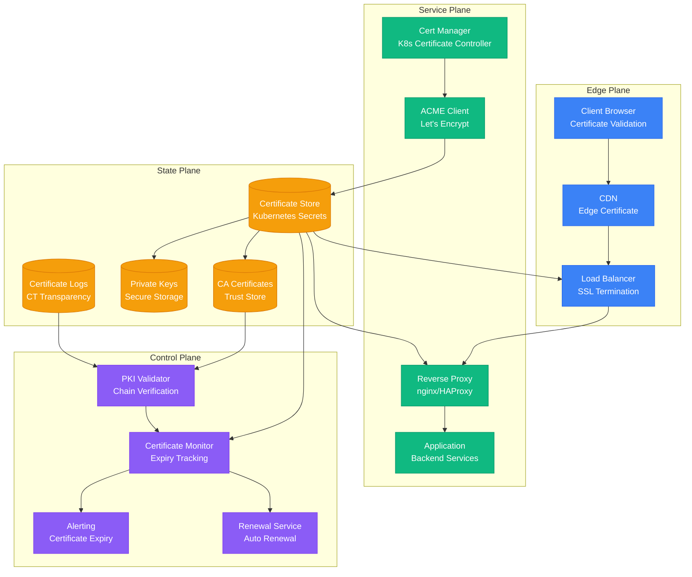

# SSL/TLS Certificate Issues - Systematic Validation and Resolution

## Overview

This guide provides comprehensive debugging strategies for SSL/TLS certificate issues in production environments. Based on real incidents from Cloudflare's certificate management, Let's Encrypt deployment challenges, and enterprise PKI troubleshooting.

## Architecture Context



## SSL/TLS Debugging Flowchart

```mermaid
flowchart TD
    START[SSL/TLS Issue Detected] --> IDENTIFY_ERROR{Error Type}

    IDENTIFY_ERROR --> CERT_EXPIRED[Certificate Expired]
    IDENTIFY_ERROR --> CERT_INVALID[Certificate Invalid]
    IDENTIFY_ERROR --> HANDSHAKE_FAIL[Handshake Failure]
    IDENTIFY_ERROR --> CHAIN_ISSUE[Certificate Chain Issue]
    IDENTIFY_ERROR --> HOSTNAME_MISMATCH[Hostname Mismatch]

    CERT_EXPIRED --> CHECK_EXPIRY[Check Certificate Expiry<br/>openssl x509 -enddate]
    CERT_INVALID --> VALIDATE_CERT[Validate Certificate<br/>openssl verify]
    HANDSHAKE_FAIL --> DEBUG_HANDSHAKE[Debug SSL Handshake<br/>openssl s_client]
    CHAIN_ISSUE --> CHECK_CHAIN[Check Certificate Chain<br/>openssl s_client -showcerts]
    HOSTNAME_MISMATCH --> CHECK_SAN[Check Subject Alt Names<br/>openssl x509 -text]

    CHECK_EXPIRY --> RENEWAL_NEEDED{Renewal Required?}
    VALIDATE_CERT --> CERT_ISSUES{Certificate Issues}
    DEBUG_HANDSHAKE --> HANDSHAKE_ANALYSIS{Handshake Analysis}
    CHECK_CHAIN --> CHAIN_ANALYSIS{Chain Analysis}
    CHECK_SAN --> HOSTNAME_ANALYSIS{Hostname Analysis}

    RENEWAL_NEEDED --> AUTO_RENEWAL[Check Auto-Renewal<br/>Cert-manager/ACME]
    RENEWAL_NEEDED --> MANUAL_RENEWAL[Manual Certificate Renewal]

    CERT_ISSUES --> SELF_SIGNED[Self-Signed Certificate]
    CERT_ISSUES --> CA_UNTRUSTED[Untrusted CA]
    CERT_ISSUES --> CERT_REVOKED[Certificate Revoked]
    CERT_ISSUES --> WRONG_FORMAT[Wrong Certificate Format]

    HANDSHAKE_ANALYSIS --> PROTOCOL_MISMATCH[SSL/TLS Protocol Mismatch]
    HANDSHAKE_ANALYSIS --> CIPHER_ISSUE[Cipher Suite Issue]
    HANDSHAKE_ANALYSIS --> CLIENT_CERT_REQUIRED[Client Certificate Required]

    CHAIN_ANALYSIS --> INCOMPLETE_CHAIN[Incomplete Certificate Chain]
    CHAIN_ANALYSIS --> INTERMEDIATE_MISSING[Missing Intermediate Cert]
    CHAIN_ANALYSIS --> ROOT_CA_ISSUE[Root CA Issue]

    HOSTNAME_ANALYSIS --> DOMAIN_MISMATCH[Domain Name Mismatch]
    HOSTNAME_ANALYSIS --> WILDCARD_ISSUE[Wildcard Certificate Issue]
    HOSTNAME_ANALYSIS --> SAN_MISSING[SAN Missing Domain]

    %% Solutions
    AUTO_RENEWAL --> RESTART_CERT_MANAGER[Restart Cert-Manager]
    MANUAL_RENEWAL --> GET_NEW_CERT[Obtain New Certificate]
    SELF_SIGNED --> REPLACE_WITH_TRUSTED[Replace with Trusted Cert]
    CA_UNTRUSTED --> ADD_CA_TO_TRUST[Add CA to Trust Store]
    CERT_REVOKED --> ISSUE_NEW_CERT[Issue New Certificate]
    WRONG_FORMAT --> CONVERT_FORMAT[Convert Certificate Format]

    PROTOCOL_MISMATCH --> UPDATE_TLS_CONFIG[Update TLS Configuration]
    CIPHER_ISSUE --> FIX_CIPHER_SUITES[Fix Cipher Suite Config]
    CLIENT_CERT_REQUIRED --> CONFIGURE_CLIENT_CERT[Configure Client Certificate]

    INCOMPLETE_CHAIN --> REBUILD_CHAIN[Rebuild Certificate Chain]
    INTERMEDIATE_MISSING --> ADD_INTERMEDIATE[Add Intermediate Cert]
    ROOT_CA_ISSUE --> FIX_ROOT_CA[Fix Root CA Configuration]

    DOMAIN_MISMATCH --> UPDATE_CERT_DOMAINS[Update Certificate Domains]
    WILDCARD_ISSUE --> FIX_WILDCARD_CONFIG[Fix Wildcard Configuration]
    SAN_MISSING --> ADD_SAN_DOMAINS[Add SAN Domains]

    %% Monitoring
    RESTART_CERT_MANAGER --> MONITOR[Monitor Certificate Status]
    GET_NEW_CERT --> MONITOR
    REPLACE_WITH_TRUSTED --> MONITOR
    ADD_CA_TO_TRUST --> MONITOR
    ISSUE_NEW_CERT --> MONITOR
    CONVERT_FORMAT --> MONITOR
    UPDATE_TLS_CONFIG --> MONITOR
    FIX_CIPHER_SUITES --> MONITOR
    CONFIGURE_CLIENT_CERT --> MONITOR
    REBUILD_CHAIN --> MONITOR
    ADD_INTERMEDIATE --> MONITOR
    FIX_ROOT_CA --> MONITOR
    UPDATE_CERT_DOMAINS --> MONITOR
    FIX_WILDCARD_CONFIG --> MONITOR
    ADD_SAN_DOMAINS --> MONITOR

    MONITOR --> SUCCESS[SSL/TLS Working]
    MONITOR --> ESCALATE[Escalate to Security Team]
```



## Certificate Validation Commands

### Basic Certificate Information

#### OpenSSL Certificate Analysis
```bash
# Check certificate expiry date
openssl x509 -in certificate.crt -noout -enddate

# Display certificate details
openssl x509 -in certificate.crt -text -noout

# Check certificate validity period
openssl x509 -in certificate.crt -noout -startdate -enddate

# Verify certificate against private key
openssl x509 -in certificate.crt -noout -modulus | openssl md5
openssl rsa -in private.key -noout -modulus | openssl md5

# Check certificate chain
openssl verify -CAfile ca-bundle.crt certificate.crt

# Display certificate in different formats
openssl x509 -in certificate.crt -outform DER -out certificate.der
openssl x509 -in certificate.der -inform DER -text -noout
```

#### Remote Certificate Testing
```bash
# Test SSL connection to remote server
openssl s_client -connect example.com:443 -servername example.com

# Show certificate chain
openssl s_client -connect example.com:443 -showcerts

# Test specific SSL/TLS version
openssl s_client -connect example.com:443 -tls1_2

# Test with SNI (Server Name Indication)
openssl s_client -connect example.com:443 -servername api.example.com

# Check certificate expiry for remote host
echo | openssl s_client -connect example.com:443 -servername example.com 2>/dev/null | \
  openssl x509 -noout -enddate

# Test client certificate authentication
openssl s_client -connect example.com:443 -cert client.crt -key client.key
```

### Advanced Certificate Debugging

#### Certificate Chain Validation Script
```bash
#!/bin/bash
# certificate_chain_validator.sh

DOMAIN="$1"
PORT="${2:-443}"

if [ -z "$DOMAIN" ]; then
    echo "Usage: $0 <domain> [port]"
    exit 1
fi

echo "=== SSL Certificate Chain Analysis for $DOMAIN:$PORT ==="

# Get certificate chain
echo "1. Fetching certificate chain..."
CERT_CHAIN=$(echo | openssl s_client -connect "$DOMAIN:$PORT" -servername "$DOMAIN" 2>/dev/null)

if [ $? -ne 0 ]; then
    echo "ERROR: Failed to connect to $DOMAIN:$PORT"
    exit 1
fi

# Extract and save certificates
echo "$CERT_CHAIN" | awk '/-----BEGIN CERTIFICATE-----/,/-----END CERTIFICATE-----/' > /tmp/chain.pem

# Split chain into individual certificates
csplit -f /tmp/cert_ -b %02d.pem /tmp/chain.pem '/-----BEGIN CERTIFICATE-----/' '{*}' >/dev/null 2>&1

echo "2. Analyzing certificate chain..."

CERT_COUNT=0
for cert_file in /tmp/cert_*.pem; do
    if [ -s "$cert_file" ]; then
        CERT_COUNT=$((CERT_COUNT + 1))
        echo "--- Certificate $CERT_COUNT ---"

        # Basic certificate info
        SUBJECT=$(openssl x509 -in "$cert_file" -noout -subject 2>/dev/null | sed 's/subject=//')
        ISSUER=$(openssl x509 -in "$cert_file" -noout -issuer 2>/dev/null | sed 's/issuer=//')
        SERIAL=$(openssl x509 -in "$cert_file" -noout -serial 2>/dev/null | sed 's/serial=//')
        NOT_BEFORE=$(openssl x509 -in "$cert_file" -noout -startdate 2>/dev/null | sed 's/notBefore=//')
        NOT_AFTER=$(openssl x509 -in "$cert_file" -noout -enddate 2>/dev/null | sed 's/notAfter=//')

        echo "Subject: $SUBJECT"
        echo "Issuer: $ISSUER"
        echo "Serial: $SERIAL"
        echo "Valid From: $NOT_BEFORE"
        echo "Valid Until: $NOT_AFTER"

        # Check if certificate is expired
        if openssl x509 -in "$cert_file" -checkend 0 >/dev/null 2>&1; then
            echo "Status: VALID"
        else
            echo "Status: EXPIRED"
        fi

        # Check expiry warning
        if openssl x509 -in "$cert_file" -checkend 2592000 >/dev/null 2>&1; then
            echo "Expiry Warning: Certificate expires within 30 days"
        fi

        # Extract SAN
        SAN=$(openssl x509 -in "$cert_file" -text -noout 2>/dev/null | grep -A1 "Subject Alternative Name" | tail -1 | sed 's/^ *//')
        if [ -n "$SAN" ]; then
            echo "SAN: $SAN"
        fi

        echo ""
    fi
done

echo "3. Chain validation..."

# Verify the complete chain
if openssl verify -CAfile /etc/ssl/certs/ca-certificates.crt /tmp/cert_01.pem >/dev/null 2>&1; then
    echo "Certificate chain: VALID"
else
    echo "Certificate chain: INVALID"
    echo "Detailed verification:"
    openssl verify -CAfile /etc/ssl/certs/ca-certificates.crt /tmp/cert_01.pem
fi

echo "4. SSL Labs-style checks..."

# Check for weak signatures
SIGNATURE=$(openssl x509 -in /tmp/cert_01.pem -text -noout 2>/dev/null | grep "Signature Algorithm" | head -1)
echo "Signature Algorithm: $SIGNATURE"

if echo "$SIGNATURE" | grep -qi "sha1\|md5"; then
    echo "WARNING: Weak signature algorithm detected"
fi

# Check key size
KEY_SIZE=$(openssl x509 -in /tmp/cert_01.pem -text -noout 2>/dev/null | grep "Public-Key" | sed 's/.*(\([0-9]*\) bit).*/\1/')
echo "Key Size: $KEY_SIZE bits"

if [ "$KEY_SIZE" -lt 2048 ]; then
    echo "WARNING: Key size less than 2048 bits"
fi

# Cleanup
rm -f /tmp/cert_*.pem /tmp/chain.pem

echo "=== Analysis Complete ==="
```

### Kubernetes Certificate Management

#### Cert-Manager Debugging
```bash
# Check cert-manager pods
kubectl get pods -n cert-manager

# Check certificate resources
kubectl get certificates -A

# Check certificate requests
kubectl get certificaterequests -A

# Describe specific certificate
kubectl describe certificate my-tls-cert -n production

# Check cert-manager logs
kubectl logs -n cert-manager deployment/cert-manager

# Check ACME challenge status
kubectl get challenges -A

# Check ACME orders
kubectl get orders -A

# Debug Let's Encrypt ACME process
kubectl describe order my-tls-cert-xxxx -n production

# Check ingress TLS configuration
kubectl get ingress -A -o yaml | grep -A 10 -B 5 tls:
```

#### Certificate Secret Analysis
```bash
# List TLS secrets
kubectl get secrets -A --field-selector type=kubernetes.io/tls

# Examine certificate in secret
kubectl get secret my-tls-secret -n production -o yaml | \
  grep 'tls.crt:' | awk '{print $2}' | base64 -d | \
  openssl x509 -text -noout

# Check certificate expiry in secret
kubectl get secret my-tls-secret -n production -o yaml | \
  grep 'tls.crt:' | awk '{print $2}' | base64 -d | \
  openssl x509 -noout -enddate

# Validate private key matches certificate
CERT_MODULUS=$(kubectl get secret my-tls-secret -n production -o yaml | \
  grep 'tls.crt:' | awk '{print $2}' | base64 -d | \
  openssl x509 -noout -modulus | openssl md5)

KEY_MODULUS=$(kubectl get secret my-tls-secret -n production -o yaml | \
  grep 'tls.key:' | awk '{print $2}' | base64 -d | \
  openssl rsa -noout -modulus | openssl md5)

if [ "$CERT_MODULUS" = "$KEY_MODULUS" ]; then
    echo "Certificate and private key match"
else
    echo "ERROR: Certificate and private key do not match"
fi
```

## Certificate Automation and Monitoring

### Certificate Expiry Monitoring Script

```python
#!/usr/bin/env python3
"""
SSL Certificate Expiry Monitoring System
"""
import ssl
import socket
import datetime
import subprocess
import logging
from typing import List, Dict, Any, Optional
from dataclasses import dataclass
from concurrent.futures import ThreadPoolExecutor, as_completed

@dataclass
class CertificateInfo:
    hostname: str
    port: int
    subject: str
    issuer: str
    serial_number: str
    not_before: datetime.datetime
    not_after: datetime.datetime
    days_until_expiry: int
    is_expired: bool
    is_self_signed: bool
    signature_algorithm: str
    key_size: Optional[int]
    san_list: List[str]

class CertificateMonitor:
    def __init__(self, warning_days: int = 30, critical_days: int = 7):
        self.warning_days = warning_days
        self.critical_days = critical_days
        self.logger = logging.getLogger(__name__)

    def check_certificate(self, hostname: str, port: int = 443,
                         timeout: int = 10) -> Optional[CertificateInfo]:
        """Check SSL certificate for a specific host and port"""
        try:
            # Create SSL context
            context = ssl.create_default_context()
            context.check_hostname = False
            context.verify_mode = ssl.CERT_NONE

            # Connect and get certificate
            with socket.create_connection((hostname, port), timeout=timeout) as sock:
                with context.wrap_socket(sock, server_hostname=hostname) as ssock:
                    cert = ssock.getpeercert(binary_form=True)
                    cert_der = ssl.DER_cert_to_PEM_cert(cert)

            # Parse certificate using OpenSSL
            return self.parse_certificate(cert_der, hostname, port)

        except Exception as e:
            self.logger.error(f"Failed to check certificate for {hostname}:{port}: {e}")
            return None

    def parse_certificate(self, cert_pem: str, hostname: str, port: int) -> CertificateInfo:
        """Parse certificate details using OpenSSL"""
        # Save certificate to temporary file for OpenSSL processing
        import tempfile
        import os

        with tempfile.NamedTemporaryFile(mode='w', suffix='.pem', delete=False) as f:
            f.write(cert_pem)
            cert_file = f.name

        try:
            # Extract certificate information
            subject = self.run_openssl_command([
                'openssl', 'x509', '-in', cert_file, '-noout', '-subject'
            ]).replace('subject=', '')

            issuer = self.run_openssl_command([
                'openssl', 'x509', '-in', cert_file, '-noout', '-issuer'
            ]).replace('issuer=', '')

            serial = self.run_openssl_command([
                'openssl', 'x509', '-in', cert_file, '-noout', '-serial'
            ]).replace('serial=', '')

            not_before_str = self.run_openssl_command([
                'openssl', 'x509', '-in', cert_file, '-noout', '-startdate'
            ]).replace('notBefore=', '')

            not_after_str = self.run_openssl_command([
                'openssl', 'x509', '-in', cert_file, '-noout', '-enddate'
            ]).replace('notAfter=', '')

            # Parse dates
            not_before = self.parse_cert_date(not_before_str)
            not_after = self.parse_cert_date(not_after_str)

            # Calculate days until expiry
            now = datetime.datetime.utcnow()
            days_until_expiry = (not_after - now).days

            # Check if expired
            is_expired = now > not_after

            # Check if self-signed
            is_self_signed = subject == issuer

            # Get signature algorithm
            cert_text = self.run_openssl_command([
                'openssl', 'x509', '-in', cert_file, '-text', '-noout'
            ])

            signature_algorithm = self.extract_signature_algorithm(cert_text)
            key_size = self.extract_key_size(cert_text)
            san_list = self.extract_san_list(cert_text)

            return CertificateInfo(
                hostname=hostname,
                port=port,
                subject=subject,
                issuer=issuer,
                serial_number=serial,
                not_before=not_before,
                not_after=not_after,
                days_until_expiry=days_until_expiry,
                is_expired=is_expired,
                is_self_signed=is_self_signed,
                signature_algorithm=signature_algorithm,
                key_size=key_size,
                san_list=san_list
            )

        finally:
            os.unlink(cert_file)

    def run_openssl_command(self, command: List[str]) -> str:
        """Run OpenSSL command and return output"""
        try:
            result = subprocess.run(command, capture_output=True, text=True, check=True)
            return result.stdout.strip()
        except subprocess.CalledProcessError as e:
            self.logger.error(f"OpenSSL command failed: {' '.join(command)}: {e}")
            return ""

    def parse_cert_date(self, date_str: str) -> datetime.datetime:
        """Parse certificate date string"""
        # OpenSSL date format: "Mar 15 12:00:00 2024 GMT"
        try:
            return datetime.datetime.strptime(date_str, "%b %d %H:%M:%S %Y %Z")
        except ValueError:
            # Try alternative format
            return datetime.datetime.strptime(date_str, "%b %d %H:%M:%S %Y %z")

    def extract_signature_algorithm(self, cert_text: str) -> str:
        """Extract signature algorithm from certificate text"""
        for line in cert_text.split('\n'):
            if 'Signature Algorithm:' in line:
                return line.split('Signature Algorithm:')[1].strip()
        return "Unknown"

    def extract_key_size(self, cert_text: str) -> Optional[int]:
        """Extract key size from certificate text"""
        for line in cert_text.split('\n'):
            if 'Public-Key:' in line and 'bit' in line:
                try:
                    # Extract number before 'bit'
                    return int(line.split('(')[1].split(' bit')[0])
                except (IndexError, ValueError):
                    pass
        return None

    def extract_san_list(self, cert_text: str) -> List[str]:
        """Extract Subject Alternative Names from certificate text"""
        san_list = []
        in_san_section = False

        for line in cert_text.split('\n'):
            if 'Subject Alternative Name:' in line:
                in_san_section = True
                continue
            elif in_san_section:
                if line.strip().startswith('DNS:'):
                    # Parse DNS entries
                    dns_entries = line.strip().split(', ')
                    for entry in dns_entries:
                        if entry.startswith('DNS:'):
                            san_list.append(entry.replace('DNS:', ''))
                break

        return san_list

    def check_multiple_certificates(self, hosts: List[tuple]) -> List[CertificateInfo]:
        """Check certificates for multiple hosts concurrently"""
        results = []

        with ThreadPoolExecutor(max_workers=10) as executor:
            # Submit all certificate checks
            future_to_host = {
                executor.submit(self.check_certificate, host, port): (host, port)
                for host, port in hosts
            }

            # Collect results
            for future in as_completed(future_to_host):
                host, port = future_to_host[future]
                try:
                    cert_info = future.result()
                    if cert_info:
                        results.append(cert_info)
                except Exception as e:
                    self.logger.error(f"Exception checking {host}:{port}: {e}")

        return results

    def generate_expiry_report(self, cert_infos: List[CertificateInfo]) -> Dict[str, Any]:
        """Generate certificate expiry report"""
        expired = []
        critical = []
        warning = []
        healthy = []

        for cert in cert_infos:
            if cert.is_expired:
                expired.append(cert)
            elif cert.days_until_expiry <= self.critical_days:
                critical.append(cert)
            elif cert.days_until_expiry <= self.warning_days:
                warning.append(cert)
            else:
                healthy.append(cert)

        return {
            'total_certificates': len(cert_infos),
            'expired': len(expired),
            'critical': len(critical),
            'warning': len(warning),
            'healthy': len(healthy),
            'expired_certificates': expired,
            'critical_certificates': critical,
            'warning_certificates': warning,
            'scan_timestamp': datetime.datetime.utcnow().isoformat()
        }

    def send_alerts(self, report: Dict[str, Any]):
        """Send alerts for certificate issues"""
        if report['expired'] > 0:
            self.send_critical_alert(f"{report['expired']} certificates have expired!")

        if report['critical'] > 0:
            self.send_warning_alert(f"{report['critical']} certificates expire within {self.critical_days} days")

        if report['warning'] > 0:
            self.send_info_alert(f"{report['warning']} certificates expire within {self.warning_days} days")

    def send_critical_alert(self, message: str):
        """Send critical alert"""
        self.logger.critical(f"CRITICAL CERTIFICATE ALERT: {message}")

    def send_warning_alert(self, message: str):
        """Send warning alert"""
        self.logger.warning(f"CERTIFICATE WARNING: {message}")

    def send_info_alert(self, message: str):
        """Send info alert"""
        self.logger.info(f"CERTIFICATE INFO: {message}")

# Example usage
if __name__ == '__main__':
    logging.basicConfig(level=logging.INFO)

    monitor = CertificateMonitor(warning_days=30, critical_days=7)

    # Define hosts to monitor
    hosts_to_check = [
        ('example.com', 443),
        ('api.example.com', 443),
        ('internal-service.local', 8443),
        ('db.example.com', 5432)  # PostgreSQL with SSL
    ]

    # Check all certificates
    cert_results = monitor.check_multiple_certificates(hosts_to_check)

    # Generate report
    report = monitor.generate_expiry_report(cert_results)

    # Print report
    print(f"Certificate Expiry Report:")
    print(f"Total: {report['total_certificates']}")
    print(f"Expired: {report['expired']}")
    print(f"Critical: {report['critical']}")
    print(f"Warning: {report['warning']}")
    print(f"Healthy: {report['healthy']}")

    # Send alerts
    monitor.send_alerts(report)

    # Print detailed information for problematic certificates
    for cert in report['expired_certificates'] + report['critical_certificates']:
        print(f"\nCertificate Issue:")
        print(f"  Host: {cert.hostname}:{cert.port}")
        print(f"  Subject: {cert.subject}")
        print(f"  Expires: {cert.not_after}")
        print(f"  Days until expiry: {cert.days_until_expiry}")
        print(f"  Status: {'EXPIRED' if cert.is_expired else 'CRITICAL'}")
```

### Automated Certificate Renewal

#### Let's Encrypt ACME Client
```python
#!/usr/bin/env python3
"""
Automated certificate renewal using ACME protocol
"""
import os
import subprocess
import json
import time
from pathlib import Path
from typing import Dict, List, Optional

class ACMECertificateManager:
    def __init__(self, config: Dict[str, str]):
        self.acme_client = config.get('acme_client', 'certbot')
        self.config_dir = config.get('config_dir', '/etc/letsencrypt')
        self.work_dir = config.get('work_dir', '/var/lib/letsencrypt')
        self.log_dir = config.get('log_dir', '/var/log/letsencrypt')
        self.email = config.get('email')
        self.staging = config.get('staging', False)

    def request_certificate(self, domains: List[str],
                          challenge_type: str = 'http-01') -> bool:
        """Request a new certificate using ACME"""
        if not self.email:
            raise ValueError("Email address required for ACME registration")

        # Build certbot command
        cmd = [
            'certbot', 'certonly',
            '--non-interactive',
            '--agree-tos',
            '--email', self.email,
            '--config-dir', self.config_dir,
            '--work-dir', self.work_dir,
            '--logs-dir', self.log_dir
        ]

        # Add staging flag if needed
        if self.staging:
            cmd.append('--staging')

        # Add challenge type
        if challenge_type == 'http-01':
            cmd.extend(['--webroot', '--webroot-path', '/var/www/html'])
        elif challenge_type == 'dns-01':
            cmd.extend(['--dns-cloudflare', '--dns-cloudflare-credentials', '/etc/cloudflare.ini'])

        # Add domains
        for domain in domains:
            cmd.extend(['-d', domain])

        try:
            result = subprocess.run(cmd, capture_output=True, text=True, check=True)
            print(f"Certificate successfully obtained for {domains}")
            return True
        except subprocess.CalledProcessError as e:
            print(f"Certificate request failed: {e.stderr}")
            return False

    def renew_certificate(self, domain: str) -> bool:
        """Renew an existing certificate"""
        cmd = [
            'certbot', 'renew',
            '--cert-name', domain,
            '--config-dir', self.config_dir,
            '--work-dir', self.work_dir,
            '--logs-dir', self.log_dir,
            '--non-interactive'
        ]

        try:
            result = subprocess.run(cmd, capture_output=True, text=True, check=True)
            print(f"Certificate successfully renewed for {domain}")
            return True
        except subprocess.CalledProcessError as e:
            print(f"Certificate renewal failed for {domain}: {e.stderr}")
            return False

    def list_certificates(self) -> List[Dict[str, str]]:
        """List all managed certificates"""
        cmd = [
            'certbot', 'certificates',
            '--config-dir', self.config_dir
        ]

        try:
            result = subprocess.run(cmd, capture_output=True, text=True, check=True)
            return self.parse_certificate_list(result.stdout)
        except subprocess.CalledProcessError as e:
            print(f"Failed to list certificates: {e.stderr}")
            return []

    def parse_certificate_list(self, output: str) -> List[Dict[str, str]]:
        """Parse certbot certificates output"""
        certificates = []
        current_cert = {}

        for line in output.split('\n'):
            line = line.strip()
            if line.startswith('Certificate Name:'):
                if current_cert:
                    certificates.append(current_cert)
                current_cert = {'name': line.split(':', 1)[1].strip()}
            elif line.startswith('Domains:'):
                current_cert['domains'] = line.split(':', 1)[1].strip()
            elif line.startswith('Expiry Date:'):
                current_cert['expiry'] = line.split(':', 1)[1].strip()
            elif line.startswith('Certificate Path:'):
                current_cert['cert_path'] = line.split(':', 1)[1].strip()
            elif line.startswith('Private Key Path:'):
                current_cert['key_path'] = line.split(':', 1)[1].strip()

        if current_cert:
            certificates.append(current_cert)

        return certificates

    def deploy_certificate(self, domain: str, service_type: str):
        """Deploy certificate to specific service"""
        cert_path = f"{self.config_dir}/live/{domain}/fullchain.pem"
        key_path = f"{self.config_dir}/live/{domain}/privkey.pem"

        if service_type == 'nginx':
            self.deploy_to_nginx(domain, cert_path, key_path)
        elif service_type == 'apache':
            self.deploy_to_apache(domain, cert_path, key_path)
        elif service_type == 'kubernetes':
            self.deploy_to_kubernetes(domain, cert_path, key_path)

    def deploy_to_nginx(self, domain: str, cert_path: str, key_path: str):
        """Deploy certificate to nginx"""
        nginx_config = f"""
server {{
    listen 443 ssl http2;
    server_name {domain};

    ssl_certificate {cert_path};
    ssl_certificate_key {key_path};

    # SSL configuration
    ssl_protocols TLSv1.2 TLSv1.3;
    ssl_ciphers ECDHE-RSA-AES256-GCM-SHA512:DHE-RSA-AES256-GCM-SHA512:ECDHE-RSA-AES256-GCM-SHA384:DHE-RSA-AES256-GCM-SHA384;
    ssl_prefer_server_ciphers off;
    ssl_session_cache shared:SSL:10m;
    ssl_session_timeout 10m;

    # Security headers
    add_header Strict-Transport-Security "max-age=63072000" always;
    add_header X-Frame-Options DENY;
    add_header X-Content-Type-Options nosniff;

    location / {{
        proxy_pass http://backend;
        proxy_set_header Host $host;
        proxy_set_header X-Real-IP $remote_addr;
        proxy_set_header X-Forwarded-For $proxy_add_x_forwarded_for;
        proxy_set_header X-Forwarded-Proto $scheme;
    }}
}}
"""

        config_file = f"/etc/nginx/sites-available/{domain}-ssl"
        with open(config_file, 'w') as f:
            f.write(nginx_config)

        # Enable site
        symlink_path = f"/etc/nginx/sites-enabled/{domain}-ssl"
        if not os.path.exists(symlink_path):
            os.symlink(config_file, symlink_path)

        # Test nginx configuration
        test_result = subprocess.run(['nginx', '-t'], capture_output=True, text=True)
        if test_result.returncode == 0:
            subprocess.run(['systemctl', 'reload', 'nginx'])
            print(f"Certificate deployed to nginx for {domain}")
        else:
            print(f"Nginx configuration test failed: {test_result.stderr}")

    def deploy_to_kubernetes(self, domain: str, cert_path: str, key_path: str):
        """Deploy certificate to Kubernetes as TLS secret"""
        with open(cert_path, 'r') as f:
            cert_data = f.read()

        with open(key_path, 'r') as f:
            key_data = f.read()

        # Create Kubernetes TLS secret
        kubectl_cmd = [
            'kubectl', 'create', 'secret', 'tls', f"{domain}-tls",
            '--cert', cert_path,
            '--key', key_path,
            '--dry-run=client',
            '-o', 'yaml'
        ]

        try:
            result = subprocess.run(kubectl_cmd, capture_output=True, text=True, check=True)
            secret_yaml = result.stdout

            # Apply the secret
            apply_cmd = ['kubectl', 'apply', '-f', '-']
            subprocess.run(apply_cmd, input=secret_yaml, text=True, check=True)

            print(f"Certificate deployed to Kubernetes as {domain}-tls secret")
        except subprocess.CalledProcessError as e:
            print(f"Failed to deploy to Kubernetes: {e.stderr}")

# Automated renewal script
class CertificateRenewalService:
    def __init__(self, acme_manager: ACMECertificateManager):
        self.acme_manager = acme_manager

    def check_and_renew_certificates(self, days_before_expiry: int = 30):
        """Check all certificates and renew those expiring soon"""
        certificates = self.acme_manager.list_certificates()

        for cert in certificates:
            if self.should_renew_certificate(cert, days_before_expiry):
                print(f"Renewing certificate for {cert['name']}")
                success = self.acme_manager.renew_certificate(cert['name'])

                if success:
                    # Deploy renewed certificate
                    self.deploy_renewed_certificate(cert['name'])
                else:
                    # Send alert about renewal failure
                    self.send_renewal_failure_alert(cert['name'])

    def should_renew_certificate(self, cert: Dict[str, str],
                                days_before_expiry: int) -> bool:
        """Check if certificate should be renewed"""
        # Parse expiry date from cert info
        # This is a simplified check - in practice, you'd parse the actual date
        expiry_str = cert.get('expiry', '')
        return 'EXPIRED' in expiry_str or f'({days_before_expiry} days)' in expiry_str

    def deploy_renewed_certificate(self, domain: str):
        """Deploy renewed certificate to services"""
        # Deploy to all configured services
        services = ['nginx', 'kubernetes']  # Configure as needed

        for service in services:
            try:
                self.acme_manager.deploy_certificate(domain, service)
            except Exception as e:
                print(f"Failed to deploy certificate to {service}: {e}")

    def send_renewal_failure_alert(self, domain: str):
        """Send alert for certificate renewal failure"""
        print(f"ALERT: Certificate renewal failed for {domain}")
        # Implement your alerting mechanism here

# Example usage
if __name__ == '__main__':
    config = {
        'email': 'admin@example.com',
        'staging': False,  # Set to True for testing
        'config_dir': '/etc/letsencrypt',
        'work_dir': '/var/lib/letsencrypt',
        'log_dir': '/var/log/letsencrypt'
    }

    acme_manager = ACMECertificateManager(config)
    renewal_service = CertificateRenewalService(acme_manager)

    # Check and renew certificates expiring within 30 days
    renewal_service.check_and_renew_certificates(days_before_expiry=30)
```

## Production Examples

### Cloudflare: Edge Certificate Management

#### Problem: Origin Certificate Validation
```bash
# Problem: Cloudflare's origin certificates not trusted by browsers
# when accessing origin directly

# Check Cloudflare origin certificate
openssl s_client -connect origin.example.com:443 -servername origin.example.com

# Solution: Use Cloudflare Origin CA for backend, Let's Encrypt for direct access
# 1. Generate Cloudflare Origin Certificate for backend communication
# 2. Set up Let's Encrypt for direct origin access
# 3. Configure Cloudflare SSL mode properly

# Verify Cloudflare SSL configuration
curl -X GET "https://api.cloudflare.com/client/v4/zones/${ZONE_ID}/settings/ssl" \
  -H "Authorization: Bearer ${CF_API_TOKEN}" \
  -H "Content-Type: application/json"

# Check SSL mode (should be "Full (strict)" for production)
curl -X PATCH "https://api.cloudflare.com/client/v4/zones/${ZONE_ID}/settings/ssl" \
  -H "Authorization: Bearer ${CF_API_TOKEN}" \
  -H "Content-Type: application/json" \
  --data '{"value":"strict"}'
```

### Let's Encrypt: Rate Limiting Issues

#### Problem: Certificate Request Rate Limits
```python
# Problem: Hitting Let's Encrypt rate limits during bulk renewals
class RateLimitAwareCertificateManager:
    def __init__(self):
        self.rate_limits = {
            'certificates_per_registered_domain': 50,  # per week
            'duplicate_certificate': 5,               # per week
            'failed_validations': 5,                  # per hour
            'accounts_per_ip': 10,                    # per 3 hours
            'pending_authorizations': 300             # per account
        }
        self.request_log = []

    def request_certificate_with_rate_limit(self, domains: List[str]) -> bool:
        """Request certificate with rate limit awareness"""

        # Check if we're approaching rate limits
        if self.is_approaching_rate_limit('certificates_per_registered_domain'):
            self.logger.warning("Approaching certificate rate limit, deferring request")
            return False

        # Check for recent failures
        recent_failures = self.count_recent_failures(hours=1)
        if recent_failures >= 4:  # Leave buffer before limit
            self.logger.warning("Too many recent failures, deferring request")
            return False

        # Proceed with certificate request
        try:
            success = self.request_certificate(domains)

            # Log the request
            self.log_certificate_request(domains, success)

            if not success:
                # Implement exponential backoff for failures
                self.implement_backoff_strategy()

            return success

        except Exception as e:
            self.logger.error(f"Certificate request failed: {e}")
            self.log_certificate_request(domains, False)
            return False

    def is_approaching_rate_limit(self, limit_type: str) -> bool:
        """Check if approaching a specific rate limit"""
        # Implement rate limit checking logic
        # This would query your request log and compare against limits
        pass

    def implement_backoff_strategy(self):
        """Implement exponential backoff after failures"""
        # Calculate backoff time based on recent failures
        recent_failures = self.count_recent_failures(hours=1)
        backoff_time = min(3600, 60 * (2 ** recent_failures))  # Max 1 hour

        self.logger.info(f"Implementing backoff for {backoff_time} seconds")
        time.sleep(backoff_time)
```

### Enterprise PKI: Certificate Chain Issues

#### Problem: Internal CA Certificate Trust
```bash
# Problem: Internal CA certificates not trusted by applications
# Solution: Proper CA certificate distribution and trust store management

# Check if internal CA is in system trust store
openssl verify -CAfile /etc/ssl/certs/ca-certificates.crt internal-server.crt

# Add internal CA to system trust store (Ubuntu/Debian)
sudo cp internal-ca.crt /usr/local/share/ca-certificates/
sudo update-ca-certificates

# Add internal CA to system trust store (RHEL/CentOS)
sudo cp internal-ca.crt /etc/pki/ca-trust/source/anchors/
sudo update-ca-trust

# Verify internal certificate chain
openssl verify -CAfile internal-ca.crt -untrusted intermediate-ca.crt server.crt

# Test application with internal certificates
curl --cacert internal-ca.crt https://internal-app.company.com/health

# For Java applications, add to Java trust store
keytool -import -alias internal-ca -file internal-ca.crt -keystore $JAVA_HOME/jre/lib/security/cacerts

# For container environments, build CA into base image
# Dockerfile example:
# COPY internal-ca.crt /usr/local/share/ca-certificates/
# RUN update-ca-certificates
```

## Monitoring and Alerting

### Certificate Expiry Alerts

```yaml
# Prometheus alerting rules for certificate monitoring
groups:
- name: ssl_certificate_alerts
  rules:
  - alert: SSLCertificateExpiringSoon
    expr: (ssl_certificate_expiry_seconds - time()) / 86400 < 30
    for: 0m
    labels:
      severity: warning
    annotations:
      summary: "SSL certificate expiring soon"
      description: "Certificate for {{ $labels.instance }} expires in {{ $value }} days"

  - alert: SSLCertificateExpiringSoonCritical
    expr: (ssl_certificate_expiry_seconds - time()) / 86400 < 7
    for: 0m
    labels:
      severity: critical
    annotations:
      summary: "SSL certificate expiring very soon"
      description: "Certificate for {{ $labels.instance }} expires in {{ $value }} days"

  - alert: SSLCertificateExpired
    expr: ssl_certificate_expiry_seconds - time() < 0
    for: 0m
    labels:
      severity: critical
    annotations:
      summary: "SSL certificate has expired"
      description: "Certificate for {{ $labels.instance }} has expired {{ $value }} seconds ago"

  - alert: SSLCertificateInvalid
    expr: ssl_certificate_valid == 0
    for: 5m
    labels:
      severity: critical
    annotations:
      summary: "SSL certificate is invalid"
      description: "Certificate for {{ $labels.instance }} is invalid"
```

### Grafana Dashboard for Certificate Monitoring

```json
{
  "dashboard": {
    "title": "SSL Certificate Monitoring",
    "panels": [
      {
        "title": "Certificate Expiry Timeline",
        "type": "stat",
        "targets": [
          {
            "expr": "(ssl_certificate_expiry_seconds - time()) / 86400",
            "legendFormat": "{{ instance }} - Days to expiry"
          }
        ],
        "fieldConfig": {
          "defaults": {
            "color": {
              "mode": "thresholds"
            },
            "thresholds": {
              "steps": [
                {
                  "color": "red",
                  "value": 0
                },
                {
                  "color": "yellow",
                  "value": 7
                },
                {
                  "color": "green",
                  "value": 30
                }
              ]
            }
          }
        }
      },
      {
        "title": "Certificate Validity Status",
        "type": "stat",
        "targets": [
          {
            "expr": "ssl_certificate_valid",
            "legendFormat": "{{ instance }} - Valid"
          }
        ]
      },
      {
        "title": "Certificate Renewal Events",
        "type": "logs",
        "targets": [
          {
            "expr": "{job=\"cert-manager\"} |= \"certificate\""
          }
        ]
      }
    ]
  }
}
```

## Success Metrics

- **Certificate Expiry Prevention**: 0 expired certificates in production
- **Certificate Validation Success Rate**: > 99.9%
- **Certificate Renewal Success Rate**: > 99.5%
- **SSL Handshake Success Rate**: > 99.9%
- **Certificate Chain Validation**: 100% complete chains
- **Certificate Monitoring Coverage**: 100% of production endpoints

## The 3 AM Test

**Scenario**: Your main production website is showing SSL certificate errors. Users can't access the site securely, and browsers are showing "connection not secure" warnings. E-commerce transactions have stopped.

**This guide provides**:
1. **Immediate diagnosis**: Commands to check certificate status, expiry, and chain validity
2. **Quick fixes**: Emergency certificate renewal and deployment procedures
3. **Root cause analysis**: Tools to identify certificate chain, hostname, or CA issues
4. **Automated validation**: Scripts to verify certificate correctness across all layers
5. **Prevention systems**: Monitoring and auto-renewal to prevent future incidents

**Expected outcome**: SSL issues diagnosed within 5 minutes, emergency certificate deployed within 15 minutes, root cause fixed and monitoring improved within 2 hours.