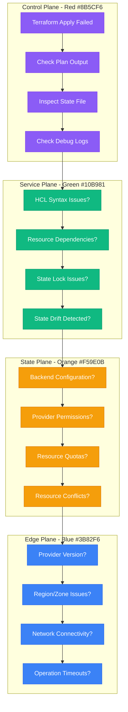

# Terraform Apply Errors Debugging: Infrastructure Provisioning Troubleshooting Guide

## Executive Summary

Terraform apply errors affect 40% of infrastructure deployments and can cause significant deployment delays and infrastructure drift. This guide provides systematic debugging approaches used by teams at HashiCorp, AWS, and other infrastructure-heavy organizations to resolve state conflicts, provider issues, and resource dependencies.

## Systematic Debugging Flowchart



## Common Terraform Error Patterns

### 1. State Lock Errors

**Error Pattern:**
```
Error: Error acquiring the state lock

Error message: ConditionalCheckFailedException: The conditional request failed
Lock Info:
  ID:        abc123-def456-ghi789
  Path:      terraform.tfstate
  Operation: OperationTypeApply
  Who:       user@example.com
  Version:   1.5.0
  Created:   2023-12-01 10:30:00 UTC
```

**Investigation Commands:**
```bash
# Check current state lock
terraform force-unlock abc123-def456-ghi789

# Verify state backend configuration
terraform init -backend-config="bucket=my-terraform-state"

# Check state lock table (for DynamoDB backend)
aws dynamodb scan --table-name terraform-state-lock \
  --filter-expression "LockID = :lockid" \
  --expression-attribute-values '{":lockid":{"S":"terraform.tfstate"}}'
```

### 2. Resource Already Exists Errors

**Error Pattern:**
```
Error: Error creating EC2 Instance: InvalidVpcID.NotFound
  with aws_instance.web,
  on main.tf line 15, in resource "aws_instance" "web":
  15: resource "aws_instance" "web" {

The VPC ID 'vpc-abc123' does not exist
```

**Investigation Commands:**
```bash
# Check resource state
terraform state show aws_instance.web

# List all resources in state
terraform state list

# Check if resource exists in provider
aws ec2 describe-instances --instance-ids i-abc123def456

# Import existing resource
terraform import aws_instance.web i-abc123def456
```

### 3. Provider Authentication Issues

**Error Pattern:**
```
Error: Error configuring Terraform AWS Provider: no valid credential sources for Terraform AWS Provider found.

Please see https://registry.terraform.io/providers/hashicorp/aws/latest/docs#authentication
for more information about providing credentials.
```

**Investigation Commands:**
```bash
# Check AWS credentials
aws sts get-caller-identity

# Verify provider configuration
terraform providers

# Test provider authentication
terraform plan -var-file="terraform.tfvars"

# Check environment variables
env | grep -E "AWS_|TF_"
```

## Step-by-Step Investigation Procedures

### State File Analysis

```bash
# Enable detailed logging
export TF_LOG=DEBUG
export TF_LOG_PATH=terraform-debug.log

# Check state file integrity
terraform show
terraform state list

# Compare desired vs current state
terraform plan -detailed-exitcode

# Analyze state file directly
terraform show -json > current-state.json
jq '.values.root_module.resources[] | select(.type == "aws_instance")' current-state.json
```

### Resource Dependency Investigation

```bash
# Generate dependency graph
terraform graph | dot -Tsvg > dependency-graph.svg

# Check resource dependencies
terraform show -json | jq '.configuration.root_module.resources[] | select(.depends_on != null)'

# Analyze resource ordering
terraform plan -out=plan.out
terraform show -json plan.out | jq '.planned_changes[] | {action: .change.actions, resource: .address}'
```

### Provider and Backend Debugging

```bash
# Verify provider versions
terraform version
terraform providers lock -platform=linux_amd64

# Test backend connectivity
terraform init -backend=false
terraform init -migrate-state

# Check backend configuration
terraform init -backend-config="bucket=my-bucket" -backend-config="region=us-west-2"
```

## Root Cause Identification Techniques

### State Drift Detection

```bash
# Detect configuration drift
terraform plan -refresh-only

# Compare state with actual infrastructure
terraform refresh
terraform plan

# Identify modified resources
terraform show -json | jq '.values.root_module.resources[] | select(.values.tags.Environment == null)'
```

### Resource Conflict Analysis

```terraform
# Debug resource conflicts with data sources
data "aws_vpc" "existing" {
  id = var.vpc_id
}

data "aws_subnet" "existing" {
  id = var.subnet_id
}

# Validate before creating resources
resource "aws_instance" "web" {
  count           = data.aws_vpc.existing.id != "" ? 1 : 0
  ami             = var.ami_id
  instance_type   = var.instance_type
  subnet_id       = data.aws_subnet.existing.id

  lifecycle {
    prevent_destroy = true
  }
}
```

### Permission and Quota Issues

```bash
# Check IAM permissions
aws iam simulate-principal-policy \
  --policy-source-arn arn:aws:iam::123456789012:user/terraform \
  --action-names ec2:RunInstances \
  --resource-arns arn:aws:ec2:us-west-2:123456789012:instance/*

# Check service quotas
aws service-quotas get-service-quota \
  --service-code ec2 \
  --quota-code L-1216C47A  # Running On-Demand EC2 instances

# Verify region availability
aws ec2 describe-availability-zones --region us-west-2
```

## Advanced Debugging Techniques

### Plan Analysis and Validation

```bash
# Generate detailed plan
terraform plan -out=plan.out -detailed-exitcode

# Analyze plan in JSON format
terraform show -json plan.out > plan.json

# Extract specific changes
jq '.planned_changes[] | select(.change.actions[] | contains("create"))' plan.json

# Check for sensitive data exposure
terraform plan -out=plan.out
terraform show plan.out | grep -i "sensitive"
```

### State Manipulation and Recovery

```bash
# Backup current state
terraform state pull > terraform.tfstate.backup

# Remove problematic resource from state
terraform state rm aws_instance.problematic

# Move resource to different state address
terraform state mv aws_instance.old aws_instance.new

# Import existing resource
terraform import aws_instance.web i-1234567890abcdef0

# Replace specific resource
terraform apply -replace=aws_instance.web
```

### Custom Validation and Testing

```terraform
# Add custom validation rules
variable "instance_type" {
  description = "EC2 instance type"
  type        = string
  default     = "t3.micro"

  validation {
    condition = contains([
      "t3.micro", "t3.small", "t3.medium",
      "m5.large", "m5.xlarge"
    ], var.instance_type)
    error_message = "Instance type must be from approved list."
  }
}

# Use precondition checks
resource "aws_instance" "web" {
  ami           = var.ami_id
  instance_type = var.instance_type

  lifecycle {
    precondition {
      condition     = data.aws_ami.selected.architecture == "x86_64"
      error_message = "AMI must be x86_64 architecture."
    }
  }
}
```

## Fix Implementation Strategies

### State Lock Resolution

```bash
#!/bin/bash
# state-lock-recovery.sh

LOCK_ID="$1"
STATE_BUCKET="$2"

if [ -z "$LOCK_ID" ] || [ -z "$STATE_BUCKET" ]; then
    echo "Usage: $0 <lock-id> <state-bucket>"
    exit 1
fi

echo "🔍 Checking state lock: $LOCK_ID"

# Check if lock still exists
aws dynamodb get-item \
  --table-name terraform-state-lock \
  --key '{"LockID": {"S": "'"$STATE_BUCKET"'/terraform.tfstate"}}' \
  --output table

# Force unlock if confirmed
read -p "Force unlock? (y/N): " -n 1 -r
echo
if [[ $REPLY =~ ^[Yy]$ ]]; then
    terraform force-unlock "$LOCK_ID"
    echo "✅ Lock released"
fi
```

### Resource Import Strategy

```bash
#!/bin/bash
# import-existing-resources.sh

# Import existing AWS resources
echo "🔄 Importing existing AWS resources..."

# EC2 instances
aws ec2 describe-instances --query 'Reservations[].Instances[].[InstanceId,Tags[?Key==`Name`].Value|[0]]' --output table

# Import specific instance
terraform import aws_instance.web i-1234567890abcdef0

# VPCs
aws ec2 describe-vpcs --query 'Vpcs[].[VpcId,Tags[?Key==`Name`].Value|[0]]' --output table
terraform import aws_vpc.main vpc-12345678

# Security groups
aws ec2 describe-security-groups --query 'SecurityGroups[].[GroupId,GroupName]' --output table
terraform import aws_security_group.web sg-12345678

echo "✅ Resource import complete"
```

### Provider Version Management

```terraform
# versions.tf - Lock provider versions
terraform {
  required_version = ">= 1.5.0"

  required_providers {
    aws = {
      source  = "hashicorp/aws"
      version = "~> 5.0"
    }
    random = {
      source  = "hashicorp/random"
      version = "~> 3.1"
    }
  }

  backend "s3" {
    bucket         = "my-terraform-state"
    key            = "infrastructure/terraform.tfstate"
    region         = "us-west-2"
    encrypt        = true
    dynamodb_table = "terraform-state-lock"
  }
}
```

## Prevention Best Practices

### State Management Best Practices

```terraform
# Remote state with locking
terraform {
  backend "s3" {
    bucket         = "company-terraform-state"
    key            = "env/prod/infrastructure.tfstate"
    region         = "us-west-2"
    encrypt        = true
    dynamodb_table = "terraform-locks"

    # Versioning for state recovery
    versioning = true
  }
}

# Workspace management
resource "aws_instance" "web" {
  ami           = var.ami_id
  instance_type = var.instance_type

  tags = {
    Name        = "${terraform.workspace}-web-server"
    Environment = terraform.workspace
    ManagedBy   = "terraform"
  }
}
```

### Resource Lifecycle Management

```terraform
# Prevent accidental deletions
resource "aws_instance" "production_db" {
  ami           = var.ami_id
  instance_type = var.instance_type

  lifecycle {
    prevent_destroy = true

    # Ignore changes to certain attributes
    ignore_changes = [
      ami,
      user_data,
    ]
  }

  tags = {
    Name = "production-database"
  }
}

# Create before destroy for zero downtime
resource "aws_launch_template" "web" {
  name_prefix   = "web-server-"
  image_id      = var.ami_id
  instance_type = var.instance_type

  lifecycle {
    create_before_destroy = true
  }
}
```

### Automated Validation Pipeline

```yaml
# .github/workflows/terraform.yml
name: Terraform CI/CD
on: [push, pull_request]

jobs:
  validate:
    runs-on: ubuntu-latest
    steps:
    - uses: actions/checkout@v3

    - name: Setup Terraform
      uses: hashicorp/setup-terraform@v2
      with:
        terraform_version: 1.5.0

    - name: Terraform Format Check
      run: terraform fmt -check -recursive

    - name: Terraform Init
      run: terraform init -backend=false

    - name: Terraform Validate
      run: terraform validate

    - name: Terraform Plan
      run: terraform plan -out=plan.out
      env:
        AWS_ACCESS_KEY_ID: ${{ secrets.AWS_ACCESS_KEY_ID }}
        AWS_SECRET_ACCESS_KEY: ${{ secrets.AWS_SECRET_ACCESS_KEY }}

    - name: Terraform Security Scan
      uses: aquasecurity/trivy-action@master
      with:
        scan-type: 'config'
        scan-ref: '.'
```

## Real Production Incident Examples

### Case Study 1: AWS Provider Version Conflict (2023)

**Problem:** Terraform apply failing after AWS provider upgrade
**Symptoms:**
- Provider version constraints conflict
- Resource attribute deprecation warnings
- State file compatibility issues

**Investigation Process:**
```bash
# Check provider version conflicts
terraform providers lock -platform=linux_amd64

# Analyze deprecated attributes
terraform plan 2>&1 | grep -i "deprecated"

# Test with specific provider version
terraform init -upgrade=false
```

**Root Cause:** AWS provider v5.0 breaking changes with existing configuration
**Fix:** Gradual migration strategy with version constraints
**Prevention:** Automated provider version testing in CI/CD

### Case Study 2: State Lock Deadlock (2022)

**Problem:** Multiple terraform processes causing permanent state lock
**Symptoms:**
- DynamoDB state lock table showing stale locks
- Team unable to make infrastructure changes
- Lock timestamps showing 24+ hour age

**Investigation:**
```bash
# Analyze lock table
aws dynamodb scan --table-name terraform-state-lock

# Check lock metadata
aws dynamodb get-item \
  --table-name terraform-state-lock \
  --key '{"LockID": {"S": "terraform.tfstate"}}' \
  --output json
```

**Solution:**
- Implemented automated lock cleanup
- Added lock timeout monitoring
- Created emergency unlock procedures

## Critical Monitoring and Alerting

### Terraform State Monitoring

```bash
#!/bin/bash
# terraform-health-check.sh

echo "🔍 Checking Terraform infrastructure health..."

# Check state file age
STATE_AGE=$(aws s3api head-object --bucket my-terraform-state --key terraform.tfstate --query 'LastModified' --output text)
echo "State file last modified: $STATE_AGE"

# Check for drift
terraform plan -detailed-exitcode
PLAN_EXIT_CODE=$?

case $PLAN_EXIT_CODE in
  0)
    echo "✅ No changes detected"
    ;;
  1)
    echo "❌ Terraform plan failed"
    exit 1
    ;;
  2)
    echo "⚠️  Configuration drift detected"
    terraform plan
    ;;
esac

# Check state lock health
aws dynamodb scan --table-name terraform-state-lock --query 'Items[?LockID.S==`terraform.tfstate`]'

echo "✅ Terraform health check complete"
```

### Cost Monitoring Integration

```terraform
# Cost monitoring for resources
resource "aws_instance" "web" {
  ami           = var.ami_id
  instance_type = var.instance_type

  tags = {
    Name         = "web-server"
    Environment  = var.environment
    CostCenter   = var.cost_center
    ManagedBy    = "terraform"

    # Cost tracking
    "aws:cost:center"     = var.cost_center
    "aws:cost:project"    = var.project_name
    "aws:cost:owner"      = var.owner_email
  }
}

# Budget alerts
resource "aws_budgets_budget" "terraform_resources" {
  name         = "terraform-managed-resources"
  budget_type  = "COST"
  limit_amount = "100"
  limit_unit   = "USD"
  time_unit    = "MONTHLY"

  cost_filters = {
    TagKey = ["ManagedBy"]
    TagValue = ["terraform"]
  }
}
```

### Automated Drift Detection

```yaml
# .github/workflows/drift-detection.yml
name: Infrastructure Drift Detection
on:
  schedule:
    - cron: '0 6 * * *'  # Daily at 6 AM

jobs:
  drift-check:
    runs-on: ubuntu-latest
    steps:
    - uses: actions/checkout@v3

    - name: Setup Terraform
      uses: hashicorp/setup-terraform@v2

    - name: Terraform Init
      run: terraform init

    - name: Check for Drift
      run: |
        terraform plan -detailed-exitcode
        if [ $? -eq 2 ]; then
          echo "🚨 DRIFT_DETECTED=true" >> $GITHUB_ENV
          terraform plan > drift-report.txt
        fi

    - name: Notify on Drift
      if: env.DRIFT_DETECTED == 'true'
      uses: 8398a7/action-slack@v3
      with:
        status: failure
        text: |
          Infrastructure drift detected in ${{ github.repository }}
          See attached plan for details.
        webhook_url: ${{ secrets.SLACK_WEBHOOK }}
```

This debugging guide provides systematic approaches to identifying and resolving Terraform apply errors, based on real-world experience from infrastructure-as-code operations in production environments.