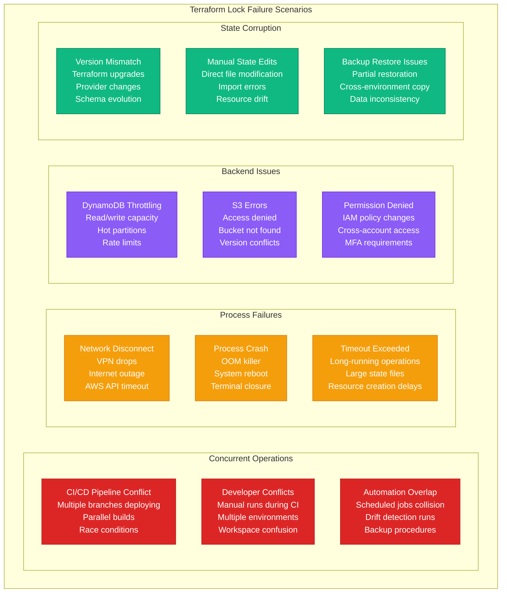
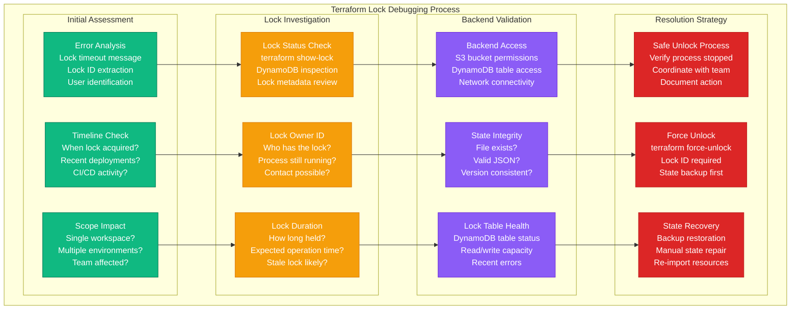

# Terraform State Lock Debugging

## Overview

Terraform state locks protect against concurrent modifications but can become the source of critical deployment failures. Lock conflicts, stale locks, and corrupted state files cause 25% of Infrastructure-as-Code incidents. This guide provides systematic troubleshooting for when deployments are blocked by state locking issues.

## Terraform State Lock Flow

```mermaid
graph TB
    subgraph TerraformStateLock[Terraform State Lock Flow]
        subgraph LockAcquisition[Lock Acquisition Process]
            PLAN_INIT[terraform plan/apply<br/>Lock acquisition request<br/>LockID generation<br/>User identification]
            BACKEND_CHECK[Backend Lock Check<br/>S3 DynamoDB check<br/>Lock table query<br/>Existing lock validation]
            LOCK_CREATE[Lock Creation<br/>DynamoDB PutItem<br/>Conditional write<br/>Lock metadata]
        end

        subgraph LockValidation[Lock Validation]
            LOCK_INFO[Lock Information<br/>Lock ID: uuid<br/>Who: user@company.com<br/>When: timestamp<br/>Path: workspace/env]
            TIMEOUT_CHECK[Timeout Check<br/>Max wait: 10 minutes<br/>Retry interval: 5s<br/>Exponential backoff]
            FORCE_UNLOCK[Force Unlock Option<br/>Manual intervention<br/>Lock ID required<br/>State validation]
        end

        subgraph StateOperations[State Operations]
            STATE_READ[State File Read<br/>Backend download<br/>Version check<br/>Integrity validation]
            STATE_MODIFY[State Modification<br/>Resource changes<br/>Version increment<br/>Checksum update]
            STATE_WRITE[State File Write<br/>Backend upload<br/>Atomic operation<br/>Lock release]
        end

        subgraph ErrorHandling[Error Scenarios]
            LOCK_TIMEOUT[Lock Timeout<br/>Another user active<br/>CI/CD conflict<br/>Network partition]
            STALE_LOCK[Stale Lock<br/>Process crashed<br/>Network disconnect<br/>Force unlock needed]
            CORRUPTED_STATE[Corrupted State<br/>Version mismatch<br/>Invalid JSON<br/>Recovery required]
        end
    end

    PLAN_INIT --> BACKEND_CHECK
    BACKEND_CHECK --> LOCK_CREATE
    LOCK_CREATE --> LOCK_INFO

    LOCK_INFO --> TIMEOUT_CHECK
    TIMEOUT_CHECK --> FORCE_UNLOCK
    FORCE_UNLOCK --> STATE_READ

    STATE_READ --> STATE_MODIFY
    STATE_MODIFY --> STATE_WRITE

    STATE_WRITE --> LOCK_TIMEOUT
    LOCK_TIMEOUT --> STALE_LOCK
    STALE_LOCK --> CORRUPTED_STATE

    classDef acquisitionStyle fill:#10B981,stroke:#047857,color:#fff
    classDef validationStyle fill:#F59E0B,stroke:#D97706,color:#fff
    classDef operationStyle fill:#8B5CF6,stroke:#6D28D9,color:#fff
    classDef errorStyle fill:#DC2626,stroke:#B91C1C,color:#fff

    class PLAN_INIT,BACKEND_CHECK,LOCK_CREATE acquisitionStyle
    class LOCK_INFO,TIMEOUT_CHECK,FORCE_UNLOCK validationStyle
    class STATE_READ,STATE_MODIFY,STATE_WRITE operationStyle
    class LOCK_TIMEOUT,STALE_LOCK,CORRUPTED_STATE errorStyle
```



## Common Lock Failure Scenarios



## Systematic Debugging Process



## 3 AM Debugging Commands

### Immediate Lock Status Check
```bash
# Check current lock status
terraform show -json | jq '.values.root_module.resources[] | select(.type == "terraform_remote_state")'

# For S3 + DynamoDB backend
aws dynamodb get-item \
  --table-name terraform-state-lock-dynamo \
  --key '{"LockID":{"S":"workspace-name"}}' \
  --region us-east-1

# Check lock info from error message
terraform plan 2>&1 | grep -E "Lock Info|ID|Who|Created"

# Alternative: direct state inspection
terraform state list
terraform state show <resource_name>
```

### Backend Connectivity Test
```bash
# Test S3 access
aws s3 ls s3://terraform-state-bucket/path/to/state/

# Test DynamoDB access
aws dynamodb describe-table --table-name terraform-state-lock-dynamo

# Check AWS credentials
aws sts get-caller-identity

# Test specific state file
aws s3 cp s3://terraform-state-bucket/env/terraform.tfstate /tmp/test.tfstate
```

### Lock Table Investigation
```bash
# List all locks in DynamoDB
aws dynamodb scan \
  --table-name terraform-state-lock-dynamo \
  --projection-expression "LockID,Info" \
  --region us-east-1

# Get specific lock details
aws dynamodb get-item \
  --table-name terraform-state-lock-dynamo \
  --key '{"LockID":{"S":"production-infrastructure"}}' \
  --region us-east-1 | jq '.Item.Info.S' | jq .

# Check DynamoDB metrics
aws cloudwatch get-metric-statistics \
  --namespace AWS/DynamoDB \
  --metric-name ConsumedReadCapacityUnits \
  --dimensions Name=TableName,Value=terraform-state-lock-dynamo \
  --start-time 2024-01-01T00:00:00Z \
  --end-time 2024-01-01T01:00:00Z \
  --period 300 \
  --statistics Sum
```

### State File Validation
```bash
# Download and validate state file
aws s3 cp s3://terraform-state-bucket/production/terraform.tfstate /tmp/state.json

# Check state file validity
python -m json.tool /tmp/state.json > /dev/null && echo "Valid JSON" || echo "Invalid JSON"

# Check Terraform version compatibility
jq '.terraform_version' /tmp/state.json

# Verify state file size
ls -lh /tmp/state.json

# Check for common corruption signs
grep -c '"resources":' /tmp/state.json
grep -c '"instances":' /tmp/state.json
```

## Issue Resolution Scenarios

### Scenario 1: Stale Lock from Crashed Process

**Symptoms:**
```
Error: Error locking state: Error acquiring the state lock: ConditionalCheckFailedException
Lock Info:
  ID:        01234567-89ab-cdef-0123-456789abcdef
  Path:      s3://bucket/production/terraform.tfstate
  Operation: OperationTypePlan
  Who:       user@company.com
  Version:   1.3.6
  Created:   2024-01-15 10:30:00.123456789 +0000 UTC
```

**Resolution Steps:**
```bash
# 1. Verify the process is actually dead
ps aux | grep terraform
pkill -f "terraform plan"

# 2. Contact the lock owner if possible
# Check Slack/Teams: "Hey @user, are you running terraform in production?"

# 3. Check lock duration
LOCK_TIME=$(aws dynamodb get-item \
  --table-name terraform-state-lock-dynamo \
  --key '{"LockID":{"S":"production-infrastructure"}}' \
  --query 'Item.Info.S' --output text | jq -r '.Created')
echo "Lock created at: $LOCK_TIME"

# 4. Safe force unlock (if confirmed stale)
terraform force-unlock 01234567-89ab-cdef-0123-456789abcdef

# 5. Verify unlock successful
terraform plan # Should work now
```

### Scenario 2: CI/CD Pipeline Conflict

**Symptoms:**
- Multiple build agents trying to deploy
- Terraform lock timeout in CI logs
- Deployments queuing up

**Resolution Steps:**
```bash
# 1. Check which pipelines are running
# GitLab CI example:
curl -H "Private-Token: $GITLAB_TOKEN" \
  "https://gitlab.com/api/v4/projects/$PROJECT_ID/pipelines?status=running"

# 2. Identify the lock holder
aws dynamodb get-item \
  --table-name terraform-state-lock-dynamo \
  --key '{"LockID":{"S":"production-infrastructure"}}' \
  --query 'Item.Info.S' --output text | jq '.Who'

# 3. Check pipeline logs for the running job
# Look for the job that's actually doing work vs. waiting

# 4. Cancel conflicting pipelines if safe
# Manual intervention in CI/CD system

# 5. Implement pipeline coordination
# Add mutex/semaphore to CI configuration
```

### Scenario 3: DynamoDB Throttling

**Symptoms:**
```
Error: Error locking state: RequestError: send request failed
caused by: Post https://dynamodb.us-east-1.amazonaws.com/:
ProvisionedThroughputExceededException: The level of configured
provisioned throughput for the table was exceeded.
```

**Resolution Steps:**
```bash
# 1. Check DynamoDB table capacity
aws dynamodb describe-table \
  --table-name terraform-state-lock-dynamo \
  --query 'Table.{ReadCapacity:ProvisionedThroughput.ReadCapacityUnits,WriteCapacity:ProvisionedThroughput.WriteCapacityUnits}'

# 2. Check current utilization
aws cloudwatch get-metric-statistics \
  --namespace AWS/DynamoDB \
  --metric-name ConsumedWriteCapacityUnits \
  --dimensions Name=TableName,Value=terraform-state-lock-dynamo \
  --start-time $(date -u -d '1 hour ago' +%Y-%m-%dT%H:%M:%S) \
  --end-time $(date -u +%Y-%m-%dT%H:%M:%S) \
  --period 300 \
  --statistics Maximum

# 3. Temporarily increase capacity
aws dynamodb update-table \
  --table-name terraform-state-lock-dynamo \
  --provisioned-throughput ReadCapacityUnits=10,WriteCapacityUnits=10

# 4. Wait for table update to complete
aws dynamodb wait table-exists --table-name terraform-state-lock-dynamo

# 5. Retry terraform operation
terraform plan

# 6. Reset capacity after operations complete
aws dynamodb update-table \
  --table-name terraform-state-lock-dynamo \
  --provisioned-throughput ReadCapacityUnits=5,WriteCapacityUnits=5
```

### Scenario 4: Corrupted State File

**Symptoms:**
```
Error: Error loading state: unexpected end of JSON input
Error: Failed to read state: 2 errors occurred:
	* Invalid JSON syntax
	* State version is newer than current Terraform
```

**Resolution Steps:**
```bash
# 1. Backup current state (even if corrupted)
aws s3 cp s3://terraform-state-bucket/production/terraform.tfstate \
  /tmp/corrupted-state-$(date +%Y%m%d-%H%M%S).json

# 2. Check for state backups
aws s3 ls s3://terraform-state-bucket/production/ | grep backup

# 3. Download most recent good backup
aws s3 cp s3://terraform-state-bucket/production/terraform.tfstate.backup \
  /tmp/backup-state.json

# 4. Validate backup state
python -m json.tool /tmp/backup-state.json > /dev/null

# 5. Restore from backup
aws s3 cp /tmp/backup-state.json \
  s3://terraform-state-bucket/production/terraform.tfstate

# 6. Force unlock if needed
terraform force-unlock <lock-id>

# 7. Verify state and plan
terraform state list
terraform plan
```

## Prevention and Monitoring

### Automated Lock Monitoring
```bash
#!/bin/bash
# lock-monitor.sh - Monitor for stale Terraform locks

LOCK_TABLE="terraform-state-lock-dynamo"
ALERT_THRESHOLD=3600  # 1 hour in seconds
SLACK_WEBHOOK="https://hooks.slack.com/services/..."

check_stale_locks() {
    local current_time=$(date +%s)

    # Get all locks
    local locks=$(aws dynamodb scan \
        --table-name "$LOCK_TABLE" \
        --projection-expression "LockID,Info" \
        --output json)

    echo "$locks" | jq -r '.Items[] | @base64' | while read -r item; do
        local lock_info=$(echo "$item" | base64 -d | jq -r '.Info.S')
        local lock_id=$(echo "$item" | base64 -d | jq -r '.LockID.S')
        local created_time=$(echo "$lock_info" | jq -r '.Created')
        local who=$(echo "$lock_info" | jq -r '.Who')
        local operation=$(echo "$lock_info" | jq -r '.Operation')

        # Convert created time to epoch
        local created_epoch=$(date -d "$created_time" +%s)
        local age=$((current_time - created_epoch))

        if [ $age -gt $ALERT_THRESHOLD ]; then
            alert_stale_lock "$lock_id" "$who" "$operation" "$age"
        fi
    done
}

alert_stale_lock() {
    local lock_id=$1
    local who=$2
    local operation=$3
    local age=$4
    local age_hours=$((age / 3600))

    local message="🚨 Stale Terraform Lock Detected!
Lock ID: $lock_id
Owner: $who
Operation: $operation
Age: ${age_hours} hours
Action Required: Investigate and potentially force-unlock"

    curl -X POST -H 'Content-type: application/json' \
        --data "{\"text\":\"$message\"}" \
        "$SLACK_WEBHOOK"
}

# Run check
check_stale_locks
```

### CI/CD Pipeline Safety
```yaml
# .gitlab-ci.yml example with lock safety
terraform-plan:
  stage: plan
  script:
    - terraform init
    - timeout 600 terraform plan -lock-timeout=10m -out=plan.out
  retry:
    max: 2
    when:
      - runner_system_failure
      - scheduler_failure
  after_script:
    - |
      if [ $CI_JOB_STATUS != "success" ]; then
        echo "Job failed, checking for locks to clean up"
        LOCK_ID=$(terraform plan 2>&1 | grep -oP 'ID:\s+\K[a-f0-9-]+' | head -1)
        if [ ! -z "$LOCK_ID" ]; then
          echo "Found lock ID: $LOCK_ID"
          # Don't auto force-unlock in CI - requires manual intervention
          echo "Manual force-unlock required: terraform force-unlock $LOCK_ID"
        fi
      fi

terraform-apply:
  stage: apply
  dependencies:
    - terraform-plan
  script:
    - terraform init
    - timeout 1800 terraform apply -lock-timeout=5m plan.out
  when: manual
  only:
    - main
```

### State File Health Monitoring
```python
#!/usr/bin/env python3
# state-health-check.py

import json
import boto3
import sys
from datetime import datetime, timezone

def check_state_health(bucket, key):
    s3 = boto3.client('s3')

    try:
        # Download state file
        response = s3.get_object(Bucket=bucket, Key=key)
        state_content = response['Body'].read().decode('utf-8')

        # Parse JSON
        state_data = json.loads(state_content)

        # Health checks
        checks = {
            'valid_json': True,
            'has_version': 'version' in state_data,
            'has_terraform_version': 'terraform_version' in state_data,
            'has_resources': 'resources' in state_data and len(state_data['resources']) > 0,
            'file_size_mb': len(state_content) / 1024 / 1024
        }

        # Version compatibility check
        terraform_version = state_data.get('terraform_version', 'unknown')

        print(f"State File Health Report for s3://{bucket}/{key}")
        print(f"File Size: {checks['file_size_mb']:.2f} MB")
        print(f"Terraform Version: {terraform_version}")
        print(f"Resource Count: {len(state_data.get('resources', []))}")
        print(f"Last Modified: {response['LastModified']}")

        # Warnings
        if checks['file_size_mb'] > 50:
            print("⚠️  WARNING: State file is large (>50MB)")

        if not checks['has_resources']:
            print("❌ ERROR: No resources found in state")

        return all([checks['valid_json'], checks['has_version'],
                   checks['has_terraform_version'], checks['has_resources']])

    except json.JSONDecodeError as e:
        print(f"❌ ERROR: Invalid JSON in state file: {e}")
        return False
    except Exception as e:
        print(f"❌ ERROR: {e}")
        return False

if __name__ == "__main__":
    if len(sys.argv) != 3:
        print("Usage: python state-health-check.py <bucket> <key>")
        sys.exit(1)

    bucket = sys.argv[1]
    key = sys.argv[2]

    healthy = check_state_health(bucket, key)
    sys.exit(0 if healthy else 1)
```

## Best Practices for Lock Management

### 1. Timeout Configuration
```hcl
# terraform configuration
terraform {
  backend "s3" {
    bucket         = "terraform-state-bucket"
    key            = "production/terraform.tfstate"
    region         = "us-east-1"
    dynamodb_table = "terraform-state-lock-dynamo"
    encrypt        = true

    # Lock configuration
    skip_region_validation      = false
    skip_credentials_validation = false
    skip_metadata_api_check     = false
  }
}
```

### 2. CI/CD Coordination
```bash
# Use proper lock timeouts in CI
terraform plan -lock-timeout=10m
terraform apply -lock-timeout=5m

# Add mutex for concurrent protection
flock -n /tmp/terraform.lock terraform apply || exit 1
```

### 3. Monitoring Setup
- Monitor DynamoDB lock table metrics
- Alert on locks older than 1 hour
- Track state file size growth
- Monitor backend access errors

### 4. Team Coordination
- Slack/Teams notifications for long operations
- Shared calendar for maintenance windows
- Clear escalation procedures for stuck locks
- Documentation of force-unlock procedures

## Quick Reference Commands

```bash
# Lock status and investigation
terraform show -json | jq '.lock'
aws dynamodb scan --table-name terraform-state-lock-dynamo

# Force unlock (use with caution)
terraform force-unlock <lock-id>

# Backend connectivity test
aws s3 ls s3://terraform-state-bucket/
aws dynamodb describe-table --table-name terraform-state-lock-dynamo

# State file validation
python -m json.tool terraform.tfstate

# Emergency state backup
aws s3 cp s3://bucket/terraform.tfstate ./emergency-backup-$(date +%Y%m%d-%H%M%S).tfstate
```

*This guide should be kept accessible during incidents. Always backup state before force-unlocking.*