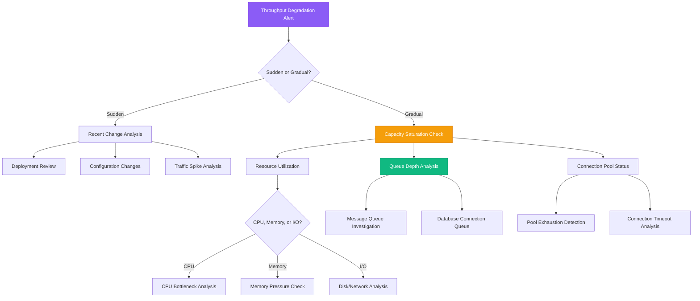

# Throughput Degradation Guide

## Overview

Throughput degradation in distributed systems manifests as reduced requests per second, longer queue times, and decreased system capacity. This guide provides systematic approaches used by teams at Amazon, Google, and Microsoft to identify and resolve throughput bottlenecks in production systems.

**Time to Resolution**: 20-45 minutes for connection pool issues, 1-4 hours for complex architectural bottlenecks

## Decision Tree



## Immediate Triage Commands (First 5 Minutes)

### 1. System Throughput Overview
```bash
# Network throughput
iftop -t -s 60  # if available
netstat -i | awk 'NR>2 {rx+=$4; tx+=$8} END {print "RX:", rx/1024/1024, "MB TX:", tx/1024/1024, "MB"}'

# System load and queue lengths
uptime
cat /proc/loadavg

# Active connections
netstat -an | grep ESTABLISHED | wc -l
ss -s  # socket statistics summary
```

### 2. Application Server Status
```bash
# HTTP server connections (nginx example)
curl -s http://localhost/nginx_status 2>/dev/null | grep -E "(Active|accepts|handled|requests)"

# Application metrics (if Prometheus endpoint available)
curl -s http://localhost:9090/metrics | grep -E "(http_requests_total|http_request_duration)"

# Process-specific network connections
lsof -i -p $(pgrep -f your-app-name) | wc -l
```

### 3. Database Connection Analysis
```bash
# PostgreSQL connection count
psql -c "SELECT count(*) as total_connections, state FROM pg_stat_activity GROUP BY state;"

# MySQL connection status
mysql -e "SHOW STATUS LIKE 'Threads_connected'; SHOW STATUS LIKE 'Max_used_connections';"

# Redis connection info
redis-cli info clients | grep -E "(connected_clients|blocked_clients|client_longest_output_list)"
```

## Bottleneck Identification Techniques

### 1. Little's Law Analysis
```python
# Calculate theoretical throughput using Little's Law
# Throughput = Concurrency / Average Response Time

import time
import requests
from concurrent.futures import ThreadPoolExecutor, as_completed
from statistics import mean

def measure_throughput(url, concurrent_requests=10, duration=60):
    """Measure actual throughput and identify bottlenecks"""
    start_time = time.time()
    response_times = []
    successful_requests = 0
    failed_requests = 0

    def make_request():
        try:
            start = time.time()
            response = requests.get(url, timeout=30)
            end = time.time()
            return {
                'response_time': end - start,
                'status_code': response.status_code,
                'success': response.status_code < 400
            }
        except Exception as e:
            return {
                'response_time': None,
                'error': str(e),
                'success': False
            }

    with ThreadPoolExecutor(max_workers=concurrent_requests) as executor:
        futures = []

        while time.time() - start_time < duration:
            future = executor.submit(make_request)
            futures.append(future)
            time.sleep(0.1)  # Spread out requests

        # Collect results
        for future in as_completed(futures):
            result = future.result()
            if result['success']:
                successful_requests += 1
                response_times.append(result['response_time'])
            else:
                failed_requests += 1

    # Calculate metrics
    actual_duration = time.time() - start_time
    throughput = successful_requests / actual_duration
    avg_response_time = mean(response_times) if response_times else 0
    theoretical_throughput = concurrent_requests / avg_response_time if avg_response_time > 0 else 0

    print(f"Actual Throughput: {throughput:.2f} requests/second")
    print(f"Theoretical Throughput: {theoretical_throughput:.2f} requests/second")
    print(f"Average Response Time: {avg_response_time:.3f} seconds")
    print(f"Success Rate: {successful_requests / (successful_requests + failed_requests) * 100:.1f}%")

    return {
        'throughput': throughput,
        'response_time': avg_response_time,
        'success_rate': successful_requests / (successful_requests + failed_requests)
    }

# Usage
results = measure_throughput('http://api.example.com/health', concurrent_requests=20, duration=60)
```

### 2. Queue Depth Analysis
```bash
# Message queue depth analysis (RabbitMQ example)
rabbitmqctl list_queues name messages consumers | sort -k2 -nr | head -10

# Kafka consumer lag
kafka-consumer-groups.sh --bootstrap-server localhost:9092 --group your-consumer-group --describe

# SQS queue depth (AWS)
aws sqs get-queue-attributes --queue-url https://sqs.region.amazonaws.com/account/queue-name --attribute-names All | jq '.Attributes.ApproximateNumberOfMessages'

# Custom application queue monitoring
curl -s http://localhost:8080/metrics | grep queue_depth | sort -k2 -nr
```

### 3. Connection Pool Exhaustion Detection
```bash
# HikariCP (Java) connection pool metrics
curl -s http://localhost:8080/actuator/metrics/hikaricp.connections.active
curl -s http://localhost:8080/actuator/metrics/hikaricp.connections.idle
curl -s http://localhost:8080/actuator/metrics/hikaricp.connections.pending

# PostgreSQL connection pool analysis (pgbouncer)
psql -h pgbouncer-host -p 6432 -d pgbouncer -c "SHOW POOLS;"
psql -h pgbouncer-host -p 6432 -d pgbouncer -c "SHOW CLIENTS;"

# Redis connection pool (if using redis-py with connection pool)
redis-cli info clients
```

## Platform-Specific Throughput Analysis

### AWS

#### Application Load Balancer Throughput
```bash
# ALB request count and latency
aws cloudwatch get-metric-statistics \
  --namespace AWS/ApplicationELB \
  --metric-name RequestCount \
  --dimensions Name=LoadBalancer,Value=app/my-loadbalancer/1234567890123456 \
  --start-time $(date -u -d '1 hour ago' +%Y-%m-%dT%H:%M:%S) \
  --end-time $(date -u +%Y-%m-%dT%H:%M:%S) \
  --period 300 \
  --statistics Sum

# Target group health
aws elbv2 describe-target-health --target-group-arn arn:aws:elasticloadbalancing:region:account:targetgroup/name/id
```

#### RDS Performance Analysis
```bash
# RDS connection count
aws rds describe-db-instances --db-instance-identifier mydb | jq '.DBInstances[0].DbInstanceStatus'

# Performance Insights metrics
aws pi get-resource-metrics \
  --service-type RDS \
  --identifier db-ABCDEFGHIJKLMNOP \
  --metric-queries file://metric-queries.json \
  --start-time $(date -u -d '1 hour ago' +%Y-%m-%dT%H:%M:%S) \
  --end-time $(date -u +%Y-%m-%dT%H:%M:%S)
```

### GCP

#### Google Kubernetes Engine Analysis
```bash
# Pod throughput metrics
kubectl top pods --sort-by=cpu --all-namespaces
kubectl get pods -o wide | grep -v Completed | grep -v Succeeded

# HPA (Horizontal Pod Autoscaler) analysis
kubectl describe hpa my-app-hpa
kubectl get hpa --all-namespaces -o wide
```

#### Cloud SQL Connection Analysis
```bash
# Cloud SQL metrics
gcloud monitoring metrics list --filter="resource.type=cloudsql_database"

# Connection count monitoring
gcloud sql operations list --instance=my-instance --limit=10
```

### Azure

#### Application Gateway Throughput
```bash
# Application Gateway metrics
az monitor metrics list \
  --resource "/subscriptions/SUB_ID/resourceGroups/RG_NAME/providers/Microsoft.Network/applicationGateways/AG_NAME" \
  --metric "Throughput" \
  --start-time $(date -u -d '1 hour ago' +%Y-%m-%dT%H:%M:%S.%3NZ)

# Backend pool health
az network application-gateway show-backend-health \
  --resource-group myResourceGroup \
  --name myAppGateway
```

## Production Case Studies

### Case Study 1: Amazon Prime - Video Streaming Bottleneck

**Problem**: Video streaming throughput dropped from 50k RPS to 12k RPS during peak hours

**Investigation Process**:
1. **Load balancer analysis** showed healthy targets but high latency
2. **Connection pool monitoring** revealed pool exhaustion at database layer
3. **Query analysis** found long-running metadata queries blocking connections

**Commands Used**:
```bash
# ALB throughput analysis
aws cloudwatch get-metric-statistics \
  --namespace AWS/ApplicationELB \
  --metric-name RequestCount \
  --statistics Sum --period 300

# Database connection analysis
psql -c "SELECT state, count(*) FROM pg_stat_activity GROUP BY state;"
psql -c "SELECT query, state, query_start FROM pg_stat_activity WHERE state = 'active' ORDER BY query_start;"

# Connection pool metrics
curl http://api-server:8080/actuator/metrics/hikaricp.connections | jq '.'
```

**Resolution**: Increased connection pool size, added read replicas, optimized slow queries
**Time to Resolution**: 2.5 hours

### Case Study 2: Spotify - Music Recommendation Throughput Drop

**Problem**: Recommendation API throughput fell by 40% after microservice deployment

**Root Cause**: New service introduced synchronous calls to machine learning service, creating cascading bottleneck

**Investigation Commands**:
```bash
# Service mesh traffic analysis (Istio)
kubectl get destinationrules -n production
istioctl proxy-status
istioctl proxy-config cluster recommendation-service-pod.production

# Circuit breaker status
curl http://recommendation-service:8080/actuator/circuitbreakers

# ML service queue depth
curl http://ml-service:8080/metrics | grep queue_size
```

**Key Findings**:
- ML service response time: 2.5s (was 100ms for cached responses)
- Connection pool utilization: 100%
- Circuit breaker activation: 23% of requests

**Resolution**: Implemented async processing with circuit breakers and caching
**Time to Resolution**: 4 hours

### Case Study 3: Uber - Ride Matching Throughput Degradation

**Problem**: Ride matching requests processed dropped from 15k/min to 4k/min during surge pricing

**Root Cause**: Redis connection pool exhaustion due to increased cache lookups during surge events

**Investigation Process**:
```bash
# Redis connection monitoring
redis-cli info clients | grep connected_clients
redis-cli info stats | grep -E "(total_connections_received|rejected_connections)"

# Application connection pool
curl http://matching-service:8080/metrics | grep redis_pool

# Queue depth analysis
redis-cli llen ride_matching_queue
redis-cli llen driver_location_updates
```

**Resolution**: Increased Redis connection pool, implemented connection multiplexing, added Redis cluster
**Time to Resolution**: 3 hours

## Advanced Throughput Optimization Techniques

### 1. Connection Pool Tuning
```java
// HikariCP optimal configuration for high throughput
HikariConfig config = new HikariConfig();
config.setMaximumPoolSize(100);  // Based on database capacity
config.setMinimumIdle(10);       // Maintain minimum connections
config.setConnectionTimeout(30000);  // 30 seconds
config.setIdleTimeout(600000);   // 10 minutes
config.setMaxLifetime(1800000);  // 30 minutes
config.setLeakDetectionThreshold(60000);  // 1 minute

// Connection pool monitoring
config.setMetricRegistry(metricRegistry);
config.setHealthCheckRegistry(healthCheckRegistry);
```

### 2. Rate Limiting Detection and Bypass
```python
# Rate limiting detection and adaptive throttling
import time
import requests
from collections import deque
from threading import Lock

class AdaptiveThroughputController:
    def __init__(self, initial_rate=100, max_rate=1000, min_rate=10):
        self.current_rate = initial_rate
        self.max_rate = max_rate
        self.min_rate = min_rate
        self.request_times = deque(maxlen=1000)
        self.error_times = deque(maxlen=100)
        self.lock = Lock()

    def should_make_request(self):
        with self.lock:
            now = time.time()
            # Remove old requests (older than 1 second)
            while self.request_times and now - self.request_times[0] > 1.0:
                self.request_times.popleft()

            # Check if we're under rate limit
            if len(self.request_times) < self.current_rate:
                self.request_times.append(now)
                return True
            return False

    def record_response(self, status_code, response_time):
        now = time.time()

        if status_code == 429 or status_code >= 500:  # Rate limited or server error
            with self.lock:
                self.error_times.append(now)
                # Reduce rate if too many errors
                recent_errors = [t for t in self.error_times if now - t < 60]
                if len(recent_errors) > 10:
                    self.current_rate = max(self.min_rate, self.current_rate * 0.8)
                    print(f"Reducing rate to {self.current_rate}")
        else:
            # Gradually increase rate if successful
            if response_time < 1.0 and self.current_rate < self.max_rate:
                self.current_rate = min(self.max_rate, self.current_rate * 1.05)

    def get_current_rate(self):
        return self.current_rate

# Usage
controller = AdaptiveThroughputController()

def make_controlled_request(url):
    if controller.should_make_request():
        start_time = time.time()
        try:
            response = requests.get(url, timeout=10)
            response_time = time.time() - start_time
            controller.record_response(response.status_code, response_time)
            return response
        except requests.exceptions.RequestException as e:
            controller.record_response(500, time.time() - start_time)
            raise e
    else:
        time.sleep(0.01)  # Brief pause if rate limited
        return None
```

### 3. Queue-Based Load Leveling
```go
// Go implementation of queue-based throughput control
package main

import (
    "context"
    "fmt"
    "log"
    "sync"
    "time"
)

type ThroughputController struct {
    requestQueue    chan Request
    workerCount     int
    maxQueueSize    int
    processedCount  int64
    droppedCount    int64
    mu             sync.RWMutex
}

type Request struct {
    ID        string
    Payload   interface{}
    Timestamp time.Time
    Response  chan Response
}

type Response struct {
    Result interface{}
    Error  error
}

func NewThroughputController(workerCount, maxQueueSize int) *ThroughputController {
    return &ThroughputController{
        requestQueue: make(chan Request, maxQueueSize),
        workerCount:  workerCount,
        maxQueueSize: maxQueueSize,
    }
}

func (tc *ThroughputController) Start(ctx context.Context) {
    for i := 0; i < tc.workerCount; i++ {
        go tc.worker(ctx, i)
    }

    // Metrics reporting goroutine
    go tc.reportMetrics(ctx)
}

func (tc *ThroughputController) worker(ctx context.Context, workerID int) {
    log.Printf("Worker %d started", workerID)
    for {
        select {
        case <-ctx.Done():
            return
        case req := <-tc.requestQueue:
            start := time.Now()

            // Process request (simulate work)
            result, err := tc.processRequest(req)

            processingTime := time.Since(start)
            log.Printf("Worker %d processed request %s in %v", workerID, req.ID, processingTime)

            // Send response back
            req.Response <- Response{Result: result, Error: err}

            tc.mu.Lock()
            tc.processedCount++
            tc.mu.Unlock()
        }
    }
}

func (tc *ThroughputController) processRequest(req Request) (interface{}, error) {
    // Simulate processing time
    time.Sleep(time.Millisecond * 100)
    return fmt.Sprintf("Processed: %s", req.ID), nil
}

func (tc *ThroughputController) SubmitRequest(req Request) (*Response, error) {
    select {
    case tc.requestQueue <- req:
        // Request queued successfully
        response := <-req.Response
        return &response, nil
    default:
        // Queue full, drop request
        tc.mu.Lock()
        tc.droppedCount++
        tc.mu.Unlock()
        return nil, fmt.Errorf("queue full, request dropped")
    }
}

func (tc *ThroughputController) reportMetrics(ctx context.Context) {
    ticker := time.NewTicker(time.Second * 10)
    defer ticker.Stop()

    for {
        select {
        case <-ctx.Done():
            return
        case <-ticker.C:
            tc.mu.RLock()
            processed := tc.processedCount
            dropped := tc.droppedCount
            queueDepth := len(tc.requestQueue)
            tc.mu.RUnlock()

            log.Printf("Metrics - Processed: %d, Dropped: %d, Queue Depth: %d/%d",
                processed, dropped, queueDepth, tc.maxQueueSize)
        }
    }
}
```

## Monitoring and Alerting Setup

### 1. Throughput Monitoring Dashboard
```yaml
# Prometheus alerting rules for throughput degradation
groups:
- name: throughput_alerts
  rules:
  - alert: ThroughputDegradation
    expr: rate(http_requests_total[5m]) < 0.8 * rate(http_requests_total[30m] offset 24h)
    for: 2m
    labels:
      severity: warning
    annotations:
      summary: "Throughput decreased by 20% compared to same time yesterday"

  - alert: ConnectionPoolExhaustion
    expr: hikaricp_connections_active / hikaricp_connections_max > 0.9
    for: 1m
    labels:
      severity: critical
    annotations:
      summary: "Connection pool usage above 90%"

  - alert: QueueDepthHigh
    expr: queue_depth > 1000
    for: 5m
    labels:
      severity: warning
    annotations:
      summary: "Queue depth above 1000 items"
```

### 2. Synthetic Throughput Testing
```python
# Automated throughput regression testing
import asyncio
import aiohttp
import time
from statistics import mean, median

class ThroughputRegressionTest:
    def __init__(self, base_url, expected_rps=100, acceptable_degradation=0.1):
        self.base_url = base_url
        self.expected_rps = expected_rps
        self.acceptable_degradation = acceptable_degradation

    async def run_throughput_test(self, duration=60, concurrent_requests=50):
        """Run throughput test and compare against baseline"""
        connector = aiohttp.TCPConnector(limit=concurrent_requests)

        async with aiohttp.ClientSession(connector=connector) as session:
            start_time = time.time()
            successful_requests = 0
            response_times = []

            async def make_request():
                nonlocal successful_requests
                try:
                    request_start = time.time()
                    async with session.get(self.base_url) as response:
                        if response.status < 400:
                            successful_requests += 1
                            response_times.append(time.time() - request_start)
                except Exception as e:
                    print(f"Request failed: {e}")

            # Generate load
            tasks = []
            while time.time() - start_time < duration:
                if len(tasks) < concurrent_requests:
                    task = asyncio.create_task(make_request())
                    tasks.append(task)

                # Clean up completed tasks
                tasks = [task for task in tasks if not task.done()]
                await asyncio.sleep(0.01)

            # Wait for remaining tasks
            await asyncio.gather(*tasks, return_exceptions=True)

            actual_duration = time.time() - start_time
            actual_rps = successful_requests / actual_duration

            print(f"Expected RPS: {self.expected_rps}")
            print(f"Actual RPS: {actual_rps:.2f}")
            print(f"Mean Response Time: {mean(response_times):.3f}s")
            print(f"Median Response Time: {median(response_times):.3f}s")

            degradation = (self.expected_rps - actual_rps) / self.expected_rps
            if degradation > self.acceptable_degradation:
                raise AssertionError(
                    f"Throughput regression detected: {degradation:.2%} degradation"
                )

            return {
                'actual_rps': actual_rps,
                'degradation': degradation,
                'mean_response_time': mean(response_times),
                'median_response_time': median(response_times)
            }

# Usage
async def main():
    test = ThroughputRegressionTest('http://api.example.com/health', expected_rps=200)
    results = await test.run_throughput_test(duration=30, concurrent_requests=20)
    print("Test results:", results)

# asyncio.run(main())
```

## 3 AM Debugging Checklist

When you're called at 3 AM for throughput degradation:

### First 2 Minutes
- [ ] Check current RPS vs historical baseline
- [ ] Verify system load and resource utilization
- [ ] Check for recent deployments or configuration changes
- [ ] Look at error rates and response time trends

### Minutes 2-5
- [ ] Examine connection pool utilization metrics
- [ ] Check queue depths for message systems
- [ ] Verify database connection counts
- [ ] Review load balancer health checks

### Minutes 5-15
- [ ] Analyze bottlenecks using Little's Law
- [ ] Check for rate limiting or throttling
- [ ] Examine resource contention (CPU, memory, I/O)
- [ ] Review circuit breaker states

### If Still Debugging After 15 Minutes
- [ ] Escalate to senior engineer or team lead
- [ ] Consider scaling up resources temporarily
- [ ] Implement emergency circuit breakers
- [ ] Document findings for detailed root cause analysis

## Throughput Metrics and SLOs

### Key Throughput Metrics to Track
- **Requests per second** (RPS) by service and endpoint
- **Connection pool utilization** percentage
- **Queue depth** and processing time
- **Response time percentiles** (p50, p95, p99)
- **Error rate** correlation with throughput

### Example SLO Configuration
```yaml
throughput_slos:
  - name: "API Throughput"
    description: "API maintains at least 95% of baseline throughput"
    metric: "rate(http_requests_total[5m])"
    target: 0.95  # 95% of baseline
    baseline_query: "rate(http_requests_total[5m] offset 24h)"
    window: "5m"

  - name: "Connection Pool Health"
    description: "Connection pool utilization stays below 85%"
    metric: "hikaricp_connections_active / hikaricp_connections_max"
    target: 0.85
    window: "5m"
```

**Remember**: Throughput degradation often indicates approaching system limits. While immediate fixes can restore performance, capacity planning and architectural improvements are essential for long-term stability and growth.

This guide represents proven strategies from teams processing millions of requests per second across global distributed systems.