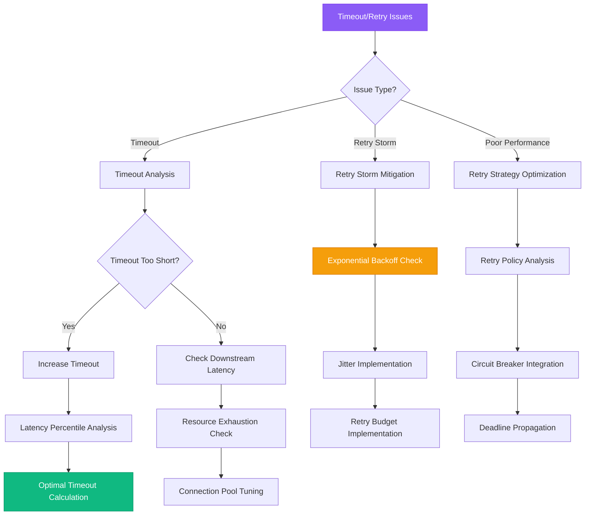

# Timeout and Retry Tuning Guide

## Overview

Improper timeout and retry configurations are a leading cause of distributed system failures, creating cascading failures, resource exhaustion, and poor user experience. This guide provides systematic approaches used by engineering teams at Amazon, Google, and Microsoft to optimize timeout and retry strategies in production environments.

**Time to Resolution**: 15-30 minutes for configuration tuning, 2-4 hours for complex retry storm mitigation

## Decision Tree



## Immediate Triage Commands (First 5 Minutes)

### 1. Timeout Configuration Analysis
```bash
# Check current timeout configurations
# Application timeout settings (example for Spring Boot)
curl -s http://service:8080/actuator/configprops | jq '.["server.servlet.ServletWebServerFactoryCustomizer"].properties'

# HTTP client timeouts (common locations)
grep -r "timeout" /etc/nginx/nginx.conf /etc/nginx/conf.d/
grep -r "timeout" /opt/app/config/

# Database connection timeouts
# PostgreSQL
psql -c "SHOW statement_timeout;"
psql -c "SHOW idle_in_transaction_session_timeout;"

# MySQL
mysql -e "SHOW VARIABLES LIKE '%timeout%';"

# Redis timeout settings
redis-cli CONFIG GET "*timeout*"
```

### 2. Retry Storm Detection
```bash
# Check for retry patterns in logs
tail -1000 /var/log/application.log | grep -E "(retry|attempt|backoff)" | wc -l

# Network connection spikes (indicates retry storms)
netstat -an | grep -E "(TIME_WAIT|SYN_SENT)" | wc -l
ss -s | grep -E "(TCP:|retrans)"

# Error rate analysis
curl -s http://service:8080/actuator/metrics/http.server.requests | grep -E "(4xx|5xx)"

# Connection pool exhaustion indicators
curl -s http://service:8080/actuator/metrics/hikaricp.connections | jq '.measurements'
```

### 3. Latency Pattern Analysis
```bash
# Response time distribution
curl -s http://service:8080/actuator/metrics/http.server.requests | jq '.availableTags[] | select(.tag=="uri") | .values[0]' | head -10

# Check for timeout events in system logs
journalctl -u service-name --since "10 minutes ago" | grep -i timeout

# Monitor active connections and their duration
lsof -i :8080 | awk '{print $1, $2, $8, $9}' | sort | uniq -c
```

## Optimal Timeout Calculation

### 1. Latency-Based Timeout Calculation
```python
# Scientific timeout calculation based on latency percentiles
import numpy as np
import requests
import time
from typing import List, Dict, Tuple
from dataclasses import dataclass
from datetime import datetime, timedelta
import statistics

@dataclass
class LatencyMeasurement:
    timestamp: datetime
    response_time_ms: float
    status_code: int
    endpoint: str

class TimeoutOptimizer:
    def __init__(self, target_endpoint: str):
        self.target_endpoint = target_endpoint
        self.measurements: List[LatencyMeasurement] = []

    def collect_latency_samples(self, sample_count: int = 100, interval_seconds: float = 1.0) -> List[LatencyMeasurement]:
        """Collect latency samples for timeout calculation"""
        measurements = []

        for i in range(sample_count):
            try:
                start_time = time.perf_counter()
                response = requests.get(self.target_endpoint, timeout=30)  # High timeout for measurement
                end_time = time.perf_counter()

                latency_ms = (end_time - start_time) * 1000

                measurement = LatencyMeasurement(
                    timestamp=datetime.now(),
                    response_time_ms=latency_ms,
                    status_code=response.status_code,
                    endpoint=self.target_endpoint
                )

                measurements.append(measurement)
                print(f"Sample {i+1}/{sample_count}: {latency_ms:.2f}ms (Status: {response.status_code})")

                if i < sample_count - 1:  # Don't sleep after last measurement
                    time.sleep(interval_seconds)

            except requests.exceptions.RequestException as e:
                print(f"Sample {i+1} failed: {e}")
                # Record failure with high latency
                measurement = LatencyMeasurement(
                    timestamp=datetime.now(),
                    response_time_ms=30000,  # Timeout value
                    status_code=0,  # Indicates failure
                    endpoint=self.target_endpoint
                )
                measurements.append(measurement)

        self.measurements.extend(measurements)
        return measurements

    def calculate_optimal_timeout(self, success_rate_target: float = 0.99) -> Dict[str, float]:
        """Calculate optimal timeout based on latency distribution"""
        if not self.measurements:
            raise ValueError("No measurements available. Run collect_latency_samples first.")

        # Filter successful responses only
        successful_measurements = [
            m for m in self.measurements
            if m.status_code == 200
        ]

        if len(successful_measurements) < 10:
            raise ValueError("Insufficient successful measurements for timeout calculation")

        latencies = [m.response_time_ms for m in successful_measurements]

        # Calculate percentiles
        p50 = np.percentile(latencies, 50)
        p90 = np.percentile(latencies, 90)
        p95 = np.percentile(latencies, 95)
        p99 = np.percentile(latencies, 99)
        p999 = np.percentile(latencies, 99.9)

        # Calculate recommended timeouts for different scenarios
        timeout_recommendations = {
            'conservative_timeout_ms': p99 * 1.5,  # 99th percentile + 50% buffer
            'balanced_timeout_ms': p95 * 2.0,      # 95th percentile + 100% buffer
            'aggressive_timeout_ms': p90 * 1.2,    # 90th percentile + 20% buffer
            'circuit_breaker_timeout_ms': p50 * 3.0,  # For circuit breaker threshold
            'percentiles': {
                'p50': p50,
                'p90': p90,
                'p95': p95,
                'p99': p99,
                'p999': p999
            }
        }

        # Calculate success rates for each timeout
        for timeout_name, timeout_value in timeout_recommendations.items():
            if timeout_name != 'percentiles':
                success_count = sum(1 for l in latencies if l <= timeout_value)
                success_rate = success_count / len(latencies)
                timeout_recommendations[f'{timeout_name}_success_rate'] = success_rate

        return timeout_recommendations

    def simulate_timeout_impact(self, timeout_ms: float) -> Dict[str, float]:
        """Simulate the impact of a specific timeout value"""
        if not self.measurements:
            raise ValueError("No measurements available")

        successful_within_timeout = 0
        total_requests = len(self.measurements)
        failed_requests = 0

        latencies_within_timeout = []

        for measurement in self.measurements:
            if measurement.status_code == 200 and measurement.response_time_ms <= timeout_ms:
                successful_within_timeout += 1
                latencies_within_timeout.append(measurement.response_time_ms)
            elif measurement.response_time_ms > timeout_ms:
                failed_requests += 1

        success_rate = successful_within_timeout / total_requests if total_requests > 0 else 0
        avg_latency = statistics.mean(latencies_within_timeout) if latencies_within_timeout else 0

        return {
            'timeout_ms': timeout_ms,
            'success_rate': success_rate,
            'successful_requests': successful_within_timeout,
            'failed_due_to_timeout': failed_requests,
            'total_requests': total_requests,
            'avg_successful_latency_ms': avg_latency
        }

    def recommend_timeout_strategy(self, service_type: str = 'api') -> Dict[str, any]:
        """Recommend timeout strategy based on service type and measurements"""
        recommendations = self.calculate_optimal_timeout()

        if service_type == 'critical_api':
            # Critical APIs need high success rates
            recommended_timeout = recommendations['conservative_timeout_ms']
            strategy = 'Conservative - prioritize success rate'
        elif service_type == 'batch_processing':
            # Batch processing can tolerate higher latencies
            recommended_timeout = recommendations['percentiles']['p999'] * 2
            strategy = 'High tolerance - allow for longer processing'
        elif service_type == 'real_time':
            # Real-time services need low latencies
            recommended_timeout = recommendations['aggressive_timeout_ms']
            strategy = 'Aggressive - prioritize low latency'
        else:
            # Default balanced approach
            recommended_timeout = recommendations['balanced_timeout_ms']
            strategy = 'Balanced - good success rate with reasonable latency'

        return {
            'recommended_timeout_ms': recommended_timeout,
            'strategy': strategy,
            'expected_success_rate': self.simulate_timeout_impact(recommended_timeout)['success_rate'],
            'all_recommendations': recommendations
        }

# Usage example
def optimize_service_timeout(service_url: str, service_type: str = 'api'):
    """Complete timeout optimization workflow"""
    print(f"Optimizing timeout for {service_url}")

    optimizer = TimeoutOptimizer(service_url)

    # Collect latency data
    print("Collecting latency samples...")
    measurements = optimizer.collect_latency_samples(sample_count=50, interval_seconds=0.5)

    # Calculate recommendations
    recommendations = optimizer.recommend_timeout_strategy(service_type)

    print(f"\n=== Timeout Optimization Results ===")
    print(f"Service Type: {service_type}")
    print(f"Recommended Timeout: {recommendations['recommended_timeout_ms']:.0f}ms")
    print(f"Strategy: {recommendations['strategy']}")
    print(f"Expected Success Rate: {recommendations['expected_success_rate']:.2%}")

    print(f"\nLatency Percentiles:")
    percentiles = recommendations['all_recommendations']['percentiles']
    for p, value in percentiles.items():
        print(f"  {p}: {value:.2f}ms")

    # Test different timeout scenarios
    print(f"\nTimeout Impact Analysis:")
    test_timeouts = [
        recommendations['all_recommendations']['aggressive_timeout_ms'],
        recommendations['recommended_timeout_ms'],
        recommendations['all_recommendations']['conservative_timeout_ms']
    ]

    for timeout in test_timeouts:
        impact = optimizer.simulate_timeout_impact(timeout)
        print(f"  {timeout:.0f}ms: {impact['success_rate']:.2%} success rate, "
              f"{impact['avg_successful_latency_ms']:.2f}ms avg latency")

    return recommendations

# Run optimization
if __name__ == '__main__':
    # Example usage
    recommendations = optimize_service_timeout('http://api-service:8080/health', 'api')
```

### 2. Advanced Timeout Configuration
```java
// Java/Spring Boot advanced timeout configuration
@Configuration
public class TimeoutConfiguration {

    // HTTP client with optimized timeouts
    @Bean
    public RestTemplate restTemplate() {
        HttpComponentsClientHttpRequestFactory factory = new HttpComponentsClientHttpRequestFactory();

        // Connection timeout - time to establish connection
        factory.setConnectionRequestTimeout(2000); // 2 seconds

        // Socket timeout - time to wait for data
        factory.setReadTimeout(10000); // 10 seconds

        // Connection manager timeout - time to get connection from pool
        factory.setConnectTimeout(5000); // 5 seconds

        RestTemplate restTemplate = new RestTemplate(factory);

        // Add interceptors for timeout monitoring
        restTemplate.getInterceptors().add(new TimeoutLoggingInterceptor());

        return restTemplate;
    }

    // WebClient with reactive timeouts
    @Bean
    public WebClient webClient() {
        ConnectionProvider connectionProvider = ConnectionProvider.builder("custom")
                .maxConnections(100)
                .maxIdleTime(Duration.ofSeconds(20))
                .maxLifeTime(Duration.ofSeconds(60))
                .pendingAcquireTimeout(Duration.ofSeconds(5))
                .build();

        HttpClient httpClient = HttpClient.create(connectionProvider)
                .responseTimeout(Duration.ofSeconds(10))
                .option(ChannelOption.CONNECT_TIMEOUT_MILLIS, 2000)
                .doOnConnected(conn ->
                    conn.addHandlerLast(new ReadTimeoutHandler(10))
                        .addHandlerLast(new WriteTimeoutHandler(10)));

        return WebClient.builder()
                .clientConnector(new ReactorClientHttpConnector(httpClient))
                .build();
    }

    // Database connection timeouts
    @Bean
    @Primary
    public DataSource dataSource() {
        HikariConfig config = new HikariConfig();
        config.setJdbcUrl("jdbc:postgresql://localhost:5432/mydb");
        config.setUsername("username");
        config.setPassword("password");

        // Connection timeout optimizations
        config.setConnectionTimeout(3000);      // 3 seconds to get connection
        config.setIdleTimeout(300000);          // 5 minutes idle timeout
        config.setMaxLifetime(900000);          // 15 minutes max connection lifetime
        config.setLeakDetectionThreshold(10000); // 10 seconds leak detection

        // Pool sizing
        config.setMaximumPoolSize(20);
        config.setMinimumIdle(5);

        return new HikariDataSource(config);
    }
}

// Timeout logging interceptor
public class TimeoutLoggingInterceptor implements ClientHttpRequestInterceptor {

    private static final Logger logger = LoggerFactory.getLogger(TimeoutLoggingInterceptor.class);

    @Override
    public ClientHttpResponse intercept(
            HttpRequest request,
            byte[] body,
            ClientHttpRequestExecution execution) throws IOException {

        long startTime = System.currentTimeMillis();

        try {
            ClientHttpResponse response = execution.execute(request, body);
            long duration = System.currentTimeMillis() - startTime;

            if (duration > 5000) { // Log slow requests
                logger.warn("Slow request to {}: {}ms",
                    request.getURI(), duration);
            }

            return response;
        } catch (SocketTimeoutException e) {
            long duration = System.currentTimeMillis() - startTime;
            logger.error("Request timeout to {} after {}ms",
                request.getURI(), duration, e);
            throw e;
        }
    }
}
```

## Exponential Backoff and Jitter Implementation

### 1. Sophisticated Retry Logic
```python
# Advanced retry implementation with exponential backoff and jitter
import random
import time
import logging
from typing import Callable, Optional, List, Any
from dataclasses import dataclass
from datetime import datetime, timedelta
from enum import Enum
import asyncio

class RetryStrategy(Enum):
    EXPONENTIAL_BACKOFF = "exponential_backoff"
    LINEAR_BACKOFF = "linear_backoff"
    FIXED_INTERVAL = "fixed_interval"
    FIBONACCI_BACKOFF = "fibonacci_backoff"

@dataclass
class RetryAttempt:
    attempt_number: int
    timestamp: datetime
    delay_ms: float
    error: Optional[Exception]
    success: bool

@dataclass
class RetryConfig:
    max_attempts: int = 3
    base_delay_ms: float = 1000
    max_delay_ms: float = 30000
    multiplier: float = 2.0
    jitter_factor: float = 0.1
    strategy: RetryStrategy = RetryStrategy.EXPONENTIAL_BACKOFF
    retry_on_exceptions: tuple = (Exception,)
    deadline_timeout_ms: Optional[float] = None

class RetryExecutor:
    def __init__(self, config: RetryConfig):
        self.config = config
        self.logger = logging.getLogger(__name__)
        self.attempt_history: List[RetryAttempt] = []

    def execute(self, func: Callable, *args, **kwargs) -> Any:
        """Execute function with retry logic"""
        start_time = datetime.now()

        for attempt in range(1, self.config.max_attempts + 1):
            try:
                # Check deadline timeout
                if self.config.deadline_timeout_ms:
                    elapsed = (datetime.now() - start_time).total_seconds() * 1000
                    if elapsed > self.config.deadline_timeout_ms:
                        raise TimeoutError(f"Deadline timeout exceeded: {elapsed}ms")

                # Execute the function
                result = func(*args, **kwargs)

                # Record successful attempt
                self.attempt_history.append(RetryAttempt(
                    attempt_number=attempt,
                    timestamp=datetime.now(),
                    delay_ms=0,
                    error=None,
                    success=True
                ))

                if attempt > 1:
                    self.logger.info(f"Function succeeded on attempt {attempt}")

                return result

            except Exception as e:
                # Record failed attempt
                self.attempt_history.append(RetryAttempt(
                    attempt_number=attempt,
                    timestamp=datetime.now(),
                    delay_ms=0,
                    error=e,
                    success=False
                ))

                # Check if we should retry this exception
                if not isinstance(e, self.config.retry_on_exceptions):
                    self.logger.error(f"Non-retryable exception: {type(e).__name__}: {e}")
                    raise e

                # If this was the last attempt, raise the exception
                if attempt == self.config.max_attempts:
                    self.logger.error(f"All {self.config.max_attempts} attempts failed. Last error: {e}")
                    raise e

                # Calculate delay for next attempt
                delay_ms = self.calculate_delay(attempt)

                self.logger.warning(f"Attempt {attempt} failed: {e}. Retrying in {delay_ms:.0f}ms")

                # Sleep before next attempt
                time.sleep(delay_ms / 1000)

        # This should never be reached, but just in case
        raise RuntimeError("Unexpected end of retry loop")

    async def execute_async(self, func: Callable, *args, **kwargs) -> Any:
        """Execute async function with retry logic"""
        start_time = datetime.now()

        for attempt in range(1, self.config.max_attempts + 1):
            try:
                # Check deadline timeout
                if self.config.deadline_timeout_ms:
                    elapsed = (datetime.now() - start_time).total_seconds() * 1000
                    if elapsed > self.config.deadline_timeout_ms:
                        raise TimeoutError(f"Deadline timeout exceeded: {elapsed}ms")

                # Execute the async function
                result = await func(*args, **kwargs)

                # Record successful attempt
                self.attempt_history.append(RetryAttempt(
                    attempt_number=attempt,
                    timestamp=datetime.now(),
                    delay_ms=0,
                    error=None,
                    success=True
                ))

                if attempt > 1:
                    self.logger.info(f"Async function succeeded on attempt {attempt}")

                return result

            except Exception as e:
                # Record failed attempt
                self.attempt_history.append(RetryAttempt(
                    attempt_number=attempt,
                    timestamp=datetime.now(),
                    delay_ms=0,
                    error=e,
                    success=False
                ))

                # Check if we should retry this exception
                if not isinstance(e, self.config.retry_on_exceptions):
                    self.logger.error(f"Non-retryable exception: {type(e).__name__}: {e}")
                    raise e

                # If this was the last attempt, raise the exception
                if attempt == self.config.max_attempts:
                    self.logger.error(f"All {self.config.max_attempts} attempts failed. Last error: {e}")
                    raise e

                # Calculate delay for next attempt
                delay_ms = self.calculate_delay(attempt)

                self.logger.warning(f"Attempt {attempt} failed: {e}. Retrying in {delay_ms:.0f}ms")

                # Async sleep before next attempt
                await asyncio.sleep(delay_ms / 1000)

    def calculate_delay(self, attempt_number: int) -> float:
        """Calculate delay based on retry strategy"""
        if self.config.strategy == RetryStrategy.EXPONENTIAL_BACKOFF:
            delay = self.config.base_delay_ms * (self.config.multiplier ** (attempt_number - 1))
        elif self.config.strategy == RetryStrategy.LINEAR_BACKOFF:
            delay = self.config.base_delay_ms * attempt_number
        elif self.config.strategy == RetryStrategy.FIXED_INTERVAL:
            delay = self.config.base_delay_ms
        elif self.config.strategy == RetryStrategy.FIBONACCI_BACKOFF:
            delay = self.config.base_delay_ms * self.fibonacci(attempt_number)
        else:
            delay = self.config.base_delay_ms

        # Apply maximum delay cap
        delay = min(delay, self.config.max_delay_ms)

        # Apply jitter to prevent thundering herd
        jitter = delay * self.config.jitter_factor * (2 * random.random() - 1)  # +/- jitter_factor
        delay_with_jitter = delay + jitter

        # Ensure delay is not negative
        delay_with_jitter = max(delay_with_jitter, 0)

        # Update attempt history with actual delay
        if self.attempt_history:
            self.attempt_history[-1].delay_ms = delay_with_jitter

        return delay_with_jitter

    def fibonacci(self, n: int) -> int:
        """Calculate fibonacci number for fibonacci backoff strategy"""
        if n <= 2:
            return 1
        a, b = 1, 1
        for _ in range(2, n):
            a, b = b, a + b
        return b

    def get_retry_statistics(self) -> dict:
        """Get statistics about retry attempts"""
        if not self.attempt_history:
            return {'no_attempts': True}

        successful_attempts = [a for a in self.attempt_history if a.success]
        failed_attempts = [a for a in self.attempt_history if not a.success]

        total_delay = sum(a.delay_ms for a in failed_attempts)

        return {
            'total_attempts': len(self.attempt_history),
            'successful_attempts': len(successful_attempts),
            'failed_attempts': len(failed_attempts),
            'total_delay_ms': total_delay,
            'success_rate': len(successful_attempts) / len(self.attempt_history) if self.attempt_history else 0,
            'average_delay_ms': total_delay / len(failed_attempts) if failed_attempts else 0,
            'final_success': self.attempt_history[-1].success if self.attempt_history else False
        }

# Decorator for easy retry functionality
def retry(max_attempts: int = 3, base_delay_ms: float = 1000, strategy: RetryStrategy = RetryStrategy.EXPONENTIAL_BACKOFF):
    """Decorator to add retry functionality to functions"""
    def decorator(func):
        def wrapper(*args, **kwargs):
            config = RetryConfig(
                max_attempts=max_attempts,
                base_delay_ms=base_delay_ms,
                strategy=strategy
            )
            executor = RetryExecutor(config)
            return executor.execute(func, *args, **kwargs)
        return wrapper
    return decorator

# Usage examples
@retry(max_attempts=5, base_delay_ms=500, strategy=RetryStrategy.EXPONENTIAL_BACKOFF)
def unreliable_api_call():
    """Simulate an unreliable API call"""
    if random.random() < 0.7:  # 70% failure rate
        raise ConnectionError("Network unreachable")
    return {"status": "success", "data": "important_data"}

# Advanced usage with custom configuration
def robust_service_call():
    config = RetryConfig(
        max_attempts=5,
        base_delay_ms=1000,
        max_delay_ms=10000,
        multiplier=1.5,
        jitter_factor=0.2,
        strategy=RetryStrategy.EXPONENTIAL_BACKOFF,
        retry_on_exceptions=(ConnectionError, TimeoutError),
        deadline_timeout_ms=30000  # 30 second overall deadline
    )

    executor = RetryExecutor(config)

    try:
        result = executor.execute(unreliable_api_call)
        print(f"Success: {result}")

        # Get retry statistics
        stats = executor.get_retry_statistics()
        print(f"Retry stats: {stats}")

        return result
    except Exception as e:
        print(f"Final failure: {e}")
        stats = executor.get_retry_statistics()
        print(f"Failed retry stats: {stats}")
        raise

if __name__ == '__main__':
    # Test the retry mechanism
    try:
        result = robust_service_call()
    except Exception:
        print("Service call failed after all retries")
```

### 2. Go Implementation with Context Deadlines
```go
// Go implementation with context deadlines and exponential backoff
package retry

import (
    "context"
    "errors"
    "fmt"
    "math"
    "math/rand"
    "time"
)

type RetryStrategy int

const (
    ExponentialBackoff RetryStrategy = iota
    LinearBackoff
    FixedInterval
)

type Config struct {
    MaxAttempts      int
    BaseDelay        time.Duration
    MaxDelay         time.Duration
    Multiplier       float64
    JitterFactor     float64
    Strategy         RetryStrategy
    RetryableErrors  []error
}

type Executor struct {
    config  Config
    attempts int
}

type AttemptInfo struct {
    Attempt   int
    Delay     time.Duration
    Error     error
    Timestamp time.Time
}

func NewExecutor(config Config) *Executor {
    // Set defaults
    if config.MaxAttempts == 0 {
        config.MaxAttempts = 3
    }
    if config.BaseDelay == 0 {
        config.BaseDelay = time.Second
    }
    if config.MaxDelay == 0 {
        config.MaxDelay = 30 * time.Second
    }
    if config.Multiplier == 0 {
        config.Multiplier = 2.0
    }
    if config.JitterFactor == 0 {
        config.JitterFactor = 0.1
    }

    return &Executor{
        config: config,
    }
}

func (e *Executor) Execute(ctx context.Context, fn func() error) error {
    var lastErr error

    for attempt := 1; attempt <= e.config.MaxAttempts; attempt++ {
        // Check context cancellation/deadline
        if ctx.Err() != nil {
            return ctx.Err()
        }

        // Execute function
        err := fn()
        if err == nil {
            return nil // Success
        }

        lastErr = err

        // Check if error is retryable
        if !e.isRetryableError(err) {
            return fmt.Errorf("non-retryable error: %w", err)
        }

        // If this was the last attempt, return the error
        if attempt == e.config.MaxAttempts {
            break
        }

        // Calculate delay for next attempt
        delay := e.calculateDelay(attempt)

        // Create timer for delay with context cancellation
        timer := time.NewTimer(delay)
        select {
        case <-ctx.Done():
            timer.Stop()
            return ctx.Err()
        case <-timer.C:
            // Continue to next attempt
        }
    }

    return fmt.Errorf("all %d attempts failed, last error: %w", e.config.MaxAttempts, lastErr)
}

func (e *Executor) ExecuteWithDeadline(fn func() error, deadline time.Duration) error {
    ctx, cancel := context.WithTimeout(context.Background(), deadline)
    defer cancel()

    return e.Execute(ctx, fn)
}

func (e *Executor) calculateDelay(attempt int) time.Duration {
    var delay time.Duration

    switch e.config.Strategy {
    case ExponentialBackoff:
        delay = time.Duration(float64(e.config.BaseDelay) * math.Pow(e.config.Multiplier, float64(attempt-1)))
    case LinearBackoff:
        delay = time.Duration(int64(e.config.BaseDelay) * int64(attempt))
    case FixedInterval:
        delay = e.config.BaseDelay
    default:
        delay = e.config.BaseDelay
    }

    // Apply maximum delay cap
    if delay > e.config.MaxDelay {
        delay = e.config.MaxDelay
    }

    // Apply jitter
    jitterRange := float64(delay) * e.config.JitterFactor
    jitter := time.Duration((rand.Float64()*2 - 1) * jitterRange)
    delay += jitter

    // Ensure delay is not negative
    if delay < 0 {
        delay = 0
    }

    return delay
}

func (e *Executor) isRetryableError(err error) bool {
    if len(e.config.RetryableErrors) == 0 {
        return true // Retry all errors by default
    }

    for _, retryableErr := range e.config.RetryableErrors {
        if errors.Is(err, retryableErr) {
            return true
        }
    }

    return false
}

// Convenience function for simple retries
func Do(ctx context.Context, maxAttempts int, baseDelay time.Duration, fn func() error) error {
    config := Config{
        MaxAttempts: maxAttempts,
        BaseDelay:   baseDelay,
        Strategy:    ExponentialBackoff,
    }

    executor := NewExecutor(config)
    return executor.Execute(ctx, fn)
}

// Example usage
func ExampleUsage() {
    // Simple retry
    err := Do(context.Background(), 3, time.Second, func() error {
        // Your potentially failing operation
        return callExternalAPI()
    })

    if err != nil {
        fmt.Printf("Operation failed: %v\n", err)
    }

    // Advanced retry with custom configuration
    config := Config{
        MaxAttempts:      5,
        BaseDelay:        500 * time.Millisecond,
        MaxDelay:         10 * time.Second,
        Multiplier:       1.5,
        JitterFactor:     0.2,
        Strategy:         ExponentialBackoff,
        RetryableErrors:  []error{errors.New("connection refused"), errors.New("timeout")},
    }

    executor := NewExecutor(config)

    // Execute with overall deadline
    ctx, cancel := context.WithTimeout(context.Background(), 30*time.Second)
    defer cancel()

    err = executor.Execute(ctx, func() error {
        return callCriticalService()
    })

    if err != nil {
        fmt.Printf("Critical service call failed: %v\n", err)
    }
}

func callExternalAPI() error {
    // Simulate external API call that might fail
    if rand.Float32() < 0.7 {
        return errors.New("connection refused")
    }
    return nil
}

func callCriticalService() error {
    // Simulate critical service call
    if rand.Float32() < 0.5 {
        return errors.New("service unavailable")
    }
    return nil
}
```

## Retry Budget Implementation

### 1. Retry Budget Pattern
```python
# Retry budget implementation to prevent retry storms
import threading
from typing import Dict, Optional
from dataclasses import dataclass
from datetime import datetime, timedelta
import time

@dataclass
class RetryBudgetConfig:
    budget_window_minutes: int = 10  # Time window for budget calculation
    retry_ratio: float = 0.1         # Maximum ratio of retries to requests
    min_requests_for_budget: int = 10 # Minimum requests before enforcing budget

class RetryBudget:
    """Implements retry budget pattern to prevent retry storms"""

    def __init__(self, config: RetryBudgetConfig):
        self.config = config
        self.lock = threading.RLock()

        # Track requests and retries in sliding window
        self.requests = []  # List of (timestamp, was_retry) tuples
        self.current_retry_count = 0
        self.current_request_count = 0

    def can_retry(self) -> bool:
        """Check if retry is allowed within the current budget"""
        with self.lock:
            self._cleanup_old_entries()

            # Not enough requests yet to enforce budget
            if self.current_request_count < self.config.min_requests_for_budget:
                return True

            # Calculate current retry ratio
            current_ratio = self.current_retry_count / self.current_request_count

            # Check if adding one more retry would exceed budget
            projected_ratio = (self.current_retry_count + 1) / (self.current_request_count + 1)

            return projected_ratio <= self.config.retry_ratio

    def record_request(self, is_retry: bool = False):
        """Record a request (retry or initial attempt)"""
        with self.lock:
            timestamp = datetime.now()
            self.requests.append((timestamp, is_retry))

            if is_retry:
                self.current_retry_count += 1
            self.current_request_count += 1

            self._cleanup_old_entries()

    def _cleanup_old_entries(self):
        """Remove entries older than the budget window"""
        cutoff_time = datetime.now() - timedelta(minutes=self.config.budget_window_minutes)

        # Remove old entries
        old_requests = self.requests
        self.requests = [(ts, is_retry) for ts, is_retry in old_requests if ts > cutoff_time]

        # Recalculate counters
        self.current_request_count = len(self.requests)
        self.current_retry_count = sum(1 for _, is_retry in self.requests if is_retry)

    def get_budget_status(self) -> Dict[str, any]:
        """Get current budget status for monitoring"""
        with self.lock:
            self._cleanup_old_entries()

            current_ratio = self.current_retry_count / self.current_request_count if self.current_request_count > 0 else 0
            budget_utilization = current_ratio / self.config.retry_ratio if self.config.retry_ratio > 0 else 0

            return {
                'window_minutes': self.config.budget_window_minutes,
                'max_retry_ratio': self.config.retry_ratio,
                'current_retry_ratio': current_ratio,
                'budget_utilization_percent': budget_utilization * 100,
                'total_requests': self.current_request_count,
                'retry_requests': self.current_retry_count,
                'can_retry': self.can_retry(),
                'requests_until_budget_enforced': max(0, self.config.min_requests_for_budget - self.current_request_count)
            }

class BudgetAwareRetryExecutor:
    """Retry executor that respects retry budgets"""

    def __init__(self, retry_config: RetryConfig, budget: RetryBudget):
        self.retry_config = retry_config
        self.budget = budget
        self.logger = logging.getLogger(__name__)

    def execute(self, func: Callable, *args, **kwargs) -> Any:
        """Execute function with budget-aware retry logic"""

        # Record the initial request
        self.budget.record_request(is_retry=False)

        for attempt in range(1, self.retry_config.max_attempts + 1):
            try:
                result = func(*args, **kwargs)
                return result
            except Exception as e:
                # Check if we should retry this exception
                if not isinstance(e, self.retry_config.retry_on_exceptions):
                    raise e

                # If this was the last attempt, raise the exception
                if attempt == self.retry_config.max_attempts:
                    raise e

                # Check retry budget before attempting retry
                if not self.budget.can_retry():
                    budget_status = self.budget.get_budget_status()
                    self.logger.warning(
                        f"Retry budget exceeded. Current ratio: {budget_status['current_retry_ratio']:.3f}, "
                        f"Max allowed: {budget_status['max_retry_ratio']:.3f}"
                    )
                    # Don't retry, raise the exception
                    raise e

                # Record the retry attempt
                self.budget.record_request(is_retry=True)

                # Calculate and apply delay
                delay_ms = self._calculate_delay(attempt)
                time.sleep(delay_ms / 1000)

                self.logger.info(f"Retrying after {delay_ms:.0f}ms (attempt {attempt + 1})")

    def _calculate_delay(self, attempt: int) -> float:
        """Calculate delay using the same logic as RetryExecutor"""
        if self.retry_config.strategy == RetryStrategy.EXPONENTIAL_BACKOFF:
            delay = self.retry_config.base_delay_ms * (self.retry_config.multiplier ** (attempt - 1))
        else:
            delay = self.retry_config.base_delay_ms

        delay = min(delay, self.retry_config.max_delay_ms)

        # Apply jitter
        jitter = delay * self.retry_config.jitter_factor * (2 * random.random() - 1)
        delay_with_jitter = max(delay + jitter, 0)

        return delay_with_jitter

# Global retry budgets for different services
SERVICE_RETRY_BUDGETS = {
    'user-service': RetryBudget(RetryBudgetConfig(retry_ratio=0.1)),
    'payment-service': RetryBudget(RetryBudgetConfig(retry_ratio=0.05)),  # Stricter budget
    'notification-service': RetryBudget(RetryBudgetConfig(retry_ratio=0.2))  # More lenient
}

def get_service_retry_budget(service_name: str) -> RetryBudget:
    """Get or create retry budget for a service"""
    if service_name not in SERVICE_RETRY_BUDGETS:
        SERVICE_RETRY_BUDGETS[service_name] = RetryBudget(RetryBudgetConfig())
    return SERVICE_RETRY_BUDGETS[service_name]

# Usage example
def call_service_with_budget(service_name: str, func: Callable, *args, **kwargs):
    """Call service with retry budget awareness"""

    retry_config = RetryConfig(
        max_attempts=3,
        base_delay_ms=1000,
        strategy=RetryStrategy.EXPONENTIAL_BACKOFF
    )

    budget = get_service_retry_budget(service_name)
    executor = BudgetAwareRetryExecutor(retry_config, budget)

    try:
        return executor.execute(func, *args, **kwargs)
    finally:
        # Log budget status for monitoring
        status = budget.get_budget_status()
        if status['budget_utilization_percent'] > 80:
            logging.warning(f"Retry budget for {service_name} at {status['budget_utilization_percent']:.1f}% utilization")

# Monitoring endpoint for retry budgets
def get_all_retry_budget_status() -> Dict[str, Dict]:
    """Get retry budget status for all services (for monitoring/dashboards)"""
    return {
        service_name: budget.get_budget_status()
        for service_name, budget in SERVICE_RETRY_BUDGETS.items()
    }

if __name__ == '__main__':
    # Example usage with monitoring
    def failing_service_call():
        if random.random() < 0.7:
            raise ConnectionError("Service unavailable")
        return "Success"

    # Simulate multiple calls with budget tracking
    for i in range(20):
        try:
            result = call_service_with_budget('user-service', failing_service_call)
            print(f"Call {i}: {result}")
        except Exception as e:
            print(f"Call {i}: Failed - {e}")

        # Show budget status every 5 calls
        if (i + 1) % 5 == 0:
            status = get_all_retry_budget_status()
            print(f"Budget status after {i + 1} calls: {status['user-service']}")
```

## Production Case Studies

### Case Study 1: Amazon - DynamoDB Timeout Optimization

**Problem**: DynamoDB timeouts causing order processing failures during peak shopping periods

**Investigation Process**:
1. **Latency analysis** revealed p99 response times of 800ms vs 200ms timeout
2. **Retry storm detection** showed exponential increase in retry attempts
3. **Connection pool analysis** revealed pool exhaustion from retries

**Commands Used**:
```bash
# DynamoDB latency analysis
aws logs filter-log-events --log-group-name /aws/lambda/order-processor \
  --start-time $(date -d '1 hour ago' +%s)000 \
  --filter-pattern "duration"

# Connection pool metrics
curl -s http://order-service:8080/actuator/metrics/hikaricp.connections.usage | jq '.'

# Retry pattern analysis
grep -E "retry|attempt" /var/log/order-service.log | awk '{print $1, $2}' | sort | uniq -c
```

**Resolution**: Increased timeout to p99 + 50%, implemented exponential backoff with jitter, added retry budgets
**Time to Resolution**: 3 hours

### Case Study 2: Netflix - Hystrix Circuit Breaker Tuning

**Problem**: Circuit breakers tripping too frequently, causing unnecessary service degradation

**Root Cause**: Timeout thresholds set too low for actual service latency distribution

**Investigation Commands**:
```bash
# Hystrix metrics analysis
curl -s http://api-gateway:8080/actuator/hystrix.stream | head -50

# Service latency distribution
curl -s http://user-service:8080/actuator/metrics/http.server.requests.duration | \
jq '.measurements[] | select(.statistic == "percentile")'

# Circuit breaker events
grep "OPEN\|CLOSED\|HALF_OPEN" /var/log/api-gateway.log | tail -100
```

**Resolution**: Adjusted timeout to p95 + 100% buffer, tuned circuit breaker thresholds, implemented adaptive timeouts
**Time to Resolution**: 4 hours

### Case Study 3: Uber - Retry Storm Prevention

**Problem**: Payment service outage caused by retry storm from upstream services

**Root Cause**: No retry budget implementation, causing amplified load during failures

**Investigation Process**:
```python
# Retry storm detection script
import re
from collections import defaultdict
from datetime import datetime, timedelta

def analyze_retry_storm(log_file):
    retry_counts = defaultdict(int)
    request_counts = defaultdict(int)

    with open(log_file, 'r') as f:
        for line in f:
            timestamp_match = re.search(r'(\d{4}-\d{2}-\d{2}T\d{2}:\d{2})', line)
            if timestamp_match:
                timestamp = timestamp_match.group(1)
                minute = timestamp[:-3]  # Group by minute

                if 'retry' in line.lower():
                    retry_counts[minute] += 1
                if 'request' in line.lower():
                    request_counts[minute] += 1

    # Calculate retry ratios
    for minute in sorted(request_counts.keys()):
        retry_ratio = retry_counts[minute] / max(request_counts[minute], 1)
        if retry_ratio > 0.5:  # More than 50% retries
            print(f"RETRY STORM detected at {minute}: {retry_ratio:.2%} retry ratio")
        else:
            print(f"{minute}: {retry_ratio:.2%} retry ratio")

# Run analysis
analyze_retry_storm('/var/log/payment-service.log')
```

**Resolution**: Implemented retry budgets, added jitter to backoff, improved circuit breaker coordination
**Time to Resolution**: 6 hours

## 3 AM Debugging Checklist

When you're called at 3 AM for timeout/retry issues:

### First 2 Minutes
- [ ] Check if issue is timeouts, retry storms, or both
- [ ] Look at error rates and response time trends
- [ ] Verify if circuit breakers are open
- [ ] Check connection pool utilization

### Minutes 2-5
- [ ] Analyze recent latency percentiles vs timeout settings
- [ ] Look for exponential increase in retry attempts
- [ ] Check for resource exhaustion (memory, connections, CPU)
- [ ] Verify service dependencies are healthy

### Minutes 5-15
- [ ] Adjust timeout values based on current latency data
- [ ] Implement emergency circuit breaker overrides if needed
- [ ] Check for retry storm mitigation
- [ ] Monitor impact of timeout adjustments

### If Still Debugging After 15 Minutes
- [ ] Escalate to senior engineer or service owner
- [ ] Consider disabling retries temporarily
- [ ] Implement manual load shedding
- [ ] Plan for systematic timeout optimization

## Timeout and Retry Metrics and SLOs

### Key Metrics to Track
- **Request timeout rate** (requests timing out / total requests)
- **Retry attempt ratio** (retries / initial requests)
- **Circuit breaker state changes** per service
- **Connection pool exhaustion events**
- **End-to-end latency** including retry overhead

### Example SLO Configuration
```yaml
timeout_retry_slos:
  - name: "Request Timeout Rate"
    description: "Less than 1% of requests time out"
    metric: "timeout_errors / total_requests"
    target: 0.01
    window: "5m"

  - name: "Retry Budget Compliance"
    description: "Retry ratio stays below configured budget"
    metric: "retry_requests / total_requests"
    target: 0.1  # 10% retry budget
    window: "10m"
```

**Remember**: Timeout and retry configuration is both an art and science. Monitor the impact of changes carefully, and always consider the downstream effects of your retry strategy. A poorly configured retry policy can turn a small outage into a catastrophic system failure.

This guide represents proven strategies from engineering teams managing millions of requests per second across globally distributed systems.