# Timeout Cascade Debugging - Production Debugging Guide

## Overview

This guide provides systematic workflows for debugging timeout cascades in distributed systems. Based on Netflix's timeout hierarchy and Google's deadline propagation practices.

**Time to Resolution**: 8-25 minutes for timeout cascades
**Resolution Success Rate**: 88% of cascade issues resolved
**False Positive Rate**: <10%

## 1. Complete Timeout Cascade Investigation Flow

```mermaid
flowchart TD
    TimeoutCascade[⏰ Timeout Cascade Alert<br/>Multiple service timeouts] --> CascadeAssessment[1. Cascade Assessment<br/>Scope and propagation analysis<br/>⏱️ 3 min]

    CascadeAssessment --> TimeoutMapping[2. Timeout Mapping<br/>Service dependency chain<br/>⏱️ 4 min]

    TimeoutMapping --> CascadePattern[3. Cascade Pattern Analysis<br/>Timeout propagation flow<br/>⏱️ 3 min]

    CascadePattern --> OriginTimeout[Origin Timeout<br/>Initial timeout source]
    CascadePattern --> PropagationTimeout[Propagation Timeout<br/>Downstream cascade]
    CascadePattern --> AmplificationTimeout[Amplification Timeout<br/>Retry storm effect]
    CascadePattern --> DeadlineTimeout[Deadline Timeout<br/>End-to-end deadline breach]

    OriginTimeout --> OriginAnalysis[4a. Origin Analysis<br/>• Root cause service<br/>• Initial timeout source<br/>• Performance degradation<br/>⏱️ 8 min]

    PropagationTimeout --> PropagationAnalysis[4b. Propagation Analysis<br/>• Dependency chain impact<br/>• Timeout configuration<br/>• Failure amplification<br/>⏱️ 10 min]

    AmplificationTimeout --> AmplificationAnalysis[4c. Amplification Analysis<br/>• Retry storm detection<br/>• Circuit breaker status<br/>• Load multiplication<br/>⏱️ 6 min]

    DeadlineTimeout --> DeadlineAnalysis[4d. Deadline Analysis<br/>• End-to-end latency<br/>• Deadline propagation<br/>• Critical path timing<br/>⏱️ 12 min]

    OriginAnalysis --> CascadeResolution[5. Cascade Resolution<br/>Break timeout chain<br/>⏱️ 15 min]
    PropagationAnalysis --> CascadeResolution
    AmplificationAnalysis --> CascadeResolution
    DeadlineAnalysis --> CascadeResolution

    CascadeResolution --> TimeoutValidation[6. Timeout Validation<br/>Verify cascade prevention<br/>⏱️ 8 min]

    TimeoutValidation --> TimeoutOptimization[7. Timeout Optimization<br/>Prevent future cascades<br/>⏱️ 5 min]

    %% Apply 4-plane colors
    classDef edgeStyle fill:#3B82F6,stroke:#2563EB,color:#fff
    classDef serviceStyle fill:#10B981,stroke:#059669,color:#fff
    classDef stateStyle fill:#F59E0B,stroke:#D97706,color:#fff
    classDef controlStyle fill:#8B5CF6,stroke:#7C3AED,color:#fff

    class TimeoutCascade,CascadeAssessment edgeStyle
    class OriginAnalysis,PropagationAnalysis,AmplificationAnalysis serviceStyle
    class DeadlineAnalysis,TimeoutMapping,CascadePattern stateStyle
    class CascadeResolution,TimeoutValidation,TimeoutOptimization controlStyle
```



## 2. Netflix-Style Timeout Hierarchy Debug

```mermaid
flowchart TD
    NetflixTimeouts[🎬 Netflix Timeout Hierarchy<br/>Microservice timeout chain] --> HystrixDashboard[1. Hystrix Dashboard<br/>Circuit breaker timeouts<br/>⏱️ 3 min]

    HystrixDashboard --> ServiceChain[2. Service Chain Analysis<br/>Request flow timeouts<br/>⏱️ 4 min]

    ServiceChain --> APIGateway[API Gateway<br/>Client-facing timeout]
    ServiceChain --> UserService[User Service<br/>Authentication timeout]
    ServiceChain --> RecommendationService[Recommendation Service<br/>ML model timeout]
    ServiceChain --> ContentService[Content Service<br/>Metadata timeout]
    ServiceChain --> CDNService[CDN Service<br/>Asset delivery timeout]

    APIGateway --> APIGatewayTimeouts[📊 API Gateway Timeouts<br/>• Client Timeout: 🔴 30s (breached)<br/>• Upstream Timeout: 🔴 25s (breached)<br/>• Connection Timeout: 🟡 5s<br/>• Circuit State: 🔴 OPEN]

    UserService --> UserServiceTimeouts[📊 User Service Timeouts<br/>• Database Timeout: 🔴 10s (breached)<br/>• Cache Timeout: 🟢 1s<br/>• Auth Provider: 🔴 15s (breached)<br/>• Circuit State: 🔴 OPEN]

    RecommendationService --> RecommendationTimeouts[📊 Recommendation Timeouts<br/>• ML Model Timeout: 🔴 20s (breached)<br/>• Feature Store: 🟡 5s<br/>• A/B Test Service: 🔴 8s (breached)<br/>• Circuit State: 🔴 OPEN]

    ContentService --> ContentTimeouts[📊 Content Service Timeouts<br/>• Metadata DB: 🟡 3s<br/>• Image Service: 🔴 12s (breached)<br/>• CDN Origin: 🔴 15s (breached)<br/>• Circuit State: 🟡 HALF-OPEN]

    CDNService --> CDNTimeouts[📊 CDN Service Timeouts<br/>• Origin Fetch: 🔴 30s (breached)<br/>• Edge Cache: 🟢 100ms<br/>• DNS Resolution: 🟢 2s<br/>• Circuit State: 🟢 CLOSED]

    APIGatewayTimeouts --> TimeoutChainAnalysis[3. Timeout Chain Analysis<br/>Cascade propagation pattern<br/>⏱️ 6 min]
    UserServiceTimeouts --> TimeoutChainAnalysis
    RecommendationTimeouts --> TimeoutChainAnalysis
    ContentTimeouts --> TimeoutChainAnalysis
    CDNTimeouts --> TimeoutChainAnalysis

    TimeoutChainAnalysis --> CascadeType{Cascade Type<br/>Classification?}

    CascadeType --> BottomUpCascade[4a. Bottom-Up Cascade<br/>• Database slowness<br/>• Propagates upward<br/>• Amplifies at each layer<br/>⏱️ 10 min]

    CascadeType --> TopDownCascade[4b. Top-Down Cascade<br/>• Client timeout pressure<br/>• Aggressive timeouts<br/>• Forces quick failures<br/>⏱️ 8 min]

    CascadeType --> RetryStorm[4c. Retry Storm<br/>• Failed requests retry<br/>• Exponential backoff missing<br/>• Load amplification<br/>⏱️ 12 min]

    BottomUpCascade --> NetflixOptimization[5. Netflix Timeout Optimization<br/>Hierarchy reconfiguration<br/>⏱️ 15 min]
    TopDownCascade --> NetflixOptimization
    RetryStorm --> NetflixOptimization

    NetflixOptimization --> HystrixValidation[6. Hystrix Validation<br/>Circuit behavior verification<br/>⏱️ 8 min]

    %% Apply 4-plane colors
    classDef edgeStyle fill:#3B82F6,stroke:#2563EB,color:#fff
    classDef serviceStyle fill:#10B981,stroke:#059669,color:#fff
    classDef stateStyle fill:#F59E0B,stroke:#D97706,color:#fff
    classDef controlStyle fill:#8B5CF6,stroke:#7C3AED,color:#fff

    class NetflixTimeouts,HystrixDashboard edgeStyle
    class APIGateway,UserService,BottomUpCascade serviceStyle
    class RecommendationService,ContentService,TopDownCascade stateStyle
    class TimeoutChainAnalysis,NetflixOptimization,HystrixValidation controlStyle
```

## 3. Google-Style Deadline Propagation Debug

```mermaid
flowchart TD
    DeadlinePropagation[🎯 Google Deadline Propagation<br/>End-to-end request deadline] --> DeadlineTracing[1. Deadline Tracing<br/>Request deadline flow<br/>⏱️ 4 min]

    DeadlineTracing --> DeadlineHierarchy[2. Deadline Hierarchy<br/>Service deadline breakdown<br/>⏱️ 5 min]

    DeadlineHierarchy --> ClientDeadline[Client Request<br/>Total deadline: 1000ms]
    DeadlineHierarchy --> GatewayDeadline[API Gateway<br/>Remaining: 950ms]
    DeadlineHierarchy --> ServiceADeadline[Service A<br/>Remaining: 800ms]
    DeadlineHierarchy --> ServiceBDeadline[Service B<br/>Remaining: 400ms]
    DeadlineHierarchy --> DatabaseDeadline[Database<br/>Remaining: 100ms]

    ClientDeadline --> ClientDeadlineAnalysis[📊 Client Deadline Analysis<br/>• Original Deadline: 🟢 1000ms<br/>• Timeout Configuration: 🟢 Appropriate<br/>• Retry Policy: 🟡 3 attempts<br/>• Deadline Exceeded: 🔴 Yes (1200ms)]

    GatewayDeadline --> GatewayDeadlineAnalysis[📊 Gateway Deadline Analysis<br/>• Remaining Budget: 🟢 950ms<br/>• Processing Time: 🟢 50ms<br/>• Downstream Budget: 🟢 900ms<br/>• Deadline Propagation: 🟢 Correct]

    ServiceADeadline --> ServiceADeadlineAnalysis[📊 Service A Deadline Analysis<br/>• Remaining Budget: 🟡 800ms<br/>• Processing Time: 🟡 150ms<br/>• Downstream Budget: 🟡 650ms<br/>• Deadline Propagation: 🟢 Correct]

    ServiceBDeadline --> ServiceBDeadlineAnalysis[📊 Service B Deadline Analysis<br/>• Remaining Budget: 🔴 400ms<br/>• Processing Time: 🔴 250ms<br/>• Downstream Budget: 🔴 150ms<br/>• Deadline Propagation: 🟡 Tight]

    DatabaseDeadline --> DatabaseDeadlineAnalysis[📊 Database Deadline Analysis<br/>• Remaining Budget: 🔴 100ms<br/>• Query Time: 🔴 300ms<br/>• Timeout Exceeded: 🔴 Yes<br/>• Deadline Propagation: 🔴 Failed]

    ClientDeadlineAnalysis --> DeadlineBreachAnalysis[3. Deadline Breach Analysis<br/>Critical path identification<br/>⏱️ 8 min]
    GatewayDeadlineAnalysis --> DeadlineBreachAnalysis
    ServiceADeadlineAnalysis --> DeadlineBreachAnalysis
    ServiceBDeadlineAnalysis --> DeadlineBreachAnalysis
    DatabaseDeadlineAnalysis --> DeadlineBreachAnalysis

    DeadlineBreachAnalysis --> BreachType{Breach Type<br/>Analysis?}

    BreachType --> TightDeadlines[4a. Tight Deadlines<br/>• Insufficient time budget<br/>• Aggressive client timeout<br/>• Poor deadline allocation<br/>⏱️ 10 min]

    BreachType --> SlowComponents[4b. Slow Components<br/>• Database query issues<br/>• Service performance<br/>• Network latency<br/>⏱️ 12 min]

    BreachType --> DeadlineLeakage[4c. Deadline Leakage<br/>• Missing propagation<br/>• Time budget loss<br/>• Context not passed<br/>⏱️ 8 min]

    TightDeadlines --> GoogleOptimization[5. Google Deadline Optimization<br/>Deadline budget reallocation<br/>⏱️ 15 min]
    SlowComponents --> GoogleOptimization
    DeadlineLeakage --> GoogleOptimization

    GoogleOptimization --> DeadlineValidation[6. Deadline Validation<br/>End-to-end timing verification<br/>⏱️ 10 min]

    %% Apply 4-plane colors
    classDef edgeStyle fill:#3B82F6,stroke:#2563EB,color:#fff
    classDef serviceStyle fill:#10B981,stroke:#059669,color:#fff
    classDef stateStyle fill:#F59E0B,stroke:#D97706,color:#fff
    classDef controlStyle fill:#8B5CF6,stroke:#7C3AED,color:#fff

    class DeadlinePropagation,DeadlineTracing edgeStyle
    class ClientDeadline,GatewayDeadline,TightDeadlines serviceStyle
    class ServiceADeadline,ServiceBDeadline,SlowComponents stateStyle
    class DeadlineBreachAnalysis,GoogleOptimization,DeadlineValidation controlStyle
```

## 4. Microservice Timeout Configuration Analysis

```mermaid
flowchart TD
    TimeoutConfig[⚙️ Timeout Configuration<br/>Microservice timeout matrix] --> ConfigurationAudit[1. Configuration Audit<br/>Timeout setting review<br/>⏱️ 4 min]

    ConfigurationAudit --> TimeoutMatrix[2. Timeout Matrix<br/>Service interaction timeouts<br/>⏱️ 5 min]

    TimeoutMatrix --> HTTPTimeouts[HTTP Timeouts<br/>REST API calls]
    TimeoutMatrix --> DatabaseTimeouts[Database Timeouts<br/>Query execution]
    TimeoutMatrix --> CacheTimeouts[Cache Timeouts<br/>Cache operations]
    TimeoutMatrix --> QueueTimeouts[Queue Timeouts<br/>Message processing]

    HTTPTimeouts --> HTTPTimeoutConfig[📊 HTTP Timeout Config<br/>• Connection Timeout: 🟡 5s<br/>• Read Timeout: 🔴 30s (too high)<br/>• Write Timeout: 🟢 10s<br/>• Keep-Alive Timeout: 🟢 60s]

    DatabaseTimeouts --> DatabaseTimeoutConfig[📊 Database Timeout Config<br/>• Connection Timeout: 🟢 5s<br/>• Query Timeout: 🔴 60s (too high)<br/>• Transaction Timeout: 🔴 120s (too high)<br/>• Pool Timeout: 🟡 10s]

    CacheTimeouts --> CacheTimeoutConfig[📊 Cache Timeout Config<br/>• Get Timeout: 🟢 1s<br/>• Set Timeout: 🟢 2s<br/>• Delete Timeout: 🟢 1s<br/>• Connection Timeout: 🟡 3s]

    QueueTimeouts --> QueueTimeoutConfig[📊 Queue Timeout Config<br/>• Receive Timeout: 🟢 5s<br/>• Visibility Timeout: 🔴 300s (too high)<br/>• Send Timeout: 🟢 10s<br/>• Processing Timeout: 🔴 600s (too high)]

    HTTPTimeoutConfig --> TimeoutValidation[3. Timeout Validation<br/>Configuration compliance check<br/>⏱️ 6 min]
    DatabaseTimeoutConfig --> TimeoutValidation
    CacheTimeoutConfig --> TimeoutValidation
    QueueTimeoutConfig --> TimeoutValidation

    TimeoutValidation --> ValidationResults{Validation<br/>Results?}

    ValidationResults --> TimeoutMisalignment[4a. Timeout Misalignment<br/>• Inconsistent timeouts<br/>• Cascade amplification<br/>• Poor hierarchy<br/>⏱️ 8 min]

    ValidationResults --> ExcessiveTimeouts[4b. Excessive Timeouts<br/>• Too generous timeouts<br/>• Resource holding<br/>• Poor user experience<br/>⏱️ 6 min]

    ValidationResults --> AggressiveTimeouts[4c. Aggressive Timeouts<br/>• Too tight timeouts<br/>• False positive failures<br/>• Retry storms<br/>⏱️ 10 min]

    TimeoutMisalignment --> ConfigurationOptimization[5. Configuration Optimization<br/>Timeout hierarchy design<br/>⏱️ 12 min]
    ExcessiveTimeouts --> ConfigurationOptimization
    AggressiveTimeouts --> ConfigurationOptimization

    ConfigurationOptimization --> TimeoutTesting[6. Timeout Testing<br/>Load test timeout behavior<br/>⏱️ 15 min]

    TimeoutTesting --> ConfigurationDeployment[7. Configuration Deployment<br/>Gradual timeout updates<br/>⏱️ 8 min]

    %% Apply 4-plane colors
    classDef edgeStyle fill:#3B82F6,stroke:#2563EB,color:#fff
    classDef serviceStyle fill:#10B981,stroke:#059669,color:#fff
    classDef stateStyle fill:#F59E0B,stroke:#D97706,color:#fff
    classDef controlStyle fill:#8B5CF6,stroke:#7C3AED,color:#fff

    class TimeoutConfig,ConfigurationAudit edgeStyle
    class HTTPTimeouts,DatabaseTimeouts,TimeoutMisalignment serviceStyle
    class CacheTimeouts,QueueTimeouts,ExcessiveTimeouts stateStyle
    class TimeoutValidation,ConfigurationOptimization,TimeoutTesting controlStyle
```

## 5. Production Timeout Analysis Tools

### Timeout Cascade Detector
```python
import time
from typing import Dict, List, Tuple
from dataclasses import dataclass
from collections import defaultdict
import json

@dataclass
class TimeoutEvent:
    timestamp: float
    service: str
    operation: str
    timeout_duration: float
    actual_duration: float
    timeout_type: str  # 'connection', 'read', 'total', 'deadline'
    upstream_service: str = None
    correlation_id: str = None

class TimeoutCascadeDetector:
    def __init__(self):
        self.timeout_events = []
        self.cascade_patterns = []
        self.service_dependencies = {}

    def record_timeout_event(self, event: TimeoutEvent):
        """Record a timeout event for analysis"""
        self.timeout_events.append(event)

        # Keep only recent events (last hour)
        cutoff_time = time.time() - 3600
        self.timeout_events = [e for e in self.timeout_events if e.timestamp > cutoff_time]

    def detect_timeout_cascade(self, time_window: int = 300) -> List[Dict]:
        """Detect timeout cascades within a time window"""
        current_time = time.time()
        recent_events = [
            e for e in self.timeout_events
            if current_time - e.timestamp <= time_window
        ]

        if len(recent_events) < 2:
            return []

        # Group events by correlation ID and time proximity
        cascades = []
        correlation_groups = defaultdict(list)

        for event in recent_events:
            if event.correlation_id:
                correlation_groups[event.correlation_id].append(event)

        # Analyze each correlation group for cascades
        for correlation_id, events in correlation_groups.items():
            if len(events) > 1:
                # Sort by timestamp
                events.sort(key=lambda x: x.timestamp)

                cascade = self._analyze_event_cascade(events)
                if cascade:
                    cascades.append(cascade)

        # Also look for temporal clusters without correlation IDs
        temporal_cascades = self._detect_temporal_cascades(recent_events)
        cascades.extend(temporal_cascades)

        return cascades

    def _analyze_event_cascade(self, events: List[TimeoutEvent]) -> Dict:
        """Analyze a group of events for cascade patterns"""
        if len(events) < 2:
            return None

        cascade = {
            'cascade_id': f"cascade_{int(events[0].timestamp)}",
            'start_time': events[0].timestamp,
            'end_time': events[-1].timestamp,
            'duration': events[-1].timestamp - events[0].timestamp,
            'event_count': len(events),
            'services_affected': list(set(e.service for e in events)),
            'cascade_type': self._determine_cascade_type(events),
            'events': []
        }

        for event in events:
            cascade['events'].append({
                'timestamp': event.timestamp,
                'service': event.service,
                'operation': event.operation,
                'timeout_duration': event.timeout_duration,
                'actual_duration': event.actual_duration,
                'timeout_type': event.timeout_type
            })

        return cascade

    def _determine_cascade_type(self, events: List[TimeoutEvent]) -> str:
        """Determine the type of timeout cascade"""
        services = [e.service for e in events]
        unique_services = set(services)

        # Check for dependency chain pattern
        if len(unique_services) > 1:
            # Look for upstream -> downstream pattern
            if self._is_dependency_cascade(events):
                return 'dependency_cascade'
            else:
                return 'parallel_cascade'
        else:
            # Same service multiple timeouts
            return 'retry_storm'

    def _is_dependency_cascade(self, events: List[TimeoutEvent]) -> bool:
        """Check if events follow a dependency cascade pattern"""
        # Simple heuristic: if events happen in dependency order
        for i in range(len(events) - 1):
            current_service = events[i].service
            next_service = events[i + 1].service

            if (current_service in self.service_dependencies and
                next_service in self.service_dependencies[current_service]):
                continue
            else:
                return False
        return True

    def _detect_temporal_cascades(self, events: List[TimeoutEvent]) -> List[Dict]:
        """Detect cascades based on temporal clustering"""
        if len(events) < 3:
            return []

        # Sort events by timestamp
        events.sort(key=lambda x: x.timestamp)

        cascades = []
        current_cluster = [events[0]]

        for i in range(1, len(events)):
            # If events are within 30 seconds, consider them part of the same cascade
            if events[i].timestamp - current_cluster[-1].timestamp <= 30:
                current_cluster.append(events[i])
            else:
                # Process current cluster
                if len(current_cluster) >= 3:
                    cascade = self._analyze_event_cascade(current_cluster)
                    if cascade:
                        cascades.append(cascade)

                # Start new cluster
                current_cluster = [events[i]]

        # Process final cluster
        if len(current_cluster) >= 3:
            cascade = self._analyze_event_cascade(current_cluster)
            if cascade:
                cascades.append(cascade)

        return cascades

    def analyze_timeout_patterns(self) -> Dict:
        """Analyze timeout patterns across services"""
        if not self.timeout_events:
            return {}

        analysis = {
            'total_timeouts': len(self.timeout_events),
            'services_affected': len(set(e.service for e in self.timeout_events)),
            'timeout_types': defaultdict(int),
            'service_timeout_counts': defaultdict(int),
            'average_timeout_duration': 0,
            'timeout_frequency': defaultdict(int)
        }

        total_duration = 0

        for event in self.timeout_events:
            analysis['timeout_types'][event.timeout_type] += 1
            analysis['service_timeout_counts'][event.service] += 1
            total_duration += event.timeout_duration

            # Time-based frequency analysis
            hour_bucket = int(event.timestamp // 3600)
            analysis['timeout_frequency'][hour_bucket] += 1

        if self.timeout_events:
            analysis['average_timeout_duration'] = total_duration / len(self.timeout_events)

        return analysis

    def get_timeout_recommendations(self, cascades: List[Dict]) -> List[str]:
        """Generate recommendations based on cascade analysis"""
        recommendations = []

        if not cascades:
            return ["No timeout cascades detected"]

        # Analyze cascade patterns
        dependency_cascades = [c for c in cascades if c['cascade_type'] == 'dependency_cascade']
        retry_storms = [c for c in cascades if c['cascade_type'] == 'retry_storm']
        parallel_cascades = [c for c in cascades if c['cascade_type'] == 'parallel_cascade']

        if dependency_cascades:
            recommendations.append(
                f"Found {len(dependency_cascades)} dependency cascades. "
                "Consider implementing circuit breakers and adjusting timeout hierarchies."
            )

        if retry_storms:
            recommendations.append(
                f"Found {len(retry_storms)} retry storms. "
                "Implement exponential backoff and jitter in retry logic."
            )

        if parallel_cascades:
            recommendations.append(
                f"Found {len(parallel_cascades)} parallel cascades. "
                "Check for shared resource bottlenecks or infrastructure issues."
            )

        # Service-specific recommendations
        service_counts = defaultdict(int)
        for cascade in cascades:
            for service in cascade['services_affected']:
                service_counts[service] += 1

        if service_counts:
            worst_service = max(service_counts, key=service_counts.get)
            recommendations.append(
                f"Service '{worst_service}' appears in {service_counts[worst_service]} cascades. "
                "Focus timeout optimization efforts here."
            )

        return recommendations

    def generate_cascade_report(self, time_window: int = 300) -> Dict:
        """Generate comprehensive timeout cascade report"""
        cascades = self.detect_timeout_cascade(time_window)
        patterns = self.analyze_timeout_patterns()
        recommendations = self.get_timeout_recommendations(cascades)

        return {
            'timestamp': time.time(),
            'analysis_window_seconds': time_window,
            'cascade_summary': {
                'total_cascades': len(cascades),
                'services_in_cascades': len(set(
                    service for cascade in cascades
                    for service in cascade['services_affected']
                )),
                'longest_cascade_duration': max(
                    (c['duration'] for c in cascades), default=0
                ),
                'most_affected_service': max(
                    (service for cascade in cascades
                     for service in cascade['services_affected']),
                    key=lambda s: sum(
                        1 for cascade in cascades
                        if s in cascade['services_affected']
                    ),
                    default=None
                )
            },
            'timeout_patterns': patterns,
            'detected_cascades': cascades,
            'recommendations': recommendations
        }

# Usage example
detector = TimeoutCascadeDetector()

# Simulate timeout events
detector.record_timeout_event(TimeoutEvent(
    timestamp=time.time(),
    service='api-gateway',
    operation='user_request',
    timeout_duration=30.0,
    actual_duration=30.5,
    timeout_type='total',
    correlation_id='req_123'
))

detector.record_timeout_event(TimeoutEvent(
    timestamp=time.time() + 1,
    service='user-service',
    operation='get_profile',
    timeout_duration=25.0,
    actual_duration=25.2,
    timeout_type='database',
    upstream_service='api-gateway',
    correlation_id='req_123'
))

# Generate report
report = detector.generate_cascade_report()
print(json.dumps(report, indent=2))
```

### Timeout Configuration Validator
```python
import yaml
from typing import Dict, List, Any
from dataclasses import dataclass

@dataclass
class TimeoutRule:
    service_type: str
    operation_type: str
    min_timeout: float
    max_timeout: float
    recommended_timeout: float

class TimeoutConfigurationValidator:
    def __init__(self):
        self.timeout_rules = [
            TimeoutRule('api_gateway', 'client_request', 1.0, 60.0, 30.0),
            TimeoutRule('microservice', 'http_call', 0.1, 30.0, 5.0),
            TimeoutRule('database', 'query', 0.1, 60.0, 10.0),
            TimeoutRule('cache', 'operation', 0.01, 5.0, 1.0),
            TimeoutRule('queue', 'message_processing', 1.0, 600.0, 60.0),
            TimeoutRule('external_api', 'call', 1.0, 30.0, 10.0)
        ]

        self.hierarchy_rules = {
            'client_timeout': {'min_buffer': 5.0, 'multiplier': 1.2},
            'service_timeout': {'min_buffer': 2.0, 'multiplier': 1.1},
            'database_timeout': {'min_buffer': 1.0, 'multiplier': 1.05}
        }

    def validate_timeout_configuration(self, config: Dict[str, Any]) -> Dict:
        """Validate timeout configuration against best practices"""
        validation_results = {
            'valid': True,
            'warnings': [],
            'errors': [],
            'recommendations': []
        }

        for service_name, service_config in config.get('services', {}).items():
            service_results = self._validate_service_timeouts(service_name, service_config)
            validation_results['warnings'].extend(service_results['warnings'])
            validation_results['errors'].extend(service_results['errors'])
            validation_results['recommendations'].extend(service_results['recommendations'])

        # Validate timeout hierarchy
        hierarchy_results = self._validate_timeout_hierarchy(config)
        validation_results['warnings'].extend(hierarchy_results['warnings'])
        validation_results['errors'].extend(hierarchy_results['errors'])

        if validation_results['errors']:
            validation_results['valid'] = False

        return validation_results

    def _validate_service_timeouts(self, service_name: str, config: Dict) -> Dict:
        """Validate timeouts for a specific service"""
        results = {'warnings': [], 'errors': [], 'recommendations': []}

        timeouts = config.get('timeouts', {})

        for timeout_name, timeout_value in timeouts.items():
            # Find applicable rule
            rule = self._find_timeout_rule(config.get('type', 'microservice'), timeout_name)

            if rule:
                if timeout_value < rule.min_timeout:
                    results['errors'].append(
                        f"{service_name}.{timeout_name}: {timeout_value}s is below minimum {rule.min_timeout}s"
                    )
                elif timeout_value > rule.max_timeout:
                    results['warnings'].append(
                        f"{service_name}.{timeout_name}: {timeout_value}s exceeds recommended maximum {rule.max_timeout}s"
                    )
                elif abs(timeout_value - rule.recommended_timeout) > rule.recommended_timeout * 0.5:
                    results['recommendations'].append(
                        f"{service_name}.{timeout_name}: Consider using recommended timeout {rule.recommended_timeout}s"
                    )

        # Check for missing critical timeouts
        critical_timeouts = ['connection_timeout', 'read_timeout']
        for critical_timeout in critical_timeouts:
            if critical_timeout not in timeouts:
                results['warnings'].append(
                    f"{service_name}: Missing critical timeout configuration: {critical_timeout}"
                )

        return results

    def _find_timeout_rule(self, service_type: str, timeout_name: str) -> TimeoutRule:
        """Find the applicable timeout rule"""
        # Map timeout names to operation types
        timeout_mapping = {
            'connection_timeout': 'http_call',
            'read_timeout': 'http_call',
            'database_timeout': 'query',
            'cache_timeout': 'operation',
            'queue_timeout': 'message_processing',
            'external_api_timeout': 'call'
        }

        operation_type = timeout_mapping.get(timeout_name, 'http_call')

        for rule in self.timeout_rules:
            if rule.service_type == service_type and rule.operation_type == operation_type:
                return rule

        # Return default rule if no match
        return TimeoutRule(service_type, operation_type, 0.1, 60.0, 10.0)

    def _validate_timeout_hierarchy(self, config: Dict) -> Dict:
        """Validate timeout hierarchy across services"""
        results = {'warnings': [], 'errors': []}

        # Build service dependency graph
        dependencies = {}
        for service_name, service_config in config.get('services', {}).items():
            deps = service_config.get('dependencies', [])
            dependencies[service_name] = deps

        # Validate hierarchy for each dependency chain
        for service_name, deps in dependencies.items():
            for dep_service in deps:
                if dep_service in config.get('services', {}):
                    hierarchy_check = self._check_timeout_hierarchy(
                        service_name,
                        config['services'][service_name],
                        dep_service,
                        config['services'][dep_service]
                    )
                    results['warnings'].extend(hierarchy_check['warnings'])
                    results['errors'].extend(hierarchy_check['errors'])

        return results

    def _check_timeout_hierarchy(self, parent_service: str, parent_config: Dict,
                                child_service: str, child_config: Dict) -> Dict:
        """Check timeout hierarchy between parent and child services"""
        results = {'warnings': [], 'errors': []}

        parent_timeouts = parent_config.get('timeouts', {})
        child_timeouts = child_config.get('timeouts', {})

        # Check that parent timeout > child timeout + buffer
        parent_total = parent_timeouts.get('total_timeout', 30.0)
        child_total = child_timeouts.get('total_timeout', 10.0)

        min_buffer = self.hierarchy_rules['service_timeout']['min_buffer']

        if parent_total <= child_total + min_buffer:
            results['errors'].append(
                f"Timeout hierarchy violation: {parent_service} timeout ({parent_total}s) "
                f"should be at least {min_buffer}s greater than {child_service} timeout ({child_total}s)"
            )

        # Check for reasonable multiplier
        recommended_multiplier = self.hierarchy_rules['service_timeout']['multiplier']
        if parent_total < child_total * recommended_multiplier:
            results['warnings'].append(
                f"Timeout hierarchy warning: {parent_service} timeout ({parent_total}s) "
                f"should be at least {recommended_multiplier}x {child_service} timeout ({child_total}s)"
            )

        return results

    def generate_optimal_timeouts(self, service_config: Dict) -> Dict:
        """Generate optimal timeout configuration based on service characteristics"""
        service_type = service_config.get('type', 'microservice')
        dependencies = service_config.get('dependencies', [])
        sla_requirements = service_config.get('sla', {})

        optimal_config = {
            'timeouts': {}
        }

        # Base timeouts
        if service_type == 'api_gateway':
            optimal_config['timeouts']['client_timeout'] = 30.0
            optimal_config['timeouts']['upstream_timeout'] = 25.0
        elif service_type == 'microservice':
            optimal_config['timeouts']['total_timeout'] = 10.0
            optimal_config['timeouts']['connection_timeout'] = 2.0
            optimal_config['timeouts']['read_timeout'] = 8.0

        # Adjust based on dependencies
        if dependencies:
            # If service has many dependencies, increase timeout
            dependency_factor = min(len(dependencies) * 0.1, 0.5)
            for timeout_name in optimal_config['timeouts']:
                optimal_config['timeouts'][timeout_name] *= (1 + dependency_factor)

        # Adjust based on SLA requirements
        if 'response_time_p99' in sla_requirements:
            target_p99 = sla_requirements['response_time_p99']
            optimal_config['timeouts']['total_timeout'] = target_p99 * 1.2

        # Add specific timeouts based on service characteristics
        if service_config.get('has_database', False):
            optimal_config['timeouts']['database_timeout'] = 5.0

        if service_config.get('has_cache', False):
            optimal_config['timeouts']['cache_timeout'] = 1.0

        if service_config.get('has_external_apis', False):
            optimal_config['timeouts']['external_api_timeout'] = 10.0

        return optimal_config

# Usage example
validator = TimeoutConfigurationValidator()

sample_config = {
    'services': {
        'api-gateway': {
            'type': 'api_gateway',
            'timeouts': {
                'client_timeout': 30.0,
                'upstream_timeout': 25.0,
                'connection_timeout': 5.0
            },
            'dependencies': ['user-service', 'order-service']
        },
        'user-service': {
            'type': 'microservice',
            'timeouts': {
                'total_timeout': 20.0,
                'database_timeout': 15.0,
                'cache_timeout': 1.0
            },
            'dependencies': ['user-database'],
            'has_database': True,
            'has_cache': True
        },
        'order-service': {
            'type': 'microservice',
            'timeouts': {
                'total_timeout': 22.0,
                'external_api_timeout': 18.0
            },
            'dependencies': ['payment-gateway'],
            'has_external_apis': True
        }
    }
}

# Validate configuration
validation = validator.validate_timeout_configuration(sample_config)

print("Validation Results:")
print(f"Valid: {validation['valid']}")
if validation['errors']:
    print("Errors:")
    for error in validation['errors']:
        print(f"  - {error}")

if validation['warnings']:
    print("Warnings:")
    for warning in validation['warnings']:
        print(f"  - {warning}")

if validation['recommendations']:
    print("Recommendations:")
    for rec in validation['recommendations']:
        print(f"  - {rec}")

# Generate optimal configuration
optimal = validator.generate_optimal_timeouts({
    'type': 'microservice',
    'dependencies': ['database', 'cache', 'external-api'],
    'has_database': True,
    'has_cache': True,
    'has_external_apis': True,
    'sla': {'response_time_p99': 500}  # 500ms
})

print(f"\nOptimal timeout configuration: {optimal}")
```

## Common Timeout Cascade Solutions

### Solution 1: Timeout Hierarchy Implementation
```yaml
# Proper timeout hierarchy configuration
timeout_hierarchy:
  client_request: 30s      # Outermost timeout
  api_gateway: 25s         # 5s buffer
  service_layer: 20s       # 5s buffer
  database_layer: 15s      # 5s buffer
  cache_layer: 2s          # Fast operations

# Service-specific timeout configuration
services:
  api-gateway:
    timeouts:
      client_timeout: 30s
      upstream_timeout: 25s
      connection_timeout: 3s

  user-service:
    timeouts:
      total_timeout: 20s
      database_timeout: 15s
      cache_timeout: 2s
      retry_timeout: 1s

  payment-service:
    timeouts:
      total_timeout: 20s
      external_api_timeout: 15s
      connection_timeout: 5s
```

### Solution 2: Circuit Breaker with Timeout Integration
```java
// Hystrix circuit breaker with proper timeout
@HystrixCommand(
    fallbackMethod = "fallbackMethod",
    commandProperties = {
        @HystrixProperty(name = "execution.isolation.thread.timeoutInMilliseconds", value = "5000"),
        @HystrixProperty(name = "circuitBreaker.requestVolumeThreshold", value = "10"),
        @HystrixProperty(name = "circuitBreaker.errorThresholdPercentage", value = "50")
    }
)
public String externalServiceCall() {
    // Service call with timeout protection
    return restTemplate.getForObject("/external/api", String.class);
}

public String fallbackMethod() {
    return "Service temporarily unavailable";
}

// Spring Cloud configuration
spring:
  cloud:
    openfeign:
      client:
        config:
          external-service:
            connectTimeout: 2000
            readTimeout: 5000
            loggerLevel: full
    circuitbreaker:
      hystrix:
        enabled: true
      resilience4j:
        configs:
          default:
            failureRateThreshold: 50
            waitDurationInOpenState: 30s
            slidingWindowSize: 10
```

### Solution 3: Deadline Propagation
```go
// Go context deadline propagation
func handleRequest(ctx context.Context, req *Request) (*Response, error) {
    // Create context with timeout
    ctx, cancel := context.WithTimeout(ctx, 10*time.Second)
    defer cancel()

    // Pass context to downstream services
    return processRequest(ctx, req)
}

func processRequest(ctx context.Context, req *Request) (*Response, error) {
    // Check if deadline is approaching
    deadline, ok := ctx.Deadline()
    if ok {
        remaining := time.Until(deadline)
        if remaining < 2*time.Second {
            return nil, errors.New("insufficient time remaining")
        }
    }

    // Create shorter timeout for downstream call
    downstreamCtx, cancel := context.WithTimeout(ctx, 5*time.Second)
    defer cancel()

    return callDownstream(downstreamCtx, req)
}
```

## Escalation Criteria

| Cascade Type | Affected Services | Duration | Escalation Action | Contact |
|--------------|-------------------|----------|------------------|----------|
| Dependency Cascade | >3 services | 2 minutes | Senior Engineer | @oncall-senior |
| Retry Storm | >1000 req/sec | 1 minute | Infrastructure Team | @infra-team |
| Deadline Breach | Critical path | 30 seconds | Incident Response | @incident-response |
| Configuration Issue | Any service | 5 minutes | Platform Team | @platform-team |

## Success Metrics

- **Cascade Detection**: < 60 seconds detection time
- **Resolution Rate**: 88% of cascades resolved quickly
- **Prevention Rate**: 70% reduction in timeout cascades
- **Configuration Compliance**: 95% of services follow timeout hierarchy

*Based on production timeout management practices from Netflix, Google, microservice architecture teams, and distributed systems engineering.*