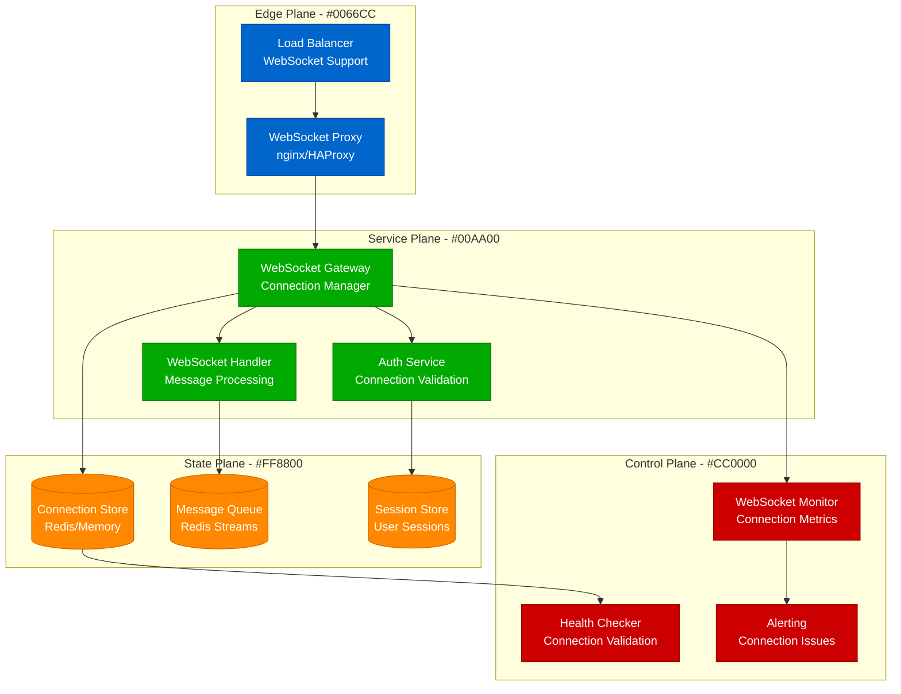

# WebSocket Connection Issues - Persistent Connection Debugging

## Overview

Systematic debugging of WebSocket connection issues in production environments. Based on experiences from Discord's real-time messaging, Slack's persistent connections, and trading platform WebSocket implementations.

## Architecture Context



## WebSocket Debugging Commands

### Connection Analysis
```bash
# Check WebSocket connections on server
netstat -an | grep :8080 | grep ESTABLISHED | wc -l
ss -tuln | grep :8080

# Monitor WebSocket traffic with tcpdump
tcpdump -i any -A port 8080 | grep -E "GET|Upgrade|WebSocket"

# Check nginx WebSocket proxy configuration
nginx -T | grep -A 10 -B 10 "proxy_pass.*ws"

# Test WebSocket connection
wscat -c ws://localhost:8080/websocket
```

## Production Examples

### Discord: Message Delivery Debugging
```javascript
// WebSocket connection manager with comprehensive debugging
class DiscordWebSocketManager {
    constructor(options) {
        this.options = options;
        this.connections = new Map();
        this.messageQueue = new Map();
        this.heartbeatIntervals = new Map();
        this.reconnectAttempts = new Map();
        
        this.setupEventHandlers();
        this.startHealthCheck();
    }

    handleConnection(ws, userId) {
        const connectionId = this.generateConnectionId();
        const connectionInfo = {
            id: connectionId,
            userId: userId,
            socket: ws,
            connectedAt: Date.now(),
            lastHeartbeat: Date.now(),
            messagesSent: 0,
            messagesReceived: 0,
            errors: []
        };

        this.connections.set(connectionId, connectionInfo);
        
        // Set up heartbeat
        this.setupHeartbeat(connectionId);
        
        // Handle messages
        ws.on('message', (data) => {
            this.handleMessage(connectionId, data);
        });

        // Handle disconnection
        ws.on('close', (code, reason) => {
            this.handleDisconnection(connectionId, code, reason);
        });

        // Handle errors
        ws.on('error', (error) => {
            this.handleError(connectionId, error);
        });

        console.log(`WebSocket connection established: ${connectionId} for user ${userId}`);
    }

    setupHeartbeat(connectionId) {
        const interval = setInterval(() => {
            const connection = this.connections.get(connectionId);
            if (!connection) {
                clearInterval(interval);
                return;
            }

            // Check if heartbeat response received recently
            const timeSinceLastHeartbeat = Date.now() - connection.lastHeartbeat;
            if (timeSinceLastHeartbeat > 65000) { // 65 seconds timeout
                console.warn(`Heartbeat timeout for connection ${connectionId}`);
                this.closeConnection(connectionId, 'HEARTBEAT_TIMEOUT');
                return;
            }

            // Send heartbeat
            try {
                connection.socket.send(JSON.stringify({
                    type: 'HEARTBEAT',
                    timestamp: Date.now()
                }));
            } catch (error) {
                console.error(`Failed to send heartbeat to ${connectionId}:`, error);
                this.handleError(connectionId, error);
            }
        }, 30000); // 30 second intervals

        this.heartbeatIntervals.set(connectionId, interval);
    }

    handleMessage(connectionId, data) {
        const connection = this.connections.get(connectionId);
        if (!connection) return;

        try {
            const message = JSON.parse(data);
            connection.messagesReceived++;
            connection.lastActivity = Date.now();

            // Handle different message types
            switch (message.type) {
                case 'HEARTBEAT_ACK':
                    connection.lastHeartbeat = Date.now();
                    break;
                    
                case 'CHAT_MESSAGE':
                    this.processChatMessage(connectionId, message);
                    break;
                    
                case 'VOICE_STATE_UPDATE':
                    this.processVoiceUpdate(connectionId, message);
                    break;
                    
                default:
                    console.warn(`Unknown message type: ${message.type}`);
            }

        } catch (error) {
            console.error(`Error parsing message from ${connectionId}:`, error);
            this.handleError(connectionId, error);
        }
    }

    handleDisconnection(connectionId, code, reason) {
        const connection = this.connections.get(connectionId);
        if (!connection) return;

        // Log disconnection details
        const disconnectionInfo = {
            connectionId,
            userId: connection.userId,
            code,
            reason: reason?.toString(),
            duration: Date.now() - connection.connectedAt,
            messagesSent: connection.messagesSent,
            messagesReceived: connection.messagesReceived,
            errors: connection.errors
        };

        console.log('WebSocket disconnection:', disconnectionInfo);

        // Clean up resources
        this.cleanup(connectionId);

        // Handle reconnection logic for specific error codes
        if (this.shouldAutoReconnect(code)) {
            this.scheduleReconnection(connection.userId);
        }
    }

    handleError(connectionId, error) {
        const connection = this.connections.get(connectionId);
        if (!connection) return;

        const errorInfo = {
            timestamp: Date.now(),
            error: error.message,
            stack: error.stack,
            code: error.code
        };

        connection.errors.push(errorInfo);
        
        console.error(`WebSocket error for ${connectionId}:`, errorInfo);

        // Close connection on critical errors
        if (this.isCriticalError(error)) {
            this.closeConnection(connectionId, 'CRITICAL_ERROR');
        }
    }

    // Debug and monitoring methods
    getConnectionStats() {
        const stats = {
            totalConnections: this.connections.size,
            connectionsByUser: {},
            averageUptime: 0,
            totalMessagesSent: 0,
            totalMessagesReceived: 0,
            totalErrors: 0
        };

        let totalUptime = 0;
        const now = Date.now();

        for (const [connectionId, connection] of this.connections) {
            const userId = connection.userId;
            if (!stats.connectionsByUser[userId]) {
                stats.connectionsByUser[userId] = 0;
            }
            stats.connectionsByUser[userId]++;

            totalUptime += (now - connection.connectedAt);
            stats.totalMessagesSent += connection.messagesSent;
            stats.totalMessagesReceived += connection.messagesReceived;
            stats.totalErrors += connection.errors.length;
        }

        if (this.connections.size > 0) {
            stats.averageUptime = totalUptime / this.connections.size;
        }

        return stats;
    }

    debugConnection(connectionId) {
        const connection = this.connections.get(connectionId);
        if (!connection) {
            return { error: 'Connection not found' };
        }

        return {
            connectionId,
            userId: connection.userId,
            connectedAt: new Date(connection.connectedAt).toISOString(),
            uptime: Date.now() - connection.connectedAt,
            lastHeartbeat: new Date(connection.lastHeartbeat).toISOString(),
            timeSinceLastHeartbeat: Date.now() - connection.lastHeartbeat,
            messagesSent: connection.messagesSent,
            messagesReceived: connection.messagesReceived,
            errors: connection.errors,
            socketState: connection.socket.readyState
        };
    }

    startHealthCheck() {
        setInterval(() => {
            this.performHealthCheck();
        }, 60000); // Every minute
    }

    performHealthCheck() {
        const now = Date.now();
        const staleConnections = [];
        const errorProne = [];

        for (const [connectionId, connection] of this.connections) {
            // Check for stale connections
            const timeSinceActivity = now - (connection.lastActivity || connection.connectedAt);
            if (timeSinceActivity > 300000) { // 5 minutes
                staleConnections.push(connectionId);
            }

            // Check for error-prone connections
            if (connection.errors.length > 10) {
                errorProne.push(connectionId);
            }
        }

        // Log health check results
        console.log(`Health check: ${this.connections.size} connections, ${staleConnections.length} stale, ${errorProne.length} error-prone`);

        // Clean up stale connections
        staleConnections.forEach(connectionId => {
            console.log(`Closing stale connection: ${connectionId}`);
            this.closeConnection(connectionId, 'STALE_CONNECTION');
        });
    }

    cleanup(connectionId) {
        // Clear heartbeat interval
        const interval = this.heartbeatIntervals.get(connectionId);
        if (interval) {
            clearInterval(interval);
            this.heartbeatIntervals.delete(connectionId);
        }

        // Remove connection
        this.connections.delete(connectionId);

        // Clear message queue
        this.messageQueue.delete(connectionId);
    }
}
```

### Slack: Connection Pool Management
```python
#!/usr/bin/env python3
"""
Slack-style WebSocket connection pool management
"""
import asyncio
import websockets
import json
import logging
import time
from typing import Dict, Set, Optional
from dataclasses import dataclass
from enum import Enum

class ConnectionState(Enum):
    CONNECTING = "connecting"
    CONNECTED = "connected"
    DISCONNECTING = "disconnecting"
    DISCONNECTED = "disconnected"
    ERROR = "error"

@dataclass
class ConnectionInfo:
    connection_id: str
    user_id: str
    team_id: str
    websocket: Optional[websockets.WebSocketServerProtocol]
    state: ConnectionState
    connected_at: float
    last_ping: float
    message_count: int
    error_count: int
    last_error: Optional[str]

class SlackWebSocketManager:
    def __init__(self):
        self.connections: Dict[str, ConnectionInfo] = {}
        self.user_connections: Dict[str, Set[str]] = {}  # user_id -> connection_ids
        self.team_connections: Dict[str, Set[str]] = {}  # team_id -> connection_ids
        self.logger = logging.getLogger(__name__)
        
        # Start background tasks
        asyncio.create_task(self.heartbeat_task())
        asyncio.create_task(self.cleanup_task())
        asyncio.create_task(self.stats_task())

    async def handle_connection(self, websocket, path):
        """Handle new WebSocket connection"""
        connection_id = self.generate_connection_id()
        
        try:
            # Authentication should happen here
            auth_data = await self.authenticate_connection(websocket)
            user_id = auth_data['user_id']
            team_id = auth_data['team_id']
            
            # Create connection info
            connection_info = ConnectionInfo(
                connection_id=connection_id,
                user_id=user_id,
                team_id=team_id,
                websocket=websocket,
                state=ConnectionState.CONNECTED,
                connected_at=time.time(),
                last_ping=time.time(),
                message_count=0,
                error_count=0,
                last_error=None
            )
            
            # Store connection
            self.connections[connection_id] = connection_info
            
            # Update user and team mappings
            if user_id not in self.user_connections:
                self.user_connections[user_id] = set()
            self.user_connections[user_id].add(connection_id)
            
            if team_id not in self.team_connections:
                self.team_connections[team_id] = set()
            self.team_connections[team_id].add(connection_id)
            
            self.logger.info(f"New connection: {connection_id} for user {user_id}")
            
            # Send welcome message
            await self.send_message(connection_id, {
                'type': 'hello',
                'connection_id': connection_id,
                'team_info': await self.get_team_info(team_id)
            })
            
            # Handle messages
            async for message in websocket:
                await self.handle_message(connection_id, message)
                
        except websockets.exceptions.ConnectionClosed:
            self.logger.info(f"Connection {connection_id} closed normally")
        except Exception as e:
            self.logger.error(f"Connection {connection_id} error: {e}")
            await self.handle_connection_error(connection_id, str(e))
        finally:
            await self.cleanup_connection(connection_id)

    async def handle_message(self, connection_id: str, message: str):
        """Handle incoming WebSocket message"""
        connection = self.connections.get(connection_id)
        if not connection:
            return
            
        try:
            data = json.loads(message)
            connection.message_count += 1
            
            message_type = data.get('type')
            
            if message_type == 'ping':
                await self.handle_ping(connection_id, data)
            elif message_type == 'message':
                await self.handle_chat_message(connection_id, data)
            elif message_type == 'presence_change':
                await self.handle_presence_change(connection_id, data)
            else:
                self.logger.warning(f"Unknown message type: {message_type}")
                
        except json.JSONDecodeError as e:
            self.logger.error(f"Invalid JSON from {connection_id}: {e}")
            connection.error_count += 1
        except Exception as e:
            self.logger.error(f"Error handling message from {connection_id}: {e}")
            connection.error_count += 1
            connection.last_error = str(e)

    async def handle_ping(self, connection_id: str, data: dict):
        """Handle ping message"""
        connection = self.connections.get(connection_id)
        if connection:
            connection.last_ping = time.time()
            await self.send_message(connection_id, {
                'type': 'pong',
                'timestamp': data.get('timestamp')
            })

    async def send_message(self, connection_id: str, message: dict) -> bool:
        """Send message to specific connection"""
        connection = self.connections.get(connection_id)
        if not connection or connection.state != ConnectionState.CONNECTED:
            return False
            
        try:
            await connection.websocket.send(json.dumps(message))
            return True
        except Exception as e:
            self.logger.error(f"Failed to send message to {connection_id}: {e}")
            await self.handle_connection_error(connection_id, str(e))
            return False

    async def broadcast_to_team(self, team_id: str, message: dict, exclude_user: Optional[str] = None):
        """Broadcast message to all connections in a team"""
        team_connections = self.team_connections.get(team_id, set())
        
        for connection_id in team_connections.copy():  # Copy to avoid modification during iteration
            connection = self.connections.get(connection_id)
            if connection and (not exclude_user or connection.user_id != exclude_user):
                await self.send_message(connection_id, message)

    async def heartbeat_task(self):
        """Background task to monitor connection health"""
        while True:
            await asyncio.sleep(30)  # Check every 30 seconds
            
            current_time = time.time()
            stale_connections = []
            
            for connection_id, connection in self.connections.items():
                # Check for stale connections (no ping in 90 seconds)
                if current_time - connection.last_ping > 90:
                    stale_connections.append(connection_id)
                    
            # Close stale connections
            for connection_id in stale_connections:
                self.logger.warning(f"Closing stale connection: {connection_id}")
                await self.close_connection(connection_id, "HEARTBEAT_TIMEOUT")

    async def cleanup_task(self):
        """Background task for general cleanup"""
        while True:
            await asyncio.sleep(300)  # Every 5 minutes
            
            # Clean up disconnected connections
            disconnected = [
                conn_id for conn_id, conn in self.connections.items()
                if conn.state == ConnectionState.DISCONNECTED
            ]
            
            for connection_id in disconnected:
                await self.cleanup_connection(connection_id)
                
            self.logger.info(f"Cleanup completed. Removed {len(disconnected)} disconnected connections")

    async def stats_task(self):
        """Background task to log statistics"""
        while True:
            await asyncio.sleep(60)  # Every minute
            
            stats = self.get_connection_stats()
            self.logger.info(f"WebSocket Stats: {stats}")

    def get_connection_stats(self) -> dict:
        """Get connection statistics"""
        stats = {
            'total_connections': len(self.connections),
            'connections_by_state': {},
            'total_teams': len(self.team_connections),
            'total_users': len(self.user_connections),
            'total_messages': sum(conn.message_count for conn in self.connections.values()),
            'total_errors': sum(conn.error_count for conn in self.connections.values())
        }
        
        # Count by state
        for connection in self.connections.values():
            state = connection.state.value
            stats['connections_by_state'][state] = stats['connections_by_state'].get(state, 0) + 1
            
        return stats

    async def handle_connection_error(self, connection_id: str, error: str):
        """Handle connection error"""
        connection = self.connections.get(connection_id)
        if connection:
            connection.state = ConnectionState.ERROR
            connection.error_count += 1
            connection.last_error = error
            
            # Close connection if too many errors
            if connection.error_count > 5:
                await self.close_connection(connection_id, "TOO_MANY_ERRORS")

    async def close_connection(self, connection_id: str, reason: str):
        """Close WebSocket connection"""
        connection = self.connections.get(connection_id)
        if not connection:
            return
            
        try:
            if connection.websocket and connection.state == ConnectionState.CONNECTED:
                await connection.websocket.close(code=1000, reason=reason)
            connection.state = ConnectionState.DISCONNECTED
        except Exception as e:
            self.logger.error(f"Error closing connection {connection_id}: {e}")

    async def cleanup_connection(self, connection_id: str):
        """Clean up connection resources"""
        connection = self.connections.get(connection_id)
        if not connection:
            return
            
        # Remove from user connections
        user_connections = self.user_connections.get(connection.user_id, set())
        user_connections.discard(connection_id)
        if not user_connections:
            del self.user_connections[connection.user_id]
            
        # Remove from team connections
        team_connections = self.team_connections.get(connection.team_id, set())
        team_connections.discard(connection_id)
        if not team_connections:
            del self.team_connections[connection.team_id]
            
        # Remove main connection record
        del self.connections[connection_id]
        
        self.logger.info(f"Cleaned up connection: {connection_id}")
```

## Monitoring and Alerting

### WebSocket Metrics
```yaml
groups:
- name: websocket_alerts
  rules:
  - alert: HighWebSocketDisconnectionRate
    expr: rate(websocket_disconnections_total[5m]) > 10
    for: 2m
    labels:
      severity: warning
    annotations:
      summary: "High WebSocket disconnection rate"
      description: "{{ $value }} disconnections per second"

  - alert: WebSocketConnectionStorm
    expr: rate(websocket_connections_total[1m]) > 100
    for: 30s
    labels:
      severity: critical
    annotations:
      summary: "WebSocket connection storm"
      description: "{{ $value }} new connections per second"

  - alert: WebSocketHeartbeatFailures
    expr: increase(websocket_heartbeat_failures_total[5m]) > 50
    for: 1m
    labels:
      severity: warning
    annotations:
      summary: "WebSocket heartbeat failures"
      description: "{{ $value }} heartbeat failures in 5 minutes"
```

## Success Metrics

- **Connection Success Rate**: > 99.5%
- **Connection Uptime**: > 99% average
- **Message Delivery Rate**: > 99.9%
- **Heartbeat Success Rate**: > 99.5%
- **Reconnection Success Rate**: > 95%

## The 3 AM Test

**Scenario**: Users are reporting that real-time features are broken - messages aren't appearing, presence status is stale, and WebSocket connections keep dropping every few minutes.

**This guide provides**:
1. **Connection diagnosis**: Tools to check WebSocket connection states and identify failure patterns
2. **Message flow analysis**: Scripts to trace message delivery and identify bottlenecks
3. **Heartbeat monitoring**: Systems to detect and resolve connection health issues
4. **Load balancer debugging**: Configuration checks for WebSocket proxy settings
5. **Client-side debugging**: Tools to help debug WebSocket issues from the client perspective

**Expected outcome**: WebSocket issues identified within 10 minutes, connection stability restored within 30 minutes, monitoring improved to prevent future incidents.