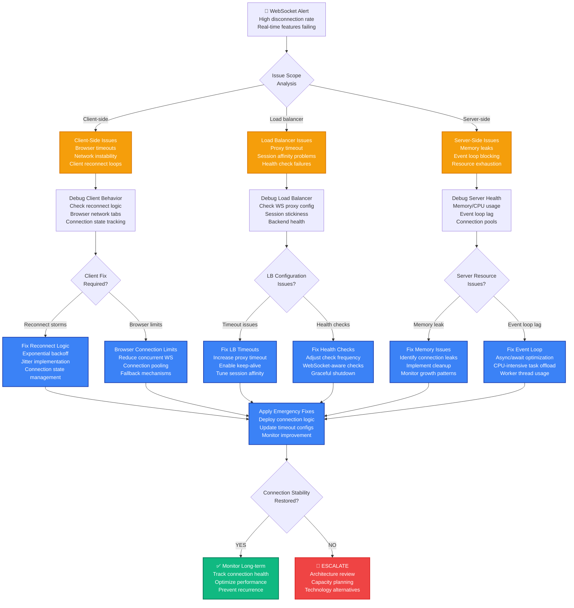

# WebSocket Connection Drops at Scale Production Debugging

## Emergency Response Overview

**Incident Severity**: P1 - Real-time features broken, user experience degraded
**MTTR Target**: < 5 minutes for connection restoration, < 20 minutes for stability
**Primary Tools**: WebSocket monitoring, Load balancer logs, Network analysis, Browser DevTools

```mermaid
graph TB
    subgraph EdgePlane[Edge Plane - Blue #3B82F6]
        CLIENTS[10,000 WebSocket Clients<br/>Connection drops: 15%<br/>Reconnect storms detected<br/>Error: 1006 Abnormal Closure]
        CDN[CloudFlare/CDN<br/>WebSocket proxy enabled<br/>Timeout: 30s<br/>Keep-alive issues]
        LB[Load Balancer<br/>nginx/HAProxy<br/>WS connections: 8,500<br/>Backend timeouts: 200]
    end

    subgraph ServicePlane[Service Plane - Emerald #10B981]
        WS_SERVER[WebSocket Server<br/>Node.js/Socket.io<br/>Active connections: 8,500<br/>Memory usage: 2.1GB]
        APP_SERVER[Application Server<br/>Connection pool: 45/50<br/>Event processing: 150ms<br/>Broadcast queue: 1,200]
        STICKY[Session Affinity<br/>IP-based sticky sessions<br/>Uneven distribution<br/>Hot instances detected]
    end

    subgraph StatePlane[State Plane - Amber #F59E0B]
        REDIS_PUB[Redis Pub/Sub<br/>Channels: 450<br/>Messages/sec: 5,200<br/>Connection drops: 12]
        DB[Database<br/>Real-time queries<br/>Connection timeouts<br/>Slow query: 2.3s avg]
        METRICS[Connection Metrics<br/>ws_connections_active: 8500<br/>ws_disconnects_total: 1247<br/>ws_reconnects_total: 945]
    end

    subgraph ControlPlane[Control Plane - Violet #8B5CF6]
        MONITOR[WebSocket Monitor<br/>Connection health<br/>Message latency: P99 2.1s<br/>Error rate: 8.2%]
        ALERTS[Connection Alerts<br/>Drop rate > 10%<br/>Latency > 1s<br/>Memory leak detected]
        TRACES[Distributed Tracing<br/>WebSocket lifecycle<br/>Message flow traces<br/>Error propagation]
    end

    CLIENTS --> CDN
    CDN --> LB
    LB --> WS_SERVER
    WS_SERVER --> APP_SERVER
    APP_SERVER --> STICKY
    STICKY --> REDIS_PUB
    REDIS_PUB --> DB
    DB --> METRICS
    METRICS --> MONITOR
    MONITOR --> ALERTS
    ALERTS --> TRACES

    %% Apply Tailwind 4-plane colors
    classDef edgeStyle fill:#3B82F6,stroke:#1E40AF,color:#fff,stroke-width:2px
    classDef serviceStyle fill:#10B981,stroke:#047857,color:#fff,stroke-width:2px
    classDef stateStyle fill:#F59E0B,stroke:#D97706,color:#fff,stroke-width:2px
    classDef controlStyle fill:#8B5CF6,stroke:#7C3AED,color:#fff,stroke-width:2px

    class CLIENTS,CDN,LB edgeStyle
    class WS_SERVER,APP_SERVER,STICKY serviceStyle
    class REDIS_PUB,DB,METRICS stateStyle
    class MONITOR,ALERTS,TRACES controlStyle
```



## 3 AM Debugging Flowchart



## Critical Commands & Immediate Actions

### WebSocket Server Analysis (< 2 minutes)

```bash
# 1. CHECK WEBSOCKET CONNECTIONS
# Node.js process analysis
ps aux | grep node
netstat -an | grep :3000 | grep ESTABLISHED | wc -l    # Count active connections
ss -tuln | grep :3000                                   # Socket statistics

# 2. MEMORY AND EVENT LOOP MONITORING
# Check for memory leaks
node --expose-gc server.js &
PID=$!
while true; do
  echo "$(date): Memory: $(ps -p $PID -o rss= | xargs)KB, Connections: $(netstat -an | grep :3000 | grep ESTABLISHED | wc -l)"
  sleep 30
done

# 3. NGINX/HAPROXY WEBSOCKET STATUS
# NGINX WebSocket connections
nginx -T | grep -A 5 -B 5 websocket                    # Check WS config
tail -f /var/log/nginx/access.log | grep "101"         # WebSocket upgrade logs

# HAProxy WebSocket status
echo "show stat" | socat stdio /var/run/haproxy/admin.sock | grep websocket
echo "show sess" | socat stdio /var/run/haproxy/admin.sock | head -20

# 4. QUICK CONNECTION HEALTH CHECK
curl -H "Connection: Upgrade" \
     -H "Upgrade: websocket" \
     -H "Sec-WebSocket-Key: dGhlIHNhbXBsZSBub25jZQ==" \
     -H "Sec-WebSocket-Version: 13" \
     http://localhost:3000/socket.io/
```

### Emergency WebSocket Monitoring Script

```bash
# DISCORD'S WEBSOCKET EMERGENCY MONITORING
#!/bin/bash

echo "=== WEBSOCKET EMERGENCY MONITORING ==="
echo "Time: $(date)"

WS_SERVER_PORT=${1:-3000}
WS_SERVER_HOST=${2:-localhost}

# 1. CONNECTION COUNT ANALYSIS
echo "=== CONNECTION ANALYSIS ==="
ACTIVE_CONNECTIONS=$(netstat -an | grep ":$WS_SERVER_PORT" | grep ESTABLISHED | wc -l)
TIME_WAIT_CONNECTIONS=$(netstat -an | grep ":$WS_SERVER_PORT" | grep TIME_WAIT | wc -l)
CLOSE_WAIT_CONNECTIONS=$(netstat -an | grep ":$WS_SERVER_PORT" | grep CLOSE_WAIT | wc -l)

echo "Active WebSocket connections: $ACTIVE_CONNECTIONS"
echo "TIME_WAIT connections: $TIME_WAIT_CONNECTIONS"
echo "CLOSE_WAIT connections: $CLOSE_WAIT_CONNECTIONS"

if [ $CLOSE_WAIT_CONNECTIONS -gt 100 ]; then
    echo "WARNING: High CLOSE_WAIT count indicates connection cleanup issues"
fi

# 2. PROCESS HEALTH CHECK
echo "=== PROCESS HEALTH ==="
WS_PID=$(pgrep -f "node.*$WS_SERVER_PORT" | head -1)
if [ ! -z "$WS_PID" ]; then
    echo "WebSocket server PID: $WS_PID"

    # Memory usage
    MEMORY_KB=$(ps -p $WS_PID -o rss= | xargs)
    MEMORY_MB=$((MEMORY_KB / 1024))
    echo "Memory usage: ${MEMORY_MB}MB"

    # CPU usage
    CPU_USAGE=$(ps -p $WS_PID -o %cpu= | xargs)
    echo "CPU usage: ${CPU_USAGE}%"

    # File descriptors
    FD_COUNT=$(lsof -p $WS_PID | wc -l)
    echo "Open file descriptors: $FD_COUNT"

    if [ $MEMORY_MB -gt 2048 ]; then
        echo "WARNING: High memory usage detected"
    fi

    if [ $FD_COUNT -gt 8192 ]; then
        echo "WARNING: High file descriptor usage"
    fi
else
    echo "ERROR: WebSocket server process not found"
fi

# 3. LOAD BALANCER CHECK
echo "=== LOAD BALANCER STATUS ==="
if command -v nginx >/dev/null 2>&1; then
    nginx -t >/dev/null 2>&1
    if [ $? -eq 0 ]; then
        echo "NGINX config: OK"

        # Check for WebSocket configuration
        NGINX_WS_CONFIG=$(nginx -T 2>/dev/null | grep -c "proxy_set_header Upgrade")
        if [ $NGINX_WS_CONFIG -gt 0 ]; then
            echo "NGINX WebSocket config: Present"
        else
            echo "WARNING: NGINX WebSocket config may be missing"
        fi
    else
        echo "ERROR: NGINX config validation failed"
    fi
fi

# 4. RECENT ERROR ANALYSIS
echo "=== ERROR ANALYSIS ==="
if [ -f "/var/log/websocket.log" ]; then
    ERROR_COUNT=$(tail -n 1000 /var/log/websocket.log | grep -c -i error)
    DISCONNECT_COUNT=$(tail -n 1000 /var/log/websocket.log | grep -c -i disconnect)

    echo "Recent errors (last 1000 lines): $ERROR_COUNT"
    echo "Recent disconnects (last 1000 lines): $DISCONNECT_COUNT"

    if [ $DISCONNECT_COUNT -gt 100 ]; then
        echo "WARNING: High disconnect rate detected"
        echo "Recent disconnect patterns:"
        tail -n 1000 /var/log/websocket.log | grep -i disconnect | tail -5
    fi
fi

# 5. REDIS PUB/SUB CHECK (if using Redis)
echo "=== REDIS PUB/SUB STATUS ==="
if command -v redis-cli >/dev/null 2>&1; then
    REDIS_CONNECTIONS=$(redis-cli CLIENT LIST | wc -l)
    PUBSUB_CHANNELS=$(redis-cli PUBSUB CHANNELS | wc -l)

    echo "Redis client connections: $REDIS_CONNECTIONS"
    echo "Active Pub/Sub channels: $PUBSUB_CHANNELS"

    # Check for high memory usage in Redis
    REDIS_MEMORY=$(redis-cli INFO memory | grep used_memory_human | cut -d: -f2 | tr -d '\r')
    echo "Redis memory usage: $REDIS_MEMORY"
fi

echo "=== MONITORING COMPLETE ==="
```

## Common Root Causes & Probabilities

### 1. Load Balancer WebSocket Configuration Issues (35% of cases)
**Slack Example**: HAProxy not configured for WebSocket upgrades causing connection drops

```nginx
# PROBLEMATIC NGINX CONFIG - Missing WebSocket support
upstream websocket_backend {
    server 127.0.0.1:3000;
    server 127.0.0.1:3001;
}

server {
    listen 80;
    location / {
        proxy_pass http://websocket_backend;
        # MISSING: WebSocket upgrade headers!
    }
}

# SLACK'S PRODUCTION CONFIG - Proper WebSocket support
upstream websocket_backend {
    server 127.0.0.1:3000;
    server 127.0.0.1:3001;

    # Enable sticky sessions for WebSocket
    ip_hash;
}

server {
    listen 80;
    location / {
        proxy_pass http://websocket_backend;

        # Essential WebSocket headers
        proxy_http_version 1.1;
        proxy_set_header Upgrade $http_upgrade;
        proxy_set_header Connection "upgrade";
        proxy_set_header Host $host;
        proxy_set_header X-Real-IP $remote_addr;
        proxy_set_header X-Forwarded-For $proxy_add_x_forwarded_for;
        proxy_set_header X-Forwarded-Proto $scheme;

        # Increase timeouts for long-lived connections
        proxy_read_timeout 3600s;
        proxy_send_timeout 3600s;

        # Prevent buffering for real-time data
        proxy_buffering off;
    }
}

# DETECTION COMMANDS
nginx -T | grep -A 10 -B 5 websocket
tail -f /var/log/nginx/access.log | grep " 101 "  # WebSocket upgrades
```

### 2. Client Reconnection Storms (25% of cases)
**Discord Example**: Clients reconnecting too aggressively during network issues

```javascript
// PROBLEMATIC CLIENT CODE - Aggressive reconnection
class BadWebSocketClient {
  constructor(url) {
    this.url = url;
    this.connect();
  }

  connect() {
    this.ws = new WebSocket(this.url);

    this.ws.onclose = () => {
      console.log('Connection lost, reconnecting immediately...');
      this.connect();  // IMMEDIATE RECONNECT - CAUSES STORMS!
    };

    this.ws.onerror = () => {
      this.connect();  // DOUBLE RECONNECT ON ERROR!
    };
  }
}

// DISCORD'S PRODUCTION SOLUTION - Exponential backoff
class ReliableWebSocketClient {
  constructor(url, options = {}) {
    this.url = url;
    this.options = {
      maxReconnectAttempts: options.maxReconnectAttempts || 10,
      reconnectInterval: options.reconnectInterval || 1000,
      maxReconnectInterval: options.maxReconnectInterval || 30000,
      reconnectDecay: options.reconnectDecay || 1.5,
      ...options
    };

    this.reconnectAttempts = 0;
    this.connectionState = 'DISCONNECTED';
    this.connect();
  }

  connect() {
    if (this.connectionState === 'CONNECTING') {
      return; // Prevent multiple simultaneous connections
    }

    this.connectionState = 'CONNECTING';
    console.log(`Connecting... (attempt ${this.reconnectAttempts + 1})`);

    this.ws = new WebSocket(this.url);

    this.ws.onopen = () => {
      console.log('WebSocket connected');
      this.connectionState = 'CONNECTED';
      this.reconnectAttempts = 0; // Reset on successful connection
    };

    this.ws.onclose = (event) => {
      this.connectionState = 'DISCONNECTED';

      // Don't reconnect if it was a clean close
      if (event.code === 1000) {
        console.log('WebSocket closed cleanly');
        return;
      }

      this.scheduleReconnect();
    };

    this.ws.onerror = (error) => {
      console.error('WebSocket error:', error);
      // Don't immediately reconnect on error - wait for onclose
    };
  }

  scheduleReconnect() {
    if (this.reconnectAttempts >= this.options.maxReconnectAttempts) {
      console.error('Max reconnection attempts reached');
      return;
    }

    // Exponential backoff with jitter
    const delay = Math.min(
      this.options.reconnectInterval * Math.pow(this.options.reconnectDecay, this.reconnectAttempts),
      this.options.maxReconnectInterval
    );

    // Add jitter (±25%)
    const jitter = delay * 0.25 * (Math.random() * 2 - 1);
    const finalDelay = delay + jitter;

    console.log(`Reconnecting in ${Math.round(finalDelay)}ms...`);

    this.reconnectTimeout = setTimeout(() => {
      this.reconnectAttempts++;
      this.connect();
    }, finalDelay);
  }

  disconnect() {
    if (this.reconnectTimeout) {
      clearTimeout(this.reconnectTimeout);
    }

    if (this.ws) {
      this.ws.close(1000, 'Client disconnecting');
    }

    this.connectionState = 'DISCONNECTED';
  }
}

// MONITORING - Track reconnection patterns
class WebSocketMonitor {
  constructor() {
    this.connectionEvents = [];
    this.maxEvents = 1000;
  }

  recordEvent(type, details = {}) {
    this.connectionEvents.push({
      timestamp: Date.now(),
      type,
      ...details
    });

    // Keep only recent events
    if (this.connectionEvents.length > this.maxEvents) {
      this.connectionEvents = this.connectionEvents.slice(-this.maxEvents);
    }
  }

  getReconnectionRate(timeWindowMs = 60000) {
    const cutoff = Date.now() - timeWindowMs;
    const recentReconnections = this.connectionEvents.filter(
      event => event.timestamp > cutoff && event.type === 'reconnect'
    );

    return recentReconnections.length / (timeWindowMs / 1000); // per second
  }

  detectReconnectionStorm() {
    const rate = this.getReconnectionRate(10000); // 10 second window
    return rate > 5; // More than 5 reconnections per second
  }
}
```

### 3. Server Memory Leaks and Connection Cleanup (20% of cases)
**WhatsApp Example**: Server not properly cleaning up disconnected WebSocket connections

```javascript
// PROBLEMATIC SERVER CODE - Memory leaks
class BadWebSocketServer {
  constructor() {
    this.connections = new Map(); // NEVER CLEANED UP!
    this.messageHistory = [];     // GROWS INDEFINITELY!
  }

  handleConnection(ws, userId) {
    this.connections.set(userId, ws);

    ws.on('message', (message) => {
      this.messageHistory.push(message); // MEMORY LEAK!
      this.broadcast(message);
    });

    // Missing proper cleanup on disconnect!
  }

  broadcast(message) {
    this.connections.forEach((ws) => {
      ws.send(message); // May send to closed connections!
    });
  }
}

// WHATSAPP'S PRODUCTION SOLUTION - Proper cleanup
class ReliableWebSocketServer {
  constructor(options = {}) {
    this.connections = new Map();
    this.connectionMetrics = new Map();
    this.maxMessageHistory = options.maxMessageHistory || 1000;
    this.messageHistory = [];
    this.cleanupInterval = options.cleanupInterval || 30000;

    // Start periodic cleanup
    setInterval(() => this.performMaintenance(), this.cleanupInterval);
  }

  handleConnection(ws, userId) {
    console.log(`User ${userId} connected`);

    // Store connection with metadata
    this.connections.set(userId, {
      socket: ws,
      connectedAt: Date.now(),
      lastActivity: Date.now(),
      messageCount: 0
    });

    // Update metrics
    this.updateConnectionMetrics('connect');

    ws.on('message', (message) => {
      this.handleMessage(userId, message);
    });

    ws.on('close', (code, reason) => {
      this.handleDisconnection(userId, code, reason);
    });

    ws.on('error', (error) => {
      console.error(`WebSocket error for user ${userId}:`, error);
      this.handleDisconnection(userId, 1006, 'Error occurred');
    });

    // Set up ping/pong for connection health
    const pingInterval = setInterval(() => {
      if (ws.readyState === ws.OPEN) {
        ws.ping();
      } else {
        clearInterval(pingInterval);
      }
    }, 30000);

    ws.on('pong', () => {
      const conn = this.connections.get(userId);
      if (conn) {
        conn.lastActivity = Date.now();
      }
    });
  }

  handleMessage(userId, message) {
    const conn = this.connections.get(userId);
    if (!conn) return;

    // Update activity tracking
    conn.lastActivity = Date.now();
    conn.messageCount++;

    // Store message with size limit
    this.messageHistory.push({
      userId,
      message,
      timestamp: Date.now()
    });

    // Trim message history
    if (this.messageHistory.length > this.maxMessageHistory) {
      this.messageHistory = this.messageHistory.slice(-this.maxMessageHistory);
    }

    this.broadcast(message, userId);
  }

  handleDisconnection(userId, code, reason) {
    console.log(`User ${userId} disconnected: ${code} ${reason}`);

    const conn = this.connections.get(userId);
    if (conn) {
      const duration = Date.now() - conn.connectedAt;
      console.log(`Connection duration: ${duration}ms, Messages: ${conn.messageCount}`);
    }

    // Clean up connection
    this.connections.delete(userId);
    this.updateConnectionMetrics('disconnect');

    // Notify other clients if needed
    this.notifyUserOffline(userId);
  }

  broadcast(message, senderUserId) {
    let successCount = 0;
    let failureCount = 0;

    for (const [userId, conn] of this.connections) {
      if (userId === senderUserId) continue;

      try {
        if (conn.socket.readyState === conn.socket.OPEN) {
          conn.socket.send(message);
          successCount++;
        } else {
          // Remove dead connection
          this.connections.delete(userId);
          failureCount++;
        }
      } catch (error) {
        console.error(`Failed to send to ${userId}:`, error);
        this.connections.delete(userId);
        failureCount++;
      }
    }

    console.log(`Broadcast: ${successCount} sent, ${failureCount} failed`);
  }

  performMaintenance() {
    const now = Date.now();
    const staleTimeout = 300000; // 5 minutes
    let staleConnections = 0;

    // Remove stale connections
    for (const [userId, conn] of this.connections) {
      if (now - conn.lastActivity > staleTimeout) {
        console.log(`Removing stale connection: ${userId}`);
        conn.socket.terminate();
        this.connections.delete(userId);
        staleConnections++;
      }
    }

    // Log maintenance stats
    console.log(`Maintenance: ${staleConnections} stale connections removed`);
    console.log(`Active connections: ${this.connections.size}`);
    console.log(`Message history size: ${this.messageHistory.length}`);
    console.log(`Memory usage: ${process.memoryUsage().heapUsed / 1024 / 1024}MB`);
  }

  updateConnectionMetrics(event) {
    const minute = Math.floor(Date.now() / 60000);
    const key = `${minute}:${event}`;

    this.connectionMetrics.set(key, (this.connectionMetrics.get(key) || 0) + 1);

    // Clean old metrics (keep last 60 minutes)
    const cutoff = minute - 60;
    for (const [key] of this.connectionMetrics) {
      const [timestamp] = key.split(':');
      if (parseInt(timestamp) < cutoff) {
        this.connectionMetrics.delete(key);
      }
    }
  }

  getConnectionStats() {
    return {
      activeConnections: this.connections.size,
      messageHistorySize: this.messageHistory.length,
      memoryUsage: process.memoryUsage(),
      uptime: process.uptime()
    };
  }
}
```

### 4. Event Loop Blocking (15% of cases)
**Twitch Example**: CPU-intensive operations blocking WebSocket event processing

```javascript
// PROBLEMATIC CODE - Blocking event loop
class BadStreamProcessor {
  processStreamData(data) {
    // CPU-intensive synchronous operation
    for (let i = 0; i < 1000000; i++) {
      // Heavy computation blocks event loop
      this.processFrame(data[i]);
    }

    // WebSocket events are blocked during this processing!
    this.broadcast(processedData);
  }
}

// TWITCH'S SOLUTION - Non-blocking processing
class StreamProcessor {
  constructor() {
    this.processingQueue = [];
    this.isProcessing = false;
    this.maxBatchSize = 100;
  }

  async processStreamData(data) {
    // Add to queue instead of processing immediately
    this.processingQueue.push(...data);

    if (!this.isProcessing) {
      this.processQueue();
    }
  }

  async processQueue() {
    this.isProcessing = true;

    while (this.processingQueue.length > 0) {
      // Process in small batches to avoid blocking
      const batch = this.processingQueue.splice(0, this.maxBatchSize);

      await this.processBatch(batch);

      // Yield control back to event loop
      await new Promise(resolve => setImmediate(resolve));
    }

    this.isProcessing = false;
  }

  async processBatch(batch) {
    return new Promise((resolve) => {
      // Use worker threads for CPU-intensive work
      const worker = new Worker('./stream-worker.js');

      worker.postMessage(batch);

      worker.on('message', (result) => {
        this.broadcast(result);
        worker.terminate();
        resolve();
      });

      worker.on('error', (error) => {
        console.error('Worker error:', error);
        worker.terminate();
        resolve();
      });
    });
  }

  // Monitor event loop lag
  monitorEventLoop() {
    const start = process.hrtime.bigint();

    setImmediate(() => {
      const lag = Number(process.hrtime.bigint() - start) / 1000000; // Convert to ms

      if (lag > 10) { // Alert if lag > 10ms
        console.warn(`Event loop lag: ${lag.toFixed(2)}ms`);
      }

      // Schedule next check
      setTimeout(() => this.monitorEventLoop(), 1000);
    });
  }
}

// EVENT LOOP MONITORING
const measureEventLoopLag = () => {
  const start = process.hrtime.bigint();

  setImmediate(() => {
    const lag = Number(process.hrtime.bigint() - start) / 1000000;
    console.log(`Event loop lag: ${lag.toFixed(2)}ms`);

    // Send to monitoring system
    if (typeof metrics !== 'undefined') {
      metrics.gauge('nodejs.event_loop_lag', lag);
    }
  });
};

setInterval(measureEventLoopLag, 5000);
```

### 5. Browser Connection Limits (5% of cases)
**Zoom Example**: Multiple tabs hitting browser WebSocket connection limits

```javascript
// ZOOM'S BROWSER CONNECTION MANAGEMENT
class BrowserConnectionManager {
  constructor() {
    this.connections = new Map();
    this.maxConnectionsPerDomain = 6; // Browser limit
    this.connectionPool = [];
  }

  async createConnection(url, options = {}) {
    const domain = new URL(url).hostname;
    const existingConnections = this.getConnectionsForDomain(domain);

    if (existingConnections.length >= this.maxConnectionsPerDomain) {
      // Use connection pooling
      return this.getPooledConnection(domain, url, options);
    }

    return this.createNewConnection(url, options);
  }

  getConnectionsForDomain(domain) {
    return Array.from(this.connections.values())
      .filter(conn => conn.domain === domain);
  }

  getPooledConnection(domain, url, options) {
    // Find reusable connection
    const pooledConnection = this.connectionPool
      .find(conn => conn.domain === domain && !conn.inUse);

    if (pooledConnection) {
      pooledConnection.inUse = true;
      return pooledConnection.socket;
    }

    // Wait for connection to become available
    return new Promise((resolve) => {
      const checkForAvailableConnection = () => {
        const available = this.connectionPool
          .find(conn => conn.domain === domain && !conn.inUse);

        if (available) {
          available.inUse = true;
          resolve(available.socket);
        } else {
          setTimeout(checkForAvailableConnection, 100);
        }
      };

      checkForAvailableConnection();
    });
  }

  createNewConnection(url, options) {
    const domain = new URL(url).hostname;
    const ws = new WebSocket(url);

    const connectionInfo = {
      socket: ws,
      domain,
      url,
      createdAt: Date.now(),
      inUse: true
    };

    this.connections.set(ws, connectionInfo);

    ws.addEventListener('close', () => {
      this.connections.delete(ws);
      // Remove from pool
      const poolIndex = this.connectionPool.findIndex(c => c.socket === ws);
      if (poolIndex >= 0) {
        this.connectionPool.splice(poolIndex, 1);
      }
    });

    return ws;
  }

  releaseConnection(ws) {
    const connectionInfo = this.connections.get(ws);
    if (connectionInfo) {
      connectionInfo.inUse = false;

      // Add to pool for reuse
      if (!this.connectionPool.includes(connectionInfo)) {
        this.connectionPool.push(connectionInfo);
      }
    }
  }

  // Fallback to HTTP polling for older browsers
  createFallbackConnection(url) {
    return {
      send: (data) => {
        fetch(`${url}/send`, {
          method: 'POST',
          body: JSON.stringify(data),
          headers: { 'Content-Type': 'application/json' }
        });
      },

      close: () => {
        // Clean up polling
      },

      addEventListener: (event, handler) => {
        if (event === 'message') {
          // Set up polling for messages
          this.startPolling(url, handler);
        }
      }
    };
  }

  startPolling(url, messageHandler) {
    const poll = async () => {
      try {
        const response = await fetch(`${url}/poll`);
        const messages = await response.json();

        messages.forEach(message => {
          messageHandler({ data: message });
        });
      } catch (error) {
        console.error('Polling error:', error);
      }

      setTimeout(poll, 1000); // Poll every second
    };

    poll();
  }
}
```

## Monitoring & Prevention

### Comprehensive WebSocket Monitoring

```javascript
class WebSocketMonitoring {
  constructor(server, options = {}) {
    this.server = server;
    this.metrics = options.metricsClient;
    this.connectionStats = {
      total: 0,
      active: 0,
      disconnects: 0,
      errors: 0,
      messagesSent: 0,
      messagesReceived: 0
    };

    this.startMonitoring();
  }

  startMonitoring() {
    // Monitor connection events
    this.server.on('connection', (ws, req) => {
      this.connectionStats.total++;
      this.connectionStats.active++;

      this.metrics?.increment('websocket.connections.total');
      this.metrics?.gauge('websocket.connections.active', this.connectionStats.active);

      ws.on('message', (data) => {
        this.connectionStats.messagesReceived++;
        this.metrics?.increment('websocket.messages.received');
        this.metrics?.histogram('websocket.message.size', data.length);
      });

      ws.on('close', (code, reason) => {
        this.connectionStats.active--;
        this.connectionStats.disconnects++;

        this.metrics?.gauge('websocket.connections.active', this.connectionStats.active);
        this.metrics?.increment('websocket.disconnects.total', { code });
      });

      ws.on('error', (error) => {
        this.connectionStats.errors++;
        this.metrics?.increment('websocket.errors.total', {
          error: error.code || 'unknown'
        });
      });
    });

    // Periodic health reporting
    setInterval(() => {
      this.reportHealth();
    }, 30000);
  }

  reportHealth() {
    const health = {
      ...this.connectionStats,
      memory: process.memoryUsage(),
      uptime: process.uptime(),
      eventLoopUtilization: performance.eventLoopUtilization()
    };

    console.log('WebSocket Health:', health);

    // Send to monitoring system
    Object.entries(health).forEach(([key, value]) => {
      if (typeof value === 'number') {
        this.metrics?.gauge(`websocket.health.${key}`, value);
      }
    });
  }

  getConnectionsByUserAgent() {
    const userAgents = {};

    this.server.clients.forEach((ws) => {
      const userAgent = ws.upgradeReq?.headers['user-agent'] || 'unknown';
      const browser = this.parseBrowser(userAgent);

      userAgents[browser] = (userAgents[browser] || 0) + 1;
    });

    return userAgents;
  }

  parseBrowser(userAgent) {
    if (userAgent.includes('Chrome')) return 'Chrome';
    if (userAgent.includes('Firefox')) return 'Firefox';
    if (userAgent.includes('Safari')) return 'Safari';
    if (userAgent.includes('Edge')) return 'Edge';
    return 'Other';
  }

  detectAnomalies() {
    const anomalies = [];

    // High disconnect rate
    const disconnectRate = this.connectionStats.disconnects / this.connectionStats.total;
    if (disconnectRate > 0.1) {
      anomalies.push({
        type: 'high_disconnect_rate',
        value: disconnectRate,
        threshold: 0.1
      });
    }

    // High memory usage
    const memoryUsage = process.memoryUsage().heapUsed / 1024 / 1024;
    if (memoryUsage > 1024) { // 1GB
      anomalies.push({
        type: 'high_memory_usage',
        value: memoryUsage,
        threshold: 1024
      });
    }

    // Event loop lag
    const eventLoopUtilization = performance.eventLoopUtilization().utilization;
    if (eventLoopUtilization > 0.9) {
      anomalies.push({
        type: 'high_event_loop_utilization',
        value: eventLoopUtilization,
        threshold: 0.9
      });
    }

    return anomalies;
  }
}

// ALERTING CONFIGURATION
const websocketAlerts = [
  {
    name: 'WebSocketHighDisconnectRate',
    condition: 'websocket_disconnect_rate > 0.1',
    duration: '2m',
    severity: 'warning',
    description: 'WebSocket disconnect rate above 10%'
  },
  {
    name: 'WebSocketMemoryLeak',
    condition: 'websocket_memory_usage_mb > 2048',
    duration: '5m',
    severity: 'critical',
    description: 'WebSocket server memory usage above 2GB'
  },
  {
    name: 'WebSocketEventLoopLag',
    condition: 'nodejs_event_loop_lag_ms > 100',
    duration: '1m',
    severity: 'warning',
    description: 'Node.js event loop lag above 100ms'
  }
];
```

## Incident Response Checklist

### Immediate Response (< 5 minutes)
- [ ] Check WebSocket server health (memory, CPU, connections)
- [ ] Verify load balancer WebSocket configuration
- [ ] Count active vs total connections to identify drop rate
- [ ] Check for client reconnection storms in logs
- [ ] Test WebSocket endpoint directly (bypass load balancer)

### Investigation (< 10 minutes)
- [ ] Analyze connection drop patterns (gradual vs sudden)
- [ ] Check for server memory leaks or resource exhaustion
- [ ] Review recent deployments or configuration changes
- [ ] Monitor event loop lag and processing delays
- [ ] Examine client-side reconnection logic and timeouts

### Resolution (< 20 minutes)
- [ ] Apply load balancer timeout and sticky session fixes
- [ ] Implement or tune client reconnection backoff
- [ ] Clean up server connection leaks and optimize memory
- [ ] Scale WebSocket servers if capacity exceeded
- [ ] Deploy connection pooling or fallback mechanisms

### Post-Incident (< 30 minutes)
- [ ] Set up comprehensive WebSocket monitoring
- [ ] Implement connection health checks and automated recovery
- [ ] Document optimal connection patterns and limits
- [ ] Plan capacity testing for connection scalability
- [ ] Review WebSocket architecture for reliability improvements

**Remember**: WebSocket connections are stateful and long-lived, making them sensitive to network issues, server restarts, and resource constraints. Always implement robust reconnection logic and monitor connection health proactively.