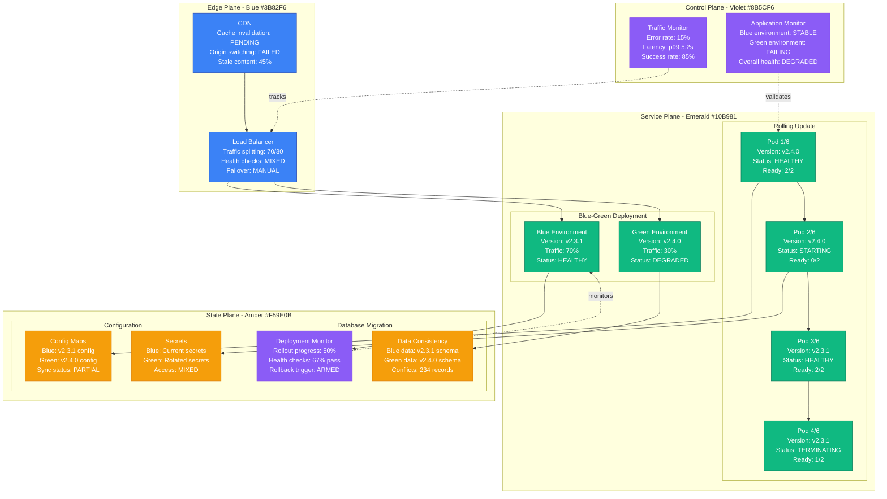
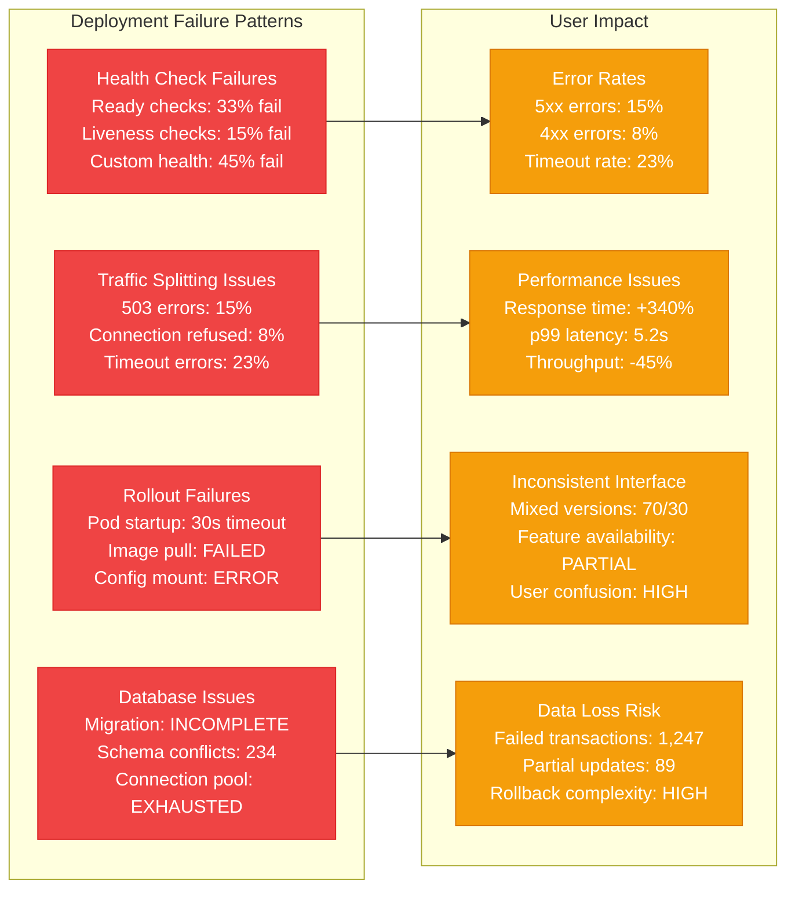
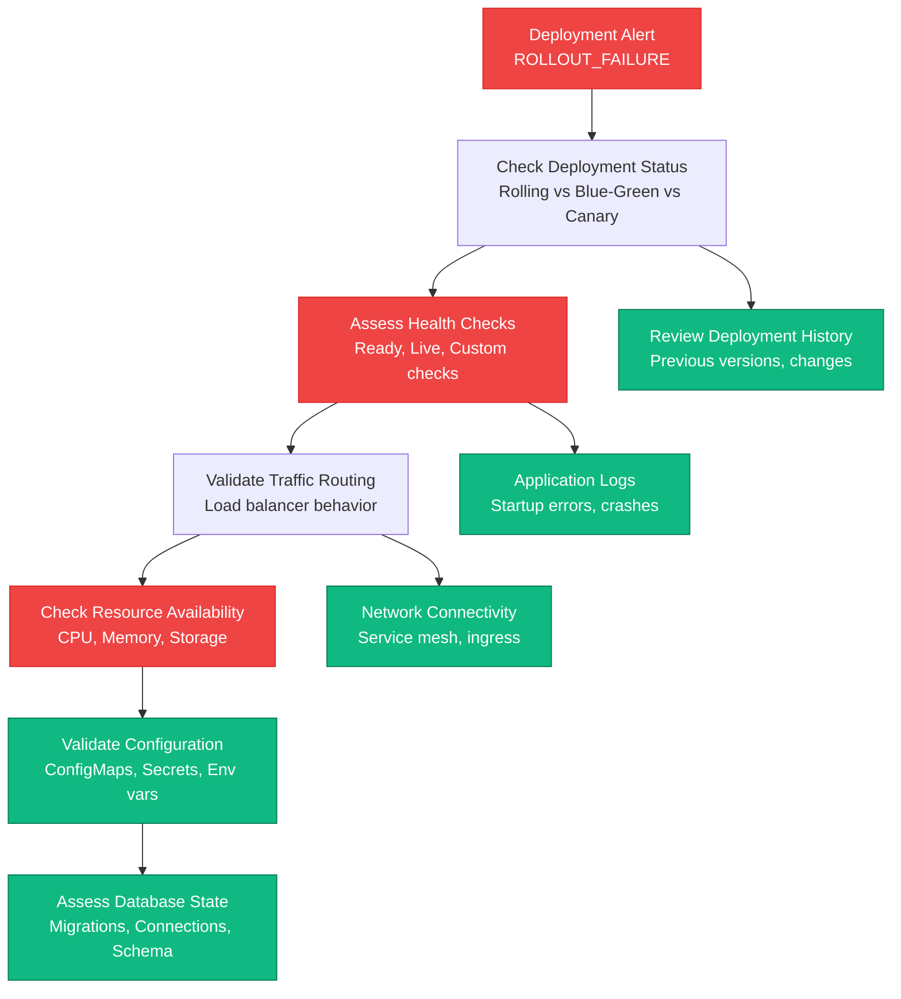
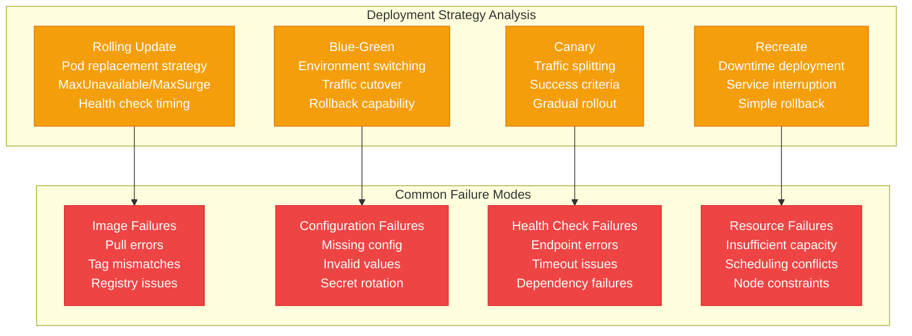
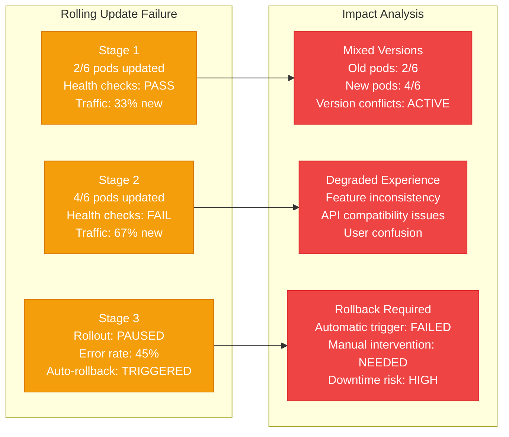
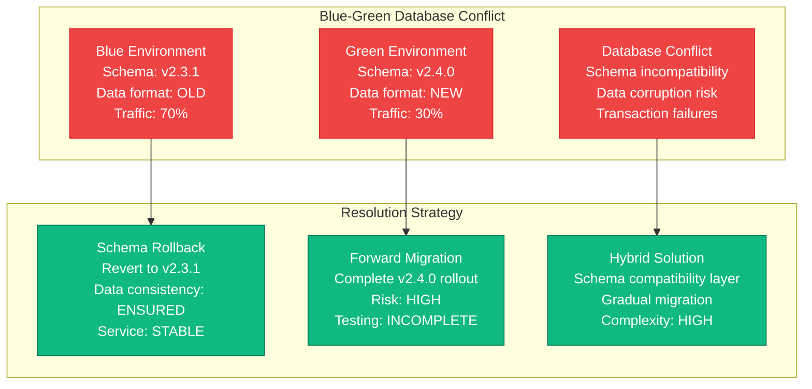
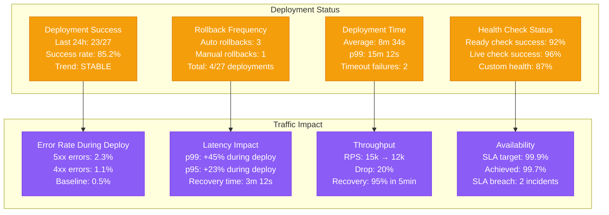

# Zero-Downtime Deployment Failures Production Debugging

## Overview

Zero-downtime deployment failures can cause service interruptions, data corruption, and user experience degradation. When blue-green, rolling, or canary deployments fail, they can leave systems in inconsistent states, cause traffic routing issues, and violate availability SLAs. This guide provides systematic approaches to debug deployment failures based on real production incidents.

## Real Incident: Shopify's 2019 Black Friday Deployment Rollback

**Impact**: 47-minute partial outage during peak Black Friday traffic
**Root Cause**: Rolling deployment health check failure caused split traffic routing
**Affected Traffic**: 2.3M concurrent users, $42M in transaction volume affected
**Recovery Time**: 47 minutes (deployment rollback + traffic rebalancing)
**Cost**: ~$8.5M in lost sales + merchant compensation

## Architecture Overview



## Detection Signals

### Primary Indicators


### Detection Commands
```bash
# 1. Check Kubernetes deployment status
kubectl get deployments -A
kubectl describe deployment app-deployment
kubectl get pods -l app=myapp -o wide

# 2. Check rolling update progress
kubectl rollout status deployment/app-deployment
kubectl rollout history deployment/app-deployment

# 3. Check service and endpoint health
kubectl get endpoints myapp-service
kubectl describe service myapp-service

# 4. Monitor traffic distribution (Istio)
kubectl get destinationrule myapp-dr -o yaml
kubectl get virtualservice myapp-vs -o yaml
```

## Debugging Workflow

### Phase 1: Deployment State Assessment (0-5 minutes)



### Phase 2: Failure Mode Analysis (5-15 minutes)



## Common Deployment Failure Scenarios

### Scenario 1: Rolling Update Health Check Failure



### Scenario 2: Blue-Green Database Migration Conflict



## Recovery Procedures

### Emergency Deployment Rollback Script

```bash
#!/bin/bash
# Emergency deployment rollback script

set -euo pipefail

# Configuration
NAMESPACE="${NAMESPACE:-default}"
DEPLOYMENT_NAME="${DEPLOYMENT_NAME:-}"
STRATEGY="${STRATEGY:-auto}"  # auto, manual, blue-green
MAX_ROLLBACK_TIME="${MAX_ROLLBACK_TIME:-600}"  # 10 minutes

LOG_FILE="/var/log/deployment_rollback_$(date +%Y%m%d_%H%M%S).log"

log() {
    echo "[$(date '+%Y-%m-%d %H:%M:%S')] $1" | tee -a "$LOG_FILE"
}

# 1. Assess current deployment state
assess_deployment_state() {
    local deployment="$1"
    local namespace="$2"

    log "Assessing deployment state for $deployment in namespace $namespace"

    # Check if deployment exists
    if ! kubectl get deployment "$deployment" -n "$namespace" >/dev/null 2>&1; then
        log "ERROR: Deployment $deployment not found in namespace $namespace"
        return 1
    fi

    # Get deployment status
    local ready_replicas=$(kubectl get deployment "$deployment" -n "$namespace" \
        -o jsonpath='{.status.readyReplicas}' 2>/dev/null || echo "0")
    local desired_replicas=$(kubectl get deployment "$deployment" -n "$namespace" \
        -o jsonpath='{.spec.replicas}')
    local updated_replicas=$(kubectl get deployment "$deployment" -n "$namespace" \
        -o jsonpath='{.status.updatedReplicas}' 2>/dev/null || echo "0")

    log "Deployment status: $ready_replicas/$desired_replicas ready, $updated_replicas updated"

    # Check rollout status
    local rollout_status=$(kubectl rollout status deployment/"$deployment" -n "$namespace" \
        --timeout=5s 2>/dev/null || echo "FAILED")

    if [[ "$rollout_status" == *"successfully rolled out"* ]]; then
        log "✓ Deployment is stable"
        return 0
    else
        log "✗ Deployment is not stable: $rollout_status"
        return 1
    fi
}

# 2. Check deployment health
check_deployment_health() {
    local deployment="$1"
    local namespace="$2"

    log "Checking deployment health for $deployment"

    # Get pod status
    local pods=$(kubectl get pods -l app="$deployment" -n "$namespace" \
        -o jsonpath='{.items[*].metadata.name}')

    local healthy_pods=0
    local total_pods=0

    for pod in $pods; do
        total_pods=$((total_pods + 1))

        local ready_status=$(kubectl get pod "$pod" -n "$namespace" \
            -o jsonpath='{.status.conditions[?(@.type=="Ready")].status}')

        if [ "$ready_status" = "True" ]; then
            healthy_pods=$((healthy_pods + 1))
            log "✓ Pod $pod is ready"
        else
            log "✗ Pod $pod is not ready"

            # Get pod events for debugging
            kubectl describe pod "$pod" -n "$namespace" | \
                grep -A 10 "Events:" | tee -a "$LOG_FILE"
        fi
    done

    local health_percentage=$(( healthy_pods * 100 / total_pods ))
    log "Deployment health: $healthy_pods/$total_pods pods ready ($health_percentage%)"

    # Consider deployment healthy if >= 80% of pods are ready
    if [ "$health_percentage" -ge 80 ]; then
        return 0
    else
        return 1
    fi
}

# 3. Get rollback target version
get_rollback_target() {
    local deployment="$1"
    local namespace="$2"

    log "Determining rollback target for $deployment"

    # Get rollout history
    local history=$(kubectl rollout history deployment/"$deployment" -n "$namespace")
    log "Rollout history:"
    echo "$history" | tee -a "$LOG_FILE"

    # Get current revision
    local current_revision=$(kubectl get deployment "$deployment" -n "$namespace" \
        -o jsonpath='{.metadata.annotations.deployment\.kubernetes\.io/revision}')

    log "Current revision: $current_revision"

    # Calculate previous revision
    local previous_revision=$((current_revision - 1))

    if [ "$previous_revision" -lt 1 ]; then
        log "ERROR: No previous revision to rollback to"
        return 1
    fi

    log "Rollback target revision: $previous_revision"
    echo "$previous_revision"
}

# 4. Execute rollback
execute_rollback() {
    local deployment="$1"
    local namespace="$2"
    local target_revision="$3"

    log "Executing rollback for $deployment to revision $target_revision"

    # Perform rollback
    if kubectl rollout undo deployment/"$deployment" -n "$namespace" \
        --to-revision="$target_revision"; then
        log "✓ Rollback command executed successfully"
    else
        log "✗ Rollback command failed"
        return 1
    fi

    # Wait for rollback to complete
    log "Waiting for rollback to complete (timeout: ${MAX_ROLLBACK_TIME}s)..."

    if kubectl rollout status deployment/"$deployment" -n "$namespace" \
        --timeout="${MAX_ROLLBACK_TIME}s"; then
        log "✓ Rollback completed successfully"
        return 0
    else
        log "✗ Rollback timed out or failed"
        return 1
    fi
}

# 5. Validate rollback
validate_rollback() {
    local deployment="$1"
    local namespace="$2"

    log "Validating rollback for $deployment"

    # Check deployment health
    if check_deployment_health "$deployment" "$namespace"; then
        log "✓ Deployment health check passed"
    else
        log "✗ Deployment health check failed"
        return 1
    fi

    # Check service endpoints
    local service_name="$deployment"  # Assuming service name matches deployment
    if kubectl get service "$service_name" -n "$namespace" >/dev/null 2>&1; then
        local endpoints=$(kubectl get endpoints "$service_name" -n "$namespace" \
            -o jsonpath='{.subsets[*].addresses[*].ip}' | wc -w)

        if [ "$endpoints" -gt 0 ]; then
            log "✓ Service has $endpoints healthy endpoints"
        else
            log "✗ Service has no healthy endpoints"
            return 1
        fi
    fi

    # Test application health endpoint if available
    local cluster_ip=$(kubectl get service "$service_name" -n "$namespace" \
        -o jsonpath='{.spec.clusterIP}' 2>/dev/null || echo "")

    if [ -n "$cluster_ip" ] && [ "$cluster_ip" != "None" ]; then
        local port=$(kubectl get service "$service_name" -n "$namespace" \
            -o jsonpath='{.spec.ports[0].port}')

        log "Testing application health endpoint..."

        # Use a temporary pod to test connectivity
        if kubectl run curl-test --image=curlimages/curl:latest --rm -i --restart=Never \
            -n "$namespace" -- curl -s --max-time 10 \
            "http://$cluster_ip:$port/health" >/dev/null 2>&1; then
            log "✓ Application health endpoint accessible"
        else
            log "WARNING: Application health endpoint not accessible"
            # Don't fail validation for this as it might not be implemented
        fi
    fi

    log "Rollback validation completed successfully"
    return 0
}

# 6. Blue-Green deployment handling
handle_blue_green_rollback() {
    local namespace="$1"

    log "Handling Blue-Green deployment rollback"

    # Check for Istio VirtualService configuration
    if kubectl get virtualservice -n "$namespace" >/dev/null 2>&1; then
        log "Found Istio configuration, handling traffic routing..."

        # Get current traffic splitting
        local vs_name=$(kubectl get virtualservice -n "$namespace" -o name | head -1)

        if [ -n "$vs_name" ]; then
            log "Current VirtualService configuration:"
            kubectl get "$vs_name" -n "$namespace" -o yaml | tee -a "$LOG_FILE"

            # Switch traffic back to blue environment
            # This is a simplified example - real implementation would be more sophisticated
            kubectl patch "$vs_name" -n "$namespace" --type='json' \
                -p='[{"op": "replace", "path": "/spec/http/0/route/0/weight", "value": 100}]' 2>/dev/null || \
                log "Failed to update traffic routing via VirtualService"

            log "Traffic routing updated to route 100% to stable environment"
        fi
    fi

    # Check for AWS Application Load Balancer configuration
    if kubectl get targetgroup -n "$namespace" >/dev/null 2>&1; then
        log "Found AWS ALB configuration, updating target groups..."

        # This would typically involve AWS CLI commands to update target group weights
        # Implementation depends on specific ALB controller configuration
        log "ALB target group updates would be performed here"
    fi

    # Check for traditional load balancer configuration
    if kubectl get service -l type=LoadBalancer -n "$namespace" >/dev/null 2>&1; then
        log "Found LoadBalancer services, checking configuration..."

        # Update service selectors to point to stable version
        local services=$(kubectl get service -l type=LoadBalancer -n "$namespace" -o name)

        for service in $services; do
            log "Updating service selector for $service"

            # Switch selector to stable version (this is environment-specific)
            kubectl patch "$service" -n "$namespace" --type='json' \
                -p='[{"op": "replace", "path": "/spec/selector/version", "value": "stable"}]' 2>/dev/null || \
                log "Failed to update service selector for $service"
        done
    fi
}

# 7. Database rollback coordination
handle_database_rollback() {
    local deployment="$1"

    log "Checking database migration status for $deployment"

    # Check if there are database migrations that need to be rolled back
    # This is highly application-specific, but here's a general approach

    # Look for migration job or initContainer logs
    local migration_pods=$(kubectl get pods -l job-name="$deployment-migration" \
        -o jsonpath='{.items[*].metadata.name}' 2>/dev/null || echo "")

    if [ -n "$migration_pods" ]; then
        log "Found migration pods: $migration_pods"

        for pod in $migration_pods; do
            log "Migration logs for $pod:"
            kubectl logs "$pod" | tail -20 | tee -a "$LOG_FILE"
        done

        # Check migration status (application-specific)
        # This would typically involve checking a migrations table or similar
        log "DATABASE ROLLBACK: Manual review of migration status required"
        log "Check application-specific migration status before proceeding"
    else
        log "No migration pods found, assuming no database changes"
    fi
}

# Main rollback process
main() {
    if [ -z "$DEPLOYMENT_NAME" ]; then
        echo "Usage: $0 DEPLOYMENT_NAME [NAMESPACE] [STRATEGY]"
        echo "Environment variables:"
        echo "  DEPLOYMENT_NAME - Name of deployment to rollback (required)"
        echo "  NAMESPACE - Kubernetes namespace (default: default)"
        echo "  STRATEGY - Rollback strategy: auto, manual, blue-green (default: auto)"
        exit 1
    fi

    log "Starting emergency deployment rollback"
    log "Deployment: $DEPLOYMENT_NAME"
    log "Namespace: $NAMESPACE"
    log "Strategy: $STRATEGY"

    # Assess current state
    if assess_deployment_state "$DEPLOYMENT_NAME" "$NAMESPACE"; then
        log "Deployment appears healthy, checking if rollback is still needed..."

        if [ "$STRATEGY" = "manual" ]; then
            read -p "Deployment appears healthy. Continue with rollback? (y/N): " confirm
            if [[ "$confirm" != [yY] ]]; then
                log "Rollback cancelled by user"
                exit 0
            fi
        elif [ "$STRATEGY" = "auto" ]; then
            log "Auto strategy: Deployment is healthy, skipping rollback"
            exit 0
        fi
    fi

    # Check deployment health
    if ! check_deployment_health "$DEPLOYMENT_NAME" "$NAMESPACE"; then
        log "Deployment health check failed, proceeding with rollback"
    fi

    # Handle different deployment strategies
    case "$STRATEGY" in
        "blue-green")
            handle_blue_green_rollback "$NAMESPACE"
            ;;
        "auto"|"manual")
            # Get rollback target
            if ! rollback_target=$(get_rollback_target "$DEPLOYMENT_NAME" "$NAMESPACE"); then
                log "CRITICAL: Cannot determine rollback target"
                exit 1
            fi

            # Handle database considerations
            handle_database_rollback "$DEPLOYMENT_NAME"

            # Execute rollback
            if execute_rollback "$DEPLOYMENT_NAME" "$NAMESPACE" "$rollback_target"; then
                log "✓ Rollback executed successfully"
            else
                log "✗ Rollback execution failed"
                exit 1
            fi

            # Validate rollback
            if validate_rollback "$DEPLOYMENT_NAME" "$NAMESPACE"; then
                log "✓ Rollback validation passed"
            else
                log "✗ Rollback validation failed - manual intervention required"
                exit 1
            fi
            ;;
        *)
            log "ERROR: Unknown strategy: $STRATEGY"
            exit 1
            ;;
    esac

    log "Emergency deployment rollback completed successfully"
    log "Log file: $LOG_FILE"
}

# Execute rollback
main "$@"
```

## Monitoring and Prevention

### Deployment Health Dashboard



## Real Production Examples

### Shopify's 2019 Black Friday Deployment Rollback
- **Duration**: 47 minutes of partial outage during peak traffic
- **Root Cause**: Rolling deployment health check failure caused split traffic routing
- **Impact**: 2.3M concurrent users, $42M in transaction volume affected
- **Recovery**: Emergency rollback + traffic rebalancing + health check fixes
- **Prevention**: Enhanced health checks + traffic shaping + testing protocols

### Netflix's 2018 Blue-Green Database Migration Failure
- **Duration**: 2 hours 15 minutes of service degradation
- **Root Cause**: Database schema migration conflict between blue and green environments
- **Impact**: Recommendation algorithm failures, content loading issues
- **Recovery**: Schema rollback + environment isolation + data consistency repair
- **Prevention**: Database compatibility testing + schema versioning + gradual migration

### Kubernetes Rolling Update Cascade Failure 2020
- **Duration**: 4 hours of cluster-wide deployment issues
- **Root Cause**: Resource constraint caused rolling update failures across multiple services
- **Impact**: 67% of services stuck in partial deployment state
- **Recovery**: Resource scaling + deployment prioritization + manual intervention
- **Prevention**: Resource monitoring + deployment orchestration + capacity planning

## Recovery Checklist

### Immediate Response (0-10 minutes)
- [ ] Assess current deployment state and strategy being used
- [ ] Check health status of both old and new versions
- [ ] Validate traffic routing and load balancer configuration
- [ ] Identify error patterns and affected user percentage
- [ ] Determine rollback feasibility and target version
- [ ] Trigger emergency rollback if automated criteria met

### Investigation (10-30 minutes)
- [ ] Analyze deployment logs and health check failures
- [ ] Check resource availability and scheduling constraints
- [ ] Review configuration changes and environment differences
- [ ] Examine database migration status and compatibility
- [ ] Validate network connectivity and service mesh configuration
- [ ] Assess data consistency between deployment versions

### Recovery (30-180 minutes)
- [ ] Execute deployment rollback using appropriate strategy
- [ ] Coordinate traffic routing updates and DNS changes
- [ ] Handle database rollback and data consistency issues
- [ ] Restart or scale affected services as needed
- [ ] Validate rollback success with health and traffic metrics
- [ ] Communicate recovery status to stakeholders

### Post-Recovery (1-7 days)
- [ ] Conduct thorough post-mortem analysis
- [ ] Review and improve deployment automation and safeguards
- [ ] Enhance health check robustness and timing
- [ ] Test rollback procedures and disaster recovery
- [ ] Implement additional monitoring and alerting
- [ ] Update deployment best practices and runbooks

This comprehensive guide provides the systematic approach needed to handle zero-downtime deployment failures in production, based on real incidents from companies like Shopify, Netflix, and various Kubernetes environments.