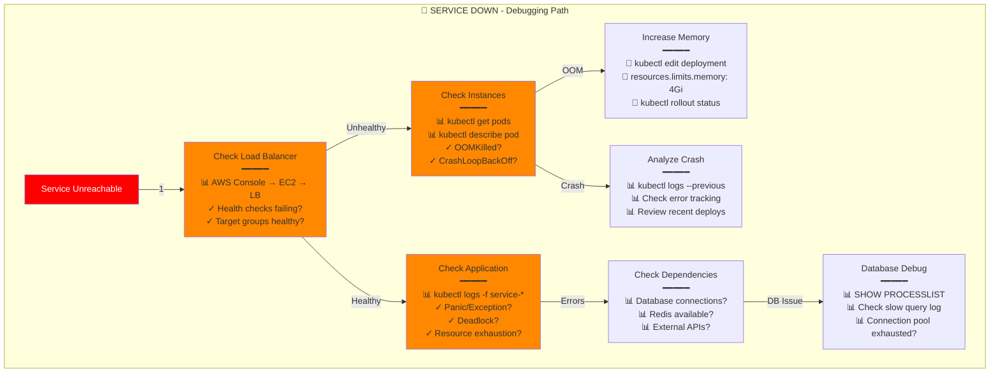
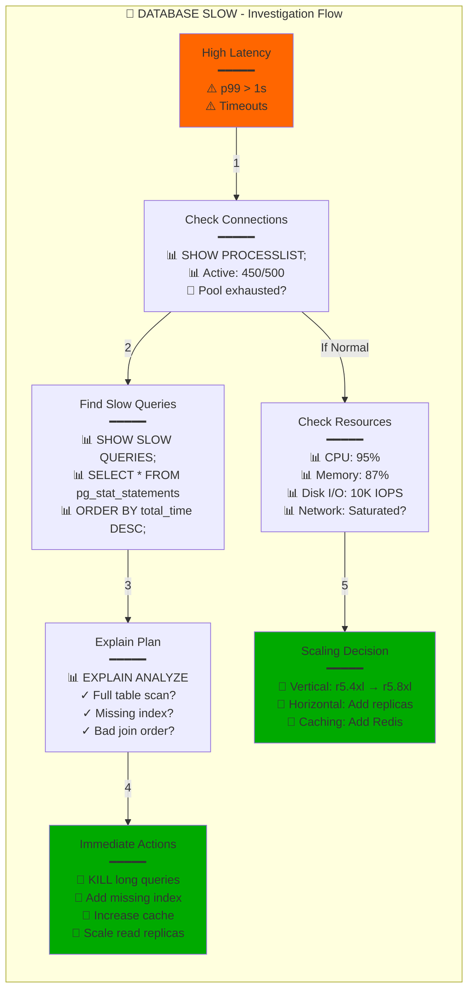
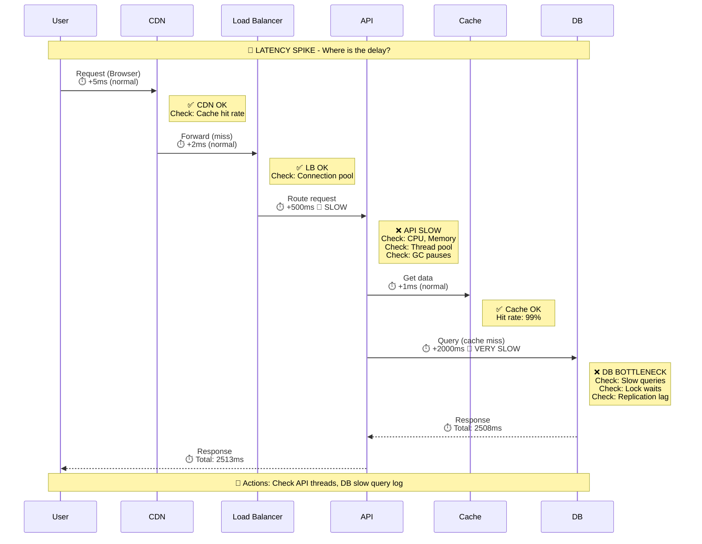
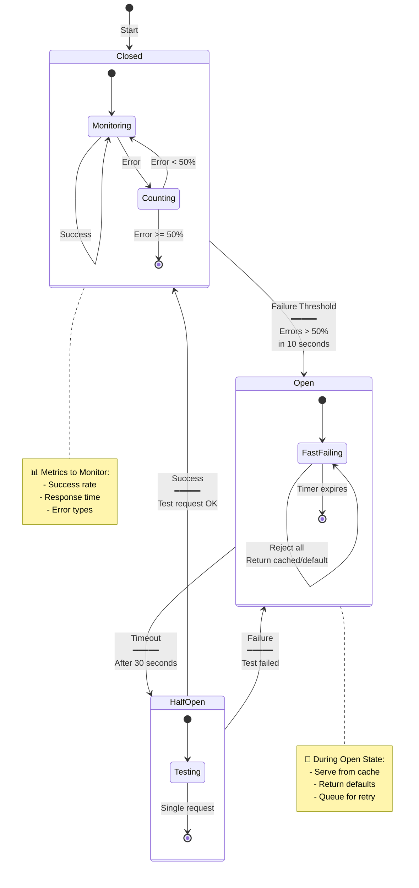
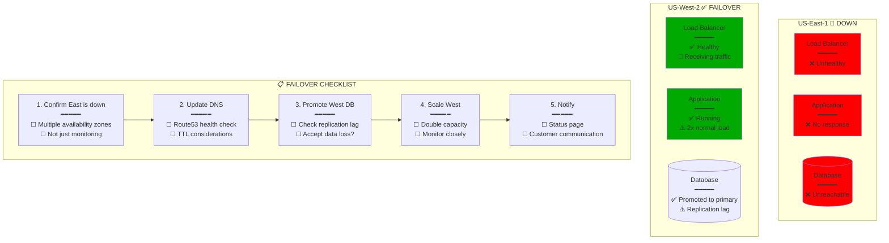
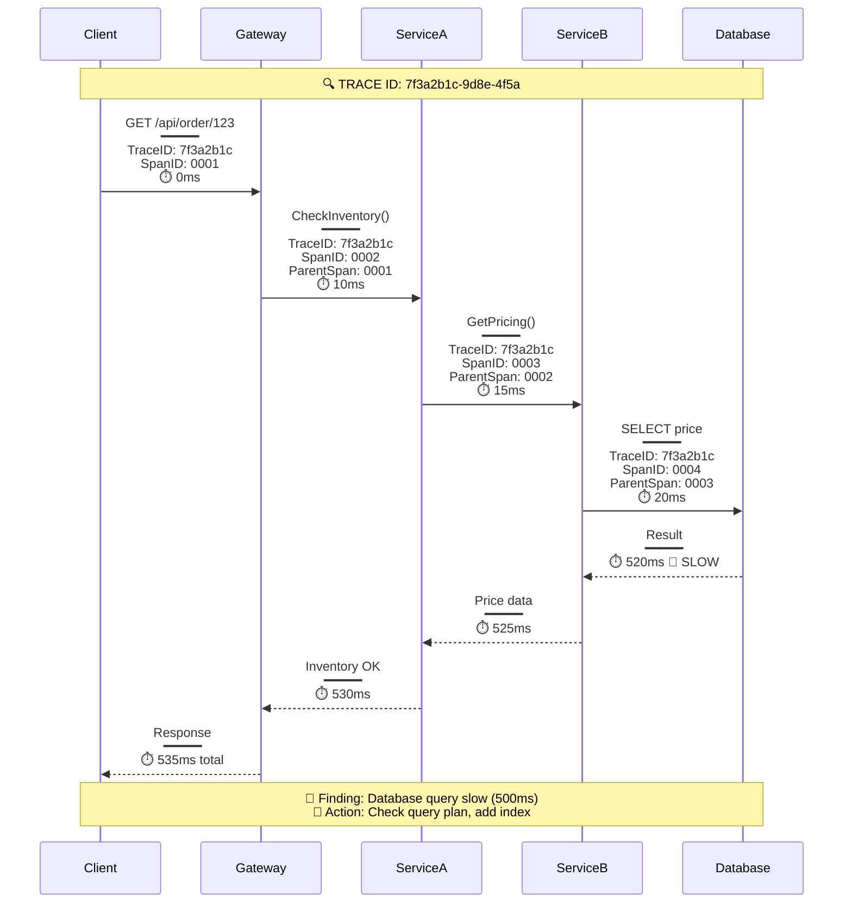

# Incident Response Diagram Templates
## For When Production is on Fire at 3 AM

### 🚨 Template 1: Service Down - Where to Look



### 🔥 Template 2: Database is Slow



### ⚡ Template 3: Latency Spike - Trace the Path



### 💥 Template 4: Cascade Failure Pattern

```mermaid
graph TB
    subgraph "⚡ CASCADE FAILURE - Timeline"
        T0[Initial Trigger<br/>━━━━━<br/>12:00 - DB replica lag<br/>Lag: 5s → 60s] -->|Slow reads| T1[Service Degradation<br/>━━━━━<br/>12:02 - API timeouts<br/>Error rate: 0.1% → 5%]

        T1 -->|Retries| T2[Load Amplification<br/>━━━━━<br/>12:03 - Retry storm<br/>Request rate: 10K → 50K/s]

        T2 -->|Overload| T3[Service A Fails<br/>━━━━━<br/>12:05 - Circuit breaker open<br/>Availability: 0%]

        T3 -->|Dependency| T4[Service B Fails<br/>━━━━━<br/>12:06 - Dependent on A<br/>Availability: 0%]

        T4 -->|Cascade| T5[Service C Fails<br/>━━━━━<br/>12:07 - Dependent on B<br/>Availability: 0%]

        T5 -->|Platform Down| T6[Full Outage<br/>━━━━━<br/>12:10 - All services affected<br/>Impact: 100% users]
    end

    subgraph "🔧 RECOVERY SEQUENCE"
        R1[Stop Incoming Traffic<br/>━━━━━<br/>🔧 Enable maintenance mode]
        R2[Fix Root Cause<br/>━━━━━<br/>🔧 Restart DB replica]
        R3[Reset Circuit Breakers<br/>━━━━━<br/>🔧 Clear error counts]
        R4[Gradual Traffic Ramp<br/>━━━━━<br/>🔧 10% → 25% → 50% → 100%]

        R1 --> R2 --> R3 --> R4
    end

    style T0 fill:#ffaa00
    style T3 fill:#ff0000
    style T6 fill:#cc0000
    style R1 fill:#00aa00
```



### 🔄 Template 5: Circuit Breaker States



### 📊 Template 6: Memory Leak Detection

```mermaid
graph LR
    subgraph "💾 MEMORY LEAK - Investigation"
        Start[OOM Kills<br/>━━━━━<br/>Pods restarting<br/>Every 2-3 hours] --> Heap[Heap Dump<br/>━━━━━<br/>📊 jmap -dump:format=b,file=/tmp/heap.hprof PID<br/>📊 kubectl cp pod:/tmp/heap.hprof ./heap.hprof]

        Heap --> Analyze[Analyze Heap<br/>━━━━━<br/>🔧 Eclipse MAT<br/>🔧 jhat heap.hprof<br/>📊 Dominator tree<br/>📊 Leak suspects]

        Analyze --> Found[Found Leak<br/>━━━━━<br/>📍 HashMap growing<br/>📍 Connection pool<br/>📍 Cache unbounded]

        Found --> Fix[Fix & Deploy<br/>━━━━━<br/>🔧 Add size limit<br/>🔧 Implement LRU<br/>🔧 Close connections<br/>🔧 Deploy canary]

        Start --> Metrics[Memory Metrics<br/>━━━━━<br/>📊 kubectl top pods<br/>📊 Grafana dashboard<br/>📊 Linear growth?]

        Metrics --> Profile[Profiling<br/>━━━━━<br/>🔧 async-profiler<br/>🔧 pprof (Go)<br/>🔧 memory_profiler (Python)]
    end

    style Start fill:#ff6600
    style Fix fill:#00aa00
```

### 🌐 Template 7: Multi-Region Failure



### 🔍 Template 8: Distributed Tracing Debug



---

## 🎯 Usage Guidelines

### When to Use Each Template

| Template | Scenario | Key Metrics |
|----------|----------|-------------|
| Service Down | Complete outage | Health checks, pod status |
| Database Slow | High latency | Query time, connections |
| Latency Spike | Performance degradation | p50, p99, p99.9 |
| Cascade Failure | Spreading outage | Error rates, dependencies |
| Circuit Breaker | Service protection | Failure %, state transitions |
| Memory Leak | OOM kills | Heap size, GC time |
| Multi-Region | DR scenario | RPO, RTO, data loss |
| Distributed Trace | Complex flows | Span timings, bottlenecks |

### Customization Required

For each template:
1. Replace generic names with actual service names
2. Add real metrics from your monitoring
3. Include specific commands for your environment
4. Link to your runbooks and dashboards

### Quality Checklist

- [ ] Shows clear debugging path
- [ ] Includes actual commands to run
- [ ] Has specific metrics to check
- [ ] Provides immediate actions
- [ ] References monitoring tools
- [ ] Helps at 3 AM when tired

---

## 🚨 Remember

**These diagrams are for emergencies.**

They should be:
- **Actionable**: Every box has a command or check
- **Specific**: No generic "check database"
- **Sequential**: Clear order of investigation
- **Practical**: Based on real incidents

**If it doesn't reduce MTTR, it doesn't belong here.**