# Case Studies

Real-world production architectures from companies handling massive scale.

## Netflix: Global Video Streaming

Netflix serves 200M+ subscribers with 99.99% uptime during 15% of global internet traffic.

### Complete Architecture

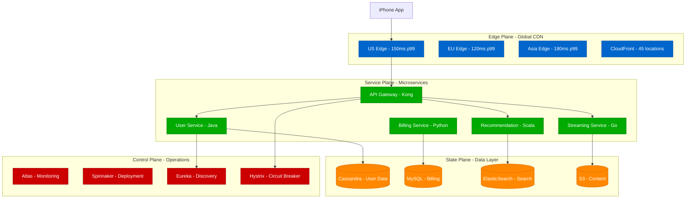

### Global Content Distribution

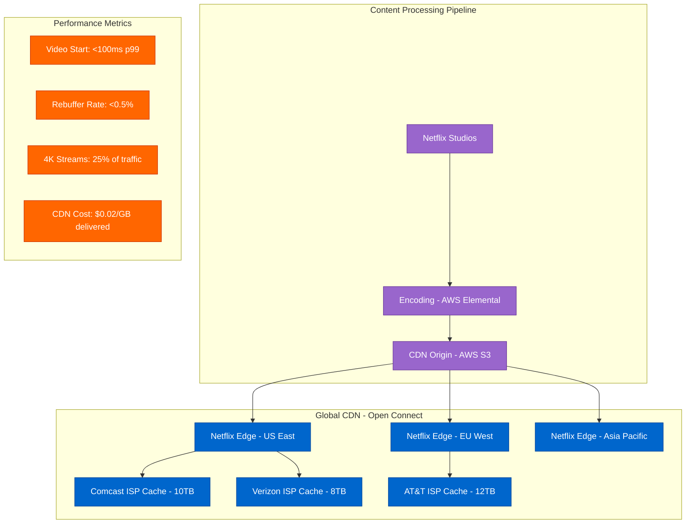

### Chaos Engineering Architecture

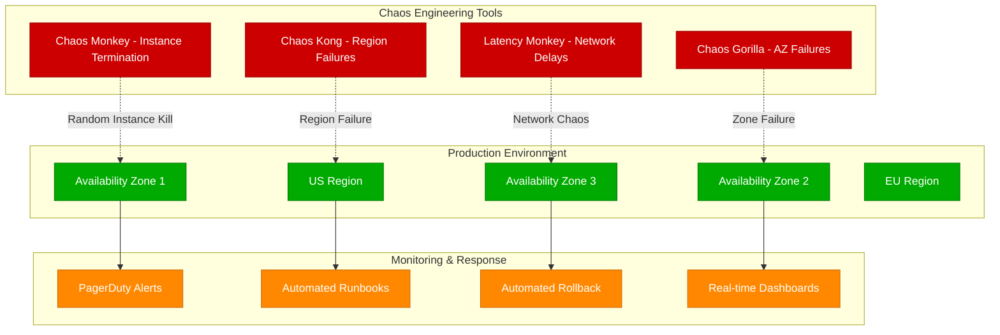

### Cost & Scale Metrics

| Component | Technology | Scale | Cost/Month | SLA |
|-----------|------------|--------|------------|-----|
| CDN | Open Connect | 45 locations | $15M | 99.95% |
| Compute | AWS EC2 | 100K+ instances | $25M | 99.9% |
| Storage | AWS S3 | 100PB+ content | $5M | 99.99% |
| Database | Cassandra | 1000+ nodes | $3M | 99.95% |
| Monitoring | Atlas | 2M+ metrics/sec | $1M | 99.9% |

---

## Uber: Real-time Matching Platform

Uber matches 100M+ users with <5 second latency across 60+ countries using geospatial indexing.

### Complete Architecture

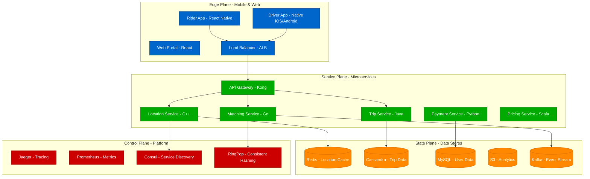

### Real-time Matching Algorithm

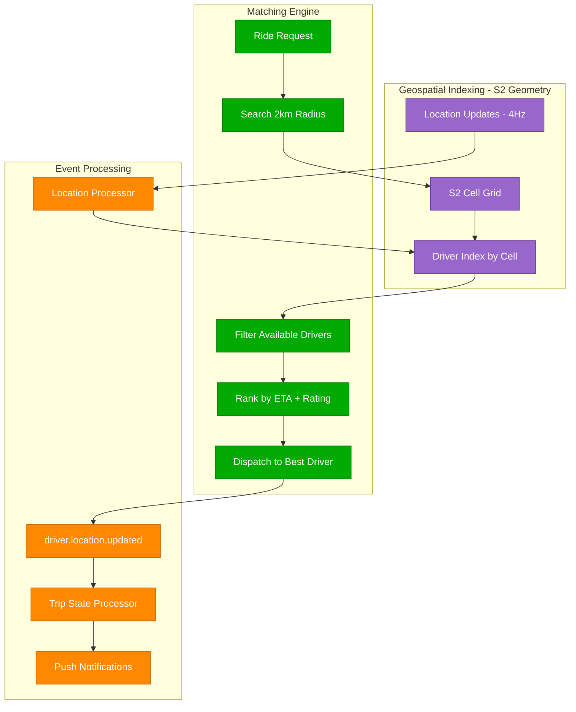

### Evolution from Monolith to Microservices

```mermaid
graph TB
    subgraph Phase1[Phase 1: Monolith (2009-2013)]
        MONO[Single Python App]
        MONO_DB[(Single PostgreSQL)]
        PROB1[Problems: Single Point of Failure]
        PROB2[Deployment Bottlenecks]
    end

    subgraph Phase2[Phase 2: SOA (2013-2016)]
        USER_SVC[User Service]
        TRIP_SVC[Trip Service]
        PAY_SVC[Payment Service]
        MATCH_SVC[Matching Service]
        HTTP[HTTP/REST APIs]
    end

    subgraph Phase3[Phase 3: Platform (2016+)]
        MESH[Service Mesh - Envoy]
        PLATFORM[Platform Services]
        OBSERVABILITY[Distributed Tracing]
        ASYNC[Event-Driven Architecture]
    end

    Phase1 --> Phase2
    Phase2 --> Phase3

    classDef phase1Style fill:#CC0000,stroke:#990000,color:#fff
    classDef phase2Style fill:#FF8800,stroke:#CC6600,color:#fff
    classDef phase3Style fill:#00AA00,stroke:#007700,color:#fff

    class MONO,MONO_DB,PROB1,PROB2 phase1Style
    class USER_SVC,TRIP_SVC,PAY_SVC,MATCH_SVC,HTTP phase2Style
    class MESH,PLATFORM,OBSERVABILITY,ASYNC phase3Style
```

### Hot Partition Handling

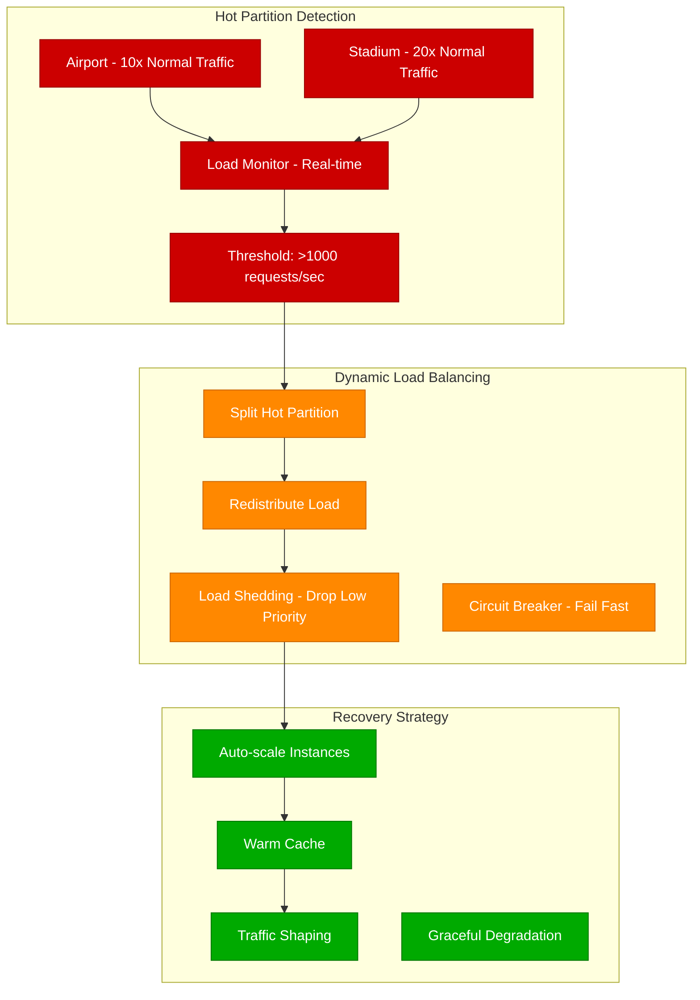

### Cost & Performance Metrics

| Component | Technology | Scale | Latency | Cost/Month |
|-----------|------------|--------|---------|------------|
| Matching | Go Services | 1M matches/hour | <3s p99 | $2M |
| Location | C++ Services | 10M updates/sec | <50ms p99 | $5M |
| Database | Cassandra | 500TB data | <10ms read | $1.5M |
| Cache | Redis Cluster | 100TB memory | <1ms p99 | $800K |
| CDN | CloudFlare | 50 regions | <100ms p99 | $500K |

---

## Amazon: E-commerce Platform

Amazon handles 1B+ items with 99.95% uptime where every minute down costs $1M during Prime Day.

### Complete Architecture

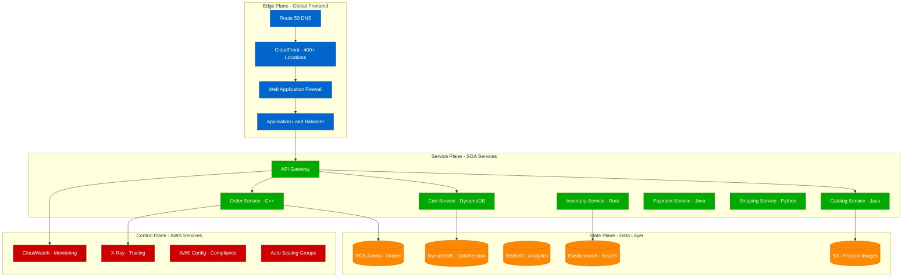

### Prime Day Traffic Handling

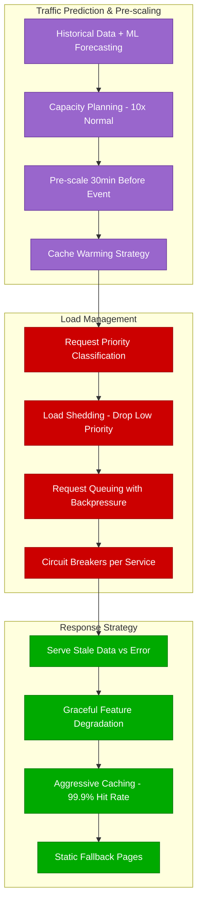

### Shopping Cart Architecture

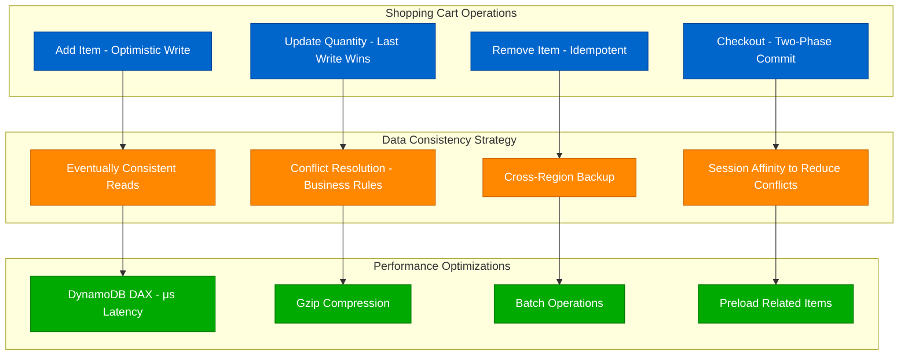

### Recommendation Engine Pipeline

```mermaid
graph LR
    subgraph DataIngestion[Data Ingestion - Real-time]
        CLICK[Click Events - 100M/hour]
        VIEW[Page Views - 500M/hour]
        PURCHASE[Purchases - 10M/hour]
        KINESIS[Kinesis Data Streams]
    end

    subgraph Processing[ML Processing Pipeline]
        SPARK[Spark Streaming - Feature Extraction]
        SAGEMAKER[SageMaker - Model Training]
        LAMBDA[Lambda - Real-time Inference]
        BATCH[EMR - Batch Processing]
    end

    subgraph Serving[Recommendation Serving]
        ELASTICACHE[ElastiCache - Hot Recommendations]
        PERSONALIZE[Amazon Personalize - Real-time API]
        AB_TEST[A/B Testing Framework]
        FALLBACK[Fallback to Popular Items]
    end

    CLICK --> KINESIS
    VIEW --> KINESIS
    PURCHASE --> KINESIS
    KINESIS --> SPARK

    SPARK --> SAGEMAKER
    SAGEMAKER --> LAMBDA
    LAMBDA --> ELASTICACHE
    SPARK --> BATCH

    ELASTICACHE --> PERSONALIZE
    PERSONALIZE --> AB_TEST
    AB_TEST --> FALLBACK

    classDef dataStyle fill:#FF8800,stroke:#CC6600,color:#fff
    classDef processStyle fill:#9966CC,stroke:#663399,color:#fff
    classDef servingStyle fill:#00AA00,stroke:#007700,color:#fff

    class CLICK,VIEW,PURCHASE,KINESIS dataStyle
    class SPARK,SAGEMAKER,LAMBDA,BATCH processStyle
    class ELASTICACHE,PERSONALIZE,AB_TEST,FALLBACK servingStyle
```

### Cost & Performance Metrics

| Component | Technology | Scale | Availability | Cost/Month |
|-----------|------------|--------|--------------|------------|
| CDN | CloudFront | 400+ locations | 99.99% | $50M |
| Compute | EC2 + Lambda | 1M+ instances | 99.9% | $200M |
| Database | DynamoDB | 100TB+ | 99.99% | $30M |
| Storage | S3 | 1000PB+ | 99.999% | $20M |
| Analytics | Redshift | 100PB warehouse | 99.9% | $10M |

---

## WhatsApp: Global Messaging Platform

### The Challenge
- **Scale**: 2B+ users, 100B+ messages/day
- **Latency**: <100ms message delivery globally
- **Team Size**: 50 engineers (acquired by Facebook)
- **Reliability**: 99.9% uptime for real-time communication

### Minimalist Architecture

#### Core Philosophy
```python
# WhatsApp's engineering principles
principles = {
    "simple_is_better": "Avoid unnecessary complexity",
    "erlang_for_concurrency": "Actor model for massive concurrency", 
    "minimal_team": "Small team, focused execution",
    "proven_tech": "Use battle-tested technology"
}
```

#### Technology Stack
```yaml
backend: Erlang/OTP
database: Mnesia (distributed Erlang DB)
messaging: XMPP protocol (customized)
load_balancer: FreeBSD + nginx
monitoring: Custom Erlang tools
```

### Message Delivery Pipeline

#### Actor-based Architecture
```erlang
% Simplified Erlang pseudocode
-module(message_router).

% Each user connection is an actor/process
handle_message(From, To, Message) ->
    % Find target user's connection
    case user_registry:lookup(To) of
        {ok, ConnectionPid} ->
            % Send directly to user's connection process
            ConnectionPid ! {deliver_message, From, Message},
            {ok, delivered};
        {error, not_connected} ->
            % Store for later delivery
            offline_storage:store(To, From, Message),
            {ok, stored}
    end.
```

**Key Advantages**:
- **Massive Concurrency**: Millions of lightweight processes
- **Fault Isolation**: One user failure doesn't affect others
- **Hot Code Swapping**: Update code without downtime

#### Global Distribution
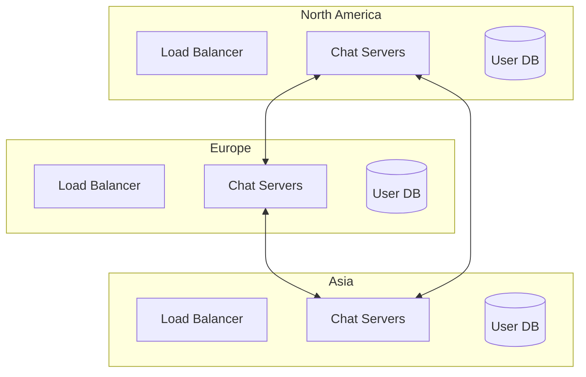

**Patterns Used**:
- **Geographic Partitioning**: Users routed to nearest data center
- **Peer-to-Peer**: Direct server-to-server messaging
- **Eventual Consistency**: Message ordering eventual across regions

### Scaling Techniques

#### Connection Management
```erlang
% Connection pooling per server
-record(connection_pool, {
    active_connections = 0,
    max_connections = 1000000,  % 1M connections per server
    connection_pids = []
}).

handle_new_connection(Socket) ->
    case connection_pool:can_accept() of
        true ->
            % Spawn new process for this connection
            Pid = spawn(fun() -> handle_user_session(Socket) end),
            connection_pool:add(Pid),
            {ok, accepted};
        false ->
            % Gracefully reject with retry-after
            {error, server_full}
    end.
```

#### Message Storage
```erlang
% Simple but effective message storage
store_message(UserId, FromUser, Message) ->
    % Partition by user ID hash
    Shard = hash(UserId) rem num_shards(),
    
    % Store in memory-mapped file for fast access
    Storage = storage_shard:get(Shard),
    MessageId = generate_id(),
    
    % Write to log-structured storage
    storage:append(Storage, {MessageId, UserId, FromUser, Message, timestamp()}).
```

### Performance Optimizations

#### Memory Management
```erlang
% Aggressive garbage collection tuning
gc_settings() ->
    % Small heap sizes force frequent GC
    % Prevents long GC pauses that would affect latency
    [{min_heap_size, 233},
     {min_bin_vheap_size, 46422},
     {fullsweep_after, 10}].
```

#### Network Optimization
```python
# Connection optimization techniques
class ConnectionOptimization:
    def optimize_tcp_stack(self):
        # Disable Nagle's algorithm for low latency
        socket.setsockopt(socket.IPPROTO_TCP, socket.TCP_NODELAY, 1)
        
        # Large receive buffers
        socket.setsockopt(socket.SOL_SOCKET, socket.SO_RCVBUF, 8192000)
        
        # Keep connections alive
        socket.setsockopt(socket.SOL_SOCKET, socket.SO_KEEPALIVE, 1)
```

### Key Learnings
1. **Technology Matters**: Erlang's actor model perfect for messaging
2. **Simple Wins**: Avoid over-engineering, focus on core functionality
3. **Vertical Scaling**: Better to scale up than out for simpler operations
4. **Measure Relentlessly**: Profile every bottleneck

---

## Common Patterns Across All Case Studies

### 1. Evolution Over Revolution
- Start simple, evolve architecture as you scale
- Monolith → Services → Platform is common progression
- Premature optimization is root of many problems

### 2. Observability is Critical  
- Comprehensive monitoring and alerting
- Distributed tracing for debugging
- Real-time dashboards for operations

### 3. Failure is Normal
- Design for failure, not perfect operation
- Circuit breakers and bulkheads for isolation
- Chaos engineering to find weaknesses

### 4. Conway's Law Always Applies
- System architecture reflects team structure
- Invest in team organization and communication
- Service boundaries often follow team boundaries

### 5. Trade-offs Are Unavoidable
- No silver bullets in distributed systems
- CAP theorem forces hard choices
- Optimize for your specific requirements

These case studies show that while the specific technologies vary, the fundamental patterns and principles remain consistent across different domains and scales.