# Case Studies

Real-world production architectures from companies handling massive scale.

## Netflix: Global Video Streaming

Netflix serves 200M+ subscribers with 99.99% uptime during 15% of global internet traffic.

### Complete Architecture

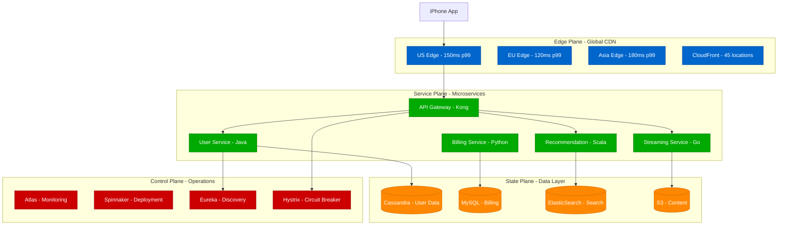

### Global Content Distribution

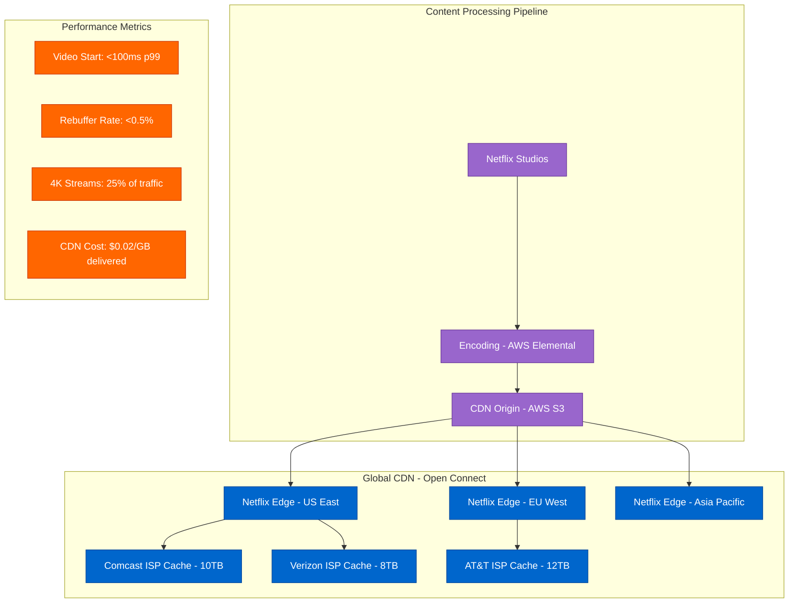

### Chaos Engineering Architecture

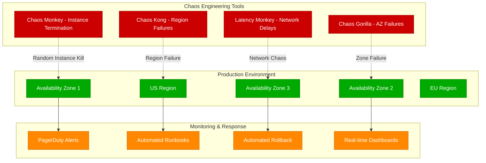

### Cost & Scale Metrics

| Component | Technology | Scale | Cost/Month | SLA |
|-----------|------------|--------|------------|-----|
| CDN | Open Connect | 45 locations | $15M | 99.95% |
| Compute | AWS EC2 | 100K+ instances | $25M | 99.9% |
| Storage | AWS S3 | 100PB+ content | $5M | 99.99% |
| Database | Cassandra | 1000+ nodes | $3M | 99.95% |
| Monitoring | Atlas | 2M+ metrics/sec | $1M | 99.9% |

---

## Uber: Real-time Matching Platform

Uber matches 100M+ users with <5 second latency across 60+ countries using geospatial indexing.

### Complete Architecture

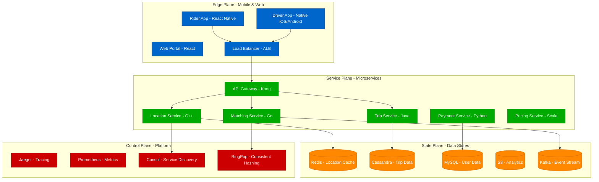

### Real-time Matching Algorithm

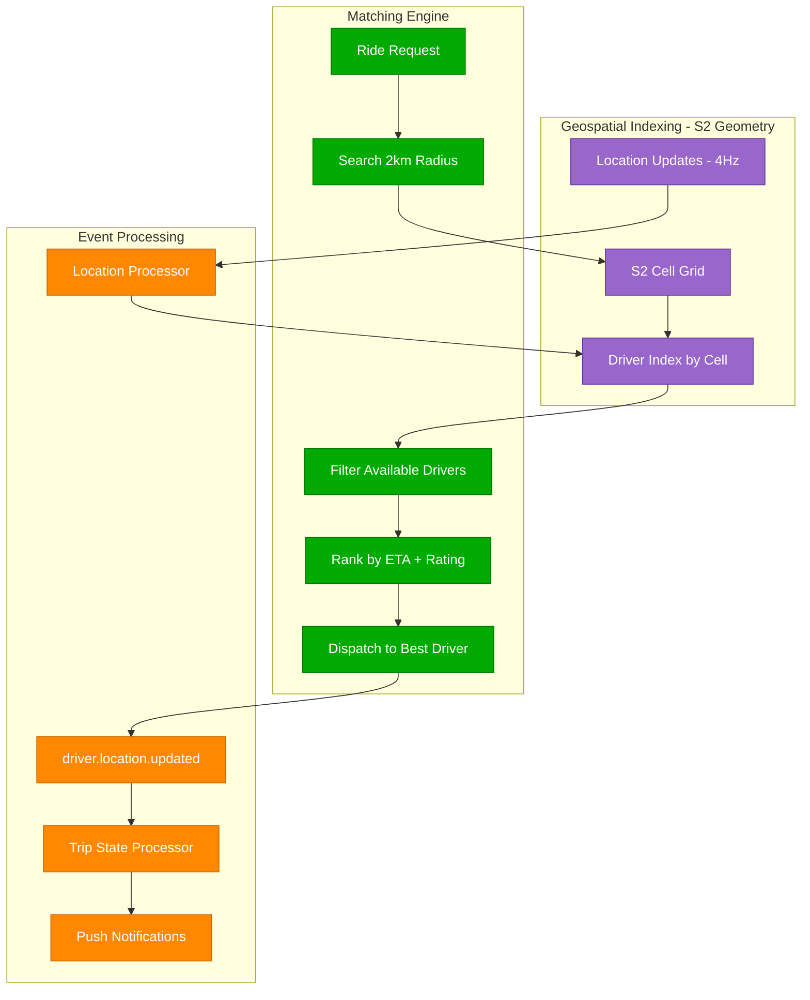

### Evolution from Monolith to Microservices

```mermaid
graph TB
    subgraph Phase1[Phase 1: Monolith (2009-2013)]
        MONO[Single Python App]
        MONO_DB[(Single PostgreSQL)]
        PROB1[Problems: Single Point of Failure]
        PROB2[Deployment Bottlenecks]
    end

    subgraph Phase2[Phase 2: SOA (2013-2016)]
        USER_SVC[User Service]
        TRIP_SVC[Trip Service]
        PAY_SVC[Payment Service]
        MATCH_SVC[Matching Service]
        HTTP[HTTP/REST APIs]
    end

    subgraph Phase3[Phase 3: Platform (2016+)]
        MESH[Service Mesh - Envoy]
        PLATFORM[Platform Services]
        OBSERVABILITY[Distributed Tracing]
        ASYNC[Event-Driven Architecture]
    end

    Phase1 --> Phase2
    Phase2 --> Phase3

    classDef phase1Style fill:#CC0000,stroke:#990000,color:#fff
    classDef phase2Style fill:#FF8800,stroke:#CC6600,color:#fff
    classDef phase3Style fill:#00AA00,stroke:#007700,color:#fff

    class MONO,MONO_DB,PROB1,PROB2 phase1Style
    class USER_SVC,TRIP_SVC,PAY_SVC,MATCH_SVC,HTTP phase2Style
    class MESH,PLATFORM,OBSERVABILITY,ASYNC phase3Style
```

### Hot Partition Handling

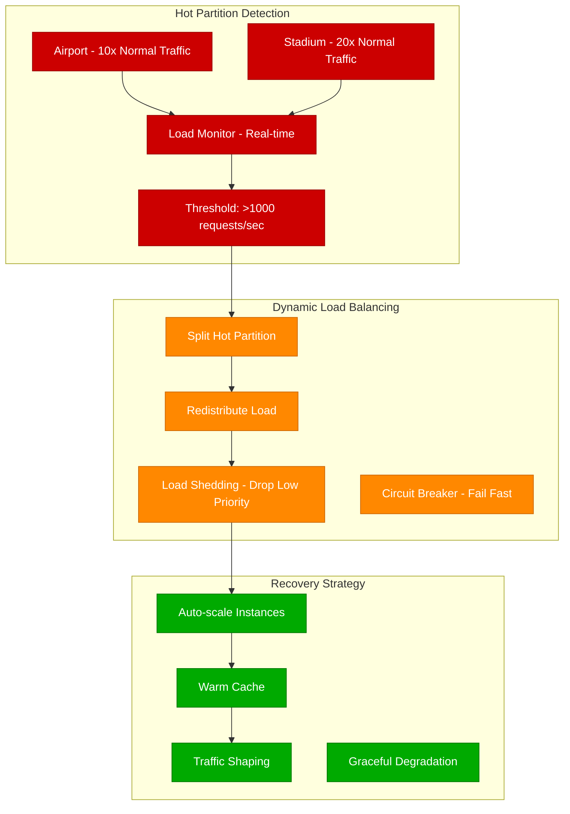

### Cost & Performance Metrics

| Component | Technology | Scale | Latency | Cost/Month |
|-----------|------------|--------|---------|------------|
| Matching | Go Services | 1M matches/hour | <3s p99 | $2M |
| Location | C++ Services | 10M updates/sec | <50ms p99 | $5M |
| Database | Cassandra | 500TB data | <10ms read | $1.5M |
| Cache | Redis Cluster | 100TB memory | <1ms p99 | $800K |
| CDN | CloudFlare | 50 regions | <100ms p99 | $500K |

---

## Amazon: E-commerce Platform

Amazon handles 1B+ items with 99.95% uptime where every minute down costs $1M during Prime Day.

### Complete Architecture

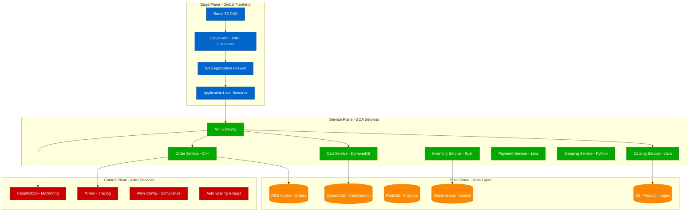

### Prime Day Traffic Handling

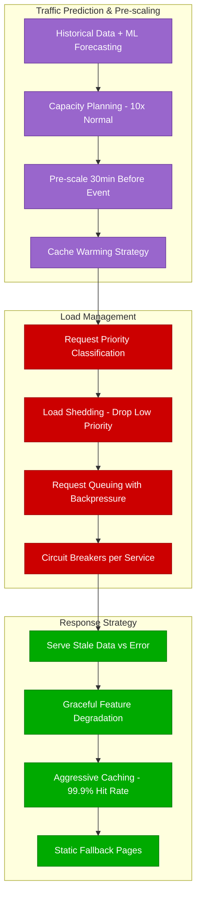

### Shopping Cart Architecture

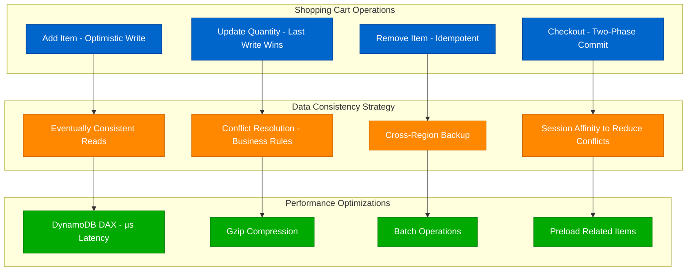

### Recommendation Engine Pipeline

```mermaid
graph LR
    subgraph DataIngestion[Data Ingestion - Real-time]
        CLICK[Click Events - 100M/hour]
        VIEW[Page Views - 500M/hour]
        PURCHASE[Purchases - 10M/hour]
        KINESIS[Kinesis Data Streams]
    end

    subgraph Processing[ML Processing Pipeline]
        SPARK[Spark Streaming - Feature Extraction]
        SAGEMAKER[SageMaker - Model Training]
        LAMBDA[Lambda - Real-time Inference]
        BATCH[EMR - Batch Processing]
    end

    subgraph Serving[Recommendation Serving]
        ELASTICACHE[ElastiCache - Hot Recommendations]
        PERSONALIZE[Amazon Personalize - Real-time API]
        AB_TEST[A/B Testing Framework]
        FALLBACK[Fallback to Popular Items]
    end

    CLICK --> KINESIS
    VIEW --> KINESIS
    PURCHASE --> KINESIS
    KINESIS --> SPARK

    SPARK --> SAGEMAKER
    SAGEMAKER --> LAMBDA
    LAMBDA --> ELASTICACHE
    SPARK --> BATCH

    ELASTICACHE --> PERSONALIZE
    PERSONALIZE --> AB_TEST
    AB_TEST --> FALLBACK

    classDef dataStyle fill:#FF8800,stroke:#CC6600,color:#fff
    classDef processStyle fill:#9966CC,stroke:#663399,color:#fff
    classDef servingStyle fill:#00AA00,stroke:#007700,color:#fff

    class CLICK,VIEW,PURCHASE,KINESIS dataStyle
    class SPARK,SAGEMAKER,LAMBDA,BATCH processStyle
    class ELASTICACHE,PERSONALIZE,AB_TEST,FALLBACK servingStyle
```

### Cost & Performance Metrics

| Component | Technology | Scale | Availability | Cost/Month |
|-----------|------------|--------|--------------|------------|
| CDN | CloudFront | 400+ locations | 99.99% | $50M |
| Compute | EC2 + Lambda | 1M+ instances | 99.9% | $200M |
| Database | DynamoDB | 100TB+ | 99.99% | $30M |
| Storage | S3 | 1000PB+ | 99.999% | $20M |
| Analytics | Redshift | 100PB warehouse | 99.9% | $10M |

---

## WhatsApp: Global Messaging Platform

WhatsApp delivers 100B+ messages/day to 2B users with just 50 engineers using Erlang's actor model.

### Complete Architecture

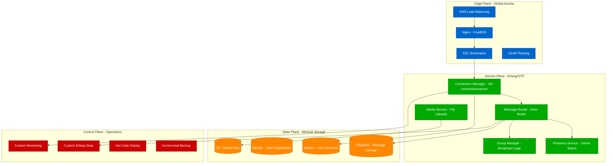

### Actor Model Message Delivery

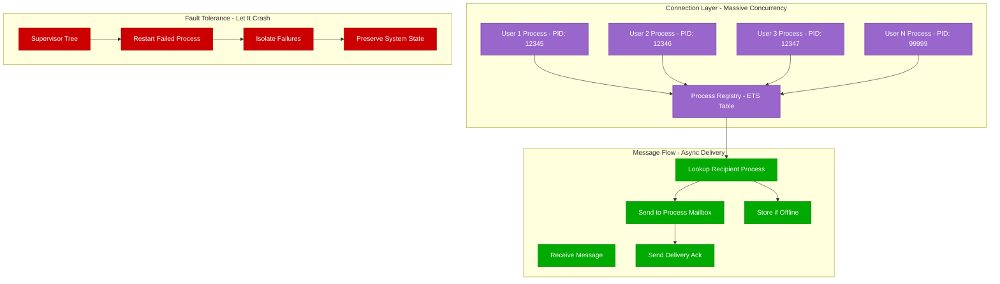

### Global Distribution Strategy

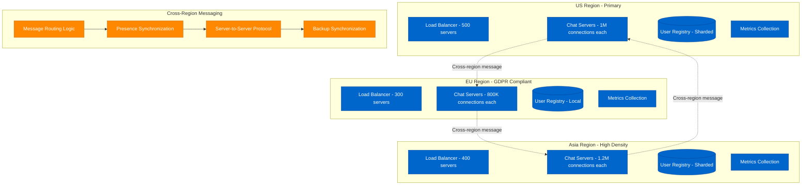

### Performance Optimizations

```mermaid
graph TB
    subgraph MemoryOpt[Memory Optimization - Aggressive GC]
        SMALL_HEAP[Small Heap Sizes - 233 words]
        FREQ_GC[Frequent GC - Every 10 operations]
        BINARY_OPT[Binary Optimization - Large binaries off-heap]
        SHARED_TERMS[Share Terms Between Processes]
    end

    subgraph NetworkOpt[Network Optimization - Low Latency]
        TCP_NODELAY[TCP_NODELAY - Disable Nagle]
        LARGE_BUFFERS[Large Socket Buffers - 8MB]
        KEEPALIVE[TCP Keepalive - Connection Health]
        COMPRESSION[Message Compression - Zlib]
    end

    subgraph ConcurrencyOpt[Concurrency Optimization]
        SCHEDULER[SMP Scheduler - Multi-core Usage]
        PROCESS_SPAWN[Fast Process Spawn - μs latency]
        MESSAGE_PASS[Message Passing - Copy-free]
        LOCK_FREE[Lock-free Data Structures]
    end

    SMALL_HEAP --> FREQ_GC
    FREQ_GC --> BINARY_OPT
    BINARY_OPT --> SHARED_TERMS

    TCP_NODELAY --> LARGE_BUFFERS
    LARGE_BUFFERS --> KEEPALIVE
    KEEPALIVE --> COMPRESSION

    SCHEDULER --> PROCESS_SPAWN
    PROCESS_SPAWN --> MESSAGE_PASS
    MESSAGE_PASS --> LOCK_FREE

    classDef memStyle fill:#9966CC,stroke:#663399,color:#fff
    classDef netStyle fill:#0066CC,stroke:#004499,color:#fff
    classDef concStyle fill:#00AA00,stroke:#007700,color:#fff

    class SMALL_HEAP,FREQ_GC,BINARY_OPT,SHARED_TERMS memStyle
    class TCP_NODELAY,LARGE_BUFFERS,KEEPALIVE,COMPRESSION netStyle
    class SCHEDULER,PROCESS_SPAWN,MESSAGE_PASS,LOCK_FREE concStyle
```

### Cost & Performance Metrics

| Component | Technology | Scale | Latency | Cost/Month |
|-----------|------------|--------|---------|------------|
| Servers | FreeBSD | 1200 servers | <50ms p99 | $2M |
| Connections | Erlang/OTP | 2B concurrent | <10ms local | $500K |
| Storage | Custom | 1PB messages | <1ms write | $200K |
| Bandwidth | Global ISPs | 100Gbps peak | Regional | $1M |
| Team | Engineers | 50 people | 24/7 support | $800K |

---

## Architecture Patterns Summary

### Common Evolution Path

```mermaid
graph LR
    subgraph Phase1[Phase 1: Startup (0-1M users)]
        MONOLITH[Monolithic Application]
        SINGLE_DB[(Single Database)]
        SIMPLE[Simple Deployment]
    end

    subgraph Phase2[Phase 2: Growth (1M-10M users)]
        SERVICES[Microservices]
        MULTI_DB[(Multiple Databases)]
        LOAD_BAL[Load Balancers]
    end

    subgraph Phase3[Phase 3: Scale (10M-100M users)]
        PLATFORM[Platform Services]
        SHARDED[(Sharded Data)]
        REGIONS[Multi-Region]
    end

    subgraph Phase4[Phase 4: Global (100M+ users)]
        ECOSYSTEM[Service Ecosystem]
        GLOBAL_DB[(Global Distribution)]
        EDGE[Edge Computing]
    end

    Phase1 --> Phase2
    Phase2 --> Phase3
    Phase3 --> Phase4

    classDef phase1Style fill:#CC0000,stroke:#990000,color:#fff
    classDef phase2Style fill:#FF8800,stroke:#CC6600,color:#fff
    classDef phase3Style fill:#00AA00,stroke:#007700,color:#fff
    classDef phase4Style fill:#0066CC,stroke:#004499,color:#fff

    class MONOLITH,SINGLE_DB,SIMPLE phase1Style
    class SERVICES,MULTI_DB,LOAD_BAL phase2Style
    class PLATFORM,SHARDED,REGIONS phase3Style
    class ECOSYSTEM,GLOBAL_DB,EDGE phase4Style
```

### Universal Principles

| Principle | Netflix | Uber | Amazon | WhatsApp |
|-----------|---------|------|--------|----------|
| **Embrace Failure** | Chaos Engineering | Circuit Breakers | Load Shedding | Let It Crash |
| **Eventual Consistency** | Multi-region CDN | Location Updates | Shopping Cart | Message Delivery |
| **Horizontal Scaling** | Microservices | Geospatial Sharding | Service-Oriented | Process Per User |
| **Observability** | Atlas + Jaeger | Prometheus + Jaeger | CloudWatch + X-Ray | Custom Erlang Tools |
| **Automation** | Spinnaker CI/CD | Auto-scaling | Infrastructure as Code | Hot Code Deploy |

These companies demonstrate that while technologies differ, fundamental distributed systems principles remain constant across domains and scales.