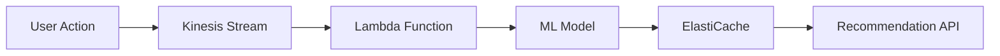

# Case Studies

Real-world production architectures from companies handling massive scale.

## Netflix: Global Video Streaming

Netflix serves 200M+ subscribers with 99.99% uptime during 15% of global internet traffic.

### Complete Architecture


### Global Content Distribution


### Chaos Engineering Architecture


### Cost & Scale Metrics

| Component | Technology | Scale | Cost/Month | SLA |
|-----------|------------|--------|------------|-----|
| CDN | Open Connect | 45 locations | $15M | 99.95% |
| Compute | AWS EC2 | 100K+ instances | $25M | 99.9% |
| Storage | AWS S3 | 100PB+ content | $5M | 99.99% |
| Database | Cassandra | 1000+ nodes | $3M | 99.95% |
| Monitoring | Atlas | 2M+ metrics/sec | $1M | 99.9% |

---

## Uber: Real-time Matching Platform

### The Challenge
- **Scale**: 100M+ active users
- **Latency**: <5 seconds to match rider with driver
- **Geographic**: 60+ countries with different regulations
- **Real-time**: Live location tracking for millions

### Architecture Evolution

#### Phase 1: Monolith (2009-2013)
```python
# Simple monolithic architecture
class UberMonolith:
    def request_ride(self, rider_location):
        drivers = self.find_nearby_drivers(rider_location)
        best_driver = self.select_optimal_driver(drivers)
        return self.create_trip(rider, best_driver)
```

**Problems at Scale**:
- Single point of failure
- Deployment bottlenecks  
- Technology lock-in
- Team scaling issues

#### Phase 2: Microservices (2013-2016)
```yaml
core_services:
  - rider_service
  - driver_service  
  - trip_service
  - pricing_service
  - matching_service
  - payment_service
  - notification_service

communication: synchronous_http
data_consistency: eventual
```

**Patterns Applied**:
- **Service Decomposition**: Domain-driven design
- **API Gateway**: External interface
- **Event-driven**: Pub/sub for real-time updates

#### Phase 3: Platform Architecture (2016+)
```yaml
platform_services:
  - identity_platform
  - payment_platform
  - notification_platform
  - maps_platform
  - forecasting_platform

service_mesh: envoy_proxy
observability: jaeger_tracing
reliability: circuit_breakers
```

### Real-time Matching Algorithm

#### Geospatial Indexing
```python
class GeospatialIndex:
    def __init__(self):
        # Use S2 geometry for Earth partitioning
        self.s2_index = S2Index()
    
    def find_nearby_drivers(self, rider_lat, rider_lng, radius_km):
        # Convert to S2 cell
        rider_cell = s2.S2LatLng.FromDegrees(rider_lat, rider_lng).ToPoint()
        
        # Find covering cells
        covering_cells = s2.S2RegionCoverer().GetCovering(
            s2.S2Cap.FromAxisHeight(rider_cell, radius_to_height(radius_km))
        )
        
        # Query drivers in those cells
        drivers = []
        for cell in covering_cells:
            drivers.extend(self.driver_index.get(cell.id(), []))
        
        return drivers
```

**Primitives Used**:
- **P1 Partitioning**: Geographic sharding by city
- **P4 Specialized Index**: Geospatial indexing (S2)
- **P11 Caching**: Driver location cache
- **P18 Gossip Protocol**: Driver state propagation

#### Event-driven Updates
```python
# Real-time location updates
class LocationService:
    def update_driver_location(self, driver_id, lat, lng):
        # Update primary storage
        self.driver_db.update(driver_id, lat, lng)
        
        # Publish event for real-time processing
        event = DriverLocationUpdated(driver_id, lat, lng, timestamp=now())
        self.event_bus.publish('driver.location.updated', event)
        
        # Update geospatial index
        self.geo_index.update(driver_id, lat, lng)
```

**Patterns Used**:
- **Outbox Pattern**: Atomic DB + event publishing
- **CQRS**: Separate write (location updates) from read (matching)
- **Event Sourcing**: Trip state as sequence of events

### Scaling Challenges Solved

#### Hot Partitions
**Problem**: Popular areas (airports, stadiums) create hotspots
**Solution**: Dynamic resharding + load shedding

```python
class DynamicSharding:
    def rebalance_if_needed(self, partition_id):
        load = self.monitor.get_partition_load(partition_id)
        if load > HOTSPOT_THRESHOLD:
            # Split hot partition
            new_partitions = self.split_partition(partition_id)
            self.redistribute_load(new_partitions)
```

#### Network Partitions
**Problem**: Different regions lose connectivity
**Solution**: Regional autonomy + eventual consistency

```python
class RegionalAutonomy:
    def handle_network_partition(self, region):
        if self.is_partitioned_from_global(region):
            # Switch to local-only mode
            self.enable_local_fallback(region)
            self.disable_cross_region_trips(region)
```

### Key Learnings
1. **Start Simple**: Monolith → microservices → platform
2. **Real-time is Hard**: Eventual consistency with compensations
3. **Geographic Matters**: Regional data sovereignty and performance
4. **Monitoring is Critical**: Real-time dashboards for operational awareness

---

## Amazon: E-commerce Platform

### The Challenge
- **Scale**: 1B+ items, 300M+ customers
- **Availability**: 99.95% uptime (every minute down = $1M lost)
- **Global**: 200+ countries with local requirements
- **Peak Load**: 10x normal traffic during Prime Day

### Architecture Principles

#### Service-Oriented Architecture (SOA)
Amazon pioneered microservices (called SOA) in early 2000s:

```yaml
mandate_from_bezos_2002:
  - All teams expose functionality through service interfaces
  - Teams must communicate through these interfaces
  - No direct linking, shared memory, or backdoors
  - All service interfaces must be externalizable
```

#### Ownership Model
```python
class AmazonServiceOwnership:
    ownership_rule = "You build it, you run it"
    
    responsibilities = [
        "Development",
        "Testing", 
        "Deployment",
        "Operations",
        "Monitoring",
        "Support"
    ]
```

### Core Patterns

#### Shopping Cart Service
```python
class ShoppingCartService:
    def __init__(self):
        # Optimistic approach - availability over consistency
        self.cart_store = DynamoDB()  # Eventually consistent
        
    def add_item(self, user_id, item_id, quantity):
        # Best effort - might have brief inconsistency
        try:
            cart = self.cart_store.get(user_id)
            cart.add_item(item_id, quantity)
            self.cart_store.put(user_id, cart)
            
            # Fire event for other services
            self.event_bus.publish(ItemAddedToCart(user_id, item_id))
            
        except Exception:
            # Log but don't fail - better to have working cart
            self.logger.error("Failed to add item", user_id, item_id)
```

**Patterns Used**:
- **Optimistic Concurrency**: Accept occasional conflicts
- **Circuit Breaker**: Fail fast on dependency issues
- **Bulkhead**: Isolate cart from other services

#### Inventory Management
```python
class InventoryService:
    def reserve_item(self, item_id, quantity):
        # Two-phase approach for accuracy
        try:
            # Phase 1: Check availability
            available = self.inventory_db.get_available(item_id)
            if available < quantity:
                return ReservationFailed("Insufficient inventory")
            
            # Phase 2: Create reservation with timeout
            reservation_id = self.create_reservation(
                item_id, quantity, ttl_minutes=15
            )
            
            return ReservationSuccess(reservation_id)
            
        except DatabaseError:
            # Fail closed - don't oversell
            return ReservationFailed("System temporarily unavailable")
```

**Primitives Used**:
- **P7 Idempotency**: Prevent double reservations
- **P13 Sharded Locks**: Reduce contention per item
- **P14 Write-Ahead Log**: Durability for inventory changes

#### Recommendation Engine


**Patterns Used**:
- **Lambda Architecture**: Batch + stream processing
- **CQRS**: Separate models for reads vs writes
- **Feature Flags**: A/B testing for recommendations

### Handling Peak Traffic

#### Auto Scaling Strategy
```python
class AutoScaling:
    def scale_decision(self, service_metrics):
        # Predictive scaling for known events
        if self.is_peak_event_approaching():
            return self.pre_scale_for_event()
        
        # Reactive scaling for unexpected load
        if service_metrics.cpu_usage > 70:
            return self.scale_out()
        elif service_metrics.cpu_usage < 30:
            return self.scale_in()
        
        return "no_action"
    
    def pre_scale_for_event(self):
        # Scale up 30 minutes before Prime Day
        return "scale_to_10x_capacity"
```

#### Load Shedding
```python
class LoadShedding:
    def handle_request(self, request):
        # Priority-based shedding
        if self.is_overloaded():
            if request.priority == "critical":
                return self.process_request(request)
            elif request.priority == "normal":
                if random.random() < 0.5:  # Drop 50%
                    return "Service temporarily unavailable"
                return self.process_request(request)
            else:  # Low priority
                return "Service temporarily unavailable"
        
        return self.process_request(request)
```

### Key Learnings
1. **Availability First**: Better to show stale data than error page
2. **Ownership Drives Quality**: Teams responsible for entire lifecycle
3. **Fail Fast**: Circuit breakers prevent cascade failures
4. **Measure Everything**: Data-driven decisions on performance

---

## WhatsApp: Global Messaging Platform

### The Challenge
- **Scale**: 2B+ users, 100B+ messages/day
- **Latency**: <100ms message delivery globally
- **Team Size**: 50 engineers (acquired by Facebook)
- **Reliability**: 99.9% uptime for real-time communication

### Minimalist Architecture

#### Core Philosophy
```python
# WhatsApp's engineering principles
principles = {
    "simple_is_better": "Avoid unnecessary complexity",
    "erlang_for_concurrency": "Actor model for massive concurrency", 
    "minimal_team": "Small team, focused execution",
    "proven_tech": "Use battle-tested technology"
}
```

#### Technology Stack
```yaml
backend: Erlang/OTP
database: Mnesia (distributed Erlang DB)
messaging: XMPP protocol (customized)
load_balancer: FreeBSD + nginx
monitoring: Custom Erlang tools
```

### Message Delivery Pipeline

#### Actor-based Architecture
```erlang
% Simplified Erlang pseudocode
-module(message_router).

% Each user connection is an actor/process
handle_message(From, To, Message) ->
    % Find target user's connection
    case user_registry:lookup(To) of
        {ok, ConnectionPid} ->
            % Send directly to user's connection process
            ConnectionPid ! {deliver_message, From, Message},
            {ok, delivered};
        {error, not_connected} ->
            % Store for later delivery
            offline_storage:store(To, From, Message),
            {ok, stored}
    end.
```

**Key Advantages**:
- **Massive Concurrency**: Millions of lightweight processes
- **Fault Isolation**: One user failure doesn't affect others
- **Hot Code Swapping**: Update code without downtime

#### Global Distribution


**Patterns Used**:
- **Geographic Partitioning**: Users routed to nearest data center
- **Peer-to-Peer**: Direct server-to-server messaging
- **Eventual Consistency**: Message ordering eventual across regions

### Scaling Techniques

#### Connection Management
```erlang
% Connection pooling per server
-record(connection_pool, {
    active_connections = 0,
    max_connections = 1000000,  % 1M connections per server
    connection_pids = []
}).

handle_new_connection(Socket) ->
    case connection_pool:can_accept() of
        true ->
            % Spawn new process for this connection
            Pid = spawn(fun() -> handle_user_session(Socket) end),
            connection_pool:add(Pid),
            {ok, accepted};
        false ->
            % Gracefully reject with retry-after
            {error, server_full}
    end.
```

#### Message Storage
```erlang
% Simple but effective message storage
store_message(UserId, FromUser, Message) ->
    % Partition by user ID hash
    Shard = hash(UserId) rem num_shards(),
    
    % Store in memory-mapped file for fast access
    Storage = storage_shard:get(Shard),
    MessageId = generate_id(),
    
    % Write to log-structured storage
    storage:append(Storage, {MessageId, UserId, FromUser, Message, timestamp()}).
```

### Performance Optimizations

#### Memory Management
```erlang
% Aggressive garbage collection tuning
gc_settings() ->
    % Small heap sizes force frequent GC
    % Prevents long GC pauses that would affect latency
    [{min_heap_size, 233},
     {min_bin_vheap_size, 46422},
     {fullsweep_after, 10}].
```

#### Network Optimization
```python
# Connection optimization techniques
class ConnectionOptimization:
    def optimize_tcp_stack(self):
        # Disable Nagle's algorithm for low latency
        socket.setsockopt(socket.IPPROTO_TCP, socket.TCP_NODELAY, 1)
        
        # Large receive buffers
        socket.setsockopt(socket.SOL_SOCKET, socket.SO_RCVBUF, 8192000)
        
        # Keep connections alive
        socket.setsockopt(socket.SOL_SOCKET, socket.SO_KEEPALIVE, 1)
```

### Key Learnings
1. **Technology Matters**: Erlang's actor model perfect for messaging
2. **Simple Wins**: Avoid over-engineering, focus on core functionality
3. **Vertical Scaling**: Better to scale up than out for simpler operations
4. **Measure Relentlessly**: Profile every bottleneck

---

## Common Patterns Across All Case Studies

### 1. Evolution Over Revolution
- Start simple, evolve architecture as you scale
- Monolith → Services → Platform is common progression
- Premature optimization is root of many problems

### 2. Observability is Critical  
- Comprehensive monitoring and alerting
- Distributed tracing for debugging
- Real-time dashboards for operations

### 3. Failure is Normal
- Design for failure, not perfect operation
- Circuit breakers and bulkheads for isolation
- Chaos engineering to find weaknesses

### 4. Conway's Law Always Applies
- System architecture reflects team structure
- Invest in team organization and communication
- Service boundaries often follow team boundaries

### 5. Trade-offs Are Unavoidable
- No silver bullets in distributed systems
- CAP theorem forces hard choices
- Optimize for your specific requirements

These case studies show that while the specific technologies vary, the fundamental patterns and principles remain consistent across different domains and scales.