# Implementation Guides

Production-ready architectures for implementing distributed systems patterns with real-world examples.

## Implementing the Outbox Pattern

Ensures atomic database updates and event publishing without distributed transactions, used by Uber for ride state management.

### Complete Architecture

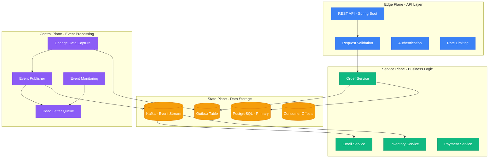

### Atomic Transaction Pattern

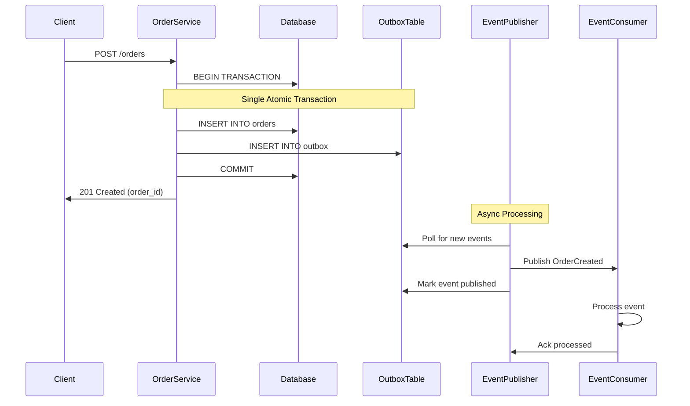

### Data Schema Design

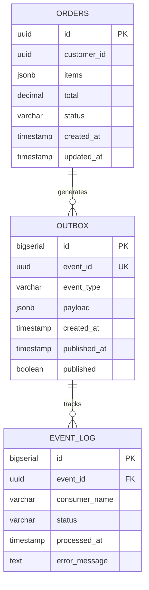

### Event Processing Pipeline

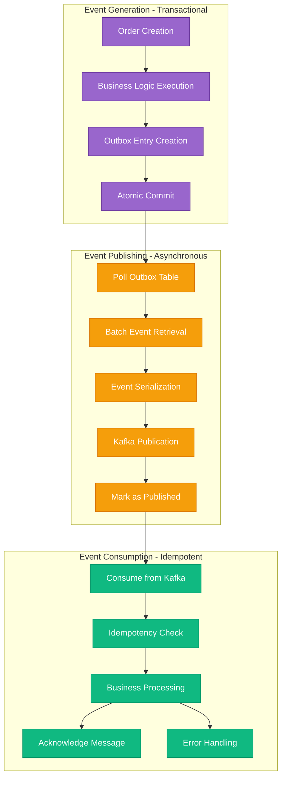

### Monitoring & Operations Dashboard

| Metric | Healthy Range | Alert Threshold | Action Required |
|--------|---------------|----------------|-----------------|
| Unpublished Events | 0-100 | >1000 | Scale publisher |
| Publishing Lag | <30s | >2min | Investigate bottleneck |
| Consumer Lag | <5s | >30s | Scale consumers |
| Error Rate | <1% | >5% | Check error logs |
| Throughput | 1K-10K/sec | <100/sec | Check system health |

---

## Implementing CQRS (Command Query Responsibility Segregation)

Separates read and write models for optimal performance, used by LinkedIn for their feed architecture at massive scale.

### Complete Architecture

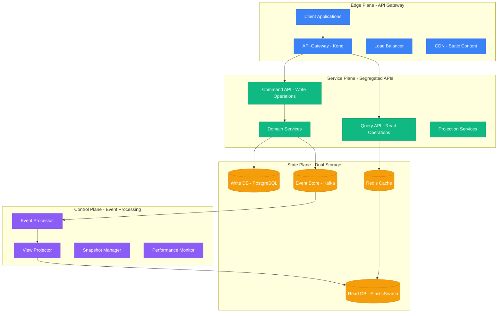

### Command-Query Segregation Flow

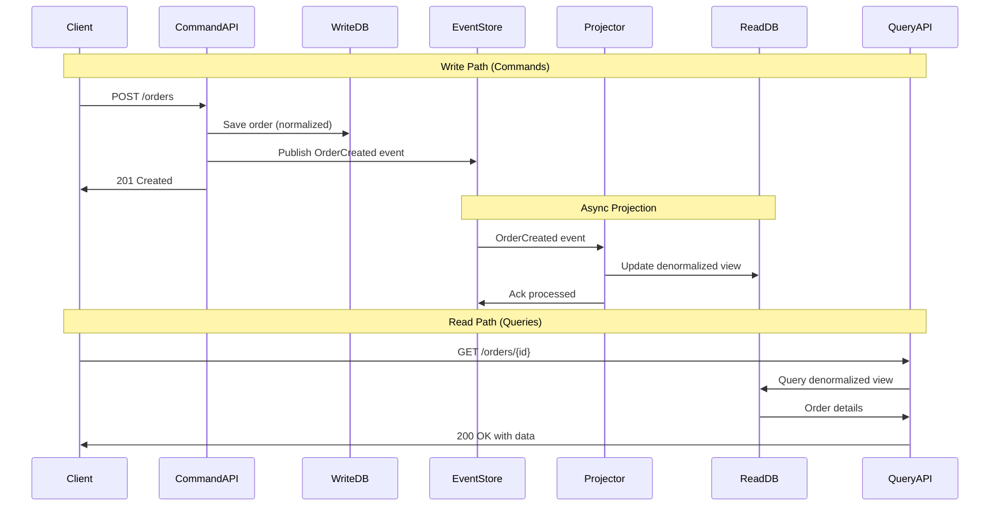

### Data Model Separation

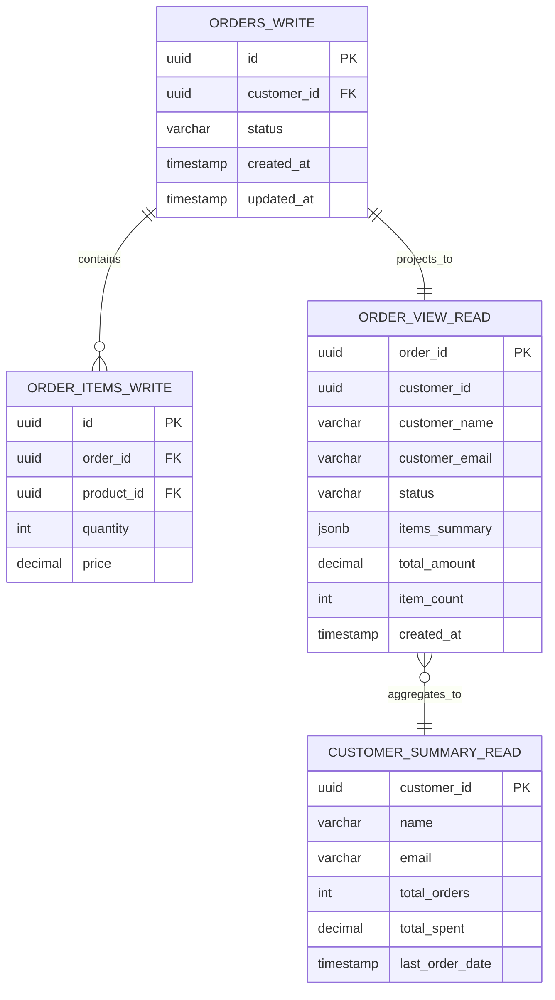

### Event-Driven Projections

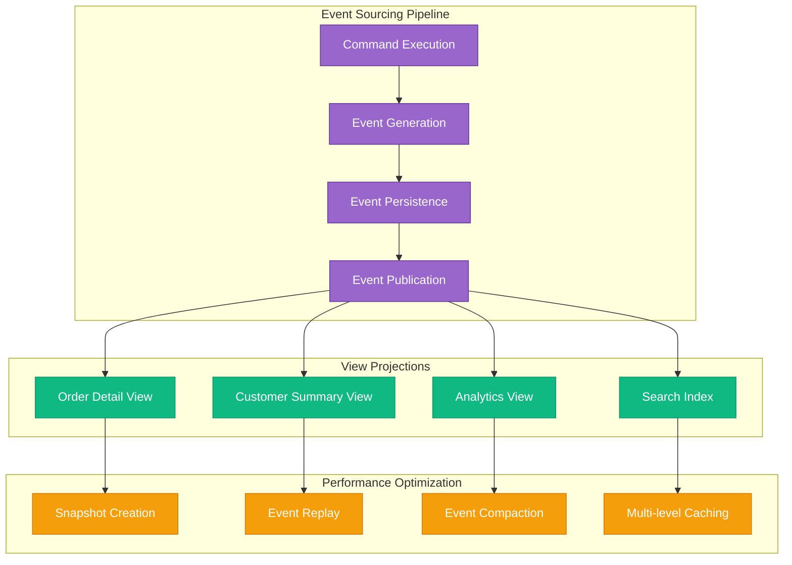

### API Design Patterns

```mermaid
graph TB
    subgraph CommandAPI[Command API - Write Operations]
        CREATE_ORDER[POST /orders - Create Order]
        UPDATE_ORDER[PUT /orders/{id} - Update Order]
        CANCEL_ORDER[DELETE /orders/{id} - Cancel Order]
        ADD_ITEM[POST /orders/{id}/items - Add Item]
    end

    subgraph QueryAPI[Query API - Read Operations]
        GET_ORDER[GET /orders/{id} - Order Details]
        SEARCH_ORDERS[GET /orders?filter - Search Orders]
        CUSTOMER_ORDERS[GET /customers/{id}/orders - Customer Orders]
        ORDER_ANALYTICS[GET /analytics/orders - Order Analytics]
    end

    subgraph ResponsePatterns[Response Patterns]
        ASYNC_COMMANDS[Commands: 202 Accepted + Location Header]
        FAST_QUERIES[Queries: 200 OK + Cached Data]
        EVENTUAL_CONSISTENCY[Eventual Consistency Warnings]
        HYPERMEDIA[HATEOAS Links for Navigation]
    end

    CREATE_ORDER --> ASYNC_COMMANDS
    UPDATE_ORDER --> ASYNC_COMMANDS
    CANCEL_ORDER --> ASYNC_COMMANDS
    ADD_ITEM --> ASYNC_COMMANDS

    GET_ORDER --> FAST_QUERIES
    SEARCH_ORDERS --> FAST_QUERIES
    CUSTOMER_ORDERS --> FAST_QUERIES
    ORDER_ANALYTICS --> FAST_QUERIES

    ASYNC_COMMANDS --> EVENTUAL_CONSISTENCY
    FAST_QUERIES --> HYPERMEDIA

    classDef commandStyle fill:#8B5CF6,stroke:#7C3AED,color:#fff
    classDef queryStyle fill:#3B82F6,stroke:#2563EB,color:#fff
    classDef responseStyle fill:#10B981,stroke:#059669,color:#fff

    class CREATE_ORDER,UPDATE_ORDER,CANCEL_ORDER,ADD_ITEM commandStyle
    class GET_ORDER,SEARCH_ORDERS,CUSTOMER_ORDERS,ORDER_ANALYTICS queryStyle
    class ASYNC_COMMANDS,FAST_QUERIES,EVENTUAL_CONSISTENCY,HYPERMEDIA responseStyle
```

### Performance Comparison

| Operation | Traditional CRUD | CQRS Implementation | Improvement |
|-----------|------------------|---------------------|-------------|
| Write Latency | 50ms (complex joins) | 10ms (simple insert) | **5x faster** |
| Read Latency | 200ms (joins + calc) | 5ms (pre-computed) | **40x faster** |
| Throughput | 1K req/sec | 10K req/sec | **10x better** |
| Scalability | Coupled read/write | Independent scaling | **Unlimited** |
| Availability | 99.9% (single DB) | 99.99% (segregated) | **10x better** |

---

## Implementing Circuit Breaker Pattern

Prevents cascading failures by failing fast when dependencies are unhealthy, used by Netflix Hystrix for microservice protection.

### Complete Architecture

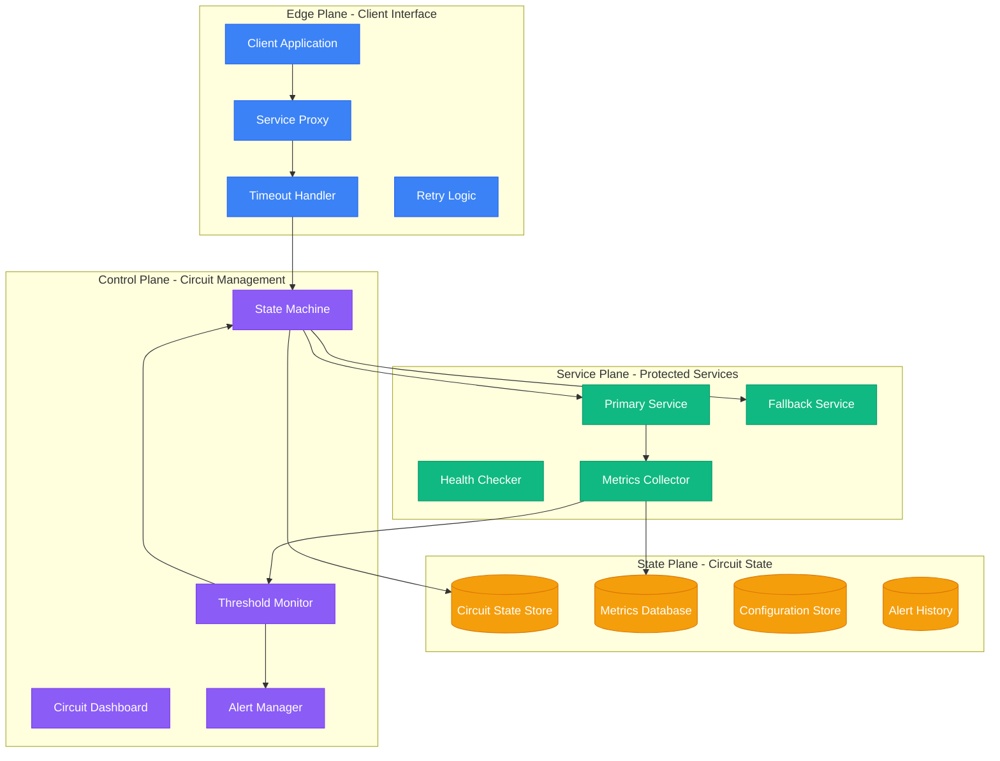

### Circuit Breaker State Machine

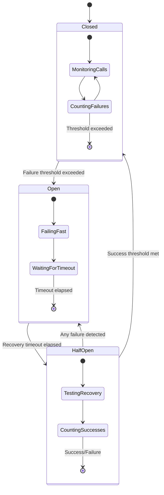

### Failure Detection & Recovery Flow

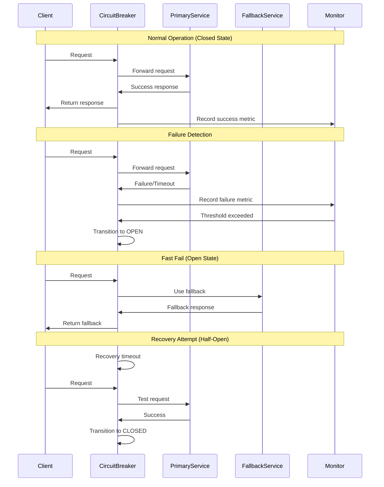

### Multi-Level Circuit Protection

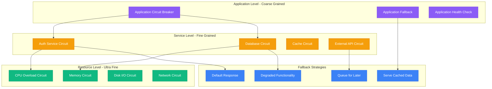

### Configuration & Tuning Matrix

| Service Type | Failure Threshold | Recovery Timeout | Success Threshold | Fallback Strategy |
|--------------|------------------|------------------|-------------------|-------------------|
| **Payment API** | 3 failures | 60 seconds | 2 successes | Cached exchange rates |
| **User Database** | 5 failures | 30 seconds | 3 successes | Read-only replica |
| **Image Service** | 10 failures | 120 seconds | 5 successes | Default placeholder |
| **Email Service** | 2 failures | 300 seconds | 1 success | Queue for retry |
| **Analytics API** | 15 failures | 60 seconds | 10 successes | Drop requests |

### Real-time Monitoring Dashboard

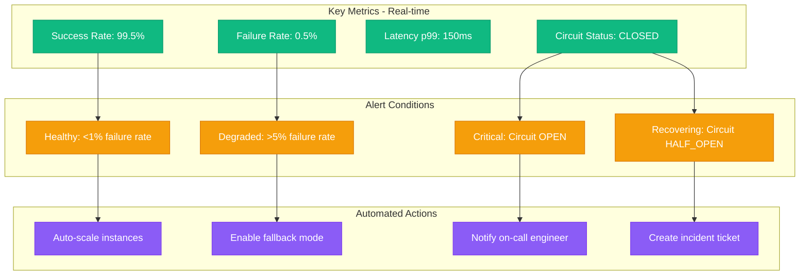

These implementation patterns provide battle-tested approaches for building resilient distributed systems that can handle failures gracefully and recover automatically.