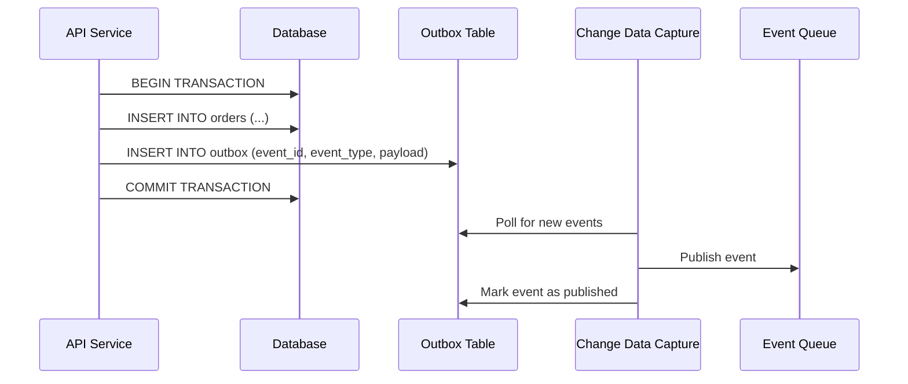
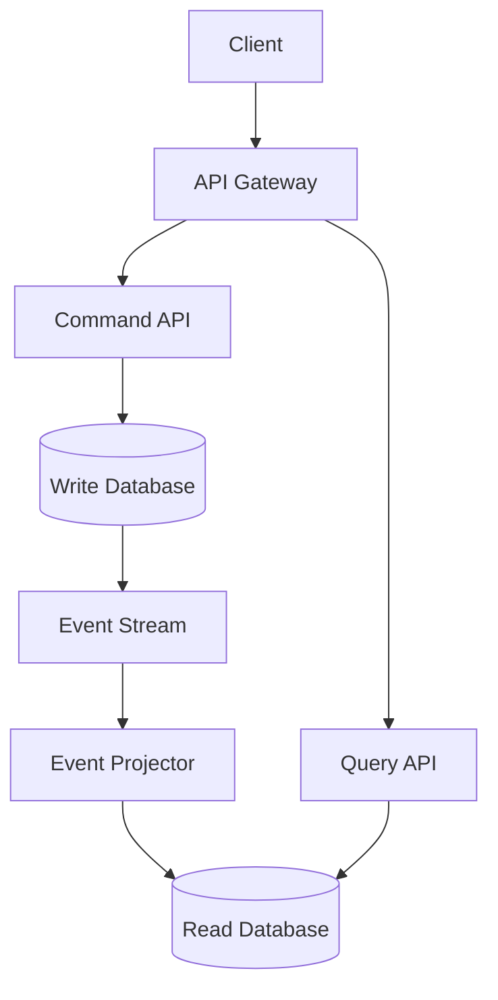

# Implementation Guides

Step-by-step guides for implementing common distributed systems patterns.

## Implementing the Outbox Pattern

The Outbox Pattern ensures atomic database updates and event publishing.

### Problem Statement
You need to update a database and publish an event atomically, but don't want to use distributed transactions.

### Solution Architecture



### Step-by-Step Implementation

#### 1. Create Outbox Table
```sql
CREATE TABLE outbox (
    id BIGSERIAL PRIMARY KEY,
    event_id UUID UNIQUE NOT NULL,
    event_type VARCHAR(100) NOT NULL,
    payload JSONB NOT NULL,
    created_at TIMESTAMP DEFAULT NOW(),
    published_at TIMESTAMP,
    published BOOLEAN DEFAULT FALSE
);

-- Index for efficient polling
CREATE INDEX idx_outbox_unpublished ON outbox (created_at) 
WHERE published = FALSE;
```

#### 2. Business Logic with Outbox
```python
class OrderService:
    def __init__(self, database):
        self.db = database
    
    def create_order(self, customer_id, items):
        with self.db.transaction():
            # 1. Create the order
            order = Order(
                id=generate_uuid(),
                customer_id=customer_id,
                items=items,
                total=calculate_total(items),
                status='pending'
            )
            
            self.db.execute("""
                INSERT INTO orders (id, customer_id, items, total, status)
                VALUES (%s, %s, %s, %s, %s)
            """, [order.id, order.customer_id, order.items, order.total, order.status])
            
            # 2. Add event to outbox (same transaction)
            event = OrderCreatedEvent(
                event_id=generate_uuid(),
                order_id=order.id,
                customer_id=customer_id,
                total=order.total,
                timestamp=datetime.utcnow()
            )
            
            self.db.execute("""
                INSERT INTO outbox (event_id, event_type, payload)
                VALUES (%s, %s, %s)
            """, [event.event_id, 'OrderCreated', event.to_json()])
            
            return order
```

#### 3. Event Publisher (Change Data Capture)
```python
class OutboxEventPublisher:
    def __init__(self, database, event_bus):
        self.db = database
        self.event_bus = event_bus
        self.last_processed_id = 0
    
    def poll_and_publish(self):
        """Poll outbox for new events and publish them"""
        # Get unpublished events
        events = self.db.execute("""
            SELECT id, event_id, event_type, payload
            FROM outbox 
            WHERE id > %s AND published = FALSE
            ORDER BY id
            LIMIT 100
        """, [self.last_processed_id])
        
        for event in events:
            try:
                # Publish to event bus
                self.event_bus.publish(
                    topic=event['event_type'],
                    key=event['event_id'],
                    value=event['payload']
                )
                
                # Mark as published
                self.db.execute("""
                    UPDATE outbox 
                    SET published = TRUE, published_at = NOW()
                    WHERE id = %s
                """, [event['id']])
                
                self.last_processed_id = event['id']
                
            except Exception as e:
                logger.error(f"Failed to publish event {event['event_id']}: {e}")
                # Don't update last_processed_id so we retry
                break
    
    def start_polling(self, interval_seconds=5):
        """Start background polling"""
        while True:
            try:
                self.poll_and_publish()
                time.sleep(interval_seconds)
            except Exception as e:
                logger.error(f"Polling error: {e}")
                time.sleep(interval_seconds)
```

#### 4. Event Consumer
```python
class OrderEventConsumer:
    def __init__(self, email_service, inventory_service):
        self.email_service = email_service
        self.inventory_service = inventory_service
    
    def handle_order_created(self, event):
        """Handle OrderCreated event"""
        try:
            # Send confirmation email
            self.email_service.send_order_confirmation(
                customer_id=event['customer_id'],
                order_id=event['order_id']
            )
            
            # Reserve inventory
            self.inventory_service.reserve_items(
                order_id=event['order_id'],
                items=event['items']
            )
            
        except Exception as e:
            logger.error(f"Failed to handle OrderCreated {event['order_id']}: {e}")
            # Event will be retried by message queue
            raise
```

#### 5. Monitoring and Operations
```python
class OutboxMonitoring:
    def get_metrics(self):
        return {
            'unpublished_events': self.db.scalar(
                "SELECT COUNT(*) FROM outbox WHERE published = FALSE"
            ),
            'events_last_hour': self.db.scalar("""
                SELECT COUNT(*) FROM outbox 
                WHERE created_at > NOW() - INTERVAL '1 hour'
            """),
            'publishing_lag_seconds': self.db.scalar("""
                SELECT EXTRACT(EPOCH FROM (NOW() - MIN(created_at)))
                FROM outbox WHERE published = FALSE
            """)
        }
    
    def cleanup_old_events(self, days_to_keep=30):
        """Clean up old published events"""
        self.db.execute("""
            DELETE FROM outbox 
            WHERE published = TRUE 
            AND published_at < NOW() - INTERVAL '%s days'
        """, [days_to_keep])
```

---

## Implementing CQRS (Command Query Responsibility Segregation)

CQRS separates read and write models for better performance and scalability.

### Architecture Overview



### Step-by-Step Implementation

#### 1. Command Side (Write Model)
```python
# Domain model optimized for business logic
class Order:
    def __init__(self, customer_id, items):
        self.id = generate_uuid()
        self.customer_id = customer_id
        self.items = items
        self.status = 'pending'
        self.events = []
    
    def add_item(self, item):
        if self.status != 'pending':
            raise InvalidOrderState("Cannot add items to non-pending order")
        
        self.items.append(item)
        self.events.append(ItemAddedToOrder(self.id, item))
    
    def confirm(self):
        if not self.items:
            raise InvalidOrderState("Cannot confirm empty order")
        
        self.status = 'confirmed'
        self.events.append(OrderConfirmed(self.id, self.calculate_total()))

# Command handlers
class OrderCommandHandler:
    def __init__(self, repository, event_bus):
        self.repository = repository
        self.event_bus = event_bus
    
    def create_order(self, command: CreateOrderCommand):
        # Create domain object
        order = Order(command.customer_id, command.items)
        
        # Save to write store
        self.repository.save(order)
        
        # Publish events
        for event in order.events:
            self.event_bus.publish(event)
        
        return order.id

# Write-optimized repository
class OrderRepository:
    def __init__(self, database):
        self.db = database
    
    def save(self, order):
        # Store in normalized form optimized for writes
        with self.db.transaction():
            self.db.execute("""
                INSERT INTO orders (id, customer_id, status, created_at)
                VALUES (%s, %s, %s, %s)
                ON CONFLICT (id) DO UPDATE SET
                status = EXCLUDED.status
            """, [order.id, order.customer_id, order.status, datetime.utcnow()])
            
            # Clear existing items and re-insert (simple approach)
            self.db.execute("DELETE FROM order_items WHERE order_id = %s", [order.id])
            
            for item in order.items:
                self.db.execute("""
                    INSERT INTO order_items (order_id, product_id, quantity, price)
                    VALUES (%s, %s, %s, %s)
                """, [order.id, item.product_id, item.quantity, item.price])
```

#### 2. Event Processing
```python
class EventProjector:
    def __init__(self, read_database):
        self.read_db = read_database
    
    def handle_order_created(self, event):
        """Project OrderCreated event to read model"""
        # Create denormalized view optimized for queries
        customer = self.get_customer_info(event.customer_id)
        
        order_view = {
            'order_id': event.order_id,
            'customer_id': event.customer_id,
            'customer_name': customer.name,
            'customer_email': customer.email,
            'status': 'pending',
            'items': [],
            'total_amount': 0,
            'created_at': event.timestamp
        }
        
        self.read_db.upsert('order_views', order_view)
    
    def handle_item_added(self, event):
        """Update read model when item added"""
        product = self.get_product_info(event.item.product_id)
        
        # Add denormalized item info
        item_view = {
            'product_id': event.item.product_id,
            'product_name': product.name,
            'product_category': product.category,
            'quantity': event.item.quantity,
            'unit_price': event.item.price,
            'total_price': event.item.quantity * event.item.price
        }
        
        # Update order view
        order_view = self.read_db.get('order_views', event.order_id)
        order_view['items'].append(item_view)
        order_view['total_amount'] += item_view['total_price']
        
        self.read_db.upsert('order_views', order_view)
```

#### 3. Query Side (Read Model)
```python
class OrderQueryService:
    def __init__(self, read_database, cache):
        self.read_db = read_database
        self.cache = cache
    
    def get_order_details(self, order_id):
        """Get complete order details optimized for display"""
        # Try cache first
        cache_key = f"order_details:{order_id}"
        cached = self.cache.get(cache_key)
        if cached:
            return cached
        
        # Query denormalized view
        order_view = self.read_db.get('order_views', order_id)
        if not order_view:
            raise OrderNotFound(order_id)
        
        # Cache for 5 minutes
        self.cache.set(cache_key, order_view, ttl=300)
        return order_view
    
    def search_orders(self, customer_id=None, status=None, limit=50):
        """Search orders with filters"""
        query = "SELECT * FROM order_views WHERE 1=1"
        params = []
        
        if customer_id:
            query += " AND customer_id = %s"
            params.append(customer_id)
        
        if status:
            query += " AND status = %s"
            params.append(status)
        
        query += " ORDER BY created_at DESC LIMIT %s"
        params.append(limit)
        
        return self.read_db.execute(query, params)
```

#### 4. API Layer
```python
from flask import Flask, request, jsonify

app = Flask(__name__)

# Command API
@app.route('/orders', methods=['POST'])
def create_order():
    command = CreateOrderCommand(
        customer_id=request.json['customer_id'],
        items=request.json['items']
    )
    
    order_id = command_handler.create_order(command)
    return jsonify({'order_id': order_id}), 201

@app.route('/orders/<order_id>/items', methods=['POST'])
def add_item_to_order(order_id):
    command = AddItemCommand(
        order_id=order_id,
        product_id=request.json['product_id'],
        quantity=request.json['quantity']
    )
    
    command_handler.add_item(command)
    return '', 204

# Query API
@app.route('/orders/<order_id>', methods=['GET'])
def get_order(order_id):
    order = query_service.get_order_details(order_id)
    return jsonify(order)

@app.route('/orders', methods=['GET'])
def search_orders():
    orders = query_service.search_orders(
        customer_id=request.args.get('customer_id'),
        status=request.args.get('status'),
        limit=int(request.args.get('limit', 50))
    )
    return jsonify(orders)
```

---

## Implementing Circuit Breaker Pattern

Circuit breakers prevent cascading failures by failing fast when dependencies are unhealthy.

### Implementation
```python
import time
import threading
from enum import Enum

class CircuitState(Enum):
    CLOSED = "closed"      # Normal operation
    OPEN = "open"          # Failing fast
    HALF_OPEN = "half_open" # Testing recovery

class CircuitBreaker:
    def __init__(self, failure_threshold=5, recovery_timeout=60, success_threshold=2):
        self.failure_threshold = failure_threshold
        self.recovery_timeout = recovery_timeout
        self.success_threshold = success_threshold
        
        self.failure_count = 0
        self.success_count = 0
        self.last_failure_time = None
        self.state = CircuitState.CLOSED
        self.lock = threading.Lock()
    
    def call(self, func, *args, **kwargs):
        """Execute function with circuit breaker protection"""
        with self.lock:
            # Check if we should transition states
            self._update_state()
            
            if self.state == CircuitState.OPEN:
                raise CircuitBreakerOpenError("Circuit breaker is open")
            
            if self.state == CircuitState.HALF_OPEN:
                return self._attempt_reset(func, *args, **kwargs)
            
            # CLOSED state - normal operation
            return self._execute_call(func, *args, **kwargs)
    
    def _execute_call(self, func, *args, **kwargs):
        """Execute the function and handle success/failure"""
        try:
            result = func(*args, **kwargs)
            self._on_success()
            return result
        except Exception as e:
            self._on_failure()
            raise
    
    def _on_success(self):
        """Handle successful call"""
        self.failure_count = 0
        if self.state == CircuitState.HALF_OPEN:
            self.success_count += 1
    
    def _on_failure(self):
        """Handle failed call"""
        self.failure_count += 1
        self.last_failure_time = time.time()
        
        if self.failure_count >= self.failure_threshold:
            self.state = CircuitState.OPEN
            print(f"Circuit breaker opened after {self.failure_count} failures")
    
    def _update_state(self):
        """Update circuit breaker state based on current conditions"""
        if self.state == CircuitState.OPEN:
            if self._should_attempt_reset():
                self.state = CircuitState.HALF_OPEN
                self.success_count = 0
                print("Circuit breaker entering half-open state")
    
    def _should_attempt_reset(self):
        """Check if enough time has passed to attempt reset"""
        return (self.last_failure_time and 
                time.time() - self.last_failure_time >= self.recovery_timeout)
    
    def _attempt_reset(self, func, *args, **kwargs):
        """Attempt to reset circuit breaker in half-open state"""
        try:
            result = self._execute_call(func, *args, **kwargs)
            
            if self.success_count >= self.success_threshold:
                self.state = CircuitState.CLOSED
                print("Circuit breaker closed - service recovered")
            
            return result
        except Exception as e:
            self.state = CircuitState.OPEN
            print("Circuit breaker opened again - service still failing")
            raise

# Usage example
class PaymentService:
    def __init__(self):
        self.circuit_breaker = CircuitBreaker(
            failure_threshold=3,
            recovery_timeout=30,
            success_threshold=2
        )
    
    def process_payment(self, amount):
        return self.circuit_breaker.call(self._make_payment_call, amount)
    
    def _make_payment_call(self, amount):
        # Simulate external payment API call
        response = requests.post('/payment-api', json={'amount': amount}, timeout=5)
        response.raise_for_status()
        return response.json()
```

These implementation guides provide working code that you can adapt to your specific needs. Each pattern solves common distributed systems challenges with proven approaches.