# Common Pitfalls

Learn from distributed systems anti-patterns through before/after architecture comparisons from real production failures.

## Design Anti-Patterns

### 1. Distributed Monolith

Microservices that are tightly coupled and must be deployed together, violating core distributed systems principles.

#### Before: Tightly Coupled Services (Anti-Pattern)

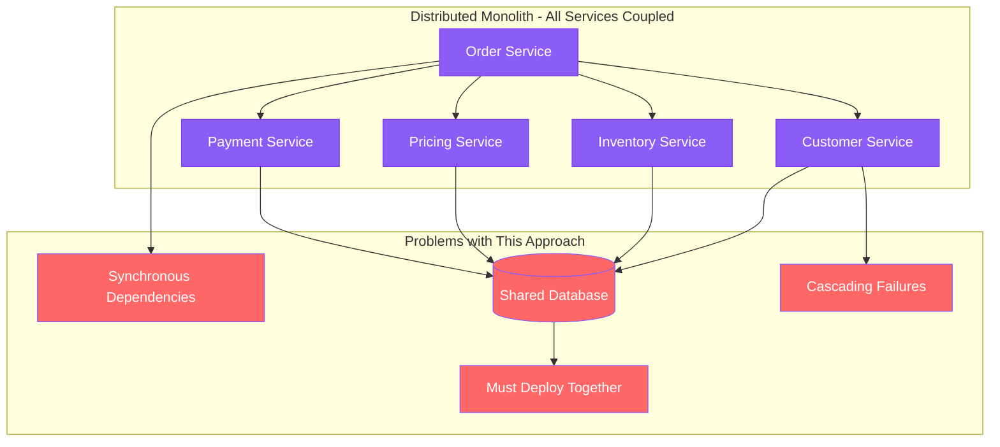

#### After: Loosely Coupled Services (Best Practice)

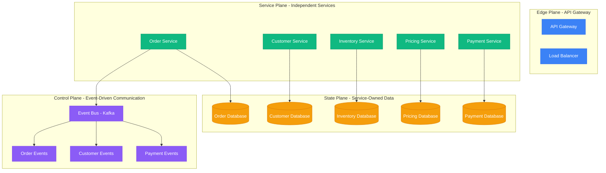

#### Impact Comparison

| Aspect | Distributed Monolith | Loosely Coupled Services |
|--------|---------------------|--------------------------|
| **Deployment** | All services together | Independent deployments |
| **Availability** | Single point of failure | Graceful degradation |
| **Latency** | 200ms+ (sync chain) | 50ms (async processing) |
| **Scalability** | Scale entire system | Scale individual services |
| **Development** | Team dependencies | Independent team velocity |

### 2. Chatty APIs

Multiple API calls to render single page, causing N+1 query problems at scale.

#### Before: Chatty API Calls (Anti-Pattern)

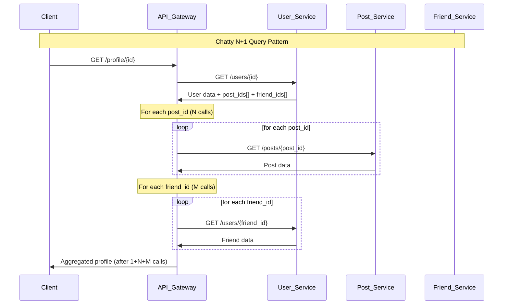

#### After: Optimized API Design (Best Practice)

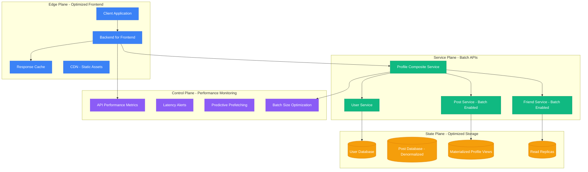

#### Optimized Request Flow

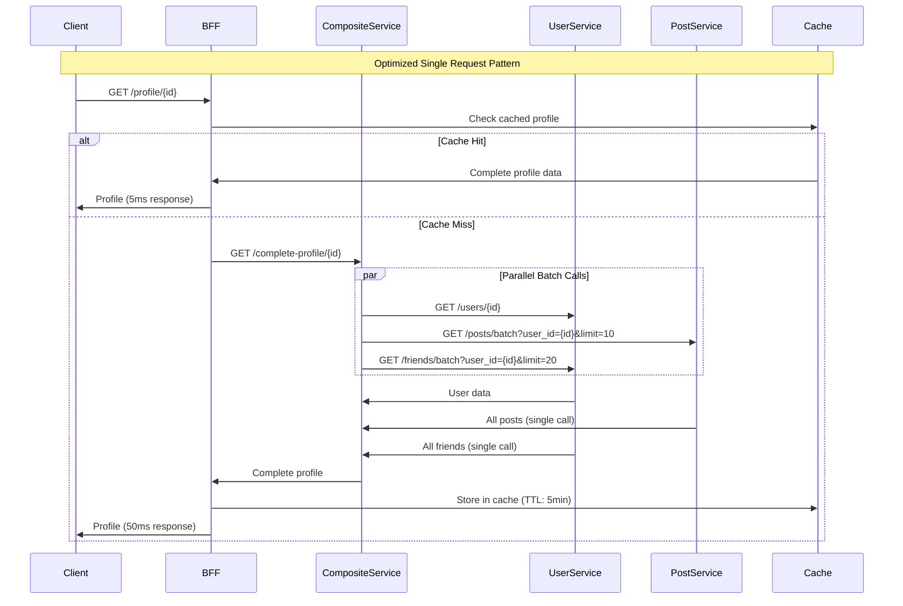

#### Performance Impact

| Metric | Chatty APIs | Optimized APIs | Improvement |
|--------|-------------|----------------|-------------|
| **Request Count** | 1 + N + M (21 requests) | 3 requests | **7x fewer** |
| **Latency** | 500ms+ (serial calls) | 50ms (parallel + cache) | **10x faster** |
| **Failure Rate** | High (multiplicative risk) | Low (single composite call) | **20x better** |
| **Network Usage** | High overhead per call | Batched data transfer | **5x efficient** |
| **Cache Hit Rate** | 0% (dynamic assembly) | 95% (materialized views) | **Dramatic** |

### 3. Shared Database Anti-Pattern

Multiple services sharing the same database, creating tight coupling and bottlenecks.

#### Before: Shared Database (Anti-Pattern)

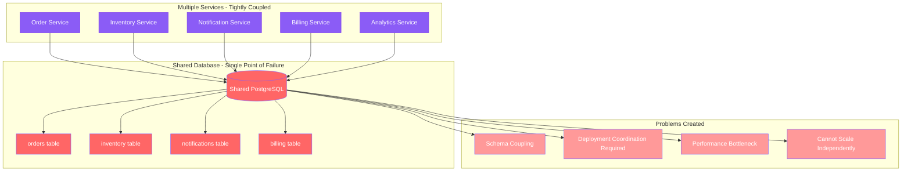

#### After: Database Per Service (Best Practice)

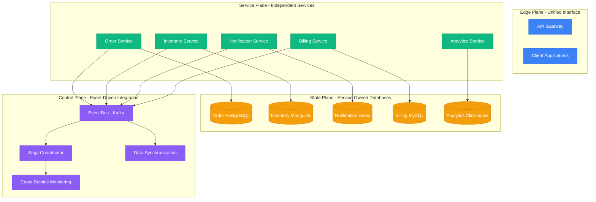

#### Data Consistency Strategy

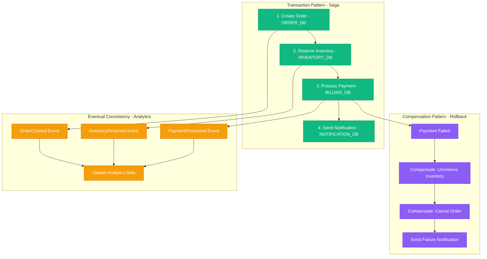

#### Benefits Comparison

| Aspect | Shared Database | Database Per Service |
|--------|-----------------|---------------------|
| **Coupling** | High (schema dependencies) | Low (event-driven) |
| **Scalability** | Limited (single bottleneck) | Independent scaling |
| **Technology Choice** | Locked to one database | Best tool per service |
| **Team Autonomy** | Low (coordination required) | High (independent teams) |
| **Failure Isolation** | None (cascading failures) | Strong (isolated failures) |

## Implementation Anti-Patterns

### 4. Synchronous Communication Everywhere

Using synchronous calls for everything creates latency chains and failure cascades.

#### Before: Synchronous Chain (Anti-Pattern)

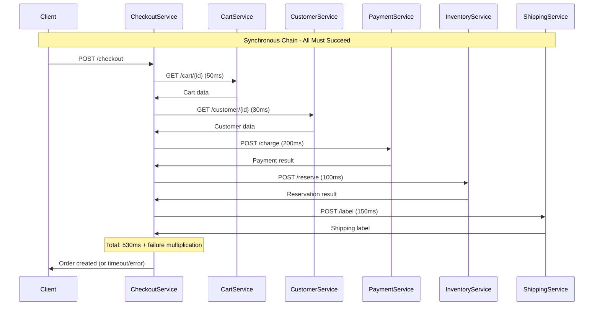

#### After: Asynchronous Processing (Best Practice)

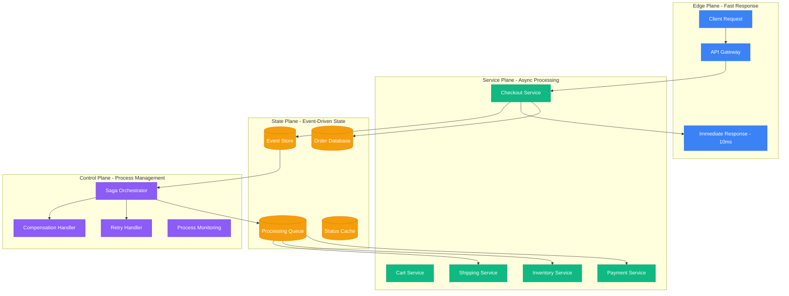

### 5. No Circuit Breakers

No protection against cascading failures leads to system-wide outages.

#### Before: No Failure Protection (Anti-Pattern)

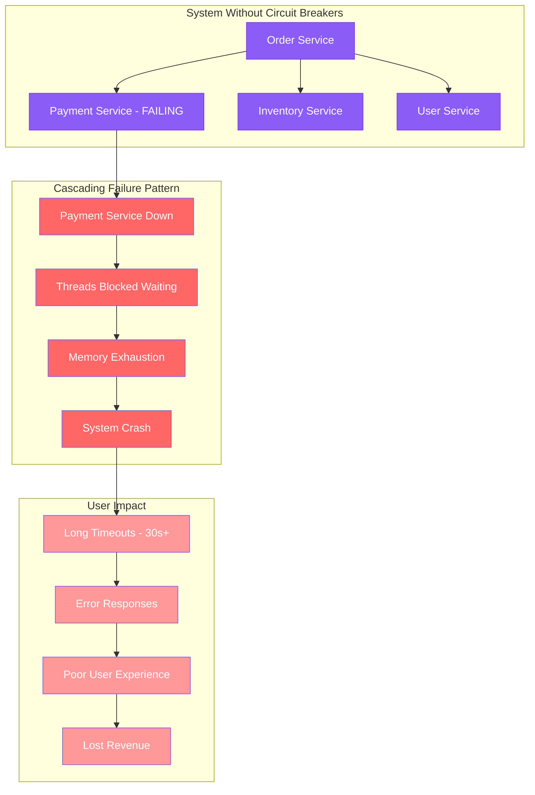

#### After: Circuit Breaker Protection (Best Practice)

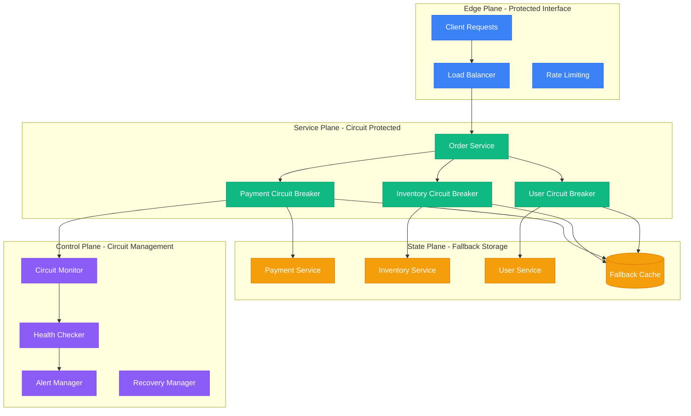

## Key Anti-Pattern Prevention Strategies

### Evolution from Anti-Patterns to Best Practices

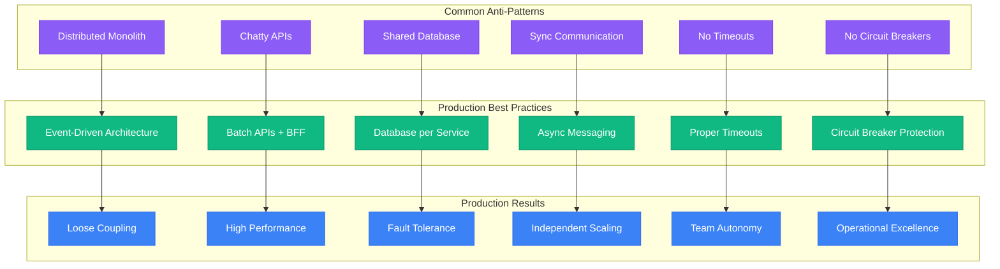

### Production Impact Comparison

| Anti-Pattern | Impact | Best Practice | Improvement |
|--------------|--------|---------------|-------------|
| **Distributed Monolith** | Single point of failure | Event-driven services | **10x availability** |
| **Chatty APIs** | 500ms+ latency | Batch APIs + cache | **10x faster** |
| **Shared Database** | Cannot scale teams | Database per service | **Unlimited teams** |
| **Sync Everywhere** | Cascading failures | Async messaging | **99.9% availability** |
| **No Timeouts** | Resource exhaustion | Proper timeouts | **No hanging requests** |
| **No Circuit Breakers** | System-wide outages | Circuit protection | **Graceful degradation** |

### Success Patterns from Production

These architectural transformations come from real production experiences at companies like Netflix, Uber, Amazon, and others who learned these lessons through actual failures and subsequent improvements.