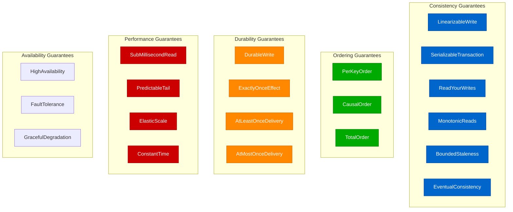
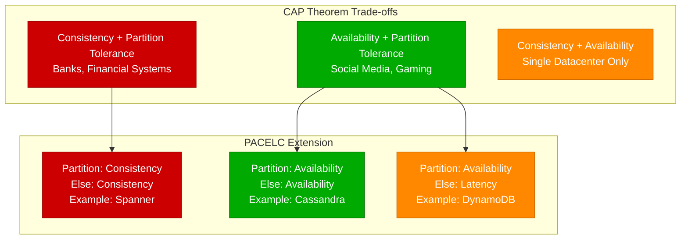
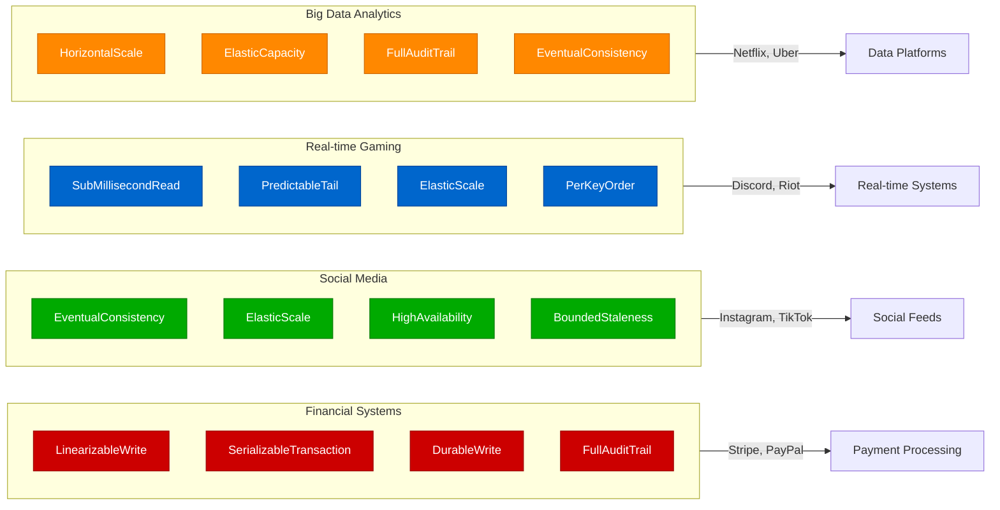

# Layer 1: The 30 Capabilities

Capabilities define what guarantees a distributed system provides. Netflix needs LinearizableWrite for billing, Uber needs EventualConsistency for ride matching, Discord needs SubMillisecondRead for real-time chat.

## Capability Categories

## Capability Trade-offs

## Production Usage Patterns

## Real-World Examples

| System | Primary Capabilities | Why These Matter |
|--------|---------------------|------------------|
| **Stripe** | LinearizableWrite, DurableWrite | Money transfers must be atomic and never lost |
| **Instagram** | EventualConsistency, ElasticScale | Likes/comments can be eventually consistent |
| **Discord** | SubMillisecondRead, PerKeyOrder | Chat messages need instant delivery in order |
| **Uber** | BoundedStaleness, HighAvailability | Ride location can be 5s stale but must be available |
| **Netflix** | ElasticScale, GracefulDegradation | Must handle traffic spikes, degrade video quality gracefully |
| **Coinbase** | SerializableTransaction, FullAuditTrail | Crypto trades need ACID properties and complete audit |

## Measurement in Production

| Capability | How to Measure | Alert Threshold | Production Impact |
|------------|----------------|-----------------|-------------------|
| **LinearizableWrite** | Jepsen continuous testing | Any violation | Data corruption, lost money |
| **SubMillisecondRead** | P99 latency histograms | >1ms for 5min | User experience degradation |
| **HighAvailability** | Success rate monitoring | <99.9% for 1min | User-facing outages |
| **BoundedStaleness** | Data age tracking | >SLO for 5min | Stale data decisions |
| **ElasticScale** | Throughput vs load curve | Non-linear scaling | Resource waste, bottlenecks |