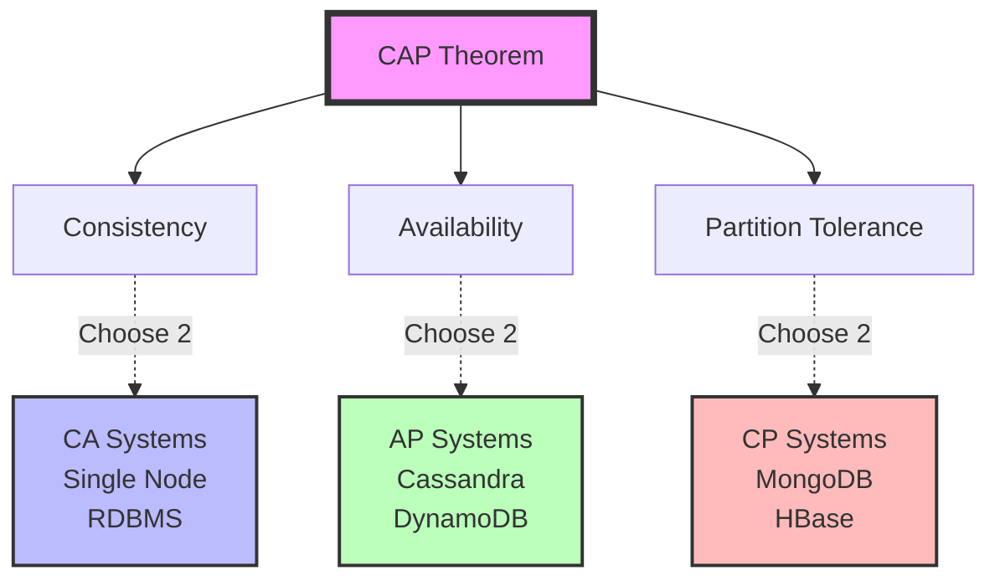

# Distributed System Guarantees

## Overview

Guarantees define what a distributed system promises to deliver. They form the foundation of system design decisions and trade-offs.

## Core Guarantees

### Consistency Guarantees
- **Strong Consistency**: All nodes see the same data simultaneously
- **Eventual Consistency**: Nodes will converge to the same state eventually
- **Causal Consistency**: Preserves causally related operations order

### Availability Guarantees
- **High Availability**: System remains operational most of the time
- **Fault Tolerance**: System continues despite component failures
- **Graceful Degradation**: Partial functionality during failures

### Performance Guarantees
- **Latency SLAs**: Response time commitments
- **Throughput**: Request processing capacity
- **Scalability**: Ability to handle growth

## The CAP Theorem

## Guarantee Categories

| Category | Description | Examples |
|----------|-------------|----------|
| **Data Guarantees** | How data is stored and accessed | Durability, Consistency, Isolation |
| **Service Guarantees** | Service-level promises | Availability, Latency, Throughput |
| **Ordering Guarantees** | Message and operation ordering | FIFO, Causal, Total Order |
| **Delivery Guarantees** | Message delivery semantics | At-most-once, At-least-once, Exactly-once |

## Navigate This Section

*More detailed guarantee documentation coming soon. This section will expand to cover:*

- **Consistency Models** - Strong, eventual, causal consistency
- **Availability Patterns** - High availability and fault tolerance
- **Partition Tolerance** - Network partition handling
- **Durability Guarantees** - Data persistence and recovery
- **Performance SLAs** - Latency and throughput requirements