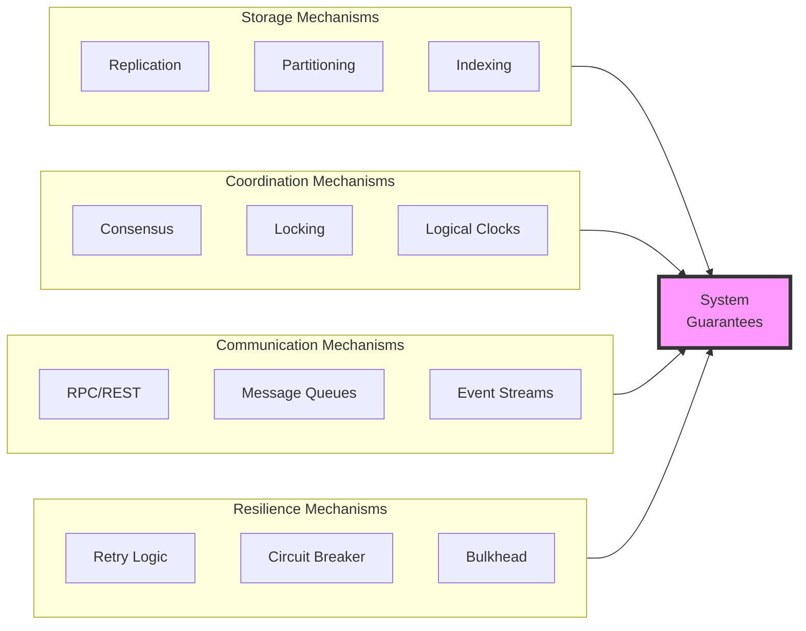

# Distributed System Mechanisms

## Overview

Mechanisms are the fundamental building blocks that implement guarantees in distributed systems. They are the "how" behind the "what" of system guarantees.

## Core Mechanisms

## Mechanism Categories

### Data Management
- **Replication**: Creating data copies for availability and performance
- **Partitioning**: Distributing data across nodes for scalability
- **Caching**: Storing frequently accessed data for fast retrieval

### Coordination
- **Consensus**: Agreement protocols (Raft, Paxos)
- **Leader Election**: Selecting a coordinator node
- **Distributed Locking**: Mutual exclusion across nodes

### Communication
- **Load Balancing**: Distributing requests across servers
- **Service Discovery**: Finding available service instances
- **Message Passing**: Async communication between components

### Fault Tolerance
- **Health Checks**: Monitoring component availability
- **Failover**: Switching to backup components
- **Recovery**: Restoring system after failures

## Mechanism Selection Matrix

| Guarantee Needed | Primary Mechanism | Secondary Mechanism |
|-----------------|-------------------|---------------------|
| High Availability | Replication | Load Balancing |
| Scalability | Partitioning | Caching |
| Strong Consistency | Consensus | Distributed Locking |
| Low Latency | Caching | CDN |
| Fault Tolerance | Circuit Breaker | Retry Logic |

## Navigate This Section

*Detailed mechanism documentation is being developed. This section will include:*

- **Replication Strategies** - Master-slave, multi-master, quorum-based
- **Consensus Algorithms** - Raft, Paxos, PBFT protocols
- **Partitioning Techniques** - Horizontal, vertical, functional sharding
- **Caching Patterns** - Write-through, write-back, cache-aside
- **Load Balancing** - Round-robin, weighted, consistent hashing