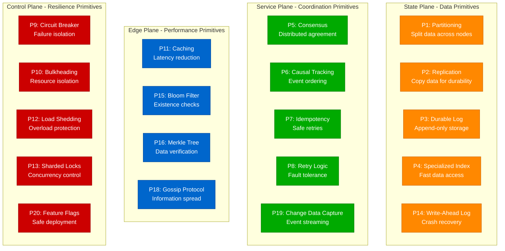
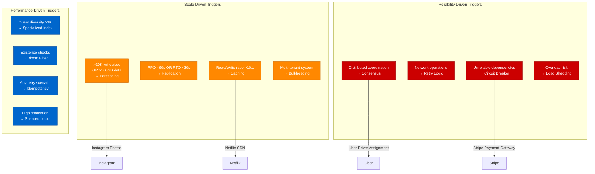
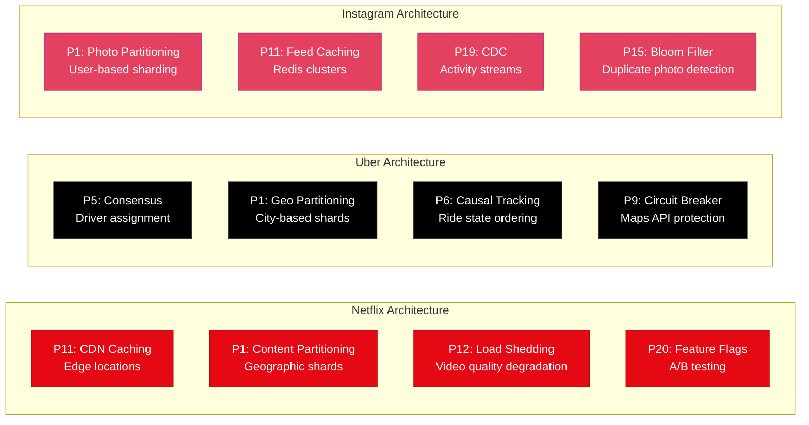

# Layer 2: The 20 Primitives

Primitives are implementation building blocks that deliver capabilities. Instagram uses Partitioning (P1) for photo storage, Netflix uses Caching (P11) for content delivery, Uber uses Consensus (P5) for driver assignment.

## Core Infrastructure Primitives

## Primitive Trigger Thresholds

## Production Implementation Examples

## Critical Primitive Combinations

| Combination | Why Needed | Production Example | Anti-Pattern |
|-------------|------------|--------------------|--------------|
| **P7 + P8** | Idempotency + Retry | Stripe payment retries | Retry without idempotency key |
| **P1 + P4** | Partitioning + Indexes | Instagram photo lookup | Global secondary indexes |
| **P2 + P5** | Replication + Consensus | Spanner strong consistency | Async replication only |
| **P8 + P9** | Retry + Circuit Breaker | Netflix API resilience | Infinite retries |
| **P3 + P19** | Durable Log + CDC | Kafka event streaming | Dual writes to downstream |

## Capacity Planning

| Primitive | Throughput Limit | Latency Impact | When It Breaks |
|-----------|------------------|----------------|----------------|
| **P1 Partitioning** | 20K writes/partition | None if balanced | Hot partitions, celebrity users |
| **P5 Consensus** | 10K writes/sec | +2-10ms | Network partitions, >7 nodes |
| **P11 Caching** | 50K+ ops/node | <1ms hits | Cache misses, invalidation storms |
| **P2 Replication** | Unlimited | +1-5ms/replica | Network lag, replica failure |
| **P9 Circuit Breaker** | No limit | Fail-fast | Cascading failures, no fallback |

## Implementation Checklist

| Primitive | Must Have | Must Monitor | Common Mistake |
|-----------|-----------|--------------|----------------|
| **P1 Partitioning** | Even distribution strategy | Hot partition detection | Celebrity user hotspots |
| **P5 Consensus** | Odd node count | Split-brain monitoring | Even number of nodes |
| **P11 Caching** | Invalidation strategy | Hit ratio tracking | No cache invalidation |
| **P8 Retry Logic** | Exponential backoff | Retry storm detection | No jitter, infinite retries |
| **P9 Circuit Breaker** | Fallback mechanism | Recovery time tracking | Global circuit breaker |