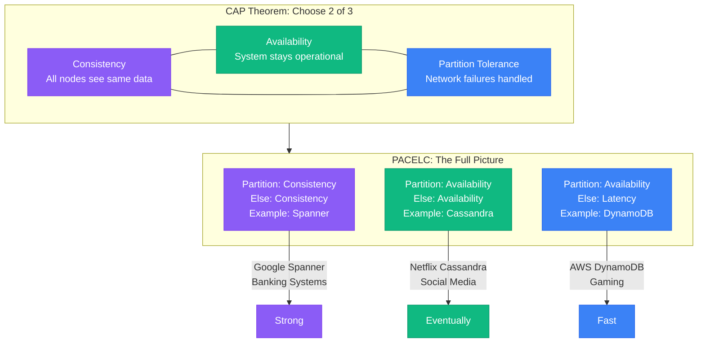
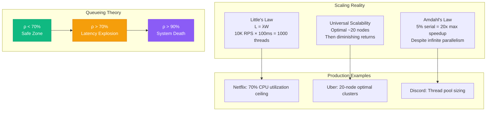
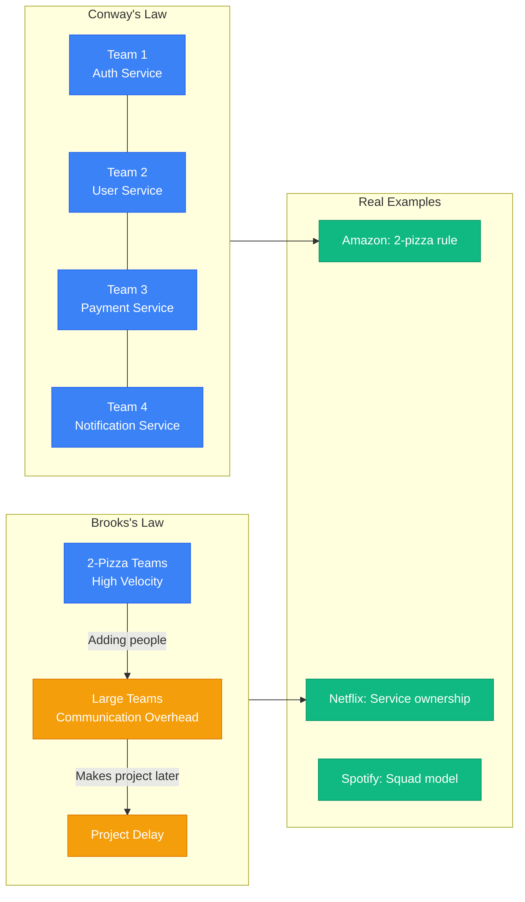

# Layer 0: The 15 Universal Laws

These mathematical laws govern all distributed systems and cannot be violated. Netflix learned this with microservices sprawl, AWS discovered it with zone failures, Google proved it with Spanner's consistency-availability trade-offs.

## The Fundamental Trade-offs

## Performance Laws in Production

## Organizational and Architectural Laws

## Production Violations and Costs

| Law | Common Violation | Real Example | Cost |
|-----|------------------|--------------|------|
| **CAP** | Expecting strong consistency + availability | Early MongoDB | Data loss during partitions |
| **Little's** | Under-sizing connection pools | Reddit's 2020 outage | 503 errors, user exodus |
| **Universal Scalability** | Adding nodes past optimal | WhatsApp's early scaling | 10x cost for 2x capacity |
| **Queueing** | Running >70% utilization | GitHub's 2018 incident | Exponential latency spikes |
| **Conway's** | Misaligned teams and services | Microservices without teams | Integration hell |
| **Tail at Scale** | No hedging/timeouts | Google's early search | P99 latency dominated by slowest |
| **End-to-End** | Too many hops in critical path | Early Uber architecture | Compound failure rates |

## Detection and Monitoring

| Law | Key Metric | Alert Threshold | Action |
|-----|------------|-----------------|--------|
| **Little's Law** | `concurrent_requests / (rps × latency)` | >0.75 | Scale connection pools |
| **Queueing Theory** | `cpu_utilization` | >70% | Add capacity immediately |
| **Universal Scalability** | `throughput_per_node` | Decreasing | Stop scaling, start sharding |
| **Tail at Scale** | `p99_latency` vs `p50_latency` | Ratio >10 | Add hedging/timeouts |
| **CAP Theorem** | `network_partitions_total` | >0 | Validate CP vs AP behavior |

## Architecture Decision Framework

Use these laws to validate every architectural decision:

1. **CAP**: Which guarantee do you sacrifice during partitions?
2. **Little's**: Are your pools sized correctly for expected load?
3. **Conway's**: Do your teams match your desired service boundaries?
4. **Queueing**: Are you staying under 70% utilization?
5. **Universal Scalability**: When will you need to shard instead of scale?