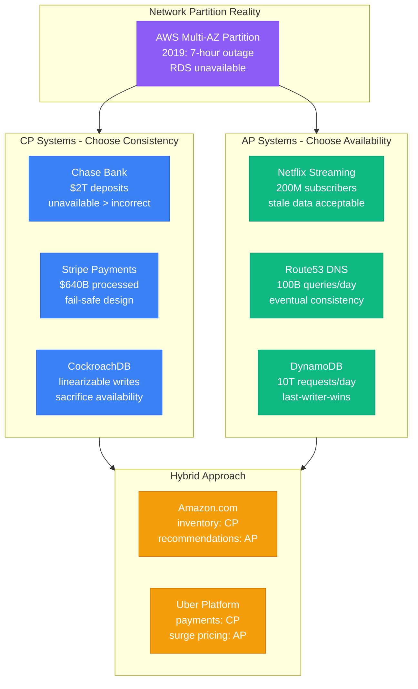
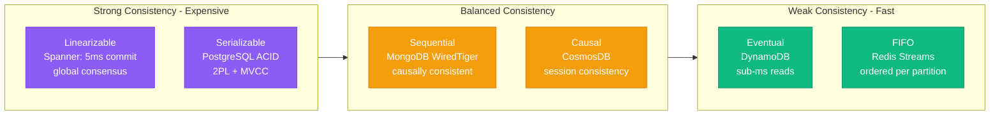

# Core Concepts

Production-focused fundamentals for building reliable distributed systems.

## The Distribution Problem

Moving from single machine to distributed introduces fundamental new failure modes.

### What Changes with Distribution?

```mermaid
flowchart LR
    subgraph SingleMachine["Single Machine - Predictable"]
        SM_MEM["Shared Memory<br/>μs latency<br/>atomic operations"]
        SM_CLOCK["Single Clock<br/>nanosecond precision<br/>monotonic time"]
        SM_FAIL["Fail-Stop<br/>process crash<br/>binary: working/dead"]
    end

    subgraph Distributed["Distributed System - Unpredictable"]
        DS_NET["Network Communication<br/>ms latency, packet loss<br/>no guarantees"]
        DS_CLOCK["Multiple Clocks<br/>drift, skew, leap seconds<br/>NTP synchronization"]
        DS_FAIL["Partial Failures<br/>network partitions<br/>byzantine behaviors"]
    end

    subgraph ProductionReality["Production Reality"]
        PROB1["AWS S3 2017<br/>4-hour outage<br/>typo in command"]
        PROB2["GitHub 2018<br/>database failover<br/>24-hour incident"]
        PROB3["Cloudflare 2019<br/>BGP leak<br/>global internet down"]
    end

    SingleMachine --> Distributed
    Distributed --> ProductionReality

    classDef singleStyle fill:#10B981,stroke:#059669,color:#fff
    classDef distStyle fill:#F59E0B,stroke:#D97706,color:#fff
    classDef realityStyle fill:#8B5CF6,stroke:#7C3AED,color:#fff

    class SM_MEM,SM_CLOCK,SM_FAIL singleStyle
    class DS_NET,DS_CLOCK,DS_FAIL distStyle
    class PROB1,PROB2,PROB3 realityStyle
```



| **Single Machine** | **Distributed System** | **Production Example** |
|-------------------|----------------------|----------------------|
| Shared memory (μs) | Network communication (ms) | Redis: 0.1ms, PostgreSQL: 5ms |
| Single clock | Multiple clocks | AWS regions: 100ms skew |
| Fail-stop failures | Partial failures | Netflix: 1000+ microservices |
| Atomic operations | Distributed coordination | Stripe: eventual consistency |
| Direct function calls | Remote procedure calls | Uber: 2000+ services, gRPC |
| Local transactions | Distributed transactions | Banking: 2-phase commit |

## The Fundamental Trade-offs

### CAP Theorem in Production

During network partitions, choose consistency or availability - not both.



### Consistency Models in Production



| **Model** | **Latency** | **Use Case** | **Production Example** |
|-----------|-------------|--------------|----------------------|
| **Linearizable** | 5-50ms | Financial transactions | Google Spanner (banking) |
| **Serializable** | 1-10ms | Business workflows | PostgreSQL (e-commerce) |
| **Sequential** | 1-5ms | Collaborative editing | MongoDB (Google Docs) |
| **Causal** | 0.5-2ms | Social media feeds | Cosmos DB (LinkedIn) |
| **Eventual** | 0.1-1ms | Content distribution | DynamoDB (Netflix CDN) |

## Scale Dimensions

Systems scale across multiple dimensions, each with different challenges.

### Request Volume Scaling

```python
# Scale breakpoints (rules of thumb)
if requests_per_second < 100:
    architecture = "single_server"
elif requests_per_second < 10_000:
    architecture = "load_balanced_servers"  
elif requests_per_second < 100_000:
    architecture = "partitioned_system"
else:
    architecture = "distributed_coordination"
```

### Data Volume Scaling

```python
# Storage breakpoints  
if data_size < 100_GB:
    storage = "single_database"
elif data_size < 10_TB:
    storage = "sharded_database"
elif data_size < 1_PB:
    storage = "distributed_storage"
else:
    storage = "data_lake_architecture"
```

### Geographic Scaling

```python
# Latency constraints
if users_global:
    if consistency_required:
        pattern = "regional_strong_global_eventual"
    else:
        pattern = "edge_computing"
else:
    pattern = "single_region_deployment"
```

## Failure Models

Understanding how things fail is crucial for building reliable systems.

### Byzantine vs Non-Byzantine

| **Non-Byzantine** | **Byzantine** |
|------------------|---------------|
| Fail-stop (crash) | Arbitrary behavior |
| Network partition | Malicious activity |
| Omission failures | Corruption |
| **Example**: Server crashes | **Example**: Security breach |

**Design implications:**
- **Non-Byzantine**: Use Raft, simple replication
- **Byzantine**: Use PBFT, blockchain consensus

### Failure Frequencies in Production

| **Failure Type** | **MTBF** | **Detection** | **Recovery** |
|------------------|----------|---------------|--------------|
| Process crash | Days | Seconds | Minutes |
| Disk failure | Years | Hours | Hours |
| Network partition | Months | Seconds | Minutes |
| Data corruption | Years | Days | Hours |
| Human error | Weeks | Minutes | Hours |

## Time in Distributed Systems

Time is one of the hardest problems in distributed systems.

### Clock Types

```python
# Physical clocks - wall clock time
import time
physical_time = time.time()  # Can go backwards, drift

# Logical clocks - ordering events  
class LamportClock:
    def __init__(self):
        self.time = 0
    
    def tick(self):
        self.time += 1
        return self.time
    
    def update(self, other_time):
        self.time = max(self.time, other_time) + 1
        return self.time

# Vector clocks - causal relationships
class VectorClock:
    def __init__(self, node_id, num_nodes):
        self.node_id = node_id
        self.clock = [0] * num_nodes
    
    def tick(self):
        self.clock[self.node_id] += 1
        return self.clock.copy()
    
    def update(self, other_clock):
        for i in range(len(self.clock)):
            self.clock[i] = max(self.clock[i], other_clock[i])
        self.clock[self.node_id] += 1
        return self.clock.copy()
```

### Happened-Before Relationship

Events in distributed systems have a partial order:

```
Event A → Event B if:
1. A and B occur on same process and A occurs before B
2. A is send event and B is receive event for same message  
3. Transitive: A → C and C → B implies A → B
```

## Communication Patterns

### Synchronous vs Asynchronous

| **Synchronous** | **Asynchronous** |
|-----------------|------------------|
| Caller waits for response | Fire and forget |
| Simpler programming model | Better performance |
| Tight coupling | Loose coupling |
| Easier to debug | Complex error handling |

### Message Delivery Guarantees

```python
# At-most-once: Message delivered 0 or 1 times
# Implementation: Send without retry
def send_at_most_once(message):
    try:
        network.send(message)
    except NetworkError:
        pass  # Don't retry

# At-least-once: Message delivered 1 or more times  
# Implementation: Retry until acknowledgment
def send_at_least_once(message):
    while True:
        try:
            ack = network.send_with_ack(message)
            if ack.success:
                break
        except NetworkError:
            time.sleep(1)  # Retry

# Exactly-once: Message delivered exactly 1 time
# Implementation: Idempotency + at-least-once
def send_exactly_once(message):
    message.id = generate_unique_id()
    send_at_least_once(message)  # Receiver deduplicates
```

## Consensus and Agreement

Getting distributed nodes to agree on a single value.

### Why Consensus is Hard

```python
# The problem: Nodes can fail, network can partition
def distributed_agreement_impossible():
    """
    FLP Impossibility Result:
    In an asynchronous network where even one node can fail,
    no consensus algorithm can guarantee termination.
    """
    # This is why all practical consensus algorithms make
    # additional assumptions (timeouts, failure detectors, etc.)
    pass
```

### Practical Consensus Algorithms

| **Algorithm** | **Fault Model** | **Performance** | **Complexity** |
|---------------|-----------------|-----------------|----------------|
| **Raft** | Crash failures | Good | Low |
| **Paxos** | Crash failures | Good | High |
| **PBFT** | Byzantine failures | Moderate | Very High |
| **HotStuff** | Byzantine failures | Good | High |

## Data Distribution Strategies

### Partitioning Schemes

```python
# Hash partitioning - even distribution
def hash_partition(key, num_partitions):
    return hash(key) % num_partitions

# Range partitioning - ordered access
def range_partition(key, ranges):
    for i, range_end in enumerate(ranges):
        if key <= range_end:
            return i
    return len(ranges) - 1

# Directory partitioning - flexible
def directory_partition(key, directory):
    return directory.lookup(key)
```

### Replication Strategies

```python
# Primary-backup replication
class PrimaryBackup:
    def write(self, data):
        # Write to primary first
        primary.write(data)
        
        # Then replicate to backups
        for backup in backups:
            backup.write(data)

# Multi-master replication  
class MultiMaster:
    def write(self, data):
        # Write to local replica
        local_replica.write(data)
        
        # Async replicate to others
        for replica in other_replicas:
            async_send(replica, data)
```

## State Management

### Stateless vs Stateful

| **Stateless Services** | **Stateful Services** |
|----------------------|---------------------|
| Easy to scale | Complex to scale |
| Simple recovery | Complex recovery |
| Load balance anywhere | Sticky routing |
| **Examples**: Web servers, API gateways | **Examples**: Databases, caches |

### Event Sourcing vs State Storage

```python
# Traditional state storage
class Account:
    def __init__(self, balance=0):
        self.balance = balance
    
    def withdraw(self, amount):
        if self.balance >= amount:
            self.balance -= amount  # Mutate state
            return True
        return False

# Event sourcing approach
class EventSourcedAccount:
    def __init__(self):
        self.events = []
    
    def withdraw(self, amount):
        current_balance = self.calculate_balance()
        if current_balance >= amount:
            self.events.append(WithdrawEvent(amount))
            return True
        return False
    
    def calculate_balance(self):
        balance = 0
        for event in self.events:
            if isinstance(event, DepositEvent):
                balance += event.amount
            elif isinstance(event, WithdrawEvent):
                balance -= event.amount
        return balance
```

## Key Takeaways

1. **Distribution introduces fundamental new problems** that don't exist in single-machine systems

2. **Trade-offs are unavoidable** - you can't have everything (CAP theorem, latency vs consistency, etc.)

3. **Failure is the norm** - design for partial failures, not perfect operation

4. **Time is hard** - logical clocks often better than physical clocks

5. **Consistency is a spectrum** - choose the weakest model that meets your requirements

6. **Scale has breakpoints** - different patterns work at different scales

7. **State management is crucial** - stateless is easier but stateful is often necessary

Understanding these concepts deeply will help you make better architectural decisions and avoid common pitfalls in distributed systems design.