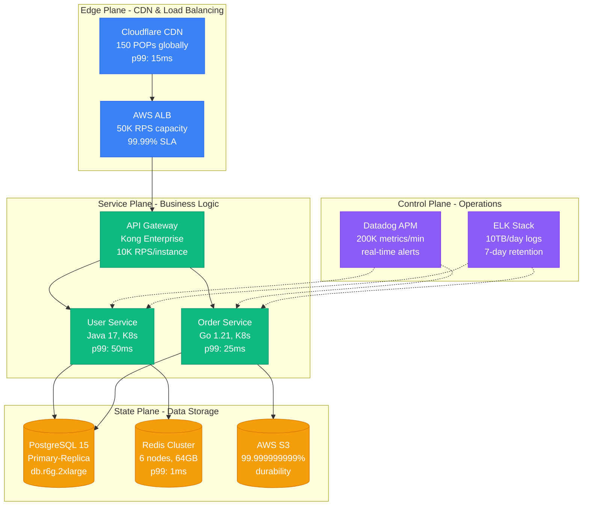
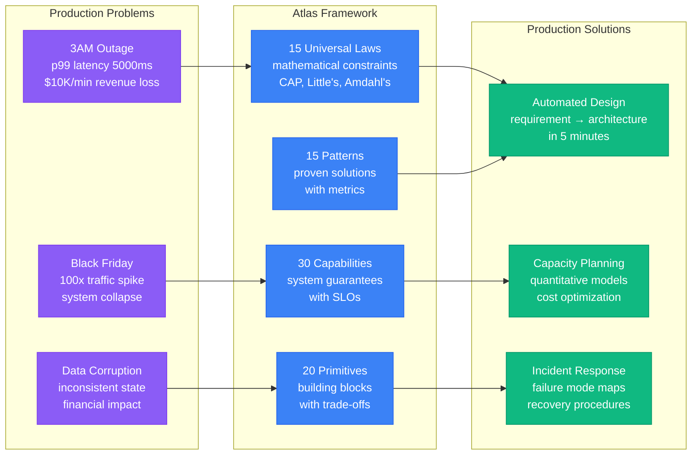
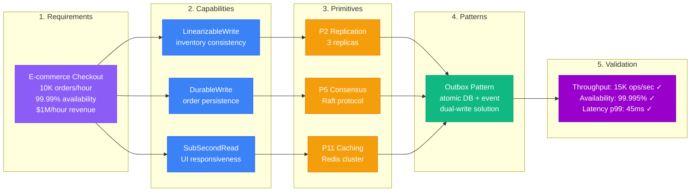

# Overview

## What is a Distributed System?

A distributed system is multiple independent computers appearing as a single coherent system.

## Why This Framework?

This framework provides systematic production-focused guidance instead of theoretical concepts.

## The Building Blocks

```mermaid
flowchart TB
    subgraph Laws["Universal Laws (15)"]
        CAP["CAP Theorem<br/>consistency vs availability<br/>during partition"]
        LITTLE["Little's Law<br/>users = rate × latency<br/>queueing theory"]
        AMDAHL["Amdahl's Law<br/>speedup = 1/(s+p/n)<br/>parallel limits"]
    end

    subgraph Capabilities["System Capabilities (30)"]
        CONS["Consistency<br/>linearizable: bank transfers<br/>eventual: social feeds"]
        PERF["Performance<br/>p99 < 100ms: user-facing<br/>p99 < 10ms: internal"]
        AVAIL["Availability<br/>99.99%: critical systems<br/>99.9%: internal tools"]
    end

    subgraph Primitives["Building Primitives (20)"]
        P1["P1 Partitioning<br/>10M users → 100 shards<br/>consistent hashing"]
        P2["P2 Replication<br/>3 replicas → 99.99% uptime<br/>async/sync modes"]
        P5["P5 Consensus<br/>Raft: 5-node cluster<br/>majority quorum"]
    end

    subgraph Patterns["Proven Patterns (15)"]
        OUTBOX["Outbox Pattern<br/>dual write problem<br/>transaction + event"]
        SAGA["Saga Pattern<br/>distributed transaction<br/>compensation actions"]
        CQRS["CQRS Pattern<br/>read/write separation<br/>eventual consistency"]
    end

    Laws --> Capabilities
    Capabilities --> Primitives
    Primitives --> Patterns

    classDef lawStyle fill:#8B5CF6,stroke:#7C3AED,color:#fff
    classDef capStyle fill:#3B82F6,stroke:#2563EB,color:#fff
    classDef primStyle fill:#F59E0B,stroke:#D97706,color:#fff
    classDef patternStyle fill:#10B981,stroke:#059669,color:#fff

    class CAP,LITTLE,AMDAHL lawStyle
    class CONS,PERF,AVAIL capStyle
    class P1,P2,P5 primStyle
    class OUTBOX,SAGA,CQRS patternStyle
```

| Component | Count | Purpose | Example |
|-----------|-------|---------|----------|
| **Universal Laws** | 15 | Mathematical constraints | CAP Theorem, Little's Law |
| **Capabilities** | 30 | System guarantees | Linearizable writes, p99 < 100ms |
| **Primitives** | 20 | Implementation building blocks | Consensus (Raft), Partitioning (hash) |
| **Patterns** | 15 | Proven architectural solutions | Outbox, Saga, CQRS |

## How to Use This Framework

Systematic 5-step process from requirements to validated architecture.

| Step | Input | Output | Time | Tool |
|------|-------|--------|------|------|
| **Requirements** | Business needs | Quantified SLOs | 15 min | Template |
| **Capabilities** | SLOs | System guarantees | 10 min | Mapping |
| **Primitives** | Capabilities | Building blocks | 15 min | Decision tree |
| **Patterns** | Primitives | Architecture | 20 min | Pattern matcher |
| **Validation** | Architecture | Verified design | 10 min | Quantitative models |

## Learning Path

Three tracks based on experience level and time investment.

| Path | Duration | Focus | Outcome |
|------|----------|-------|----------|
| **Beginner** | 2-4 weeks | Understand constraints | Design simple systems |
| **Intermediate** | 1-2 months | Production realities | Debug and scale systems |
| **Advanced** | 3-6 months | Automated design | Architect complex systems |

### Track Progression

| Week | Beginner | Intermediate | Advanced |
|------|----------|--------------|----------|
| **1-2** | Universal Laws | Primitives deep-dive | Decision algorithms |
| **3-4** | Capabilities overview | System patterns | Proof obligations |
| **5-8** | Micro-patterns | Production reality | API implementation |
| **9-12** | Case studies | Implementation guides | Pitfall analysis |
| **13-24** | - | Advanced patterns | Research & innovation |

## Key Principles

Production-tested principles that prevent 3AM incidents.

| Principle | Production Rule | Example | Cost of Violation |
|-----------|-----------------|---------|-------------------|
| **Design for Failure** | Every component fails | Netflix Chaos Monkey | $10M outage (AWS S3 2017) |
| **Measure Everything** | p99 latency, not average | Stripe's detailed metrics | $100M revenue loss potential |
| **Start Simple** | Boring technology wins | PostgreSQL over NoSQL | 6 months rebuilding complexity |
| **Learn from Production** | Blameless postmortems | Google's SRE culture | Repeated incidents cost 10x |

## Next Steps

Choose your path based on immediate needs and experience level.

| If you want to... | Go to... | Time needed |
|-------------------|----------|-------------|
| **Design a system in 15 minutes** | [Quick Start](quick-start.md) | 15 min |
| **Understand the mathematical foundations** | [Universal Laws](../foundation/universal-laws.md) | 2 hours |
| **Build production systems** | [Decision Engine](../patterns/decision-engine.md) | 1 day |
| **See real implementations** | [Implementation Guides](../examples/implementation.md) | 4 hours |
| **Debug production issues** | [Reality Check](../production/reality.md) | 30 min |

Distributed systems are complex by nature. This framework provides systematic navigation through that complexity.