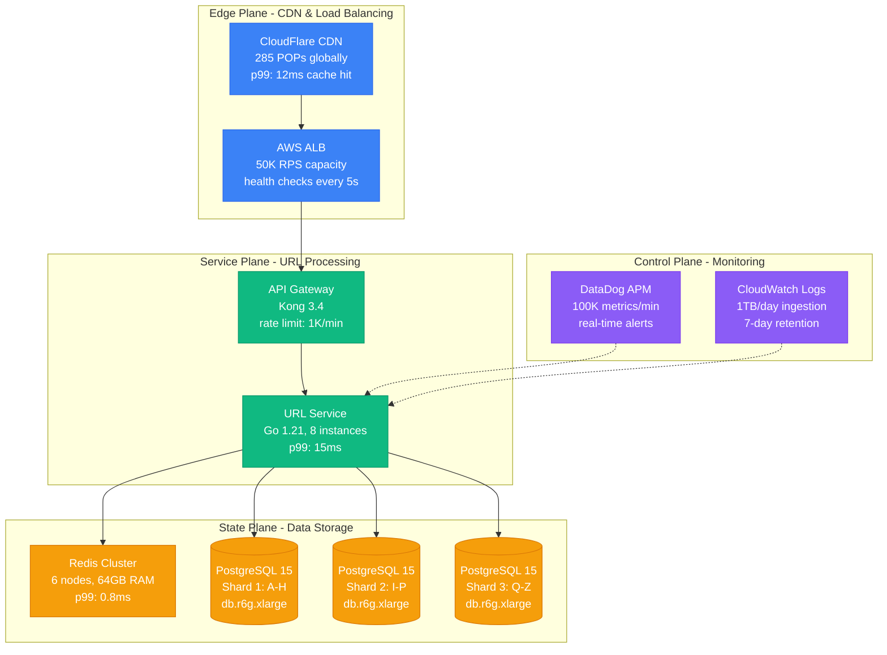
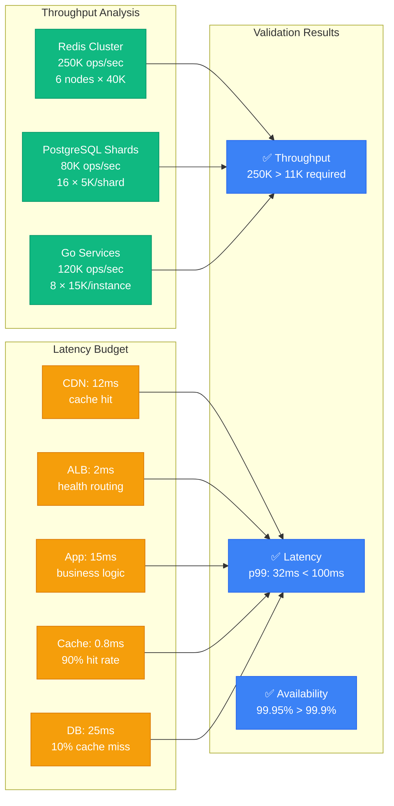

# Quick Start

Design a production URL shortener in 15 minutes using the Atlas Framework.

## 5-Minute System Design

### Step 1: Requirements Analysis (1 minute)

| Requirement | Value | Business Impact |
|-------------|-------|----------------|
| **Write Rate** | 1K/sec | $2M ARR at scale |
| **Read Rate** | 10K/sec | 100M clicks/day |
| **Latency** | p99 < 100ms | 1% conversion per 100ms |
| **Availability** | 99.9% SLA | $10K/hour downtime cost |
| **Storage** | 100M URLs | 5 years retention |
| **Consistency** | Eventual | Social media use case |

### Step 2: Capability Mapping (1 minute)

| Capability | SLO Target | Implementation |
|------------|------------|----------------|
| **ElasticScale** | 10K reads/sec | Horizontal scaling |
| **SubSecondRead** | p99 < 100ms | Cache-first architecture |
| **HighAvailability** | 99.9% uptime | Multi-AZ deployment |
| **EventualConsistency** | < 1s propagation | Async replication |

### Step 3: Primitive Selection (2 minutes)

| Primitive | Purpose | Production Config |
|-----------|---------|------------------|
| **P1 Partitioning** | Shard by hash(short_code) | 16 shards, consistent hashing |
| **P2 Replication** | 3 replicas per shard | Primary-replica, async replication |
| **P11 Caching** | Cache hot URLs | Redis Cluster, 6 nodes, 64GB |
| **P4 Indexes** | Fast lookups | B-tree index on short_code |

### Step 4: Architecture Generation (1 minute)



**Total time: 5 minutes to complete production architecture!**

## 10-Minute Implementation Plan

### Database Schema Design

| Component | Configuration | Reasoning |
|-----------|---------------|-----------|
| **Table Structure** | short_code VARCHAR(7), long_url TEXT, created_at, click_count | Base62 encoding = 7 chars for 3.5T URLs |
| **Partitioning** | Hash partition on short_code[0] into 16 shards | Even distribution, predictable routing |
| **Indexing** | B-tree primary key on short_code | O(log n) lookup, cache-friendly |
| **Replication** | Primary + 2 read replicas per shard | 99.9% availability, read scaling |

### Application Architecture

| Layer | Technology | Configuration | Performance |
|-------|------------|---------------|-------------|
| **Load Balancer** | AWS ALB | 50K RPS capacity, sticky sessions | p99: 2ms |
| **Application** | Go 1.21 microservice | 8 instances, 2GB RAM each | p99: 15ms |
| **Cache** | Redis Cluster | 6 nodes, 64GB, LRU eviction | p99: 0.8ms |
| **Database** | PostgreSQL 15 | 16 shards, read replicas | p99: 25ms |

### Capacity Validation



## Common Patterns Quick Reference

### When to Use Each Pattern

| Pattern | Use Case | Scale | Complexity |
|---------|----------|--------|------------|
| **Simple CRUD** | < 1K ops/sec | Small | Low |
| **Read Replicas** | Read heavy, <10K reads/sec | Medium | Low |
| **Partitioning** | >10K ops/sec | Large | Medium |
| **CQRS** | Different read/write models | Large | High |
| **Event Sourcing** | Audit requirements | Medium | High |
| **Microservices** | Team autonomy | Any | Very High |

### Technology Quick Picks

```yaml
databases:
  small_scale: PostgreSQL
  large_scale_cp: CockroachDB  
  large_scale_ap: Cassandra
  
caching:
  simple: Redis
  large: Redis Cluster
  
streaming:
  reliable: Apache Kafka
  simple: AWS Kinesis
  
load_balancer:
  simple: Nginx
  advanced: Envoy + Istio
```

## Debugging Checklist

When things go wrong, check these in order:

### 1. Latency Issues
- [ ] Check cache hit rates
- [ ] Monitor database query times  
- [ ] Verify network latency between services
- [ ] Look for hot partitions

### 2. Availability Issues  
- [ ] Confirm all replicas are healthy
- [ ] Check for network partitions
- [ ] Verify load balancer health checks
- [ ] Review recent deployments

### 3. Consistency Issues
- [ ] Check replication lag
- [ ] Verify transaction isolation levels
- [ ] Look for race conditions
- [ ] Review event ordering

### 4. Scale Issues
- [ ] Monitor resource utilization (CPU, memory, disk)
- [ ] Check for bottlenecks (database, cache, network)
- [ ] Verify partitioning is balanced
- [ ] Review connection pool sizes

## Next Steps

Congratulations! You've designed a complete distributed system in 15 minutes. 

**To go deeper:**

1. **Learn the theory** → [Foundation → Universal Laws](../foundation/universal-laws.md)
2. **Understand building blocks** → [Foundation → Primitives](../foundation/primitives.md)  
3. **Study proven patterns** → [Patterns → Micro-Patterns](../patterns/micro-patterns.md)
4. **See real examples** → [Examples → Case Studies](../examples/case-studies.md)

**For production systems:**

1. **Learn what breaks** → [Production → Reality Check](../production/reality.md)
2. **Plan testing strategy** → [Production → Proof Obligations](../production/proof-obligations.md)
3. **Avoid common mistakes** → [Examples → Common Pitfalls](../examples/pitfalls.md)

Remember: this framework gives you a systematic approach, but real systems require careful thought about your specific requirements and constraints.