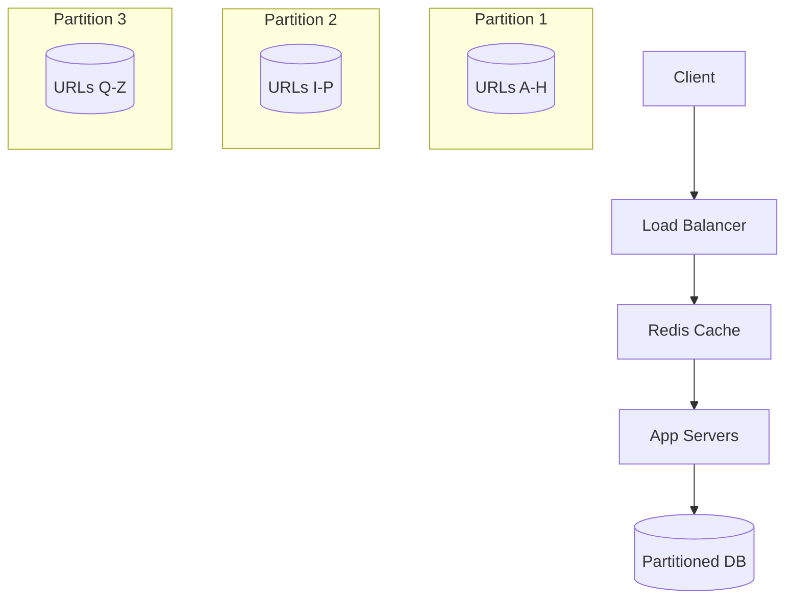

# Quick Start

Get up and running with the Distributed Systems Framework in 15 minutes.

## 5-Minute System Design

Let's design a simple URL shortener like bit.ly using the framework.

### Step 1: Requirements Analysis (1 minute)

```yaml
requirements:
  scale: 1000 writes/sec, 10K reads/sec
  latency: <100ms for reads
  availability: 99.9%
  consistency: eventual (social media use case)
  storage: 100M URLs
```

### Step 2: Capability Mapping (1 minute)

Based on requirements, we need:
- **ElasticScale**: Handle 10K reads/sec
- **SubSecondRead**: <100ms latency  
- **HighAvailability**: 99.9% uptime
- **EventualConsistency**: Social media tolerance

### Step 3: Primitive Selection (2 minutes)

Framework suggests these primitives:
- **P1 Partitioning**: Shard URLs by hash for scale
- **P2 Replication**: 3 replicas for availability
- **P11 Caching**: Cache popular URLs for performance
- **P4 Indexes**: Hash index for O(1) lookup

### Step 4: Architecture Generation (1 minute)



**Total time: 5 minutes to complete architecture!**

## 10-Minute Implementation Plan

### Database Schema
```sql
-- Partition by first character of short_code
CREATE TABLE urls (
    short_code VARCHAR(7) PRIMARY KEY,
    long_url TEXT NOT NULL,
    created_at TIMESTAMP DEFAULT NOW(),
    expires_at TIMESTAMP,
    click_count INTEGER DEFAULT 0
);

-- Index for fast lookups
CREATE INDEX idx_short_code ON urls(short_code);
```

### Application Logic
```python
class URLShortener:
    def __init__(self):
        self.cache = Redis()
        self.db_shards = [DB1, DB2, DB3]  # 3 partitions
    
    def shorten_url(self, long_url):
        short_code = generate_short_code()
        shard = self.get_shard(short_code)
        
        # Write to database
        shard.insert(short_code, long_url)
        
        # Warm cache
        self.cache.set(short_code, long_url, ttl=3600)
        
        return short_code
    
    def get_url(self, short_code):
        # Try cache first (P11)
        url = self.cache.get(short_code)
        if url:
            return url
            
        # Fallback to database (P1)
        shard = self.get_shard(short_code)
        url = shard.get(short_code)
        
        if url:
            # Cache for next time
            self.cache.set(short_code, url, ttl=3600)
            
        return url
        
    def get_shard(self, short_code):
        # Simple hash partitioning
        shard_id = hash(short_code[0]) % len(self.db_shards)
        return self.db_shards[shard_id]
```

### Capacity Validation
```python
# Framework's quantitative models
def validate_design():
    # Throughput calculation
    cache_ops_per_second = 50_000  # Redis capacity
    db_ops_per_shard = 5_000       # DB capacity per shard
    num_shards = 3
    
    max_reads = cache_ops_per_second  # Cache handles reads
    max_writes = num_shards * db_ops_per_shard * 0.7  # 70% utilization
    
    assert max_reads >= 10_000   # Requirement: 10K reads/sec
    assert max_writes >= 1_000   # Requirement: 1K writes/sec
    
    # Latency calculation  
    cache_latency_p99 = 1   # 1ms
    db_latency_p99 = 50     # 50ms
    
    # 90% cache hit rate
    effective_latency_p99 = 0.9 * cache_latency_p99 + 0.1 * db_latency_p99
    assert effective_latency_p99 < 100  # Requirement: <100ms
    
    print("✅ Design validated!")
```

## Common Patterns Quick Reference

### When to Use Each Pattern

| Pattern | Use Case | Scale | Complexity |
|---------|----------|--------|------------|
| **Simple CRUD** | < 1K ops/sec | Small | Low |
| **Read Replicas** | Read heavy, <10K reads/sec | Medium | Low |
| **Partitioning** | >10K ops/sec | Large | Medium |
| **CQRS** | Different read/write models | Large | High |
| **Event Sourcing** | Audit requirements | Medium | High |
| **Microservices** | Team autonomy | Any | Very High |

### Technology Quick Picks

```yaml
databases:
  small_scale: PostgreSQL
  large_scale_cp: CockroachDB  
  large_scale_ap: Cassandra
  
caching:
  simple: Redis
  large: Redis Cluster
  
streaming:
  reliable: Apache Kafka
  simple: AWS Kinesis
  
load_balancer:
  simple: Nginx
  advanced: Envoy + Istio
```

## Debugging Checklist

When things go wrong, check these in order:

### 1. Latency Issues
- [ ] Check cache hit rates
- [ ] Monitor database query times  
- [ ] Verify network latency between services
- [ ] Look for hot partitions

### 2. Availability Issues  
- [ ] Confirm all replicas are healthy
- [ ] Check for network partitions
- [ ] Verify load balancer health checks
- [ ] Review recent deployments

### 3. Consistency Issues
- [ ] Check replication lag
- [ ] Verify transaction isolation levels
- [ ] Look for race conditions
- [ ] Review event ordering

### 4. Scale Issues
- [ ] Monitor resource utilization (CPU, memory, disk)
- [ ] Check for bottlenecks (database, cache, network)
- [ ] Verify partitioning is balanced
- [ ] Review connection pool sizes

## Next Steps

Congratulations! You've designed a complete distributed system in 15 minutes. 

**To go deeper:**

1. **Learn the theory** → [Foundation → Universal Laws](../foundation/universal-laws.md)
2. **Understand building blocks** → [Foundation → Primitives](../foundation/primitives.md)  
3. **Study proven patterns** → [Patterns → Micro-Patterns](../patterns/micro-patterns.md)
4. **See real examples** → [Examples → Case Studies](../examples/case-studies.md)

**For production systems:**

1. **Learn what breaks** → [Production → Reality Check](../production/reality.md)
2. **Plan testing strategy** → [Production → Proof Obligations](../production/proof-obligations.md)
3. **Avoid common mistakes** → [Examples → Common Pitfalls](../examples/pitfalls.md)

Remember: this framework gives you a systematic approach, but real systems require careful thought about your specific requirements and constraints.