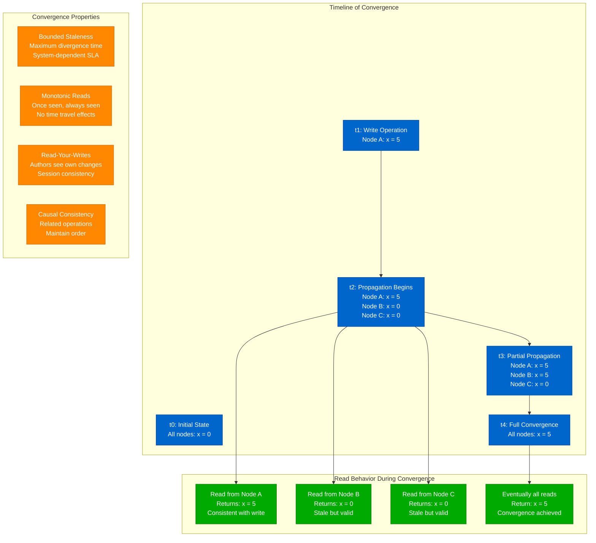
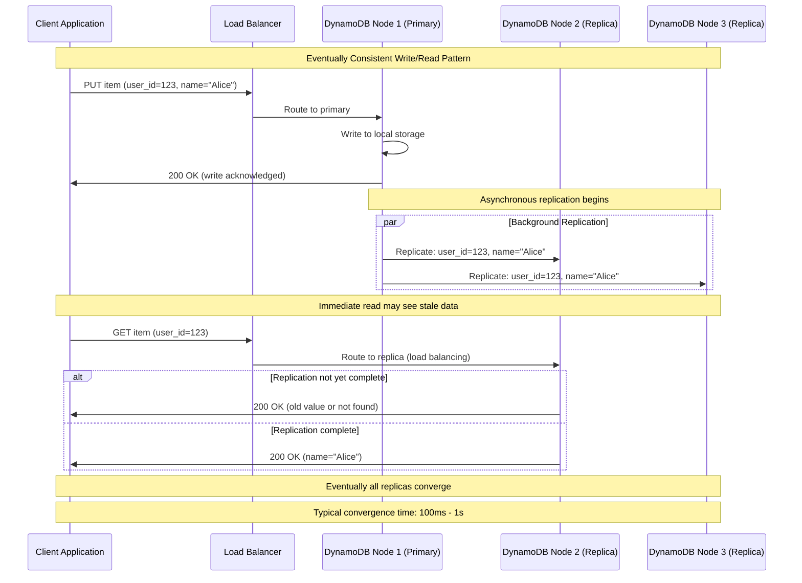
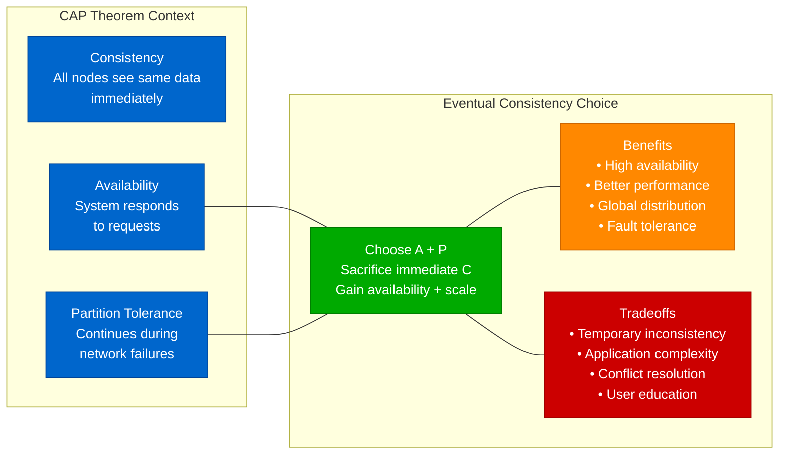
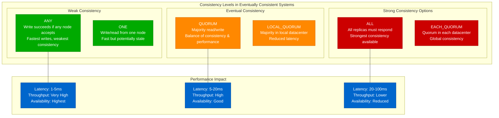
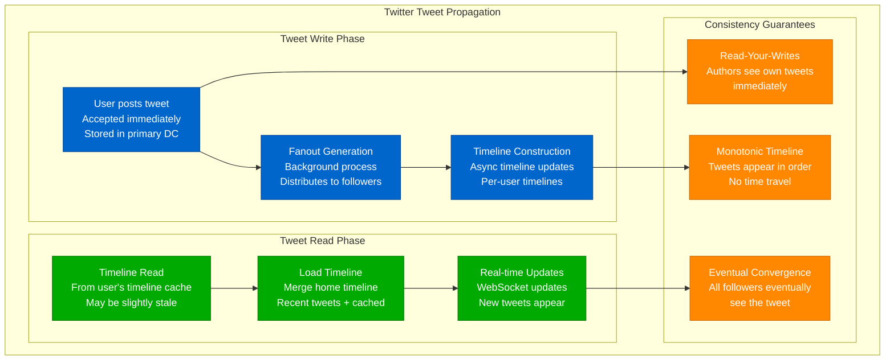
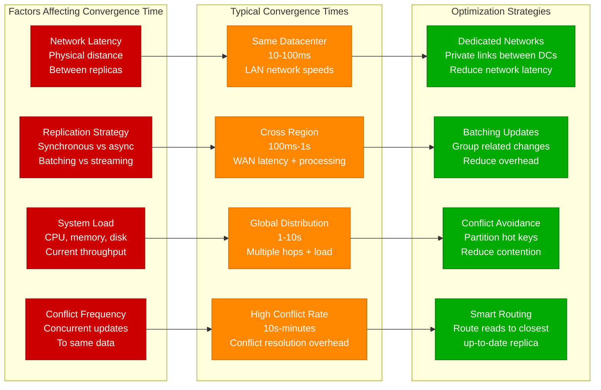
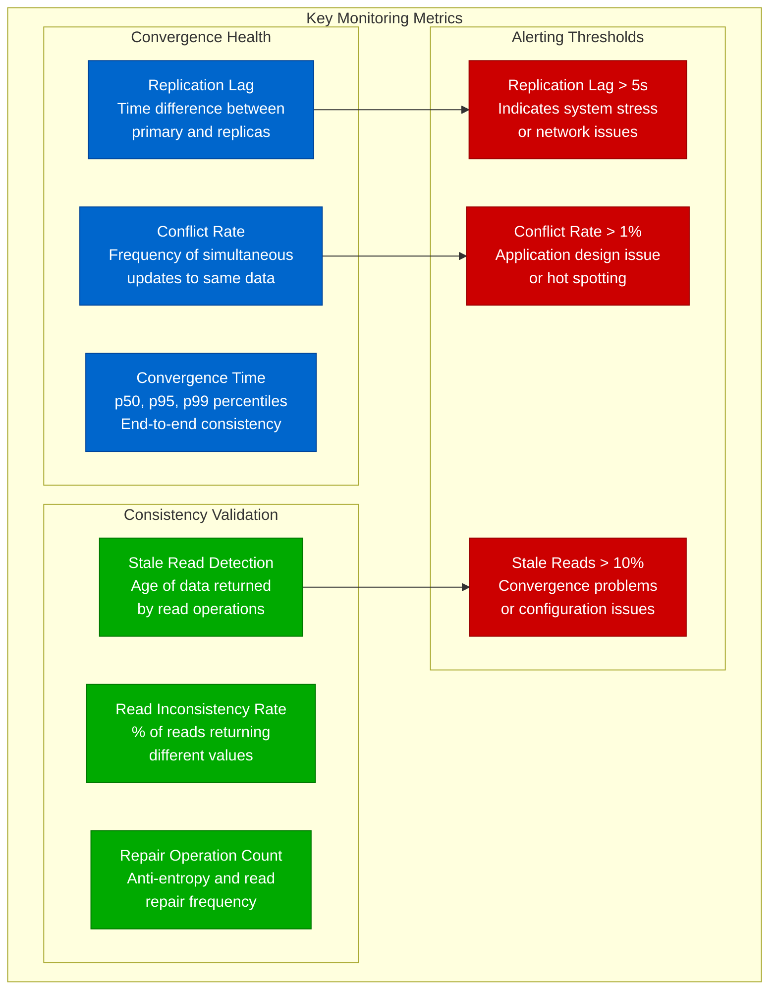

# Eventual Consistency Concept: Basic Convergence Model

## Overview

Eventual consistency is a weak consistency model where the system guarantees that if no new updates are made to an object, eventually all accesses will return the last updated value. This model enables high availability and partition tolerance at the cost of immediate consistency.

**Key Insight**: Eventual consistency trades immediate consistency for performance, availability, and scale.

## Basic Convergence Model



## Amazon DynamoDB Example



## Convergence Patterns

```mermaid
graph TB
    subgraph ConvergencePatterns[Convergence Patterns]
        subgraph AntiEntropy[Anti-Entropy Reconciliation]
            AE1[Periodic Synchronization<br/>Merkle tree comparison<br/>Detect and repair differences]
            AE2[Background Process<br/>Continuously running<br/>Low priority operation]
            AE3[Gossip Protocol<br/>Peer-to-peer propagation<br/>Epidemic spreading]
        end

        subgraph ReadRepair[Read Repair]
            RR1[Read from Multiple Nodes<br/>Compare returned values<br/>Detect inconsistencies]
            RR2[Repair on Read<br/>Update stale replicas<br/>Lazy convergence]
            RR3[Client-Side Resolution<br/>Application handles conflicts<br/>Business logic decides]
        end

        subgraph HintedHandoff[Hinted Handoff]
            HH1[Temporary Storage<br/>Store updates for offline nodes<br/>Hints directory]
            HH2[Node Recovery<br/>Replay missed updates<br/>When node comes back online]
            HH3[Bounded Storage<br/>Limit hint storage<br/>TTL for old hints]
        end
    end

    subgraph SystemExamples[Real System Examples]
        SE1[Amazon DynamoDB<br/>Anti-entropy + Read repair<br/>Configurable consistency]
        SE2[Apache Cassandra<br/>All three patterns<br/>Tunable consistency levels]
        SE3[Riak KV<br/>Vector clocks + CRDTs<br/>Automatic conflict resolution]
    end

    AE1 --- SE1
    RR1 --- SE2
    HH1 --- SE3

    classDef antiEntropyStyle fill:#0066CC,stroke:#004499,color:#fff
    classDef readRepairStyle fill:#00AA00,stroke:#007700,color:#fff
    classDef hintedHandoffStyle fill:#FF8800,stroke:#CC6600,color:#fff
    classDef systemStyle fill:#CC0000,stroke:#990000,color:#fff

    class AE1,AE2,AE3 antiEntropyStyle
    class RR1,RR2,RR3 readRepairStyle
    class HH1,HH2,HH3 hintedHandoffStyle
    class SE1,SE2,SE3 systemStyle
```



## CAP Theorem and Eventual Consistency



## Consistency Levels Spectrum



## Social Media Example: Twitter



## Convergence Time Analysis



## Production Monitoring



## Testing Eventual Consistency

```python
# Example test for eventual consistency
import time
import random
import asyncio

class EventualConsistencyTest:
    def __init__(self, nodes, consistency_target_ms=1000):
        self.nodes = nodes
        self.consistency_target = consistency_target_ms / 1000.0

    async def test_write_propagation(self):
        """Test that writes eventually propagate to all replicas"""
        key = f"test_key_{random.randint(1, 1000000)}"
        value = f"test_value_{time.time()}"

        # Write to primary node
        primary = self.nodes[0]
        write_time = time.time()
        await primary.write(key, value)

        # Monitor convergence across all replicas
        converged = False
        start_time = time.time()

        while not converged and (time.time() - start_time) < 10:
            # Read from all nodes
            values = []
            for node in self.nodes:
                try:
                    val = await node.read(key)
                    values.append(val)
                except:
                    values.append(None)

            # Check if all nodes have converged
            if all(v == value for v in values):
                converged = True
                convergence_time = time.time() - write_time
                print(f"Convergence achieved in {convergence_time:.3f}s")

                # Validate SLA
                assert convergence_time <= self.consistency_target, \
                    f"Convergence took {convergence_time:.3f}s, exceeds {self.consistency_target}s SLA"
            else:
                await asyncio.sleep(0.01)  # Check every 10ms

        assert converged, f"Failed to converge within 10 seconds. Values: {values}"

    async def test_read_your_writes(self):
        """Test that users can read their own writes immediately"""
        key = f"ryw_test_{random.randint(1, 1000000)}"
        value = f"ryw_value_{time.time()}"

        # Write to system
        await self.nodes[0].write(key, value)

        # Immediately read back - should see our own write
        read_value = await self.nodes[0].read(key)
        assert read_value == value, "Read-your-writes violation"

    async def test_monotonic_reads(self):
        """Test that reads don't go backwards in time"""
        key = f"monotonic_test_{random.randint(1, 1000000)}"

        # Write initial value
        await self.nodes[0].write(key, "v1")
        await asyncio.sleep(0.1)  # Allow propagation

        # Read from a replica
        replica = self.nodes[1]
        v1 = await replica.read(key)

        # Write new value
        await self.nodes[0].write(key, "v2")
        await asyncio.sleep(0.1)

        # Read again from same replica - should not see older value
        v2 = await replica.read(key)

        # Monotonic read: once we've seen v2, we shouldn't see v1 again
        if v2 == "v2":
            # If we've seen the new value, continue reading shouldn't go back
            for _ in range(10):
                v = await replica.read(key)
                assert v != "v1", "Monotonic read violation: saw old value after new"
                await asyncio.sleep(0.01)
```

## Common Pitfalls

```mermaid
graph TB
    subgraph CommonPitfalls[Common Pitfalls in Eventually Consistent Systems]

        subgraph ApplicationLogic[Application Logic Issues]
            AL1[❌ Assuming Immediate Consistency<br/>Reading right after write<br/>Expecting latest value]
            AL2[❌ No Conflict Resolution<br/>Multiple writers<br/>Last writer wins only]
            AL3[❌ Ignoring Causal Dependencies<br/>Operations that depend<br/>on previous operations]
        end

        subgraph UserExperience[User Experience Issues]
            UE1[❌ Confusing User Interface<br/>Data appears and disappears<br/>No explanation provided]
            UE2[❌ Inconsistent Views<br/>Different screens show<br/>different data]
            UE3[❌ No Feedback on Propagation<br/>Users don't know<br/>when changes are visible]
        end

        subgraph SystemDesign[System Design Issues]
            SD1[❌ Hot Spotting<br/>All writes to same<br/>partition or key]
            SD2[❌ Unbounded Staleness<br/>No maximum lag<br/>guarantees]
            SD3[❌ Inadequate Monitoring<br/>Can't detect or debug<br/>consistency issues]
        end
    end

    subgraph BestPractices[Best Practices]
        BP1[✅ Design for Eventual Consistency<br/>Build application logic<br/>that handles delays]
        BP2[✅ Implement Conflict Resolution<br/>CRDTs or application-level<br/>merge strategies]
        BP3[✅ Provide User Feedback<br/>Show sync status<br/>Explain temporary inconsistencies]
        BP4[✅ Monitor Convergence<br/>Track replication lag<br/>Alert on SLA violations]
    end

    AL1 --> BP1
    AL2 --> BP2
    UE1 --> BP3
    SD3 --> BP4

    classDef pitfallStyle fill:#CC0000,stroke:#990000,color:#fff
    classDef practiceStyle fill:#00AA00,stroke:#007700,color:#fff

    class AL1,AL2,AL3,UE1,UE2,UE3,SD1,SD2,SD3 pitfallStyle
    class BP1,BP2,BP3,BP4 practiceStyle
```



## Key Takeaways

1. **Eventual consistency enables massive scale** - Systems like Amazon, Facebook, and Twitter rely on it
2. **Convergence is guaranteed but not immediate** - "Eventually" can range from milliseconds to seconds
3. **Application design must account for delays** - Don't assume immediate consistency
4. **Multiple convergence patterns exist** - Anti-entropy, read repair, hinted handoff
5. **Monitoring is crucial** - Track replication lag and convergence time
6. **User experience matters** - Educate users about temporary inconsistencies
7. **Conflict resolution is essential** - Multiple writers require merge strategies
8. **Testing requires specialized approaches** - Validate convergence behavior under various conditions

Eventual consistency is the foundation for building highly available, scalable distributed systems at the cost of immediate consistency guarantees.