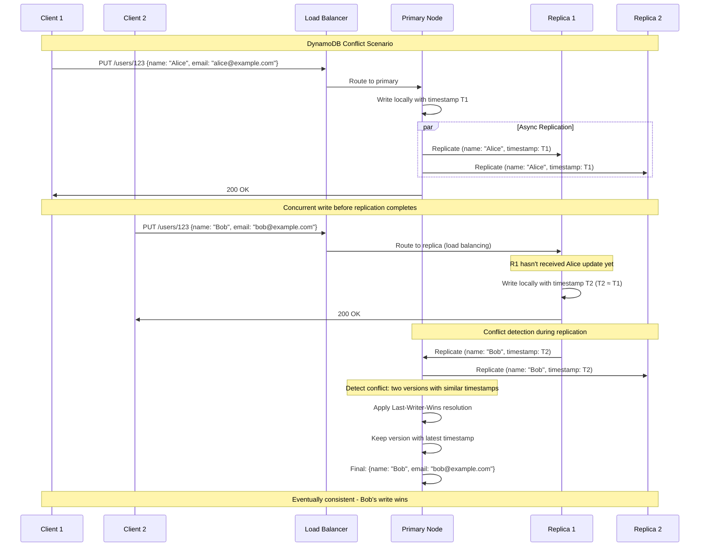
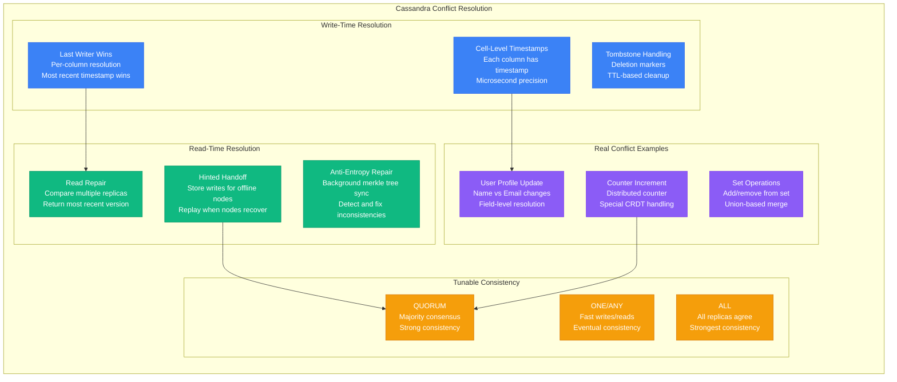
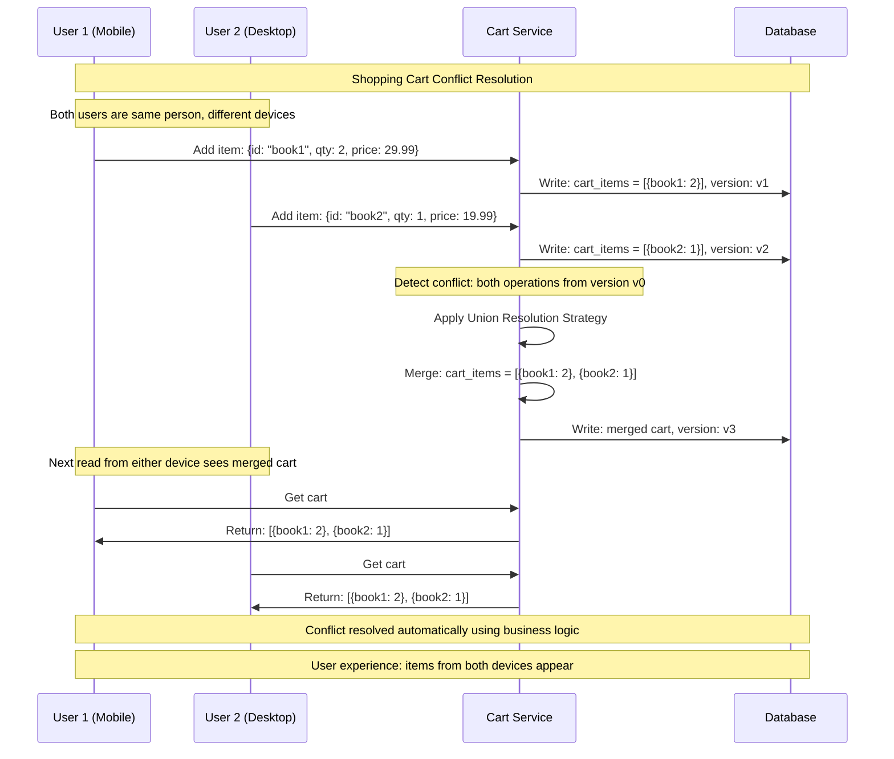
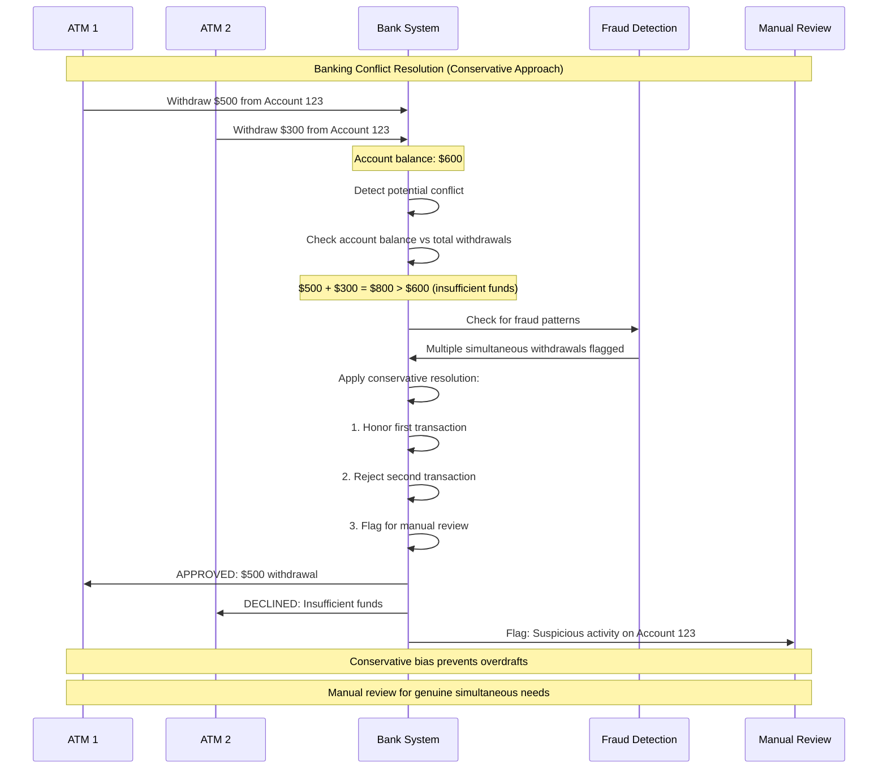
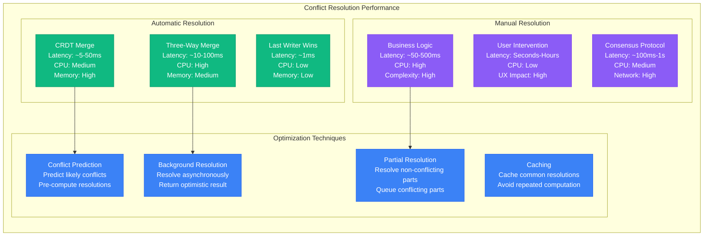

# Eventual Consistency Conflicts: Resolution Strategies

## Overview

In eventually consistent systems, conflicts are inevitable when multiple clients update the same data concurrently. This guide examines conflict detection, resolution strategies, and real-world implementations used by systems like Amazon DynamoDB, Apache Cassandra, and collaborative applications.

## Conflict Detection Architecture

```mermaid
graph TB
    subgraph ConflictDetectionSystem[Conflict Detection System]
        subgraph ClientLayer[Client Layer - Blue]
            C1[Client A<br/>Writes: user.name = "Alice"]
            C2[Client B<br/>Writes: user.name = "Bob"]
            C3[Client C<br/>Reads and detects conflicts]
        end

        subgraph DetectionLayer[Detection Layer - Green]
            VD[Version Detection<br/>Compare vector clocks<br/>Identify concurrent updates]
            TD[Timestamp Detection<br/>Check write timestamps<br/>Detect overlapping windows]
            HD[Hash Detection<br/>Content hash comparison<br/>Identify value differences]
        end

        subgraph ConflictStorage[Conflict Storage - Orange]
            CS[Conflict Store<br/>Maintain multiple versions<br/>Until resolution]
            VS[Version Store<br/>Vector clock metadata<br/>Causal history tracking]
            MS[Merge State<br/>Resolution progress<br/>Partial merge results]
        end

        subgraph ResolutionEngine[Resolution Engine - Red]
            AR[Automatic Resolution<br/>CRDT merge functions<br/>Deterministic algorithms]
            MR[Manual Resolution<br/>Application-level logic<br/>Business rules]
            DR[Default Resolution<br/>Last-writer-wins<br/>Fallback strategies]
        end
    end

    %% Flow connections
    C1 --> VD
    C2 --> TD
    C3 --> HD

    VD --> CS
    TD --> VS
    HD --> MS

    CS --> AR
    VS --> MR
    MS --> DR

    %% Apply 4-plane colors
    classDef clientStyle fill:#3B82F6,stroke:#2563EB,color:#fff
    classDef detectionStyle fill:#10B981,stroke:#059669,color:#fff
    classDef storageStyle fill:#F59E0B,stroke:#D97706,color:#fff
    classDef resolutionStyle fill:#8B5CF6,stroke:#7C3AED,color:#fff

    class C1,C2,C3 clientStyle
    class VD,TD,HD detectionStyle
    class CS,VS,MS storageStyle
    class AR,MR,DR resolutionStyle
```

## Conflict Resolution Strategies

```mermaid
graph TB
    subgraph ResolutionStrategies[Conflict Resolution Strategies]
        subgraph AutomaticStrategies[Automatic Resolution]
            AS1[Last Writer Wins (LWW)<br/>Use timestamp to decide<br/>Simple but loses data]
            AS2[First Writer Wins<br/>First update takes precedence<br/>Reject later updates]
            AS3[CRDT Merge<br/>Automatic mathematical merge<br/>No data loss, always converges]
            AS4[Union/Intersection<br/>Set-based operations<br/>Combine or intersect values]
        end

        subgraph ApplicationStrategies[Application-Level Resolution]
            AppS1[Business Logic Rules<br/>Domain-specific resolution<br/>Priority-based decisions]
            AppS2[User Preference<br/>User chooses resolution<br/>Interactive conflict handling]
            AppS3[Compensation Actions<br/>Undo conflicting operations<br/>Saga pattern]
            AppS4[Merge Templates<br/>Predefined merge strategies<br/>Schema-aware resolution]
        end

        subgraph HybridStrategies[Hybrid Approaches]
            HS1[Hierarchical Resolution<br/>Different strategies per field<br/>Fine-grained control]
            HS2[Temporal Resolution<br/>Time-window based merging<br/>Recent changes prioritized]
            HS3[Consensus-Based<br/>Multiple nodes vote<br/>Democratic resolution]
            HS4[ML-Assisted<br/>Machine learning prediction<br/>Intent-based resolution]
        end
    end

    subgraph UseCaseMapping[Use Case Examples]
        UC1[Shopping Carts<br/>Union of items<br/>Additive merge]
        UC2[User Profiles<br/>Field-level LWW<br/>Per-attribute resolution]
        UC3[Collaborative Docs<br/>OT/CRDT merge<br/>Automatic text merging]
        UC4[Financial Records<br/>Manual resolution<br/>Human oversight required]
    end

    AS3 --> UC1
    AppS1 --> UC2
    AS3 --> UC3
    AppS2 --> UC4

    classDef autoStyle fill:#3B82F6,stroke:#2563EB,color:#fff
    classDef appStyle fill:#10B981,stroke:#059669,color:#fff
    classDef hybridStyle fill:#F59E0B,stroke:#D97706,color:#fff
    classDef useCaseStyle fill:#8B5CF6,stroke:#7C3AED,color:#fff

    class AS1,AS2,AS3,AS4 autoStyle
    class AppS1,AppS2,AppS3,AppS4 appStyle
    class HS1,HS2,HS3,HS4 hybridStyle
    class UC1,UC2,UC3,UC4 useCaseStyle
```

## Amazon DynamoDB Conflict Resolution



## Apache Cassandra Multi-Version Conflict Resolution



## Shopping Cart Conflict Resolution Example



## Collaborative Text Editing Conflicts

```mermaid
graph TB
    subgraph CollaborativeConflicts[Collaborative Text Editing Conflicts]
        subgraph OperationalTransform[Operational Transform (OT)]
            OT1[Transform Operations<br/>Convert concurrent ops<br/>Maintain text integrity]
            OT2[Operation Types<br/>Insert, Delete, Retain<br/>Position-based transforms]
            OT3[Convergence Property<br/>All clients reach<br/>same final state]
        end

        subgraph CRDTApproach[CRDT Approach]
            CRDT1[Position Identifiers<br/>Unique position for each char<br/>Global ordering]
            CRDT2[Tree Structure<br/>Hierarchical positions<br/>Dense ordering]
            CRDT3[Tombstone Deletion<br/>Mark deleted, don't remove<br/>Preserve position space]
        end

        subgraph ConflictScenarios[Common Conflict Scenarios]
            CS1[Simultaneous Insert<br/>Same position insertion<br/>Transform operations]
            CS2[Delete vs Insert<br/>Delete char that was<br/>concurrently modified]
            CS3[Format Conflicts<br/>Bold vs Italic<br/>Style attribute merge]
        end

        subgraph ResolutionStrategies[Resolution Examples]
            RS1[Character Interleaving<br/>Insert A: "Hello"<br/>Insert B: "World"<br/>Result: "HWeorlrlldo"]
            RS2[Intention Preservation<br/>Maintain semantic intent<br/>Not just position]
            RS3[Style Merging<br/>Combine formatting<br/>Bold + Italic = Both]
        end
    end

    OT1 --> CS1
    CRDT1 --> CS2
    OT2 --> RS1
    CRDT2 --> RS2

    classDef otStyle fill:#3B82F6,stroke:#2563EB,color:#fff
    classDef crdtStyle fill:#10B981,stroke:#059669,color:#fff
    classDef scenarioStyle fill:#F59E0B,stroke:#D97706,color:#fff
    classDef resolutionStyle fill:#8B5CF6,stroke:#7C3AED,color:#fff

    class OT1,OT2,OT3 otStyle
    class CRDT1,CRDT2,CRDT3 crdtStyle
    class CS1,CS2,CS3 scenarioStyle
    class RS1,RS2,RS3 resolutionStyle
```

## Git-Style Three-Way Merge

```python
class ThreeWayMerge:
    """Git-style three-way merge for structured data"""

    def __init__(self):
        self.conflict_markers = []

    def merge(self, base, ours, theirs):
        """
        Three-way merge algorithm
        base: common ancestor version
        ours: our version
        theirs: their version
        """
        if ours == theirs:
            return ours  # No conflict

        if ours == base:
            return theirs  # We didn't change, use theirs

        if theirs == base:
            return ours  # They didn't change, use ours

        # Both changed - need resolution strategy
        return self.resolve_conflict(base, ours, theirs)

    def resolve_conflict(self, base, ours, theirs):
        """Resolve conflicts using various strategies"""

        if isinstance(ours, dict) and isinstance(theirs, dict):
            return self.merge_objects(base or {}, ours, theirs)

        if isinstance(ours, list) and isinstance(theirs, list):
            return self.merge_arrays(base or [], ours, theirs)

        if isinstance(ours, str) and isinstance(theirs, str):
            return self.merge_strings(base or "", ours, theirs)

        # For primitives, create conflict marker
        return self.create_conflict_marker(ours, theirs)

    def merge_objects(self, base, ours, theirs):
        """Merge objects field by field"""
        result = {}
        all_keys = set(base.keys()) | set(ours.keys()) | set(theirs.keys())

        for key in all_keys:
            base_val = base.get(key)
            our_val = ours.get(key)
            their_val = theirs.get(key)

            result[key] = self.merge(base_val, our_val, their_val)

        return result

    def merge_arrays(self, base, ours, theirs):
        """Merge arrays using LCS-based algorithm"""
        # Simplified: use set union for demonstration
        # Real implementation would use LCS diff
        base_set = set(base)
        our_additions = set(ours) - base_set
        their_additions = set(theirs) - base_set
        our_removals = base_set - set(ours)
        their_removals = base_set - set(theirs)

        # Start with base
        result = set(base)

        # Apply non-conflicting changes
        result.update(our_additions)
        result.update(their_additions)
        result -= (our_removals | their_removals)

        return list(result)

    def merge_strings(self, base, ours, theirs):
        """Merge strings using diff algorithm"""
        # Simplified implementation
        if len(ours) == len(theirs) == len(base):
            # Character-by-character merge
            result = []
            for i in range(len(base)):
                base_char = base[i]
                our_char = ours[i]
                their_char = theirs[i]

                if our_char == their_char:
                    result.append(our_char)
                elif our_char == base_char:
                    result.append(their_char)
                elif their_char == base_char:
                    result.append(our_char)
                else:
                    # Conflict
                    result.append(f"<<<{our_char}||{their_char}>>>")

            return ''.join(result)

        return self.create_conflict_marker(ours, theirs)

    def create_conflict_marker(self, ours, theirs):
        """Create conflict marker for manual resolution"""
        conflict = {
            "conflict": True,
            "ours": ours,
            "theirs": theirs,
            "resolution_needed": True
        }
        self.conflict_markers.append(conflict)
        return conflict

# Example usage
def demonstrate_three_way_merge():
    merger = ThreeWayMerge()

    # Example: User profile merge
    base = {
        "name": "John Doe",
        "email": "john@example.com",
        "preferences": {"theme": "light", "notifications": True}
    }

    ours = {
        "name": "John Doe",
        "email": "john.doe@example.com",  # We changed email
        "preferences": {"theme": "dark", "notifications": True}  # We changed theme
    }

    theirs = {
        "name": "John D. Doe",  # They changed name
        "email": "john@example.com",
        "preferences": {"theme": "light", "notifications": False}  # They changed notifications
    }

    result = merger.merge(base, ours, theirs)
    print("Merged result:", result)

    # Expected result:
    # {
    #   "name": "John D. Doe",           # Their change
    #   "email": "john.doe@example.com", # Our change
    #   "preferences": {
    #     "theme": "dark",               # Our change
    #     "notifications": False         # Their change
    #   }
    # }

demonstrate_three_way_merge()
```

## Real-World Conflict Resolution: Slack

```mermaid
graph TB
    subgraph SlackConflictResolution[Slack Message Conflict Resolution]
        subgraph MessageTypes[Message Types]
            MT1[Text Messages<br/>Append-only log<br/>No conflicts possible]
            MT2[Message Edits<br/>Last edit wins<br/>Show edit history]
            MT3[Reactions<br/>Set-based CRDT<br/>Union of all reactions]
            MT4[Thread Replies<br/>Append-only per thread<br/>Causal ordering]
        end

        subgraph ConflictScenarios[Conflict Scenarios]
            CS1[Simultaneous Edits<br/>Same message edited<br/>by multiple users]
            CS2[Edit vs Delete<br/>Message edited while<br/>being deleted]
            CS3[Reaction Conflicts<br/>Same user reacts<br/>from multiple devices]
            CS4[Thread Branching<br/>Reply to same message<br/>different thread positions]
        end

        subgraph ResolutionStrategies[Resolution Strategies]
            RS1[Timestamp Ordering<br/>Most recent edit wins<br/>Preserve edit history]
            RS2[Delete Precedence<br/>Deletion always wins<br/>over edits]
            RS3[Reaction Deduplication<br/>Per-user reaction limit<br/>Most recent wins]
            RS4[Append Order<br/>Thread replies in<br/>server receive order]
        end

        subgraph UserExperience[User Experience]
            UX1[Edit Indicators<br/>"(edited)" marker<br/>Transparency to users]
            UX2[Conflict Notifications<br/>Toast messages<br/>When conflicts occur]
            UX3[Optimistic Updates<br/>Show immediately<br/>Correct if conflicts]
            UX4[Real-time Sync<br/>WebSocket updates<br/>Live collaboration]
        end
    end

    MT2 --> CS1 --> RS1 --> UX1
    MT3 --> CS3 --> RS3 --> UX3

    classDef messageStyle fill:#3B82F6,stroke:#2563EB,color:#fff
    classDef conflictStyle fill:#10B981,stroke:#059669,color:#fff
    classDef resolutionStyle fill:#F59E0B,stroke:#D97706,color:#fff
    classDef uxStyle fill:#8B5CF6,stroke:#7C3AED,color:#fff

    class MT1,MT2,MT3,MT4 messageStyle
    class CS1,CS2,CS3,CS4 conflictStyle
    class RS1,RS2,RS3,RS4 resolutionStyle
    class UX1,UX2,UX3,UX4 uxStyle
```

## Financial System Conflict Resolution



## Conflict Resolution Performance



## Best Practices Checklist

### Conflict Prevention
- [ ] Design data models to minimize conflicts (partition by user, time, etc.)
- [ ] Use immutable data structures where possible
- [ ] Implement optimistic locking for critical operations
- [ ] Batch related operations to reduce conflict windows
- [ ] Use appropriate consistency levels for different data types

### Conflict Detection
- [ ] Implement comprehensive versioning (vector clocks, timestamps)
- [ ] Monitor conflict rates and patterns
- [ ] Set up alerting for unusual conflict spikes
- [ ] Log all conflicts for analysis and improvement
- [ ] Use checksums to detect data corruption vs conflicts

### Conflict Resolution
- [ ] Choose appropriate resolution strategies per data type
- [ ] Implement fallback strategies for complex conflicts
- [ ] Provide clear user feedback for manual resolution
- [ ] Test resolution logic thoroughly with edge cases
- [ ] Document resolution behavior for application developers

### User Experience
- [ ] Show conflict status clearly in the UI
- [ ] Provide "undo" capabilities for automatic resolutions
- [ ] Implement optimistic updates with conflict correction
- [ ] Train users on expected conflict behavior
- [ ] Minimize user-visible conflicts through smart design

## Key Takeaways

1. **Conflicts are inevitable in eventually consistent systems** - Design for them from the start
2. **Resolution strategy depends on data semantics** - Shopping carts vs bank accounts need different approaches
3. **Automatic resolution is preferred when possible** - CRDTs and semantic merges reduce user burden
4. **Performance vs accuracy tradeoffs exist** - Faster resolution may sacrifice precision
5. **User experience is critical** - Make conflicts understandable and recoverable
6. **Testing conflict scenarios is essential** - Edge cases often reveal resolution bugs
7. **Monitor and optimize based on real usage patterns** - Conflict rates guide system improvements

Effective conflict resolution is essential for building user-friendly eventually consistent systems that maintain data integrity while providing high availability and performance.