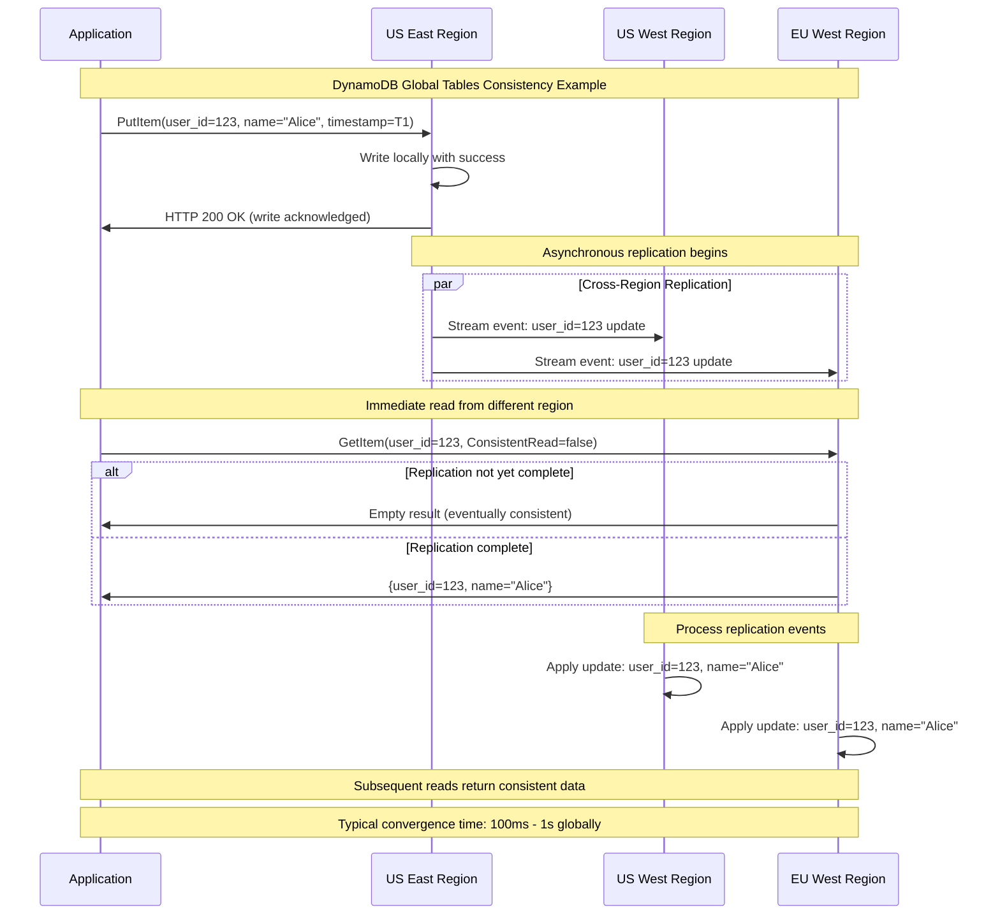
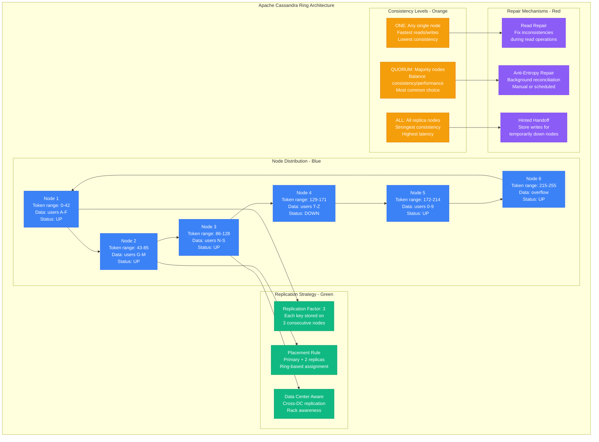
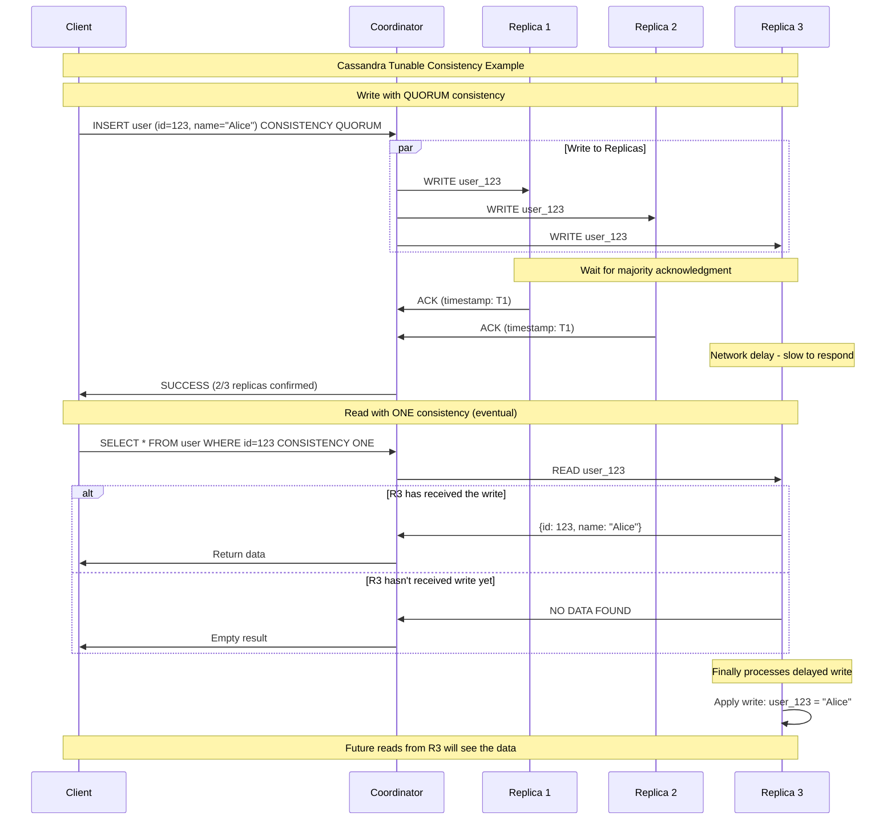
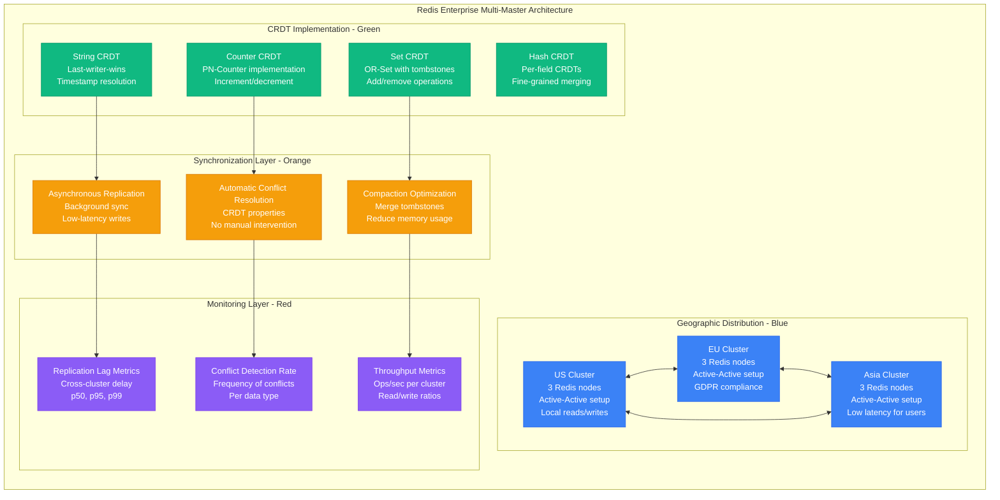
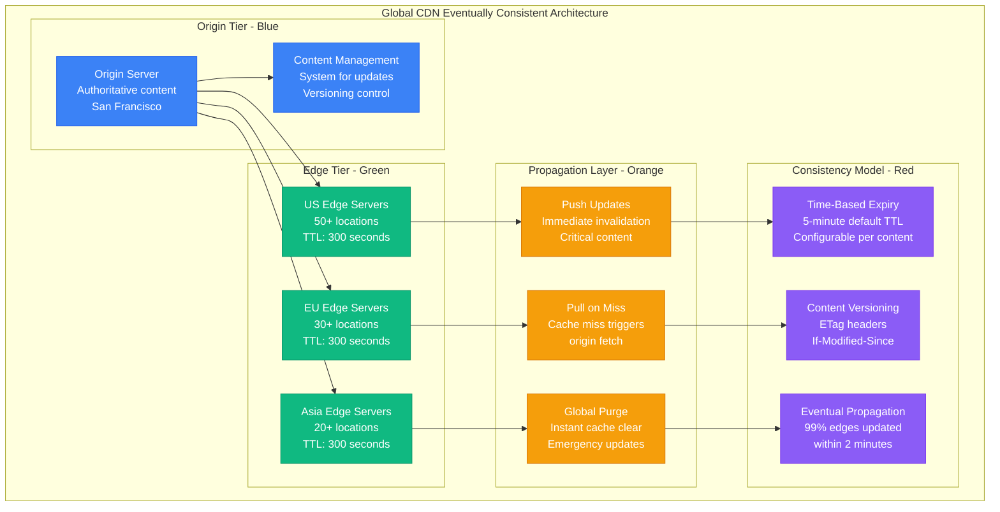
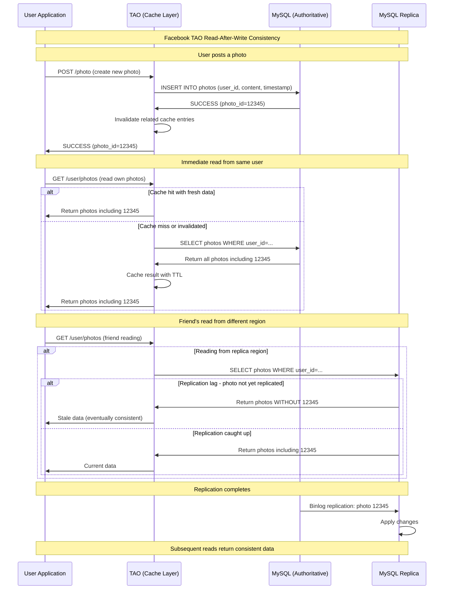
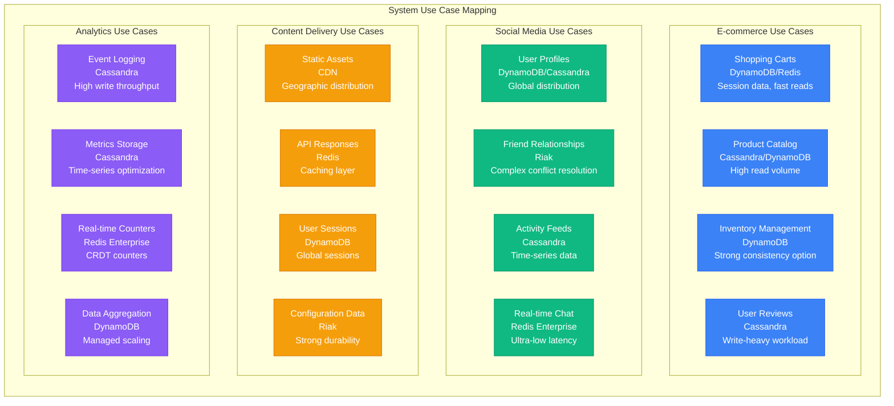
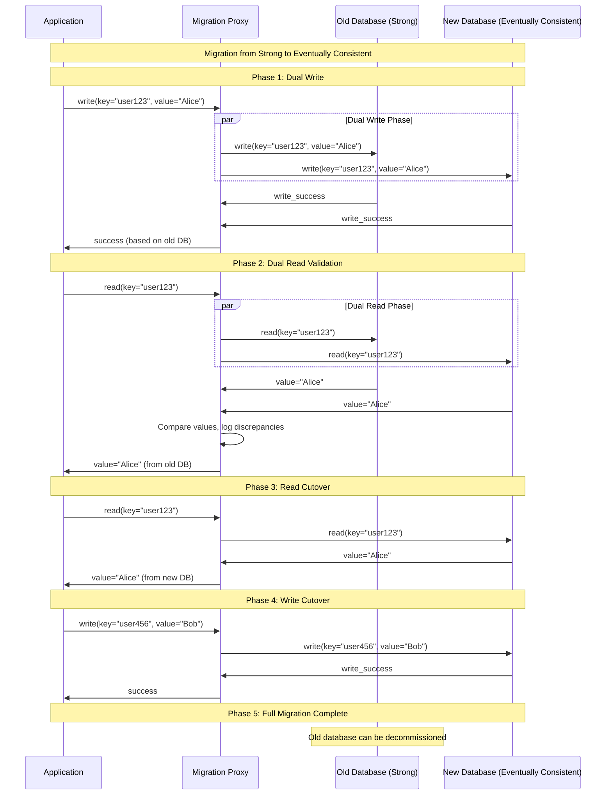
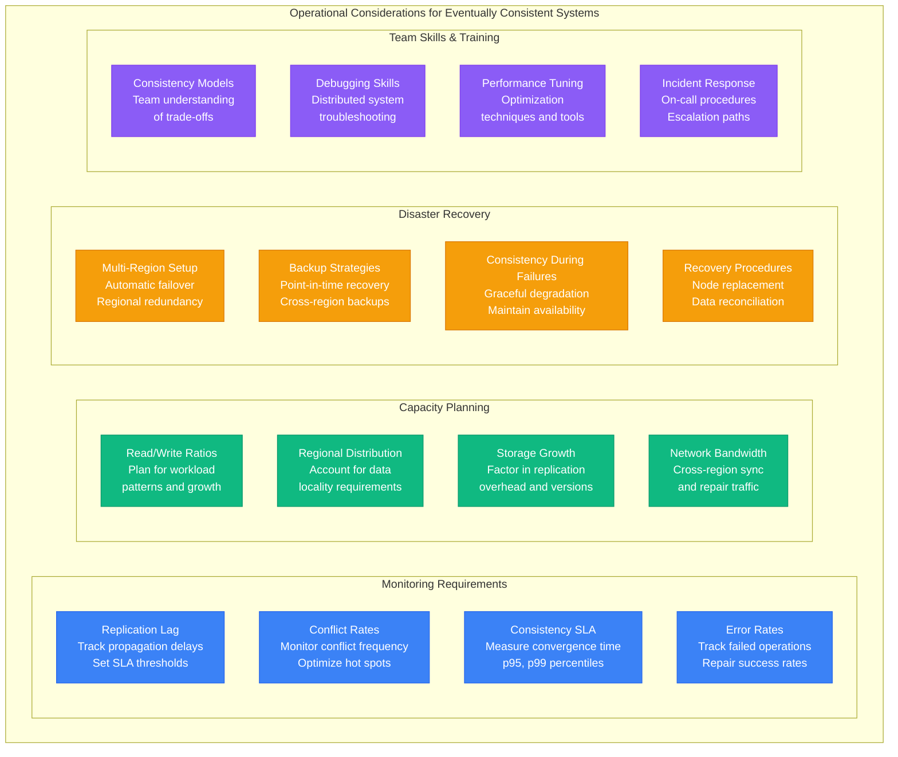

# Eventual Consistency Examples: Real Systems

## Overview

This guide examines how major production systems implement eventual consistency, including Amazon DynamoDB, Apache Cassandra, Redis, Riak, and content distribution networks. These real-world examples demonstrate practical approaches to balancing consistency, availability, and performance at scale.

## Amazon DynamoDB Implementation

```mermaid
graph TB
    subgraph DynamoDBArchitecture[Amazon DynamoDB Global Tables Architecture]
        subgraph GlobalInfrastructure[Global Infrastructure - Blue]
            USEast[US East (Virginia)<br/>Primary region<br/>Auto-scaling enabled]
            USWest[US West (Oregon)<br/>Secondary region<br/>Cross-region replication]
            EUWest[EU West (Ireland)<br/>European users<br/>Local read/write]
            APSouth[AP South (Mumbai)<br/>Asian users<br/>Multi-master setup]
        end

        subgraph ReplicationLayer[Replication Layer - Green]
            Streams[DynamoDB Streams<br/>Change capture<br/>Event-driven replication]
            Lambda[Lambda Functions<br/>Process stream events<br/>Apply changes globally]
            KCL[Kinesis Client Library<br/>Reliable stream processing<br/>At-least-once delivery]
        end

        subgraph ConsistencyControl[Consistency Control - Orange]
            Eventual[Eventually Consistent Reads<br/>Default behavior<br/>1ms typical latency]
            Strong[Strongly Consistent Reads<br/>Optional mode<br/>Higher latency cost]
            LWW[Last Writer Wins<br/>Conflict resolution<br/>Timestamp-based]
        end

        subgraph MonitoringLayer[Monitoring Layer - Red]
            CW[CloudWatch Metrics<br/>Replication lag<br/>Read/write capacity]
            Alarms[CloudWatch Alarms<br/>SLA violations<br/>Automated responses]
            XRay[X-Ray Tracing<br/>Request flow<br/>Performance analysis]
        end
    end

    %% Regional connections
    USEast <--> USWest
    USEast <--> EUWest
    USEast <--> APSouth
    USWest <--> EUWest
    EUWest <--> APSouth

    %% Component connections
    USEast --> Streams
    Streams --> Lambda
    Lambda --> KCL

    Eventual --> LWW
    Strong --> LWW

    Streams --> CW
    CW --> Alarms
    Lambda --> XRay

    %% Apply 4-plane colors
    classDef globalStyle fill:#3B82F6,stroke:#2563EB,color:#fff
    classDef replicationStyle fill:#10B981,stroke:#059669,color:#fff
    classDef consistencyStyle fill:#F59E0B,stroke:#D97706,color:#fff
    classDef monitoringStyle fill:#8B5CF6,stroke:#7C3AED,color:#fff

    class USEast,USWest,EUWest,APSouth globalStyle
    class Streams,Lambda,KCL replicationStyle
    class Eventual,Strong,LWW consistencyStyle
    class CW,Alarms,XRay monitoringStyle
```

## DynamoDB Consistency Guarantees



## Apache Cassandra Ring Architecture



## Cassandra Tunable Consistency



## Redis Enterprise Multi-Master



## Riak Distributed Database

```mermaid
graph TB
    subgraph RiakArchitecture[Riak KV Distributed Database Architecture]
        subgraph RingTopology[Ring Topology - Blue]
            RN1[Riak Node 1<br/>Virtual nodes: 64<br/>Responsible for<br/>hash ranges 0-63]
            RN2[Riak Node 2<br/>Virtual nodes: 64<br/>Responsible for<br/>hash ranges 64-127]
            RN3[Riak Node 3<br/>Virtual nodes: 64<br/>Responsible for<br/>hash ranges 128-191]
            RN4[Riak Node 4<br/>Virtual nodes: 64<br/>Responsible for<br/>hash ranges 192-255]
        end

        subgraph VectorClocks[Vector Clock Implementation - Green]
            VC1[Per-Object Versioning<br/>Track causal history<br/>Detect concurrent updates]
            VC2[Sibling Resolution<br/>Multiple versions<br/>Application-level merge]
            VC3[Pruning Strategy<br/>Limit vector clock size<br/>Prevent unbounded growth]
        end

        subgraph TunableConsistency[Tunable Consistency - Orange]
            NVal[N Value: 3<br/>Replication factor<br/>Number of copies]
            RVal[R Value: 2<br/>Read consistency<br/>Replicas to read]
            WVal[W Value: 2<br/>Write consistency<br/>Replicas to write]
        end

        subgraph DataRepair[Data Repair Mechanisms - Red]
            ReadRepair[Read Repair<br/>Fix on read<br/>Synchronous repair]
            ActiveAntiEntropy[Active Anti-Entropy<br/>Background process<br/>Merkle tree comparison]
            HandoffProcess[Handoff Process<br/>Node joins/leaves<br/>Data redistribution]
        end
    end

    %% Ring structure
    RN1 --> RN2 --> RN3 --> RN4 --> RN1

    %% Vector clock relationships
    VC1 --> VC2 --> VC3

    %% Tunable parameters
    NVal --> RVal
    RVal --> WVal

    %% Repair mechanisms
    ReadRepair --> ActiveAntiEntropy --> HandoffProcess

    classDef ringStyle fill:#3B82F6,stroke:#2563EB,color:#fff
    classDef vectorStyle fill:#10B981,stroke:#059669,color:#fff
    classDef tunableStyle fill:#F59E0B,stroke:#D97706,color:#fff
    classDef repairStyle fill:#8B5CF6,stroke:#7C3AED,color:#fff

    class RN1,RN2,RN3,RN4 ringStyle
    class VC1,VC2,VC3 vectorStyle
    class NVal,RVal,WVal tunableStyle
    class ReadRepair,ActiveAntiEntropy,HandoffProcess repairStyle
```



## Content Delivery Network (CDN) Example



## Facebook TAO (The Associations and Objects)



## Performance Comparison

```mermaid
graph TB
    subgraph PerformanceComparison[Real System Performance Comparison]
        subgraph Latency[Read/Write Latency (p99)]
            L1[DynamoDB<br/>Read: 10ms<br/>Write: 20ms<br/>Global tables]
            L2[Cassandra<br/>Read: 5ms<br/>Write: 15ms<br/>Local cluster]
            L3[Redis Enterprise<br/>Read: 1ms<br/>Write: 2ms<br/>In-memory]
            L4[Riak<br/>Read: 20ms<br/>Write: 50ms<br/>Strong durability]
        end

        subgraph Throughput[Operations per Second]
            T1[DynamoDB<br/>100K+ ops/sec<br/>Per table<br/>Auto-scaling]
            T2[Cassandra<br/>1M+ ops/sec<br/>Per cluster<br/>Linear scaling]
            T3[Redis Enterprise<br/>5M+ ops/sec<br/>Per cluster<br/>Memory-bound]
            T4[Riak<br/>50K+ ops/sec<br/>Per cluster<br/>Disk-bound]
        end

        subgraph Consistency[Consistency Guarantees]
            C1[DynamoDB<br/>Eventually consistent<br/>Strongly consistent<br/>available]
            C2[Cassandra<br/>Tunable consistency<br/>ONE to ALL<br/>Per operation]
            C3[Redis Enterprise<br/>CRDT-based<br/>Automatic merge<br/>No conflicts]
            C4[Riak<br/>Vector clocks<br/>Application merge<br/>Sibling resolution]
        end

        subgraph Scalability[Horizontal Scalability]
            S1[DynamoDB<br/>Managed scaling<br/>Unlimited capacity<br/>Regional deployment]
            S2[Cassandra<br/>Linear scaling<br/>1000+ node clusters<br/>Multi-datacenter]
            S3[Redis Enterprise<br/>Auto-sharding<br/>100+ node clusters<br/>Cross-region sync]
            S4[Riak<br/>Ring expansion<br/>100+ node clusters<br/>Consistent hashing]
        end
    end

    classDef dynamoStyle fill:#FF9900,stroke:#FF6600,color:#fff
    classDef cassandraStyle fill:#1287B1,stroke:#0F6A8A,color:#fff
    classDef redisStyle fill:#DC382D,stroke:#B02A20,color:#fff
    classDef riakStyle fill:#2C5F2D,stroke:#1F4220,color:#fff

    class L1,T1,C1,S1 dynamoStyle
    class L2,T2,C2,S2 cassandraStyle
    class L3,T3,C3,S3 redisStyle
    class L4,T4,C4,S4 riakStyle
```

## Use Case Mapping



## Migration Strategies



## Operational Considerations



## System Selection Guide

### When to Choose DynamoDB
- **Managed service preferred** - No operational overhead
- **Global distribution required** - Built-in global tables
- **Variable workloads** - Auto-scaling capabilities
- **AWS ecosystem** - Integrates with Lambda, CloudWatch, etc.

### When to Choose Cassandra
- **High write throughput** - Optimized for write-heavy workloads
- **Time-series data** - Excellent for logs, metrics, events
- **Full control needed** - Open source, customizable
- **Multi-datacenter** - Built-in cross-DC replication

### When to Choose Redis Enterprise
- **Ultra-low latency** - Sub-millisecond response times
- **CRDT requirements** - Automatic conflict resolution
- **High throughput** - Millions of operations per second
- **Real-time applications** - Gaming, chat, live updates

### When to Choose Riak
- **Complex conflict resolution** - Application-specific merge logic
- **High availability critical** - Designed for always-on operation
- **Large objects** - Better for storing bigger data items
- **Predictable performance** - Consistent latency characteristics

## Key Takeaways

1. **Different systems make different trade-offs** - Choose based on your specific requirements
2. **Operational complexity varies significantly** - Managed vs self-hosted considerations
3. **Performance characteristics differ** - Latency, throughput, and scalability vary
4. **Consistency guarantees are tunable** - Most systems offer configurable consistency levels
5. **Migration between systems is possible** - Use proxy patterns for gradual transitions
6. **Monitoring is system-specific** - Each system requires different operational metrics
7. **Team expertise matters** - Choose systems your team can effectively operate and debug

These real-world examples demonstrate that eventual consistency is not just a theoretical concept but a practical approach used by the largest systems on the internet to achieve massive scale, high availability, and excellent performance.