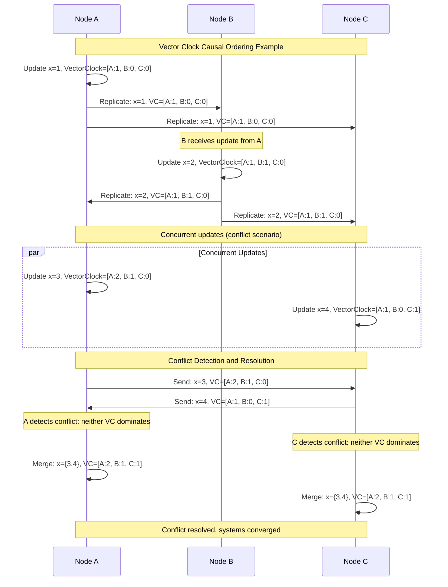
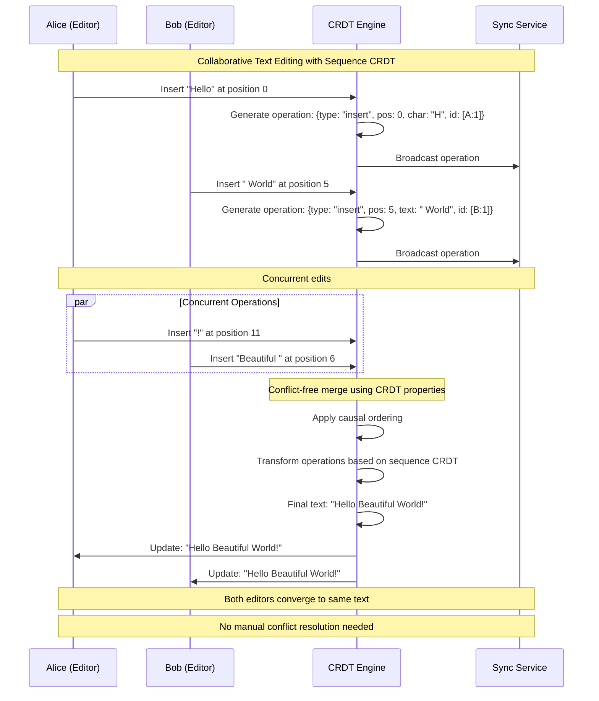
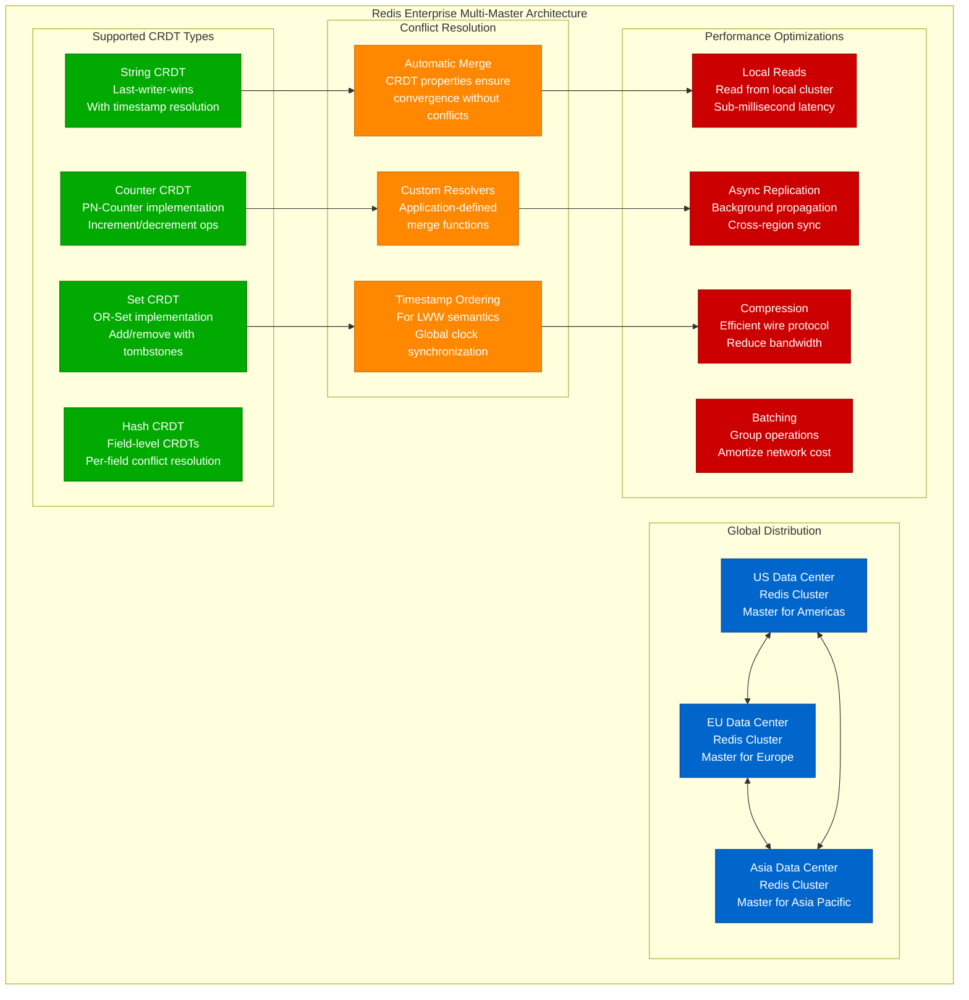
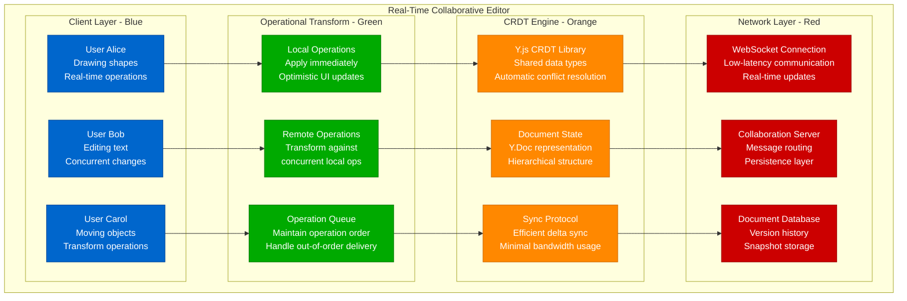
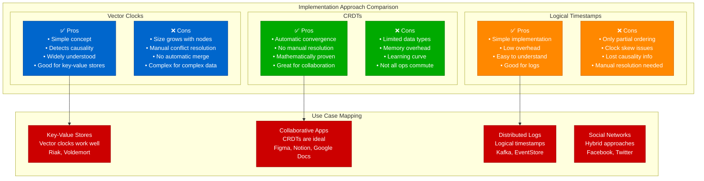
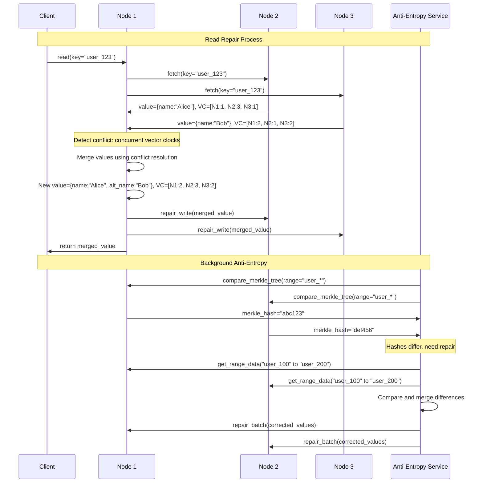
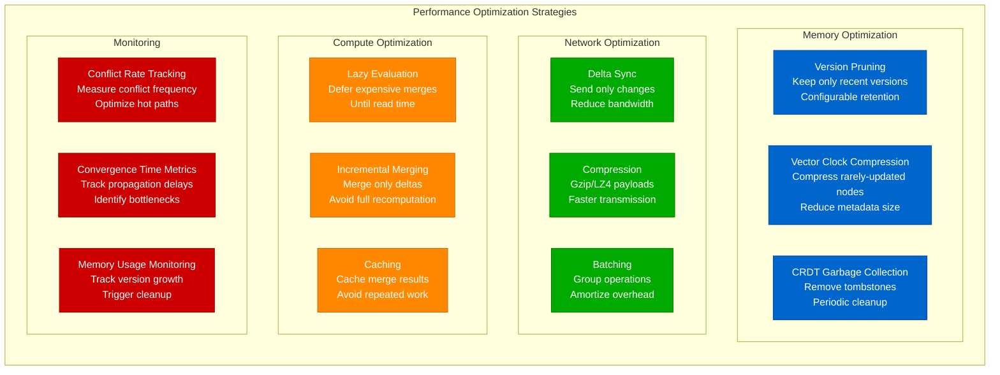

# Eventual Consistency Implementation: Vector Clocks and CRDTs

## Overview

Implementing eventual consistency requires sophisticated mechanisms to track causality, detect conflicts, and merge concurrent updates. This guide explores vector clocks, conflict-free replicated data types (CRDTs), and real-world implementations used by systems like Riak, Redis, and collaborative applications.

## Vector Clock Implementation

```mermaid
graph TB
    subgraph VectorClockArchitecture[Vector Clock Architecture]
        subgraph ClientLayer[Client Layer - Blue]
            C1[Client A<br/>Initiates updates]
            C2[Client B<br/>Concurrent updates]
            C3[Client C<br/>Reads and writes]
        end

        subgraph NodeLayer[Node Layer - Green]
            N1[Node 1<br/>Vector: [N1:3, N2:1, N3:2]<br/>Tracks all node versions]
            N2[Node 2<br/>Vector: [N1:2, N2:4, N3:1]<br/>Independent timeline]
            N3[Node 3<br/>Vector: [N1:1, N2:2, N3:5]<br/>Causal ordering]
        end

        subgraph StorageLayer[Storage Layer - Orange]
            VC1[Vector Clock Store<br/>Per-object versioning<br/>Causal history tracking]
            VS1[Version Storage<br/>Multiple object versions<br/>Conflict detection]
            MR1[Merge Resolution<br/>Conflict resolution logic<br/>Business rules]
        end

        subgraph ControlLayer[Control Layer - Red]
            CD[Conflict Detection<br/>Compare vector clocks<br/>Identify concurrent updates]
            AR[Anti-Entropy Repair<br/>Background reconciliation<br/>Gossip-based sync]
            GC[Garbage Collection<br/>Prune old versions<br/>Memory management]
        end
    end

    %% Flow connections
    C1 --> N1
    C2 --> N2
    C3 --> N3

    N1 <--> N2
    N2 <--> N3
    N1 <--> N3

    N1 --> VC1
    N2 --> VS1
    N3 --> MR1

    VC1 --> CD
    VS1 --> AR
    MR1 --> GC

    %% Apply 4-plane colors
    classDef clientStyle fill:#0066CC,stroke:#004499,color:#fff
    classDef nodeStyle fill:#00AA00,stroke:#007700,color:#fff
    classDef storageStyle fill:#FF8800,stroke:#CC6600,color:#fff
    classDef controlStyle fill:#CC0000,stroke:#990000,color:#fff

    class C1,C2,C3 clientStyle
    class N1,N2,N3 nodeStyle
    class VC1,VS1,MR1 storageStyle
    class CD,AR,GC controlStyle
```

## Vector Clock Operation Example



## CRDT Implementation Patterns

```mermaid
graph TB
    subgraph CRDTTypes[CRDT Types and Use Cases]
        subgraph StateBased[State-Based CRDTs (CvRDTs)]
            SB1[G-Set (Grow-only Set)<br/>Add-only set operations<br/>Shopping cart items]
            SB2[PN-Counter<br/>Increment/decrement counter<br/>Like counts, inventory]
            SB3[LWW-Register<br/>Last-writer-wins register<br/>User profile updates]
            SB4[OR-Set<br/>Observed-remove set<br/>Tag collections]
        end

        subgraph OperationBased[Operation-Based CRDTs (CmRDTs)]
            OB1[OP-Counter<br/>Operation-based counter<br/>Distributed counters]
            OB2[Sequence CRDT<br/>Collaborative text editing<br/>Google Docs, Notion]
            OB3[Tree CRDT<br/>Hierarchical structures<br/>File systems, org charts]
            OB4[Graph CRDT<br/>Network topologies<br/>Social graphs]
        end

        subgraph HybridCRDTs[Hybrid/Advanced CRDTs]
            H1[YATA (Yet Another<br/>Transformation Approach)<br/>Real-time collaboration]
            H2[LSEQ<br/>Log-based sequence<br/>Distributed logs]
            H3[JSON CRDT<br/>Document structures<br/>Configuration management]
        end
    end

    subgraph RealWorldUsage[Real-World Usage]
        RW1[Redis Enterprise<br/>Multi-master replication<br/>Global distributed cache]
        RW2[Riak KV<br/>Eventually consistent KV store<br/>High availability database]
        RW3[AutoMerge<br/>Collaborative applications<br/>Figma, Notion alternatives]
        RW4[SoundCloud<br/>Timeset CRDT<br/>Music streaming metadata]
    end

    SB2 --- RW1
    OB2 --- RW3
    SB4 --- RW2
    H1 --- RW4

    classDef stateStyle fill:#0066CC,stroke:#004499,color:#fff
    classDef operationStyle fill:#00AA00,stroke:#007700,color:#fff
    classDef hybridStyle fill:#FF8800,stroke:#CC6600,color:#fff
    classDef usageStyle fill:#CC0000,stroke:#990000,color:#fff

    class SB1,SB2,SB3,SB4 stateStyle
    class OB1,OB2,OB3,OB4 operationStyle
    class H1,H2,H3 hybridStyle
    class RW1,RW2,RW3,RW4 usageStyle
```

## PN-Counter CRDT Example

```python
class PNCounter:
    """Increment/Decrement Counter CRDT"""

    def __init__(self, node_id):
        self.node_id = node_id
        self.positive = {}  # P-Counter for increments
        self.negative = {}  # N-Counter for decrements

    def increment(self, amount=1):
        """Increment counter by amount"""
        if self.node_id not in self.positive:
            self.positive[self.node_id] = 0
        self.positive[self.node_id] += amount

    def decrement(self, amount=1):
        """Decrement counter by amount"""
        if self.node_id not in self.negative:
            self.negative[self.node_id] = 0
        self.negative[self.node_id] += amount

    def value(self):
        """Get current counter value"""
        pos_sum = sum(self.positive.values())
        neg_sum = sum(self.negative.values())
        return pos_sum - neg_sum

    def merge(self, other):
        """Merge with another PN-Counter (join operation)"""
        result = PNCounter(self.node_id)

        # Merge positive counters (take max for each node)
        all_nodes = set(self.positive.keys()) | set(other.positive.keys())
        for node in all_nodes:
            self_val = self.positive.get(node, 0)
            other_val = other.positive.get(node, 0)
            result.positive[node] = max(self_val, other_val)

        # Merge negative counters (take max for each node)
        all_nodes = set(self.negative.keys()) | set(other.negative.keys())
        for node in all_nodes:
            self_val = self.negative.get(node, 0)
            other_val = other.negative.get(node, 0)
            result.negative[node] = max(self_val, other_val)

        return result

# Example usage demonstrating eventual consistency
def demonstrate_pn_counter():
    # Three replicas in different locations
    counter_us = PNCounter("us-east")
    counter_eu = PNCounter("eu-west")
    counter_asia = PNCounter("asia-pacific")

    # Concurrent operations
    counter_us.increment(10)    # US: +10
    counter_eu.increment(5)     # EU: +5
    counter_asia.decrement(3)   # Asia: -3

    print(f"Before merge - US: {counter_us.value()}, EU: {counter_eu.value()}, Asia: {counter_asia.value()}")

    # Simulate network propagation and merging
    # US receives updates from EU and Asia
    counter_us = counter_us.merge(counter_eu).merge(counter_asia)

    # EU receives updates from US and Asia
    counter_eu = counter_eu.merge(counter_us).merge(counter_asia)

    # Asia receives updates from US and EU
    counter_asia = counter_asia.merge(counter_us).merge(counter_eu)

    print(f"After merge - US: {counter_us.value()}, EU: {counter_eu.value()}, Asia: {counter_asia.value()}")
    # All should show the same value: 10 + 5 - 3 = 12

demonstrate_pn_counter()
```

## Collaborative Text Editing with Sequence CRDT



## Riak Implementation Architecture

```mermaid
graph LR
    subgraph RiakCluster[Riak Distributed Database]
        subgraph WriteCoordination[Write Coordination - Blue]
            WC[Write Coordinator<br/>Receives client writes<br/>Calculates preference list]
            PL[Preference List<br/>N=3 replicas<br/>Based on consistent hashing]
            VV[Vector Version<br/>Tracks causal history<br/>Per-object versioning]
        end

        subgraph ReplicationLayer[Replication Layer - Green]
            R1[Replica 1<br/>Primary replica<br/>Vector clock: [R1:3, R2:1, R3:2]]
            R2[Replica 2<br/>Secondary replica<br/>Vector clock: [R1:2, R2:4, R3:1]]
            R3[Replica 3<br/>Tertiary replica<br/>Vector clock: [R1:1, R2:2, R3:5]]
        end

        subgraph ConflictResolution[Conflict Resolution - Orange]
            CD[Conflict Detection<br/>Compare vector clocks<br/>Identify siblings]
            MR[Merge Resolution<br/>Application-defined<br/>or last-writer-wins]
            RS[Read Repair<br/>On-demand reconciliation<br/>Heal inconsistencies]
        end

        subgraph AntiEntropy[Anti-Entropy - Red]
            MT[Merkle Trees<br/>Efficient comparison<br/>Detect differences]
            AER[Active Anti-Entropy<br/>Background process<br/>Repair divergences]
            HH[Hinted Handoff<br/>Temporary storage<br/>For offline nodes]
        end
    end

    %% Connections
    WC --> PL --> VV
    VV --> R1
    VV --> R2
    VV --> R3

    R1 --> CD
    R2 --> CD
    R3 --> CD

    CD --> MR --> RS

    R1 --> MT
    R2 --> MT
    R3 --> MT
    MT --> AER --> HH

    classDef writeStyle fill:#0066CC,stroke:#004499,color:#fff
    classDef replicationStyle fill:#00AA00,stroke:#007700,color:#fff
    classDef conflictStyle fill:#FF8800,stroke:#CC6600,color:#fff
    classDef antiEntropyStyle fill:#CC0000,stroke:#990000,color:#fff

    class WC,PL,VV writeStyle
    class R1,R2,R3 replicationStyle
    class CD,MR,RS conflictStyle
    class MT,AER,HH antiEntropyStyle
```

## Redis Enterprise Multi-Master



## Collaborative Application: Figma-Style Editor



## Implementation Comparison



## Anti-Entropy and Read Repair



## Performance Optimization Strategies



## Testing and Validation

```python
# Comprehensive test suite for eventual consistency implementation
class EventualConsistencyTestSuite:

    def test_vector_clock_causality(self):
        """Test that vector clocks correctly capture causality"""
        vc1 = VectorClock({"A": 1, "B": 0, "C": 0})
        vc2 = VectorClock({"A": 1, "B": 1, "C": 0})
        vc3 = VectorClock({"A": 0, "B": 1, "C": 1})

        # vc1 happened before vc2
        assert vc1.happens_before(vc2)
        assert not vc2.happens_before(vc1)

        # vc2 and vc3 are concurrent
        assert not vc2.happens_before(vc3)
        assert not vc3.happens_before(vc2)
        assert vc2.concurrent_with(vc3)

    def test_crdt_convergence(self):
        """Test that CRDTs converge to same state"""
        # Create three PN-Counters
        counter1 = PNCounter("node1")
        counter2 = PNCounter("node2")
        counter3 = PNCounter("node3")

        # Concurrent operations
        counter1.increment(5)
        counter2.increment(3)
        counter3.decrement(2)

        # Simulate network propagation (all-to-all merge)
        final1 = counter1.merge(counter2).merge(counter3)
        final2 = counter2.merge(counter1).merge(counter3)
        final3 = counter3.merge(counter1).merge(counter2)

        # All should converge to same value
        assert final1.value() == final2.value() == final3.value()
        assert final1.value() == 6  # 5 + 3 - 2

    def test_eventual_consistency_timing(self):
        """Test convergence within acceptable time bounds"""
        import time
        import threading

        nodes = [Node(f"node_{i}") for i in range(5)]
        key = "test_key"
        value = "test_value"

        # Write to one node
        start_time = time.time()
        nodes[0].write(key, value)

        # Monitor convergence
        def check_convergence():
            while True:
                values = [node.read(key) for node in nodes]
                if all(v == value for v in values):
                    return time.time() - start_time
                time.sleep(0.01)

        convergence_time = check_convergence()

        # Assert convergence within SLA (e.g., 1 second)
        assert convergence_time < 1.0, f"Convergence took {convergence_time:.3f}s"

    def test_concurrent_conflict_resolution(self):
        """Test conflict resolution under concurrent updates"""
        node1 = Node("node1")
        node2 = Node("node2")

        key = "shared_key"

        # Concurrent writes
        node1.write(key, "value1")
        node2.write(key, "value2")

        # Simulate network healing
        node1.sync_with(node2)
        node2.sync_with(node1)

        # Both should have resolved to same value
        value1 = node1.read(key)
        value2 = node2.read(key)

        assert value1 == value2, "Nodes did not converge after conflict"

        # Value should be deterministic (e.g., lexicographically last)
        expected = max("value1", "value2")  # or custom conflict resolution
        assert value1 == expected
```

## Key Takeaways

1. **Vector clocks provide causality tracking** - Essential for detecting concurrent updates and conflicts
2. **CRDTs enable automatic conflict resolution** - Mathematical properties guarantee convergence without coordination
3. **Implementation choice depends on use case** - Key-value stores vs collaborative applications need different approaches
4. **Performance optimization is crucial** - Memory, network, and compute optimizations necessary for production scale
5. **Testing is complex but essential** - Causality, convergence, and conflict resolution must be thoroughly validated
6. **Real-world systems use hybrid approaches** - Combine vector clocks, CRDTs, and application-specific logic
7. **Monitoring and observability are critical** - Track convergence time, conflict rates, and system health

These implementation patterns enable the high-performance, highly-available systems that power modern distributed applications at companies like Amazon, Facebook, and Google.