# Eventual Consistency Metrics: Measuring Convergence Time

## Overview

Measuring and monitoring eventual consistency is crucial for maintaining SLAs and understanding system behavior. This guide examines metrics, measurement techniques, and monitoring strategies used by companies like Netflix, Amazon, and Facebook to track convergence in production systems.

## Convergence Measurement Architecture


## Key Convergence Metrics

```mermaid
graph TB
    subgraph ConvergenceMetrics[Key Convergence Metrics]
        subgraph TimeMetrics[Time-Based Metrics]
            TM1[Time to Convergence (TTC)<br/>Write timestamp to<br/>last replica update]
            TM2[Propagation Delay<br/>Network latency<br/>between replicas]
            TM3[Processing Delay<br/>Local processing time<br/>per replica]
            TM4[Detection Delay<br/>Time to detect<br/>convergence achieved]
        end

        subgraph ConsistencyMetrics[Consistency Quality]
            CM1[Staleness Window<br/>Maximum age of<br/>stale data served]
            CM2[Divergence Count<br/>Number of replicas<br/>with different values]
            CM3[Conflict Rate<br/>Frequency of<br/>conflicting updates]
            CM4[Resolution Time<br/>Time to resolve<br/>detected conflicts]
        end

        subgraph SystemMetrics[System Health]
            SM1[Replication Lag<br/>Delay in log<br/>replication]
            SM2[Network Partition<br/>Detection and<br/>recovery time]
            SM3[Node Recovery<br/>Time to rejoin<br/>cluster]
            SM4[Anti-Entropy<br/>Background repair<br/>effectiveness]
        end

        subgraph BusinessMetrics[Business Impact]
            BM1[Read Inconsistency Rate<br/>% reads returning<br/>stale data]
            BM2[User-Visible Conflicts<br/>Conflicts requiring<br/>user intervention]
            BM3[Data Loss Events<br/>Permanent data loss<br/>due to conflicts]
            BM4[Service Availability<br/>Uptime during<br/>convergence issues]
        end
    end

    classDef timeStyle fill:#0066CC,stroke:#004499,color:#fff
    classDef consistencyStyle fill:#00AA00,stroke:#007700,color:#fff
    classDef systemStyle fill:#FF8800,stroke:#CC6600,color:#fff
    classDef businessStyle fill:#CC0000,stroke:#990000,color:#fff

    class TM1,TM2,TM3,TM4 timeStyle
    class CM1,CM2,CM3,CM4 consistencyStyle
    class SM1,SM2,SM3,SM4 systemStyle
    class BM1,BM2,BM3,BM4 businessStyle
```

## Netflix Convergence Monitoring


## Amazon DynamoDB Global Tables Metrics


## Facebook Social Graph Metrics


## Convergence Time Measurement Implementation

```python
import time
import asyncio
from collections import defaultdict
from dataclasses import dataclass
from typing import Dict, List, Optional
import statistics

@dataclass
class WriteEvent:
    key: str
    value: str
    timestamp: float
    node: str
    version: str

@dataclass
class ReadEvent:
    key: str
    value: str
    timestamp: float
    node: str
    version: str

class ConvergenceMetrics:
    """Measures convergence time and consistency metrics"""

    def __init__(self):
        self.writes: Dict[str, WriteEvent] = {}
        self.reads: Dict[str, List[ReadEvent]] = defaultdict(list)
        self.convergence_times: List[float] = []
        self.staleness_readings: List[float] = []

    async def record_write(self, key: str, value: str, node: str, version: str):
        """Record a write operation"""
        write_event = WriteEvent(
            key=key,
            value=value,
            timestamp=time.time(),
            node=node,
            version=version
        )
        self.writes[key] = write_event
        print(f"Write recorded: {key}={value} on {node} at {write_event.timestamp}")

    async def record_read(self, key: str, value: str, node: str, version: str):
        """Record a read operation"""
        read_event = ReadEvent(
            key=key,
            value=value,
            timestamp=time.time(),
            node=node,
            version=version
        )
        self.reads[key].append(read_event)

        # Check for convergence
        await self.check_convergence(key, read_event)

    async def check_convergence(self, key: str, read_event: ReadEvent):
        """Check if this read indicates convergence"""
        if key not in self.writes:
            return  # No write to compare against

        write_event = self.writes[key]

        # Check if read value matches write value
        if read_event.value == write_event.value and read_event.version == write_event.version:
            convergence_time = read_event.timestamp - write_event.timestamp
            self.convergence_times.append(convergence_time)
            print(f"Convergence detected for {key}: {convergence_time:.3f}s")
        else:
            # Calculate staleness
            staleness = read_event.timestamp - write_event.timestamp
            self.staleness_readings.append(staleness)
            print(f"Stale read for {key}: {staleness:.3f}s old")

    def get_metrics(self) -> Dict:
        """Calculate convergence metrics"""
        if not self.convergence_times:
            return {"error": "No convergence data available"}

        return {
            "convergence_time": {
                "count": len(self.convergence_times),
                "mean": statistics.mean(self.convergence_times),
                "median": statistics.median(self.convergence_times),
                "p95": self.percentile(self.convergence_times, 95),
                "p99": self.percentile(self.convergence_times, 99),
                "min": min(self.convergence_times),
                "max": max(self.convergence_times)
            },
            "staleness": {
                "readings": len(self.staleness_readings),
                "mean_staleness": statistics.mean(self.staleness_readings) if self.staleness_readings else 0,
                "max_staleness": max(self.staleness_readings) if self.staleness_readings else 0,
            },
            "consistency_rate": len(self.convergence_times) / (len(self.convergence_times) + len(self.staleness_readings))
        }

    @staticmethod
    def percentile(data: List[float], percentile: int) -> float:
        """Calculate percentile"""
        if not data:
            return 0.0
        sorted_data = sorted(data)
        index = int(len(sorted_data) * percentile / 100)
        return sorted_data[min(index, len(sorted_data) - 1)]

# Distributed system simulation for testing
class DistributedNode:
    def __init__(self, node_id: str, metrics: ConvergenceMetrics):
        self.node_id = node_id
        self.metrics = metrics
        self.data: Dict[str, str] = {}
        self.versions: Dict[str, str] = {}

    async def write(self, key: str, value: str):
        """Write data to this node"""
        version = f"{self.node_id}_{time.time()}"
        self.data[key] = value
        self.versions[key] = version
        await self.metrics.record_write(key, value, self.node_id, version)

    async def read(self, key: str) -> Optional[str]:
        """Read data from this node"""
        value = self.data.get(key)
        version = self.versions.get(key, "unknown")
        if value:
            await self.metrics.record_read(key, value, self.node_id, version)
        return value

    async def replicate_from(self, other_node: 'DistributedNode', delay: float = 0.1):
        """Replicate data from another node with delay"""
        await asyncio.sleep(delay)  # Simulate network latency

        for key, value in other_node.data.items():
            if key not in self.data:
                self.data[key] = value
                self.versions[key] = other_node.versions[key]
                print(f"Replicated {key}={value} to {self.node_id}")

# Example usage and testing
async def simulate_convergence_measurement():
    """Simulate a distributed system and measure convergence"""
    metrics = ConvergenceMetrics()

    # Create nodes
    node_us = DistributedNode("us-east", metrics)
    node_eu = DistributedNode("eu-west", metrics)
    node_asia = DistributedNode("asia-pacific", metrics)

    nodes = [node_us, node_eu, node_asia]

    # Simulate writes and replication
    print("=== Starting convergence simulation ===")

    # Write to primary node
    await node_us.write("user_123", "Alice")

    # Simulate replication delays
    replication_tasks = [
        node_eu.replicate_from(node_us, delay=0.05),  # 50ms to EU
        node_asia.replicate_from(node_us, delay=0.15)  # 150ms to Asia
    ]

    # Concurrent reads during replication
    read_tasks = []
    for i in range(10):
        for node in nodes:
            read_tasks.append(node.read("user_123"))
        await asyncio.sleep(0.02)  # Read every 20ms

    # Wait for replication to complete
    await asyncio.gather(*replication_tasks)

    # Final reads to confirm convergence
    for node in nodes:
        await node.read("user_123")

    # Print metrics
    print("\n=== Convergence Metrics ===")
    metrics_data = metrics.get_metrics()
    for category, values in metrics_data.items():
        print(f"{category}: {values}")

    return metrics_data

# Run the simulation
# asyncio.run(simulate_convergence_measurement())
```

## Real-Time Dashboard Metrics

```mermaid
graph TB
    subgraph MonitoringDashboard[Real-Time Convergence Dashboard]
        subgraph HealthIndicators[System Health Indicators]
            HI1[🟢 Convergence SLA<br/>98.5% within 1s<br/>Target: 95%]
            HI2[🟡 Replication Lag<br/>p95: 150ms<br/>Target: 100ms]
            HI3[🔴 Conflict Rate<br/>2.1% of writes<br/>Target: 1%]
        end

        subgraph TrendGraphs[Trend Analysis]
            TG1[Convergence Time Trend<br/>📈 7-day rolling average<br/>Showing slight increase]
            TG2[Regional Performance<br/>🌍 Asia-Pacific lagging<br/>EU and US performing well]
            TG3[Hourly Patterns<br/>🕐 Peak hours show<br/>increased convergence time]
        end

        subgraph AlertingSummary[Active Alerts]
            AS1[⚠️ High Latency Alert<br/>Singapore region<br/>p99 > 500ms]
            AS2[🚨 Consistency Violation<br/>Shopping cart service<br/>Manual review needed]
            AS3[📊 Capacity Warning<br/>Replication queue<br/>approaching limits]
        end

        subgraph ActionItems[Recommended Actions]
            AI1[Scale Singapore cluster<br/>Add 2 more nodes<br/>Estimated impact: -30% latency]
            AI2[Investigate cart conflicts<br/>Review concurrent user<br/>shopping patterns]
            AI3[Enable auto-scaling<br/>Replication workers<br/>Based on queue depth]
        end
    end

    HI3 --> AS2
    TG2 --> AS1
    AS1 --> AI1
    AS2 --> AI2

    classDef healthStyle fill:#00AA00,stroke:#007700,color:#fff
    classDef trendStyle fill:#0066CC,stroke:#004499,color:#fff
    classDef alertStyle fill:#CC0000,stroke:#990000,color:#fff
    classDef actionStyle fill:#FF8800,stroke:#CC6600,color:#fff

    class HI1,HI2,HI3 healthStyle
    class TG1,TG2,TG3 trendStyle
    class AS1,AS2,AS3 alertStyle
    class AI1,AI2,AI3 actionStyle
```



## SLA Definition and Tracking


## Predictive Analytics for Convergence


## Monitoring Best Practices

### Metric Collection
- [ ] Use high-resolution timestamps (microsecond precision)
- [ ] Collect metrics from all replicas, not just primaries
- [ ] Track both successful convergence and failed cases
- [ ] Include business context (user impact, revenue impact)
- [ ] Implement sampling for high-volume systems

### Dashboard Design
- [ ] Show real-time convergence SLA status prominently
- [ ] Include historical trends and seasonal patterns
- [ ] Provide drill-down capabilities for investigation
- [ ] Show regional and service-level breakdowns
- [ ] Include cost impact of consistency choices

### Alerting Strategy
- [ ] Set up tiered alerting (warning, critical, emergency)
- [ ] Use predictive alerts based on trends
- [ ] Include actionable information in alerts
- [ ] Avoid alert fatigue with intelligent filtering
- [ ] Test alert escalation procedures regularly

### Performance Optimization
- [ ] Identify bottlenecks through metrics analysis
- [ ] Monitor the cost-performance tradeoffs
- [ ] Track the impact of consistency level changes
- [ ] Measure user experience impact
- [ ] Benchmark against industry standards

## Key Takeaways

1. **Measurement is essential for managing eventual consistency** - You can't improve what you don't measure
2. **Multiple metrics types are needed** - Time, quality, system health, and business impact
3. **Real-time monitoring enables proactive response** - Predict issues before they impact users
4. **SLA definition drives system behavior** - Clear targets guide optimization efforts
5. **Regional differences matter** - Global systems need regional performance tracking
6. **Predictive analytics improve reliability** - ML models can predict and prevent issues
7. **Cost-performance tradeoffs must be quantified** - Measure the business impact of consistency choices

Effective convergence monitoring enables organizations to balance consistency, performance, and cost while maintaining excellent user experiences in eventually consistent systems.