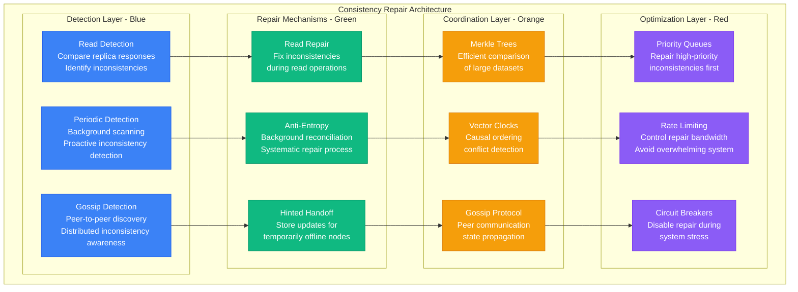
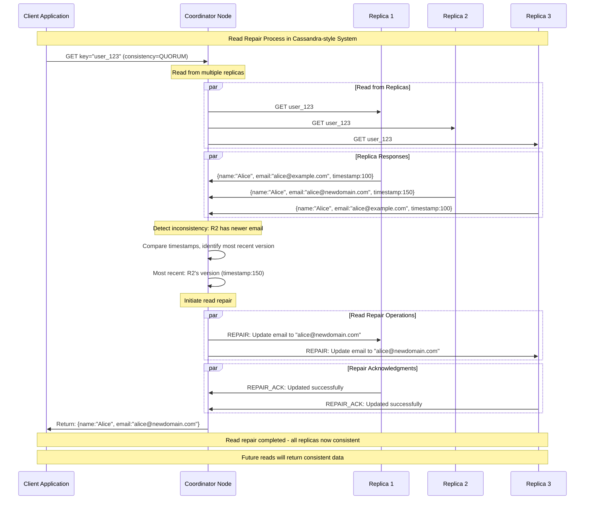
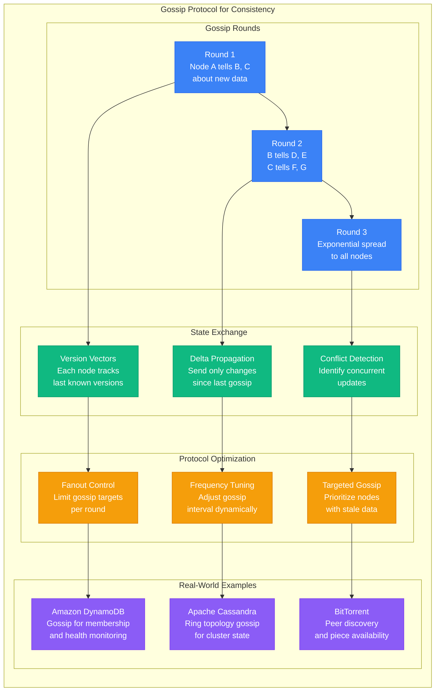
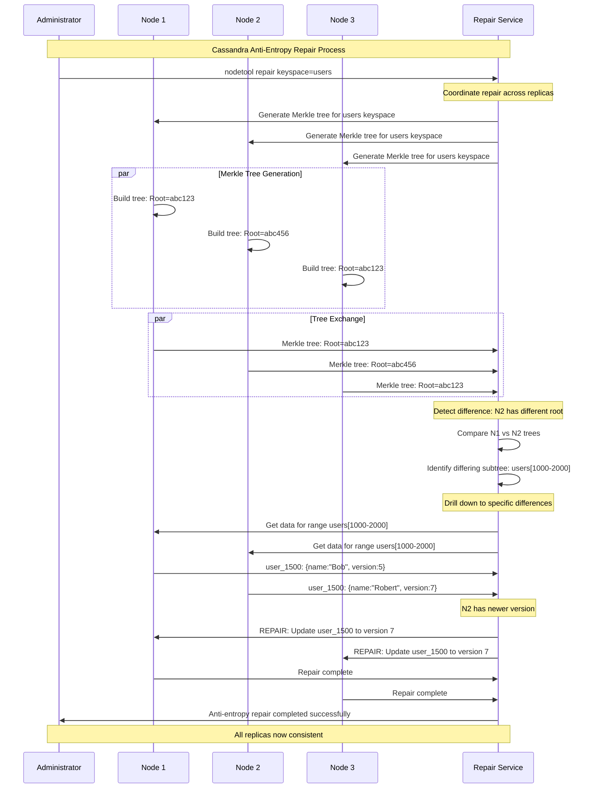
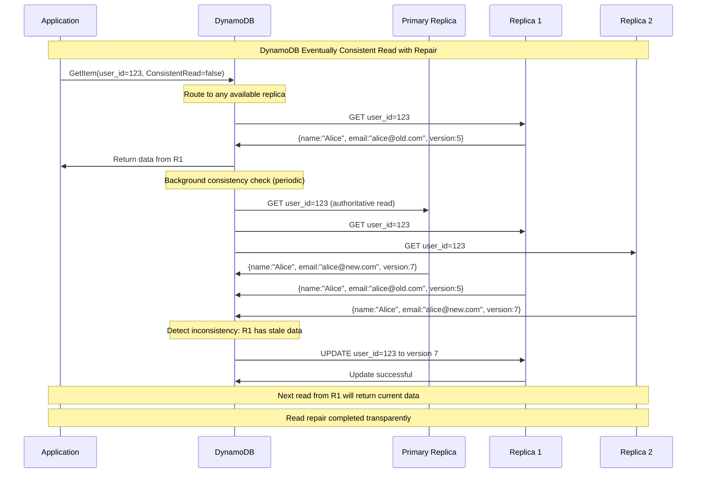
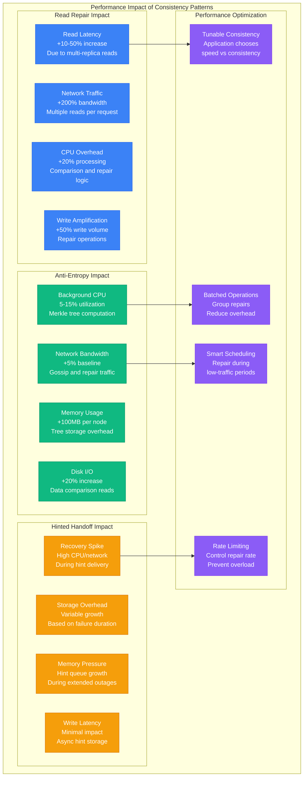
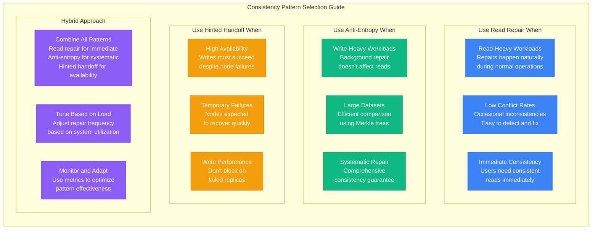

# Eventual Consistency Patterns: Read Repair and Anti-Entropy

## Overview

Achieving eventual consistency requires systematic patterns for detecting and repairing inconsistencies. This guide examines read repair, anti-entropy reconciliation, and gossip protocols used by systems like Amazon DynamoDB, Apache Cassandra, and BitTorrent to maintain data consistency across distributed replicas.

## Consistency Repair Architecture



## Read Repair Implementation



## Anti-Entropy with Merkle Trees

```mermaid
graph TB
    subgraph MerkleTreeAntiEntropy[Merkle Tree Anti-Entropy Process]
        subgraph TreeConstruction[Tree Construction Phase]
            TC1[Partition Data<br/>Divide keyspace<br/>into ranges]
            TC2[Hash Leaf Nodes<br/>Hash individual<br/>key-value pairs]
            TC3[Build Tree<br/>Combine hashes<br/>bottom-up]
            TC4[Root Hash<br/>Single hash representing<br/>entire dataset]
        end

        subgraph Comparison[Comparison Phase]
            C1[Exchange Root Hashes<br/>Compare top-level<br/>between replicas]
            C2[Identify Differences<br/>Find subtrees with<br/>different hashes]
            C3[Drill Down<br/>Compare child nodes<br/>to narrow differences]
            C4[Locate Conflicts<br/>Identify specific<br/>inconsistent keys]
        end

        subgraph Reconciliation[Reconciliation Phase]
            R1[Exchange Conflicted Data<br/>Share actual values<br/>for inconsistent keys]
            R2[Apply Resolution Strategy<br/>Vector clocks, timestamps<br/>or application logic]
            R3[Update Replicas<br/>Propagate resolved<br/>values to all nodes]
            R4[Verify Consistency<br/>Rebuild trees and<br/>confirm matching hashes]
        end

        subgraph Optimization[Optimization Strategies]
            O1[Incremental Updates<br/>Update tree nodes<br/>as data changes]
            O2[Parallel Processing<br/>Compare multiple<br/>subtrees simultaneously]
            O3[Compression<br/>Use compact tree<br/>representations]
            O4[Caching<br/>Cache frequently<br/>accessed tree nodes]
        end
    end

    TC1 --> TC2 --> TC3 --> TC4
    TC4 --> C1 --> C2 --> C3 --> C4
    C4 --> R1 --> R2 --> R3 --> R4

    TC4 --> O1
    C2 --> O2
    R1 --> O3
    R4 --> O4

    classDef constructionStyle fill:#3B82F6,stroke:#2563EB,color:#fff
    classDef comparisonStyle fill:#10B981,stroke:#059669,color:#fff
    classDef reconciliationStyle fill:#F59E0B,stroke:#D97706,color:#fff
    classDef optimizationStyle fill:#8B5CF6,stroke:#7C3AED,color:#fff

    class TC1,TC2,TC3,TC4 constructionStyle
    class C1,C2,C3,C4 comparisonStyle
    class R1,R2,R3,R4 reconciliationStyle
    class O1,O2,O3,O4 optimizationStyle
```



## Gossip Protocol Implementation



## Apache Cassandra Anti-Entropy



## Hinted Handoff Pattern

```mermaid
graph TB
    subgraph HintedHandoffPattern[Hinted Handoff Pattern]
        subgraph NormalOperation[Normal Operation]
            NO1[Client Write<br/>Coordinator receives<br/>write request]
            NO2[Identify Replicas<br/>Determine target<br/>replica nodes]
            NO3[Send to Replicas<br/>Propagate write<br/>to all targets]
            NO4[Acknowledge Write<br/>Confirm success<br/>to client]
        end

        subgraph NodeFailure[Node Failure Scenario]
            NF1[Replica Unavailable<br/>Target node is<br/>offline or unreachable]
            NF2[Store Hint<br/>Save write operation<br/>for later delivery]
            NF3[Continue Processing<br/>Don't block write<br/>on single node failure]
            NF4[Track Failed Node<br/>Monitor node status<br/>for recovery]
        end

        subgraph HintDelivery[Hint Delivery]
            HD1[Node Recovery<br/>Failed node comes<br/>back online]
            HD2[Deliver Hints<br/>Replay stored<br/>write operations]
            HD3[Verify Success<br/>Confirm hint<br/>delivery completion]
            HD4[Clean Up<br/>Remove delivered<br/>hints from storage]
        end

        subgraph HintManagement[Hint Management]
            HM1[TTL (Time to Live)<br/>Expire old hints<br/>after threshold]
            HM2[Storage Limits<br/>Prevent unbounded<br/>hint accumulation]
            HM3[Priority Queues<br/>Process critical<br/>hints first]
            HM4[Monitoring<br/>Track hint backlog<br/>and delivery rates]
        end
    end

    NO1 --> NO2 --> NO3 --> NO4
    NO2 --> NF1 --> NF2 --> NF3 --> NF4
    NF4 --> HD1 --> HD2 --> HD3 --> HD4

    NF2 --> HM1
    HD2 --> HM2
    HD3 --> HM3
    HD4 --> HM4

    classDef normalStyle fill:#10B981,stroke:#059669,color:#fff
    classDef failureStyle fill:#8B5CF6,stroke:#7C3AED,color:#fff
    classDef deliveryStyle fill:#3B82F6,stroke:#2563EB,color:#fff
    classDef managementStyle fill:#F59E0B,stroke:#D97706,color:#fff

    class NO1,NO2,NO3,NO4 normalStyle
    class NF1,NF2,NF3,NF4 failureStyle
    class HD1,HD2,HD3,HD4 deliveryStyle
    class HM1,HM2,HM3,HM4 managementStyle
```

## Amazon DynamoDB Read Repair



## Performance Impact Analysis



## Implementation Code Examples

```python
import hashlib
import time
from typing import Dict, List, Set, Optional
from dataclasses import dataclass
from collections import defaultdict

@dataclass
class DataItem:
    key: str
    value: str
    timestamp: float
    version: int

class MerkleTree:
    """Merkle tree for efficient data comparison"""

    def __init__(self, data_range: List[DataItem]):
        self.data_range = data_range
        self.tree = {}
        self.build_tree()

    def build_tree(self):
        """Build Merkle tree from data range"""
        # Sort data by key for consistent tree structure
        sorted_data = sorted(self.data_range, key=lambda x: x.key)

        # Build leaf nodes
        leaf_hashes = []
        for item in sorted_data:
            leaf_hash = self.hash_item(item)
            leaf_hashes.append(leaf_hash)

        # Build tree bottom-up
        current_level = leaf_hashes
        level = 0

        while len(current_level) > 1:
            next_level = []
            for i in range(0, len(current_level), 2):
                left = current_level[i]
                right = current_level[i + 1] if i + 1 < len(current_level) else left
                combined = self.hash_combine(left, right)
                next_level.append(combined)

            self.tree[level] = current_level
            current_level = next_level
            level += 1

        self.tree[level] = current_level  # Root level
        self.root_hash = current_level[0]

    def hash_item(self, item: DataItem) -> str:
        """Hash a single data item"""
        content = f"{item.key}:{item.value}:{item.version}"
        return hashlib.sha256(content.encode()).hexdigest()[:16]

    def hash_combine(self, left: str, right: str) -> str:
        """Combine two hashes"""
        combined = left + right
        return hashlib.sha256(combined.encode()).hexdigest()[:16]

    def get_root_hash(self) -> str:
        """Get root hash for comparison"""
        return self.root_hash

class ReadRepairCoordinator:
    """Coordinates read repair operations"""

    def __init__(self, replicas: List['Replica']):
        self.replicas = replicas

    async def read_with_repair(self, key: str, consistency_level: str = "QUORUM") -> Optional[DataItem]:
        """Read with automatic repair"""

        # Determine how many replicas to read from
        read_count = self.get_read_count(consistency_level)

        # Read from multiple replicas
        responses = []
        for i, replica in enumerate(self.replicas[:read_count]):
            try:
                data = await replica.read(key)
                if data:
                    responses.append((replica, data))
            except Exception as e:
                print(f"Read failed from replica {i}: {e}")

        if not responses:
            return None

        # Detect inconsistencies
        latest_data = self.find_latest_version(responses)
        inconsistent_replicas = self.find_inconsistent_replicas(responses, latest_data)

        # Perform read repair if needed
        if inconsistent_replicas:
            await self.perform_read_repair(key, latest_data, inconsistent_replicas)

        return latest_data

    def find_latest_version(self, responses: List[tuple]) -> DataItem:
        """Find the most recent version among responses"""
        latest = responses[0][1]
        for _, data in responses:
            if data.version > latest.version:
                latest = data
            elif data.version == latest.version and data.timestamp > latest.timestamp:
                latest = data
        return latest

    def find_inconsistent_replicas(self, responses: List[tuple], latest: DataItem) -> List['Replica']:
        """Find replicas with stale data"""
        inconsistent = []
        for replica, data in responses:
            if data.version < latest.version or data.value != latest.value:
                inconsistent.append(replica)
        return inconsistent

    async def perform_read_repair(self, key: str, latest_data: DataItem,
                                inconsistent_replicas: List['Replica']):
        """Repair inconsistent replicas"""
        print(f"Performing read repair for key {key}")

        repair_tasks = []
        for replica in inconsistent_replicas:
            repair_tasks.append(replica.write(latest_data))

        # Execute repairs in parallel
        await asyncio.gather(*repair_tasks, return_exceptions=True)
        print(f"Read repair completed for {len(inconsistent_replicas)} replicas")

    def get_read_count(self, consistency_level: str) -> int:
        """Determine how many replicas to read from"""
        total_replicas = len(self.replicas)
        if consistency_level == "ONE":
            return 1
        elif consistency_level == "QUORUM":
            return (total_replicas // 2) + 1
        elif consistency_level == "ALL":
            return total_replicas
        else:
            return 1

class AntiEntropyService:
    """Background anti-entropy service"""

    def __init__(self, replicas: List['Replica']):
        self.replicas = replicas
        self.repair_queue = []

    async def run_anti_entropy(self):
        """Run periodic anti-entropy repair"""
        while True:
            print("Starting anti-entropy cycle")

            # Compare all replica pairs
            for i in range(len(self.replicas)):
                for j in range(i + 1, len(self.replicas)):
                    await self.compare_replicas(self.replicas[i], self.replicas[j])

            # Process repair queue
            await self.process_repairs()

            # Wait before next cycle
            await asyncio.sleep(300)  # 5 minutes

    async def compare_replicas(self, replica1: 'Replica', replica2: 'Replica'):
        """Compare two replicas using Merkle trees"""
        # Get data ranges from both replicas
        data1 = await replica1.get_all_data()
        data2 = await replica2.get_all_data()

        # Build Merkle trees
        tree1 = MerkleTree(data1)
        tree2 = MerkleTree(data2)

        # Compare root hashes
        if tree1.get_root_hash() != tree2.get_root_hash():
            print(f"Inconsistency detected between {replica1.id} and {replica2.id}")
            # Add detailed comparison to repair queue
            await self.queue_detailed_comparison(replica1, replica2, data1, data2)

    async def queue_detailed_comparison(self, replica1: 'Replica', replica2: 'Replica',
                                      data1: List[DataItem], data2: List[DataItem]):
        """Queue detailed comparison for repair"""
        # Find specific differences
        data1_dict = {item.key: item for item in data1}
        data2_dict = {item.key: item for item in data2}

        all_keys = set(data1_dict.keys()) | set(data2_dict.keys())

        for key in all_keys:
            item1 = data1_dict.get(key)
            item2 = data2_dict.get(key)

            if item1 is None:
                # replica1 missing key
                self.repair_queue.append(('copy', replica2, replica1, item2))
            elif item2 is None:
                # replica2 missing key
                self.repair_queue.append(('copy', replica1, replica2, item1))
            elif item1.version != item2.version or item1.value != item2.value:
                # Conflict - use latest version
                latest = item1 if item1.version > item2.version else item2
                target_replica = replica2 if latest == item1 else replica1
                self.repair_queue.append(('update', None, target_replica, latest))

    async def process_repairs(self):
        """Process queued repairs"""
        print(f"Processing {len(self.repair_queue)} repairs")

        while self.repair_queue:
            operation, source_replica, target_replica, data = self.repair_queue.pop(0)

            try:
                if operation in ['copy', 'update']:
                    await target_replica.write(data)
                    print(f"Repaired key {data.key} on replica {target_replica.id}")
            except Exception as e:
                print(f"Repair failed for key {data.key}: {e}")

# Example Replica class
class Replica:
    def __init__(self, replica_id: str):
        self.id = replica_id
        self.data: Dict[str, DataItem] = {}

    async def read(self, key: str) -> Optional[DataItem]:
        return self.data.get(key)

    async def write(self, item: DataItem):
        self.data[item.key] = item

    async def get_all_data(self) -> List[DataItem]:
        return list(self.data.values())

# Usage example
async def demonstrate_read_repair():
    # Create replicas
    replica1 = Replica("replica1")
    replica2 = Replica("replica2")
    replica3 = Replica("replica3")

    # Create inconsistent state
    item_old = DataItem("user123", "Alice", time.time() - 100, 1)
    item_new = DataItem("user123", "Alice Updated", time.time(), 2)

    await replica1.write(item_new)  # Has latest
    await replica2.write(item_old)  # Has stale
    await replica3.write(item_new)  # Has latest

    # Perform read with repair
    coordinator = ReadRepairCoordinator([replica1, replica2, replica3])
    result = await coordinator.read_with_repair("user123", "QUORUM")

    print(f"Read result: {result.value}")
    print(f"All replicas now consistent: {await replica2.read('user123')}")

# Run example
# asyncio.run(demonstrate_read_repair())
```

## Pattern Selection Guidelines



## Monitoring and Tuning

### Key Metrics to Monitor
- **Read repair frequency** - How often inconsistencies are detected
- **Anti-entropy cycle time** - How long full reconciliation takes
- **Hint delivery rate** - Speed of hint processing after node recovery
- **Repair success rate** - Percentage of successful repair operations
- **Network overhead** - Additional bandwidth consumed by repair traffic

### Tuning Parameters
- **Read repair threshold** - When to trigger repair (e.g., after N inconsistent reads)
- **Anti-entropy frequency** - How often to run background reconciliation
- **Hint TTL** - How long to keep hints before expiring them
- **Repair concurrency** - How many repairs to run in parallel
- **Rate limiting** - Maximum repair operations per second

## Key Takeaways

1. **Multiple patterns work together** - Read repair, anti-entropy, and hinted handoff complement each other
2. **Trade-offs exist** - Performance vs consistency vs complexity
3. **Merkle trees enable efficient comparison** - Essential for large datasets
4. **Monitoring is crucial** - Track repair effectiveness and system impact
5. **Tuning is required** - Parameters must be adjusted based on workload characteristics
6. **Graceful degradation** - Systems should continue operating during repair processes
7. **Cost awareness** - Repair operations consume CPU, memory, network, and storage resources

These consistency patterns enable distributed systems to maintain eventual consistency while providing good performance and high availability, forming the backbone of systems at Amazon, Facebook, Google, and other internet-scale companies.