# Exactly-Once Delivery Concept: Why It's Hard

## Overview

Exactly-once delivery is one of the most challenging guarantees in distributed systems. It promises that messages are delivered exactly once, never lost and never duplicated. This guide examines why this guarantee is fundamentally difficult and explores the approaches used by systems like Apache Kafka, Google Cloud Pub/Sub, and financial trading platforms.

## The Fundamental Challenge


## At-Least-Once vs At-Most-Once vs Exactly-Once

```mermaid
sequenceDiagram
    participant P as Producer
    participant B as Message Broker
    participant C as Consumer

    Note over P,C: At-Least-Once Delivery (Guarantees delivery, allows duplicates)

    P->>B: Send message M1
    B->>C: Deliver M1
    C--xB: ACK lost (network issue)

    Note over B: Timeout - assume delivery failed
    B->>C: Deliver M1 again (duplicate)
    C->>B: ACK received

    Note over P,C: Result: Message delivered twice ✅ No loss ❌ Duplicates

    Note over P,C: At-Most-Once Delivery (No duplicates, allows loss)

    P->>B: Send message M2
    B->>C: Deliver M2
    Note over C: Consumer crashes before processing

    Note over B: No retry - assume delivered

    Note over P,C: Result: Message lost ❌ Loss ✅ No duplicates

    Note over P,C: Exactly-Once Delivery (No loss, no duplicates)

    P->>B: Send message M3 with unique ID
    B->>B: Store message with deduplication ID
    B->>C: Deliver M3
    C->>C: Process idempotently using message ID
    C->>B: ACK with processing confirmation
    B->>B: Mark message as fully processed

    Note over P,C: Result: ✅ No loss ✅ No duplicates (but complex)
```



## The Two Generals Problem Applied

```mermaid
graph TB
    subgraph TwoGeneralsProblem[Two Generals Problem in Message Delivery]
        subgraph Scenario[The Scenario]
            S1[Producer wants to send message<br/>Consumer must process exactly once<br/>Network is unreliable]
        end

        subgraph Communications[Communication Attempts]
            C1[Producer: "Process payment $100"<br/>Message may be lost]
            C2[Consumer: "Payment processed"<br/>Acknowledgment may be lost]
            C3[Producer: Timeout - retry?<br/>Uncertainty about success]
            C4[Consumer: Duplicate message?<br/>Process again or ignore?]
        end

        subgraph ImpossibilityProof[Why It's Impossible (in theory)]
            IP1[Cannot distinguish between<br/>message loss and slow delivery]
            IP2[ACK loss creates uncertainty<br/>about processing state]
            IP3[No perfect failure detection<br/>in asynchronous networks]
            IP4[Infinite message exchange<br/>still leaves uncertainty]
        end

        subgraph PracticalSolutions[Practical Solutions (in practice)]
            PS1[Idempotency<br/>Make retries safe<br/>Same result every time]
            PS2[Timeouts and Bounds<br/>Practical failure detection<br/>Good enough guarantees]
            PS3[Transactional Systems<br/>Atomic commit protocols<br/>Coordinate all parties]
            PS4[Business Logic Compensation<br/>Detect and correct<br/>duplicate effects]
        end
    end

    S1 --> C1 --> C2 --> C3 --> C4
    C1 --> IP1
    C2 --> IP2
    C3 --> IP3
    C4 --> IP4

    IP1 --> PS1
    IP2 --> PS2
    IP3 --> PS3
    IP4 --> PS4

    classDef scenarioStyle fill:#0066CC,stroke:#004499,color:#fff
    classDef communicationStyle fill:#00AA00,stroke:#007700,color:#fff
    classDef impossibilityStyle fill:#CC0000,stroke:#990000,color:#fff
    classDef solutionStyle fill:#FF8800,stroke:#CC6600,color:#fff

    class S1 scenarioStyle
    class C1,C2,C3,C4 communicationStyle
    class IP1,IP2,IP3,IP4 impossibilityStyle
    class PS1,PS2,PS3,PS4 solutionStyle
```

## Financial Trading System Example

```mermaid
sequenceDiagram
    participant Trader as Trading Client
    participant Gateway as Order Gateway
    participant Exchange as Exchange System
    participant Clearing as Clearing House

    Note over Trader,Clearing: High-Frequency Trading Exactly-Once Requirements

    Trader->>Gateway: BUY 1000 AAPL @ $150 (OrderID: abc123)

    Note over Gateway: Validate order and add idempotency key

    Gateway->>Exchange: Submit order (ID: abc123, Trader: XYZ, Qty: 1000)

    Note over Exchange: Network timeout - no response received

    Gateway->>Gateway: Timeout after 100ms - retry?

    Note over Gateway: Risk: Duplicate order = $300,000 exposure

    Gateway->>Exchange: Query order status (ID: abc123)
    Exchange->>Gateway: Order abc123: FILLED at $150.05

    Note over Gateway: Order was executed - do not retry

    Gateway->>Trader: Order FILLED: 1000 AAPL @ $150.05

    Exchange->>Clearing: Trade execution: abc123 (deduplication check)
    Clearing->>Clearing: Verify no duplicate settlement
    Clearing->>Exchange: Settlement confirmed

    Note over Trader,Clearing: Exactly-once guarantee achieved:
    Note over Trader,Clearing: • Order submitted exactly once
    Note over Trader,Clearing: • Execution recorded exactly once
    Note over Trader,Clearing: • Settlement processed exactly once
    Note over Trader,Clearing: • No duplicate trades or payments
```



## E-commerce Payment Processing

```mermaid
graph LR
    subgraph PaymentFlow[E-commerce Payment Processing Exactly-Once]
        subgraph UserAction[User Action - Blue]
            UA1[User clicks "Pay Now"<br/>Shopping cart: $299.99<br/>One-time purchase]
        end

        subgraph IdempotencyLayer[Idempotency Layer - Green]
            IL1[Generate Idempotency Key<br/>Based on cart + user + timestamp<br/>Key: user123_cart456_20231001]
            IL2[Store Pending Request<br/>Mark payment as "PENDING"<br/>Prevent duplicate submissions]
            IL3[Check Existing Request<br/>If key exists, return status<br/>Don't process again]
        end

        subgraph PaymentProcessor[Payment Processor - Orange]
            PP1[Stripe Payment Intent<br/>idempotency_key provided<br/>Stripe handles deduplication]
            PP2[Charge Credit Card<br/>Exactly $299.99<br/>Reference: user123_cart456]
            PP3[Payment Confirmation<br/>status: "succeeded"<br/>charge_id: ch_abc123]
        end

        subgraph OrderFulfillment[Order Fulfillment - Red]
            OF1[Create Order Record<br/>order_id: ord_789<br/>payment_ref: ch_abc123]
            OF2[Update Inventory<br/>Decrement quantities<br/>Idempotent operation]
            OF3[Send Confirmation Email<br/>Check if already sent<br/>Based on order_id]
        end
    end

    UA1 --> IL1 --> IL2 --> IL3
    IL2 --> PP1 --> PP2 --> PP3
    PP3 --> OF1 --> OF2 --> OF3

    classDef userStyle fill:#0066CC,stroke:#004499,color:#fff
    classDef idempotencyStyle fill:#00AA00,stroke:#007700,color:#fff
    classDef paymentStyle fill:#FF8800,stroke:#CC6600,color:#fff
    classDef fulfillmentStyle fill:#CC0000,stroke:#990000,color:#fff

    class UA1 userStyle
    class IL1,IL2,IL3 idempotencyStyle
    class PP1,PP2,PP3 paymentStyle
    class OF1,OF2,OF3 fulfillmentStyle
```

## Message Processing Patterns


## Real-World Complexity Example: Bank Transfer


## Common Pitfalls and Anti-Patterns

```mermaid
graph TB
    subgraph CommonPitfalls[Common Exactly-Once Pitfalls]
        subgraph AntiPatterns[Anti-Patterns]
            AP1[❌ Simple Retry Logic<br/>Retry without idempotency<br/>Creates duplicates]
            AP2[❌ Ignoring Network Failures<br/>Assume success on timeout<br/>Leads to lost messages]
            AP3[❌ Client-Side Deduplication Only<br/>Rely on client behavior<br/>Clients can be malicious]
            AP4[❌ Timestamp-Based IDs<br/>Clock drift causes collisions<br/>Not globally unique]
        end

        subgraph ConsequenceExamples[Real Consequence Examples]
            CE1[💰 Double Billing<br/>Customer charged twice<br/>$50M annual impact at scale]
            CE2[📦 Inventory Errors<br/>Overselling products<br/>Customer disappointment]
            CE3[📧 Notification Spam<br/>Multiple emails/SMS<br/>User complaints and unsubscribes]
            CE4[🔍 Audit Failures<br/>Incorrect transaction logs<br/>Regulatory compliance issues]
        end

        subgraph BestPractices[Best Practices]
            BP1[✅ Server-Side Idempotency<br/>Don't trust client behavior<br/>Validate and deduplicate]
            BP2[✅ Globally Unique IDs<br/>UUIDs or coordinated sequences<br/>Prevent ID collisions]
            BP3[✅ Comprehensive Monitoring<br/>Track duplicate rates<br/>Alert on anomalies]
            BP4[✅ End-to-End Testing<br/>Test failure scenarios<br/>Validate exactly-once behavior]
        end

        subgraph DesignPrinciples[Design Principles]
            DP1[🎯 Design for Failure<br/>Network will fail<br/>Components will crash]
            DP2[🔒 Make Operations Idempotent<br/>Safe to retry<br/>Same result every time]
            DP3[📝 Maintain Clear State<br/>Track processing status<br/>Enable proper recovery]
            DP4[⚡ Accept Performance Trade-offs<br/>Exactly-once is expensive<br/>Choose appropriate guarantees]
        end
    end

    AP1 --> CE1
    AP2 --> CE2
    AP3 --> CE3
    AP4 --> CE4

    CE1 --> BP1
    CE2 --> BP2
    CE3 --> BP3
    CE4 --> BP4

    BP1 --> DP1
    BP2 --> DP2
    BP3 --> DP3
    BP4 --> DP4

    classDef antiPatternStyle fill:#CC0000,stroke:#990000,color:#fff
    classDef consequenceStyle fill:#FF8800,stroke:#CC6600,color:#fff
    classDef bestPracticeStyle fill:#00AA00,stroke:#007700,color:#fff
    classDef principleStyle fill:#0066CC,stroke:#004499,color:#fff

    class AP1,AP2,AP3,AP4 antiPatternStyle
    class CE1,CE2,CE3,CE4 consequenceStyle
    class BP1,BP2,BP3,BP4 bestPracticeStyle
    class DP1,DP2,DP3,DP4 principleStyle
```



## Performance and Cost Implications


## When Exactly-Once Is Worth It

### High-Value Scenarios
- **Financial transactions** - Money movement, payments, trading
- **Inventory management** - Stock updates, reservations
- **Legal/compliance** - Audit trails, regulatory reporting
- **User billing** - Subscription charges, usage-based billing

### Consider Alternatives When
- **Analytics data** - Some duplication acceptable
- **Logging systems** - At-least-once often sufficient
- **Social media** - User-generated content can tolerate duplicates
- **Caching** - Temporary data with short TTL

## Implementation Checklist

### Core Requirements
- [ ] Globally unique operation identifiers
- [ ] Idempotent operation design
- [ ] Persistent state tracking
- [ ] Proper error handling and retries
- [ ] End-to-end testing of failure scenarios

### Performance Considerations
- [ ] Optimize idempotency key generation
- [ ] Use efficient storage for deduplication
- [ ] Implement timeouts and circuit breakers
- [ ] Monitor and alert on duplicate rates
- [ ] Plan for scalability bottlenecks

### Operational Readiness
- [ ] Comprehensive monitoring and alerting
- [ ] Runbooks for common failure scenarios
- [ ] Data retention policies for idempotency records
- [ ] Disaster recovery procedures
- [ ] Team training on exactly-once concepts

## Key Takeaways

1. **Exactly-once is theoretically impossible** - But practically achievable with careful design
2. **The complexity is significant** - Requires sophisticated coordination and state management
3. **Performance costs are substantial** - 30-60% throughput reduction, increased latency
4. **Business value justifies the cost** - For high-value operations like payments
5. **Idempotency is the key technique** - Make operations safe to retry
6. **End-to-end design is crucial** - All components must participate in the guarantee
7. **Testing is critical** - Failure scenarios must be thoroughly validated

Exactly-once delivery represents one of the hardest problems in distributed systems, requiring careful analysis of business requirements, technical constraints, and acceptable trade-offs.