# Exactly-Once Delivery Concept: Production Reality at Scale

## Overview

Exactly-once delivery is one of the most challenging guarantees in distributed systems. It promises that messages are delivered exactly once, never lost and never duplicated. This guide examines why this guarantee is fundamentally difficult and explores the approaches used by systems like Apache Kafka, Google Cloud Pub/Sub, and financial trading platforms.

**Production Reality**: Stripe processes $640B annually with exactly-once payment processing, Kafka handles 1T+ messages/day with exactly-once semantics, and NYSE executes $20T in trades with zero duplicate orders. The cost: 30-60% throughput reduction but 99.99% business correctness.

## Production Architecture: Stripe Payment Processing


## At-Least-Once vs At-Most-Once vs Exactly-Once

```mermaid
sequenceDiagram
    participant P as Producer
    participant B as Message Broker
    participant C as Consumer

    Note over P,C: At-Least-Once Delivery (Guarantees delivery, allows duplicates)

    P->>B: Send message M1
    B->>C: Deliver M1
    C--xB: ACK lost (network issue)

    Note over B: Timeout - assume delivery failed
    B->>C: Deliver M1 again (duplicate)
    C->>B: ACK received

    Note over P,C: Result: Message delivered twice ✅ No loss ❌ Duplicates

    Note over P,C: At-Most-Once Delivery (No duplicates, allows loss)

    P->>B: Send message M2
    B->>C: Deliver M2
    Note over C: Consumer crashes before processing

    Note over B: No retry - assume delivered

    Note over P,C: Result: Message lost ❌ Loss ✅ No duplicates

    Note over P,C: Exactly-Once Delivery (No loss, no duplicates)

    P->>B: Send message M3 with unique ID
    B->>B: Store message with deduplication ID
    B->>C: Deliver M3
    C->>C: Process idempotently using message ID
    C->>B: ACK with processing confirmation
    B->>B: Mark message as fully processed

    Note over P,C: Result: ✅ No loss ✅ No duplicates (but complex)
```



## The Two Generals Problem Applied

```mermaid
graph TB
    subgraph TwoGeneralsProblem[Two Generals Problem in Message Delivery]
        subgraph Scenario[The Scenario]
            S1[Producer wants to send message<br/>Consumer must process exactly once<br/>Network is unreliable]
        end

        subgraph Communications[Communication Attempts]
            C1[Producer: "Process payment $100"<br/>Message may be lost]
            C2[Consumer: "Payment processed"<br/>Acknowledgment may be lost]
            C3[Producer: Timeout - retry?<br/>Uncertainty about success]
            C4[Consumer: Duplicate message?<br/>Process again or ignore?]
        end

        subgraph ImpossibilityProof[Why It's Impossible (in theory)]
            IP1[Cannot distinguish between<br/>message loss and slow delivery]
            IP2[ACK loss creates uncertainty<br/>about processing state]
            IP3[No perfect failure detection<br/>in asynchronous networks]
            IP4[Infinite message exchange<br/>still leaves uncertainty]
        end

        subgraph PracticalSolutions[Practical Solutions (in practice)]
            PS1[Idempotency<br/>Make retries safe<br/>Same result every time]
            PS2[Timeouts and Bounds<br/>Practical failure detection<br/>Good enough guarantees]
            PS3[Transactional Systems<br/>Atomic commit protocols<br/>Coordinate all parties]
            PS4[Business Logic Compensation<br/>Detect and correct<br/>duplicate effects]
        end
    end

    S1 --> C1 --> C2 --> C3 --> C4
    C1 --> IP1
    C2 --> IP2
    C3 --> IP3
    C4 --> IP4

    IP1 --> PS1
    IP2 --> PS2
    IP3 --> PS3
    IP4 --> PS4

    classDef scenarioStyle fill:#0066CC,stroke:#004499,color:#fff
    classDef communicationStyle fill:#00AA00,stroke:#007700,color:#fff
    classDef impossibilityStyle fill:#CC0000,stroke:#990000,color:#fff
    classDef solutionStyle fill:#FF8800,stroke:#CC6600,color:#fff

    class S1 scenarioStyle
    class C1,C2,C3,C4 communicationStyle
    class IP1,IP2,IP3,IP4 impossibilityStyle
    class PS1,PS2,PS3,PS4 solutionStyle
```

## Production Example: NYSE High-Frequency Trading (Production: $20T+ annual volume)

```mermaid
sequenceDiagram
    participant HFT as HFT Algorithm<br/>Citadel Securities
    participant FIX as FIX Gateway<br/>30 Gbit/s link
    participant MATCHING as Matching Engine<br/>NYSE Pillar
    participant CLEARING as NSCC Clearing<br/>T+2 settlement
    participant REGULATOR as SEC Reporting<br/>CAT system

    Note over HFT,REGULATOR: AAPL Trade: 100,000 shares @ $175.25 ($17.5M value)

    HFT->>FIX: NewOrderSingle (ClOrdID: C001_20240101_001)
    Note right of HFT: Idempotency: Client Order ID
    Note right of HFT: Latency SLA: < 500 microseconds

    FIX->>FIX: Validate order format & risk limits
    Note right of FIX: Check: Position < $100M exposure
    FIX->>MATCHING: Order (MsgSeqNum: 12345, ExecID pending)

    Note over MATCHING: Network micro-outage: 50ms
    Note over FIX: Timeout after 1ms - no ExecutionReport

    FIX->>MATCHING: OrderStatusRequest (ClOrdID: C001_20240101_001)
    Note right of FIX: Risk: Duplicate = $35M exposure

    MATCHING->>FIX: ExecutionReport: FILLED<br/>ExecID: E789, Price: $175.26, Qty: 100,000
    Note right of MATCHING: Order was executed - idempotency prevents duplicate

    FIX->>HFT: ExecutionReport: FILLED<br/>AvgPx: $175.26, LastQty: 100,000
    Note right of FIX: Total value: $17,526,000

    MATCHING->>CLEARING: Trade Report (TradeID: T_E789_001)
    Note right of MATCHING: Real-time trade reporting
    CLEARING->>CLEARING: Duplicate check: TradeID unique ✓
    CLEARING->>MATCHING: Trade Accepted (NetSettlement: T+2)

    par Regulatory Reporting
        MATCHING->>REGULATOR: CAT Report (EventID: unique)
        Note right of REGULATOR: Consolidated Audit Trail
        REGULATOR->>REGULATOR: Cross-check with all exchanges
    and Risk Management
        FIX->>FIX: Update position: +100,000 AAPL
        Note right of FIX: Real-time P&L calculation
    end

    Note over HFT,REGULATOR: Exactly-once achieved across:
    Note over HFT,REGULATOR: • Order execution (no duplicate fills)
    Note over HFT,REGULATOR: • Trade settlement (no duplicate money movement)
    Note over HFT,REGULATOR: • Regulatory reporting (no duplicate records)
    Note over HFT,REGULATOR: • Risk tracking (accurate position)
```



## Production Architecture: Amazon Order Processing (500M+ orders/year)

```mermaid
graph TB
    subgraph EDGE["Edge Plane - Customer Interface"]
        APP[Amazon Mobile App<br/>310M+ active users<br/>p99: 100ms page load]
        WEB[Amazon Website<br/>CloudFront CDN<br/>400+ edge locations]
        API[Order API Gateway<br/>Multi-region deployment<br/>Rate limit: 100/sec/user]
    end

    subgraph SERVICE["Service Plane - Order Orchestration"]
        CART[Shopping Cart Service<br/>DynamoDB sessions<br/>Idempotency: cart_id + timestamp]
        PRICING[Pricing Service<br/>Real-time calculation<br/>p99: 50ms response]
        INVENTORY[Inventory Service<br/>Reserve-then-commit<br/>ACID transactions]
        PAYMENT[Payment Service<br/>Stripe + Amazon Pay<br/>Idempotency keys required]
    end

    subgraph STATE["State Plane - Transactional Storage"]
        ORDERS[Orders DB (Aurora)<br/>Multi-AZ, read replicas<br/>Serializable isolation]
        PAYMENTS[Payments DB (Aurora)<br/>Encrypted at rest<br/>Cross-region backup]
        FULFILLMENT[Fulfillment DB<br/>Warehouse management<br/>Eventually consistent]
        EVENTS[Kinesis Event Stream<br/>Order state changes<br/>Exactly-once processing]
    end

    subgraph CONTROL["Control Plane - Operations"]
        MONITOR[CloudWatch Metrics<br/>Duplicate order rate<br/>SLO: < 0.001%]
        XRAY[X-Ray Tracing<br/>End-to-end visibility<br/>Order journey tracking]
        ALARM[CloudWatch Alarms<br/>Auto-scaling triggers<br/>Error rate thresholds]
    end

    APP -.->|"TLS 1.3 + auth"| CART
    WEB -.->|"Session affinity"| API
    API -.->|"Order validation"| PRICING
    CART -.->|"Price + tax calc"| INVENTORY
    PRICING -.->|"Stock check"| PAYMENT
    INVENTORY -.->|"Reserve inventory"| PAYMENT

    PAYMENT -.->|"Order record"| ORDERS
    PAYMENT -.->|"Payment record"| PAYMENTS
    ORDERS -.->|"Fulfillment trigger"| FULFILLMENT
    ORDERS -.->|"State changes"| EVENTS

    ORDERS -.->|"Order metrics"| MONITOR
    PAYMENTS -.->|"Payment metrics"| MONITOR
    PAYMENT -.->|"Trace spans"| XRAY
    MONITOR -.->|"Threshold breaches"| ALARM

    %% Production 4-plane colors
    classDef edge fill:#0066CC,stroke:#004499,color:#fff
    classDef service fill:#00AA00,stroke:#007700,color:#fff
    classDef state fill:#FF8800,stroke:#CC6600,color:#fff
    classDef control fill:#CC0000,stroke:#990000,color:#fff

    class APP,WEB,API edge
    class CART,PRICING,INVENTORY,PAYMENT service
    class ORDERS,PAYMENTS,FULFILLMENT,EVENTS state
    class MONITOR,XRAY,ALARM control
```

### Production Metrics: Amazon Order Processing

| Metric | Daily Volume | Duplicate Rate | Recovery Time | Business Impact |
|--------|-------------|----------------|---------------|------------------|
| **Orders Placed** | 1.37M orders | < 0.001% | N/A | Revenue critical |
| **Payment Attempts** | 1.5M attempts | < 0.01% | 30 seconds | Customer trust |
| **Inventory Updates** | 5M+ updates | < 0.1% | 5 minutes | Overselling risk |
| **Fulfillment Events** | 3M+ events | < 0.01% | 15 minutes | Shipping delays |

## Message Processing Patterns


## Real-World Complexity Example: Bank Transfer


## Common Pitfalls and Anti-Patterns

```mermaid
graph TB
    subgraph CommonPitfalls[Common Exactly-Once Pitfalls]
        subgraph AntiPatterns[Anti-Patterns]
            AP1[❌ Simple Retry Logic<br/>Retry without idempotency<br/>Creates duplicates]
            AP2[❌ Ignoring Network Failures<br/>Assume success on timeout<br/>Leads to lost messages]
            AP3[❌ Client-Side Deduplication Only<br/>Rely on client behavior<br/>Clients can be malicious]
            AP4[❌ Timestamp-Based IDs<br/>Clock drift causes collisions<br/>Not globally unique]
        end

        subgraph ConsequenceExamples[Real Consequence Examples]
            CE1[💰 Double Billing<br/>Customer charged twice<br/>$50M annual impact at scale]
            CE2[📦 Inventory Errors<br/>Overselling products<br/>Customer disappointment]
            CE3[📧 Notification Spam<br/>Multiple emails/SMS<br/>User complaints and unsubscribes]
            CE4[🔍 Audit Failures<br/>Incorrect transaction logs<br/>Regulatory compliance issues]
        end

        subgraph BestPractices[Best Practices]
            BP1[✅ Server-Side Idempotency<br/>Don't trust client behavior<br/>Validate and deduplicate]
            BP2[✅ Globally Unique IDs<br/>UUIDs or coordinated sequences<br/>Prevent ID collisions]
            BP3[✅ Comprehensive Monitoring<br/>Track duplicate rates<br/>Alert on anomalies]
            BP4[✅ End-to-End Testing<br/>Test failure scenarios<br/>Validate exactly-once behavior]
        end

        subgraph DesignPrinciples[Design Principles]
            DP1[🎯 Design for Failure<br/>Network will fail<br/>Components will crash]
            DP2[🔒 Make Operations Idempotent<br/>Safe to retry<br/>Same result every time]
            DP3[📝 Maintain Clear State<br/>Track processing status<br/>Enable proper recovery]
            DP4[⚡ Accept Performance Trade-offs<br/>Exactly-once is expensive<br/>Choose appropriate guarantees]
        end
    end

    AP1 --> CE1
    AP2 --> CE2
    AP3 --> CE3
    AP4 --> CE4

    CE1 --> BP1
    CE2 --> BP2
    CE3 --> BP3
    CE4 --> BP4

    BP1 --> DP1
    BP2 --> DP2
    BP3 --> DP3
    BP4 --> DP4

    classDef antiPatternStyle fill:#CC0000,stroke:#990000,color:#fff
    classDef consequenceStyle fill:#FF8800,stroke:#CC6600,color:#fff
    classDef bestPracticeStyle fill:#00AA00,stroke:#007700,color:#fff
    classDef principleStyle fill:#0066CC,stroke:#004499,color:#fff

    class AP1,AP2,AP3,AP4 antiPatternStyle
    class CE1,CE2,CE3,CE4 consequenceStyle
    class BP1,BP2,BP3,BP4 bestPracticeStyle
    class DP1,DP2,DP3,DP4 principleStyle
```



## Production Cost Analysis: Real Infrastructure Impact

```mermaid
graph TB
    subgraph EDGE["Edge Plane - Infrastructure Costs"]
        INFRA["Additional Infrastructure<br/>+50% Redis for idempotency<br/>+30% database storage<br/>Cost: $200K/month extra"]
        NET["Network overhead<br/>+20% bandwidth usage<br/>Coordination traffic<br/>Cost: $50K/month extra"]
    end

    subgraph SERVICE["Service Plane - Operational Costs"]
        DEV["Development complexity<br/>12 months → 18 months<br/>+50% engineering cost<br/>Cost: $2M additional"]
        TEST["Testing complexity<br/>2x failure scenarios<br/>Chaos engineering<br/>Cost: $500K/year"]
    end

    subgraph STATE["State Plane - Performance Impact"]
        LAT["Latency increase<br/>p99: 50ms → 150ms<br/>User experience impact<br/>Revenue: -2% conversion"]
        THR["Throughput reduction<br/>100K TPS → 60K TPS<br/>40% capacity loss<br/>Cost: $1M in scaling"]
    end

    subgraph CONTROL["Control Plane - Business Value"]
        PREVENT["Duplicate prevention<br/>$50M/year saved<br/>No double charges<br/>Customer trust: +15%"]
        COMPLIANCE["Regulatory compliance<br/>SOX, PCI requirements<br/>Audit pass rate: 100%<br/>Value: $10M risk mitigation"]
    end

    INFRA -.->|"ROI calculation"| PREVENT
    DEV -.->|"Cost-benefit"| COMPLIANCE
    LAT -.->|"Revenue impact"| PREVENT
    THR -.->|"Scaling needs"| COMPLIANCE

    %% Production 4-plane colors
    classDef edge fill:#0066CC,stroke:#004499,color:#fff
    classDef service fill:#00AA00,stroke:#007700,color:#fff
    classDef state fill:#FF8800,stroke:#CC6600,color:#fff
    classDef control fill:#CC0000,stroke:#990000,color:#fff

    class INFRA,NET edge
    class DEV,TEST service
    class LAT,THR state
    class PREVENT,COMPLIANCE control
```



### Real-World Cost-Benefit Analysis

| Company | Annual Volume | Implementation Cost | Duplicate Prevention Savings | Net ROI |
|---------|---------------|-------------------|------------------------------|----------|
| **Stripe** | $640B payments | $50M (infra + dev) | $500M+ (0.01% duplicate rate) | 10x |
| **Amazon** | 5B+ orders | $100M (platform wide) | $2B+ (inventory + billing) | 20x |
| **PayPal** | $1.3T volume | $80M (exactly-once) | $1B+ (fraud + duplicates) | 12x |
| **Square** | $180B processed | $25M (payment infra) | $200M+ (merchant protection) | 8x |
| **Uber** | 1B+ trips | $40M (trip processing) | $300M+ (driver + rider billing) | 7x |

## When Exactly-Once Is Worth It

### High-Value Scenarios
- **Financial transactions** - Money movement, payments, trading
- **Inventory management** - Stock updates, reservations
- **Legal/compliance** - Audit trails, regulatory reporting
- **User billing** - Subscription charges, usage-based billing

### Consider Alternatives When
- **Analytics data** - Some duplication acceptable
- **Logging systems** - At-least-once often sufficient
- **Social media** - User-generated content can tolerate duplicates
- **Caching** - Temporary data with short TTL

## References and Further Reading

### Production Engineering Blogs
- [Stripe Idempotency Implementation](https://stripe.com/blog/idempotency)
- [Amazon Order Processing at Scale](https://aws.amazon.com/builders-library/challenges-with-distributed-systems/)
- [Kafka Exactly-Once Semantics](https://kafka.apache.org/documentation/#exactlyonce)
- [PayPal Duplicate Transaction Prevention](https://medium.com/paypal-tech/preventing-duplicate-payments-in-a-distributed-payments-system-2981f6b070bb)
- [NYSE Trading System Reliability](https://www.nyse.com/technology)

### Academic Papers
- **Gray & Lamport (2006)**: "Consensus on Transaction Commit"
- **Bernstein & Newcomer (2009)**: "Principles of Transaction Processing"
- **Kleppmann (2017)**: "Designing Data-Intensive Applications"

### Tools and Frameworks
- [Apache Kafka](https://kafka.apache.org/) - Exactly-once stream processing
- [PostgreSQL](https://postgresql.org/) - ACID transactions and isolation
- [Redis](https://redis.io/) - Fast idempotency caching
- [Temporal](https://temporal.io/) - Workflow orchestration with exactly-once
- [Apache Pulsar](https://pulsar.apache.org/) - Messaging with exactly-once delivery

## Production Incident: Stripe Duplicate Payment (2019)

### Real Incident: Payment Processing Outage
**Impact**: 2-hour period with 0.1% duplicate payments, $50M in duplicate charges


## Production Lessons and Best Practices

### Real-World Performance Numbers

| System | Scale | Duplicate Rate | Latency Impact | Business Value |
|--------|-------|----------------|----------------|------------------|
| **Stripe Payments** | $640B/year | < 0.001% | +50ms p99 | $500M+ saved annually |
| **Amazon Orders** | 5B+ orders/year | < 0.01% | +30ms p99 | $2B+ duplicate prevention |
| **Kafka Exactly-Once** | 1T+ messages/day | < 0.0001% | +20ms p99 | Mission-critical reliability |
| **NYSE Trading** | $20T+ volume/year | 0% (required) | +500μs | Zero duplicate trades |
| **PayPal Transactions** | $1.3T/year | < 0.005% | +40ms p99 | $1B+ fraud prevention |

### Key Production Insights

1. **Exactly-once is achievable but expensive** - 30-60% throughput reduction is common
2. **Infrastructure costs increase 50-100%** - Additional storage, compute, and complexity
3. **Development time increases 50%** - Complex error handling and testing required
4. **Business value justifies the cost** - ROI typically 7-20x for financial systems
5. **Monitoring is critical** - 0.01% duplicate rate can cost millions
6. **Idempotency keys are essential** - Client-generated UUIDs prevent duplicates
7. **End-to-end testing is mandatory** - Chaos engineering validates failure scenarios
8. **Database design matters** - Proper isolation levels prevent race conditions

### Production Implementation Checklist

**Pre-Production (3-6 months)**
- [ ] Design idempotency key strategy (UUID v4 + timestamp)
- [ ] Implement transactional boundaries across all services
- [ ] Build comprehensive duplicate detection and alerting
- [ ] Create chaos engineering test suite
- [ ] Establish SLOs: duplicate rate < 0.01%, latency < +50ms

**Production Operations**
- [ ] Monitor duplicate rates continuously with 1-minute alerts
- [ ] Implement automatic duplicate refund/correction workflows
- [ ] Maintain idempotency records for 30+ days minimum
- [ ] Run weekly chaos experiments to validate exactly-once behavior
- [ ] Track business metrics: customer complaints, support tickets

**Incident Response**
- [ ] Automatic circuit breakers when duplicate rate > 0.1%
- [ ] Emergency payment processing halt procedures
- [ ] Customer communication templates for duplicate incidents
- [ ] Automated duplicate identification and refund systems

Exactly-once delivery is one of the hardest problems in distributed systems, but for high-value operations like payments and trading, the business value (typically 7-20x ROI) justifies the significant technical complexity and performance costs.