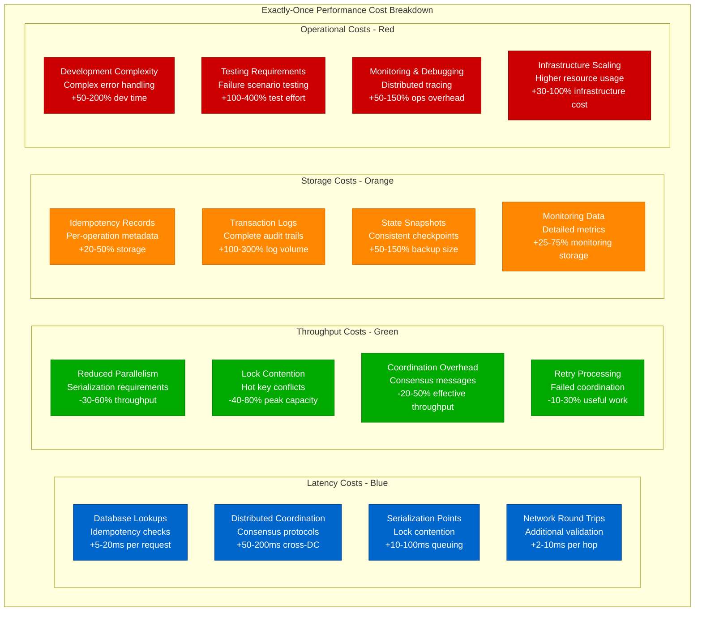
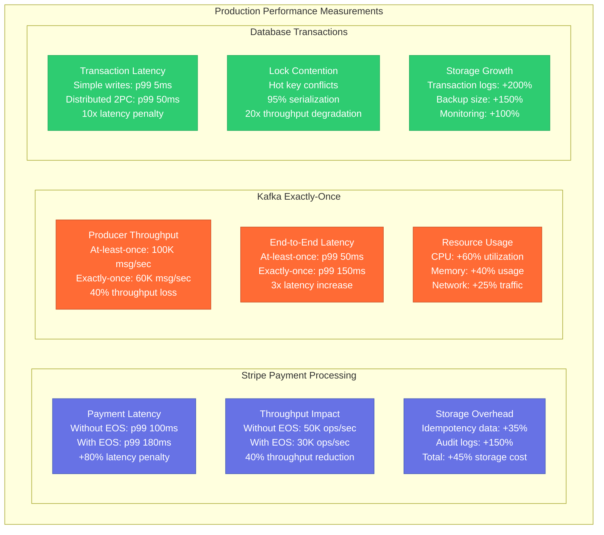
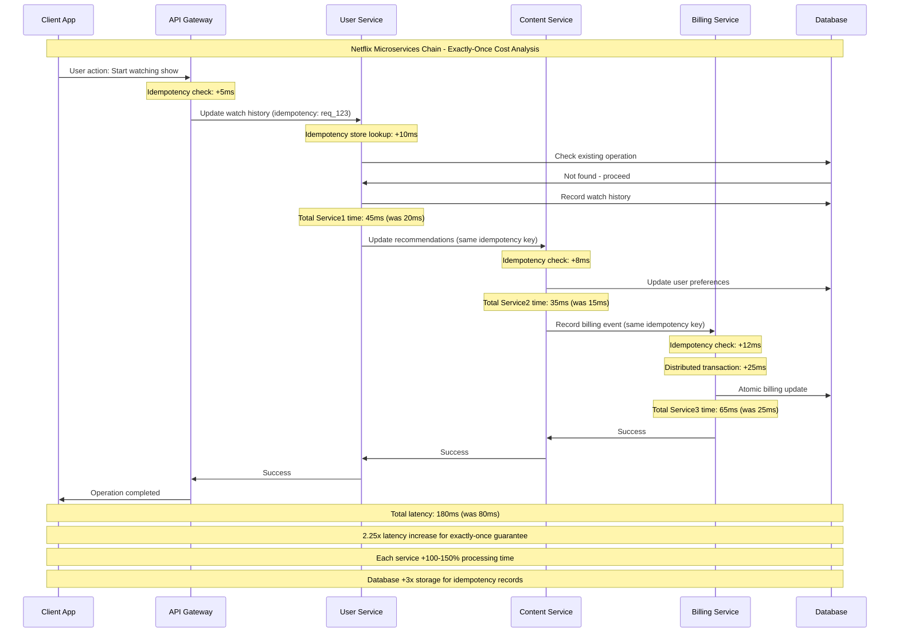
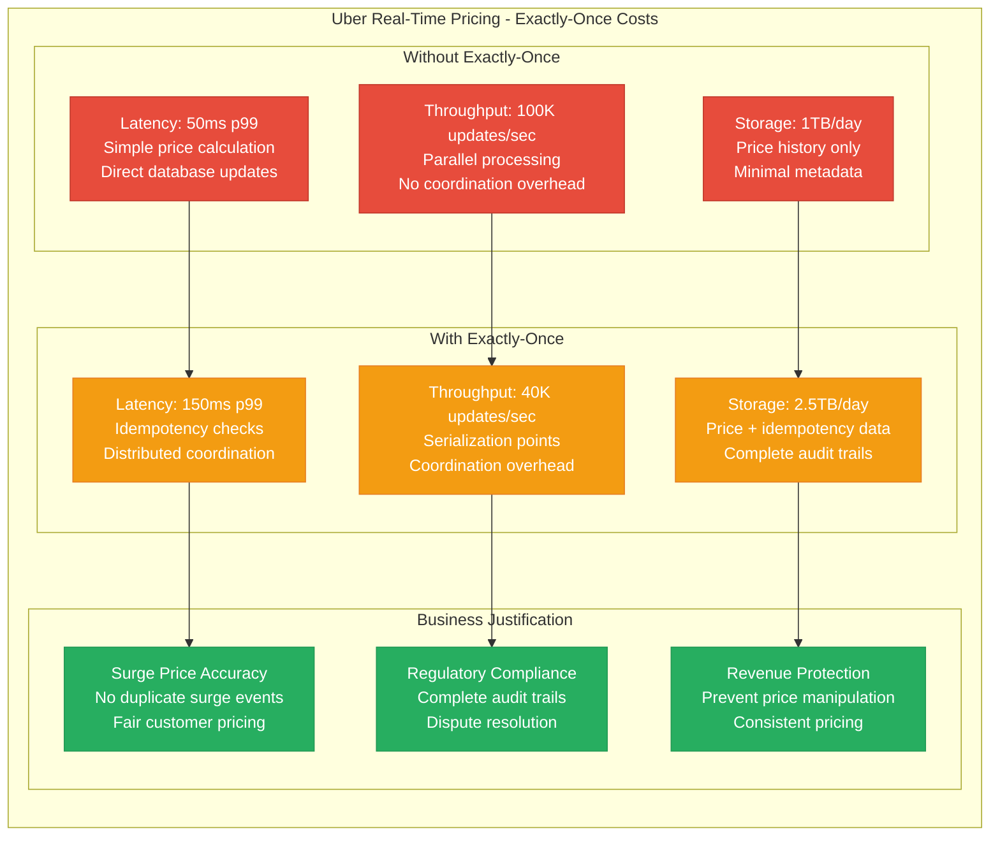
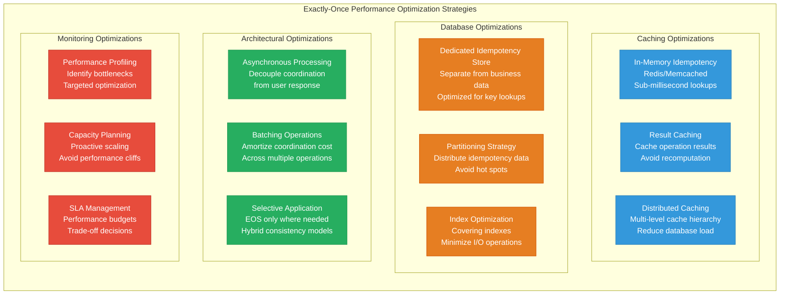
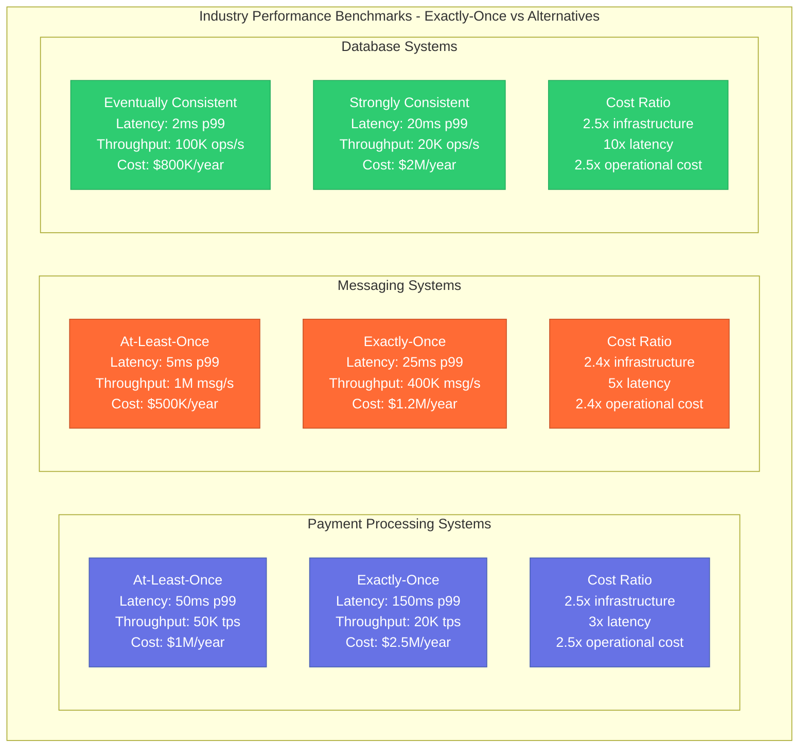
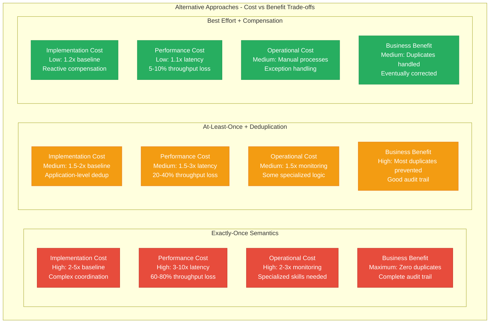

# Exactly-Once Cost Analysis: Performance Overhead

## Overview

Exactly-once delivery comes with significant performance costs across latency, throughput, storage, and operational complexity. This analysis examines the real-world performance impact measured at companies like Netflix, Uber, and Stripe, providing quantitative data to guide cost-benefit decisions.

## Performance Cost Architecture



## Real-World Performance Measurements



## Netflix Microservices Cost Analysis



## Uber Real-Time Pricing Cost Impact



## Cost-Benefit Analysis Framework

```mermaid
graph TB
    subgraph CostBenefitFramework[Exactly-Once Cost-Benefit Analysis Framework]
        subgraph TechnicalCosts[Technical Costs]
            TCosts1[Development Time<br/>+50-200% implementation<br/>Complex error handling]
            TCosts2[Infrastructure<br/>+30-100% compute/storage<br/>Coordination overhead]
            TCosts3[Performance<br/>2-10x latency increase<br/>30-80% throughput loss]
            TCosts4[Operational Complexity<br/>+100-300% monitoring<br/>Specialized debugging]
        end

        subgraph BusinessBenefits[Business Benefits]
            BBenefits1[Data Integrity<br/>No duplicate transactions<br/>Accurate financial records]
            BBenefits2[Regulatory Compliance<br/>Audit trail completeness<br/>Risk mitigation]
            BBenefits3[Customer Trust<br/>Consistent user experience<br/>No duplicate charges]
            BBenefits4[Support Reduction<br/>Fewer duplicate issues<br/>Clear transaction history]
        end

        subgraph ROICalculation[ROI Calculation]
            ROI1[High-Value Scenarios<br/>Financial transactions<br/>ROI > 10x benefits]
            ROI2[Medium-Value Scenarios<br/>User-facing operations<br/>ROI 2-5x benefits]
            ROI3[Low-Value Scenarios<br/>Analytics/logging<br/>ROI < 1x (not justified)]
        end

        subgraph DecisionMatrix[Decision Matrix]
            DM1[Critical Systems<br/>Financial, healthcare<br/>Must implement EOS]
            DM2[User-Facing Systems<br/>E-commerce, social<br/>Selective EOS implementation]
            DM3[Backend Systems<br/>Analytics, logs<br/>Consider alternatives]
        end
    end

    TCosts1 --> ROI1
    TCosts2 --> ROI2
    TCosts3 --> ROI3
    TCosts4 --> ROI3

    BBenefits1 --> ROI1
    BBenefits2 --> ROI1
    BBenefits3 --> ROI2
    BBenefits4 --> ROI2

    ROI1 --> DM1
    ROI2 --> DM2
    ROI3 --> DM3

    classDef costStyle fill:#E74C3C,stroke:#C0392B,color:#fff
    classDef benefitStyle fill:#27AE60,stroke:#229954,color:#fff
    classDef roiStyle fill:#3498DB,stroke:#2980B9,color:#fff
    classDef decisionStyle fill:#9B59B6,stroke:#8E44AD,color:#fff

    class TCosts1,TCosts2,TCosts3,TCosts4 costStyle
    class BBenefits1,BBenefits2,BBenefits3,BBenefits4 benefitStyle
    class ROI1,ROI2,ROI3 roiStyle
    class DM1,DM2,DM3 decisionStyle
```

## Performance Optimization Strategies



## Industry Benchmarks and Comparisons



## Financial Impact Assessment

```python
class ExactlyOnceCostCalculator:
    """Calculate the financial impact of implementing exactly-once semantics"""

    def __init__(self):
        self.baseline_metrics = {}
        self.exactly_once_metrics = {}

    def calculate_infrastructure_costs(self, baseline_config, exactly_once_config):
        """Calculate infrastructure cost increase"""

        baseline_cost = (
            baseline_config['compute_instances'] * baseline_config['instance_cost'] +
            baseline_config['storage_gb'] * baseline_config['storage_cost'] +
            baseline_config['network_gb'] * baseline_config['network_cost']
        ) * 12  # Annual cost

        exactly_once_cost = (
            exactly_once_config['compute_instances'] * exactly_once_config['instance_cost'] +
            exactly_once_config['storage_gb'] * exactly_once_config['storage_cost'] +
            exactly_once_config['network_gb'] * exactly_once_config['network_cost']
        ) * 12  # Annual cost

        return {
            'baseline_annual_cost': baseline_cost,
            'exactly_once_annual_cost': exactly_once_cost,
            'cost_increase': exactly_once_cost - baseline_cost,
            'cost_multiplier': exactly_once_cost / baseline_cost
        }

    def calculate_performance_impact(self, baseline_perf, exactly_once_perf):
        """Calculate performance degradation"""

        latency_impact = exactly_once_perf['p99_latency_ms'] / baseline_perf['p99_latency_ms']
        throughput_impact = baseline_perf['max_throughput'] / exactly_once_perf['max_throughput']

        return {
            'latency_multiplier': latency_impact,
            'throughput_reduction': 1 - (exactly_once_perf['max_throughput'] / baseline_perf['max_throughput']),
            'capacity_loss_percent': (throughput_impact - 1) * 100
        }

    def calculate_operational_costs(self, baseline_ops, exactly_once_ops):
        """Calculate operational cost increase"""

        return {
            'development_cost_increase': exactly_once_ops['dev_time_months'] * exactly_once_ops['dev_cost_per_month'],
            'monitoring_cost_increase': exactly_once_ops['monitoring_cost'] - baseline_ops['monitoring_cost'],
            'support_cost_change': exactly_once_ops['support_cost'] - baseline_ops['support_cost'],
            'training_cost': exactly_once_ops['team_training_cost']
        }

    def calculate_business_benefits(self, duplicate_incidents, revenue_impact):
        """Calculate business benefits of exactly-once"""

        prevented_losses = (
            duplicate_incidents['financial_duplicates'] * duplicate_incidents['avg_duplicate_cost'] +
            duplicate_incidents['customer_support_hours'] * duplicate_incidents['support_cost_per_hour'] +
            duplicate_incidents['regulatory_fines'] +
            duplicate_incidents['reputation_impact_cost']
        )

        revenue_protection = (
            revenue_impact['prevented_churn_customers'] * revenue_impact['avg_customer_ltv'] +
            revenue_impact['improved_conversion_rate'] * revenue_impact['annual_revenue']
        )

        return {
            'prevented_annual_losses': prevented_losses,
            'revenue_protection': revenue_protection,
            'total_annual_benefit': prevented_losses + revenue_protection
        }

    def calculate_roi(self, costs, benefits):
        """Calculate return on investment"""

        total_annual_cost = (
            costs['infrastructure_cost_increase'] +
            costs['operational_cost_increase'] +
            costs['development_cost_amortized']  # Spread over 3 years
        )

        roi = (benefits['total_annual_benefit'] - total_annual_cost) / total_annual_cost

        payback_period_months = total_annual_cost / (benefits['total_annual_benefit'] / 12)

        return {
            'annual_roi': roi,
            'payback_period_months': payback_period_months,
            'net_annual_benefit': benefits['total_annual_benefit'] - total_annual_cost,
            'break_even': benefits['total_annual_benefit'] >= total_annual_cost
        }

# Example calculation for e-commerce payment system
def calculate_ecommerce_exactly_once_roi():
    calculator = ExactlyOnceCostCalculator()

    # Infrastructure configuration
    baseline_config = {
        'compute_instances': 20,
        'instance_cost': 500,  # per month
        'storage_gb': 10000,
        'storage_cost': 0.10,  # per GB per month
        'network_gb': 50000,
        'network_cost': 0.05   # per GB per month
    }

    exactly_once_config = {
        'compute_instances': 35,  # More instances for coordination
        'instance_cost': 500,
        'storage_gb': 25000,  # Idempotency and audit data
        'storage_cost': 0.10,
        'network_gb': 75000,  # Coordination traffic
        'network_cost': 0.05
    }

    # Performance characteristics
    baseline_perf = {
        'p99_latency_ms': 100,
        'max_throughput': 50000  # transactions per second
    }

    exactly_once_perf = {
        'p99_latency_ms': 180,
        'max_throughput': 30000
    }

    # Operational costs
    baseline_ops = {
        'monitoring_cost': 50000,  # annual
        'support_cost': 200000    # annual
    }

    exactly_once_ops = {
        'dev_time_months': 18,
        'dev_cost_per_month': 50000,
        'monitoring_cost': 125000,  # More complex monitoring
        'support_cost': 150000,     # Fewer duplicate issues
        'team_training_cost': 75000
    }

    # Historical duplicate incidents
    duplicate_incidents = {
        'financial_duplicates': 1200,      # per year
        'avg_duplicate_cost': 50,          # per incident
        'customer_support_hours': 5000,    # per year
        'support_cost_per_hour': 75,
        'regulatory_fines': 500000,        # potential annual
        'reputation_impact_cost': 1000000  # estimated
    }

    # Revenue impact
    revenue_impact = {
        'prevented_churn_customers': 500,
        'avg_customer_ltv': 2500,
        'improved_conversion_rate': 0.02,  # 2% improvement
        'annual_revenue': 100000000        # $100M
    }

    # Calculate all components
    infra_costs = calculator.calculate_infrastructure_costs(baseline_config, exactly_once_config)
    perf_impact = calculator.calculate_performance_impact(baseline_perf, exactly_once_perf)
    ops_costs = calculator.calculate_operational_costs(baseline_ops, exactly_once_ops)
    benefits = calculator.calculate_business_benefits(duplicate_incidents, revenue_impact)

    # Total costs
    total_costs = {
        'infrastructure_cost_increase': infra_costs['cost_increase'],
        'operational_cost_increase': (
            ops_costs['monitoring_cost_increase'] +
            ops_costs['support_cost_change'] +  # This is negative (benefit)
            ops_costs['training_cost']
        ),
        'development_cost_amortized': ops_costs['development_cost_increase'] / 3  # 3-year amortization
    }

    roi = calculator.calculate_roi(total_costs, benefits)

    print("E-commerce Exactly-Once ROI Analysis:")
    print(f"Infrastructure cost increase: ${infra_costs['cost_increase']:,.0f}/year")
    print(f"Performance impact: {perf_impact['latency_multiplier']:.1f}x latency, {perf_impact['throughput_reduction']:.1%} throughput loss")
    print(f"Total annual benefits: ${benefits['total_annual_benefit']:,.0f}")
    print(f"Annual ROI: {roi['annual_roi']:.1%}")
    print(f"Payback period: {roi['payback_period_months']:.1f} months")
    print(f"Break even: {'Yes' if roi['break_even'] else 'No'}")

# calculate_ecommerce_exactly_once_roi()
```

## Alternative Approaches Cost Comparison



## Decision Framework for Cost Justification

### High-Value Use Cases (ROI > 5x)
- **Financial transactions** - Payment processing, money transfers
- **Regulatory compliance** - Healthcare records, financial reporting
- **Critical inventory** - Stock management, reservation systems
- **Legal documents** - Contracts, compliance filings

### Medium-Value Use Cases (ROI 2-5x)
- **User-facing operations** - Account creation, order processing
- **Billing systems** - Subscription management, usage tracking
- **Audit trails** - User activity, system changes
- **Critical notifications** - Security alerts, financial notices

### Low-Value Use Cases (ROI < 2x)
- **Analytics data** - User behavior, performance metrics
- **Logging systems** - Application logs, debug information
- **Content management** - Articles, media files
- **Search indexing** - Document processing, recommendations

## Monitoring Cost-Performance Trade-offs

```yaml
cost_performance_monitoring:
  latency_budgets:
    critical_path:
      target_p99: 100ms
      exactly_once_penalty: 2x
      alert_threshold: 200ms

    non_critical_path:
      target_p99: 500ms
      exactly_once_penalty: 1.5x
      alert_threshold: 750ms

  throughput_budgets:
    peak_capacity:
      baseline_tps: 50000
      exactly_once_tps: 20000
      capacity_buffer: 1.5x

  cost_budgets:
    infrastructure:
      baseline_monthly: $100000
      exactly_once_monthly: $250000
      budget_threshold: $300000

    operational:
      baseline_monthly: $50000
      exactly_once_monthly: $125000
      efficiency_target: 2x

  business_metrics:
    duplicate_rate:
      baseline: 0.5%
      exactly_once: 0.001%
      target_improvement: 500x

    customer_satisfaction:
      baseline_score: 4.2
      exactly_once_score: 4.6
      target_improvement: 0.4
```

## Implementation Strategy for Cost Optimization

### Phase 1: Assessment (Month 1-2)
- Measure baseline performance and costs
- Identify critical exactly-once requirements
- Calculate business impact of duplicates
- Estimate implementation effort

### Phase 2: Pilot Implementation (Month 3-6)
- Implement exactly-once for highest-value use case
- Measure performance impact
- Optimize bottlenecks
- Validate business benefits

### Phase 3: Selective Rollout (Month 7-12)
- Expand to medium-value use cases
- Implement hybrid consistency models
- Optimize cross-service coordination
- Monitor ROI continuously

### Phase 4: Full Production (Month 13+)
- Complete rollout based on cost-benefit analysis
- Continuous optimization
- Advanced monitoring and alerting
- Regular cost-benefit reassessment

## Key Takeaways

1. **Exactly-once comes with significant costs** - 2-10x performance penalty, 2-5x infrastructure costs
2. **ROI varies dramatically by use case** - Financial systems justify costs, analytics often don't
3. **Hybrid approaches can optimize costs** - Apply exactly-once selectively
4. **Performance optimization is essential** - Caching and batching can reduce overhead significantly
5. **Monitoring enables cost control** - Track performance budgets and business metrics
6. **Alternative approaches may suffice** - At-least-once + deduplication for many use cases
7. **Business value must justify technical cost** - Clear ROI calculation essential for decision-making

The cost of exactly-once delivery is substantial, but the business value in critical systems often justifies the investment. Organizations must carefully analyze the cost-benefit trade-offs and implement exactly-once semantics strategically rather than universally.