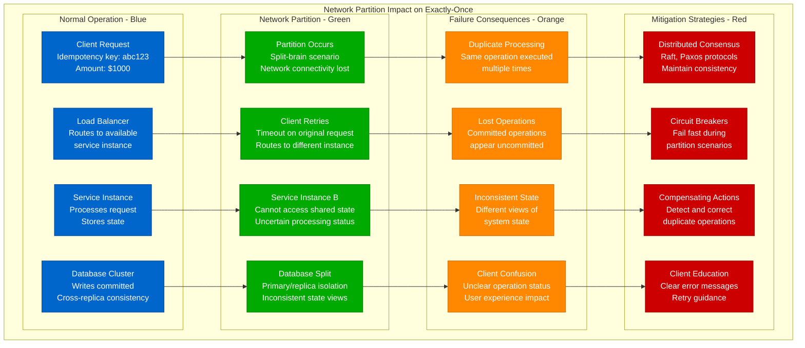
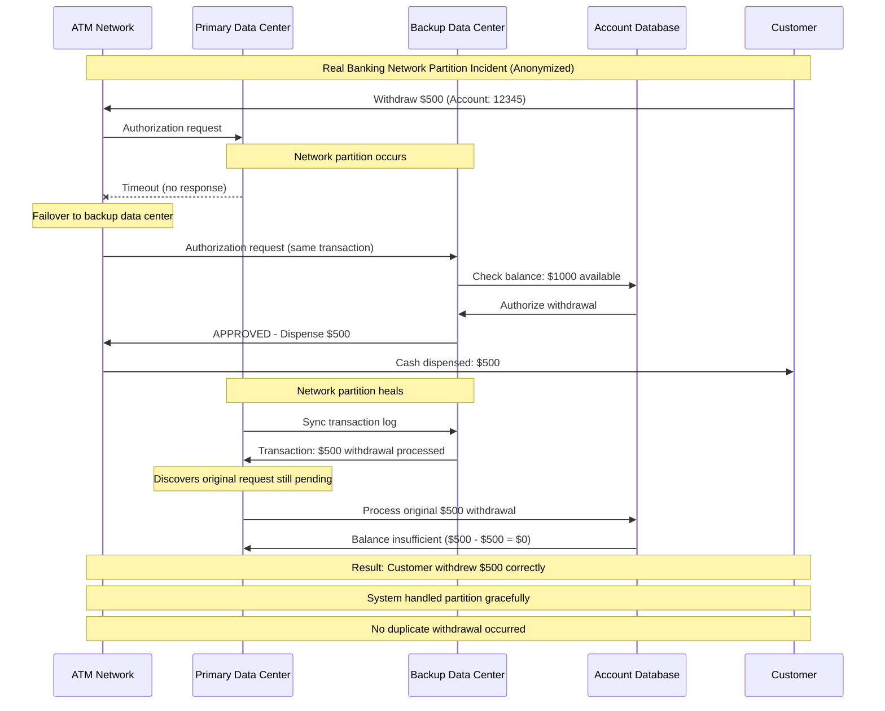
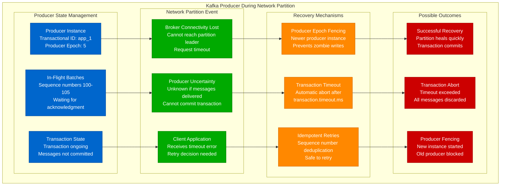
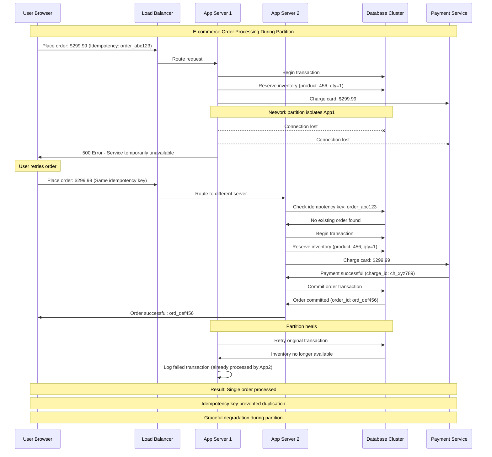
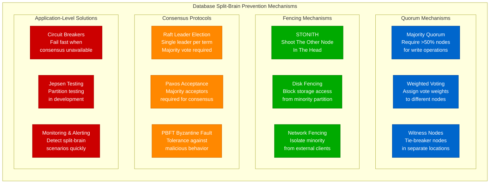
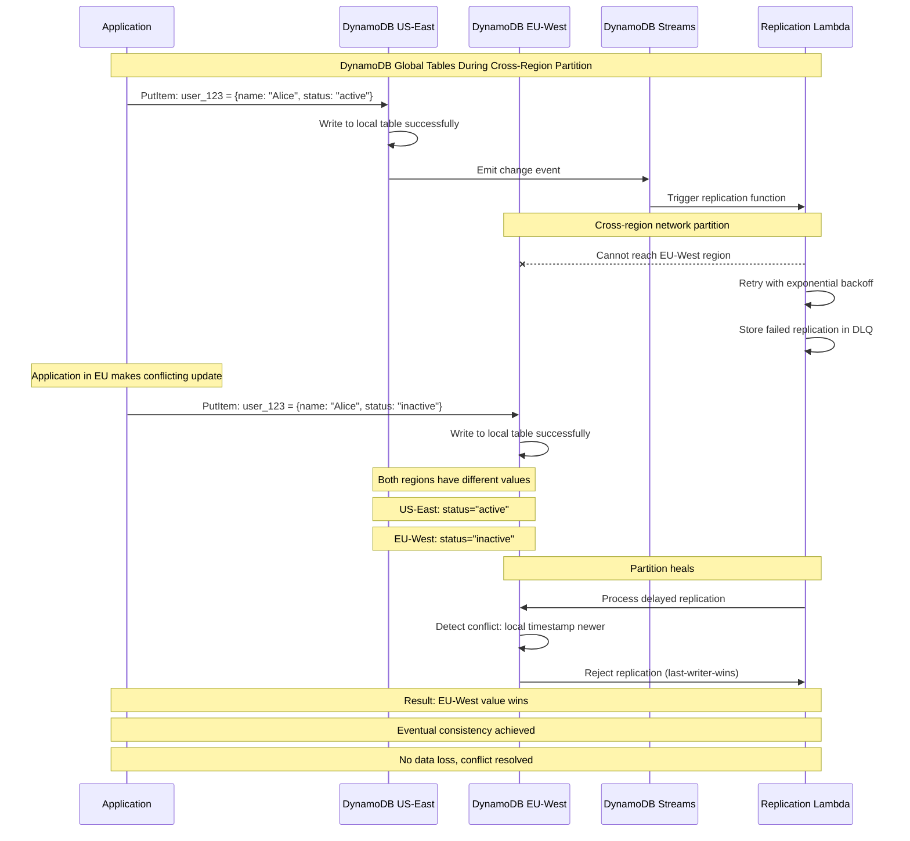
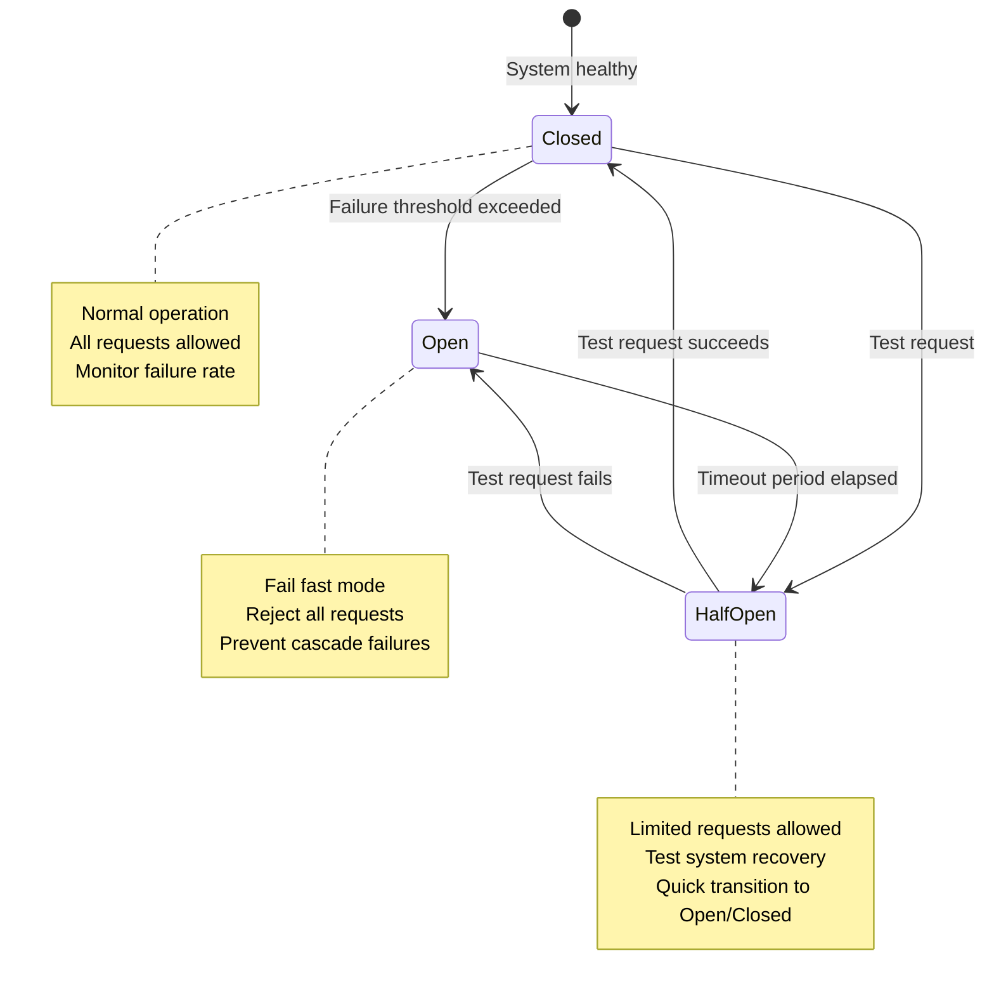
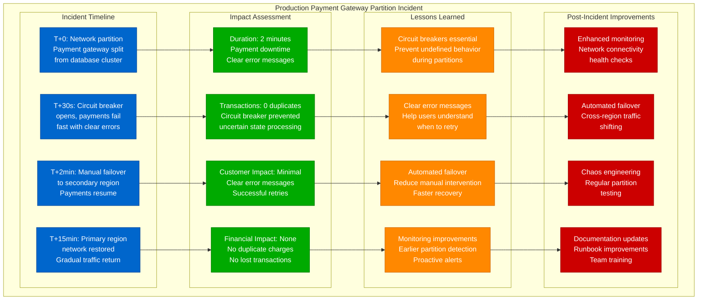
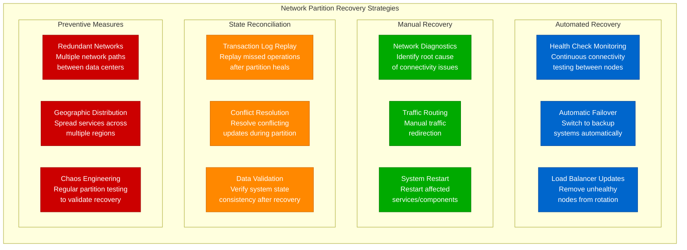

# Exactly-Once Failures: Network Partitions Impact

## Overview

Network partitions pose the greatest threat to exactly-once delivery guarantees. This guide examines how systems like Kafka, banking networks, and distributed databases handle partition scenarios while maintaining exactly-once semantics, with real examples from production incidents at major companies.

## Network Partition Challenge



## Banking Network Partition: 2017 Incident Analysis



## Kafka Producer Partition Behavior



## E-commerce Platform Partition Response



## Database Split-Brain Prevention



## Amazon DynamoDB Global Tables Partition



## Circuit Breaker Pattern for Partitions



## Production Incident: Payment Gateway Partition



## Partition Testing with Jepsen

```python
import time
import random
import threading
from typing import List, Dict, Any

class JepsenPartitionTest:
    """Jepsen-style partition testing for exactly-once systems"""

    def __init__(self, nodes: List[str], client_factory):
        self.nodes = nodes
        self.client_factory = client_factory
        self.history = []
        self.partitions = []

    def run_test(self, duration_seconds: int = 300):
        """Run partition test for specified duration"""

        # Start client operations
        client_thread = threading.Thread(
            target=self.run_client_operations,
            args=(duration_seconds,)
        )

        # Start partition operations
        partition_thread = threading.Thread(
            target=self.run_partition_operations,
            args=(duration_seconds,)
        )

        client_thread.start()
        partition_thread.start()

        client_thread.join()
        partition_thread.join()

        # Analyze results
        return self.analyze_exactly_once_violations()

    def run_client_operations(self, duration: int):
        """Simulate client operations during partitions"""
        start_time = time.time()
        operation_id = 0

        while time.time() - start_time < duration:
            try:
                # Generate operation with idempotency key
                operation_id += 1
                idempotency_key = f"op_{operation_id}_{random.randint(1000, 9999)}"

                # Random operation type
                if random.random() < 0.7:
                    result = self.perform_write_operation(idempotency_key)
                else:
                    result = self.perform_read_operation(idempotency_key)

                # Record operation in history
                self.history.append({
                    'timestamp': time.time(),
                    'operation': result['operation'],
                    'idempotency_key': idempotency_key,
                    'result': result['result'],
                    'status': result['status']
                })

            except Exception as e:
                # Record failed operations too
                self.history.append({
                    'timestamp': time.time(),
                    'operation': 'failed',
                    'idempotency_key': idempotency_key,
                    'result': None,
                    'status': 'error',
                    'error': str(e)
                })

            # Random delay between operations
            time.sleep(random.uniform(0.01, 0.1))

    def run_partition_operations(self, duration: int):
        """Simulate network partitions during test"""
        start_time = time.time()

        while time.time() - start_time < duration:
            # Wait random time before creating partition
            time.sleep(random.uniform(10, 30))

            if time.time() - start_time >= duration:
                break

            # Create random partition
            partition_size = random.randint(1, len(self.nodes) - 1)
            partition_nodes = random.sample(self.nodes, partition_size)

            self.create_partition(partition_nodes)

            # Keep partition for random duration
            partition_duration = random.uniform(5, 20)
            time.sleep(partition_duration)

            # Heal partition
            self.heal_partition(partition_nodes)

    def perform_write_operation(self, idempotency_key: str) -> Dict[str, Any]:
        """Perform write operation with idempotency"""
        client = self.client_factory.create_client()

        data = {
            'key': f"test_key_{random.randint(1, 100)}",
            'value': f"test_value_{time.time()}",
            'idempotency_key': idempotency_key
        }

        result = client.write(data)

        return {
            'operation': 'write',
            'data': data,
            'result': result.get('id'),
            'status': 'success' if result.get('success') else 'failed'
        }

    def perform_read_operation(self, idempotency_key: str) -> Dict[str, Any]:
        """Perform read operation"""
        client = self.client_factory.create_client()

        key = f"test_key_{random.randint(1, 100)}"
        result = client.read(key)

        return {
            'operation': 'read',
            'key': key,
            'result': result.get('value'),
            'status': 'success' if result.get('found') else 'not_found'
        }

    def create_partition(self, nodes: List[str]):
        """Simulate network partition"""
        partition_info = {
            'type': 'partition',
            'timestamp': time.time(),
            'nodes': nodes,
            'action': 'isolate'
        }

        self.partitions.append(partition_info)

        # In real implementation, this would use iptables or
        # network simulation tools to create actual partitions
        print(f"Creating partition: isolating nodes {nodes}")

    def heal_partition(self, nodes: List[str]):
        """Heal network partition"""
        partition_info = {
            'type': 'partition',
            'timestamp': time.time(),
            'nodes': nodes,
            'action': 'heal'
        }

        self.partitions.append(partition_info)
        print(f"Healing partition: reconnecting nodes {nodes}")

    def analyze_exactly_once_violations(self) -> Dict[str, Any]:
        """Analyze test results for exactly-once violations"""

        # Group operations by idempotency key
        operations_by_key = {}
        for op in self.history:
            key = op['idempotency_key']
            if key not in operations_by_key:
                operations_by_key[key] = []
            operations_by_key[key].append(op)

        violations = []

        # Check for duplicate successful operations
        for key, ops in operations_by_key.items():
            successful_ops = [op for op in ops if op['status'] == 'success']

            if len(successful_ops) > 1:
                # Check if they have the same result (acceptable)
                results = [op['result'] for op in successful_ops]
                if len(set(results)) > 1:
                    violations.append({
                        'type': 'different_results',
                        'idempotency_key': key,
                        'operations': successful_ops
                    })
                # Multiple identical results might be OK (cached responses)

        # Check for lost operations (operation succeeded but later appears failed)
        for key, ops in operations_by_key.items():
            success_times = [op['timestamp'] for op in ops if op['status'] == 'success']
            failure_times = [op['timestamp'] for op in ops if op['status'] == 'error']

            if success_times and failure_times:
                # Check if failure occurred after success (potential lost operation)
                max_success = max(success_times)
                min_failure = min(failure_times)

                if min_failure > max_success:
                    violations.append({
                        'type': 'lost_operation',
                        'idempotency_key': key,
                        'success_time': max_success,
                        'failure_time': min_failure
                    })

        return {
            'total_operations': len(self.history),
            'total_partitions': len([p for p in self.partitions if p['action'] == 'isolate']),
            'violations': violations,
            'violation_count': len(violations),
            'exactly_once_maintained': len(violations) == 0
        }

# Example usage
def run_payment_system_partition_test():
    """Test payment system under network partitions"""

    nodes = ['payment-1', 'payment-2', 'payment-3']

    class PaymentClientFactory:
        def create_client(self):
            return PaymentSystemClient()

    test = JepsenPartitionTest(nodes, PaymentClientFactory())
    results = test.run_test(duration_seconds=60)

    print(f"Test Results:")
    print(f"Total operations: {results['total_operations']}")
    print(f"Partitions created: {results['total_partitions']}")
    print(f"Exactly-once violations: {results['violation_count']}")
    print(f"Exactly-once maintained: {results['exactly_once_maintained']}")

    if results['violations']:
        print("\nViolations found:")
        for violation in results['violations']:
            print(f"- {violation['type']}: {violation['idempotency_key']}")

# run_payment_system_partition_test()
```

## Partition Recovery Strategies



## Monitoring and Alerting for Partitions

### Key Metrics to Monitor
```yaml
partition_monitoring:
  network_connectivity:
    - inter_node_latency
    - packet_loss_rate
    - connection_timeout_rate

  system_health:
    - consensus_leader_elections
    - failed_replication_attempts
    - split_brain_detection

  application_metrics:
    - duplicate_operation_rate
    - idempotency_key_collision_rate
    - transaction_abort_rate

alerting_rules:
  critical:
    - name: "Network Partition Detected"
      condition: "consensus_leader_elections > 3 in 5 minutes"
      action: "Page on-call engineer immediately"

    - name: "Split Brain Scenario"
      condition: "multiple_leaders_detected == true"
      action: "Emergency escalation"

  warning:
    - name: "High Duplicate Rate"
      condition: "duplicate_operation_rate > 10%"
      action: "Investigate client retry logic"

    - name: "Increased Latency"
      condition: "inter_node_latency > 100ms"
      action: "Monitor for potential partition"
```

## Best Practices Checklist

### Design for Partitions
- [ ] Implement proper consensus protocols (Raft, Paxos)
- [ ] Use circuit breakers to fail fast during partitions
- [ ] Design idempotent operations at all levels
- [ ] Plan for split-brain scenarios with quorum mechanisms
- [ ] Implement proper timeout and retry policies

### Testing and Validation
- [ ] Use Jepsen-style partition testing in development
- [ ] Test all failure scenarios including network partitions
- [ ] Validate exactly-once guarantees under partition conditions
- [ ] Implement chaos engineering practices
- [ ] Test recovery procedures regularly

### Monitoring and Operations
- [ ] Monitor network connectivity between all nodes
- [ ] Alert on partition detection and split-brain scenarios
- [ ] Track duplicate operation rates and idempotency violations
- [ ] Implement automated partition recovery where possible
- [ ] Maintain detailed incident response procedures

### Client-Side Considerations
- [ ] Provide clear error messages during partitions
- [ ] Implement proper retry logic with exponential backoff
- [ ] Use consistent idempotency keys across retries
- [ ] Educate users about temporary unavailability
- [ ] Implement client-side circuit breakers

## Key Takeaways

1. **Network partitions are inevitable** - Systems must be designed to handle them gracefully
2. **Consensus protocols are essential** - Raft and Paxos prevent split-brain scenarios
3. **Circuit breakers prevent cascading failures** - Fail fast when consistency cannot be guaranteed
4. **Testing is critical** - Jepsen-style testing reveals partition-related bugs
5. **Monitoring enables quick response** - Early detection minimizes impact
6. **Client education improves UX** - Clear error messages help users understand when to retry
7. **Recovery procedures must be automated** - Manual intervention is too slow for production systems

Network partitions represent the ultimate test of exactly-once delivery systems. Organizations that successfully handle partitions while maintaining exactly-once guarantees demonstrate truly robust distributed system design.