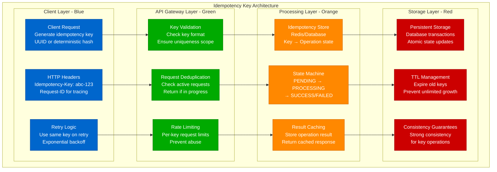
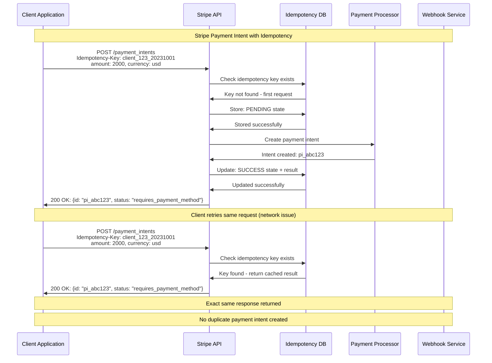
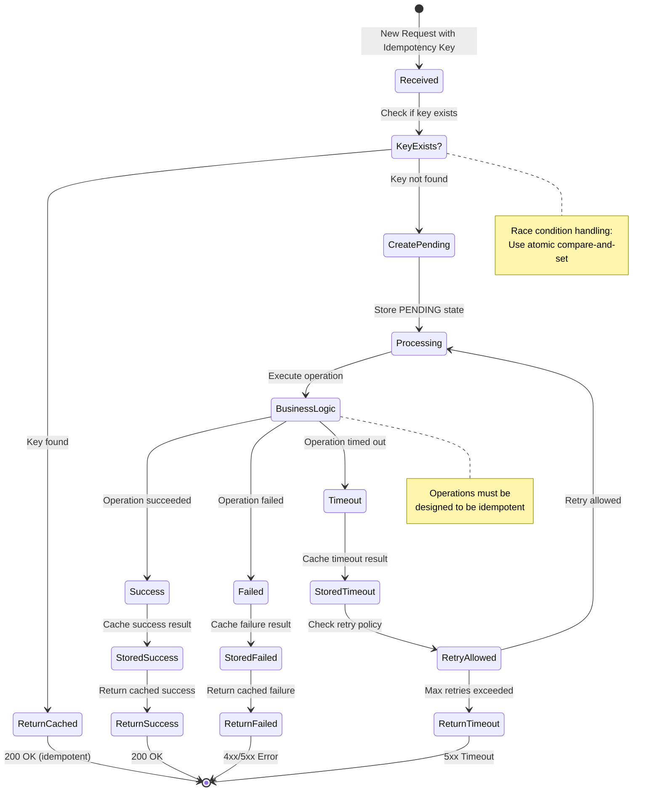
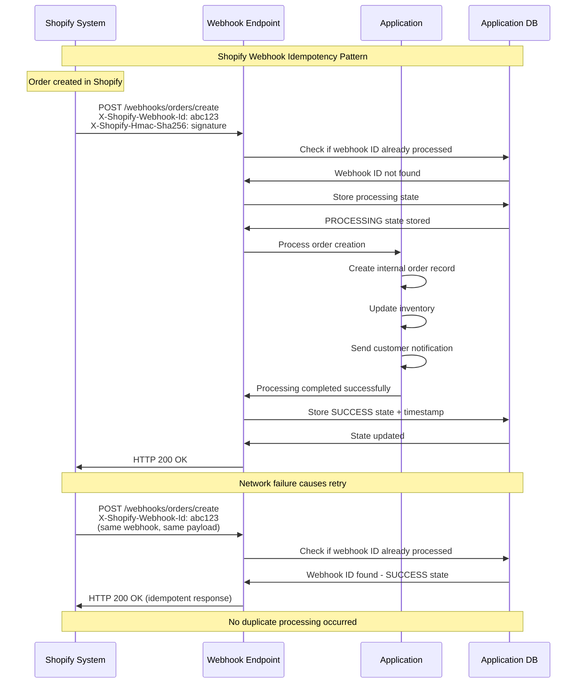
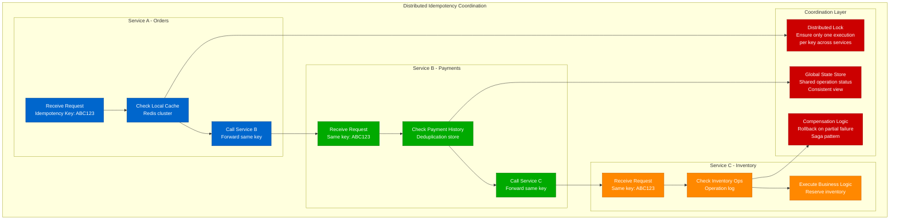
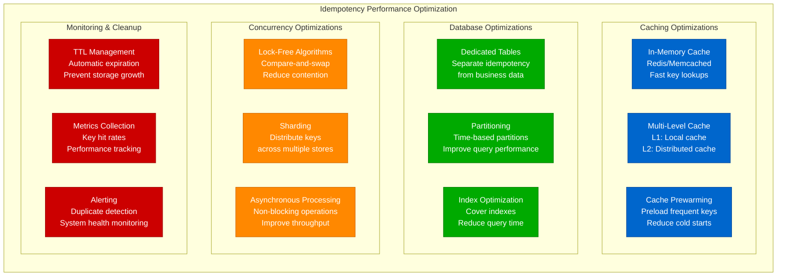

# Exactly-Once Implementation: Idempotency Keys and Deduplication

## Overview

Implementing exactly-once delivery requires robust idempotency mechanisms and sophisticated deduplication strategies. This guide examines practical implementations used by Stripe, Shopify, Uber, and other systems that handle millions of critical operations daily.

## Idempotency Key Architecture



## Stripe Payment Intent Implementation



## Idempotency Key Generation Strategies

```mermaid
graph TB
    subgraph KeyGenerationStrategies[Idempotency Key Generation Strategies]
        subgraph ClientGenerated[Client-Generated Keys]
            CG1[UUIDs<br/>Globally unique<br/>cryptographically secure<br/>uuid4() recommended]
            CG2[Deterministic Hash<br/>Hash of request content<br/>SHA-256(user_id + amount + timestamp)<br/>Reproducible across retries]
            CG3[Business Logic Based<br/>Order ID + Action Type<br/>order_123_payment<br/>Semantic meaning]
        end

        subgraph ServerGenerated[Server-Generated Keys]
            SG1[Database Sequences<br/>Auto-incrementing IDs<br/>Simple but not distributed]
            SG2[Distributed ID Generators<br/>Snowflake, ULID<br/>Time-ordered, unique]
            SG3[Composite Keys<br/>tenant_id:timestamp:sequence<br/>Multi-tenant systems]
        end

        subgraph HybridApproaches[Hybrid Approaches]
            HA1[Client Prefix + Server Suffix<br/>client_123:server_generated<br/>Best of both worlds]
            HA2[Request Fingerprinting<br/>Hash of normalized request<br/>Automatic deduplication]
            HA3[Business Event IDs<br/>payment_attempt_456<br/>Domain-specific identifiers]
        end

        subgraph KeyProperties[Required Properties]
            KP1[Uniqueness<br/>No collisions across<br/>time and space]
            KP2[Determinism<br/>Same input produces<br/>same key (for retries)]
            KP3[Appropriate Scope<br/>User-scoped or<br/>global uniqueness]
            KP4[Reasonable Length<br/>Storage efficient<br/>URL-safe characters]
        end
    end

    CG2 --> KP1
    SG2 --> KP2
    HA2 --> KP3
    CG1 --> KP4

    classDef clientStyle fill:#0066CC,stroke:#004499,color:#fff
    classDef serverStyle fill:#00AA00,stroke:#007700,color:#fff
    classDef hybridStyle fill:#FF8800,stroke:#CC6600,color:#fff
    classDef propertiesStyle fill:#CC0000,stroke:#990000,color:#fff

    class CG1,CG2,CG3 clientStyle
    class SG1,SG2,SG3 serverStyle
    class HA1,HA2,HA3 hybridStyle
    class KP1,KP2,KP3,KP4 propertiesStyle
```

## Deduplication State Machine



## Production Implementation: E-commerce Order Processing

```python
import uuid
import time
import hashlib
from enum import Enum
from typing import Optional, Dict, Any
from dataclasses import dataclass
import redis
import json

class OperationState(Enum):
    PENDING = "PENDING"
    PROCESSING = "PROCESSING"
    SUCCESS = "SUCCESS"
    FAILED = "FAILED"
    TIMEOUT = "TIMEOUT"

@dataclass
class IdempotencyRecord:
    key: str
    state: OperationState
    result: Optional[Dict[str, Any]]
    created_at: float
    updated_at: float
    ttl_seconds: int = 3600  # 1 hour default

class IdempotencyService:
    """Production-grade idempotency service"""

    def __init__(self, redis_client: redis.Redis):
        self.redis = redis_client
        self.default_ttl = 3600  # 1 hour

    def generate_key(self, user_id: str, operation: str, **params) -> str:
        """Generate deterministic idempotency key"""
        # Sort parameters for consistent hashing
        sorted_params = sorted(params.items())
        param_string = "&".join(f"{k}={v}" for k, v in sorted_params)

        # Create deterministic key
        content = f"{user_id}:{operation}:{param_string}"
        hash_part = hashlib.sha256(content.encode()).hexdigest()[:16]

        return f"idem:{user_id}:{operation}:{hash_part}"

    async def execute_idempotent(self, idempotency_key: str, operation_func,
                               timeout_seconds: int = 30) -> Dict[str, Any]:
        """Execute operation with idempotency guarantee"""

        # Check if operation already exists
        existing = await self.get_record(idempotency_key)
        if existing:
            return await self.handle_existing_operation(existing, operation_func, timeout_seconds)

        # Create new operation record
        record = IdempotencyRecord(
            key=idempotency_key,
            state=OperationState.PENDING,
            result=None,
            created_at=time.time(),
            updated_at=time.time()
        )

        # Atomic create - only one request can create the record
        created = await self.create_record_atomic(record)
        if not created:
            # Another request created it first - retry
            existing = await self.get_record(idempotency_key)
            return await self.handle_existing_operation(existing, operation_func, timeout_seconds)

        # Execute the operation
        try:
            # Update state to PROCESSING
            await self.update_state(idempotency_key, OperationState.PROCESSING)

            # Execute business logic
            result = await operation_func()

            # Store success result
            await self.update_result(idempotency_key, OperationState.SUCCESS, result)

            return {
                "status": "success",
                "result": result,
                "idempotency_key": idempotency_key
            }

        except Exception as e:
            # Store failure result
            error_result = {"error": str(e), "type": type(e).__name__}
            await self.update_result(idempotency_key, OperationState.FAILED, error_result)

            return {
                "status": "failed",
                "error": error_result,
                "idempotency_key": idempotency_key
            }

    async def handle_existing_operation(self, record: IdempotencyRecord,
                                      operation_func, timeout_seconds: int) -> Dict[str, Any]:
        """Handle request for existing operation"""

        if record.state == OperationState.SUCCESS:
            return {
                "status": "success",
                "result": record.result,
                "idempotency_key": record.key,
                "cached": True
            }

        elif record.state == OperationState.FAILED:
            return {
                "status": "failed",
                "error": record.result,
                "idempotency_key": record.key,
                "cached": True
            }

        elif record.state in [OperationState.PENDING, OperationState.PROCESSING]:
            # Wait for completion or timeout
            return await self.wait_for_completion(record, timeout_seconds)

        elif record.state == OperationState.TIMEOUT:
            # Previous request timed out - allow retry
            return await self.retry_operation(record, operation_func, timeout_seconds)

    async def create_record_atomic(self, record: IdempotencyRecord) -> bool:
        """Atomically create idempotency record"""
        record_data = {
            "state": record.state.value,
            "result": json.dumps(record.result) if record.result else None,
            "created_at": record.created_at,
            "updated_at": record.updated_at
        }

        # Use Redis SET with NX (only set if not exists)
        result = await self.redis.set(
            record.key,
            json.dumps(record_data),
            nx=True,  # Only set if key doesn't exist
            ex=record.ttl_seconds
        )

        return result is not None

    async def get_record(self, key: str) -> Optional[IdempotencyRecord]:
        """Get idempotency record"""
        data = await self.redis.get(key)
        if not data:
            return None

        record_data = json.loads(data)
        return IdempotencyRecord(
            key=key,
            state=OperationState(record_data["state"]),
            result=json.loads(record_data["result"]) if record_data["result"] else None,
            created_at=record_data["created_at"],
            updated_at=record_data["updated_at"]
        )

    async def update_state(self, key: str, state: OperationState):
        """Update operation state"""
        record = await self.get_record(key)
        if record:
            record.state = state
            record.updated_at = time.time()
            await self.store_record(record)

    async def update_result(self, key: str, state: OperationState, result: Dict[str, Any]):
        """Update operation result"""
        record = await self.get_record(key)
        if record:
            record.state = state
            record.result = result
            record.updated_at = time.time()
            await self.store_record(record)

    async def store_record(self, record: IdempotencyRecord):
        """Store updated record"""
        record_data = {
            "state": record.state.value,
            "result": json.dumps(record.result) if record.result else None,
            "created_at": record.created_at,
            "updated_at": record.updated_at
        }

        await self.redis.set(
            record.key,
            json.dumps(record_data),
            ex=record.ttl_seconds
        )

# Example usage: E-commerce order processing
class OrderService:
    def __init__(self, idempotency_service: IdempotencyService):
        self.idempotency = idempotency_service

    async def create_order(self, user_id: str, cart_items: list, payment_method: str) -> Dict[str, Any]:
        """Create order with exactly-once guarantee"""

        # Generate idempotency key based on user and cart
        cart_hash = hashlib.sha256(json.dumps(cart_items, sort_keys=True).encode()).hexdigest()[:8]
        idempotency_key = self.idempotency.generate_key(
            user_id=user_id,
            operation="create_order",
            cart_hash=cart_hash,
            payment_method=payment_method
        )

        async def order_operation():
            # Calculate total
            total = sum(item["price"] * item["quantity"] for item in cart_items)

            # Reserve inventory
            for item in cart_items:
                await self.reserve_inventory(item["product_id"], item["quantity"])

            # Process payment
            payment_result = await self.process_payment(user_id, total, payment_method)

            # Create order record
            order = await self.create_order_record(user_id, cart_items, total, payment_result)

            # Send confirmation email
            await self.send_order_confirmation(user_id, order["order_id"])

            return {
                "order_id": order["order_id"],
                "total": total,
                "payment_id": payment_result["payment_id"],
                "status": "confirmed"
            }

        return await self.idempotency.execute_idempotent(idempotency_key, order_operation)

    async def reserve_inventory(self, product_id: str, quantity: int):
        """Reserve inventory (idempotent operation)"""
        # Implementation would use database with proper locking
        pass

    async def process_payment(self, user_id: str, amount: float, payment_method: str):
        """Process payment (delegates to payment service with its own idempotency)"""
        # Payment service has its own idempotency handling
        pass

    async def create_order_record(self, user_id: str, items: list, total: float, payment_result: dict):
        """Create order in database (idempotent with UPSERT)"""
        pass

    async def send_order_confirmation(self, user_id: str, order_id: str):
        """Send confirmation email (idempotent - check if already sent)"""
        pass
```

## Database-Level Idempotency

```mermaid
graph LR
    subgraph DatabaseIdempotency[Database-Level Idempotency Patterns]
        subgraph UniqueConstraints[Unique Constraints]
            UC1[Natural Keys<br/>Business identifiers<br/>UNIQUE(user_id, order_date)]
            UC2[Composite Keys<br/>Multiple columns<br/>UNIQUE(tenant, operation, date)]
            UC3[Hash-Based Keys<br/>Content hash<br/>UNIQUE(request_hash)]
        end

        subgraph UpsertPatterns[UPSERT Patterns]
            UP1[INSERT ... ON CONFLICT<br/>PostgreSQL syntax<br/>DO NOTHING or DO UPDATE]
            UP2[MERGE Statement<br/>SQL Server/Oracle<br/>WHEN MATCHED/NOT MATCHED]
            UP3[REPLACE INTO<br/>MySQL syntax<br/>Delete and insert]
        end

        subgraph TransactionalPatterns[Transactional Patterns]
            TP1[SELECT FOR UPDATE<br/>Lock and check<br/>Prevent race conditions]
            TP2[Optimistic Locking<br/>Version numbers<br/>Compare and swap]
            TP3[Conditional Updates<br/>WHERE clauses<br/>Check state before update]
        end

        subgraph SchemaDesign[Schema Design]
            SD1[Idempotency Tables<br/>Dedicated tracking<br/>operation_id, status, result]
            SD2[State Columns<br/>Add to business tables<br/>processing_state, attempts]
            SD3[Audit Logs<br/>Complete operation history<br/>Immutable append-only]
        end
    end

    UC1 --> UP1
    UP2 --> TP1
    TP2 --> SD1

    classDef constraintStyle fill:#0066CC,stroke:#004499,color:#fff
    classDef upsertStyle fill:#00AA00,stroke:#007700,color:#fff
    classDef transactionalStyle fill:#FF8800,stroke:#CC6600,color:#fff
    classDef schemaStyle fill:#CC0000,stroke:#990000,color:#fff

    class UC1,UC2,UC3 constraintStyle
    class UP1,UP2,UP3 upsertStyle
    class TP1,TP2,TP3 transactionalStyle
    class SD1,SD2,SD3 schemaStyle
```

## Shopify Webhook Idempotency



## Distributed Idempotency Coordination



## Performance Optimization Strategies



## Testing Idempotency Implementation

```python
import asyncio
import pytest
from concurrent.futures import ThreadPoolExecutor

class IdempotencyTester:
    """Comprehensive test suite for idempotency implementation"""

    def __init__(self, idempotency_service):
        self.service = idempotency_service

    async def test_basic_idempotency(self):
        """Test basic idempotent operation"""
        key = "test_basic_123"
        expected_result = {"value": 42}

        async def operation():
            return expected_result

        # First call
        result1 = await self.service.execute_idempotent(key, operation)
        assert result1["status"] == "success"
        assert result1["result"] == expected_result

        # Second call with same key
        result2 = await self.service.execute_idempotent(key, operation)
        assert result2["status"] == "success"
        assert result2["result"] == expected_result
        assert result2["cached"] == True

    async def test_concurrent_requests(self):
        """Test concurrent requests with same idempotency key"""
        key = "test_concurrent_456"
        call_count = 0

        async def operation():
            nonlocal call_count
            call_count += 1
            await asyncio.sleep(0.1)  # Simulate processing time
            return {"call_number": call_count}

        # Launch multiple concurrent requests
        tasks = [
            self.service.execute_idempotent(key, operation)
            for _ in range(10)
        ]

        results = await asyncio.gather(*tasks)

        # All results should be identical
        first_result = results[0]["result"]
        for result in results:
            assert result["result"] == first_result

        # Operation should only be called once
        assert call_count == 1

    async def test_failure_idempotency(self):
        """Test that failures are also cached idempotently"""
        key = "test_failure_789"

        async def failing_operation():
            raise ValueError("Simulated failure")

        # First call - should fail
        result1 = await self.service.execute_idempotent(key, failing_operation)
        assert result1["status"] == "failed"
        assert "ValueError" in result1["error"]["type"]

        # Second call - should return cached failure
        result2 = await self.service.execute_idempotent(key, failing_operation)
        assert result2["status"] == "failed"
        assert result2["cached"] == True

    async def test_timeout_handling(self):
        """Test timeout scenarios"""
        key = "test_timeout_101"

        async def slow_operation():
            await asyncio.sleep(5)  # Longer than timeout
            return {"completed": True}

        # Should timeout
        result = await self.service.execute_idempotent(
            key, slow_operation, timeout_seconds=1
        )
        assert result["status"] == "timeout"

    async def test_race_condition_handling(self):
        """Test race condition between multiple processes"""
        key = "test_race_202"
        results = []

        async def operation():
            await asyncio.sleep(0.05)
            return {"process_id": "unique_result"}

        # Simulate race condition with multiple "processes"
        with ThreadPoolExecutor(max_workers=5) as executor:
            futures = [
                executor.submit(
                    asyncio.run,
                    self.service.execute_idempotent(key, operation)
                )
                for _ in range(5)
            ]

            results = [future.result() for future in futures]

        # All results should be identical
        first_result = results[0]["result"]
        for result in results:
            assert result["result"] == first_result

    async def test_key_expiration(self):
        """Test TTL and key expiration"""
        key = "test_expiration_303"

        async def operation():
            return {"timestamp": time.time()}

        # Create operation with short TTL
        result1 = await self.service.execute_idempotent(
            key, operation, ttl_seconds=1
        )

        # Wait for expiration
        await asyncio.sleep(2)

        # Should create new operation after expiration
        result2 = await self.service.execute_idempotent(key, operation)

        assert result1["result"] != result2["result"]
        assert not result2.get("cached", False)

# Run tests
async def run_idempotency_tests():
    # Setup test environment
    redis_client = redis.Redis(host='localhost', port=6379, db=1)
    idempotency_service = IdempotencyService(redis_client)
    tester = IdempotencyTester(idempotency_service)

    # Run all tests
    await tester.test_basic_idempotency()
    await tester.test_concurrent_requests()
    await tester.test_failure_idempotency()
    await tester.test_timeout_handling()
    await tester.test_race_condition_handling()
    await tester.test_key_expiration()

    print("All idempotency tests passed!")

# asyncio.run(run_idempotency_tests())
```

## Implementation Best Practices

### Idempotency Key Design
- **Use UUIDs for client-generated keys** - Cryptographically secure uniqueness
- **Include business context** - user_id, operation_type in key structure
- **Set appropriate scope** - Per-user vs global uniqueness
- **Validate key format** - Prevent malformed or malicious keys

### Storage and Performance
- **Use fast storage** - Redis for high-performance lookups
- **Implement TTL** - Automatically expire old keys
- **Optimize for read-heavy** - More lookups than creates
- **Monitor storage growth** - Alert on unexpected key accumulation

### Error Handling
- **Cache failures too** - Prevent retry storms on persistent failures
- **Handle timeouts gracefully** - Allow retries for timeout scenarios
- **Implement circuit breakers** - Protect against cascading failures
- **Provide clear error messages** - Help clients understand idempotency behavior

### Security Considerations
- **Validate key ownership** - Ensure users can only access their keys
- **Rate limit per key** - Prevent abuse of idempotency system
- **Audit idempotency usage** - Track suspicious patterns
- **Secure key transmission** - Use HTTPS and proper headers

## Key Takeaways

1. **Idempotency keys are the foundation** - Well-designed keys enable exactly-once semantics
2. **State management is critical** - Track operation lifecycle from pending to completion
3. **Race conditions must be handled** - Use atomic operations for key creation
4. **Performance optimization is essential** - Caching and fast storage are crucial
5. **Testing is complex but necessary** - Concurrent scenarios and edge cases must be validated
6. **TTL management prevents storage bloat** - Automatic cleanup is essential for production
7. **End-to-end coordination is required** - All services must participate in idempotency

These implementation patterns enable robust exactly-once delivery in production systems handling millions of critical operations daily.