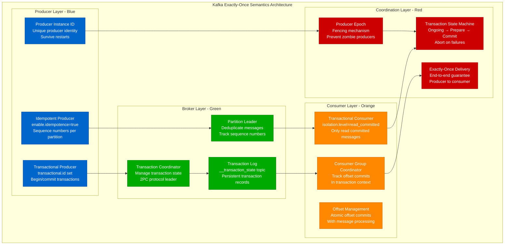
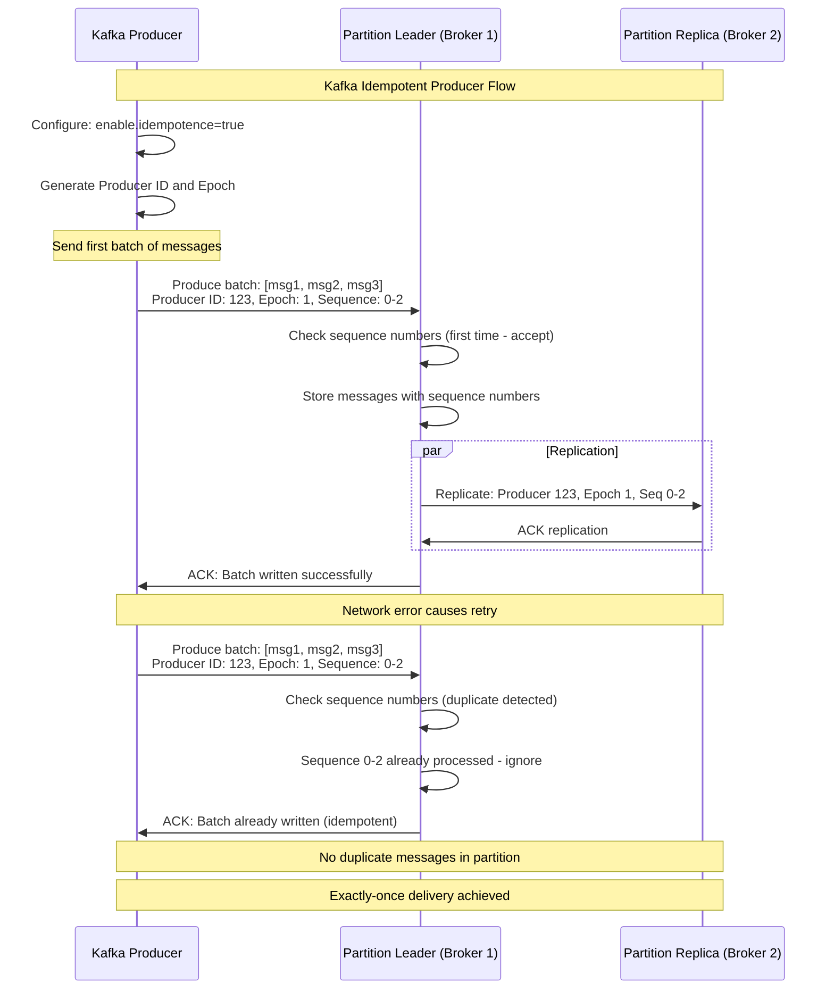
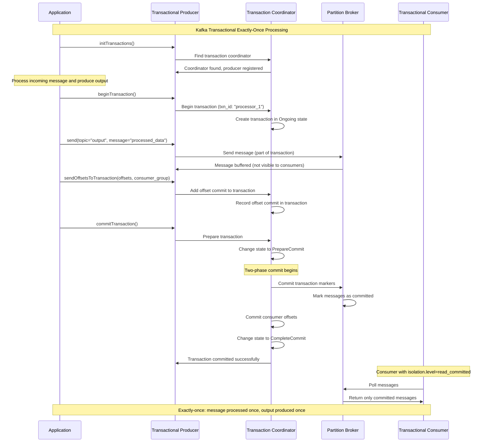
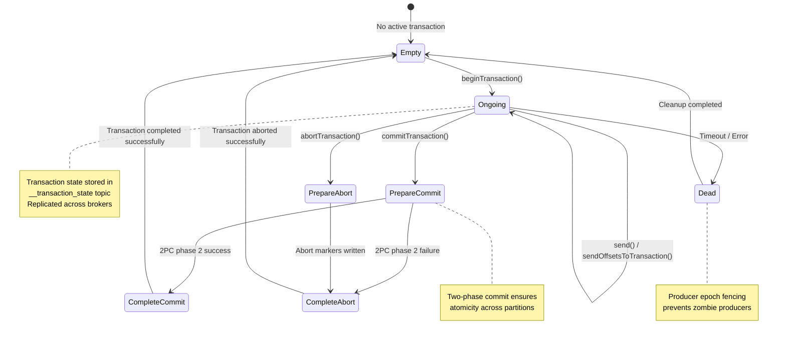
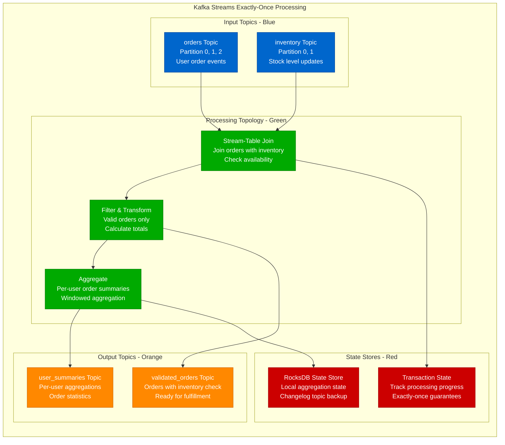
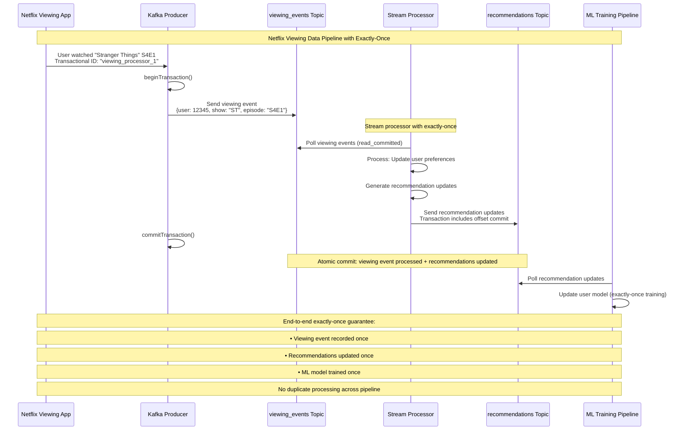
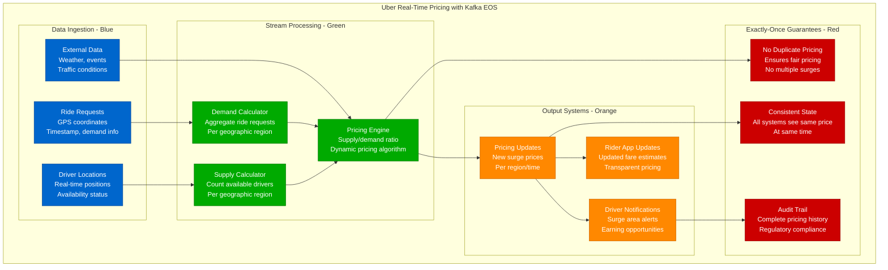
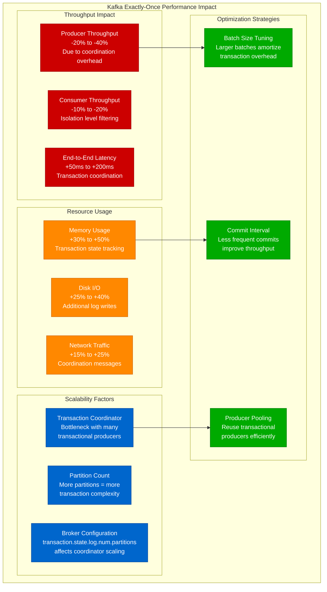
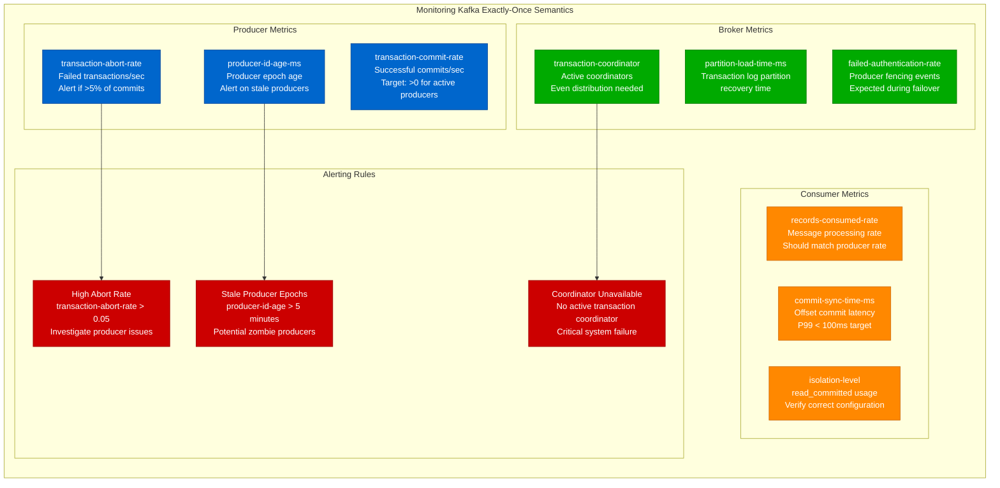

# Exactly-Once Kafka: Apache Kafka's Approach

## Overview

Apache Kafka implements exactly-once semantics (EOS) through a sophisticated combination of idempotent producers, transactional consumers, and careful coordination between brokers. This guide examines Kafka's approach, used by companies like LinkedIn, Netflix, and Uber to process trillions of messages with exactly-once guarantees.

## Kafka Exactly-Once Architecture



## Idempotent Producer Implementation



## Transactional Producer and Consumer



## Producer Fencing and Zombie Prevention

```mermaid
graph TB
    subgraph ProducerFencing[Producer Fencing Mechanism]
        subgraph ZombieProblem[Zombie Producer Problem]
            ZP1[Producer Instance 1<br/>transactional.id: "app_1"<br/>Epoch: 5<br/>Network partition]
            ZP2[Producer Instance 2<br/>transactional.id: "app_1"<br/>Epoch: 6<br/>New instance started]
            ZP3[Potential Conflict<br/>Both producers active<br/>Same transactional ID]
        end

        subgraph FencingMechanism[Fencing Mechanism]
            FM1[Transaction Coordinator<br/>Tracks producer epochs<br/>Latest epoch: 6]
            FM2[Epoch Validation<br/>Reject messages from<br/>lower epochs]
            FM3[Fencing Response<br/>ProducerFencedException<br/>Old producer shutdown]
        end

        subgraph Resolution[Resolution Process]
            R1[New Producer Wins<br/>Epoch 6 producer<br/>continues operation]
            R2[Old Producer Fenced<br/>Epoch 5 producer<br/>receives fencing error]
            R3[Clean Transition<br/>No message duplication<br/>Exactly-once maintained]
        end
    end

    ZP1 --> FM1
    ZP2 --> FM1
    ZP3 --> FM2

    FM1 --> R1
    FM2 --> R2
    FM3 --> R3

    classDef problemStyle fill:#CC0000,stroke:#990000,color:#fff
    classDef mechanismStyle fill:#FF8800,stroke:#CC6600,color:#fff
    classDef resolutionStyle fill:#00AA00,stroke:#007700,color:#fff

    class ZP1,ZP2,ZP3 problemStyle
    class FM1,FM2,FM3 mechanismStyle
    class R1,R2,R3 resolutionStyle
```

## Transaction State Management



## Stream Processing with Exactly-Once



## Netflix's Kafka Exactly-Once Implementation



## Uber's Real-Time Pricing with Kafka EOS



## Configuration and Implementation

```java
// Kafka Exactly-Once Producer Configuration
Properties producerProps = new Properties();
producerProps.put("bootstrap.servers", "broker1:9092,broker2:9092");
producerProps.put("key.serializer", "org.apache.kafka.common.serialization.StringSerializer");
producerProps.put("value.serializer", "org.apache.kafka.common.serialization.StringSerializer");

// Enable exactly-once semantics
producerProps.put("enable.idempotence", true);
producerProps.put("transactional.id", "my-transaction-id");

// Performance tuning for exactly-once
producerProps.put("acks", "all");  // Wait for all replicas
producerProps.put("retries", Integer.MAX_VALUE);  // Retry indefinitely
producerProps.put("max.in.flight.requests.per.connection", 5);
producerProps.put("delivery.timeout.ms", 120000);  // 2 minutes

KafkaProducer<String, String> producer = new KafkaProducer<>(producerProps);

// Initialize transactions
producer.initTransactions();

// Exactly-once processing loop
public void processMessages() {
    try {
        producer.beginTransaction();

        // Send messages as part of transaction
        ProducerRecord<String, String> record = new ProducerRecord<>(
            "output-topic", "key", "processed-value"
        );
        producer.send(record);

        // Commit consumer offsets as part of transaction
        Map<TopicPartition, OffsetAndMetadata> offsets = getProcessedOffsets();
        producer.sendOffsetsToTransaction(offsets, "consumer-group-id");

        // Commit transaction
        producer.commitTransaction();

    } catch (Exception e) {
        // Abort transaction on any error
        producer.abortTransaction();
        throw e;
    }
}

// Kafka Exactly-Once Consumer Configuration
Properties consumerProps = new Properties();
consumerProps.put("bootstrap.servers", "broker1:9092,broker2:9092");
consumerProps.put("group.id", "exactly-once-consumer-group");
consumerProps.put("key.deserializer", "org.apache.kafka.common.serialization.StringDeserializer");
consumerProps.put("value.deserializer", "org.apache.kafka.common.serialization.StringDeserializer");

// Read only committed messages
consumerProps.put("isolation.level", "read_committed");
consumerProps.put("enable.auto.commit", false);  // Manual offset commits only

KafkaConsumer<String, String> consumer = new KafkaConsumer<>(consumerProps);

// Kafka Streams Exactly-Once Configuration
Properties streamsProps = new Properties();
streamsProps.put(StreamsConfig.APPLICATION_ID_CONFIG, "exactly-once-stream-app");
streamsProps.put(StreamsConfig.BOOTSTRAP_SERVERS_CONFIG, "broker1:9092,broker2:9092");

// Enable exactly-once processing
streamsProps.put(StreamsConfig.PROCESSING_GUARANTEE_CONFIG,
                 StreamsConfig.EXACTLY_ONCE_V2);

// Performance and reliability settings
streamsProps.put(StreamsConfig.REPLICATION_FACTOR_CONFIG, 3);
streamsProps.put(StreamsConfig.COMMIT_INTERVAL_MS_CONFIG, 1000);  // 1 second commits

StreamsBuilder builder = new StreamsBuilder();

// Build topology with exactly-once guarantees
KStream<String, String> inputStream = builder.stream("input-topic");
KStream<String, String> processedStream = inputStream
    .filter((key, value) -> value != null)
    .mapValues(value -> processValue(value));

processedStream.to("output-topic");

KafkaStreams streams = new KafkaStreams(builder.build(), streamsProps);
streams.start();
```

## Performance Impact Analysis



## Monitoring and Debugging



## Common Issues and Solutions

### Producer Fencing Issues
```java
// Handle producer fencing gracefully
try {
    producer.commitTransaction();
} catch (ProducerFencedException e) {
    // Producer has been fenced by newer instance
    log.error("Producer fenced, shutting down: {}", e.getMessage());
    producer.close();
    // Restart application or fail gracefully
}
```

### Transaction Timeout Handling
```java
// Configure appropriate transaction timeouts
producerProps.put("transaction.timeout.ms", 300000);  // 5 minutes

try {
    producer.beginTransaction();
    // Long-running processing
    processLargeDataSet();
    producer.commitTransaction();
} catch (TimeoutException e) {
    log.warn("Transaction timed out, aborting: {}", e.getMessage());
    producer.abortTransaction();
}
```

### Consumer Lag with Read Committed
```java
// Monitor consumer lag with read_committed
// Messages may appear delayed until transaction commits
consumerProps.put("isolation.level", "read_committed");

// Use metrics to track committed vs uncommitted messages
// Adjust transaction.timeout.ms if lag becomes problematic
```

## Best Practices Checklist

### Producer Configuration
- [ ] Set unique transactional.id per application instance
- [ ] Configure enable.idempotence=true
- [ ] Set acks=all for durability
- [ ] Use appropriate transaction.timeout.ms
- [ ] Handle ProducerFencedException properly

### Consumer Configuration
- [ ] Use isolation.level=read_committed
- [ ] Disable enable.auto.commit
- [ ] Handle rebalancing during transactions
- [ ] Monitor consumer lag appropriately
- [ ] Configure max.poll.interval.ms correctly

### Operational Considerations
- [ ] Monitor transaction coordinator health
- [ ] Set up alerting for high abort rates
- [ ] Plan for producer failover scenarios
- [ ] Test recovery procedures
- [ ] Document troubleshooting procedures

## Key Takeaways

1. **Kafka EOS requires careful configuration** - Multiple settings must work together correctly
2. **Performance impact is significant** - 20-40% throughput reduction is common
3. **Coordination overhead increases with scale** - Transaction coordinator can become bottleneck
4. **Producer fencing prevents data duplication** - But requires proper error handling
5. **End-to-end exactly-once needs application cooperation** - Not just Kafka configuration
6. **Monitoring is critical** - Many metrics needed to ensure proper operation
7. **Testing failure scenarios is essential** - Producer fencing, coordinator failures, network partitions

Kafka's exactly-once semantics provide a robust foundation for building exactly-once data pipelines, but require careful implementation and monitoring to achieve the guarantees in production environments.