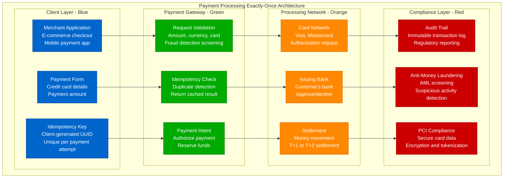
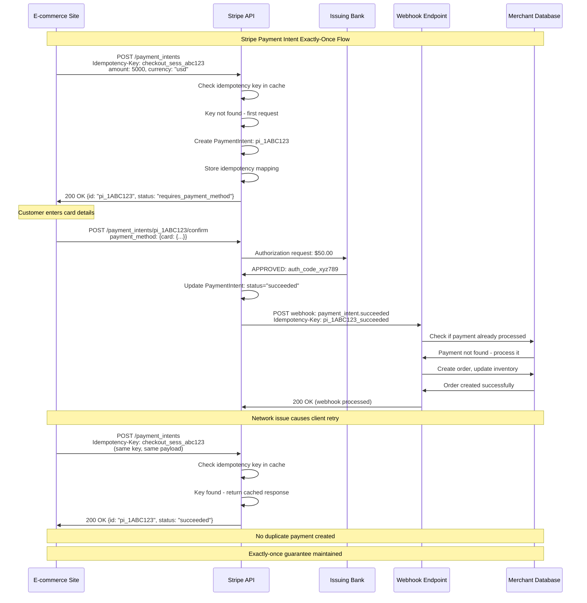
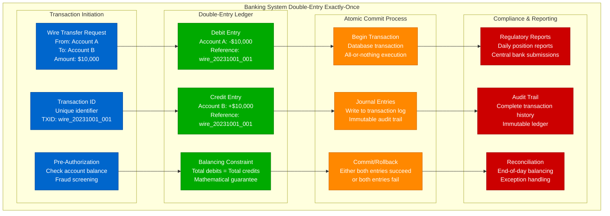
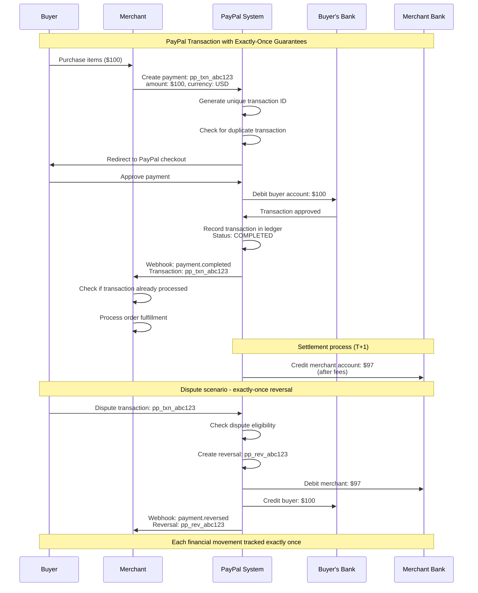
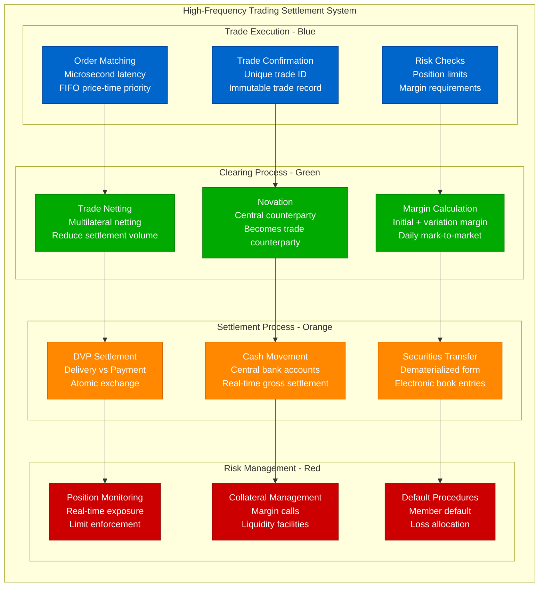
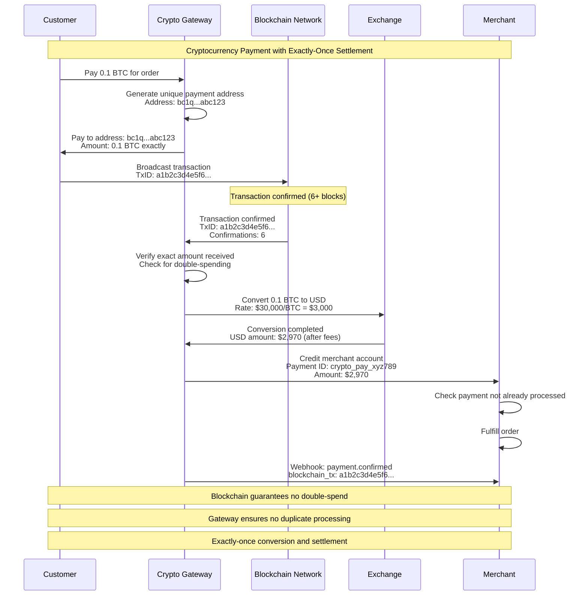
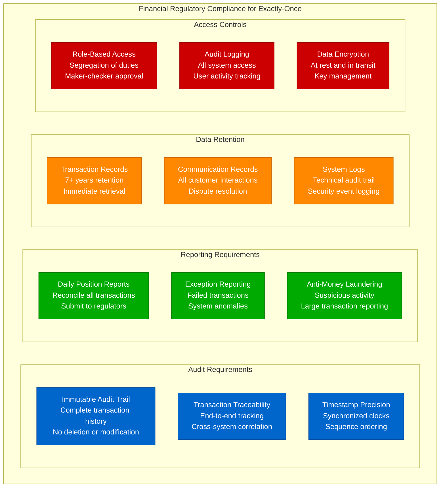
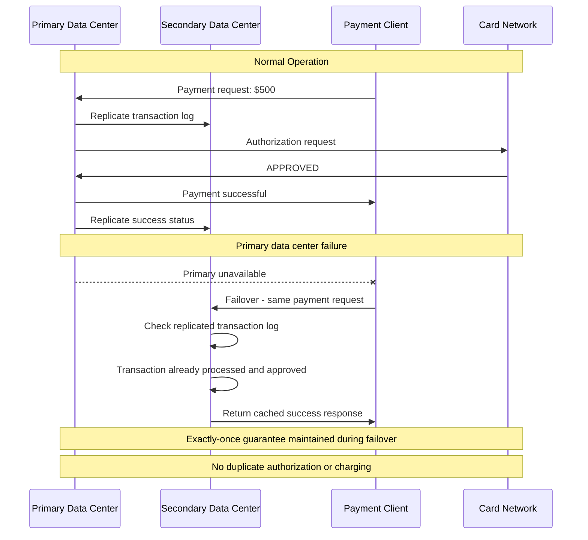
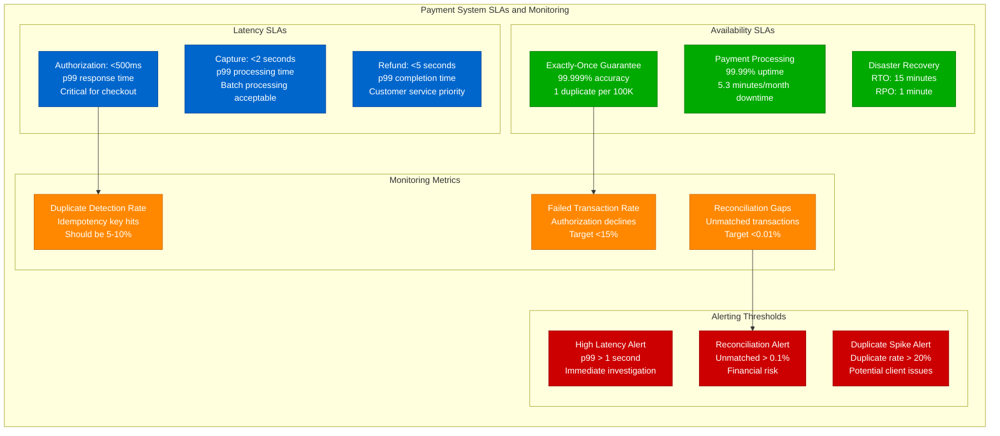

# Exactly-Once Payment Systems: Financial Transaction Patterns

## Overview

Payment systems demand the highest levels of exactly-once guarantees due to regulatory requirements and financial impact. This guide examines patterns used by Stripe, Square, PayPal, and traditional banking systems to ensure transactions are processed exactly once, with comprehensive audit trails and regulatory compliance.

## Payment Processing Architecture



## Stripe Payment Intent Flow



## Banking System Double-Entry Accounting



## PayPal Transaction Lifecycle



## High-Frequency Trading Settlement



## Cryptocurrency Payment Gateway



## Payment Implementation Code

```python
import uuid
import time
import hashlib
from enum import Enum
from typing import Optional, Dict, Any
from dataclasses import dataclass
import logging

class PaymentStatus(Enum):
    PENDING = "PENDING"
    AUTHORIZED = "AUTHORIZED"
    CAPTURED = "CAPTURED"
    FAILED = "FAILED"
    REFUNDED = "REFUNDED"

@dataclass
class PaymentIntent:
    id: str
    merchant_id: str
    amount_cents: int
    currency: str
    status: PaymentStatus
    idempotency_key: str
    created_at: float
    metadata: Dict[str, Any]

class PaymentProcessor:
    """Production payment processor with exactly-once guarantees"""

    def __init__(self, database, audit_logger):
        self.db = database
        self.audit = audit_logger
        self.logger = logging.getLogger(__name__)

    async def create_payment_intent(self, merchant_id: str, amount_cents: int,
                                  currency: str, idempotency_key: str,
                                  metadata: Dict = None) -> PaymentIntent:
        """Create payment intent with exactly-once guarantee"""

        # Check for existing payment with same idempotency key
        existing = await self.get_payment_by_idempotency_key(
            merchant_id, idempotency_key
        )
        if existing:
            self.logger.info(f"Returning existing payment for key {idempotency_key}")
            return existing

        # Validate payment parameters
        await self.validate_payment_request(merchant_id, amount_cents, currency)

        # Generate unique payment ID
        payment_id = f"pi_{uuid.uuid4().hex}"

        # Create payment intent
        payment = PaymentIntent(
            id=payment_id,
            merchant_id=merchant_id,
            amount_cents=amount_cents,
            currency=currency,
            status=PaymentStatus.PENDING,
            idempotency_key=idempotency_key,
            created_at=time.time(),
            metadata=metadata or {}
        )

        # Atomic database insertion with unique constraint on idempotency key
        try:
            await self.db.insert_payment_intent(payment)
            await self.audit.log_payment_created(payment)
            return payment

        except UniqueConstraintViolation:
            # Another request created payment first - return that one
            existing = await self.get_payment_by_idempotency_key(
                merchant_id, idempotency_key
            )
            return existing

    async def capture_payment(self, payment_id: str,
                            amount_cents: Optional[int] = None) -> Dict[str, Any]:
        """Capture authorized payment with exactly-once guarantee"""

        # Get payment with pessimistic lock
        payment = await self.db.get_payment_for_update(payment_id)
        if not payment:
            raise PaymentNotFoundError(f"Payment {payment_id} not found")

        # Check if already captured
        if payment.status == PaymentStatus.CAPTURED:
            self.logger.info(f"Payment {payment_id} already captured")
            return self.format_payment_response(payment)

        # Validate capture request
        if payment.status != PaymentStatus.AUTHORIZED:
            raise InvalidPaymentStateError(
                f"Cannot capture payment in status {payment.status}"
            )

        capture_amount = amount_cents or payment.amount_cents
        if capture_amount > payment.amount_cents:
            raise InvalidAmountError("Capture amount exceeds authorized amount")

        try:
            # Process capture with payment network
            capture_result = await self.process_network_capture(
                payment, capture_amount
            )

            # Update payment status atomically
            await self.db.update_payment_status(
                payment_id, PaymentStatus.CAPTURED
            )

            # Create immutable audit record
            await self.audit.log_payment_captured(
                payment_id, capture_amount, capture_result
            )

            # Send webhooks asynchronously (with own idempotency)
            await self.send_payment_webhook(payment, "payment.captured")

            return self.format_payment_response(payment)

        except NetworkError as e:
            self.logger.error(f"Network error capturing payment {payment_id}: {e}")
            await self.db.update_payment_status(payment_id, PaymentStatus.FAILED)
            raise PaymentProcessingError("Payment capture failed")

    async def refund_payment(self, payment_id: str, amount_cents: int,
                           reason: str, idempotency_key: str) -> Dict[str, Any]:
        """Refund payment with exactly-once guarantee"""

        # Check for existing refund with same idempotency key
        existing_refund = await self.get_refund_by_idempotency_key(
            payment_id, idempotency_key
        )
        if existing_refund:
            return self.format_refund_response(existing_refund)

        # Get payment with lock
        payment = await self.db.get_payment_for_update(payment_id)
        if not payment:
            raise PaymentNotFoundError(f"Payment {payment_id} not found")

        # Validate refund request
        if payment.status != PaymentStatus.CAPTURED:
            raise InvalidPaymentStateError(
                f"Cannot refund payment in status {payment.status}"
            )

        # Check refund amount limits
        total_refunded = await self.get_total_refunded_amount(payment_id)
        if total_refunded + amount_cents > payment.amount_cents:
            raise InvalidAmountError("Refund amount exceeds captured amount")

        # Generate unique refund ID
        refund_id = f"re_{uuid.uuid4().hex}"

        try:
            # Begin database transaction
            async with self.db.transaction():
                # Process refund with payment network
                refund_result = await self.process_network_refund(
                    payment, amount_cents, reason
                )

                # Create refund record
                refund = await self.db.create_refund(
                    id=refund_id,
                    payment_id=payment_id,
                    amount_cents=amount_cents,
                    reason=reason,
                    idempotency_key=idempotency_key,
                    network_result=refund_result
                )

                # Update payment status if fully refunded
                if total_refunded + amount_cents == payment.amount_cents:
                    await self.db.update_payment_status(
                        payment_id, PaymentStatus.REFUNDED
                    )

                # Create audit trail
                await self.audit.log_refund_processed(refund)

            # Send webhooks
            await self.send_refund_webhook(refund)

            return self.format_refund_response(refund)

        except NetworkError as e:
            self.logger.error(f"Network error refunding payment {payment_id}: {e}")
            raise RefundProcessingError("Refund processing failed")

    async def validate_payment_request(self, merchant_id: str, amount_cents: int,
                                     currency: str):
        """Validate payment request parameters"""
        if amount_cents <= 0:
            raise InvalidAmountError("Amount must be positive")

        if currency not in ["USD", "EUR", "GBP"]:  # Supported currencies
            raise UnsupportedCurrencyError(f"Currency {currency} not supported")

        # Check merchant limits
        merchant_limits = await self.get_merchant_limits(merchant_id)
        if amount_cents > merchant_limits.max_transaction_amount:
            raise MerchantLimitExceededError("Transaction exceeds merchant limits")

    async def process_network_capture(self, payment: PaymentIntent,
                                    amount_cents: int) -> Dict[str, Any]:
        """Process capture with payment network"""
        # Implementation depends on specific payment processor
        # (Stripe, Square, traditional bank, etc.)
        pass

# Database schema for exactly-once guarantees
CREATE_TABLES_SQL = """
-- Payment intents table with idempotency key constraint
CREATE TABLE payment_intents (
    id VARCHAR(255) PRIMARY KEY,
    merchant_id VARCHAR(255) NOT NULL,
    amount_cents INTEGER NOT NULL,
    currency VARCHAR(3) NOT NULL,
    status VARCHAR(50) NOT NULL,
    idempotency_key VARCHAR(255) NOT NULL,
    created_at TIMESTAMP NOT NULL,
    updated_at TIMESTAMP NOT NULL,
    metadata JSONB,

    -- Ensure exactly-once per merchant + idempotency key
    UNIQUE(merchant_id, idempotency_key)
);

-- Refunds table with idempotency key constraint
CREATE TABLE refunds (
    id VARCHAR(255) PRIMARY KEY,
    payment_id VARCHAR(255) NOT NULL REFERENCES payment_intents(id),
    amount_cents INTEGER NOT NULL,
    reason TEXT,
    idempotency_key VARCHAR(255) NOT NULL,
    created_at TIMESTAMP NOT NULL,
    network_transaction_id VARCHAR(255),

    -- Ensure exactly-once refund per payment + idempotency key
    UNIQUE(payment_id, idempotency_key)
);

-- Immutable audit log
CREATE TABLE payment_audit_log (
    id SERIAL PRIMARY KEY,
    payment_id VARCHAR(255) NOT NULL,
    event_type VARCHAR(100) NOT NULL,
    event_data JSONB NOT NULL,
    timestamp TIMESTAMP NOT NULL DEFAULT NOW(),

    -- Immutable - no updates or deletes allowed
    -- Only inserts for complete audit trail
);

-- Indexes for performance
CREATE INDEX idx_payment_intents_merchant_created ON payment_intents(merchant_id, created_at);
CREATE INDEX idx_refunds_payment_id ON refunds(payment_id);
CREATE INDEX idx_audit_log_payment_timestamp ON payment_audit_log(payment_id, timestamp);
"""
```

## Regulatory Compliance Requirements



## Disaster Recovery and Business Continuity



## Performance Monitoring and SLAs



## Testing and Validation Strategies

### Load Testing with Exactly-Once Validation
```python
import asyncio
import random
from concurrent.futures import ThreadPoolExecutor

async def test_payment_idempotency_under_load():
    """Test payment system under high load with duplicate detection"""

    payment_processor = PaymentProcessor()
    results = []

    # Generate test scenarios
    test_scenarios = []
    for i in range(1000):
        # 10% of requests are intentional duplicates
        if random.random() < 0.1 and i > 0:
            # Reuse previous idempotency key (simulate retry)
            idempotency_key = test_scenarios[i-1]["idempotency_key"]
        else:
            idempotency_key = f"test_payment_{i}_{uuid.uuid4().hex}"

        test_scenarios.append({
            "merchant_id": f"merchant_{random.randint(1, 10)}",
            "amount_cents": random.randint(100, 10000),
            "currency": "USD",
            "idempotency_key": idempotency_key
        })

    # Execute concurrent requests
    with ThreadPoolExecutor(max_workers=50) as executor:
        tasks = [
            executor.submit(payment_processor.create_payment_intent, **scenario)
            for scenario in test_scenarios
        ]

        for task in tasks:
            try:
                result = task.result(timeout=10)
                results.append(result)
            except Exception as e:
                print(f"Payment failed: {e}")

    # Validate exactly-once guarantees
    payment_ids = [r.id for r in results]
    unique_payments = set(payment_ids)

    assert len(payment_ids) == len(unique_payments), "Duplicate payments created!"

    # Check idempotency key effectiveness
    idempotency_keys = [r.idempotency_key for r in results]
    unique_keys = set(idempotency_keys)

    duplicate_count = len(idempotency_keys) - len(unique_keys)
    print(f"Detected and handled {duplicate_count} duplicate requests")

    assert duplicate_count >= 90, "Should detect ~100 duplicates (10% of 1000)"
```

## Key Takeaways

1. **Financial regulations demand exactly-once** - No room for "eventually consistent" in money movement
2. **Idempotency keys are essential** - Client-generated keys enable safe retries
3. **Audit trails must be immutable** - Complete transaction history for compliance
4. **Double-entry accounting provides natural exactness** - Mathematical constraints prevent errors
5. **Performance requirements are strict** - Sub-second authorization times expected
6. **Disaster recovery must maintain exactness** - Failover cannot create duplicates
7. **Testing must cover all failure scenarios** - Network issues, database failures, concurrent access
8. **Monitoring and alerting are critical** - Early detection of duplicate transactions prevents financial loss

Payment systems represent the most demanding use case for exactly-once delivery, where the consequences of failure include financial loss, regulatory violations, and loss of customer trust. The patterns and practices developed for payment systems often serve as templates for other critical exactly-once scenarios.